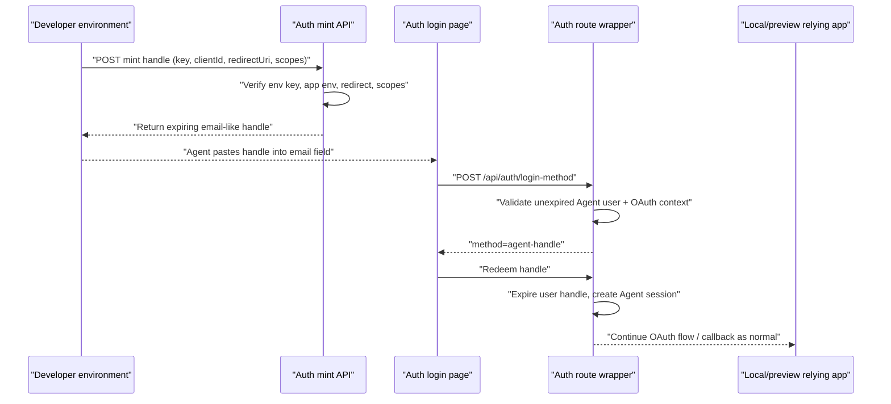

# feat: Add agent login handles

## Overview

Add an Auth-owned way for trusted developer environments to mint short-lived,
email-like agent login handles. Agents paste the handle into the existing
Auth email field, click Continue, and Auth redeems the handle into the normal
OAuth/browser session path for approved local or preview first-party clients.

The core implementation lives in `apps/auth`; relying apps should not grow
local auth bypasses.

## Problem Frame

Browser-driving agents need to validate local Forge apps that use Production
Auth as the identity authority. A local app bypass would skip the real Auth
redirect, login, callback, and app-local session behavior. The plan follows the
origin decision to keep the real Auth UI in the flow while replacing static
shared passwords with generated email-like handles (see origin:
`docs/brainstorms/2026-06-11-agent-login-flow-requirements.md`).

## Requirements Trace

- R1-R3. Agent identities are represented distinctly and scoped to approved
  app environments.
- R4-R7. Trusted developer environments can mint short-lived, bearer-style
  email-like handles with scope caps and no raw-value logging.
- R8-R11. Existing login UI stays visually ordinary; valid handles redeem from
  the email-first Continue step without password, email validation, CAPTCHA, or
  manual MFA.
- R12-R14. Redemption is limited to approved local/preview OAuth clients and
  exact redirect URLs while preserving existing OAuth callback behavior.
- R15-R18. Sessions, minting, and redemption are auditable; minting keys rotate
  independently; apps still own app-specific authorization.

## Scope Boundaries

- Do not add app-local auth bypasses to Admin, Manager, Mastra Gateway, or Web.
- Do not expose public signup or public handle minting.
- Do not require static shared passwords or inbox-backed agent email accounts.
- Do not make Auth own Admin/Manager/Mastra app-specific ABAC.
- Do not allow production relying-client callbacks for handle redemption in
  this first slice.
- Do not replace the existing OAuth/OIDC relying-client model.

## Context & Research

### Relevant Code and Patterns

- `apps/auth/AGENTS.md` and `apps/auth/CLAUDE.md` establish Auth as the identity,
  app registration, OAuth/OIDC, token, audit, and revocation authority.
- `apps/auth/prisma/schema.prisma` already contains `User`, `Session`, app
  registry, grant, token, and audit models. This is the right place for Agent
  identity metadata and generic user expiry.
- `apps/auth/src/app/api/auth/[...all]/route.ts` wraps Better Auth routes and
  already owns login-method lookup, email sign-in, public signup blocking,
  Firebase fallback, rate limiting, dynamic preview redirect registration, and
  audit-safe email hashing.
- `apps/auth/src/app/login/login-page-client.tsx` already performs an email-first
  lookup via `/api/auth/login-method`, then either starts provider login or shows
  the password step. That lookup is the clean insertion point for agent handle
  redemption while keeping the visible UI ordinary.
- `apps/auth/src/domain/apps.ts` seeds local OAuth clients for Admin, Manager,
  and Mastra Studio with exact localhost callback URLs.
- `apps/auth/src/services/app-registry.service.ts` already has exact redirect
  URI policy helpers and production approval checks.
- `apps/auth/src/services/audit.service.ts` centralizes redaction and hash-based
  audit event construction.

### Institutional Learnings

- `docs/solutions/auth/spike-auth-header-must-be-env-gated.md` reinforces that
  development-only auth conveniences need explicit env-gated controls. The
  minting key follows that pattern, while the app environment remains the scope
  and redirect policy source of truth.
- `docs/solutions/security-issues/pre-verification-log-field-namespace-pollution-20260518.md`
  warns that pre-verification identifiers need distinct field names. Handle
  mint/redeem logs must avoid treating a presented handle as a verified agent
  identity until redemption succeeds.

### External References

- Better Auth API docs: server-side `auth.api` endpoints can be called directly,
  and response headers/cookies can be obtained with `asResponse` or
  `returnHeaders`.
- Better Auth plugin docs: custom endpoints/plugins are the supported extension
  point when built-in authentication methods are not enough.

## Key Technical Decisions

- **Env-backed minting key plus expiring users:** The feature needs a trusted
  developer-environment gate, local/preview policy, expiry, single-use
  redemption, and audit. A DB-backed issuer-secret table is unnecessary for the
  first slice.
- **Use generic user expiry:** Store the generated email-like handle on the
  Agent user and use `User.expiresAt` as the redeemable-until/consumed marker.
- **Email-like handle, not real email:** Use a reserved internal domain such as
  `agent-login.jesusfilm.internal` so the existing email input accepts the value
  while making it visually clear that the value is a login handle, not an inbox.
- **Redeem during login-method lookup:** Add a new login-method result branch
  for valid handles. The client can redirect or submit to a redemption endpoint
  without showing the password step.
- **No production callback redemption in v1:** Allow only local and preview
  app environments. This keeps the feature aimed at QA and avoids turning handle
  minting into a broad production login bypass.
- **Prefer a Better Auth-supported session path:** Implementation should first
  look for a stable Better Auth API/plugin path that creates a browser session
  and sets cookies. If the exact API shape is not stable, keep that discovery
  inside the Auth service boundary and cover it with route-level integration
  tests.
- **Preserve grant-based app access:** A redeemed handle should authenticate a
  Agent user that still satisfies the relevant Auth app grant/scope checks.
  The handle is not permission by itself; it is an automation-friendly way to
  enter the same Auth-owned identity and grant model.

## Open Questions

### Resolved During Planning

- **Where should handle detection occur?** Use `/api/auth/login-method`, because
  it already receives the email value before password entry and feeds the
  existing Continue button behavior.
- **How should minting credentials be stored?** DB-backed, because scoped
  rotation and audit are product requirements rather than nice-to-haves.
- **Which environments can redeem handles?** Local and preview only for v1.

### Resolved During Implementation

- **Exact Better Auth session creation API:** Implemented as a custom Better
  Auth plugin endpoint using Better Auth's internal adapter session creation
  and cookie helper.
- **Final handle string grammar:** Handles use the reserved
  `agent-login.jesusfilm.internal` domain with a harmless client label and
  random secret segment.
- **Operator creation path for minting keys:** Implemented through environment
  configuration for the first slice; no DB seed step is required.

## High-Level Technical Design

> _This illustrates the intended approach and is directional guidance for review, not implementation specification. The implementing agent should treat it as context, not code to reproduce._

## Implementation Units

- [x] **Unit 1: Persist agent identity and expiry**

**Goal:** Add Auth-owned persistence for Agent user classification and generic
user expiry.

**Requirements:** R1-R7, R15-R17

**Dependencies:** None

**Files:**

- Modify: `apps/auth/prisma/schema.prisma`
- Create: `apps/auth/prisma/migrations/<timestamp>_agent_login_users/migration.sql`
- Modify: `apps/auth/src/generated/prisma/*` (generated by Prisma)
- Test: `apps/auth/src/services/agent-login.service.test.ts`

**Approach:**

- Add a small user actor classification. Prefer an enum column on `User`
  defaulting to human/staff-compatible behavior so existing users remain
  unchanged.
- Add a generic nullable `expiresAt` field on `User` for expiring agent login
  users and future user-expiry use cases.
- Link or create app grants for agent users deliberately, rather than
  relying on global membership alone, so relying apps keep their normal access
  assumptions.
- Treat raw handle values and minting keys as bearer credentials.

**Execution note:** Implement persistence tests first for expiry and single-use
user update transitions before wiring HTTP routes.

**Patterns to follow:**

- `apps/auth/prisma/schema.prisma` for app registry and token/audit model style.
- `apps/auth/src/services/revocation.service.ts` for token hash and audit
  metadata expectations.
- `apps/auth/src/services/audit.service.ts` for redaction.

**Test scenarios:**

- Happy path: creating a handle stores only a hash and returns the raw handle
  once.
- Happy path: a known raw handle resolves to the expected active handle record
  before expiry.
- Edge case: expired handles cannot be resolved as redeemable.
- Edge case: redeemed handles cannot be resolved again.
- Error path: missing/invalid minting key cannot mint a new handle.
- Error path: requested scopes outside the app environment defaults are rejected.

**Verification:**

- Prisma migration represents the new state without changing existing human
  login defaults.
- Unit tests prove mint/redeem lifecycle and scope policy behavior.

- [x] **Unit 2: Add minting policy and protected mint API**

**Goal:** Let approved developer environments mint scoped agent login handles via
an Auth API guarded by an environment-provided minting key.

**Requirements:** R3-R7, R12-R17

**Dependencies:** Unit 1

**Files:**

- Create: `apps/auth/src/services/agent-login.service.ts`
- Create: `apps/auth/src/app/api/agent-login/mint/route.ts`
- Modify: `apps/auth/src/services/app-registry.service.ts`
- Test: `apps/auth/src/services/agent-login.service.test.ts`
- Test: `apps/auth/src/app/api/agent-login/mint/route.test.ts`

**Approach:**

- Require a bearer-style minting key from the developer environment.
- Validate the requested `clientId`, `redirectUri`, and scopes against an
  active local or preview first-party app environment.
- Reject production environments, unknown clients, non-exact redirect URIs,
  and scopes outside the app environment defaults.
- Create an expiring agent user for the minted handle.
- Ensure the Agent user has an active app grant for the target app
  environment and no broader grants than the requested app environment permits.
- Emit audit events for mint success/failure without logging raw handles.
- Apply rate limiting to mint attempts and redeem attempts so a leaked or
  guessed handle-shaped value cannot be brute-forced through the login surface.

**Patterns to follow:**

- `apps/auth/src/services/app-registry.service.ts` for exact redirect checks.
- `apps/auth/src/domain/scopes.ts` for scope validation.
- `apps/auth/src/app/api/auth/[...all]/route.ts` for route-level rate limiting
  and generic error posture.

**Test scenarios:**

- Happy path: valid minting key + local client + exact redirect + allowed
  scopes returns an email-like handle.
- Happy path: valid preview client with exact approved redirect is accepted.
- Error path: missing/invalid minting key returns unauthorized and does not
  create a handle.
- Error path: production client id is rejected even when scopes are valid.
- Error path: redirect URI mismatch is rejected.
- Error path: requested scope outside the app environment defaults is rejected.
- Security regression: response and audit metadata do not include raw minting
  key or raw handle after creation.

**Verification:**

- Mint API can produce a handle for local Admin/Manager/Mastra clients and
  rejects production clients.

- [x] **Unit 3: Redeem handles through the existing email-first login flow**

**Goal:** Make a valid email-like handle entered into the existing email field
redeem directly into a normal Auth browser session and OAuth continuation.

**Requirements:** R2, R8-R14, R15, R17

**Dependencies:** Units 1-2

**Files:**

- Modify: `apps/auth/src/app/api/auth/[...all]/route.ts`
- Modify: `apps/auth/src/app/login/login-page-client.tsx`
- Modify: `apps/auth/src/auth/config.ts`
- Test: `apps/auth/src/app/api/auth/[...all]/route.test.ts`
- Test: `apps/auth/src/app/login/page.ui.test.tsx`

**Approach:**

- Extend `/api/auth/login-method` to detect the reserved handle domain and
  validate the handle plus OAuth context before returning a new method branch
  such as `agent-handle`.
- Add a redemption endpoint or route-wrapper branch that marks the handle
  redeemed and creates the Auth browser session for the Agent user.
- Preserve normal email behavior: ordinary email addresses still route to
  provider or password flow.
- Preserve form semantics: visible UI remains email field + Continue; the user
  should not see a special Agent button.
- Include agent identity metadata in ID/userinfo claims where relying apps can
  audit it without owning Auth policy.

**Execution note:** Add route-level tests before changing the client; this
prevents accidentally routing normal emails into the handle path.

**Patterns to follow:**

- `apps/auth/src/app/api/auth/[...all]/route.ts` for OAuth continuation,
  form-post redirects, and last-login-method cookies.
- `apps/auth/src/app/login/login-page-client.tsx` for login-method branching.
- Better Auth API/plugin docs for session/cookie creation.

**Test scenarios:**

- Happy path: valid handle entered during an OAuth login-method request returns
  the agent-handle method and redemption redirects to OAuth continuation.
- Happy path: successful redemption sets the Better Auth session cookie and
  does not show the password field.
- Happy path: the resulting user/token claims satisfy existing app grant/scope
  checks for the target relying client.
- Happy path: normal human email still routes to provider/password exactly as
  before.
- Edge case: handle-shaped email with invalid/expired token falls back to a
  generic login failure without leaking existence.
- Error path: handle presented without OAuth context or with mismatched
  redirect/client is rejected.
- Error path: second redemption attempt fails and does not issue a new session.
- Integration: local app OAuth continuation still uses Better Auth's normal
  authorize/callback flow after handle redemption.

**Verification:**

- Browser QA can paste a minted handle, click Continue, and land back in a local
  relying app with a normal app-local session.

- [x] **Unit 4: Add policy, audit, and operator visibility**

**Goal:** Make Agent minting and redemption operationally visible without
polluting human-user audit views or leaking pre-verification identifiers.

**Requirements:** R1, R15-R18

**Dependencies:** Units 1-3

**Files:**

- Modify: `apps/auth/src/services/audit.service.ts`
- Modify: `apps/auth/src/app/dashboard/audit/page.tsx`
- Modify: `apps/auth/src/app/dashboard/users/page.tsx`
- Test: `apps/auth/src/services/agent-login.service.test.ts`
- Test: `apps/auth/src/services/revocation.service.test.ts` or a new focused
  audit test if cleaner

**Approach:**

- Add event names for mint success, mint rejection, redeem success, redeem
  rejection, and handle expiration/revocation where applicable.
- Use distinct pre-verification metadata names such as `presentedHandleHash` or
  `attemptedHandleHash`; only use canonical agent/user fields after successful
  redemption.
- Show actor type in user/operator surfaces enough that agent users are not
  mistaken for human staff.
- Avoid adding broad mutating dashboard controls in this first slice unless
  required for minting-key rotation.

**Patterns to follow:**

- `docs/solutions/security-issues/pre-verification-log-field-namespace-pollution-20260518.md`
  for trust-state field naming.
- `apps/auth/src/app/dashboard/audit/page.tsx` for existing audit rendering.

**Test scenarios:**

- Happy path: mint success audit includes app/client/environment/scope metadata
  but not the raw handle.
- Happy path: redeem success audit identifies the Agent user and app context.
- Error path: invalid handle redemption logs only attempted/pre-verification
  fields, not verified actor fields.
- UI: dashboard user rows distinguish agent users from humans.

**Verification:**

- Operators can tell Agent activity apart from human activity without seeing
  raw secrets.

- [x] **Unit 5: Add developer environment ergonomics and docs**

**Goal:** Give developers and agents a clear way to obtain and use a handle
without manually composing API requests.

**Requirements:** R4-R7, R16-R17

**Dependencies:** Units 1-2

**Files:**

- Modify: `apps/auth/.env.example`
- Modify: `apps/auth/CLAUDE.md`
- Modify: `apps/auth/AGENTS.md`
- Create: `apps/auth/src/scripts/mint-agent-login-handle.ts` or equivalent
  repo-standard script path
- Modify: `apps/auth/package.json`
- Test: `apps/auth/src/scripts/mint-agent-login-handle.test.ts` if the
  script contains meaningful parsing/policy logic; otherwise cover the service
  only and keep the script thin

**Approach:**

- Document how the developer-environment minting key is provisioned and
  rotated.
- Add a thin helper script that calls the mint API or service with app/client,
  redirect URI, scopes, and expiry inputs.
- Keep output plaintext-once and avoid printing secrets in verbose logs.
- Include examples for local Admin, Manager, and Mastra Studio clients.

**Patterns to follow:**

- `apps/auth/src/scripts/seed-first-party-apps.ts` for Auth script style.
- `apps/auth/.env.example` for safe env documentation.

**Test scenarios:**

- Happy path: helper accepts local app/client/scopes and prints exactly one
  handle value.
- Error path: missing minting key or invalid app/client fails with a clear
  non-secret error.
- Security regression: helper output does not echo the minting key.

**Verification:**

- A developer or agent can mint a local browser validation login handle from documented inputs
  without editing app code or `.env` files by hand.

## System-Wide Impact

- **Interaction graph:** Mint API -> agent login service -> expiring Agent user
  and grant -> login-method route -> redemption route -> Better Auth
  session/OAuth continuation -> relying app callback.
- **Error propagation:** Mint/redeem failures should use generic client-facing
  errors while audit receives enough redacted metadata for operations.
- **State lifecycle risks:** Agent users must transition atomically from
  unexpired to expired so concurrent redemption cannot create duplicate
  sessions. Expired handles should fail closed.
- **API surface parity:** Normal human login, social provider login, Firebase
  fallback, public signup blocking, and dynamic preview redirect behavior remain
  unchanged.
- **Integration coverage:** Route-level tests must prove cookies and redirects,
  not just isolated service return values.
- **Unchanged invariants:** Relying apps still own domain authorization after
  Auth proves identity and grants.

## Risks & Dependencies

| Risk                                              | Mitigation                                                                                                                    |
| ------------------------------------------------- | ----------------------------------------------------------------------------------------------------------------------------- |
| Handle becomes a broad production bypass          | Restrict minting and redemption to local/preview clients in v1; explicitly reject production app environments.                |
| Raw handles leak in logs                          | Redact audit metadata and add regression tests for raw-value absence.                                                         |
| Better Auth lacks a stable manual session API     | Encapsulate the chosen session creation mechanism in Auth-local service/route code and test `Set-Cookie` behavior end to end. |
| Concurrent redemption reuses one handle           | Use a transactional `User.expiresAt` update and test double redemption.                                                       |
| Agent identities are confused with humans         | Add actor classification, claims/audit metadata, and dashboard labels.                                                        |
| Scope caps drift from app environment scopes      | Validate requested scopes against the app environment/default scope policy.                                                   |
| Handle-shaped values become a brute-force surface | Use enough entropy, hash lookups, generic failures, existing route rate limits, and no distinguishable login UI errors.       |

## Documentation / Operational Notes

- Provision minting keys through environment configuration, not git.
- Document the reserved handle domain and warn that generated handles are
  bearer login credentials.
- Add runbook notes for rotating a developer-environment minting key.
- Update roadmap ticket `docs/roadmap/platform/feat-177-agent-login-handles.md`
  as the implementation progresses.

## Completion Notes

- Added expiring Agent users with local/preview-only policy, exact redirect
  validation, scope caps, and single-use redemption.
- Added `POST /api/agent-login/mint` plus a mint helper script for developer
  environments.
- Added a Better Auth plugin endpoint that redeems a valid handle into a normal
  browser session, then continues the existing OAuth flow.
- Kept the visible login UI as the ordinary email field plus Continue button;
  valid handles skip password entry without adding QA-specific copy.
- Added actor type claims and dashboard labels so agent users are
  distinguishable from humans.
- Verified with `pnpm --filter @forge/auth typecheck`,
  `pnpm --filter @forge/auth lint`, and `pnpm --filter @forge/auth test`.

## Sources & References

- **Origin document:** `docs/brainstorms/2026-06-11-agent-login-flow-requirements.md`
- Auth package guide: `apps/auth/CLAUDE.md`
- Auth route wrapper: `apps/auth/src/app/api/auth/[...all]/route.ts`
- Login client: `apps/auth/src/app/login/login-page-client.tsx`
- App registry seeds: `apps/auth/src/domain/apps.ts`
- Credential storage learning: `docs/solutions/architecture-patterns/db-backed-vs-env-csv-credential-storage-20260518.md`
- Pre-verification logging learning: `docs/solutions/security-issues/pre-verification-log-field-namespace-pollution-20260518.md`
- Better Auth API docs: `https://better-auth.com/docs/concepts/api`
- Better Auth plugin docs: `https://better-auth.com/docs/concepts/plugins`
