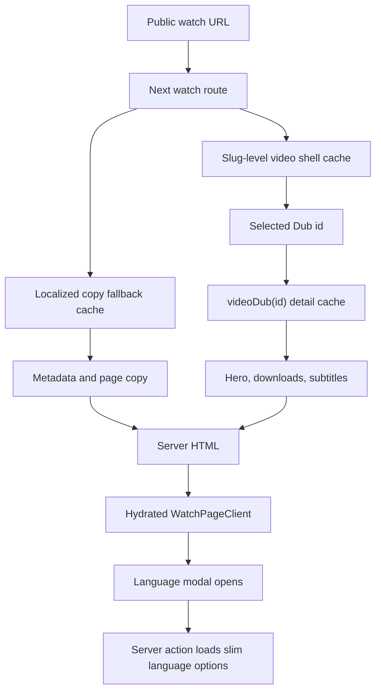

# fix: Watch Non-Cloudflare Performance

## Summary

Harden the Watch page before adding Cloudflare HTML caching. The app should
always use the optimized MuxVideo hero backend, resolve localized pages through
lighter server-side data paths, server-render SEO-bearing transcript and
question content, and remove large language-picker data from the initial client
payload.

---

## Problem Frame

The completed Watch launch-readiness and poster-first work fixed the largest
metadata and media-startup regressions. Live validation still shows app-owned
performance risks that Cloudflare should not mask: the hero can still ship the
old MuxPlayer branch, localized watch routes can 500 or take tens of seconds,
and the page still serializes more client data than first paint needs.

SEO is a hard constraint. Title metadata, localized copy, study questions, and
transcript text must remain available in initial server HTML. The optimization
target is server work, player weight, serialized data, and interaction code,
not hiding indexable content behind client-side fetches.

---

## Requirements

- R1. `HeroPlayer` always uses the optimized `MuxVideo` backend after
  activation and no longer reads the watch hero MuxVideo rollout flag.
- R2. The watch hero keeps poster-first render, delayed idle muted activation,
  immediate click-to-play behavior, `?autoplay=1` behavior, Mux Data metadata,
  and bounded HLS config.
- R3. Watch page metadata and body content remain server-rendered before
  hydration, including title, description, Open Graph, Twitter, canonical,
  hreflang, JSON-LD, `<html lang>`, H1, localized copy, study questions, and
  selected transcript text.
- R4. Localized watch routes no longer run sequential full `videoBySlug`
  fallback queries that fetch every heavy Dub/download/subtitle field.
- R5. The server resolver uses cached payloads split by data stability:
  slug-level video shell, selected Dub details, and localized copy fallback.
- R6. Language picker options are not serialized in the first page payload;
  the modal loads slim language rows only when opened.
- R7. Public watch URLs, canonical host ownership, and social URL ownership
  stay unchanged.
- R8. Cloudflare cache rules and route-level TTL increases stay deferred until
  app behavior is stable.

---

## Key Technical Decisions

- KTD1. Graduate MuxVideo instead of flipping an environment flag. The prior
  rollout path has enough evidence, and keeping the flag preserves the risk of
  rebuilding the slower MuxPlayer branch.
- KTD2. Split server queries by payload purpose. The current full watch
  fragment combines route identity, localized copy, Dubs, downloads, subtitles,
  relations, and metadata; fallback multiplies that cost on non-English pages.
- KTD3. Use existing admin public GraphQL fields first. `videoBySlug` can load
  a slim shell and Dub list, while `videoDub(id)` already exists to lazily load
  one Dub's downloads and subtitles.
- KTD4. Treat transcript text as SEO content. The selected audio transcript
  should be fetched and parsed on the server with cache, then hydrated for
  highlighting and seeking.
- KTD5. Treat language picker rows as interaction data. SEO language discovery
  is provided by server-rendered hreflang links, so the modal's row list can
  load on open without hurting crawlers.
- KTD6. Defer Cloudflare and ISR policy changes. Edge caching should accelerate
  a healthy app, not hide route 500s, resolver fan-out, or missing server HTML.

---

## High-Level Technical Design

The route still resolves the complete page on the server. The browser receives
SEO-bearing HTML first, then hydrates playback and modal interactions.

---

## Implementation Units

### U1. Remove the Hero MuxPlayer Rollout Flag

- **Goal:** Make the optimized MuxVideo backend the only watch hero player path.
- **Requirements:** R1, R2.
- **Dependencies:** None.
- **Files:** `apps/web/src/components/watch/HeroPlayer.tsx`,
  `apps/web/src/components/watch/__tests__/HeroPlayer.test.tsx`,
  `apps/web/src/env.ts`, `apps/web/.env.example`,
  `apps/web/src/lib/feature-flags.ts`,
  `apps/web/src/lib/feature-flags.test.ts`,
  `packages/feature-flags/src/registry.ts`,
  `packages/feature-flags/src/launchdarkly.test.ts`,
  `apps/web/package.json`, `pnpm-lock.yaml`, `apps/web/CLAUDE.md`.
- **Approach:** Remove the `NEXT_PUBLIC_FORGE_WATCH_HERO_MUX_VIDEO` branch,
  `MuxPlayer` dynamic import, MuxPlayer-only CSS custom properties, app env
  entries, and shared LaunchDarkly registry entry. Keep `@forge/video-player`
  exporting `MuxPlayer` for package-level compatibility, but remove the app's
  direct `@mux/mux-player-react` dependency if no app runtime or test import
  remains.
- **Patterns to follow:** Existing MuxVideo props in `HeroPlayer.tsx`; prior
  subpath-import guidance in
  `docs/solutions/performance-issues/web-watch-route-lighthouse-perf-campaign-lcp-bundle-fonts-20260527.md`.
- **Test scenarios:**
  - Given normal idle activation, `HeroPlayer` mounts `MuxVideo` and never calls
    the MuxPlayer mock.
  - Given `?autoplay=1`, activation stays immediate and the URL cleanup still
    removes the one-shot autoplay parameter.
  - Given a user clicks "Play with Sound" before idle activation, unmuted play
    still starts through the gesture-safe path.
  - Given MuxVideo emits `canplay`, the loading overlay clears.
  - Given MuxVideo `play()` rejects with `NotAllowedError`, autoplay-blocked
    state is set.
- **Verification:** Focused HeroPlayer and feature-flag tests pass; a bundle
  check or browser resource timing shows no MuxPlayer/cast chunk on the watch
  route.

### U2. Split the Watch Video Resolver Payload

- **Goal:** Stop localized pages from repeating full heavy `videoBySlug`
  queries during fallback.
- **Requirements:** R3, R4, R5, R7.
- **Dependencies:** None.
- **Files:** `apps/web/src/lib/content.ts`,
  `apps/web/src/lib/fragments/watch-video.ts`,
  `apps/web/src/lib/fragments/__tests__/watch-video.test.ts`,
  `apps/web/src/lib/__tests__/content-watch-merge.test.ts`,
  `apps/web/src/app/[locale]/[htmlLang]/[...rest]/__tests__/page-routing.test.tsx`.
- **Approach:** Replace the single full watch fragment with smaller operations:
  a slug-level shell with images, relations, Bible citations, and slim Dubs; a
  localized-copy query for locales, relation titles, and study questions; and a
  selected `videoDub(id)` detail query for downloads, Mux playback, duration,
  and subtitles. Run exact-language, broad-locale, and English fallback only
  against localized-copy fields, then merge server-side into the existing
  resolved render shape.
- **Patterns to follow:** Existing `unstable_cache` wrappers in `content.ts`;
  `videoDub(id)` public resolver contract in `apps/admin/src/graphql/types/video.ts`.
- **Test scenarios:**
  - Given an English watch route, the resolver returns the same selected Dub,
    metadata fields, related videos, questions, and subtitles as before.
  - Given a non-English route with exact localized copy, fallback does not query
    broad or English copy.
  - Given a non-English route missing relation titles or study questions, the
    resolver merges fallback copy without replacing available exact fields.
  - Given a playable route with many Dubs, only slim Dub fields are loaded in
    the shell and selected heavy fields come from `videoDub(id)`.
  - Given Romanian, Russian, Spanish, Bangla, and German public watch URLs,
    route tests assert 200 or expected not-found behavior rather than 500.
- **Verification:** Resolver tests prove fallback call count and merge behavior;
  route tests cover localized public URL rewrites; no generated GraphQL files
  change unless admin SDL changes are actually required.

### U3. Server-Render Selected Transcript Text

- **Goal:** Make transcript text indexable without moving transcript
  interaction into the critical path.
- **Requirements:** R3, R5.
- **Dependencies:** U2.
- **Files:** `apps/web/src/components/watch/SubtitleTranscript.tsx`,
  `apps/web/src/components/watch/__tests__/SubtitleTranscript.test.tsx`,
  `apps/web/src/components/watch/__tests__/SubtitleTranscript.render.test.tsx`,
  `apps/web/src/lib/content.ts`,
  `apps/web/src/lib/watch-cache-tags.ts`.
- **Approach:** Extract VTT parsing and cue-offset normalization into a server
  safe helper, load the selected audio transcript on the server with a bounded
  cache, and pass initial cues into the transcript component. Keep client
  hydration for language switching, active-cue highlighting, and click-to-seek.
  If the server VTT fetch fails, render the transcript shell with unavailable
  copy and let the page continue.
- **Patterns to follow:** Existing `parseVtt` and `normalizeCueOffset` behavior;
  cache-tag style in `watch-cache-tags.ts`.
- **Test scenarios:**
  - Given a selected audio subtitle VTT, server-provided cues render cue text in
    initial markup.
  - Given a one-hour SMPTE-offset VTT and selected Dub duration, cues render
    normalized timestamps.
  - Given the active cue changes after hydration, the component highlights the
    current cue without changing server-rendered text.
  - Given VTT fetch failure, the page renders transcript unavailable state
    without throwing.
  - Given multiple subtitle languages, switching language still loads the new
    VTT client-side.
- **Verification:** Render tests assert cue text exists without waiting for
  client `fetch`; browser HTML inspection confirms selected transcript text is
  present pre-JS.

### U4. Load Language Picker Options on Open

- **Goal:** Remove all-language picker rows from the initial serialized page
  payload while preserving SEO alternates.
- **Requirements:** R3, R5, R6, R7.
- **Dependencies:** U2.
- **Files:** `apps/web/src/components/watch/WatchPageClient.tsx`,
  `apps/web/src/components/watch/LanguagePickerModal.tsx`,
  `apps/web/src/components/watch/__tests__/WatchPageClient.download.test.tsx`,
  `apps/web/src/components/watch/__tests__/LanguagePickerModal.test.tsx`,
  `apps/web/src/lib/content.ts`,
  `apps/web/src/lib/search-actions.ts`.
- **Approach:** Add a server action modeled after `search-actions.ts` that
  returns slim language picker options for a video slug. Pass only the selected
  Dub, current language, playable count, subtitles, and SEO alternates through
  initial render. When the language modal opens, fetch options, show a loading
  state, then render the existing combobox rows. Keep hreflang generation
  server-side and independent of the modal.
- **Patterns to follow:** Existing `search-actions.ts` server-action boundary;
  `SeriesPageClient` child language option shaping for compact modal rows.
- **Test scenarios:**
  - Given the page first renders, `WatchPageClient` does not receive the full
    `video.variants` list.
  - Given the language button is clicked, the server action is called once and
    the modal shows returned language rows.
  - Given the server action fails, the modal shows a retryable error and the
    page remains usable.
  - Given a language row is selected after options load, navigation still uses
    the public audio-language slug and preserves `?t=` plus `autoplay=1`.
  - Given metadata is generated, hreflang alternates still include playable
    language URLs even though modal rows are not serialized.
- **Verification:** Component tests prove lazy option loading; payload/resource
  inspection confirms language rows are not embedded in the initial page data.

### U5. Preserve SEO Content Boundaries

- **Goal:** Prevent performance work from regressing crawler or assistive-tech
  behavior.
- **Requirements:** R3, R7, R8.
- **Dependencies:** U1, U2, U3, U4.
- **Files:** `apps/web/src/lib/experience-metadata.ts`,
  `apps/web/src/lib/experience-metadata.test.ts`,
  `apps/web/src/app/[locale]/[htmlLang]/[...rest]/page.tsx`,
  `apps/web/src/app/[locale]/[htmlLang]/[...rest]/__tests__/page-routing.test.tsx`,
  `apps/web/src/components/watch/WatchQuestionPanel.tsx`.
- **Approach:** Add regression coverage that pre-JS render output still exposes
  metadata, one H1, localized visible copy, study questions, and transcript
  text. Do not lazy-load `WatchQuestionPanel` in this slice; if later analysis
  proves it is only interaction chrome, handle it in a separate payload PR.
- **Patterns to follow:** Existing metadata and page-routing tests from the
  launch-readiness work.
- **Test scenarios:**
  - Given the English watch page, metadata has readable title, description,
    canonical on `www`, hreflang, and VideoObject JSON-LD.
  - Given a localized watch page, `<html lang>` and metadata use the resolved
    route language.
  - Given a page with study questions, question text is present in server
    output.
  - Given a page with selected transcript cues, cue text is present in server
    output.
  - Given the question panel flag is enabled, existing visible behavior remains
    covered without treating the panel as a JS-reduction target.
- **Verification:** Server-render tests and Helium/pre-JS inspection prove the
  SEO surface remains intact.

### U6. Measure and Document App-Owned Results

- **Goal:** Prove the non-Cloudflare app work is complete before edge caching.
- **Requirements:** R1-R8.
- **Dependencies:** U1, U2, U3, U4, U5.
- **Files:** `docs/solutions/performance-issues/`,
  `docs/roadmap/platform/feat-177-watch-non-cloudflare-performance.md`,
  `docs/plans/2026-06-11-001-fix-watch-non-cloudflare-performance-plan.md`.
- **Approach:** Capture pre- and post-deploy evidence for route status, TTFB,
  server HTML, player resources, serialized payload size, and language modal
  on-open loading. Mark the roadmap ticket complete only after deployed watch
  URLs validate.
- **Test scenarios:** Test expectation: none -- this unit records evidence from
  the covered code paths rather than introducing new behavior.
- **Verification:** Evidence doc records English and localized route probes,
  Helium smoke, resource timing, and remaining Cloudflare follow-up.

---

## Scope Boundaries

- Cloudflare HTML caching is deferred until this plan ships and deployed app
  routes are healthy.
- Route-level `revalidate` increases are deferred until webhook/cache topology
  is proven reliable.
- Canonical, `og:url`, and social URL ownership stay on
  `https://www.jesusfilm.org`.
- Broader watch UI redesign, question panel product behavior, and transcript
  search/ranking are out of scope.

---

## System-Wide Impact

This plan affects the web Watch render path, shared feature-flag registry, and
admin GraphQL query usage. It should reduce first-load client weight and
localized server fan-out without changing public URLs or admin data ownership.
If implementation requires an admin SDL change, the admin schema and
`packages/admin-graphql` generated types must be regenerated in the same PR.

---

## Risks and Dependencies

- **Transcript server fetch latency:** Server-rendered cues add an external VTT
  dependency to route generation. Cache parsed cues and fail soft so transcript
  outages do not break page render.
- **Resolver shape drift:** Splitting queries can accidentally drop fields used
  by metadata, sections, or related carousels. Keep compatibility tests around
  the merged render shape before removing fields.
- **Language option freshness:** On-open language rows may lag recent admin
  changes by cache TTL. Keep TTL aligned with existing watch video cache until
  cache invalidation is broadened.
- **MuxVideo-only rollout:** Removing the fallback makes MuxVideo regressions
  immediate. Retain focused HeroPlayer coverage and post-deploy browser proof.

---

## Documentation and Operational Notes

- Remove stale Railway instructions that say to set
  `NEXT_PUBLIC_FORGE_WATCH_HERO_MUX_VIDEO=true`; after this plan, the env var
  is ignored or gone.
- After this plan ships, revisit Cloudflare cache rules for document requests
  only. The cache rule should be a separate operator step with route probes and
  `cf-cache-status` validation.
- Keep the solution doc focused on measurable app results: route health,
  payload size, player resources, and localized TTFB.

---

## Sources and Research

- `docs/roadmap/platform/feat-173-watch-dev-launch-readiness-audit.md` -
  canonical, metadata, accessibility, and launch-readiness constraints.
- `docs/roadmap/platform/feat-175-watch-cold-path-performance-follow-up.md` -
  cold-path evidence and Mux/poster/social image follow-up.
- `docs/roadmap/platform/feat-176-watch-hero-poster-idle-autoplay.md` -
  poster-first delayed activation contract.
- `docs/solutions/performance-issues/watch-cold-path-performance-follow-up-20260610.md`
  - TTFB evidence and deployment follow-up.
- `docs/solutions/performance-issues/web-watch-route-lighthouse-perf-campaign-lcp-bundle-fonts-20260527.md`
  - MuxVideo swap, bundle, and subpath-import learnings.
- `CONCEPTS.md` - Dub, Video Edition, Language, and Chrome vocabulary.
