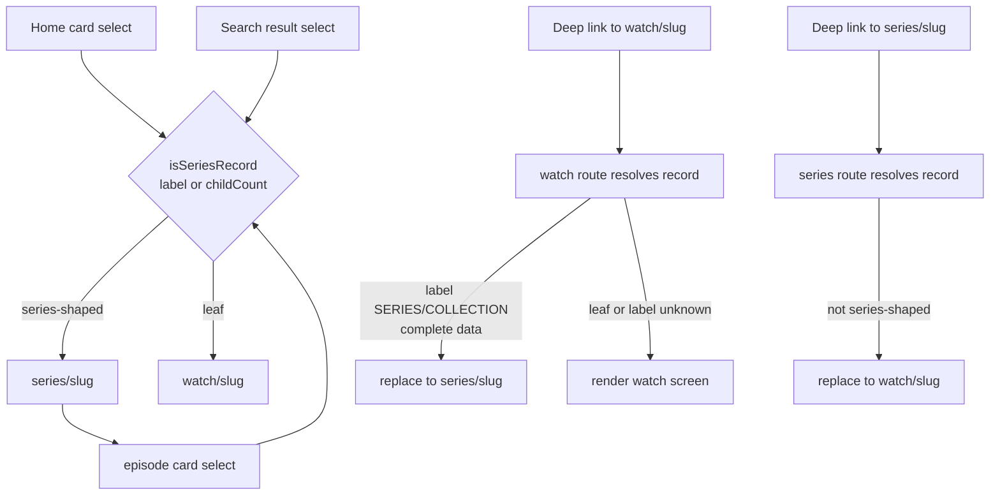
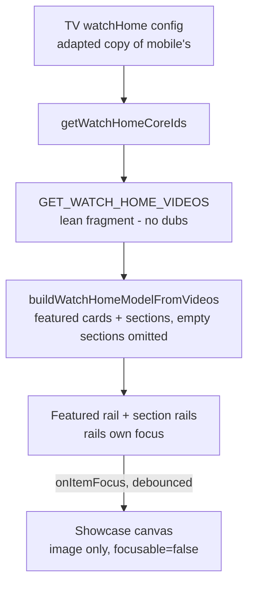
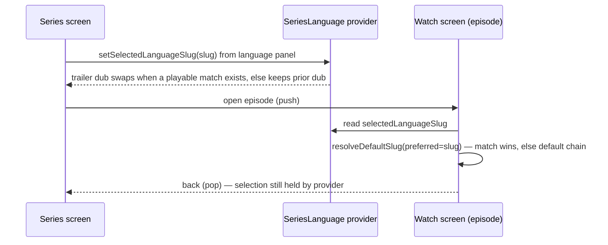

# feat: TV series detail screen and home watch-content parity

## Summary

Build two TV surfaces in order: a series detail screen (artwork hero, Play
Trailer, D-pad episode rail, language carry-through, watch-route redirect),
then a content-rich Home that ports the Home Curation to TV and renders it
as a Focus-Driven Showcase with a mission tail and QR beta signup, replacing
the Experience-driven home. Both port from mobile's implementations — mobile
already made the TV-relevant cuts. Roadmap: feat-178 (Phase A), feat-179
(Phase B).

---

## Problem Frame

TV's home renders the empty homepage Experience, and TV has no series
surface — its watch screen is built for leaf videos. Web and mobile both
render the code-curated home; mobile ported it on 2026-06-09 and shipped a
series detail page on 2026-06-08. TV is the last platform without either,
and a content-rich Home cannot ship first because its rails contain
series-shaped cards with nowhere to land (see origin:
docs/brainstorms/2026-06-11-tv-home-series-parity-requirements.md).

---

## Requirements

Carried from the origin doc (R1–R16, refined where flow analysis exposed
ambiguity) plus one plan-discovered requirement (R17).

**Series screen — routing**

- R1. A series-shaped record (label `SERIES`/`COLLECTION`, or any record
  with children) renders the series screen, not the watch screen. One shared
  predicate implements the test everywhere.
- R2. The watch route redirects series-shaped records to the series screen
  via `router.replace`, only when resolved data is complete enough to carry
  `label`. Detection at this seam is label-only (the watch fragment does not
  fetch own children — mobile-accepted gap).

**Series screen — content and actions**

- R3. The screen shows a SERIES badge, the series title, and description.
- R4. Play Trailer renders only when the series has a playable own dub —
  `published` and non-empty `hls` (the `pickFirstPlayableVariant` rule). No
  dead action otherwise; the focused action never unmounts while focused.
- R5. Children render as a D-pad-navigable episode rail in `order`-field
  order, thumbnail + title; selecting a leaf child opens its watch screen,
  selecting a series-shaped child opens its series screen (same R1 rule).
- R6. Language opens a selection panel fed by `childDubLanguages`; selection
  swaps the trailer dub when a playable match exists and carries into
  episodes opened from the screen, keyed on `languageSlug` (never bcp47).
  When an episode has no dub in the carried language, it falls through its
  normal default-language chain. The selection survives episode push/pop.
- R7. The action set is Play Trailer and Language only.

**Home — content and source**

- R8. Home renders the same curated set as web/mobile — hero pool plus every
  configured section in config order — from a TV-local port of the curation
  config and a lean `watchHomeVideos` fetch.
- R9. The new Home replaces the Experience-driven rendering;
  `apps/tv/app/experience/[slug].tsx` keeps the SDUI pipeline.

**Home — layout and navigation**

- R10. The showcase canvas shows the focused card's artwork, title, and
  description; defaults to the first _resolved_ featured item (falling back
  to the first card of the first non-empty rail); retains the last focused
  card when focus moves to non-card elements and across stack push/pop.
- R11. The hero pool renders as the first rail (Featured); focusing any card
  swaps the showcase.
- R12. Every configured section renders as a horizontal rail in config
  order with eyebrow and title; grid sections become rails; sections with
  zero resolved cards are omitted, partially-resolved sections render what
  resolved.
- R13. Card selection routes by the R1 predicate: leaf → watch screen,
  series-shaped → series screen, both carrying a seed for instant paint.
- R14. The search chip stays at the top of Home; D-pad traversal works in
  both directions between the chip and the first rail.
- R15. A compact mission section ends the feed: mission cards plus a QR code
  to the beta signup. At least one element is focusable (non-actioning) so
  D-pad scrolling can reach the tail; nothing performs an external-link
  action on-device.

**Resilience**

- R16. Both surfaces show loading, error-with-focusable-retry, and empty
  states; the error state fires only when nothing is renderable — a stale
  cached model beats an error screen on refetch failure.

**Search routing**

- R17. TV search results carry `label` and `childCount`, and series-shaped
  results route directly to the series screen (no watch-route bounce).

---

## Key Technical Decisions

- **Port from mobile, not web.** Mobile's `watchHome/model.ts` and series
  page already made the TV-relevant cuts: no `href` building, no hero
  playlist sequencing or Mux inserts, lean fragments, slug-based routing.
  Web's model builder carries web-only presentation.
- **Curation is a TV-local adapted copy with a sync-obligation header.** The
  origin doc forbids web/mobile edits, so no shared-package hoist now;
  the copy's header documents the mirror obligation (mobile's
  `apps/mobile/src/lib/watchHome/config.ts` sets the precedent). Hoist
  deferred to follow-up.
- **Trailer playback uses the fullscreen overlay's no-session path.** The
  series screen calls `useVideoPlayerContext().playVideo(hls, title)`
  without publishing a watch session — the documented invariant in
  `apps/tv/src/components/watch/useSessionPlayback.ts` /`playerSwitch.ts`
  guarantees a clean player (no in-player language/subtitle menu). Language
  changes happen on the series screen, mobile parity. Menu dismisses the
  overlay back to the series screen (existing behavior).
- **One series-shaped predicate, asymmetric data.** Port mobile's
  `isSeriesRecord` (uppercase wire literals `SERIES`/`COLLECTION`, or
  `childCount > 0`). Home cards and search results carry `childCount` and
  route directly; the watch-route redirect is label-only and fires only on
  complete data. Both the watch redirect and the series screen's leaf-bounce
  use `router.replace` and evaluate the same predicate on the same
  normalized record, so they cannot disagree and loop.
- **Series language carries through a lightweight provider, not nav
  params.** A series-scoped context holds `selectedLanguageSlug`; the watch
  screen feeds it into the existing `resolveDefaultSlug` preferred-slug arg
  (currently always null). Mobile documented that passing language through
  nav params "has bitten the watch surface before". No persistence in v1.
- **Bulk fragments never select dubs.** The home and series-children
  fragments stay lean (the 2,259-dub / 9.5MB incident); mobile's Jest SDL
  guard is ported to TV's queries. Playable streams resolve lazily at
  selection time.
- **The showcase is image-only; no VideoView mounts on Home.** tvOS decode
  slots are scarce and a paused background VideoView still holds one
  (`docs/solutions/ui-bugs/tv-backdrop-videoview-decoder-starvation-overlay-20260611.md`).
  Dwell-to-preview stays deferred.
- **Episode browsing is a single horizontal rail.** Reuses the proven
  `ContentRail`/`UpNextRail` focus patterns; a multi-row grid for large
  collections is deferred.
- **QR renders via `qrcode-generator` as a View grid.** `react-native-svg`
  is banned in apps/tv (podspec breaks under pnpm + the tvOS fork); the
  pattern already exists in `apps/tv/src/components/LinkModal.tsx`. The QR
  encodes the same beta signup URL web/mobile use.
- **Children consumption is fix-tolerant.** The admin
  `Video.parents/children` relation is known-inverted on main (KTD5 note in
  `apps/tv/src/lib/normalizeVideo.ts`). All children reads self-filter,
  dedupe, and render nothing when empty; U1 front-loads a prod
  verification. The relation fix is admin-owned — hand off, never edit
  `apps/admin`.
- **Tests are Jest with pure-`.ts` extraction.** jest-expo cannot load
  `.tsx`; every bug-prone decision lives in a React-free `.ts` module with a
  colocated test (the repo-wide convention across 21 existing TV test
  files). Query shapes are asserted by printing the gql.tada document to SDL.

---

## High-Level Technical Design

Routing across the three entry seams — one predicate, replace-only
redirects:

Home data flow — config to focus-driven render:

Series language carry-through:

---

## Implementation Units

### Phase A — Series surface (roadmap feat-178)

### U1. Series data foundations

- **Goal:** The predicate, query, and normalizer the series surface stands
  on — verified against prod data before any UI exists.
- **Requirements:** R1, R5, R6 (data inputs).
- **Dependencies:** none.
- **Files:** `apps/tv/src/lib/isSeriesRecord.ts` (+ `.test.ts`),
  `apps/tv/src/lib/videoQueries.ts` (+ `videoQueries.test.ts`),
  `apps/tv/src/lib/normalizeVideo.ts` (+ `normalizeVideo.test.ts`).
- **Approach:** Port `apps/mobile/src/lib/isSeriesRecord.ts`. Add a
  dedicated `GET_SERIES_BY_SLUG` operation spreading the existing
  `WatchVideo` fragment plus own `children { order child { id slug label
locales images } }` and `childDubLanguages { slug name bcp47 }` — never on
  the shared fragment (keeps the single-video query lean; mobile's
  `GET_SERIES_BY_SLUG` is the template). Extend `normalizeVideo.ts` with
  `normalizeSeries` producing `episodes` (order-sorted, self-filtered,
  deduped) and `languages`, WeakMap-memoized like the base normalizer.
- **Patterns to follow:** mobile `apps/mobile/src/lib/queries.ts`
  (`GET_SERIES_BY_SLUG`), mobile `normalizeVideo.ts` (`buildEpisodes`,
  `buildLanguages`); KTD5 self-filter tolerance already in TV's sibling code.
- **Test scenarios:**
  - `isSeriesRecord`: label `"SERIES"` → true; `"COLLECTION"` → true;
    `childCount: 3` with null label → true; label `"FEATURE_FILM"` and
    `childCount: 0` → false. Include one fixture where ONLY the uppercase
    enum branch can match (lowercase `"series"` → false) per the
    mocked-shape-vs-real-contract discipline.
  - Query shape (printed SDL): `GET_SERIES_BY_SLUG` selects
    `children { order` and `childDubLanguages`; selects no `dubs` inside
    `children`; `GET_VIDEO_BY_SLUG` is unchanged.
  - `normalizeSeries`: self-referencing child filtered out; duplicate
    children deduped; empty/missing children → `episodes: []`; episodes
    sorted by `order`; same input object returns the same memoized output.
- **Verification:** Jest green; live query against prod admin for a known
  collection (e.g., `2_GOJ-0-0`) returns non-empty, non-self children — if
  it does not, flag to the admin owner (relation inversion) and note that
  Phase A ships fix-tolerant.

### U2. Series screen route

- **Goal:** `series/[slug]` renders the artwork hero, badge, title,
  description, and the Play Trailer / Language action row; leaf records
  bounce to the watch screen.
- **Requirements:** R1, R3, R4, R7; origin F4; AE2.
- **Dependencies:** U1.
- **Files:** `apps/tv/app/series/[slug].tsx`,
  `apps/tv/src/components/series/SeriesActionRow.tsx`,
  `apps/tv/src/components/series/seriesScreenState.ts` (+ `.test.ts`).
- **Approach:** Mirror the watch screen's structure: seed-based instant
  paint (`decodeWatchSeed`), `cache-first` + `returnPartialData` query,
  artwork hero from the image-precedence chain (static `expo-image`, no
  VideoBackdrop — no video mounts on this screen), hero content bottom-left,
  opaque below-fold. Action row is a `TVFocusGuideView autoFocus` row with
  one-shot `hasTVPreferredFocus` on the first action (the
  `DetailsActionRow` template). Play Trailer calls
  `playVideo(trailerHls, title)` — no `setVideo`. When the resolved record
  is not series-shaped, `router.replace` to `watch/[slug]` once, only on
  complete data. Pure helpers in `seriesScreenState.ts`: playable-trailer
  pick, initial-focus chain (Play Trailer → first episode → Language),
  leaf-bounce decision.
- **Patterns to follow:** `apps/tv/app/watch/[slug].tsx` (screen anatomy,
  RetryButton focus pattern, `WATCH_THEME` vs Crimson Gallery — pick the
  watch theme for visual continuity), `DetailsActionRow.tsx` (focus
  re-arm on overlay dismiss), `validateUrl.ts` on every CMS URL.
- **Test scenarios (in `seriesScreenState.test.ts`):**
  - Covers AE2. Playable pick: dub `published: true, hls: "https://…"` →
    trailer action present; `published: false` with hls → absent;
    `published: true, hls: ""` → absent; no dubs → absent.
  - Leaf-bounce decision: series-shaped record → render; leaf record with
    label present → bounce; partial record without label → no decision yet.
  - Initial-focus chain: trailer → Play Trailer; no trailer, episodes →
    first episode; neither → Language.
- **Verification:** Deep link
  `exp+jesus-film-forge-tv:///series/<collection-slug>` renders hero +
  actions in the tvOS sim (TV Metro on 8082, cold relaunch); a leaf slug
  deep-linked to `/series` lands on the watch screen.

### U3. Episode rail

- **Goal:** The series' children browse as a focus-correct horizontal rail;
  selection routes by shape.
- **Requirements:** R5, R13 (predicate reuse); origin F4.
- **Dependencies:** U1, U2.
- **Files:** `apps/tv/src/components/series/EpisodeRail.tsx`,
  `apps/tv/src/components/series/episodeRouting.ts` (+ `.test.ts`).
- **Approach:** `ContentRail`/`UpNextRail` pattern — `TVFocusGuideView`
  containment, `FocusableCard` scale + glow, outer/inner View split against
  shadow clipping, composite keys. Empty episodes render nothing (rail
  omitted — no empty focus container). `episodeRouting.ts` decides the
  target route per child via `isSeriesRecord`, carrying seed and the
  selected language slug.
- **Patterns to follow:** `apps/tv/src/components/watch/UpNextRail.tsx`,
  `docs/solutions/best-practices/tv-carousel-card-conformance-pattern-20260416.md`,
  fixed-height rows + `getItemLayout` for long rails
  (`react-native-tvos-flatlist-sheet-virtualization-pitfalls`).
- **Test scenarios:**
  - Routing: leaf child → watch path with seed; series-shaped child →
    series path (nested collections); slug encoding preserved.
  - Empty children → rail component renders null.
- **Verification:** D-pad traverses the rail without focus escapes or
  teleports in the sim; selecting an episode opens its watch screen.

### U4. Series language selection and carry-through

- **Goal:** Language on the series screen swaps the trailer dub and decides
  the dub an opened episode starts in.
- **Requirements:** R6; AE3.
- **Dependencies:** U1, U2.
- **Files:** `apps/tv/src/contexts/SeriesLanguageContext.tsx`,
  `apps/tv/src/components/series/SeriesLanguagePanel.tsx`,
  `apps/tv/src/lib/resolveDefaultLanguage.ts` (wire the preferred arg),
  `apps/tv/src/contexts/watchSessionState.ts` callers,
  `apps/tv/src/components/series/seriesLanguageState.ts` (+ `.test.ts`).
- **Approach:** A small provider above the stack holds
  `selectedLanguageSlug` (cleared when the series screen unmounts). The
  panel reuses `WatchOptionRow` + `watchMenuStyles` + the LanguagePanel
  modal/focus-trap anatomy, listing `childDubLanguages`. On select: swap the
  trailer dub when a playable match exists, else keep the prior dub (the
  trailer action never disappears under focus — R4). The watch screen reads
  the provider and passes the slug as `resolveDefaultSlug`'s
  currently-null preferred arg; no match falls through the existing chain.
- **Patterns to follow:** `apps/tv/src/components/watch/LanguagePanel.tsx`
  (virtualized list, `getItemLayout` + `initialScrollIndex`,
  `annotateVariantRows` disabled-row pattern), mobile
  `SeriesSessionProvider` (provider-not-params precedent),
  `docs/solutions/best-practices/language-identity-on-slug-not-bcp47-20260605.md`.
- **Test scenarios (pure helpers):**
  - Covers AE3. Carried slug with matching episode dub → that dub selected;
    carried slug with no match → default chain result (device-locale →
    primary → english → first) unchanged.
  - Slug keying: `ko` vs `ko-kmr` languages resolve as distinct (bcp47
    collision fixture).
  - Trailer swap: selected language with playable match → new hls; match
    unplayable (`hls: null`) → prior dub retained.
- **Verification:** In the sim — select a language on a collection, open an
  episode, the episode plays that dub; back to series, selection still
  shown; pick a language with no trailer dub, Play Trailer still works.

### U5. Routing integration — watch redirect and search

- **Goal:** Every entry point lands series-shaped records on the series
  screen.
- **Requirements:** R2, R17; AE1.
- **Dependencies:** U1, U2.
- **Files:** `apps/tv/app/watch/[slug].tsx`,
  `apps/tv/src/lib/queries.ts` (+ `queries.test.ts`),
  `apps/tv/src/components/search/searchResultPath.ts` (+ `.test.ts`).
- **Approach:** Watch route: after `normalizeVideo`, when the record is
  label-series-shaped and data is complete, `router.replace` to
  `series/[slug]` carrying the seed (mobile's `watch/[slug]` line ~196 is
  the template). Search: add `label` and `childCount` to the
  `SEMANTIC_SEARCH` selection; `searchResultPath` routes series-shaped
  results to `/series` directly. Accepted gaps, stated in code comments:
  deep-linked series show one watch-skeleton frame before the replace;
  unlabeled-with-children records stay on the watch screen.
- **Patterns to follow:** mobile `apps/mobile/app/watch/[slug].tsx`
  redirect, mobile `isSeriesSearchResult` usage in search routing.
- **Test scenarios:**
  - Covers AE1. Redirect decision: complete record with label `SERIES` →
    redirect; label `COLLECTION` → redirect; leaf label → none; partial
    record lacking label → none (no redirect off partial cache data).
  - Query shape: `SEMANTIC_SEARCH` printed SDL contains `label` and
    `childCount`.
  - `searchResultPath`: series-shaped video result → `/series/<slug>`; leaf
    video result → `/watch/<slug>`; non-video result types unchanged.
- **Verification:** In the sim — search "gospel", select a collection
  result, series screen opens directly (no flash); deep link a series slug
  via `/watch/...`, lands on series screen; Menu from there pops to the
  pre-watch origin (replace semantics), not back to the watch route.

### Phase B — Home watch-content parity (roadmap feat-179)

### U6. Home data layer

- **Goal:** The curation config, lean fetch, and model builder that feed
  Home — with the payload guard in place.
- **Requirements:** R8, R12 (model-side omission), R16 (error surface).
- **Dependencies:** none (parallel-safe with Phase A; U7 needs U1's
  predicate).
- **Files:** `apps/tv/src/lib/watchHome/config.ts`,
  `apps/tv/src/lib/watchHome/model.ts` (+ `model.test.ts`),
  `apps/tv/src/lib/watchHome/homeQueries.ts` (+ `homeQueries.test.ts`),
  `apps/tv/src/hooks/useWatchHome.ts`.
- **Approach:** Adapted copy of mobile's `watchHome/config.ts` with the
  sync-obligation header naming web's config as upstream. Port mobile's
  `buildWatchHomeModelFromVideos` and cut the carousel/pager machinery TV
  doesn't use; keep `heroSlides`-equivalent featured cards (web's
  `WATCH_HOME_HERO_SOURCE_IDS` recipe), sections with cards
  (`pickAdminImage` precedence, `metaLabel`), `missingData`. Sections whose
  cards all fail to resolve are dropped by the model. Time-of-day section
  titles resolve through an injectable clock, re-evaluated on screen focus
  (consumer side, U7). `useWatchHome` ports mobile's hook: lazy
  `getApolloClient()`, requestId stale-response guard, `cache-first`
  initial / `network-only` refresh, errors return a retryable message and
  keep the stale model.
- **Patterns to follow:** `apps/mobile/src/lib/watchHome/config.ts` +
  `model.ts`, `apps/mobile/src/hooks/useWatchHome.ts`, mobile's
  `watchHomeQueries.test.ts` guard,
  `docs/solutions/design-patterns/lean-bulk-lazy-per-item-graphql-fetch-20260604.md`.
- **Test scenarios:**
  - Query guard (printed SDL): the home fragment selects no `dubs` and no
    `variants` — the regression test the 9.5MB incident mandates.
  - Model: hero source IDs produce featured cards in config order; a coreId
    with no resolved video is omitted and recorded in `missingData`; a
    section with zero resolved cards is absent from `model.sections`; a
    partially resolved section keeps its resolved cards; `metaLabel` says
    "N episodes" when `childCount > 0`, duration text otherwise.
  - Time-of-day: injected morning/afternoon/evening clocks select the
    matching title variant.
- **Verification:** Jest green; a node-side dry run of the query against
  prod admin (anonymous, no bearer) returns the curated set — confirming
  `watchHomeVideos` is public for unauthenticated callers.

### U7. Home screen rebuild — showcase, rails, focus

- **Goal:** `index.tsx` renders the showcase + Featured rail + section
  rails from the model, replacing the Experience-driven path, with the
  focus behavior pinned.
- **Requirements:** R9, R10, R11, R12, R13, R14; origin F1, F2, F3, F5.
- **Dependencies:** U6; U1 (predicate for card routing); U2 (series route
  exists as a target).
- **Files:** `apps/tv/app/index.tsx`,
  `apps/tv/src/components/home/ShowcaseCanvas.tsx`,
  `apps/tv/src/components/home/HomeCard.tsx`,
  `apps/tv/src/components/home/HomeRail.tsx`,
  `apps/tv/src/components/home/showcaseState.ts` (+ `.test.ts`).
- **Approach:** Keep `HomeHeader`/`SearchChip` and the `searchChipFocusKey`
  back-from-search restore intact; the header stays the sticky first child
  of the same ScrollView (the tvOS focus engine cannot traverse a
  parent-View boundary). The showcase is non-interactive
  (`focusable={false}`, image-only); rails own focus; `onFocus` wires into
  the interactive leaf with the item closed over (never re-indexed), and
  showcase commits are debounced — all per
  `tv-focus-driven-hero-patterns-20260420.md`. `showcaseState.ts` is a pure
  reducer: initial = first resolved featured (fallback: first card of first
  non-empty rail); card focus commits that card; non-card focus (chip,
  retry) retains the last card; stack pop retains. Initial D-pad focus =
  first Featured card; chip↔rail traversal pinned with
  `TVFocusGuideView` destinations both directions. Cards route via
  `episodeRouting`-equivalent logic (R13) with seed encoding. Description
  clamps to 3 lines; section descriptions are not rendered (mobile's
  density choice).
- **Patterns to follow:** current `apps/tv/app/index.tsx` (header/error
  states), `ContentRail.tsx`, `FocusableCard.tsx`, Crimson Gallery tokens,
  `scale()` + `Math.round` on font sizes, composite keys.
- **Test scenarios (`showcaseState.test.ts`):**
  - Initial state: model with featured cards → first featured; featured
    empty, sections present → first card of first section; nothing resolved
    → null (screen falls to empty state).
  - Covers AE4. Focus card B → showcase B; then focus chip → still B.
  - Debounce: rapid focus A→B→C commits once with C.
- **Verification:** In the sim — Home paints showcase + rails matching the
  web `/watch` curation (titles, order); D-pad down from chip lands on the
  first Featured card and up returns to the chip; focusing cards swaps the
  showcase; selecting a Gospel-collection card opens the series screen;
  back returns with focus and showcase retained; back-from-search still
  restores the chip.

### U8. Mission tail, QR, and resilience states

- **Goal:** The mission section closes the feed with a scannable QR, and
  Home's loading/error/empty states match the watch screen's rules.
- **Requirements:** R15, R16; origin F6; AE5.
- **Dependencies:** U7.
- **Files:** `apps/tv/src/components/home/MissionSection.tsx`,
  `apps/tv/src/components/home/missionContent.ts`,
  `apps/tv/src/components/home/QrPanel.tsx`,
  `apps/tv/app/index.tsx` (states).
- **Approach:** Mission copy adapted from mobile's `missionContent.ts` /
  web's `WatchHomePromo.tsx` (the storytelling cards; no external-link
  actions). QR renders via `qrcode-generator` as a View grid — extract or
  mirror the `LinkModal.tsx` renderer — encoding the beta signup URL
  validated through `validateUrl.ts`, sized for couch-distance scanning
  with the short URL printed beside it. The QR card is focusable but
  non-actioning so D-pad traversal scrolls the tail into view; the
  showcase retains the last card (R10). Error state only when nothing is
  renderable; refetch failure on a warm cache keeps the stale model with a
  non-blocking signal; retry is a focusable button (existing RetryButton
  pattern). No `position: absolute` on any focusable.
- **Patterns to follow:** `apps/tv/src/components/LinkModal.tsx` (QR grid),
  `apps/mobile/src/components/home/HomeMissionSection.tsx`,
  `react-native-tvos-porting-pitfalls-20260414.md` (QR + absolute-position
  focus rules).
- **Test scenarios:**
  - QR input: the encoded URL passes `validateUrl` (absolute https);
    content matches the configured beta URL constant.
  - Covers AE5. State selection logic: no model + error → error state with
    retry; stale model + refetch error → model still rendered; no model +
    loading → loading.
  - Test expectation for the static mission copy: none — content-only
    component, covered by the sim screenshot.
- **Verification:** In the sim — D-pad reaches the mission tail (focusable
  QR card scrolls it into view); the QR scans from a phone at couch
  distance and opens the beta signup; killing the network and relaunching
  shows the error state with focusable Retry.

---

## Acceptance Examples

Carried from origin, unchanged:

- AE1. **Covers R1, R2.** Given a TV search result or deep link that
  resolves to a record with label `SERIES`, when opened, then the series
  screen renders — not the single-video watch screen.
- AE2. **Covers R4.** Given a series with no playable trailer, when its
  screen opens, then the artwork renders and no Play Trailer action is
  focusable.
- AE3. **Covers R6.** Given a language selected on the series screen, when
  an episode is opened, then the episode plays in that language.
- AE4. **Covers R10.** Given focus on a card in any rail, when focus moves
  to the search chip, then the showcase keeps showing the last focused
  card.
- AE5. **Covers R16.** Given the curated fetch fails, when Home loads, then
  an error state with a focusable Retry renders — never a blank screen.

Plan-added, from flow analysis:

- AE6. **Covers R14.** Given focus on the search chip, when the user
  presses D-pad down, then focus lands on the first Featured card; given
  focus on a first-rail card, when the user presses up, then focus lands on
  the chip.
- AE7. **Covers R10.** Given every hero-pool coreId fails to resolve but
  sections resolve, when Home loads, then the showcase paints the first
  card of the first non-empty rail.
- AE8. **Covers R5, R13.** Given an episode rail card whose record is
  itself series-shaped (a nested collection), when selected, then a series
  screen for that record opens — not a watch screen.
- AE9. **Covers R4, R6.** Given a language selected whose dubs include no
  playable trailer, when the panel closes, then Play Trailer remains,
  playing the prior dub.
- AE10. **Covers R2.** Given a deep link to a series-shaped slug via the
  watch route, when the redirect fires, then pressing Menu on the series
  screen pops to the pre-watch origin, not back to the watch route.
- AE11. **Covers R16.** Given Home rendered from cache, when a background
  refetch fails, then the cached content stays on screen and no error
  state replaces it.

---

## Scope Boundaries

**Deferred to Follow-Up Work**

- Hoisting the curation config + `watchHomeVideos` operation into a shared
  package consumed by web/mobile/TV (third copy lands now with the sync
  obligation; the hoist touches web/mobile, which this work must not).
- A JFP-owned redirect URL for the beta QR (ships encoding the existing
  signup URL; a redirect would make the target changeable post-ship).
- Multi-row or grid episode browsing for large collections.
- The admin `Video.parents/children` relation fix — admin-owned; this work
  hands off the prod verification result, never edits `apps/admin`.

**Deferred for later (carried from origin)**

- Dwell-to-video-preview on the showcase.
- Personalization rows (Continue Watching, recommendations).
- Re-translating episode card titles on language change.
- Authoring an admin homepage Experience (SDUI single-source consolidation).

**Outside this work (carried from origin)**

- Changes to web or mobile apps, and any `apps/admin` change.
- The web footer, external marketing links, newsletter signup on TV.
- A sidebar navigation shell or navigation restructure beyond Home.

---

## Risks & Dependencies

- **Children relation inversion (highest).** Series rails and the
  has-children predicate branch ride `Video.children`, known-inverted on
  main. Mitigation: U1 verifies against prod before UI work; all reads are
  fix-tolerant; the watch-route redirect is label-only so leaf videos can
  never be misrouted by inverted data. If prod children are broken, Phase A
  still ships (empty rails render nothing) and fills in when the admin fix
  lands.
- **`watchHomeVideos` public-anonymity.** TV ships no bearer, unlike web
  SSR. Mobile's working port is strong evidence the query is public; U6
  verifies anonymously against prod before the screen is built.
- **Curation drift.** Third per-app copy; the sync-obligation header and
  the deferred hoist are the mitigations.
- **QR target immutability.** The encoded URL cannot change without an app
  release — accepted, matching the app-baked mission copy.

---

## Sources / Research

- Origin: `docs/brainstorms/2026-06-11-tv-home-series-parity-requirements.md`;
  roadmap `docs/roadmap/topic-experiences/feat-178-tv-app-series-detail-screen.md`,
  `docs/roadmap/topic-experiences/feat-179-tv-app-home-watch-parity.md`.
- Mobile templates: `apps/mobile/src/lib/watchHome/{config,model}.ts`,
  `apps/mobile/src/hooks/useWatchHome.ts`, `apps/mobile/src/lib/queries.ts`
  (`GET_SERIES_BY_SLUG`, `GET_WATCH_HOME_VIDEOS`),
  `apps/mobile/src/lib/isSeriesRecord.ts`,
  `apps/mobile/app/watch/[slug].tsx` (redirect),
  `apps/mobile/src/contexts/SeriesSessionProvider.tsx`,
  `apps/mobile/src/components/home/{HomeCard,HomeMissionSection}.tsx`;
  mobile plan `docs/plans/2026-06-10-001-feat-mobile-home-watch-parity-plan.md`.
- TV surfaces: `apps/tv/app/{index,search}.tsx`, `apps/tv/app/watch/[slug].tsx`,
  `apps/tv/src/lib/{videoQueries,queries,normalizeVideo,watchSeed,resolveDefaultLanguage,validateUrl}.ts`,
  `apps/tv/src/components/watch/` (`DetailsActionRow.tsx`, `LanguagePanel.tsx`,
  `UpNextRail.tsx`, `useSessionPlayback.ts`, `playerSwitch.ts`),
  `apps/tv/src/contexts/{VideoPlayerContext,WatchSessionProvider}.tsx`,
  `apps/tv/src/components/{ContentRail,FocusableCard,TVFocusGuideView,HomeHeader,SearchChip,LinkModal}.tsx`,
  `apps/tv/CLAUDE.md`.
- Solution docs:
  `docs/solutions/best-practices/tv-focus-driven-hero-patterns-20260420.md`,
  `docs/solutions/ui-bugs/tv-backdrop-videoview-decoder-starvation-overlay-20260611.md`,
  `docs/solutions/design-patterns/lean-bulk-lazy-per-item-graphql-fetch-20260604.md`,
  `docs/solutions/best-practices/react-native-tvos-porting-pitfalls-20260414.md`,
  `docs/solutions/best-practices/language-identity-on-slug-not-bcp47-20260605.md`,
  `docs/solutions/conventions/tv-mobile-clients-consume-only-public-admin-queries.md`,
  `docs/solutions/design-patterns/rntvos-dpad-player-chrome-patterns.md`,
  `docs/solutions/best-practices/mobile-video-detail-page-patterns-20260527.md`
  (uppercase enum literals),
  `docs/solutions/conventions/public-watch-url-two-segment-contract-20260608.md`.
- Known data gaps the port inherits:
  `docs/follow-ups/watch-home-modernization-missing-data.md`.
