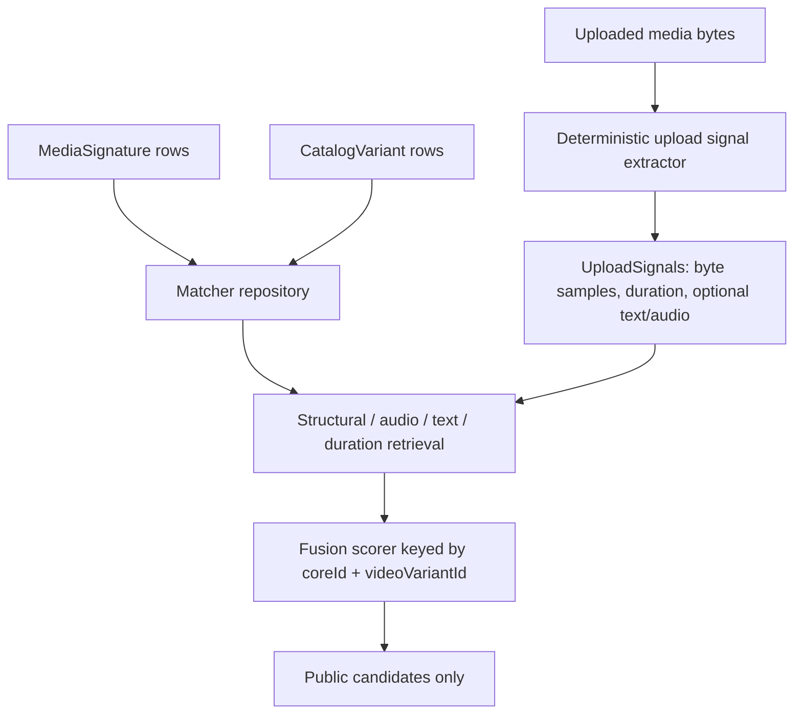

# feat: Replace mapper placeholder matching with real matcher

## Summary

Replace the YTM prototype placeholder path with a deterministic first matcher
that extracts uploaded-video signals, retrieves against local mapper
`MediaSignature` and `CatalogVariant` rows, fuses evidence by
`coreId + videoVariantId`, and keeps the public `/match-jobs` response limited
to ranked candidates.

---

## Problem Frame

YTM-003 and YTM-004 made Admin catalog metadata and official media signatures
available inside the mapper database. The public Railway service still cannot
attribute uploads because the default server wires `PlaceholderUploadSignalExtractor`
and `NoopMatcher`. YTM-005 should make the production path use real local
catalog and index data while staying modest: no YTM-006 evaluation harness, no
fake audio fingerprints, no evidence fields in the public API, and no metadata
search as the matching foundation.

---

## Requirements

- R1. The default production server no longer wires `PlaceholderUploadSignalExtractor`
  or `NoopMatcher`.
- R2. Upload signal extraction is deterministic, versioned, and compatible with
  YTM-004 `official-media-signature-v1` structural and text payloads.
- R3. Uploaded signal extraction records duration and structural hints when the
  bytes or content type make that feasible.
- R4. Uploaded signal extraction emits sampled byte/media fingerprints, and
  transcript text only when source text exists.
- R5. The matcher retrieves candidates from mapper-owned `MediaSignature` rows
  joined to active `CatalogVariant` rows.
- R6. Candidate fusion remains keyed by `coreId + videoVariantId`.
- R7. Visual or structural source evidence remains the source-video anchor;
  audio, text, language, and duration evidence rank variants without overriding
  weak source evidence.
- R8. Weak or missing visual/structural evidence cannot produce
  `matchStrength: high` without an intentional threshold change.
- R9. Public match results expose only `coreId`, `videoVariantId`, `confidence`,
  and `matchStrength`.
- R10. Tests cover extraction, seeded official signature retrieval,
  visual/audio/text disagreement, correct fused composite-variant ranking, weak
  evidence thresholds, and route/service integration using the real matcher.

---

## Key Technical Decisions

- KTD1. Reuse the YTM-004 v1 signature contract as the first matcher surface.
  The official index currently emits honest structural byte-sample signatures
  and optional text signatures; YTM-005 should compare against those instead of
  pretending to have frame or audio fingerprints.
- KTD2. Treat byte-sample and duration overlap as the v1 source anchor. The
  existing fusion scorer already uses `visualScore` as the source anchor, so the
  real matcher may feed structural byte-sample agreement into that anchor while
  naming the internal evidence as structural.
- KTD3. Keep audio optional and absent by default. `audioFingerprints` stay in
  the type for future real extractors and for tests with seeded data, but the
  default upload extractor must not synthesize audio.
- KTD4. Put production retrieval behind a service/repository boundary. Server
  wiring should compose `MatchJobService`, upload storage, extractor, and a
  Prisma-backed matcher; route handlers should remain thin.
- KTD5. Keep detailed evidence internal. Retrieval signals and evidence details
  may be returned inside service-layer types for future debugging, but
  `MatchJobRepository.replaceCandidates` and route responses continue storing
  and returning only public candidates in this slice.

---

## High-Level Technical Design

The first production matcher compares uploaded signals to local mapper data.
The route still owns upload buffering and job polling, the service owns job
state transitions, and the matcher owns retrieval plus fusion.

---

## Implementation Units

### U1. Ticket State And Extractor Contract

- **Goal:** Replace placeholder extraction with a deterministic upload signal
  contract aligned to YTM-004.
- **Requirements:** R2, R3, R4.
- **Files:** `docs/prototypes/yt-video-mapper/tickets/ytm-005-replace-placeholders-with-real-matcher.md`, `apps/yt-video-mapper-backend/src/services/upload-signal-extraction.ts`, `apps/yt-video-mapper-backend/src/services/upload-signal-extraction.test.ts`.
- **Approach:** Rename or replace the placeholder class with a real extractor
  that hashes bounded byte samples, records upload byte length and content type
  as structural hints, parses duration only where a lightweight local parser can
  do so safely, and extracts transcript text only for text subtitle inputs such
  as VTT/SRT. Keep the extractor version constant near the official signature
  version. Do not emit audio fingerprints without a real audio extractor.
- **Test scenarios:** identical bytes produce identical sample hashes; different
  bytes produce different hashes; MP4 or supported fixture bytes produce a
  duration when parseable; unsupported binary bytes still produce structural
  fingerprints; text subtitle content produces normalized transcript text;
  default extraction emits no fake audio fingerprints.
- **Verification:** Unit tests prove deterministic extraction without external
  media binaries.

### U2. Repository-Backed Signature Retrieval

- **Goal:** Load comparable official signatures and catalog variant metadata
  from mapper-owned data.
- **Requirements:** R5, R6, R7.
- **Files:** `apps/yt-video-mapper-backend/src/services/retrieval/types.ts`, `apps/yt-video-mapper-backend/src/services/retrieval/visual-retriever.ts`, `apps/yt-video-mapper-backend/src/services/retrieval/audio-retriever.ts`, `apps/yt-video-mapper-backend/src/services/retrieval/text-retriever.ts`, `apps/yt-video-mapper-backend/src/services/retrieval/retrievers.test.ts`, `apps/yt-video-mapper-backend/src/services/media-signature-matcher.ts`, `apps/yt-video-mapper-backend/src/services/media-signature-matcher.test.ts`.
- **Approach:** Add a matcher repository interface that returns active
  `MediaSignature` rows for the configured algorithm version with their
  `coreId`, `videoVariantId`, signature type, offset, duration, payload, and
  variant duration/language metadata. Project structural byte-sample payloads
  into source-anchor retrieval signals, project optional text/audio signatures
  through existing retrievers, and compute duration score from upload duration
  versus signature or variant duration.
- **Test scenarios:** seeded structural `MediaSignature` rows retrieve the
  correct composite candidate; text signatures rank the matching variant under
  the same source; audio signatures participate only when both upload and
  official data exist; retrieval does not merge candidates that share
  `videoVariantId` under different `coreId` values; non-indexable or deleted
  variants are skipped.
- **Verification:** Retriever and matcher tests use production-shaped signature
  fixtures instead of ad hoc placeholder arrays.

### U3. Real Matcher And Fusion Guardrails

- **Goal:** Fuse retrieved signals into the existing public candidate shape with
  source-anchor guardrails intact.
- **Requirements:** R6, R7, R8, R9, R10.
- **Files:** `apps/yt-video-mapper-backend/src/services/media-signature-matcher.ts`, `apps/yt-video-mapper-backend/src/services/fusion-scorer.ts`, `apps/yt-video-mapper-backend/src/services/fusion-scorer.test.ts`, `apps/yt-video-mapper-backend/src/services/match-job.service.test.ts`.
- **Approach:** Implement a `MediaSignatureMatcher` that calls the retrieval
  repository, builds retrieval signals, delegates confidence and strength to
  `fuseRankedCandidates`, and returns only `PublicMatchCandidate[]`. Preserve
  the existing non-visual cap unless tests expose a threshold bug. Add focused
  disagreement tests where source-anchor evidence points to one candidate while
  audio/text points elsewhere; the anchored candidate should win or the
  unanchored candidate should remain below high strength.
- **Test scenarios:** visual/structural and text/audio agreement returns the
  expected top `coreId + videoVariantId`; disagreement favors the candidate
  with source-anchor evidence; weak text-only or audio-only evidence cannot
  return `high`; output keys are exactly the public four-field shape.
- **Verification:** Fusion tests and matcher tests cover the threshold behavior
  before route integration.

### U4. Production Server Wiring And Integration

- **Goal:** Make `/match-jobs` use the real extractor and matcher by default.
- **Requirements:** R1, R5, R9, R10.
- **Files:** `apps/yt-video-mapper-backend/src/server.ts`, `apps/yt-video-mapper-backend/src/services/match-job.service.ts`, `apps/yt-video-mapper-backend/src/routes/match-jobs.test.ts`, `apps/yt-video-mapper-backend/src/server.test.ts`.
- **Approach:** Replace default server construction with
  `DeterministicUploadSignalExtractor` and a Prisma-backed
  `MediaSignatureMatcher`. Keep dependency injection for tests and custom
  callers. Add an integration test that creates a job with the real extractor
  and matcher over seeded official data, processes it, and observes non-empty
  public candidates. Add a server-level regression that the default production
  factory no longer imports or instantiates `NoopMatcher`.
- **Test scenarios:** processing an uploaded sample returns candidates from
  seeded official signatures; route responses still omit evidence; worker
  process endpoint completes with the real matcher; default wiring references
  the real classes.
- **Verification:** Route/service integration proves the placeholder path is no
  longer the default path.

### U5. Operational Documentation And Production Steps

- **Goal:** Document required deployment data steps without leaking secrets or
  adding unnecessary env requirements.
- **Requirements:** R1, R5.
- **Files:** `apps/yt-video-mapper-backend/docs/railway-deployment.md`, `apps/yt-video-mapper-backend/README.md`, `docs/prototypes/yt-video-mapper/tickets/ytm-005-replace-placeholders-with-real-matcher.md`.
- **Approach:** Document that after merge/deploy operators should run
  `db:migrate:deploy`, `sync:catalog`, `index:media`, and an authenticated
  `/match-jobs` smoke against indexed data. Use the Railway project-scoped
  reference only if production env vars need to be set or verified. Do not print
  or commit `ADMIN_SERVICE_BEARER_TOKEN`, mapper tokens, signed URLs, or large
  media payloads.
- **Test scenarios:** Documentation-only updates have no direct unit tests.
- **Verification:** Final verification commands pass, and any unrun production
  data steps are documented explicitly.

---

## Scope Boundaries

- In scope: upload signal extraction, repository-backed retrieval, real matcher
  wiring, fusion guardrails, tests, ticket state, and operator notes.
- Deferred to YTM-006: labeled evaluation harness, threshold calibration
  against a validation set, precision/recall reporting, and broad confidence
  tuning.
- Deferred to later work: real audio fingerprint libraries, real visual frame
  extraction through ffmpeg or another selected local media library, queue
  workers, evidence-debugging public or operator APIs, and long-term uploaded
  media retention.
- Out of scope: Admin catalog schema changes, direct Admin database reads,
  Core API calls from the mapper, and public evidence response expansion.

---

## Risks & Dependencies

- **Sparse v1 signatures:** The official v1 index is intentionally structural
  and may only return matches for uploads whose byte samples overlap indexed
  media samples. Keep confidence guarded and avoid overclaiming.
- **Duration parsing limits:** Lightweight binary parsing may fail on many
  media files. Treat duration as optional evidence, not a required input.
- **Catalog/index freshness:** Real matching depends on `sync:catalog` and
  `index:media` having populated mapper tables after deployment.
- **Secret leakage:** Match and indexing errors must continue redacting bearer
  tokens, signed URL query strings, and large payloads.

---

## Sources & Research

- `apps/yt-video-mapper-backend/docs/brainstorms/video-source-mapper-requirements.md`
  defines the source-first, Core-facing matcher behavior.
- `docs/prototypes/yt-video-mapper/tickets/ytm-005-replace-placeholders-with-real-matcher.md`
  defines YTM-005 scope and acceptance.
- `docs/plans/2026-06-10-005-feat-official-media-signature-indexing-plan.md`
  defers final matching from YTM-004 into this slice.
- `docs/solutions/architecture-patterns/mapper-official-media-signature-indexing-pattern.md`
  establishes the honest v1 signature contract and safe media indexing posture.
- `docs/solutions/platform/yt-video-mapper-backend-app-durable-match-job-upload-poll-process-pattern.md`
  establishes the async job surface, public candidate shape, and visual-anchor
  fusion guardrail.
- `apps/yt-video-mapper-backend/src/server.ts`,
  `apps/yt-video-mapper-backend/src/services/match-job.service.ts`,
  `apps/yt-video-mapper-backend/src/services/upload-signal-extraction.ts`, and
  `apps/yt-video-mapper-backend/src/services/fusion-scorer.ts` contain the
  placeholder path and existing fusion boundary to replace.
