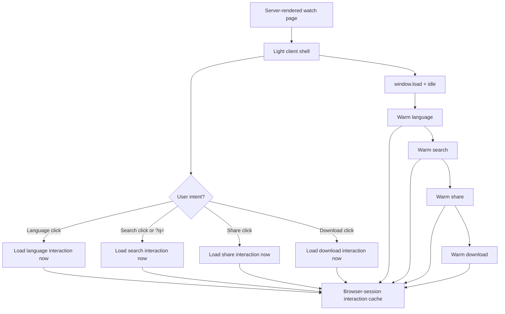

# perf: Watch Staged Client Loading

## Summary

Reduce first-load Watch client JavaScript by staging heavy interactions after
the page is usable. User intent loads the requested interaction immediately;
otherwise language, search, share, and download code warm after `window.load`
in priority order and remain cached across browser-session page navigations.

---

## Problem Frame

The previous Watch performance slice fixed server metadata, localized resolver
fan-out, language-picker data serialization, transcript hydration, and the
MuxVideo hero backend. Deployed checks still show a heavy first-load client
surface on the Life of Jesus route: roughly 31 script resources and about
730 KB encoded script in a mobile-sized browser pass.

The remaining app-owned opportunity is not to hide content from crawlers. The
first page should render the full content and controls that users recognize,
then defer the JavaScript needed to operate less-used interactions until the
browser has finished loading or the user expresses intent.

---

## Requirements

**Initial page contract**

- R1. The initial watch page remains server-rendered for metadata, canonical
  URLs, hreflang, JSON-LD, H1, localized copy, Bible quotes, study questions,
  selected transcript text, and visible first-screen controls.
- R2. Heavy interaction modules do not load before the page is usable unless
  the user asks for that interaction.
- R3. User intent beats background warming for every staged interaction.

**Priority and caching**

- R4. Language switching is the first interaction warmed after load and idle,
  because it is core to watch usage.
- R5. Search is the second interaction warmed after load and idle, and direct
  search URLs count as immediate search intent.
- R6. Share warms after language and search; download warms last.
- R7. Loaded interaction modules and safe per-page interaction data are reused
  across watch-page navigations within the same browser session.

**Behavior preservation**

- R8. Language switching still preserves public audio-language URLs, `?t=`,
  autoplay resume, subtitles, loading state, and retry behavior.
- R9. Search still supports click-to-open, URL-hydrated search, language
  filters, pagination, result links, and route-language preference.
- R10. Share and download modals keep current copy, auth gating, pause/resume,
  and error states.
- R11. Cloudflare HTML caching, canonical ownership, and route TTL policy stay
  out of this slice.

---

## Key Technical Decisions

- **KTD1. Stage interaction islands, not content.** SEO and visible body
  content stay in the server HTML; only interaction code and on-open data move
  off the first client path.
- **KTD2. Use a shared preload/cache layer.** A module-level interaction loader
  gives one place to dedupe dynamic imports, remember loaded chunks, and retain
  safe per-video language options during browser-session navigation.
- **KTD3. Keep the search trigger light.** The floating search affordance
  should remain visible and responsive, but the full overlay state machine,
  search actions, language filters, and result UI should load only on intent
  or post-load warmup.
- **KTD4. Warm by product priority.** Background work should follow usage
  value: language, search, share, then download. Download stays last because
  it includes auth/session checks and is less likely on the first view.
- **KTD5. Treat direct search URLs as intent.** A page loaded with a search
  query should not wait for low-priority idle warming before opening search.
- **KTD6. Measure with browser resource timing.** The success signal is lower
  initial script transfer or fewer initial chunks on watch pages without
  regressing server HTML or interaction behavior.

---

## High-Level Technical Design

The route remains a normal static/ISR watch page. The staged loader only
controls when client interaction code and safe interaction data are imported
or prefetched.

---

## Implementation Units

### U1. Interaction Preload and Warmup Contract

- **Goal:** Provide a reusable client-side staging layer for watch
  interactions.
- **Requirements:** R2, R3, R4, R5, R6, R7.
- **Files:** `apps/web/src/lib/watch-interaction-loader.ts`,
  `apps/web/src/lib/watch-interaction-loader.test.ts`,
  `apps/web/src/components/watch/WatchPageClient.tsx`.
- **Approach:** Add a small client-safe loader that dedupes dynamic imports,
  exposes intent loaders for language/search/share/download, and schedules
  post-load idle warming in priority order. Keep module and per-video language
  option caches in module scope so client-side watch navigation can reuse
  them.
- **Patterns to follow:** Existing poster-first idle scheduling in
  `apps/web/src/components/watch/HeroPlayer.tsx`; existing server-action
  boundaries in `apps/web/src/lib/watch-language-actions.ts` and
  `apps/web/src/lib/search-actions.ts`.
- **Test scenarios:**
  - Given multiple callers request the same interaction, only one import
    promise is created.
  - Given user intent fires before idle warmup, the intent promise wins and
    warmup reuses it.
  - Given warmup runs with all interactions idle, the warm order is language,
    search, share, then download.
  - Given a video slug was warmed, a later language open for the same slug
    reuses cached options.
- **Verification:** Unit tests prove dedupe, ordering, and cache reuse.

### U2. Stage Language, Share, and Download Modals

- **Goal:** Keep modal UI code and safe modal data off the first client path
  while preserving current watch controls.
- **Requirements:** R2, R3, R4, R6, R7, R8, R10.
- **Files:** `apps/web/src/components/watch/WatchPageClient.tsx`,
  `apps/web/src/components/watch/__tests__/WatchPageClient.download.test.tsx`,
  `apps/web/src/components/watch/__tests__/LanguagePickerModal.test.tsx`,
  `apps/web/src/lib/watch-language-actions.ts`,
  `apps/web/src/lib/watch-interaction-loader.ts`.
- **Approach:** Route language/share/download opens through the shared loader.
  Warm language options after load for the current video, but still load
  immediately on click. Warm share and download chunks later without running
  download auth/session checks until the user clicks Download.
- **Patterns to follow:** Existing dynamic modal boundaries in
  `WatchPageClient.tsx`; existing language options loading state and retry UI
  in `LanguagePickerModal.tsx`.
- **Test scenarios:**
  - Given the initial render, modal chunks are not required for visible page
    content.
  - Given language opens before idle warmup, the modal shows loading and then
    cached rows.
  - Given language options were warmed for the current video, opening language
    uses the cached rows without another server action call.
  - Given share opens, the share modal loads and receives the same public URL
    inputs as before.
  - Given download opens, auth/session gating still happens only on user click.
- **Verification:** Component tests cover open flows, cached language options,
  and unchanged share/download behavior.

### U3. Demote Search to a Lazy Interaction

- **Goal:** Remove the full search overlay, result state, language-filter
  logic, and search server-action imports from the first client path.
- **Requirements:** R1, R2, R3, R5, R7, R9.
- **Files:** `apps/web/src/components/FloatingSearchProvider.tsx`,
  `apps/web/src/components/FloatingSearchBar.tsx`,
  `apps/web/src/components/SearchOverlay.tsx`,
  `apps/web/src/components/__tests__/FloatingSearchProvider.test.tsx`,
  `apps/web/src/lib/watch-interaction-loader.ts`.
- **Approach:** Split the global search surface into a light shell and a lazy
  search controller. The shell keeps the visible search affordance, pinned
  header behavior, player chrome coordination, and click/focus handlers. The
  lazy controller owns search state, server-action calls, language filters,
  overlay portal, and results once search is opened or warmed.
- **Patterns to follow:** Current search URL-hydration logic in
  `FloatingSearchProvider.tsx`; Algolia server-action split documented in
  `docs/solutions/architecture-patterns/forge-algolia-search-modal-20260610.md`.
- **Test scenarios:**
  - Given the page renders with no search query, the full search controller is
    not mounted initially.
  - Given the user clicks or focuses search, the controller loads and opens the
    overlay.
  - Given the URL contains a search query, the controller loads as immediate
    intent and runs the existing URL-hydrated search path.
  - Given the controller has loaded once, navigating to another watch page
    reuses the loaded chunk.
  - Given the search modal opens while video is playing, watch pause/resume
    coordination still works.
- **Verification:** Search provider tests prove lazy controller mounting,
  URL-hydrated search, and pause coordination.

### U4. Browser Proof and Performance Evidence

- **Goal:** Verify staged loading improves initial browser payload without
  breaking watch interactions.
- **Requirements:** R1-R11.
- **Files:** `docs/solutions/performance-issues/watch-staged-client-loading-20260611.md`,
  `docs/roadmap/platform/feat-178-watch-staged-client-loading.md`,
  `docs/plans/2026-06-11-002-perf-watch-staged-client-loading-plan.md`.
- **Approach:** Record before/after resource timing for the Life of Jesus and
  JESUS watch pages. Verify initial HTML keeps SEO content, initial script
  transfer drops or first-load chunks decrease, post-load warming occurs in
  the intended order, and each prioritized interaction still works.
- **Patterns to follow:** Evidence style in
  `docs/solutions/performance-issues/watch-non-cloudflare-performance-hardening-20260611.md`.
- **Test scenarios:** Test expectation: none -- this unit records evidence
  from covered code paths and browser proof.
- **Verification:** Helium smoke covers page load, language, search, share,
  and download; solution doc records results and remaining follow-up.

---

## Scope Boundaries

- Cloudflare document caching is deferred.
- Route-level `revalidate` and cache topology changes are deferred.
- Watch canonical, Open Graph, Twitter, and public URL contracts stay
  unchanged.
- SEO-bearing sections must not become client-only.
- Poster-only-until-intent for Mux preview remains a separate follow-up if
  staged client loading does not hit the desired mobile budget.

---

## System-Wide Impact

This plan affects the global watch layout and the watch client shell, so every
watch route can benefit from lower initial JavaScript. It should not affect
admin data ownership, GraphQL schema, public URL shape, or Cloudflare
configuration.

---

## Risks and Dependencies

- **Search URL hydration:** Direct `?q=` links must still open search without
  waiting for background warmup.
- **Pause/resume coordination:** Moving search into a lazy controller can break
  video pause behavior if the light shell no longer exposes the correct modal
  state.
- **Over-eager warming:** Background warming should not compete with the hero,
  initial hydration, or Mux idle preview.
- **Chunk naming drift:** Dynamic import behavior is bundler-dependent; prove
  the outcome with browser resource timing rather than assuming the split.

---

## Documentation and Operational Notes

- Mark `docs/roadmap/platform/feat-178-watch-staged-client-loading.md`
  complete only after browser evidence is recorded.
- Keep evidence focused on app-owned changes. Cloudflare `cf-cache-status`
  remains a later operator validation.

---

## Sources and Research

- `docs/roadmap/platform/feat-177-watch-non-cloudflare-performance.md` -
  previous app-owned performance scope and SEO constraints.
- `docs/solutions/performance-issues/watch-non-cloudflare-performance-hardening-20260611.md`
  - prior hardening evidence and remaining cold-path notes.
- `docs/solutions/performance-issues/watch-hero-poster-idle-autoplay-20260610.md`
  - poster-first scheduling pattern.
- `docs/solutions/architecture-patterns/forge-algolia-search-modal-20260610.md`
  - current search modal and Algolia server-action pattern.
- `apps/web/CLAUDE.md` - web app conventions for server actions, watch URLs,
  i18n, and feature flags.
- `CONCEPTS.md` - Watch vocabulary for Video, Dub, Language, and Chrome.
