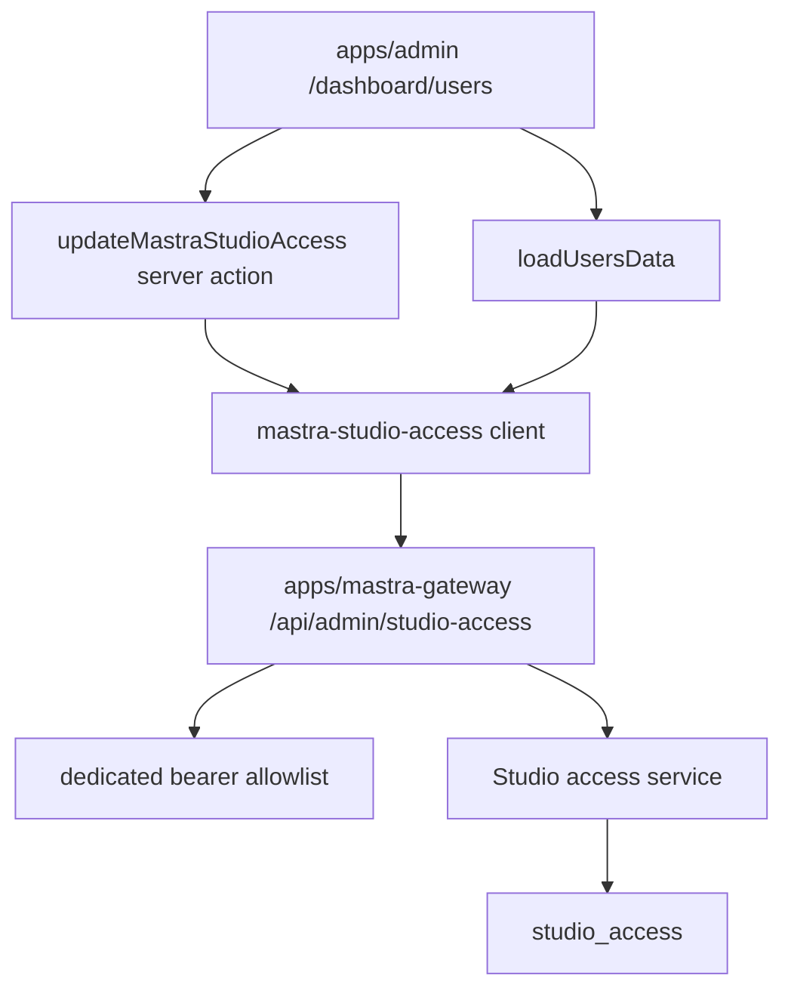

# Fix Mastra Studio Permission Switch

## Summary

Wire the Admin Users table's Mastra Studio dropdown to the gateway-owned
`studio_access` model so operators can grant and revoke Studio access without
turning Admin into the Studio authorization store.

---

## Problem Frame

`docs/roadmap/platform/feat-160-admin-user-app-access-dropdowns.md` intentionally
left Mastra Studio as a disabled mock control because its grant model was not
yet wired. The model now exists in `apps/mastra-gateway`, where Studio access is
owned by email-backed `StudioAccess` rows. This plan keeps that ownership intact
and makes the existing Admin control real through a narrow gateway API.

---

## Requirements

- R1. `/dashboard/users` shows Mastra Studio access from gateway state: approved editor/admin rows render as `STUDIO_ACCESS`, while missing, pending, or revoked rows render as `NO_ACCESS`.
- R2. Selecting `STUDIO_ACCESS` on the Admin Users table creates or restores an approved gateway `editor` access row for the user's normalized email.
- R3. Selecting `NO_ACCESS` revokes the matching gateway access row by normalized email and leaves users with no row as a no-op.
- R4. Admin never writes Mastra Studio grants to the Admin database and never imports gateway code directly.
- R5. The gateway management API requires a dedicated bearer allowlist and does not reuse workflow, ingest, Manager, web, or internal Mastra proxy secrets.
- R6. If the Admin-side gateway URL or key is absent or the lookup fails, the Users page still renders and clearly disables the Mastra Studio control instead of presenting a broken writable switch.

---

## Key Technical Decisions

- **Gateway API instead of shared database access:** Admin will call an authenticated API exposed by `apps/mastra-gateway`; it will not connect to the gateway database or duplicate the grant model.
- **Email-keyed grant operations:** The Admin Users table is keyed by Auth users and has reliable emails, while the gateway schema already treats `email` as unique and `subject` as nullable. Grant/revoke-by-email avoids needing a user to log into Studio before an operator pre-approves them.
- **Admin grants Studio editor only:** The Admin UI's current Mastra control has one access role. It should map `STUDIO_ACCESS` to gateway `editor`; gateway `admin` remains managed in the gateway admin surface.
- **Optional Admin client configuration:** Admin gets `MASTRA_GATEWAY_BASE_URL` and `MASTRA_GATEWAY_ADMIN_API_KEY` as optional env vars. Missing config disables only the Mastra Studio control, not the entire Users page.
- **Dedicated gateway bearer allowlist:** Gateway receives `MASTRA_GATEWAY_ADMIN_API_KEYS` as a CSV allowlist and validates it with timing-safe comparison before any access read or mutation.

---

## Implementation Units

### U1. Gateway internal Studio access API

- **Goal:** Expose a small authenticated gateway-owned API for Admin lookup, grant, and revoke operations.
- **Files:** Create `apps/mastra-gateway/src/auth/admin-api-bearer.ts`, create `apps/mastra-gateway/src/app/api/admin/studio-access/route.ts`, modify `apps/mastra-gateway/src/config/env.ts`, modify `apps/mastra-gateway/src/services/studio-access.service.ts`, modify `apps/mastra-gateway/src/services/studio-access.repository.ts`, add `apps/mastra-gateway/src/app/api/admin/studio-access/route.test.ts`, update `apps/mastra-gateway/src/services/studio-access.service.test.ts`.
- **Patterns to follow:** `apps/admin/src/auth/mastra-ingest-bearer.ts` for CSV bearer validation; `apps/mastra-gateway/src/app/admin/actions.ts` for existing service operations; `apps/mastra-gateway/src/services/studio-access.repository.ts` for Prisma mapping.
- **Test scenarios:** Reject missing or invalid bearer with 401; lookup returns normalized email records for requested emails; grant by email upserts an approved editor row; revoke by email revokes an existing row and no-ops when absent; invalid payloads return 400 without echoing secrets.
- **Verification:** `pnpm --filter @forge/mastra-gateway test -- src/services/studio-access.service.test.ts src/app/api/admin/studio-access/route.test.ts`.

### U2. Admin outbound client and data shaping

- **Goal:** Load Mastra Studio access state for listed users through the gateway API and represent missing config safely.
- **Files:** Create `apps/admin/src/services/mastra-studio-access.service.ts`, create `apps/admin/src/services/mastra-studio-access.service.test.ts`, modify `apps/admin/src/config/env.ts`, modify `apps/admin/.env.example`, modify `apps/admin/src/app/dashboard/ops-data.ts`, update `apps/admin/src/app/dashboard/ops-data.test.ts`.
- **Patterns to follow:** `apps/admin/src/services/manager-trigger.service.ts` for optional outbound client envelopes and bounded failures; `apps/admin/src/app/dashboard/ops-data.ts` for existing Manager membership mapping and table-fallback behavior.
- **Test scenarios:** Missing config returns disabled no-access state; lookup sends one deduped normalized email request with bearer; approved gateway rows map to `STUDIO_ACCESS`; pending/revoked/missing rows map to `NO_ACCESS`; transport or parse failures disable the Mastra control without hiding users.
- **Verification:** `pnpm --filter @forge/admin test -- src/app/dashboard/ops-data.test.ts src/services/mastra-studio-access.service.test.ts`.

### U3. Admin Users action and UI wiring

- **Goal:** Make the Mastra Studio dropdown submit grant/revoke actions through the Admin outbound client.
- **Files:** Modify `apps/admin/src/app/dashboard/users/actions.ts`, modify `apps/admin/src/app/dashboard/users/page.tsx`, update `apps/admin/src/app/dashboard/dashboard-ui.test.tsx`.
- **Patterns to follow:** `updateManagerAccess` in `apps/admin/src/app/dashboard/users/actions.ts`; `ProductAccessControl` in `apps/admin/src/app/dashboard/users/page.tsx`.
- **Test scenarios:** Mastra Studio renders as an enabled backed control when configured; its form posts to the Mastra action and shows the apply button; the old `Mock only` text is gone for configured rows; disabled fallback remains when gateway config is absent.
- **Verification:** `pnpm --filter @forge/admin test -- src/app/dashboard/dashboard-ui.test.tsx`.

### U4. Roadmap and rollout hygiene

- **Goal:** Keep the roadmap and deployment notes aligned with the new cross-app access path.
- **Files:** Modify `docs/roadmap/platform/feat-179-admin-mastra-studio-access-grants.md`, modify `docs/roadmap/platform/feat-160-admin-user-app-access-dropdowns.md`, consider a short solution note only if implementation reveals a reusable cross-app bearer pattern not already captured.
- **Patterns to follow:** Roadmap YAML frontmatter and bidirectional dependencies in `docs/roadmap/platform`.
- **Test scenarios:** Roadmap status starts `in-progress` before implementation and flips to `complete` after validation; dependency from `feat-179` to `feat-160` has the reverse `blocks` entry.
- **Verification:** `git diff --check`.

---

## High-Level Technical Design

The lookup path stays read-optimized: Admin sends the visible user emails once
per Users page load, and the gateway returns only the matching access records.
The mutation path is email-keyed and maps Admin's single `STUDIO_ACCESS` role to
gateway `editor`.

---

## Scope Boundaries

- This plan does not add a generic app-grant database model to Admin.
- This plan does not make Admin roles imply Manager or Mastra Studio access.
- This plan does not expose gateway admin role management from Admin.
- This plan does not change OAuth clients, login scopes, or Mastra Studio proxy authorization.

---

## Risks & Dependencies

- Gateway API configuration has to be deployed receiver-first: set `MASTRA_GATEWAY_ADMIN_API_KEYS` on `apps/mastra-gateway`, then set Admin's matching `MASTRA_GATEWAY_BASE_URL` and `MASTRA_GATEWAY_ADMIN_API_KEY`.
- Lookup failure must be non-fatal because `/dashboard/users` is an operational page and should still render during gateway deploys or incidents.
- Email is the correct cross-app key for pre-approval, but subject association still happens when the user logs into Studio through the gateway.

---

## Sources

- `docs/roadmap/platform/feat-160-admin-user-app-access-dropdowns.md`
- `docs/roadmap/platform/feat-179-admin-mastra-studio-access-grants.md`
- `apps/admin/src/app/dashboard/users/page.tsx`
- `apps/admin/src/app/dashboard/ops-data.ts`
- `apps/mastra-gateway/AGENTS.md`
- `apps/mastra-gateway/src/services/studio-access.service.ts`
- `apps/mastra-gateway/src/services/studio-access.repository.ts`
- `apps/mastra-gateway/prisma/schema.prisma`
