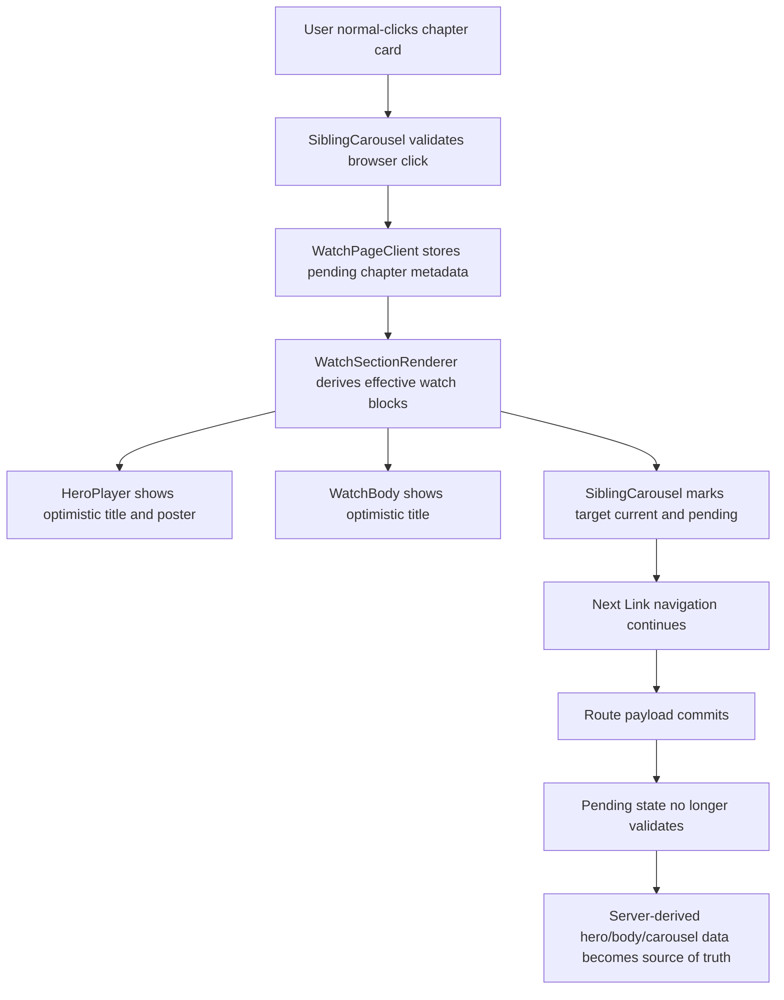

# fix: Watch chapter optimistic hero prerender

## Summary

Complete the Watch chapter navigation feedback work by lifting clicked-chapter
metadata into `WatchPageClient` and rendering an optimistic hero title, hero
poster, body title, and carousel current state before the destination route
finishes loading.

---

## Problem Frame

The shipped `feat-179` slice made `SiblingCarousel` acknowledge normal chapter
clicks immediately. Deployed proof on
`https://watch.jesusfilm.org/watch/death-of-jesus.html/english.html` showed
the clicked carousel card became current in the next animation frame, but the
hero title/poster and body title remained on `Death of Jesus` until navigation
settled on `Burial of Jesus`. The user expectation from the conversation was
broader: the clicked video should become the visible current video immediately
using the title and poster already present in the carousel, while the rest of
the route continues to load.

---

## Requirements

**Immediate visual acceptance**

- R1. A normal left-click on a non-current chapter card immediately makes that
  chapter the visible current chapter in the carousel.
- R2. The hero overlay title and visible hero poster immediately switch to the
  clicked chapter title and poster while the URL still points at the previous
  route.
- R3. The repeated body title below the carousel immediately switches to the
  clicked chapter title so first-viewport title surfaces do not disagree.
- R4. The clicked card exposes pending affordances until the destination route
  commits.

**Navigation and data integrity**

- R5. Chapter cards remain `next/link` navigations built from the public audio
  language slug and existing route builders.
- R6. Modified clicks, non-left clicks, already-prevented clicks, and active
  card clicks preserve browser behavior and do not trigger optimistic UI.
- R7. Optimistic hero/body rendering uses only metadata already present in the
  carousel payload; playback, downloads, language options, questions, Bible
  quotes, and share/download modal inputs stay route-owned until navigation
  settles.
- R8. Pending state self-invalidates when `currentVideoDocumentId`,
  `languageSlug`, or the destination href no longer matches, without an
  effect-based pending clear.

**Proof**

- R9. Component tests cover normal-click optimism, invalidation, and modified
  click behavior across carousel, hero, and body title surfaces.
- R10. Browser smoke captures before-click, immediate-after-click, and settled
  evidence proving title, poster, and carousel behavior.

---

## Key Technical Decisions

- **KTD1. Lift click intent to the page client:** `SiblingCarousel` currently
  owns pending state privately, which prevents hero/body surfaces from seeing
  the clicked chapter. Move the normal-click intent callback to
  `WatchPageClient`, make the carousel controlled by that page-level pending
  payload on Watch pages, and keep visual state derived from that one source.
- **KTD2. Optimistically render the visual shell, not playback:** The clicked
  carousel child has title, slug, document id, label, and images, but not the
  selected Dub, playback id, HLS source, downloads, subtitles, or lower-page
  editorial data. Update title/poster/current-card surfaces only; let route
  data own playable and lower-page content.
- **KTD3. Keep `next/link` as the navigation primitive:** Immediate feedback
  should not trade away App Router prefetching, basePath handling, canonical
  public language URLs, or browser link semantics.
- **KTD4. Derive validity instead of clearing in effects:** Store pending
  source and target identifiers, then derive whether that pending state is
  still valid from current props. This follows the React Compiler pattern in
  `docs/solutions/design-patterns/react-compiler-ref-and-setstate-patterns-20260513.md`.
- **KTD5. Pass optimistic block overrides through the renderer:** Keep
  `HeroPlayer`, `WatchBody`, and `SiblingCarousel` narrowly focused by giving
  them effective block data or small visual override props from
  `WatchSectionRenderer`, rather than making each component rediscover pending
  navigation independently.

---

## High-Level Technical Design

The pending payload is a visual bridge. It should not change the active
player source, subtitle state, download modal payload, study questions, Bible
quotes, or share metadata before the route commit.

---

## Implementation Units

### U1. Page-Level Pending Chapter Contract

- **Goal:** Move normal-click pending chapter state from private carousel state
  to a page-level contract that every first-viewport Watch surface can read.
- **Requirements:** R1, R4, R5, R6, R8.
- **Dependencies:** None.
- **Files:** `apps/web/src/components/watch/WatchPageClient.tsx`,
  `apps/web/src/components/watch/WatchSectionRenderer.tsx`,
  `apps/web/src/components/watch/SiblingCarousel.tsx`,
  `apps/web/src/components/watch/__tests__/WatchPageClient.navigation.test.tsx`,
  `apps/web/src/components/watch/__tests__/SiblingCarousel.test.tsx`,
  `apps/web/src/components/watch/__tests__/WatchSectionRenderer.test.tsx`.
- **Approach:** Add a small client-only pending chapter type carrying source
  video id, target video id, target href, language slug, title, slug, label,
  and resolved poster URL. `SiblingCarousel` should still perform click
  validation because it owns the anchor event, but Watch pages should pass
  `pendingChapter` and `onChapterNavigateIntent` props so the page client owns
  the source of truth. `WatchPageClient` derives `validPendingChapter` from
  the current video id and language slug.
- **Execution note:** Start with characterization coverage around the current
  `SiblingCarousel` click guards, then move state upward.
- **Patterns to follow:** Existing normal-click guard in `SiblingCarousel`;
  derived pending state pattern in
  `docs/solutions/design-patterns/watch-chapter-optimistic-navigation-feedback.md`.
- **Test scenarios:**
  - Given a normal left-click on an inactive chapter, the callback receives
    target href, document id, title, slug, label, language slug, and poster URL.
  - Given a modified click, middle click, already-prevented event, or active
    card click, the callback is not called and no pending state is shown.
  - Given pending source video id or language slug no longer matches current
    props, `WatchPageClient` treats the pending payload as invalid.
  - Given `WatchPageClient` receives new route props for the clicked video,
    pending state no longer drives visual overrides.
  - Given an inactive chapter has no routable href, it does not emit pending
    state.
- **Verification:** Focused carousel and renderer tests prove click guards and
  parent callback behavior without changing link hrefs.

### U2. Optimistic Hero and Body Title Rendering

- **Goal:** Render the clicked chapter title and poster immediately in the
  first viewport while keeping playable media and route-owned content stable.
- **Requirements:** R2, R3, R7, R8, R9.
- **Dependencies:** U1.
- **Files:** `apps/web/src/components/watch/HeroPlayer.tsx`,
  `apps/web/src/components/watch/WatchBody.tsx`,
  `apps/web/src/components/watch/WatchSectionRenderer.tsx`,
  `apps/web/src/components/watch/__tests__/HeroPlayer.test.tsx`,
  `apps/web/src/components/watch/__tests__/WatchBody.test.tsx`,
  `apps/web/src/components/watch/__tests__/WatchSectionRenderer.test.tsx`.
- **Approach:** Thread an optimistic visual override from
  `WatchSectionRenderer` into hero and body surfaces. `HeroPlayer` should use
  the optimistic title for `hero-player-overlay-title` and the optimistic
  poster for the visible pre-reveal poster layer while leaving `block.video`,
  `block.variant`, Mux metadata, playback source, subtitle handling, and
  language-switch controls untouched. `WatchBody` should use the optimistic
  title for `watch-body-title` only; description, downloads, and right-column
  content remain current-route data until navigation settles.
- **Patterns to follow:** `HeroPlayer`'s existing poster-first overlay and
  `WatchBody`'s title-only visual hierarchy; do not widen server data or add a
  browser data fetch for this transition.
- **Test scenarios:**
  - Given an optimistic title/poster override, `HeroPlayer` renders that title
    and poster while the underlying block still carries the previous video id.
  - Given no optimistic override, `HeroPlayer` renders the route-derived title
    and poster exactly as today.
  - Given an optimistic title, `WatchBody` renders that title while preserving
    route-derived description and download visibility.
  - Given the player is already chrome-revealed, optimistic poster/title
    overrides do not replace active playback controls or media source.
- **Verification:** Hero/body tests prove visual overrides affect only the
  intended title/poster surfaces.

### U3. Effective Block Derivation and Carousel Current State

- **Goal:** Make hero, body, and carousel consume one coherent pending chapter
  projection so first-viewport surfaces agree immediately.
- **Requirements:** R1, R2, R3, R4, R7, R8, R9.
- **Dependencies:** U1, U2.
- **Files:** `apps/web/src/components/watch/WatchPageClient.tsx`,
  `apps/web/src/components/watch/WatchSectionRenderer.tsx`,
  `apps/web/src/components/watch/SiblingCarousel.tsx`,
  `apps/web/src/components/watch/__tests__/WatchPageClient.navigation.test.tsx`,
  `apps/web/src/components/watch/__tests__/WatchSectionRenderer.test.tsx`,
  `apps/web/src/components/watch/__tests__/SiblingCarousel.test.tsx`.
- **Approach:** Derive effective visual block state near the renderer boundary:
  hero/body receive optimistic visual overrides, and carousel receives the
  same valid pending payload it used to compute locally. Keep the pending
  document id as the single visual active id so the old card loses current
  state and the clicked card gains current/pending state in the same render.
  Avoid mutating `mergedBlocks` in place; use derived values during render.
- **Patterns to follow:** Existing `WatchSectionRenderer` synthetic-block
  dispatch tests and the `buildHeroBlock` / `buildWatchBodyBlock` shape in
  `apps/web/src/lib/content.ts`.
- **Test scenarios:**
  - Given pending chapter metadata, renderer passes optimistic title/poster to
    `HeroPlayer`, optimistic title to `WatchBody`, and pending state to
    `SiblingCarousel`.
  - Given pending state invalidates after route commit, renderer passes no
    optimistic override and all components use route-derived block data.
  - Given the current route is a parent page with no active child, pending
    child state still produces a valid visual current child.
  - Given an Experience override supplies non-watch blocks for lower slots,
    optimistic chapter state does not affect those blocks.
- **Verification:** Renderer tests prove the derived projection is coherent
  and lower slots remain route-owned.

### U4. Immediate and Settled Browser Proof

- **Goal:** Prove the deployed behavior requested in the conversation:
  clicked title, poster, and carousel change immediately, then the destination
  route settles with matching server data.
- **Requirements:** R10.
- **Dependencies:** U1, U2, U3.
- **Files:** `apps/web/src/components/watch/__tests__/SiblingCarousel.test.tsx`,
  `apps/web/src/components/watch/__tests__/HeroPlayer.test.tsx`,
  `apps/web/src/components/watch/__tests__/WatchBody.test.tsx`,
  `apps/web/src/components/watch/__tests__/WatchSectionRenderer.test.tsx`.
- **Approach:** Keep automated component coverage as the durable guard and use
  Helium/`agent-browser` as proof for the integrated user journey. The smoke
  should sample DOM state before click, on the first animation frame after
  click, and after URL settle. Store screenshots and a JSON/timeline proof
  artifact under `output/playwright/`.
- **Patterns to follow:** The deployed QA proof from this conversation and the
  local browser-smoke preference in Forge instructions.
- **Test scenarios:**
  - Before click: hero title/poster, body title, URL, clip count, and active
    card all reference the original video.
  - Immediate after click: URL still references the original video while hero
    title/poster, body title, clip count, active card, and pending affordance
    reference the clicked video.
  - Settled: URL, hero title/poster, body title, clip count, and active card
    all reference the clicked video with pending cleared.
  - Modified click smoke: open-in-new-tab style input does not change current
    page state.
- **Verification:** Browser proof earns `PASS` only when the immediate sample
  shows title, poster, and carousel current state on the clicked video before
  route settle.

---

## Scope Boundaries

- Do not add a new browser fetch for clicked chapter data; use metadata already
  present in the carousel.
- Do not optimistically change video playback source, Mux metadata, subtitle
  state, downloads, study questions, Bible quotes, share metadata, or language
  options.
- Do not replace `next/link` with imperative routing.
- Do not change public Watch URL shape, canonical URL ownership, hreflang,
  route manifest behavior, or cache invalidation policy.

### Deferred to Follow-Up Work

- Full page snapshot caching for every chapter, including route-owned lower
  sections before navigation settle, is a larger prefetch/snapshot system and
  should be planned separately if needed.
- Mobile-specific proof can follow desktop once the first-viewport optimistic
  contract is passing.

---

## Risks & Dependencies

- The carousel child payload may lack a Mux playback id, so hero poster
  optimism must use the resolved carousel image rather than Mux thumbnail
  metadata.
- A too-broad override could make the page appear to play one video while the
  underlying player still has another source. Keep optimistic state visual
  only.
- React Compiler lint can reject effect-based pending cleanup. Use derived
  validity from source/target identifiers.
- Curated Experience watch routes may share the same client renderer; include
  them in implementation review so the normal Watch path and Experience path
  do not drift.

---

## Sources & Research

- `docs/roadmap/platform/feat-179-watch-chapter-navigation-feedback.md` -
  completed carousel-only feedback ticket.
- `docs/solutions/design-patterns/watch-chapter-optimistic-navigation-feedback.md`
  - current local pattern for normal-click pending state.
- `docs/solutions/design-patterns/react-compiler-ref-and-setstate-patterns-20260513.md`
  - derived-state guard against `set-state-in-effect`.
- `apps/web/CLAUDE.md` - public audio-language URL contract and Watch
  chapter/sibling carousel guidance.
- `apps/web/src/components/watch/WatchPageClient.tsx` and
  `apps/web/src/components/watch/WatchSectionRenderer.tsx` - page-level and
  renderer-level seams for sharing pending chapter state.
