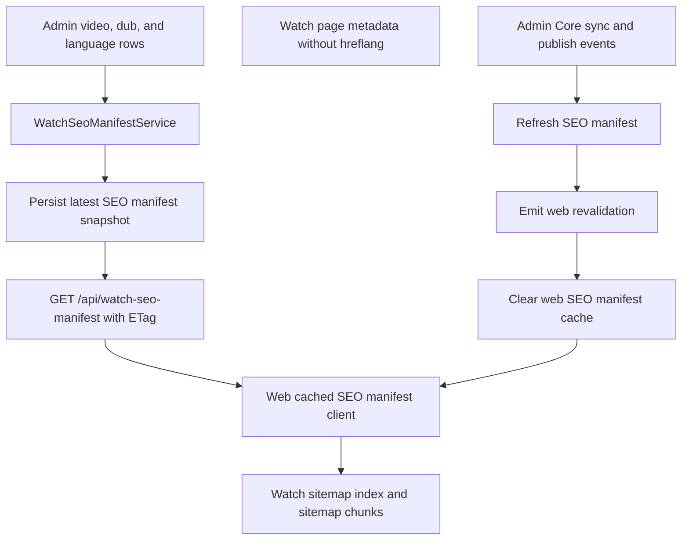
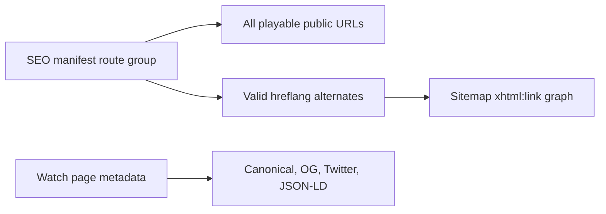

# perf: Move Watch Hreflang Alternates to Sitemap-Only Manifests

## Summary

Move Watch language `hreflang` out of video page HTML entirely and into
generated sitemap XML backed by a precomputed Admin-owned SEO manifest. Page
HTML should emit no `rel="alternate" hreflang` links for Watch routes; it keeps
canonical URLs, Open Graph, Twitter metadata, structured data, public
audio-language slugs, and the existing metadata origin contract.

This is the concrete follow-up to the launch-readiness plan's warning that
high-Dub-count videos may need sitemap-level hreflang instead of full page-head
alternates. The staging QA evidence showed that condition in the wild: one
page produced 2,094 alternate links, roughly 270 KB of alternate tags alone,
and a 1.23 MB HTML response. Because Google treats HTML and sitemap hreflang
as equivalent, the release plan now chooses one annotation surface rather than
maintaining both.

---

## Problem Frame

Watch video pages currently build `alternates.languages` inside
`apps/web/src/lib/experience-metadata.ts` by iterating every published playable
Dub on the resolved `WatchVideoRecord`. That was good enough to restore
hreflang coverage quickly, but it creates three release risks:

1. The raw HTML head becomes huge on high-language videos. The audited staging
   page shipped 2,094 alternate links and 1.23 MB of HTML before the browser
   could render the page.
2. The page render pays to derive an SEO alternate graph from the full
   resolved video payload. On cold paths, this compounds existing Watch
   manifest and resolver latency.
3. Page-head hreflang duplicates the sitemap contract without adding Google
   Search value once sitemap coverage exists. Maintaining two annotation
   surfaces increases drift risk and keeps unnecessary bytes in every Watch
   HTML response.

Google treats HTML, HTTP header, and sitemap hreflang annotations as equivalent
signals. A generated sitemap is therefore the only `hreflang` home for Watch in
this plan, provided it is valid, split below sitemap limits, and kept in sync
with canonical Watch URLs.

---

## Requirements

- R1. Full playable Watch alternate coverage moves to generated sitemap XML,
  split so every sitemap stays below 50,000 URLs and 50 MB uncompressed.
- R2. Watch page metadata emits no page-head `hreflang` annotations. In Next
  metadata terms, Watch video and episode metadata must not populate
  `alternates.languages`; canonical, Open Graph, Twitter, robots, and
  structured data remain intact.
- R3. Watch page render must not rebuild the full 2,000+ language alternate
  graph from `video.variants` on cold render.
- R4. Web consumes a precomputed/cached alternate manifest with `ETag`, TTL,
  and revalidation behavior matching the existing Admin-owned route manifest
  pattern for sitemap generation.
- R5. Keep public Watch URL shapes unchanged:
  `/watch/{slug}.html/{language}.html` and
  `/watch/{series}.html/{episode}/{language}.html`.
- R6. Keep canonical, Open Graph, Twitter, and sitemap URLs on
  `https://www.jesusfilm.org/watch/...`, not the staging host.
- R7. Validate hreflang values before emitting them in sitemap XML.
  Unsupported or duplicate tags must be skipped with observable counts instead
  of emitted.
- R8. Do not overload the existing route manifest with rendering or SEO
  payloads. Route admission and SEO alternate generation stay separate
  contracts even if they share source queries and refresh triggers.
- R9. `robots.ts` advertises the sitemap or sitemap index only after the new
  sitemap surface exists and has tests.
- R10. Release verification must include HTML-size regression proof, zero
  page-head `hreflang` proof, sitemap coverage proof, and Helium browser smoke
  on representative Watch pages.

---

## Key Technical Decisions

- KTD1. **Add an adjacent Watch SEO manifest instead of expanding the route
  manifest.** `docs/solutions/architecture-patterns/admin-owned-watch-route-manifest-20260530.md`
  explicitly keeps the route manifest admission-focused. The SEO manifest can
  reuse that snapshot, store, endpoint, and refresh pattern without making
  route admission carry sitemap-only data.
- KTD2. **Sitemap XML becomes the only Watch hreflang source of truth.**
  Page-head `hreflang` is removed instead of capped. This avoids duplicate
  annotation logic and follows Google's guidance that sitemap hreflang is an
  equivalent signal.
- KTD3. **Do not keep a high-confidence head subset.** A small head subset
  would still need bidirectional consistency, extra tests, and drift handling.
  Any route that should be advertised as a localized alternate must be present
  in the sitemap graph; Watch page HTML should not emit `hreflang`.
- KTD4. **Use Google-supported hreflang, not arbitrary BCP-47.** Admin stores
  BCP-47-like language values for app behavior, but Google documents stricter
  support. Emit only tags the validator accepts, and record skipped languages.
- KTD5. **Split by serialized XML size as well as URL count.** Next.js
  `generateSitemaps` documents the 50,000 URL limit, but full alternate
  clusters can hit the 50 MB uncompressed limit first. The implementation
  should either use a custom sitemap index and chunked XML route handlers, or
  set a conservative chunk size proven by serialized-size tests.
- KTD6. **Use snapshot reads in sitemap request paths.** Admin generates and
  persists the SEO manifest out of band. Web fetches the latest snapshot with
  conditional requests and process cache; sitemap code reads the cached
  manifest, not live admin aggregate queries.
- KTD7. **Keep sitemap URLs canonical and absolute.** Sitemap entries use
  `WATCH_PUBLIC_METADATA_ORIGIN` plus `WATCH_BASE_PATH` and route builders.
  They must not use relative URLs or the request host.

---

## High-Level Technical Design

The sitemap path is the only `hreflang` path. Sitemap generation projects the
full valid alternate graph into XML chunks. Watch page metadata does not read
the SEO manifest for `hreflang`; it keeps canonical, social metadata,
structured data, and visible page behavior independent of the sitemap graph.

---

## Scope Boundaries

### In Scope

- Admin-owned SEO/alternate manifest generation, persistence, endpoint, and
  refresh wiring.
- Web cached manifest consumption for sitemap generation.
- Generated sitemap index and child sitemap XML for Watch alternate coverage.
- Removal of Watch page-head `hreflang` for video and episode pages.
- Tests and release proof for sitemap validity, canonical URL ownership,
  zero page-head `hreflang`, smaller HTML head output, and cold-render
  behavior.

### Out of Scope

- Changing public Watch URL shapes.
- Switching canonical ownership from `www.jesusfilm.org` to
  `watch.jesusfilm.org`.
- Fixing the unrelated mobile header overlap, search snippet, or language
  switch QA blockers.
- Translating missing video metadata. This plan uses existing playable route
  and language identity; new translation/backfill belongs to localized content
  tickets.
- Replacing the existing route manifest admission contract.
- Cloudflare HTML cache rules or a custom shared Next cache handler.

### Deferred to Follow-Up Work

- Search Console submission and post-release indexing monitoring can happen
  after the sitemap surface is live.
- Video sitemap extensions (`video:video`) can follow after the basic URL plus
  hreflang sitemap is valid.
- More nuanced locale clustering can follow if SEO wants region-specific
  targeting beyond the current route language identity.

---

## Dependencies And Prerequisites

- Use the dedicated roadmap ticket
  `docs/roadmap/platform/feat-184-watch-hreflang-sitemap-manifest.md`.
  Related tickets such as `feat-173`, `feat-172`, and `feat-178` are complete;
  this is a new follow-up slice.
- Keep `feat-154` in view. Variant-aware language identity is in progress and
  affects public language slug identity, duplicate handling, and exact route
  grouping.
- Context7 lookup for Next.js docs failed in this planning run because the
  OAuth token was expired. The plan uses official Next.js web docs directly.

---

## Implementation Units

### U1. Roadmap Alignment And Characterization Baseline

**Goal:** Keep the traceable `feat-184` roadmap item aligned and lock the
current regression surface before changing metadata behavior.

**Requirements:** R1, R2, R3, R6, R10.

**Dependencies:** None.

**Files:**

- `docs/roadmap/platform/feat-184-watch-hreflang-sitemap-manifest.md`
- `docs/roadmap/README.md`
- `apps/web/src/lib/experience-metadata.test.ts`
- `apps/web/src/app/[locale]/[htmlLang]/[...rest]/__tests__/page-routing.test.tsx`

**Approach:** Use the existing `feat-184` roadmap ticket as the implementation
origin, update the roadmap index if the implementation workflow regenerates it,
then add characterization tests around the current high-language metadata
behavior. The tests should make the desired regression target explicit: page
metadata must no longer emit any `hreflang` language alternates after the
implementation.

**Execution Note:** Start with characterization coverage for current canonical
ownership and page-head `hreflang` count behavior before editing the metadata
helper.

**Patterns to Follow:**

- Roadmap format in `CLAUDE.md`.
- Existing metadata assertions in
  `apps/web/src/lib/experience-metadata.test.ts`.
- Playable route metadata tests in
  `apps/web/src/app/[locale]/[htmlLang]/[...rest]/__tests__/page-routing.test.tsx`.

**Test Scenarios:**

- Given a video with English, Spanish, and a duplicate-BCP47 Spanish Dub, the
  existing canonical URL remains on `https://www.jesusfilm.org/watch/...`.
- Given a synthetic high-Dub video, the new expected behavior emits zero
  page-head `hreflang` language alternates.
- Given an unsupported hreflang value, metadata still emits no page-head
  `hreflang`; unsupported-value handling belongs to sitemap XML tests.

**Verification:** The roadmap ticket points at this plan, any generated roadmap
index is updated if needed, and characterization tests fail against the old
full-head behavior while preserving canonical URL assertions.

### U2. Admin Watch SEO Manifest Snapshot

**Goal:** Generate a precomputed SEO manifest that contains the route and
language data needed by sitemap XML without live aggregate work in Web sitemap
request paths.

**Requirements:** R1, R4, R7, R8.

**Dependencies:** U1.

**Files:**

- `apps/admin/src/services/watch-seo-manifest.service.ts`
- `apps/admin/src/services/watch-seo-manifest.service.test.ts`
- `apps/admin/src/services/watch-seo-manifest-store.ts`
- `apps/admin/src/services/watch-seo-manifest-store.test.ts`
- `apps/admin/prisma/schema.prisma`
- `apps/admin/prisma/migrations/NEW_watch_seo_manifest_snapshot/migration.sql`
- `apps/admin/src/scripts/generate-watch-seo-manifest.ts`
- `apps/admin/package.json`

**Approach:** Mirror the durable route-manifest pattern: service builds a
deterministic payload, store persists the latest JSONB snapshot, version hash
excludes `generatedAt`, and an operator script can regenerate explicitly. Keep
the payload compact but SEO-specific. It should include route groups for
two-segment videos and three-segment episodes, public audio language slugs,
and validated hreflang values.

Do not put full titles, descriptions, study questions, or rendering payloads in
the manifest. The SEO manifest is a routing and alternate graph, not a page
resolver replacement.

**Patterns to Follow:**

- `apps/admin/src/services/watch-route-manifest.service.ts`
- `apps/admin/src/services/watch-route-manifest-store.ts`
- `apps/admin/src/scripts/generate-watch-route-manifest.ts`
- `docs/solutions/architecture-patterns/admin-owned-watch-route-manifest-20260530.md`

**Test Scenarios:**

- Given playable published dubs for one video, the manifest includes public
  audio slug alternates for that video.
- Given a parent with playable child episodes, the manifest includes the
  three-segment episode route group and child-specific language coverage.
- Given duplicate BCP-47 values for separate language slugs, the manifest
  preserves slug identity while exposing only one Google hreflang entry per
  emitted alternate key.
- Given a language tag unsupported by Google, the manifest excludes it from the
  hreflang graph and increments a skipped-count summary.
- Given only a playable Dub and no localized metadata, the route can still be
  sitemap-eligible when its public URL and hreflang value are valid.
- Given malformed query rows, manifest generation fails rather than persisting
  a partial snapshot.

**Verification:** Admin service/store tests pass, and the operator script
prints summary counts for route groups, alternate pairs, skipped hreflang
values, payload bytes, and duration.

### U3. Admin Endpoint And Refresh Wiring

**Goal:** Serve and refresh the SEO manifest through the same producer-owned
snapshot lifecycle as the route manifest.

**Requirements:** R4, R8, R9.

**Dependencies:** U2.

**Files:**

- `apps/admin/src/app/api/watch-seo-manifest/route.ts`
- `apps/admin/src/app/api/watch-seo-manifest/route.test.ts`
- `apps/admin/src/services/watch-route-manifest-refresh.service.ts`
- `apps/admin/src/services/watch-route-manifest-refresh.service.test.ts`
- `apps/admin/src/services/revalidate-webhook.ts`
- `apps/admin/CLAUDE.md`

**Approach:** Add an authenticated `GET /api/watch-seo-manifest` endpoint with
consumer bearer auth, `ETag`, `If-None-Match`, controlled `503` for missing
snapshots, and private cache-control. Refresh the SEO manifest after route and
language relevant changes: languages, videos, video-dubs, and
publish/archive changes that affect Watch route visibility.

Keep refresh best-effort so Core sync and editorial flows do not fail because
Web sitemap generation is temporarily unavailable. Emit a semantic web
revalidation event that lets Web clear the SEO manifest process cache and
revalidate sitemap routes.

**Patterns to Follow:**

- `apps/admin/src/app/api/watch-route-manifest/route.ts`
- `apps/admin/src/services/watch-route-manifest-refresh.service.ts`
- Web revalidation notes in `apps/admin/CLAUDE.md`.

**Test Scenarios:**

- Missing or invalid bearer returns `401` with the expected authenticate
  header.
- Missing snapshot returns `503` without generating on demand.
- Matching `If-None-Match` returns `304`.
- Successful response returns the latest snapshot payload and `ETag`.
- Core sync phases that affect route or language identity refresh the SEO
  manifest.
- Refresh failure is logged and returned in summary form without throwing
  through the caller.

**Verification:** Endpoint and refresh tests pass; admin docs describe the new
snapshot, endpoint, refresh triggers, and operator script.

### U4. Web SEO Manifest Client And Cache

**Goal:** Let Web read the precomputed SEO manifest once per TTL/invalidation
cycle for sitemap routes.

**Requirements:** R3, R4, R6, R8.

**Dependencies:** U3.

**Files:**

- `apps/web/src/lib/watch-seo-manifest.ts`
- `apps/web/src/lib/watch-seo-manifest.test.ts`
- `apps/web/src/app/api/revalidate/route.ts`
- `apps/web/src/app/api/revalidate/route.test.ts`
- `apps/web/src/lib/watch-cache-tags.ts`
- `apps/web/src/lib/watch-cache-tags.test.ts`
- `apps/web/CLAUDE.md`

**Approach:** Add a Web-side manifest client with parser, process-local cache,
in-flight dedupe, `ETag` conditional requests, timeout handling, stale fallback,
and a test source override. This should look like
`apps/web/src/lib/watch-route-manifest.ts` but point to
`/api/watch-seo-manifest`. Web's revalidation endpoint should clear the SEO
manifest process cache and invalidate sitemap-related paths/tags when Admin
emits the SEO manifest event.

The client must fail safe: Watch page metadata must remain independent of the
SEO manifest, and sitemap routes should return a controlled empty or
unavailable response rather than generating a misleading partial full graph
when the manifest is unavailable.

**Patterns to Follow:**

- `apps/web/src/lib/watch-route-manifest.ts`
- `apps/web/src/lib/watch-route-manifest.test.ts`
- `apps/web/src/app/api/revalidate/route.ts`
- Cache tag pattern from `docs/plans/2026-06-10-001-fix-watch-cache-invalidation-plan.md`.

**Test Scenarios:**

- Parser accepts the Admin SEO manifest contract and rejects malformed payloads.
- Two concurrent reads share one in-flight fetch.
- A `304` response reuses the cached manifest.
- Fetch failure returns the prior cached manifest when one exists.
- Revalidation clears the process cache for the receiving process.
- Missing env or bearer returns `null` and does not throw through sitemap
  route handling.

**Verification:** Web manifest client and revalidation tests pass.

### U5. Generated Watch Sitemap Index And Chunks

**Goal:** Emit the full valid Watch alternate graph in sitemap XML without
violating sitemap limits.

**Requirements:** R1, R5, R6, R7, R9.

**Dependencies:** U4.

**Files:**

- `apps/web/src/app/sitemap.xml/route.ts`
- `apps/web/src/app/sitemap/[id]/route.ts`
- `apps/web/src/app/sitemap.test.ts`
- `apps/web/src/app/robots.ts`
- `apps/web/src/app/robots.test.ts`
- `apps/web/src/lib/watch-sitemap.ts`
- `apps/web/src/lib/watch-sitemap.test.ts`
- `apps/web/src/proxy.test.ts`

**Approach:** Add a root sitemap index and chunked child sitemap routes for
Watch. Use custom XML helpers if needed so splitting can account for serialized
byte size, not just URL count. Every child sitemap must use fully-qualified
absolute `www.jesusfilm.org/watch/...` URLs and `xhtml:link` alternates for
validated hreflang values. Include self alternates for each group. Add
`robots.ts` sitemap discovery only after the index route exists.

If implementation chooses Next's `MetadataRoute.Sitemap` plus
`generateSitemaps`, first prove with tests that the generated output stays
under byte limits for worst-case alternate clusters. Otherwise use route
handlers for deterministic XML and byte-aware chunking.

**Patterns to Follow:**

- Reserved sitemap bypass in `apps/web/src/proxy.ts`.
- Existing `robots.ts` TODO about sitemap index and admin bulk query.
- Public route builders in `apps/web/src/lib/routes.ts`.
- Next.js sitemap file convention and `generateSitemaps` docs.

**Test Scenarios:**

- Root sitemap response is a sitemap index that references only same-site,
  same-or-deeper child sitemap URLs.
- Child sitemap entries use canonical absolute `www.jesusfilm.org/watch/...`
  URLs and never the request host.
- A video route group emits self-inclusive `xhtml:link` alternates.
- An episode route group emits the three-segment production URL shape.
- Unsupported hreflang values are absent from XML.
- Chunking keeps every child sitemap below 50,000 URLs and below 50 MB
  uncompressed, with a focused lower test threshold fixture so the splitter is
  exercised.
- `robots.ts` includes the sitemap index URL after the route is implemented.
- Proxy tests prove `/watch/sitemap.xml` and child sitemap URLs stay reserved
  and do not go through Watch canonicalization.

**Verification:** Sitemap and robots tests pass, and a local response snapshot
or fixture validates XML namespace, escaping, sitemap index, child locs, and
alternate links.

### U6. Remove Watch Page-Head Hreflang

**Goal:** Remove Watch page-head `hreflang` entirely while preserving canonical
and social metadata.

**Requirements:** R2, R3, R5, R6, R10.

**Dependencies:** U5 for release sequencing. The code change itself should not
depend on the sitemap manifest client.

**Files:**

- `apps/web/src/lib/experience-metadata.ts`
- `apps/web/src/lib/experience-metadata.test.ts`
- `apps/web/src/app/[locale]/[htmlLang]/[...rest]/page.tsx`
- `apps/web/src/app/[locale]/[htmlLang]/[...rest]/__tests__/page-routing.test.tsx`

**Approach:** Stop deriving or returning `alternates.languages` for Watch video
and episode metadata. Remove `buildWatchVideoAlternateLanguages` if it becomes
unused, or leave only a clearly scoped helper for sitemap code if implementation
chooses to share validation logic there. Do not introduce a new manifest lookup
inside `generateMetadata`.

Keep canonical metadata in `alternates.canonical`, keep Open Graph and Twitter
URLs on `https://www.jesusfilm.org/watch/...`, and keep robots plus structured
data behavior unchanged. All localized alternate discovery moves to sitemap
XML.

**Patterns to Follow:**

- Current `generateWatchVideoMetadata` and `buildWatchVideoMetadataModel` in
  `apps/web/src/lib/experience-metadata.ts`.
- `generateSeriesMetadata` canonical URL handling.
- Public URL builders in `apps/web/src/lib/routes.ts`.

**Test Scenarios:**

- Given a high-Dub video with localized variants, metadata emits canonical,
  Open Graph, Twitter, robots, and structured data, but no
  `alternates.languages`.
- Given 2,000 playable audio variants, metadata emits zero page-head
  `hreflang` links and does not iterate variants to build an alternate graph.
- Given sitemap manifest unavailability, page metadata behavior is unchanged
  because page metadata does not consume the SEO manifest.
- Given an episode route, metadata keeps the correct canonical three-segment
  route shape but emits no `hreflang` language alternates.
- Given duplicate or unsupported hreflang-like values in variants, page
  metadata ignores them entirely; validation belongs to sitemap XML generation.

**Verification:** Metadata and page-routing tests prove zero page-head
`hreflang` and canonical ownership. A generated HTML fixture or local smoke
should show the audited route's page-head `hreflang` count is exactly `0`.

### U7. Release Proof And Operational Handoff

**Goal:** Prove the release blocker is fixed and leave operators with the
manifest/sitemap controls they need.

**Requirements:** R1-R10.

**Dependencies:** U5, U6.

**Files:**

- `docs/solutions/performance-issues/watch-hreflang-sitemap-manifest-20260612.md`
- `apps/admin/CLAUDE.md`
- `apps/web/CLAUDE.md`
- `docs/roadmap/platform/feat-184-watch-hreflang-sitemap-manifest.md`
- `docs/plans/2026-06-12-002-perf-watch-hreflang-sitemap-plan.md`

**Approach:** Capture before/after evidence for the audited URL and at least
one episode URL. Record raw HTML size, page-head `hreflang` count, sitemap
index status, representative child sitemap status, cache headers, and
cold/repeat timing. Use Helium for browser smoke because repo instructions
require it for browser testing.

Document the operator script, endpoint auth, refresh triggers, Web cache
clearing behavior, and any remaining Search Console submission steps.

**Test Scenarios:**

- The audited staging URL renders zero page-head `hreflang` alternates.
- Sitemap index and at least one child sitemap return valid XML.
- The full alternate graph for the audited video exists in sitemap XML.
- Cold page render no longer performs a page-local full alternate graph build.
- Helium smoke confirms the page still renders title, canonical, JSON-LD,
  visible content, and language controls.

**Verification:** Targeted web/admin tests, typecheck/lint for touched apps,
local XML smoke, Helium browser smoke, and live/deployed fetch evidence are
captured before release handoff.

---

## System-Wide Impact

This work affects crawler-facing metadata, Admin-to-Web snapshot contracts,
Next route handlers, revalidation, and release QA evidence. It should reduce
Watch HTML size and cold-render work without removing alternate discovery from
Google. The highest risk is SEO drift: invalid sitemap hreflang, wrong
canonical host, stale manifest data, or missing sitemap discovery could
fragment indexing even if the visible page looks healthy.

---

## Risks And Mitigations

- **Risk: sitemap XML becomes too large even with fewer than 50,000 URLs.**
  Mitigation: split by serialized byte size and URL count, and add tests that
  exercise byte-aware chunking.
- **Risk: Google ignores unsupported hreflang tags.** Mitigation: validate
  language/region syntax before emission and record skipped counts in the
  manifest summary.
- **Risk: SEO manifest duplicates route manifest responsibility.** Mitigation:
  keep the SEO manifest as a separate consumer contract and reference the route
  manifest only as a source pattern, not as a payload to expand.
- **Risk: stale SEO manifest after Core sync or publish.** Mitigation: mirror
  route-manifest refresh triggers for route and language identity, use ETag,
  and wire Web revalidation to clear process cache.
- **Risk: sitemap-only hreflang is not discovered quickly.** Mitigation:
  expose the sitemap index in `robots.ts`, support Search Console submission,
  and test that the full graph removed from HTML exists in sitemap XML.
- **Risk: Next metadata sitemap helpers cannot express the needed sitemap
  index/chunking behavior.** Mitigation: use custom XML route handlers when
  byte-aware splitting or index output cannot be expressed safely with
  `MetadataRoute.Sitemap`.
- **Risk: `x-default` is misused.** Mitigation: only emit `x-default` if the
  product confirms the fallback URL represents a real unmatched-language
  default, otherwise prefer the English/default URL as a normal `en`
  alternate.

---

## Sources And Research

- `apps/web/src/lib/experience-metadata.ts` currently builds
  `alternates.languages` from every published playable Dub with a BCP-47 value.
- `apps/web/src/app/[locale]/[htmlLang]/[...rest]/page.tsx` calls
  `generateWatchVideoMetadata` for two-segment videos and three-segment
  episodes.
- `apps/web/src/app/robots.ts` explicitly defers sitemap support because full
  video-language coverage needs a sitemap index and admin bulk query.
- `apps/admin/src/services/watch-route-manifest.service.ts` and
  `docs/solutions/architecture-patterns/admin-owned-watch-route-manifest-20260530.md`
  define the existing Admin-owned manifest pattern.
- `docs/plans/2026-06-10-001-fix-watch-dev-launch-readiness-plan.md` deferred
  full sitemap-level hreflang if page-head alternates became too large.
- `docs/plans/2026-05-27-002-feat-watch-url-html-shape-i18n-restructure-plan.md`
  already identified a future SEO plus sitemap phase for `.html` Watch URLs.
- Google Search Central,
  ["Tell Google about localized versions of your page"](https://developers.google.com/search/docs/specialty/international/localized-versions):
  HTML, HTTP headers, and sitemap hreflang are equivalent from Google's
  perspective, and sitemap examples use `xhtml:link` self-inclusive alternate
  sets.
- Google Search Central,
  ["Build and submit a sitemap"](https://developers.google.com/search/docs/crawling-indexing/sitemaps/build-sitemap):
  single sitemaps are limited to 50 MB uncompressed or 50,000 URLs, use
  absolute URLs, and sitemap URLs should be the canonical URLs preferred in
  search results.
- Google Search Central,
  ["Manage your sitemaps with a sitemap index file"](https://developers.google.com/search/docs/crawling-indexing/sitemaps/large-sitemaps):
  sitemap indexes are the submission surface once sitemap files are split.
- Google crawling docs,
  ["Optimize your crawl budget"](https://developers.google.com/crawling/docs/crawl-budget):
  faster pages can allow Google to read more content, and up-to-date sitemaps
  help crawling efficiency.
- Next.js official docs for
  [`sitemap.xml`](https://nextjs.org/docs/app/api-reference/file-conventions/metadata/sitemap)
  and
  [`generateSitemaps`](https://nextjs.org/docs/app/api-reference/functions/generate-sitemaps):
  App Router supports programmatic localized sitemaps via
  `alternates.languages` and multiple sitemap files via `generateSitemaps`,
  with `id` passed as a promise in Next 16.

---

## Open Questions

- OQ1. Should sitemap `x-default` point to English, a language picker, or be
  omitted? This needs a product/SEO decision before emission.
- OQ2. Should Search Console receive one sitemap index URL or several child
  sitemap URLs directly? The implementation should support both, but release
  ops can choose submission shape.
