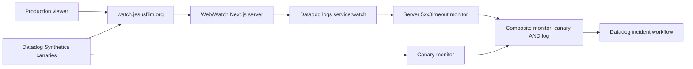

# feat: Add Watch Datadog Availability Incidents

## Summary

Add the production Watch availability incident path that catches server-rendered
500s and timeouts even when client-side RUM never loads. The implementation
keeps the existing RUM setup intact, adds production-visible Watch server
failure breadcrumbs, and documents the Datadog canary, log, composite, and
incident workflow configuration needed for a balanced two-signal alert.

## Problem Frame

The motivating failure is a production Watch page returning `Internal Server
Error` while Datadog Error Tracking has no matching issue. That is expected when
the failure happens before the browser app boots: RUM and browser Error Tracking
cannot observe a server-rendered 500 response body that never executes the
client. V1 should therefore use outside-in canaries to detect user-visible
availability failures and production server logs to corroborate origin-side
failure before creating an incident.

## Requirements

- R1. Emit Datadog-visible Watch server failure breadcrumbs for manifest fetch
  failures, metadata resolver fallbacks, and other existing server-side Watch
  catch points that can precede RUM.
- R2. Preserve the existing client RUM and source-map behavior; do not make RUM
  part of the v1 incident trigger.
- R3. Define a production-only Datadog canary monitor for a small stable Watch
  URL set.
- R4. Define a production-only Datadog log monitor for Watch 5xx and timeout
  corroboration, filtered to real production Watch hosts and excluding preview,
  e2e, and local traffic.
- R5. Define a Datadog composite monitor and incident workflow that creates or
  updates incidents only when the canary and server-log signals agree.
- R6. Document verification for canary-only, log-only, and both-signals
  scenarios so future operators can audit the setup.

## High-Level Technical Design

The code change is intentionally small: normalize Watch server breadcrumbs into
plain `[watch] event=... key=value` log lines that survive the production log
pipeline and can be queried from Datadog. The Datadog side remains a reproducible
operations artifact because the repo does not currently own Datadog monitors as
Terraform or another monitor-as-code system.

## Key Technical Decisions

### KTD1: Server Breadcrumbs Use Plain String Logs

Use a small Watch observability helper to emit structured-enough plain strings
instead of JSON objects. Prior production findings show Railway logsV2 can hide
or reshape runtime stdout/stderr in ways that make JSON log assumptions brittle.
The helper should keep event names fixed, sanitize values, and make log lines
easy to query in Datadog.

### KTD2: The Log Monitor Is Production-Host Filtered

Datadog already has `service:watch` logs, but read-only Datadog checks showed
that this service includes production, Vercel preview, e2e, and staging-like
hosts. The log monitor must filter to production Watch host attributes such as
`url_host` or the Datadog-normalized equivalent and explicitly exclude preview
and local hosts.

### KTD3: Datadog Config Is A Reproducible Runbook, Not New IaC

There is no existing monitor-as-code pattern in this repo. V1 should add an
operations runbook with exact canary URLs, monitor query templates, threshold
guidance, incident tags, and validation steps. Do not introduce Terraform, Pulumi,
or custom Datadog API scripts in this slice.

### KTD4: Incident Creation Uses A Composite Gate

A canary-only failure can be a network or location blip, and a server-log-only
failure can be a non-canary edge case. The incident path should require both the
outside-in canary monitor and the production server 5xx/timeout log monitor.

### KTD5: Server APM And Broad Route Crawling Stay Out Of V1

Next/server APM, route inventory crawling, dashboards, and root-cause timelines
are useful later work, but they are not needed for this first availability-first
incident path.

## Implementation Units

### Unit 1: Watch Server Log Helper

Files:

- `apps/web/src/lib/watch-observability.ts`
- `apps/web/src/lib/watch-observability.test.ts`

Approach:

- Add a helper that emits `[watch] event=<event> key=value ...` lines.
- Support warn and error levels so existing call sites can preserve severity.
- Sanitize newline, whitespace, and quote-heavy values so Datadog queries remain
  predictable.
- Keep the API narrow and use fixed event constants from call sites.

Test Scenarios:

- The helper emits a deterministic line with sorted or stable key order.
- Values with spaces, newlines, and undefined/null fields are handled safely.
- Warn and error paths call the expected console methods.

### Unit 2: Normalize Existing Watch Server Failure Breadcrumbs

Files:

- `apps/web/src/lib/watch-route-manifest.ts`
- `apps/web/src/lib/watch-route-manifest.test.ts`
- `apps/web/src/lib/watch-seo-manifest.ts`
- `apps/web/src/lib/watch-seo-manifest.test.ts`
- `apps/web/src/app/[locale]/[htmlLang]/[...rest]/page.tsx`

Approach:

- Replace existing JSON-shaped manifest failure logs with the Watch
  observability helper.
- Add breadcrumbs to existing metadata fallback catch blocks so swallowed
  resolver failures still leave production-visible evidence.
- Do not wrap the whole route render path just to log and rethrow. Uncaught
  server-render failures already appear in Next/Railway logs; this unit focuses
  on catch points that otherwise hide the failure class.
- Keep route behavior, cache behavior, manifest schemas, and static Watch route
  constraints unchanged.

Test Scenarios:

- Route manifest non-OK responses emit `watch_route_manifest.fetch.failed` with
  status and URL context.
- Route manifest thrown fetch errors emit `watch_route_manifest.fetch.error`.
- SEO manifest non-OK responses emit `watch_seo_manifest.fetch.failed`.
- SEO manifest thrown fetch errors emit `watch_seo_manifest.fetch.error`.
- Metadata fallback catch paths emit a Watch breadcrumb before returning the
  fallback metadata.

### Unit 3: Datadog Availability Runbook

Files:

- `docs/operations/watch-datadog-availability-incidents.md`

Approach:

- Document the v1 production canary URL set after checking current public route
  behavior.
- Document the Synthetics HTTP assertion shape, repeated-failure window, and
  location quorum.
- Document the production Watch server-log query template for 5xx and timeout
  corroboration.
- Document the composite monitor expression and incident/workflow notification
  handles/tags.
- Include a verification matrix proving canary-only and log-only conditions do
  not create incidents, while both signals together do.

Test Scenarios:

- The runbook names concrete URLs and monitor tags.
- The log query documents production-host filtering and preview/local
  exclusions.
- The recovery rule requires both canary and server corroboration to clear.

### Unit 4: Roadmap And Validation

Files:

- `docs/roadmap/platform/feat-186-watch-datadog-availability-incidents.md`

Approach:

- Link the implementation plan and runbook from the roadmap ticket.
- Mark the ticket complete only after implementation, review, and validation.
- Run focused Web tests for observability behavior.
- Run browser smoke against a representative Watch route.

## Risks And Boundaries

- This plan does not create live Datadog monitors from code because the repo has
  no Datadog IaC pattern and the available Datadog connector is read-only for
  this workflow.
- Production log attributes can drift. The runbook should name the currently
  observed attributes and tell operators to recheck the final query before
  enabling incidents.
- The canary set is deliberately small. It catches high-value availability
  failures but does not prove every Watch route is healthy.
- Do not add dynamic request-time APIs to the static Watch route tree.
- Do not change the existing RUM application id, client token, sourcemap upload,
  or RUM monitor behavior in this slice.

## Verification

- `pnpm --filter @forge/web test -- src/lib/watch-observability.test.ts src/lib/watch-route-manifest.test.ts src/lib/watch-seo-manifest.test.ts`
- `pnpm --filter @forge/web typecheck`
- `pnpm --filter @forge/web lint`
- Browser smoke a representative production-shaped Watch route in the local app
  using the repo-approved Helium/agent-browser path.
- Read-only Datadog checks confirm `service:watch` production 5xx logs are
  queryable with the documented filter shape.

## Sources And Research

- `docs/brainstorms/2026-06-12-watch-datadog-availability-incidents-requirements.md`
- `docs/plans/2026-06-11-005-feat-web-watch-datadog-rum-plan.md`
- `docs/solutions/runtime-errors/railway-logsv2-silences-nextjs-stdout-runtime-20260518.md`
- `apps/web/AGENTS.md`
- `apps/web/CLAUDE.md`
- Datadog read-only findings from this session: existing `service:watch` RUM
  monitors, production and preview `service:watch` logs, and existing
  incident.io monitor notification patterns.
- Datadog documentation: HTTP API tests, monitor notifications, monitor query
  syntax, and composite monitors.
