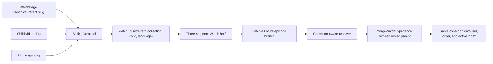

# fix: Preserve Watch collection context in chapter routing

## Summary

Watch chapter carousel links should preserve the current collection when moving between clips. Today the carousel emits slug-only two-segment video links. For videos that belong to multiple parents, the slug-only resolver falls back to `record.parents[0]`, which can move the user out of the source collection and into another carousel context.

Fix the chapter carousel to emit existing collection-aware three-segment Watch URLs whenever the current page has a valid parent collection slug. Keep direct two-segment Watch URLs working for standalone and externally shared video pages.

## Problem Frame

The Pilate page is in the "Anticipate the Resurrection" collection and shows a 29-clip chapter carousel. Some cards in that carousel are also members of the broader `JESUS` collection. When those cards link to `/{video}.html/{language}.html`, route resolution uses the slug-only code path and may pick the first parent rather than the collection the user came from.

The bug is not that the target video fails to render. The bug is that the target render can use the wrong parent context, so the carousel title, clip count, active index, neighboring links, and navigation continuity no longer match the user's current collection.

## Requirements

- Chapter carousel links from a page with a valid `canonicalParent.slug` must use the existing collection-aware route shape: `/{collection}.html/{video}/{language}.html`.
- The destination page for a multi-parent clip must retain the source collection's title, order, active index, and 29-item carousel membership.
- Chapter carousel links must preserve the language slug, including `.html` suffix behavior such as `english.html`.
- In-app `href` values must remain relative to the app route and must not hard-code the `/watch` base path.
- Standalone or parentless carousel states must retain the existing safe behavior and must not produce malformed collection-aware URLs.
- Direct slug-only video URLs must continue to resolve, including for externally shared Watch pages.
- Modified clicks and `next/link` behavior must still work, and the optimistic pending chapter state must use the same `href` that is rendered.
- Add a regression for the Pilate/Anticipate carousel: all 29 chapter links should preserve the collection path, with explicit coverage for multi-parent targets that currently fall back to `JESUS`.
- Update local Watch navigation documentation so it no longer describes chapter links as always two-segment links.

## Key Technical Decisions

### KTD-1: Reuse the existing three-segment Watch route

Use `watchEpisodePath(collectionSlug, videoSlug, languageSlug)` for context-preserving carousel links. Do not add query parameters, session-only state, or a new route shape.

Rationale: the catch-all Watch route already supports collection-aware resolution, and `apps/web/src/lib/content.ts` already has logic that selects the requested parent by slug instead of falling back to `parents[0]`.

### KTD-2: Keep slug-only direct URLs

Do not remove or redirect two-segment video routes as part of this fix.

Rationale: existing public links, SEO metadata, and direct navigation behavior depend on slug-only URLs continuing to resolve. The fix is specifically about preserving context when the app already knows the current collection.

### KTD-3: Build context-aware links at the carousel boundary

Construct parent-aware child hrefs in `SiblingCarousel` from `canonicalParent.slug`, child slug, and language slug.

Rationale: the carousel is the component that knows both the current parent context and every child card target. Fixing the emitted href keeps route resolution, pending navigation, and browser behavior aligned around one URL.

### KTD-4: Prove the bug with deterministic fixtures

Use local test fixtures for the 29-link Pilate carousel regression rather than relying on live network data in unit tests.

Rationale: live Watch data can drift. The regression should encode the routing invariant: all chapter links from a known collection context include that collection slug, and multi-parent children resolve through that collection.

## Technical Design

## Implementation Units

### U1: Emit parent-aware chapter hrefs

Files:

- `apps/web/src/components/watch/SiblingCarousel.tsx`
- `apps/web/src/components/watch/__tests__/SiblingCarousel.test.tsx`
- `apps/web/src/lib/routes.ts`

Work:

- Import and use the existing collection-aware route helper for child links when `canonicalParent.slug`, child slug, and language slug all validate.
- Keep the current slug-only route builder as the fallback when a carousel has no usable parent context.
- Preserve current `data-href`, `onClick`, modified-click, and non-link rendering behavior.
- Update existing tests that currently assert a two-segment child route so they assert a parent-aware route for collection pages.
- Keep a test proving in-app hrefs do not include a `/watch` base path prefix.

Acceptance Checks:

- A valid parent collection with child slug `jesus-is-crucified` and language `english` renders a three-segment href.
- Missing or invalid parent context does not render a malformed three-segment href.
- Invalid child slug or language slug still prevents clickable output as it does today.
- `onNavigate` receives the exact rendered href.

### U2: Add collection-resolution route regression

Files:

- `apps/web/src/app/[locale]/[htmlLang]/[...rest]/__tests__/page-routing.test.tsx`
- `apps/web/src/lib/__tests__/content-watch-merge.test.ts`
- `apps/web/src/lib/content.ts`

Work:

- Add or extend route tests for a multi-parent child reached through a collection-aware URL.
- Assert that the destination uses the requested parent collection instead of the child's first parent.
- Preserve a direct two-segment test showing slug-only routes still resolve through the existing canonical-parent behavior.
- Cover the parent-mismatch path if existing fixtures make that cheap to express.

Acceptance Checks:

- Rendering `anticipate-the-resurrection.html/jesus-is-crucified/english.html` selects the "Anticipate the Resurrection" parent context.
- Rendering `jesus-is-crucified.html/english.html` still exercises the slug-only direct URL behavior.
- Route metadata and page rendering remain compatible with the existing `.html` route shape.

### U3: Add the 29-link Pilate carousel regression

Files:

- `apps/web/src/components/watch/__tests__/SiblingCarousel.test.tsx`
- `apps/web/src/app/[locale]/[htmlLang]/[...rest]/__tests__/page-routing.test.tsx`

Work:

- Add a deterministic Pilate/Anticipate fixture with 29 carousel children.
- Assert every child href contains the current collection segment.
- Include explicit multi-parent samples for links that previously drifted into the `JESUS` collection.
- Assert active index and neighboring chapter labels stay sourced from the 29-item collection after route resolution.

Acceptance Checks:

- All 29 fixture links are collection-aware.
- Representative multi-parent targets preserve the 29-item collection context.
- The test fails if a child card regresses to a slug-only href.

### U4: Keep optimistic navigation behavior aligned

Files:

- `apps/web/src/components/watch/WatchPageClient.tsx`
- `apps/web/src/components/watch/SiblingCarousel.tsx`
- `apps/web/src/components/watch/__tests__/WatchPageClient.navigation.test.tsx`
- `apps/web/src/components/watch/__tests__/SiblingCarousel.test.tsx`

Work:

- Verify pending chapter state and any route-poster bridge use the rendered href, not a recomputed slug-only URL.
- Update tests only where expectations depend on the old two-segment link shape.
- Avoid changing the current scroll or transition behavior.

Acceptance Checks:

- A normal chapter click records the parent-aware href as the pending target.
- Modified clicks still avoid client-side pending state.
- Existing active-card and disabled-card behavior remains unchanged.

### U5: Documentation and browser proof

Files:

- `docs/solutions/design-patterns/watch-chapter-optimistic-navigation-feedback.md`
- `docs/roadmap/media-generation/feat-054-video-pages-2-0.md`

Work:

- Update the Watch chapter navigation solution note to describe collection-aware carousel links.
- Keep the roadmap feature status unchanged unless implementation discovers a separate follow-up that needs a new ticket.
- Run targeted automated tests for the touched Watch route and carousel files.
- Run Helium browser smoke against the Pilate page after implementation.

Acceptance Checks:

- Documentation no longer says chapter cards always emit two-segment canonical links.
- Browser smoke confirms the Pilate page's 29 chapter links include the collection route segment.
- Browser smoke confirms multi-parent targets remain in "Anticipate the Resurrection" rather than switching to `JESUS`.

## Validation Plan

- `pnpm --filter web test -- apps/web/src/components/watch/__tests__/SiblingCarousel.test.tsx`
- `pnpm --filter web test -- apps/web/src/app/[locale]/[htmlLang]/[...rest]/__tests__/page-routing.test.tsx`
- `pnpm --filter web test -- apps/web/src/components/watch/__tests__/WatchPageClient.navigation.test.tsx`
- `pnpm --filter web lint`
- `pnpm --filter web typecheck`
- Helium smoke on the local Watch page for Pilate, including multi-parent chapter links.

## Scope Boundaries

In scope:

- Watch chapter carousel href construction.
- Watch collection-aware route regression coverage.
- Optimistic chapter navigation expectations tied to the rendered href.
- Local documentation for chapter navigation behavior.

Out of scope:

- Reworking the Watch URL taxonomy.
- Changing public slug-only direct URL behavior.
- Changing canonical SEO URL policy for Watch pages.
- Fixing unrelated QA claims such as quote copy, share domain, capitalization, or cold route latency.
- Changing admin content ordering or parent assignment data.

## Risks and Mitigations

- Risk: A parent-aware href could accidentally include the deployed `/watch` base path in an in-app link.
  Mitigation: Keep the existing no-basePath test and assert the new three-segment href shape.

- Risk: Parentless or synthetic carousel data could generate broken URLs.
  Mitigation: Validate parent, child, and language slugs before building collection-aware hrefs, and keep the existing fallback path for parentless contexts.

- Risk: Tests could overfit to live production content that changes.
  Mitigation: Encode the Pilate 29-link matrix as a deterministic local fixture focused on route invariants.

- Risk: Context-aware carousel links may expose metadata or canonical-url differences on three-segment pages.
  Mitigation: Preserve existing metadata tests for three-segment pages and avoid changing direct URL canonicalization in this fix.

## Research Notes

- `apps/web/src/components/watch/SiblingCarousel.tsx` currently builds child hrefs with slug-only `watchVideoPath`.
- `apps/web/src/components/watch/__tests__/SiblingCarousel.test.tsx` currently asserts that child routes use the two-segment `.html` shape.
- `apps/web/src/lib/content.ts` has both collection-aware and slug-only Watch resolvers; slug-only resolution falls back to the first parent.
- `apps/web/src/app/[locale]/[htmlLang]/[...rest]/page.tsx` already routes three-segment Watch pages through collection-aware episode resolution.
- `docs/solutions/design-patterns/watch-chapter-optimistic-navigation-feedback.md` documents the current optimistic navigation behavior and needs to reflect the new href shape.
