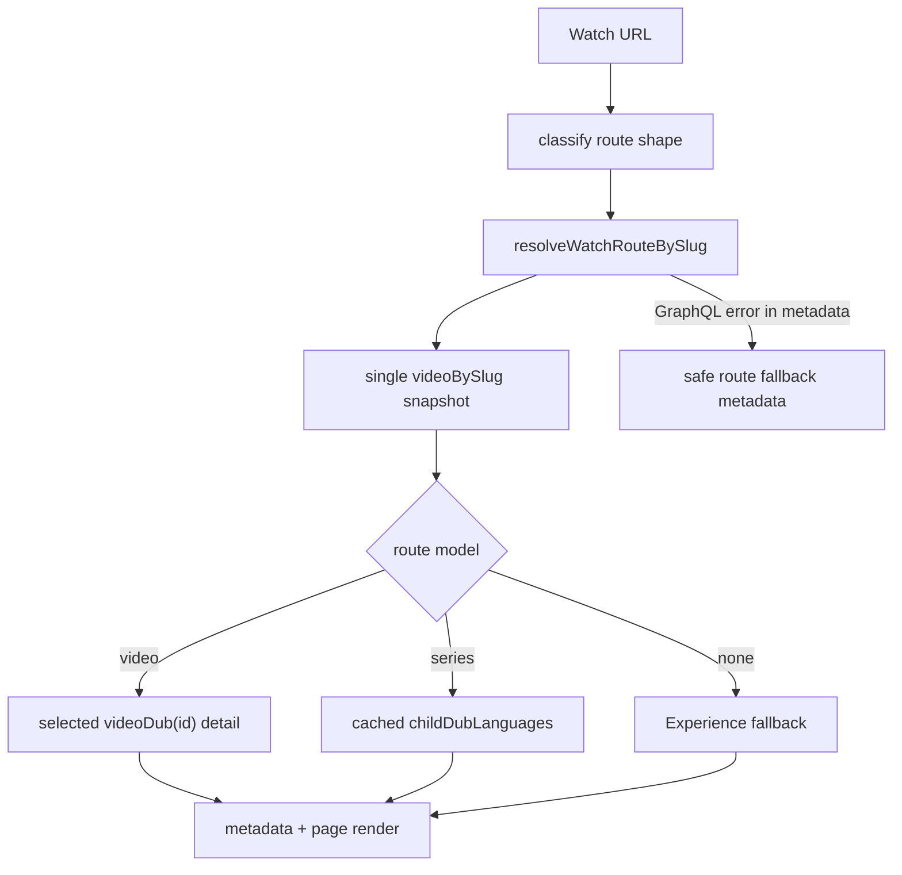

# fix: Reduce Watch videoBySlug cold-path fanout

## Summary

Collapse Watch's cold video resolver from several root `videoBySlug` calls into
one route snapshot call, keep `videoDub(id)` as the selected-Dub detail fetch,
and make metadata/page rendering share the same video-vs-series decision path.

---

## Problem Frame

The prior Watch performance split fixed the largest payload problem by keeping
downloads and subtitles out of the bulk Dub list. It did not fully fix the
cold-path rate-limit problem: shell lookup, localized-copy fallback, carousel
mux IDs, series fallback, and metadata/page render can still spend multiple
`videoBySlug` root-field budget tokens for one public route.

Admin rate-limits by root field and Consumer Bearer identity. A burst of
first-seen Watch routes can therefore exhaust the shared `videoBySlug` budget
before route output caches warm, producing 500s on valid Watch URLs.

---

## Requirements

- R1. Video-bearing Watch routes resolve shell, localized fallback copy, and
  carousel mux IDs through one root `videoBySlug` snapshot operation.
- R2. Heavy Dub fields stay lazy through `videoDub(id)`; downloads and
  subtitles do not rejoin the bulk Dub list.
- R3. Series `childDubLanguages` stays separate and is fetched only after a
  route is confirmed series, preserving its 1 hour cache boundary.
- R4. Metadata and page render use one shared route resolver for
  video/series/none, preserving video-before-Experience precedence.
- R5. Metadata fallback after upstream GraphQL errors does not call
  `getWatchPageMetadata` or `resolveWatchPage`.
- R6. Public URLs, canonical/OG ownership, route TTLs, cache tags, and Admin
  schema remain unchanged.

---

## Key Technical Decisions

- KTD1. **Web-only first:** existing Admin fields can supply the data; an Admin
  projection is deferred unless the single-root snapshot is still too slow.
- KTD2. **Collapse root-field count, not payload discipline:** the previous
  split-query work fixed heavy Dub payloads but still spends too many
  `videoBySlug` rate-limit tokens.
- KTD3. **Add a route-model resolver:** replace separate `watch-video-by-slug`
  and `series-by-slug` decision walks with one cached `video | series | none`
  route model.
- KTD4. **Keep series language union separate:** current code documents that
  folding `childDubLanguages` into every Watch snapshot would tax non-series
  pages and inflate cache values.
- KTD5. **Degrade metadata safely on upstream failure:** route-derived generic
  metadata is better than retrying the heavy resolver path during a
  rate-limit incident.

---

## High-Level Technical Design

---

## Implementation Units

### U1. Route Snapshot Query

- **Goal:** Replace shell, localized-copy fallback, and carousel mux operations
  with one aliased snapshot operation.
- **Requirements:** R1, R2, R6.
- **Dependencies:** None.
- **Files:** `apps/web/src/lib/fragments/watch-video.ts`,
  `apps/web/src/lib/fragments/__tests__/watch-video.test.ts`,
  `apps/web/src/lib/content.ts`, `apps/web/src/lib/content.test.ts`.
- **Approach:** Add a `GetWatchVideoRouteSnapshotBySlug` operation with exact,
  broad-locale, and English aliases for locale-bearing fields. Keep slim Dubs
  in the snapshot and keep selected heavy Dub detail in
  `GetWatchVideoDubDetail`.
- **Patterns to follow:** Existing `adminGraphql()` operation definitions in
  `apps/web/src/lib/fragments/watch-video.ts`; existing merge helpers in
  `apps/web/src/lib/content.ts`; lazy heavy-field pattern in
  `docs/solutions/design-patterns/lean-bulk-lazy-per-item-graphql-fetch-20260604.md`.
- **Test scenarios:**
  - English route uses snapshot plus `videoDub(id)` only.
  - Non-English exact, broad-locale, and English fallback copy merges from
    aliases without extra `videoBySlug` calls.
  - Child relation titles and mux IDs merge without extra `videoBySlug` calls.
  - Fragment tests assert heavy Dub fields remain absent from the snapshot.
- **Verification:** Focused fragment and resolver tests show one snapshot
  operation replaces the shell/copy/mux operation chain.

### U2. Unified Watch Route Resolver

- **Goal:** Make video/series/none classification happen once per
  slug/language cache key.
- **Requirements:** R3, R4.
- **Dependencies:** U1.
- **Files:** `apps/web/src/lib/content.ts`, `apps/web/src/lib/content.test.ts`.
- **Approach:** Add a cached route-model resolver and preserve existing
  exported resolver functions as thin wrappers where practical. Fetch
  `childDubLanguages` only for confirmed series, including series records that
  also have a playable trailer.
- **Patterns to follow:** Current `resolveWatchVideoBySlug`,
  `resolveSeriesBySlug`, `resolveSeriesEpisodeBySlug`, and the separate
  `fetchVideoChildDubLanguages` cache boundary.
- **Test scenarios:**
  - Playable video returns `kind: "video"` with selected Dub detail.
  - Trailerless collection returns `kind: "series"`.
  - Series with trailer includes `childDubLanguages`.
  - Missing or unplayable slug returns `kind: "none"` without caching a false
    miss.
- **Verification:** Existing public resolver exports remain compatible, and
  the new route model has focused coverage for every branch.

### U3. Route Consumers and Metadata Fallback

- **Goal:** Stop metadata and page render from independently walking video to
  series to Experience.
- **Requirements:** R4, R5, R6.
- **Dependencies:** U2.
- **Files:** `apps/web/src/app/[locale]/[htmlLang]/[...rest]/page.tsx`,
  `apps/web/src/app/[locale]/[htmlLang]/[...rest]/__tests__/page-routing.test.tsx`,
  `apps/web/src/lib/experience-metadata.ts`,
  `apps/web/src/lib/experience-metadata.test.ts`.
- **Approach:** Update two-segment and episode branches to consume the shared
  route model. Add a no-admin-call metadata fallback for caught GraphQL errors,
  while keeping normal `none` results eligible for Experience metadata
  fallback.
- **Patterns to follow:** Current video-before-Experience tests from
  `docs/plans/2026-06-11-002-fix-watch-video-precedence-plan.md`.
- **Test scenarios:**
  - Same-slug video and series still beat Experience metadata.
  - Episode metadata keeps the three-segment URL.
  - A simulated `videoBySlug` rate-limit-style GraphQL error returns safe
    metadata and does not call `resolveWatchPage`.
- **Verification:** Route tests prove metadata and render precedence stay
  aligned.

### U4. Validation and Learning Capture

- **Goal:** Prove the fix addresses the production failure mode and preserve
  any durable lesson.
- **Requirements:** R1, R2, R3, R4, R5, R6.
- **Dependencies:** U1, U2, U3.
- **Files:** `docs/roadmap/platform/feat-186-watch-video-by-slug-fanout.md`,
  `docs/plans/2026-06-12-004-fix-watch-video-by-slug-fanout-plan.md`,
  optionally `docs/solutions/performance-issues/`.
- **Approach:** Run focused tests, typecheck/lint for `@forge/web`, then use
  Helium and curl/log probes for the affected Watch route after implementation.
  Capture a solution note only if validation yields reusable guidance beyond
  this patch.
- **Test scenarios:**
  - The affected Watch route renders video or series content without 500.
  - Repeated cold-ish probes do not produce a burst of `videoBySlug`
    rate-limit errors.
  - Existing video/series/Experience precedence tests pass.
- **Verification:** Browser proof and production-style probes support the code
  test evidence before PR handoff.

---

## Scope Boundaries

In scope:

- Web resolver/query consolidation.
- Metadata fallback hardening.
- Focused tests and browser/prod-style validation.

Out of scope:

- Admin schema changes or generated GraphQL artifacts.
- Admin rate-limit increases.
- Cloudflare cache changes.
- Watch URL shape changes.
- Broad Watch redesign.

Deferred follow-up:

- Add an Admin-owned `watchVideoPageBySlug` projection if the consolidated
  Web snapshot is still too slow or still rate-limited under validation.

---

## Risks and Dependencies

- A single larger snapshot could add unnecessary fields to simple video pages.
  Mitigation: keep `childDubLanguages` out of the base snapshot and assert
  heavy Dub fields stay lazy.
- Metadata fallback becomes less content-rich during upstream GraphQL failures.
  Mitigation: use it only for caught resolver errors; normal `none` results
  still use Experience metadata.
- The route-model resolver changes a central Watch path. Mitigation: preserve
  existing exported resolver wrappers and expand route precedence tests before
  merging.

---

## Sources and Research

- Current resolver fanout: `apps/web/src/lib/content.ts`.
- Current GraphQL operations: `apps/web/src/lib/fragments/watch-video.ts`.
- Route metadata/render duplication:
  `apps/web/src/app/[locale]/[htmlLang]/[...rest]/page.tsx`.
- Prior split-query plan:
  `docs/plans/2026-06-11-001-fix-watch-non-cloudflare-performance-plan.md`.
- Payload pattern:
  `docs/solutions/design-patterns/lean-bulk-lazy-per-item-graphql-fetch-20260604.md`.
