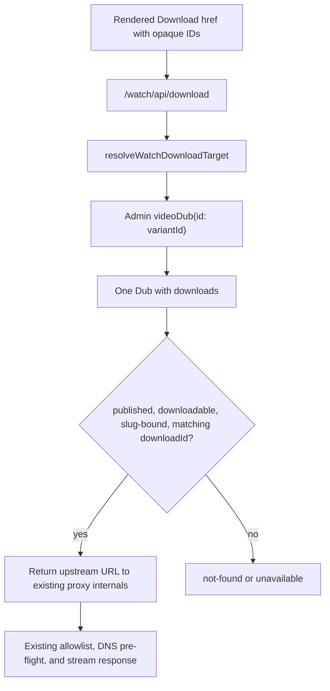

# fix: Harden Watch download target lookup

## Summary

Replace the Watch download proxy's heavy target resolver with an id-scoped Dub
lookup. A download click should resolve only the requested `VideoDub` and its
downloads instead of fetching every Dub for the whole video, while preserving
the existing same-origin proxy, opaque download IDs, account gate, and SSRF
defenses.

## Problem Frame

QA reported a `503` when selecting `Download` on the Pilate Watch page. Live
checks did not reproduce the failure: the rendered same-origin download link
returned `200`/`206`, and the underlying Mux asset was reachable. The brittle
part is the server-side lookup path used before streaming starts.

For the Pilate page, the current resolver calls `videoBySlug` and projects all
Dubs and their downloads for the video. The investigation measured that shape
at 2,259 Dubs, 17,761 download rows, about 3.8 MB of GraphQL response, and about
7.2 seconds. The same target can be resolved through the existing public
`videoDub(id:)` query in about 1.8 KB and about 1.7 seconds. The route maps an
Admin lookup rejection or empty target URL to `503`, so reducing the resolver's
payload and latency is the highest-value fix for intermittent download 503s.

## Requirements

- R1. Resolve a Watch download target by `variantId` through the existing
  public `videoDub(id:)` Admin GraphQL field, not by loading all Dubs through
  `videoBySlug`.
- R2. Keep the download API contract based on opaque `downloadId`, `variantId`,
  and `videoSlug`; raw CDN URLs must remain server-only.
- R3. Reject mismatched combinations: the returned Dub must be published,
  downloadable, belong to the requested `videoSlug`, and contain the requested
  `downloadId`.
- R4. Preserve current route status semantics: missing params return `400`,
  valid-but-mismatched targets return `404`, Admin lookup failures or empty
  upstream URLs return `503`, and upstream streaming errors keep their existing
  behavior.
- R5. Add sanitized diagnostics for lookup failures so future `503`s can be
  tied to the failure class and opaque IDs without logging raw CDN URLs.
- R6. Keep the existing same-origin streaming proxy and SSRF allowlist/DNS
  validation unchanged.
- R7. Add regression coverage that proves the Pilate default download link
  remains an opaque same-origin URL and the target resolver no longer needs the
  full-video Dub graph.

## Key Technical Decisions

### KTD-1: Use `videoDub(id:)` as the resolver root

The Admin schema already exposes `videoDub(id:)` for lazy, per-Dub media
fetches, backed by `VideoService.getDubById`. That matches this click path: the
download API receives one `variantId` and needs only that Dub's downloads.

### KTD-2: Preserve the `videoSlug` binding in the web resolver

The current `videoBySlug` query implicitly proves that the selected `variantId`
belongs to the requested video. After switching to `videoDub(id:)`, the resolver
must keep that protection by validating the returned Dub's slug against the
requested video slug, for example by requiring a normalized
`<videoSlug>/<languageSlug>` prefix match.

### KTD-3: Treat non-downloadable Dubs as not found

`downloadable` is exposed on `VideoDub` and is already used by Admin catalog
queries to identify usable download media. The resolver should require
`downloadable === true` together with `published === true` before accepting a
download row. If implementation finds historic rows with downloads but
`downloadable === false`, that discovery should be handled explicitly rather
than silently weakening the server-side gate.

### KTD-4: Leave proxy security behavior untouched

This plan changes how the upstream URL is discovered, not how it is streamed.
The existing `/watch/api/download` allowlist, URL reconstruction, DNS
pre-flight, redirect handling, bounded headers, and timeout behavior stay in
place.

### KTD-5: Log failure context without leaking targets

Lookup diagnostics should include safe fields such as `videoSlug`, `variantId`,
`downloadId`, and a reason or error class. They must not include the resolved
download URL because raw CDN URLs intentionally remain server-only.

## Technical Design

## Implementation Units

### U1: Narrow the download target query

Files:

- `apps/web/src/lib/download-target.ts`
- `apps/web/src/lib/download-target.test.ts`

Work:

- Replace `GetWatchDownloadTarget($videoSlug: String!)` with a
  `GetWatchDownloadTarget($variantId: ID!)` operation that reads
  `videoDub(id: $variantId)`.
- Select only the fields needed for the target decision: Dub id, slug,
  published, downloadable, and download id/url rows.
- Keep `downloadId`, `variantId`, and `videoSlug` as required inputs before any
  Admin query is sent.
- Validate the returned Dub id, `published`, `downloadable`, slug ownership, and
  matching download row before returning an upstream URL.
- Return `unavailable` for Admin query rejection and for a matching download
  row with an empty URL.

Test scenarios:

- Missing `downloadId`, `variantId`, or `videoSlug` returns `missing-params`
  and does not query Admin.
- A published, downloadable Dub with slug
  `jesus-is-brought-to-pilate/english` and the requested download returns
  `{ ok: true, url }`.
- `videoDub` returning `null` returns `not-found`.
- An unpublished Dub returns `not-found`.
- A non-downloadable Dub returns `not-found`.
- A returned Dub whose slug belongs to another video returns `not-found`.
- A Dub with no matching download id returns `not-found`.
- A matching download with an empty URL returns `unavailable`.
- An Admin query rejection returns `unavailable`.

Patterns to follow:

- `docs/solutions/design-patterns/lean-bulk-lazy-per-item-graphql-fetch-20260604.md`
- `apps/admin/src/graphql/types/video.ts`
- `apps/admin/src/services/video.service.ts`

### U2: Preserve API route behavior and add diagnostics

Files:

- `apps/web/src/app/api/download/route.ts`
- `apps/web/src/app/api/download/route.test.ts`
- `apps/web/src/app/api/download/route.auth.test.ts`
- `apps/web/src/lib/download-target.ts`

Work:

- Keep the route's existing status mapping for resolver results.
- Add sanitized error logging either inside `resolveWatchDownloadTarget` or at
  the route boundary when the resolver returns `unavailable`.
- Keep authentication and terms gating before target resolution exactly as it
  behaves today.
- Keep all SSRF validation and upstream streaming code unchanged.

Test scenarios:

- Resolver `missing-params` still maps to `400`.
- Resolver `not-found` still maps to `404`.
- Resolver `unavailable` still maps to `503`.
- Auth-gated requests do not attempt target resolution before the user/session
  gate passes.
- Logs for lookup failure contain only safe opaque context and do not include a
  raw upstream URL.

Patterns to follow:

- `docs/solutions/security-issues/ssrf-defense-streaming-proxy-and-codeql-fp-20260504.md`
- `docs/roadmap/platform/feat-146-web-user-accounts-download-gate.md`

### U3: Lock the rendered Watch download href contract

Files:

- `apps/web/src/components/watch/WatchPageClient.tsx`
- `apps/web/src/components/watch/__tests__/WatchPageClient.download.test.tsx`
- `apps/web/src/components/watch/download-link.ts`
- `apps/web/src/components/watch/download-options.ts`

Work:

- Keep the rendered Download CTA href as a same-origin
  `/watch/api/download?...` URL containing `downloadId`, `variantId`,
  `videoSlug`, and filename.
- Verify the client still selects the default downloadable tier from the active
  variant without exposing a raw CDN URL.
- Add or tighten a Pilate-shaped regression around the default href, using
  deterministic fixtures rather than live production data.

Test scenarios:

- A downloadable active variant renders a Download href with opaque IDs and no
  raw `stream.mux.com` URL.
- The Pilate fixture emits the expected `videoSlug`,
  `jesus-is-brought-to-pilate`, and passes through the selected `variantId` and
  `downloadId`.
- A variant with no usable download rows does not render a malformed proxy
  href.

### U4: Add smoke criteria for production or preview retest

Files:

- No code files; this is deployment verification for the implemented change.

Work:

- Treat smoke as a deployment verification step rather than a unit test.
- Extract the rendered Pilate Download href from a deployed page.
- Use `HEAD` and a `Range: bytes=0-0` request against the same-origin URL to
  verify downloadability without transferring the full MP4.
- Confirm response headers preserve attachment semantics and avoid exposing raw
  CDN URLs in the rendered page.

Acceptance checks:

- The rendered page includes an opaque `/watch/api/download` href.
- `HEAD` against that href returns success for an authenticated/eligible path.
- `Range: bytes=0-0` returns `206` and an attachment filename.
- The downloaded byte range comes through the same-origin proxy.

## Validation Plan

- `pnpm --filter @forge/web test -- src/lib/download-target.test.ts`
- `pnpm --filter @forge/web test -- src/app/api/download/route.test.ts src/app/api/download/route.auth.test.ts`
- `pnpm --filter @forge/web test -- src/components/watch/__tests__/WatchPageClient.download.test.tsx`
- `pnpm --filter @forge/web typecheck`
- `pnpm --filter @forge/web lint`
- Helium smoke on a deployed or local Watch page for the Pilate download href.

## Scope Boundaries

In scope:

- Watch download target resolution.
- Same-origin download API status behavior and diagnostics.
- Regression tests for opaque download hrefs and resolver target matching.
- Deployment smoke criteria for the Pilate page.

Out of scope:

- Changing the Download modal UI, Terms of Use flow, or account gate.
- Exposing raw CDN download URLs to the client.
- Changing SSRF allowlist, DNS pre-flight, or upstream streaming behavior.
- Changing Admin schema or regenerating `packages/admin-graphql` types unless
  the existing `videoDub(id:)` operation is unexpectedly unavailable to web.
- Fixing unrelated Watch collection routing, share links, SEO metadata, or page
  render performance issues.

## Risks and Mitigations

- Risk: `videoDub.slug` format could drift from the expected
  `<videoSlug>/<languageSlug>` shape.
  Mitigation: encode the normalized slug check in tests. If the shape is not
  stable enough, add a narrow Admin resolver field that returns the parent video
  slug instead of weakening the validation.
- Risk: some historic Dubs may have download rows but `downloadable === false`.
  Mitigation: keep the safer server-side interpretation in the first pass and
  surface any live-data exception as a data or product decision.
- Risk: changing the GraphQL operation could require generated type updates.
  Mitigation: `videoDub` and `downloadable` already exist in the committed
  Admin introspection; implementation should typecheck before considering any
  schema or package regeneration.
- Risk: diagnostics could accidentally log upstream targets.
  Mitigation: keep logging at the resolver decision level and test that raw
  URLs do not appear in unavailable-path logs.

## Acceptance Examples

- AE1. Given the Pilate page's rendered `downloadId`, `variantId`, and
  `videoSlug`, when `/watch/api/download` resolves the target, then Admin is
  queried for one `videoDub(id:)`, the matching download URL is returned to the
  proxy internals, and the response can satisfy a one-byte range request.
- AE2. Given a valid `variantId` from a different video with the Pilate
  `videoSlug`, when the resolver checks the target, then it returns
  `not-found` and the route does not stream any upstream media.
- AE3. Given Admin rejects the `videoDub(id:)` query, when the route handles the
  lookup result, then it returns `503` and records a sanitized lookup failure
  without logging the raw CDN URL.

## Roadmap Note

This plan tracks
`docs/roadmap/platform/feat-186-watch-download-target-lookup.md`, a follow-up
hardening slice for the completed primary-action semantics work in
`docs/roadmap/platform/feat-179-watch-primary-action-semantics.md`.
