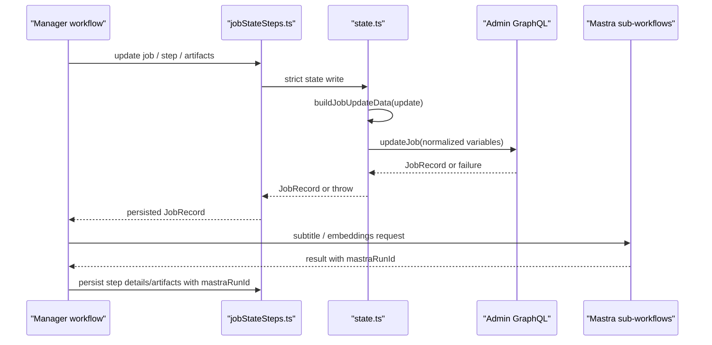

# Fix Manager job state and Mastra correlation

## Summary

Fix Manager enrichment job-state persistence so Admin-backed workflows cannot silently lose terminal step state, then add Mastra run correlation for the Mastra-owned enrichment steps. Manager/Admin remains the canonical source for job status; Mastra run IDs become diagnostic evidence attached to the relevant Manager steps.

## Problem Frame

Production Enrich submission and validation are working: Manager can authenticate the Admin coverage page, validate the selected videos and language, and create an enrichment job. The remaining issue is downstream job-state trust.

A verified production job reached a failed top-level state while multiple steps still appeared `running`, `currentStep` remained set, and the job-level `errors` array was empty. Artifacts for several completed steps were present, which means the workflow made real progress but state persistence did not preserve the failure accurately.

The likely state boundary bug is in Manager admin-mode persistence:

- `videoEnrichment.ts` uses `currentStep: undefined` to clear terminal current-step state.
- `state.ts` has `buildJobUpdateData(...)`, which converts explicit clears such as `currentStep: undefined` into `currentStep: null`.
- The admin-mode `updateJob(...)` path bypasses `buildJobUpdateData(...)` before calling `AdminGraphqlClient.updateJob(...)`.
- `admin-client.ts` serializes GraphQL variables with `JSON.stringify(...)`, which drops `undefined` keys, so Admin never receives the intended null clear.
- Admin-mode state writes can return `null` after update failures, allowing workflow-critical state updates to continue without a persisted failed step or error.

Mastra is relevant for correlation, not for canonical job-state repair. Manager owns the enrichment job record, step list, artifact manifest, and final status. Mastra currently owns subtitle translation/retiming and transcript embedding sub-work; those steps can return `mastraRunId`, but the Manager enrichment workflow does not consistently persist that ID in the job evidence.

## Requirements

R1. Admin-mode Manager job updates must normalize update payloads through the same `buildJobUpdateData(...)` path used for local persistence before calling Admin GraphQL.

R2. Explicit terminal clears must survive serialization. In particular, `currentStep: undefined` from workflow callers must become `currentStep: null` in the Admin update variables.

R3. Workflow-critical state updates must fail loudly when Admin persistence fails or returns `null`. At minimum this applies to `stepUpdateJob`, `stepUpdateStepStatus`, and `stepMergeJobArtifacts`.

R4. Failed step persistence must preserve the failed step status, `finishedAt`, step-level errors, and any job-level error text expected by the workflow.

R5. The fix must preserve existing completed step state and artifacts when a later step fails.

R6. Mastra-owned Manager enrichment steps must persist a minimal correlation record with `mastraRunId` when a run ID is available.

R7. Mastra correlation must avoid storing prompts, transcripts beyond existing artifact rules, raw request bodies, service tokens, or other sensitive payloads in job details.

R8. Tests must cover the Admin-backed persistence path, not only workflow mocks that assert a state helper was called.

## High-Level Design

The implementation should make the Manager state boundary reliable first. Mastra correlation is then layered onto the steps that already call Mastra, so future operators can use the Manager job ID to find the corresponding Mastra run without treating Mastra as the source of truth for Manager job status.

## Key Technical Decisions

1. Keep Manager/Admin as the canonical job-state system.
   Mastra is not running the full enrichment job. It runs selected sub-workflows, so it should provide run correlation and failure evidence only.

2. Normalize at the Manager state boundary.
   Fix `state.ts` so all Admin `updateJob(...)` calls receive `buildJobUpdateData(...)` output. Avoid scattering `currentStep: null` fixes through workflow callers.

3. Add strict workflow write semantics near `jobStateSteps.ts`.
   Broader API callers may rely on `updateJob(...)` returning `null` today. Limit behavioral blast radius by making workflow-facing wrappers throw when a required state write does not persist.

4. Persist small Mastra diagnostics with step details.
   Store `mastraRunId`, status, retryability, failure reason, provider/model where already returned, and language IDs where useful. Do not store prompt text or raw payloads.

5. Treat the current production failure as evidence of a state bug, not the whole root cause.
   The missing `metadata` artifact suggests a Manager-local metadata failure may still need investigation after the state persistence fix preserves real error details.

## Implementation Units

### Unit 1: Normalize Admin Job Updates

Files:

- `apps/manager/src/lib/state.ts`
- `apps/manager/src/lib/state.test.ts`

Plan:

- Route the admin-mode `updateJob(...)` update object through `buildJobUpdateData(...)` before calling `AdminGraphqlClient.updateJob(...)`.
- Preserve existing local-mode behavior.
- Confirm normalization covers:
  - `currentStep: undefined` -> `currentStep: null`
  - explicit date clears such as `completedAt: undefined` when supported by the helper
  - `steps` serialization through `toStepInput(...)`

Tests:

- Add an admin-mode test asserting `updateJob(jobId, { currentStep: undefined })` calls the Admin client with `currentStep: null`.
- Add a regression assertion that the normalized Admin update still includes ordinary fields such as `status` and `updatedAt`.
- Keep the existing direct `buildJobUpdateData(...)` tests as lower-level coverage.

### Unit 2: Make Workflow-Critical Writes Strict

Files:

- `apps/manager/src/workflows/jobStateSteps.ts`
- `apps/manager/src/lib/state.ts`
- `apps/manager/src/lib/state.test.ts`
- `apps/manager/src/workflows/videoEnrichment.test.ts`

Plan:

- Add strict workflow-facing behavior for:
  - `stepUpdateJob`
  - `stepUpdateStepStatus`
  - `stepMergeJobArtifacts`
- If the underlying Admin-backed write throws or returns `null`, throw a descriptive workflow error that includes the attempted operation and job ID.
- Keep non-workflow API callers on the existing state API unless the repo review shows a safe global throw is already expected.

Tests:

- Add an admin-mode failure test where `adminUpdateJobMock` rejects during `updateStepStatus(...)`.
- Assert the failure is not swallowed and does not leave the workflow believing a step is still running successfully.
- Add focused tests for strict wrapper behavior when `updateJob(...)`, `updateStepStatus(...)`, or `mergeJobArtifacts(...)` returns `null`.

### Unit 3: Preserve Failed Step and Terminal State

Files:

- `apps/manager/src/lib/state.ts`
- `apps/manager/src/lib/state.test.ts`
- `apps/manager/src/workflows/videoEnrichment.ts`
- `apps/manager/src/workflows/videoEnrichment.test.ts`

Plan:

- Verify the workflow failure path persists:
  - failed top-level status
  - cleared `currentStep`
  - failed step status
  - step-level error details
  - expected job-level error details
  - preserved artifacts and completed steps from earlier work
- Prefer fixing the persistence boundary before changing workflow failure semantics.
- If workflow terminal updates currently omit job-level `errors`, make the error persistence explicit in the same terminal failure write.

Tests:

- Strengthen the metadata failure test so it proves the failed step and terminal job update would survive Admin-mode persistence.
- Add an assertion that terminal failure writes clear `currentStep` as `null` at the Admin client boundary.
- Add a regression test where completed artifacts remain present after a later step fails.

### Unit 4: Persist Mastra Run Correlation

Files:

- `apps/manager/src/workflows/videoEnrichment.ts`
- `apps/manager/src/workflows/videoEnrichment.test.ts`
- `apps/manager/src/services/mastra-subtitle-enrichment.ts`
- `apps/manager/src/services/mastra-transcript-embeddings.ts`
- `apps/manager/src/workflows/transcriptOnlyPipeline.ts`
- `apps/manager/src/workflows/transcriptOnlyPipeline.test.ts`

Plan:

- For subtitle translation, keep the existing language result behavior needed by downstream mux sync, but also preserve `mastraRunId` in step details or a small diagnostic artifact.
- For transcript embeddings, persist the returned `mastraRunId` and existing non-sensitive metadata such as provider/model/chunk count/source hash where already available.
- For Mastra failure envelopes, preserve `mastraRunId`, `reason`, and `retryable` when available.
- Reuse the `transcriptOnlyPipeline.ts` pattern for exposing `mastraRunId` instead of inventing a separate correlation shape.

Tests:

- Add a subtitle success test proving the Manager job evidence includes the Mastra subtitle run ID.
- Add an embeddings success test proving the Manager job evidence includes the Mastra transcript embeddings run ID.
- Add a Mastra failure test proving a returned `mastraRunId` is preserved with the failed step evidence.
- Add a negative assertion that raw prompt/request content is not persisted in step details.

### Unit 5: Operator Readback and Validation

Files:

- `apps/manager/src/app/api/jobs/[id]/route.test.ts`
- `apps/manager/src/app/api/jobs/route.test.ts`
- `apps/manager/src/features/jobs/live-job-steps-table.tsx`
- `apps/manager/src/features/jobs/live-job-steps-table.test.tsx`

Plan:

- Verify existing job detail/readback APIs return the persisted step details and errors.
- Only adjust UI rendering if existing job details hide generic step `details` or `errors`.
- Avoid a new debugging UI unless the current job details surface cannot expose the needed information.

Tests:

- Add or update route tests to assert job readback includes step errors and Mastra run correlation when present.
- If UI changes are needed, add a small rendering test that shows a Mastra run ID in the relevant step details without exposing sensitive payloads.

## Acceptance Examples

1. When a workflow terminal failure passes `currentStep: undefined`, the Admin client receives `currentStep: null`.

2. When Admin rejects an `updateStepStatus(...)` write during a workflow step, the workflow surfaces a persistence failure instead of silently continuing with stale step state.

3. When metadata generation fails after earlier steps complete, the job readback shows top-level `failed`, a cleared current step, the metadata step marked `failed`, preserved completed steps, preserved artifacts, and useful error text.

4. When subtitle translation succeeds through Mastra, the Manager job evidence includes the subtitle `mastraRunId`.

5. When transcript embeddings succeeds through Mastra, the Manager job evidence includes the embeddings `mastraRunId`.

6. When a Mastra-owned step fails and returns a run ID, the failed Manager step includes that `mastraRunId`, failure reason, and retryability.

## Scope Boundaries

In scope:

- Manager admin-mode job update normalization.
- Workflow-facing strict persistence wrappers.
- Failure-state preservation for Manager enrichment jobs.
- Minimal Mastra run correlation for subtitle translation and transcript embeddings.
- Focused unit and workflow tests.

Out of scope:

- Moving the full Manager enrichment workflow into Mastra.
- Treating Mastra as the canonical source for Manager job status.
- Repairing historical production jobs.
- Redesigning the live jobs SSE/fallback system.
- Redesigning metadata generation or audio cleanup.
- Adding a new Mastra Studio UI link unless the run URL format is already stable and documented in the repo.

## Risks and Mitigations

- Risk: Strict persistence writes can make workflows fail earlier and more visibly.
  Mitigation: Limit strict semantics to workflow-facing wrappers and assert behavior in tests.

- Risk: Existing API callers may depend on nullable state helpers.
  Mitigation: Keep the broad helper contract unless review proves a global throw is safe.

- Risk: Mastra details could accidentally persist sensitive payloads.
  Mitigation: Persist only explicit allowlisted fields and test that raw request/prompt content is absent.

- Risk: The original metadata failure remains after state persistence is fixed.
  Mitigation: Treat this plan as the prerequisite that makes the next failure diagnosable; add a follow-up investigation only after reliable error persistence lands.

## Verification

Targeted local validation:

- `pnpm --filter @forge/manager test -- state.test.ts`
- `pnpm --filter @forge/manager test -- videoEnrichment.test.ts`
- `pnpm --filter @forge/manager test -- mastra-subtitle-enrichment.test.ts`
- `pnpm --filter @forge/manager test -- mastra-transcript-embeddings.test.ts`

PR-focused validation:

- Run the Manager test target covering touched files.
- Run format/typecheck for the Manager scope using the repo's existing commands.
- If UI rendering changes are made in Unit 5, run the relevant component tests and a Manager browser smoke.

Production validation after merge:

- Submit a small authenticated Manager Enrich job.
- Confirm job readback shows terminal state with `currentStep: null` after completion or failure.
- Confirm Mastra-owned steps include run correlation when those steps execute.
- If a job fails, confirm the failed step and error are visible without direct database inspection.

## Sources and Research

- `docs/plans/2026-06-13-001-fix-manager-coverage-admin-enrich-now-plan.md`
- `docs/roadmap/media-generation/feat-031-ai-video-enrichment-pipeline.md`
- `docs/roadmap/media-generation/feat-106-manager-live-jobs-sse-fallback.md`
- `docs/roadmap/media-generation/feat-184-mastra-subtitle-enrichment-execution.md`
- `docs/roadmap/media-generation/feat-186-manager-coverage-admin-enrich-now.md`
- `apps/manager/src/lib/state.ts`
- `apps/manager/src/lib/state.test.ts`
- `apps/manager/src/backend/admin-client.ts`
- `apps/manager/src/workflows/jobStateSteps.ts`
- `apps/manager/src/workflows/videoEnrichment.ts`
- `apps/manager/src/workflows/videoEnrichment.test.ts`
- `apps/manager/src/services/mastra-subtitle-enrichment.ts`
- `apps/manager/src/services/mastra-transcript-embeddings.ts`
- `apps/manager/src/workflows/transcriptOnlyPipeline.ts`
- `apps/manager/src/workflows/transcriptOnlyPipeline.test.ts`
- `apps/mastra/src/mastra/workflows/subtitle-enrichment.ts`
- `apps/mastra/src/mastra/index.ts`

## Deferred Follow-Up

- Re-run production Enrich after this fix and investigate the actual preserved metadata/audio cleanup failure if one remains.
- Consider a narrow historical job repair script only if operators need old stuck jobs cleaned up.
- Add direct Mastra Studio links only after the stable URL shape is known.
- Add a direct Mastra run-status lookup only if run IDs alone are not enough for operations.
