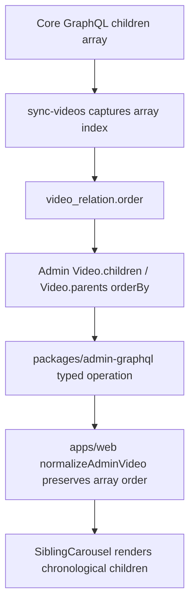

# fix: preserve Core video relation order for Watch

## Summary

Preserve the ordered child-video sequence returned by Core when Forge Admin syncs `VideoRelation` rows, then make Admin GraphQL return parent/child relations in that persisted order. Web should continue rendering the relation arrays it receives, so `watch.jesusfilm.org` matches the chronological order currently seen on `www.jesusfilm.org`.

---

## Problem Frame

The JESUS collection on `www.jesusfilm.org` is ordered correctly because the legacy public app fetches `video(id: "jesus/english", idType: slug) { children { ... } }` from Core and renders that array without sorting. The live Core response begins `the-beginning`, `birth-of-jesus`, `childhood-of-jesus`, and continues chronologically.

Forge Admin currently imports the same relation set but does not persist the returned array position. `VideoRelation.order` exists in the data model, yet JESUS child relations have `order = null`, and Admin's `Video.children` relation has no `orderBy`. Web normalizes and renders the received array as-is, so the wrong database-return order leaks into the Watch carousel.

---

## Requirements

**Order Preservation**

- R1. Core's child-array position is persisted to `VideoRelation.order` during the `videos` Core sync phase.
- R2. Existing `VideoRelation.order` values are backfilled for Core-sourced videos through a full or targeted video sync, not by Web-side hardcoding.
- R3. Admin GraphQL returns `Video.parents` and `Video.children` in deterministic relation order for public, viewer, editor, and admin callers.

**Consumer Contract**

- R4. Web's Watch data layer and `SiblingCarousel` continue to preserve upstream order without adding local chronological sorting logic.
- R5. Generated Admin GraphQL artifacts are refreshed or verified after resolver-source changes, even if the SDL remains unchanged.

**Verification and Rollout**

- R6. The JESUS relation order is verified against Core/www ordering after backfill, with the first visible children matching `the-beginning`, `birth-of-jesus`, and `childhood-of-jesus`.
- R7. Implementation follows repo workflow by creating or linking a roadmap ticket before code work if no exact ticket exists.

---

## Key Technical Decisions

- **Use Core array position as the authoritative relation order.** Core's `children` field already returns the chronological sequence used by `www`; Forge does not need a new external order field to match it.
- **Store order in Admin, not Web.** Persisting `VideoRelation.order` makes every Admin consumer inherit the same relation order and avoids duplicating a Watch-specific workaround in `apps/web`.
- **Keep `VideoRelation.order` nullable with nulls-last fallback.** The column already exists, so the fix does not need a schema migration. Resolver ordering should place populated order values first, then fall back to `createdAt` and `id` for legacy or partially synced rows.
- **Backfill by resyncing the videos phase.** The existing full-sync script can refresh relation rows and fill order for touched videos. A one-off SQL patch would be faster for JESUS only, but it would not fix other collections or document the contract in the sync path.
- **Regenerate/verify schema artifacts even when SDL is stable.** The change lives in Admin Pothos resolver source. The SDL is expected to stay the same, but the admin guide requires `schema:print` and `@forge/admin-graphql generate` after changes under `src/graphql/types/`.

---

## High-Level Technical Design

The key change is the middle of the flow: Forge already receives Core children in the right order, but the sync currently stores only `parent_id` and `child_id`. Once the order is written to `video_relation.order` and relations are always read with deterministic ordering, Web can remain a simple renderer of Admin's contract.

---

## Implementation Units

### U1. Persist Core child array position in video relation sync

- **Goal:** Write `VideoRelation.order` from the position of each child in Core's `video.children` array.
- **Requirements:** R1, R2
- **Dependencies:** none
- **Files:**
  - Modify: `apps/admin/src/services/core-sync/phases/sync-videos.ts`
  - Modify: `apps/admin/src/services/core-sync/phases/sync-videos.test.ts`
- **Approach:** Extend `pendingRelations` and the derived `videoRelationRows` to carry `order`. The child loop should retain Core array order by using the child index plus one. The bulk insert into `video_relation` should include the `order` column in the same `unnest` statement that writes `id`, `parent_id`, and `child_id`.
- **Patterns to follow:** Existing `order` handling for study questions and Bible citations in `sync-videos.ts`; existing PostgreSQL array casting via `toPgArray`; Core sync bulk write conventions in `docs/solutions/cms/core-sync-per-page-upsert-pattern.md`.
- **Test scenarios:**
  - Given a Core video with children `[child-a, child-b, child-c]`, the relation insert receives order values `1`, `2`, and `3` matched to the correct child ids.
  - Given a child Core id that is not present in Admin, the relation is skipped without shifting the order values for remaining children.
  - Given a full sync of a touched parent, existing relations for that parent are deleted before ordered rows are inserted.
  - Given duplicate parent/child rows from Core, conflict handling does not create duplicate relations.
- **Verification:** The sync test inspects the relation insert path and proves order values are carried alongside child ids.

### U2. Return Video relations from Admin GraphQL in deterministic order

- **Goal:** Make `Video.parents` and `Video.children` return relation rows ordered by `VideoRelation.order`.
- **Requirements:** R3
- **Dependencies:** U1 for populated order values
- **Files:**
  - Modify: `apps/admin/src/graphql/types/video.ts`
  - Modify: `apps/admin/src/graphql/types/video.principal-filter.test.ts`
  - Verify/regenerate: `apps/admin/schema.graphql`
  - Verify/regenerate: `packages/admin-graphql/src/admin-graphql-env.d.ts`
- **Approach:** Add a shared relation ordering shape to the existing `videoParentsFilter` and `videoChildrenFilter` helpers. Public, viewer, and consumer-bearer callers keep the current published-child or published-parent visibility filters; editor/admin callers should still receive an ordering object rather than an empty query object. Use populated `order` first with `nulls: "last"`, then `createdAt` and `id` ascending so unsynced rows have deterministic placement.
- **Patterns to follow:** Pothos `t.relation(..., { query })` ABAC guidance in `docs/solutions/graphql/pothos-relation-abac-filter-required-for-nested-types.md`; current principal filter tests in `video.principal-filter.test.ts`.
- **Test scenarios:**
  - Anonymous `videoChildrenFilter` keeps the published-child visibility filter and includes `order asc nulls last`, `createdAt asc`, and `id asc` relation ordering.
  - Viewer and consumer-bearer filters match anonymous visibility and ordering.
  - Editor/admin filters include ordering even when no visibility restriction is applied.
  - Parent relation filtering receives the same ordering treatment as child relation filtering.
  - Schema printing and admin-graphql generation produce no unexpected SDL/type drift.
- **Verification:** Unit tests assert the returned Prisma query objects include both visibility filters and `orderBy`; generated artifacts are clean or committed if they change.

### U3. Preserve Web's order-pass-through contract

- **Goal:** Confirm Web does not need a local sorting patch and continues to render Admin relation order.
- **Requirements:** R4, R5
- **Dependencies:** U2
- **Files:**
  - Verify: `apps/web/src/lib/fragments/watch-video.ts`
  - Verify: `apps/web/src/lib/fragments/__tests__/watch-video.test.ts`
  - Verify: `apps/web/src/lib/content.ts`
  - Verify: `apps/web/src/lib/__tests__/content-watch-merge.test.ts`
  - Verify: `apps/web/src/components/watch/__tests__/SiblingCarousel.test.tsx`
- **Approach:** Treat Web as a contract consumer. The existing fragment projects `children { child { ... } }` and `parents { parent { children { child { ... } } } }`; the normalizer maps the arrays without sorting, and the carousel filters invalid slugs without reordering. Implementation should avoid adding a Web-side chronological list or slug ranking. Add or adjust Web tests only if implementation touches the fragment or normalizer.
- **Patterns to follow:** Watch fragment contract tests in `watch-video.test.ts`; SiblingCarousel behavioral tests for pass-through rendering and filtering.
- **Test scenarios:**
  - Test expectation: none for pure no-op verification if Admin's SDL does not change.
  - If generated types or fragment selections change, the fragment printer test still asserts relation selections are present.
  - If the normalizer is touched, a fixture with children in `[third, first, second]` order returns the same order after normalization and merge.
  - If `SiblingCarousel` is touched, a block with ordered children renders cards in input order after invalid-slug filtering.
- **Verification:** Web typecheck and targeted Watch tests pass; no Web sort logic is introduced.

### U4. Backfill ordered relations in target environments

- **Goal:** Populate `video_relation.order` for existing Core-sourced video relations.
- **Requirements:** R2, R6, R7
- **Dependencies:** U1 deployed to the environment being backfilled
- **Files:**
  - Use existing operator script: `apps/admin/src/scripts/run-sync.ts`
  - Reference package guide: `apps/admin/AGENTS.md`
- **Approach:** Run the existing Core sync script in full mode for the `videos` scope against each target database that needs corrected relation order. The script defaults to full backfill when `--incremental=false`, and the `videos` phase deletes touched parent relations before inserting the refreshed ordered rows. Operators should confirm the redacted database URL before running because the script intentionally has no production guard.
- **Patterns to follow:** Admin local-dev script guidance in `apps/admin/AGENTS.md`; Core sync lock and watermark behavior in `apps/admin/src/services/core-sync/orchestrator.ts`.
- **Test scenarios:**
  - Test expectation: none -- this is an operational data refresh using existing sync code.
  - Before backfill, a sample parent such as JESUS has child relations with `order = null`.
  - After backfill, the same parent has contiguous order values beginning at one for resolved child relations.
  - Running the sync a second time leaves the same order values and relation count.
- **Verification:** Query Admin GraphQL for `videoBySlug(slug: "jesus") { children { order child { slug } } }` and confirm first children match the Core/www sequence.

### U5. Prove parity against Core/www and browser behavior

- **Goal:** Verify the shipped behavior with data-level and browser-level proof.
- **Requirements:** R4, R6
- **Dependencies:** U1, U2, U4
- **Files:**
  - Verify: `apps/web/src/components/watch/SiblingCarousel.tsx`
  - Verify: `apps/web/src/lib/content.ts`
- **Approach:** Compare the Core API child slug list for `jesus/english` with Admin's `videoBySlug(slug: "jesus")` child list after backfill. Then load the Watch URL with Helium/agent-browser per repo guidance and confirm the visible carousel begins with the same chronological children. Account for Web ISR/unstable-cache staleness before treating a stale page as a failed fix.
- **Patterns to follow:** Helium/browser proof guidance from the repo instructions; Watch URL behavior already uses Admin GraphQL through `@forge/admin-graphql`.
- **Test scenarios:**
  - Core and Admin return the same child slug count for JESUS.
  - Core and Admin child slug arrays match position-by-position after filtering to resolved/playable children.
  - The Watch page renders the first carousel cards in Admin order.
  - A child page's active index aligns with the ordered carousel position.
- **Verification:** Data comparison has zero mismatches; browser smoke captures the ordered carousel or an equivalent DOM snapshot.

---

## Acceptance Examples

- AE1. Given Core returns JESUS children beginning `the-beginning`, `birth-of-jesus`, and `childhood-of-jesus`, when Admin syncs and backfills the `videos` phase, then `VideoRelation.order` stores those positions as `1`, `2`, and `3`.
- AE2. Given a public Admin GraphQL caller queries `videoBySlug(slug: "jesus") { children { order child { slug } } }`, when the relation rows have order values, then the returned children are sorted by `order` before fallback fields.
- AE3. Given Web receives an ordered `children` array from Admin, when `normalizeAdminVideo`, `buildSiblingCarouselBlock`, and `SiblingCarousel` process it, then the final visible cards preserve the same relative order.
- AE4. Given Web cache still holds an older route render after backfill, when cache freshness expires or the route is revalidated, then the displayed carousel order matches Admin's current relation order.

---

## Scope Boundaries

- This plan does not introduce a Web-side hardcoded order list, slug ranking, or manual JESUS-only exception.
- This plan does not change the public URL shape or Watch routing.
- This plan does not add a new `VideoRelation` schema column; `order` already exists.
- This plan does not attempt to solve relation direction bugs beyond preserving and reading relation order. If relation direction regresses, use the existing `Video.parents` / `Video.children` back-reference learning as a separate fix.

### Deferred to Follow-Up Work

- Add a relation-order drift monitor if additional live collections show recurrent Core/Admin mismatches after this fix.
- Consider an index on `(parent_id, order)` only if profiling shows relation ordering is a meaningful query cost.
- Formalize a narrow operator runbook for production Core sync backfills if this manual backfill pattern becomes common.

---

## System-Wide Impact

The change affects the Admin data contract for all consumers of `Video.parents` and `Video.children`, including Web Watch pages and any internal Admin surfaces that read video relations. It should improve determinism without changing GraphQL schema shape. The only persistent data mutation is filling `video_relation.order` during sync/backfill.

Because Web uses cached server data, rollout proof must distinguish Admin data correctness from stale rendered output. A correct Admin response with a stale Web route means the data fix worked and the remaining issue is cache freshness or revalidation.

---

## Risks & Dependencies

- **Null order rollout risk:** Existing rows remain `null` until the videos phase backfills them. Mitigation: deploy code before running the full videos sync and use nulls-last fallback ordering for partial states.
- **Backfill runtime risk:** A full videos sync can be long-running against production data. Mitigation: use `scope=videos`, rely on the existing sync lock, watch per-phase logs, and avoid running concurrent sync jobs.
- **Generated artifact drift:** Resolver-source changes may not alter SDL, but the admin guide still requires schema print and admin-graphql generation. Mitigation: run both and commit only real diffs.
- **Relation direction confusion:** The repo has prior history around `Video.parents` and `Video.children` semantics. Mitigation: keep tests focused on the current GraphQL contract and do not combine this order fix with a relation-label refactor.

---

## Sources & Research

- `apps/admin/src/services/core-sync/phases/sync-videos.ts` - current Core video sync, relation delete/insert path, and existing ordered nested entity handling.
- `apps/admin/src/services/core-sync/phases/sync-videos.test.ts` - focused unit coverage for nested Core video entity writes.
- `apps/admin/src/graphql/types/video.ts` - `VideoRelation.order`, `Video.parents`, and `Video.children` GraphQL relation definitions.
- `apps/admin/src/graphql/types/video.principal-filter.test.ts` - principal-aware relation filter regression tests.
- `apps/web/src/lib/fragments/watch-video.ts` - Web's Admin GraphQL video relation projection.
- `apps/web/src/lib/content.ts` - relation normalization and dedupe path that preserves input order.
- `apps/web/src/components/watch/SiblingCarousel.tsx` - carousel rendering path that filters invalid children without sorting.
- `docs/solutions/database-issues/prisma-video-relation-inverted-back-references-20260514.md` - prior relation-direction learning and risk context.
- `docs/solutions/graphql/pothos-relation-abac-filter-required-for-nested-types.md` - Pothos relation query callback and ABAC filter guidance.
- `docs/solutions/cms/core-sync-per-page-upsert-pattern.md` - Core sync per-page write pattern.
- Live probe context: Core `api-gateway.central.jesusfilm.org` returns JESUS children in chronological order for `jesus/english`; `www.jesusfilm.org` renders that Core order without client sorting.
