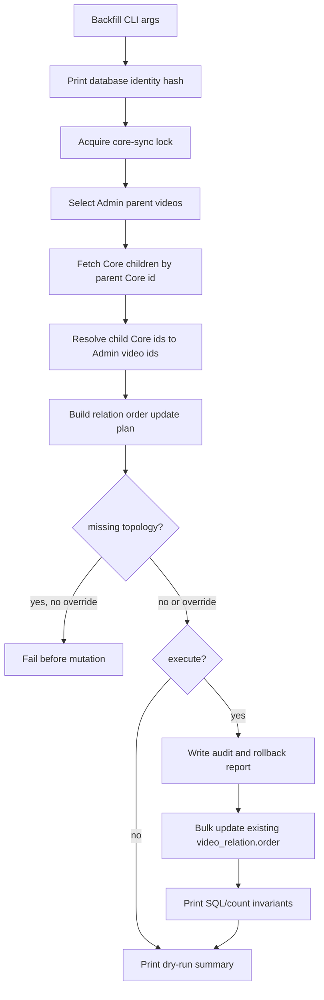

# fix: add targeted video relation order backfill

## Summary

Add a targeted Admin backfill script that updates existing `video_relation.order`
values from Core child-array positions without running a full `videos` sync.
The script reuses Core sync locking, retry, dry-run, and progress patterns while
keeping Watch as a pass-through consumer of Admin relation order.

---

## Problem Frame

`feat-190` made normal Core sync persist child relation order and made Admin
GraphQL read relations deterministically. Existing production rows still need a
data backfill. The original operator path was a full `videos` sync, but that
touches all published video metadata and can run long enough to make SSH
sessions and production pool pressure the operational bottleneck.

Live Core probes on 2026-06-16 UTC counted 1,104 published videos, but only 117
parent videos with children and 1,536 relation edges. JESUS has 61 children.
This repair should operate on that relation-sized surface, not on every video
metadata row.

---

## Requirements

**Backfill Behavior**

- R1. The new backfill derives each relation order from Core's 1-based
  `children` array position for selected Core parent videos.
- R2. The script updates only existing Admin `VideoRelation` rows and reports
  missing Core parents, children, or relation rows without creating or deleting
  them.
- R3. The script defaults to dry-run and requires an explicit target guard plus
  `--execute` before mutating data.
- R4. Full-catalog mode is supported for Admin relation-bearing parents, while
  explicit slug/core-id targets are selected even when they currently have zero
  Admin child relations.

**Operational Safety**

- R5. The script uses the existing Core sync lock and heartbeat so it cannot run
  concurrently with normal Core sync.
- R6. The script does not advance Core sync watermarks, run full-sync
  soft-delete logic, or rewrite video metadata.
- R7. Progress and completion logs expose selected parents, fetched Core
  parents, relation updates, unchanged rows, missing rows, errors, and dry-run
  status without printing secrets.
- R8. Transient Prisma pool-acquire failures are retried at batch transaction
  boundaries, using the existing pool-timeout helper.
- R9. Execute mode fails closed on missing Core parents, missing Admin child
  videos, or missing relation rows unless an explicit missing-topology override
  is supplied.
- R10. Execute mode writes an audit report with old and new order values plus
  rollback SQL before reporting success.
- R11. Execute mode requires the operator to confirm the non-secret database
  identity hash printed by dry-run/startup output.

**Verification**

- R12. The JESUS verification path remains Admin GraphQL first, with Watch cache
  freshness treated as a separate post-backfill concern.
- R13. Batch and full-catalog runs expose relation-order SQL/count invariants
  and sampled parent checks, not only the JESUS GraphQL check.
- R14. The implementation updates Admin script documentation and roadmap state
  so future operators do not fall back to the full `videos` sync for this
  repair.

---

## Key Technical Decisions

- **Relation-only repair:** Build a dedicated script instead of reusing
  `run-sync --scope=videos --incremental=false`, because the needed write set
  is existing relation rows rather than full video metadata.
- **Existing-row updates only:** Missing Core/Admin child mappings or missing
  `VideoRelation` rows fail execute by default, so this script cannot
  accidentally treat stale topology as a successful order repair.
- **Targeted CLI contract:** Mirror `core-sync:backfill-video-localized-metadata`
  by defaulting to dry-run, requiring a target guard, and making broad catalog
  execution explicit.
- **Lock before reads:** Acquire and heartbeat the Core sync lock before
  selection, Core fetch, planning, or writes in both dry-run and execute mode so
  the report cannot race a normal sync.
- **Audited batch transaction boundary:** Fetch Core data outside the write
  transaction, persist old/new order evidence in a report, and wrap the
  idempotent relation update batch in the existing Prisma pool-timeout retry
  helper.
- **Database confirmation hash:** Print a hash derived from non-secret database
  identity fields and require it in execute mode, reducing the chance of running
  a production repair against the wrong target.
- **No schema or GraphQL artifacts:** The work adds an operator script and
  tests only; Admin GraphQL already exposes ordered relations from `feat-190`.

---

## High-Level Technical Design

The script should treat selection, Core fetch, update planning, audit output,
and mutation as separate seams so tests can prove dry-run safety, fail-closed
behavior, and missing-row reporting without connecting to Core or Postgres.

---

## Implementation Units

### U1. Add CLI contract and target selection

- **Goal:** Create the script shell with guarded args, dry-run defaults, and
  Admin parent selection.
- **Requirements:** R3, R4, R11, R14
- **Dependencies:** none
- **Files:**
  - Create: `apps/admin/src/scripts/backfill-video-relation-order.ts`
  - Create: `apps/admin/src/scripts/backfill-video-relation-order.test.ts`
  - Modify: `apps/admin/package.json`
  - Modify: `apps/admin/AGENTS.md`
- **Approach:** Mirror the localized metadata backfill parser shape. Accept
  `--slug`, `--core-id`, `--limit`, `--full-catalog`, `--execute`,
  `--verbose`, `--batch-size`, `--allow-missing-topology`,
  `--confirm-database`, `--report-out`, and optional
  `--transaction-timeout-ms`. Explicit slug/core-id targets select the Admin
  parent even when it has no existing relation rows; limit/full-catalog modes
  select CORE, non-deleted parents that already have at least one child
  relation. Print a non-secret database identity hash during dry-run/startup and
  require the same hash in execute mode.
- **Patterns to follow:** `apps/admin/src/scripts/backfill-video-localized-metadata.ts`
  for arg parsing, dry-run guardrails, target selection, and package script
  registration.
- **Test scenarios:**
  - Broad invocation with no guard throws a clear refusal.
  - `--slug=jesus` and `--core-id=1_jf-0-0` both select one targeted parent.
  - `--limit=10` selects at most ten relation-bearing CORE parents.
  - Explicit `--slug` selects an Admin parent even when it has zero child
    relation rows.
  - Execute mode without matching `--confirm-database` fails before Core fetch
    or writes.
  - Dry-run mode does not call Core or transaction writes in this unit's
    selection-only path.
- **Verification:** Argument and selection tests prove the CLI cannot mutate a
  broad target by accident.

### U2. Build Core relation order planning and bulk updates

- **Goal:** Fetch Core children for selected parents, map them to existing Admin
  rows, and update relation order in batch.
- **Requirements:** R1, R2, R6, R8, R9, R10, R13
- **Dependencies:** U1
- **Files:**
  - Modify: `apps/admin/src/scripts/backfill-video-relation-order.ts`
  - Modify: `apps/admin/src/scripts/backfill-video-relation-order.test.ts`
- **Approach:** Fetch Core videos in parent batches using
  `videos(where: { published: true, ids: [...] }) { id slug children { id slug } }`
  and validate that response with a dedicated relation-order schema. Resolve all
  child Core ids for the batch through Admin `Video.coreId`. Build update rows
  only where both parent and child exist in Admin and an existing
  `VideoRelation` row is present. Fail execute by default when the plan contains
  missing Core parents, children, or relation rows; `--allow-missing-topology`
  can turn that into an explicit partial repair. Apply writes with one
  array-bound raw SQL update per batch, guarded by parallel-array length checks
  and `IS DISTINCT FROM` so unchanged rows are counted separately. The report
  captures parent id, child id, old order, new order, Core position, and
  rollback SQL for every changed relation.
- **Patterns to follow:** `sync-videos.ts` relation extraction for Core array
  positions, `sync-dubs.ts` / `toPgArray` for low-bind raw SQL, and
  `pool-timeout-retry.ts` for retry boundaries.
- **Test scenarios:**
  - Core children `[child-a, child-b, child-c]` produce orders `1`, `2`, `3`.
  - Missing child Admin rows are counted and do not renumber later children.
  - Missing `VideoRelation` rows fail execute by default and are not inserted.
  - `--allow-missing-topology` records missing rows while allowing present rows
    to update.
  - Existing order values that already match are left unchanged and counted as
    unchanged.
  - A Prisma P2024 thrown by the batch transaction retries the same batch and
    only merges counts from the successful attempt.
  - The audit report contains enough old/new order data to restore the touched
    rows.
- **Verification:** Unit tests prove update planning is idempotent and cannot
  create/delete relation topology.

### U3. Add lock, heartbeat, progress, and operator reporting

- **Goal:** Make the script safe to run as an unattended operator process.
- **Requirements:** R5, R7, R8, R12, R13
- **Dependencies:** U2
- **Files:**
  - Modify: `apps/admin/src/scripts/backfill-video-relation-order.ts`
  - Modify: `apps/admin/src/scripts/backfill-video-relation-order.test.ts`
  - Modify: `apps/admin/AGENTS.md`
- **Approach:** Export an injectable runner seam that accepts `argv`, env,
  logger, timer controls, a Prisma factory, and lock helpers; keep the import
  guard's `main()` as a thin wrapper. Reuse `acquireSyncLock`,
  `refreshSyncLock`, and `releaseSyncLock` with a relation-order-specific holder
  id before selection or Core fetch. Emit structured start, progress,
  completion, and fatal events. Include the dry-run flag, selected parent count,
  fetched parent count, missing Core parent count, relation rows planned,
  updated, unchanged, missing-child count, missing-relation count, report path,
  and errors. Redact the database URL the same way `run-sync.ts` does.
- **Patterns to follow:** The localized metadata backfill main function and
  `run-sync.ts` redacted start log.
- **Test scenarios:**
  - Dry-run and execute mode refuse to start when the core sync lock is held.
  - Lost lock during a batch aborts before the next mutation.
  - Verbose mode emits progress for each batch without secrets.
  - Fatal errors produce a single structured fatal event and disconnect Prisma.
  - JESUS dry-run prints the first Core child slugs and flags a first-three
    mismatch before execute.
- **Verification:** Tests cover lock behavior and log payload shape; manual
  dry-run output is understandable enough for an operator to decide whether to
  execute.

### U4. Wire validation and close the roadmap loop

- **Goal:** Validate the targeted backfill path and retire the full-sync
  operator workaround from this feature's docs.
- **Requirements:** R12, R13, R14
- **Dependencies:** U1, U2, U3
- **Files:**
  - Modify: `docs/roadmap/platform/feat-192-admin-video-relation-order-backfill.md`
  - Modify: `docs/roadmap/README.md`
  - Modify: `docs/plans/2026-06-15-004-fix-relation-order-backfill-plan.md`
- **Approach:** Mark the roadmap ticket complete only after tests pass and the
  script is documented. Keep `feat-190` complete; this ticket is a follow-up
  operator repair path. Document verification by execute shape: targeted
  GraphQL check for single-parent runs, report count invariants for batch runs,
  and sampled parent checks for broad runs. Update this plan to completed during
  `ce-work` closeout.
- **Patterns to follow:** `docs/roadmap/platform/feat-190-admin-video-relation-order.md`
  for relation-order verification language and roadmap metadata shape.
- **Test scenarios:** Test expectation: none -- documentation and status
  updates only.
- **Verification:** The roadmap index lists `feat-192`, the ticket status is
  complete, and the plan status is completed after implementation.

---

## Acceptance Examples

- AE1. Given a dry-run for slug `jesus`, when the script runs, then it reports
  the selected parent, Core first-child slugs, database identity hash, report
  path, and planned relation-order changes without running a write transaction.
- AE2. Given Core returns JESUS children beginning `the-beginning`,
  `birth-of-jesus`, and `childhood-of-jesus`, when the script executes for the
  JESUS parent, then existing Admin relation rows receive order values `1`,
  `2`, and `3`.
- AE3. Given a child exists in Core but not Admin, when the script builds the
  update plan, then execute fails closed unless missing topology is explicitly
  allowed and later siblings keep their Core positions.
- AE4. Given Admin GraphQL is queried after execution, when
  `videoBySlug(slug: "jesus") { children { order child { slug } } }` returns,
  then the first children match the Core sequence before Watch cache state is
  evaluated.

---

## Scope Boundaries

- This plan does not change Admin GraphQL schema or generated GraphQL outputs.
- This plan does not add Web or Watch sorting logic.
- This plan does not create or delete parent-child relations.
- This plan does not replace normal Core sync for catalog reconciliation.
- This plan does not include `--only-null-order`; correctness runs should
  compare Core order with current Admin order even when Admin order is non-null.

### Deferred to Follow-Up Work

- A durable background workflow version of the script if relation-order repairs
  become a recurring operator task.
- Relation-order drift monitoring across collections after production backfill
  evidence shows it is useful.

---

## System-Wide Impact

This change affects the Admin operator surface and production data repair path.
It reduces blast radius by avoiding full video metadata sync for a relation-only
repair, while still taking the same core-sync lock used by normal catalog
updates.

---

## Risks & Dependencies

- **Partial relation topology:** Existing missing relation rows are reported
  rather than created and fail execute by default, so a separate Core sync may
  still be needed if topology itself is stale.
- **Core API contract:** The script depends on `videos(where: { ids })`
  returning children in the same Core order used by the original fix; preflight
  output makes the source order visible before execute.
- **Production execute risk:** The script mutates persistent data, so dry-run
  output, database identity confirmation, an audit/rollback report, and Admin
  GraphQL verification must bracket any production execute run.
- **Watch cache staleness:** Correct Admin data can still be hidden by Web cache
  freshness; Watch browser proof comes after Admin verification.

---

## Sources & Research

- `docs/plans/2026-06-14-001-fix-watch-video-relation-order-plan.md` --
  original relation-order contract and verification sequence.
- `docs/roadmap/platform/feat-190-admin-video-relation-order.md` -- completed
  parent feature that this plan depends on.
- `apps/admin/src/scripts/backfill-video-localized-metadata.ts` -- targeted
  backfill CLI precedent.
- `apps/admin/src/services/core-sync/phases/sync-videos.ts` -- Core child array
  order extraction and relation insert behavior.
- `apps/admin/src/services/core-sync/pool-timeout-retry.ts` -- Prisma P2024
  retry helper.
- `docs/solutions/database-issues/admin-core-sync-video-phase-prisma-pool-timeout-resilience.md`
  -- why full video sync is fragile under production pool pressure.
