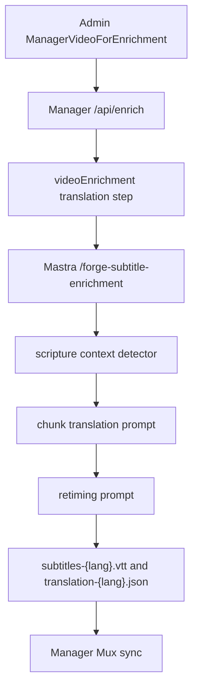

# feat: Add biblical subtitle translation context

## Summary

Improve Mastra subtitle enrichment so generated subtitles are translated with Christian gospel context and, when the source appears to be a Bible story, with wording that stays close to familiar Bible phrasing in the target language. This plan keeps the improvement prompt and context based: no Bible-text API, no licensed passage fetch, and no doctrinal-validation gate.

---

## Problem Frame

`apps/mastra/src/services/subtitle-enrichment/translator.ts` currently tells the model to translate for meaning and natural fluency. That is too generic for Forge content: many videos are Christian gospel media, and some are direct Bible narratives where the translation should sound closer to established Bible wording than a generic paraphrase.

Mastra already owns subtitle translation and retiming through `/forge-subtitle-enrichment`, while Manager owns job state and Mux sync. The safest path is to pass optional video context through the existing Manager-to-Mastra contract, let Mastra infer scripture context once per run, and feed that context into translation and retiming prompts without changing artifact keys or Manager-visible language results.

---

## Requirements

**Content Context**

- R1. Manager sends optional subtitle translation context to Mastra when available: video title, video label, and known Bible references.
- R2. Admin's Manager enrichment read model exposes nullable `title` and `label` so `/api/enrich` can provide useful context for standard enrichment jobs.
- R3. Missing context must not fail enrichment; Mastra falls back to default Christian gospel translation guidance.

**Mastra Translation Behavior**

- R4. Mastra runs one advisory scripture-context detection pass per subtitle enrichment run when provider work is needed, using the source transcript plus optional Manager context.
- R5. The detector returns a bounded classification such as `bible_story`, `gospel_teaching`, `christian_general`, or `other`, plus likely Bible references and confidence when inferable.
- R6. Translation prompts tell the model that Forge often translates Christian gospel content and, for likely Bible stories, to prefer target-language phrasing close to familiar Bible wording without adding citations or commentary.
- R7. Retiming prompts preserve the translated text and only split it into subtitle timing windows.

**Compatibility**

- R8. Existing artifact keys remain unchanged: `subtitles-{lang}.vtt` and `translation-{lang}.json`.
- R9. Manager's `LanguageResult` envelope remains unchanged so Mux sync and job detail rendering keep working.
- R10. Same-language no-op runs still skip provider calls and write source-equals-target artifacts.

---

## Scope Boundaries

In scope:

- Optional Admin and Manager context propagation for subtitle enrichment.
- Mastra-local scripture-context detection and prompt steering.
- Optional non-sensitive context/provenance in `translation-{lang}.json`.
- Focused tests for the Admin read model, Manager service contract, Mastra workflow input, prompt construction, detector fallback, and no-op compatibility.

Out of scope:

- Fetching official Bible passage text from YouVersion, BibleGateway, or another provider.
- Adding a Bible translation memory, glossary management UI, or per-language Bible-version selection.
- Moving Manager job state, operator UI, or Mux sync into Mastra.
- Doctrinal validation or publication approval logic.
- Watch subtitle rendering changes.

### Deferred to Follow-Up Work

- Licensed Bible-text integration can be planned separately if the team chooses a provider, attribution rules, and target-language Bible-version strategy.
- Human review surfacing for scripture-sensitive translation confidence belongs with future Manager QA or doctrinal-validation work.

---

## High-Level Technical Design



The context payload is optional and additive. Manager should send:

```text
translationContext:
  videoTitle?: string
  videoLabel?: string
  bibleReferences?: string[]
```

Mastra should normalize this into a local `SubtitleTranslationContext`, then derive a `SubtitleScriptureContext` once per run. The detector output guides translation prompts only; it is not a source of truth for publishing, and low-confidence results should avoid over-specific scripture claims.

---

## Key Technical Decisions

- KTD1. **Prompt and context over Bible API:** The user chose prompt plus references, so this plan avoids new licensed Bible-text dependencies, attribution rules, and provider credentials.
- KTD2. **One detector per run:** Detect scripture context once from the full transcript or a bounded transcript excerpt, then reuse it for every target language and chunk to avoid per-chunk cost and inconsistent passage guesses.
- KTD3. **Advisory detector failures degrade to defaults:** Detection quality should improve translation, not become a new failure mode for subtitle generation.
- KTD4. **Context object over flat fields:** A nested `translationContext` object keeps the service contract extensible and avoids mixing content metadata with required runtime identity fields.
- KTD5. **Retiming must not paraphrase:** Translation owns scripture-sensitive wording; retiming owns segment boundaries and should preserve translated text as much as possible.
- KTD6. **No Manager result-shape change:** Preserve `LanguageResult[]` so Mux sync, job state, and job detail UI remain compatible with the completed Mastra subtitle migration.

---

## Implementation Units

### U1. Roadmap And Admin Context Contract

**Goal:** Create the tracked roadmap work and expose video title/label through Admin's Manager enrichment read model.

**Requirements:** R1, R2

**Dependencies:** None

**Files:**

- Create: `docs/roadmap/media-generation/feat-192-biblical-subtitle-translation-context.md`
- Modify: `docs/roadmap/README.md`
- Modify: `docs/roadmap/media-generation/feat-184-mastra-subtitle-enrichment-execution.md`
- Modify: `apps/admin/src/services/manager-read-model.service.ts`
- Modify: `apps/admin/src/services/manager-read-model.service.test.ts`
- Modify: `apps/admin/src/graphql/types/managerReadModels.ts`
- Modify: `apps/admin/src/graphql/schema.test.ts`
- Modify: `apps/admin/schema.graphql`
- Modify: `packages/admin-graphql/src/admin-graphql-env.d.ts`
- Test: `apps/admin/src/services/manager-read-model.service.test.ts`
- Test: `apps/admin/src/graphql/schema.test.ts`

**Approach:** Add nullable `title` and `label` to `ManagerVideoForEnrichment`. Reuse the existing title-selection behavior from Manager coverage where practical: prefer English title, then requested language title if available, otherwise null. Update the Admin GraphQL object, schema snapshot expectations, SDL, and gql.tada introspection output because this is a public Admin GraphQL contract change.

**Patterns to follow:** `ManagerVideoCoverage` in `apps/admin/src/services/manager-read-model.service.ts`; schema regeneration guidance in `packages/admin-graphql/CLAUDE.md`.

**Test scenarios:**

- Happy path: an enrichment video with English locale title and label returns both fields.
- Edge case: a video with no title locales returns `title: null` and does not drop variants.
- Integration: `ManagerVideoForEnrichment` schema fields include `title` and `label`.
- Contract: regenerated Admin SDL and `packages/admin-graphql` introspection include the new nullable fields.

**Verification:** Admin read-model and schema tests prove the fields are available to Manager without changing existing variant, language, or download data.

### U2. Manager Context Propagation

**Goal:** Pass optional translation context from Manager enrichment into the Mastra subtitle service route.

**Requirements:** R1, R3, R8, R9, R10

**Dependencies:** U1

**Files:**

- Modify: `apps/manager/src/backend/admin-client.ts`
- Modify: `apps/manager/src/backend/admin-client.test.ts`
- Modify: `apps/manager/src/app/api/enrich/route.ts`
- Modify: `apps/manager/src/app/api/enrich/route.test.ts`
- Modify: `apps/manager/src/workflows/videoEnrichment.ts`
- Modify: `apps/manager/src/workflows/videoEnrichment.test.ts`
- Modify: `apps/manager/src/services/mastra-subtitle-enrichment.ts`
- Modify: `apps/manager/src/services/mastra-subtitle-enrichment.test.ts`
- Test: `apps/manager/src/backend/admin-client.test.ts`
- Test: `apps/manager/src/app/api/enrich/route.test.ts`
- Test: `apps/manager/src/workflows/videoEnrichment.test.ts`
- Test: `apps/manager/src/services/mastra-subtitle-enrichment.test.ts`

**Approach:** Select `title` and `label` in `VIDEO_ENRICHMENT_SELECTION`, carry them through `VideoNode`, and add optional `videoTitle` to `VideoEnrichmentInput`. Build `translationContext` in `stepSubtitleTranslation` from `videoTitle`, existing `videoLabel`, and existing `bibleVerses`, mapping `bibleVerses` to `bibleReferences` at the Mastra boundary. Omit empty context fields from the JSON body.

**Patterns to follow:** Existing `videoLabel` / `bibleVerses` scene-analysis context in `apps/manager/src/workflows/videoEnrichment.ts`; service-route client validation in `apps/manager/src/services/mastra-subtitle-enrichment.ts`.

**Test scenarios:**

- Happy path: `/api/enrich` launches `runVideoEnrichment` with Admin title and label when Admin provides them.
- Happy path: `stepSubtitleTranslation` calls `launchMastraSubtitleEnrichment` with `translationContext.videoTitle`, `translationContext.videoLabel`, and `translationContext.bibleReferences`.
- Edge case: missing title, label, and references omit `translationContext` or send an empty-safe object without failing.
- Compatibility: existing translation workflow tests still assert unchanged `LanguageResult` handling and Mux sync inputs.
- No-op path: source-equals-target languages still complete without requiring a provider key.

**Verification:** Manager tests prove the new context reaches Mastra while old callers and downstream language result consumers remain compatible.

### U3. Mastra Scripture Context Detection

**Goal:** Add a Mastra-local advisory detector that infers whether a transcript is likely Bible-story or gospel content.

**Requirements:** R3, R4, R5, R10

**Dependencies:** U2

**Files:**

- Create: `apps/mastra/src/services/subtitle-enrichment/scripture-context.ts`
- Create: `apps/mastra/src/services/subtitle-enrichment/scripture-context.test.ts`
- Modify: `apps/mastra/src/services/subtitle-enrichment/types.ts`
- Modify: `apps/mastra/src/services/subtitle-enrichment/run.ts`
- Modify: `apps/mastra/src/services/subtitle-enrichment/run.test.ts`
- Modify: `apps/mastra/src/mastra/workflows/subtitle-enrichment.ts`
- Modify: `apps/mastra/src/mastra/workflows/subtitle-enrichment.test.ts`
- Test: `apps/mastra/src/services/subtitle-enrichment/scripture-context.test.ts`
- Test: `apps/mastra/src/services/subtitle-enrichment/run.test.ts`
- Test: `apps/mastra/src/mastra/workflows/subtitle-enrichment.test.ts`

**Approach:** Extend the Mastra workflow input schema with optional `translationContext`. Add a structured detector using the existing `requestOpenRouterChat` JSON-schema path. The detector should inspect bounded title/label/reference/source-text context and return a strict object with `contentDomain`, `likelyBibleReferences`, `confidence`, and a short non-sensitive rationale. If the detector errors or returns low confidence, continue with `contentDomain: "christian_general"` or `"other"` based on available context.

**Patterns to follow:** Structured output handling in `apps/mastra/src/services/subtitle-enrichment/openrouter.ts`; workflow envelope behavior in `apps/mastra/src/mastra/workflows/subtitle-enrichment.ts`; per-language failure isolation in `runSubtitleEnrichment`.

**Test scenarios:**

- Happy path: known title and reference context produce a `bible_story` result with bounded references.
- Edge case: no context and generic transcript produce `other` or low-confidence context without failing.
- Error path: detector provider failure returns fallback context and translation still runs.
- Compatibility: same-language no-op skips detector and provider work.
- Integration: workflow input accepts `translationContext` and passes it to `runSubtitleEnrichment`.

**Verification:** Mastra tests prove detector output is bounded, optional, and never blocks subtitle generation.

### U4. Gospel-Aware Translation And Retiming Prompts

**Goal:** Use the detected context and known references to steer translation while keeping subtitle timing valid.

**Requirements:** R6, R7, R8, R9

**Dependencies:** U3

**Files:**

- Modify: `apps/mastra/src/services/subtitle-enrichment/translator.ts`
- Create: `apps/mastra/src/services/subtitle-enrichment/translator.test.ts`
- Modify: `apps/mastra/src/services/subtitle-enrichment/retimer.ts`
- Create or modify: `apps/mastra/src/services/subtitle-enrichment/retimer.test.ts`
- Modify: `apps/mastra/src/services/subtitle-enrichment/run.ts`
- Modify: `apps/mastra/src/services/subtitle-enrichment/run.test.ts`
- Test: `apps/mastra/src/services/subtitle-enrichment/translator.test.ts`
- Test: `apps/mastra/src/services/subtitle-enrichment/retimer.test.ts`
- Test: `apps/mastra/src/services/subtitle-enrichment/run.test.ts`

**Approach:** Thread `SubtitleScriptureContext` into `translateChunk` and `retimeChunk`. Update the translation system prompt with a default Christian gospel stance, known or likely scripture context, and guardrails: do not add references, do not add commentary, do not invent theology, and use the target language naturally. Update retiming prompts to split the provided translated text into timing windows without retranslation or paraphrase.

**Patterns to follow:** Current glossary and `customPrompt` injection in `translator.ts`; correction-loop behavior in `retimer.ts`; deterministic fallback rules in `retimer.ts`.

**Test scenarios:**

- Happy path: prompt for likely Bible story includes gospel guidance, likely references, and close-to-Bible-phrasing instruction.
- Edge case: prompt with `contentDomain: "other"` keeps natural translation guidance without over-asserting scripture context.
- Edge case: glossary and language `customPrompt` remain present after adding scripture context.
- Retiming: retiming prompt tells the model not to paraphrase translated text.
- Integration: `runSubtitleEnrichment` passes the same detected context to every translated target language.

**Verification:** Prompt tests prove the intended instructions are present and bounded; run tests prove artifact keys and language results remain unchanged.

### U5. Artifact Provenance And Documentation

**Goal:** Make the new behavior inspectable without leaking prompts or changing downstream contracts.

**Requirements:** R8, R9

**Dependencies:** U3, U4

**Files:**

- Modify: `apps/mastra/src/services/subtitle-enrichment/run.ts`
- Modify: `apps/mastra/src/services/subtitle-enrichment/run.test.ts`
- Modify: `apps/mastra/AGENTS.md`
- Modify: `apps/mastra/CLAUDE.md`
- Modify: `apps/manager/CLAUDE.md`
- Modify: `docs/roadmap/media-generation/feat-192-biblical-subtitle-translation-context.md`
- Test: `apps/mastra/src/services/subtitle-enrichment/run.test.ts`

**Approach:** Add a small optional `translationContext` projection to `translation-{lang}.json` with `contentDomain`, `likelyBibleReferences`, and `confidence`. Do not store raw prompts, API keys, full transcript excerpts, or hidden model reasoning. Update app docs to clarify that Mastra owns gospel-aware subtitle prompt steering and that Manager only sends optional context.

**Patterns to follow:** Existing translation JSON artifact write in `run.ts`; Mastra ownership docs in `apps/mastra/AGENTS.md` and `apps/mastra/CLAUDE.md`.

**Test scenarios:**

- Happy path: translated JSON artifact includes sanitized context projection when detector context exists.
- Edge case: no-op source-equals-target artifact either omits detector context or marks only source-equals-target metadata without provider work.
- Safety: artifact body does not include prompt text, provider key, or raw detector rationale when not needed for operators.
- Documentation: app docs mention prompt/context ownership without implying Bible API integration.

**Verification:** Artifact tests prove provenance is useful and safe; docs leave the Manager/Mastra ownership boundary clear.

---

## System-Wide Impact

- Admin GraphQL gains two nullable fields on an internal Manager read model. Because this changes Pothos SDL, regenerate `apps/admin/schema.graphql` and `packages/admin-graphql/src/admin-graphql-env.d.ts`.
- Manager's service-route payload to Mastra becomes additive and backward compatible.
- Mastra adds one extra provider call for translated runs unless implementation chooses to skip detection for clearly generic content. The call must use the existing subtitle model/key/timeout posture.
- Artifact storage remains compatible because keys and Manager `LanguageResult` shape do not change.

---

## Risks & Dependencies

- **Detector overconfidence:** A model may guess the wrong passage. Mitigate by treating references as advisory context and by writing prompts that avoid adding citations or commentary.
- **Cost and latency:** One extra detector call per run adds cost. Mitigate by running once per transcript, not once per language or chunk.
- **Schema drift:** Admin SDL and `packages/admin-graphql` introspection must be regenerated together with the Pothos field change.
- **Prompt collision:** Per-language custom prompts could conflict with gospel guidance. Keep gospel guidance before custom prompt and preserve glossary exactness.
- **False sense of validation:** This is not doctrinal validation. Keep docs and artifact provenance clear that the detector is translation context only.

---

## Validation Plan

- Admin validation: focused read-model and schema tests pass with `title` and `label` on `ManagerVideoForEnrichment`.
- Manager validation: backend Admin client, `/api/enrich`, `videoEnrichment`, and `mastra-subtitle-enrichment` tests prove context propagation and unchanged result handling.
- Mastra validation: subtitle-enrichment tests cover detector output, detector failure fallback, prompt construction, retiming no-paraphrase instructions, no-op behavior, and translation JSON provenance.
- Contract validation: Admin SDL and `packages/admin-graphql` generated introspection are clean after regeneration.
- Browser validation: not required unless implementation changes visible Manager job UI; record that no user-facing UI changed if skipped.

---

## Sources & Research

- `apps/mastra/src/services/subtitle-enrichment/translator.ts` currently owns generic translation prompt construction.
- `apps/mastra/src/services/subtitle-enrichment/retimer.ts` owns correction-loop retiming and deterministic fallback.
- `apps/mastra/src/services/subtitle-enrichment/run.ts` owns transcript artifact parsing, per-language fanout, and translation JSON writes.
- `apps/mastra/src/mastra/workflows/subtitle-enrichment.ts` owns the `/forge-subtitle-enrichment` input schema and result envelope.
- `apps/manager/src/services/mastra-subtitle-enrichment.ts` owns Manager's service-route request body and response parsing.
- `apps/manager/src/workflows/videoEnrichment.ts` already carries optional `videoLabel` and `bibleVerses` for scene analysis.
- `apps/admin/src/services/manager-read-model.service.ts` and `apps/admin/src/graphql/types/managerReadModels.ts` own `ManagerVideoForEnrichment`.
- `docs/plans/2026-06-12-002-feat-mastra-subtitle-enrichment-execution-plan.md` establishes the Manager/Mastra ownership split for subtitle enrichment.
- `docs/brainstorms/2026-03-28-subtitle-translation-pipeline-requirements.md` establishes the split-brain translation/retiming architecture and per-language glossary/custom prompt requirements.
