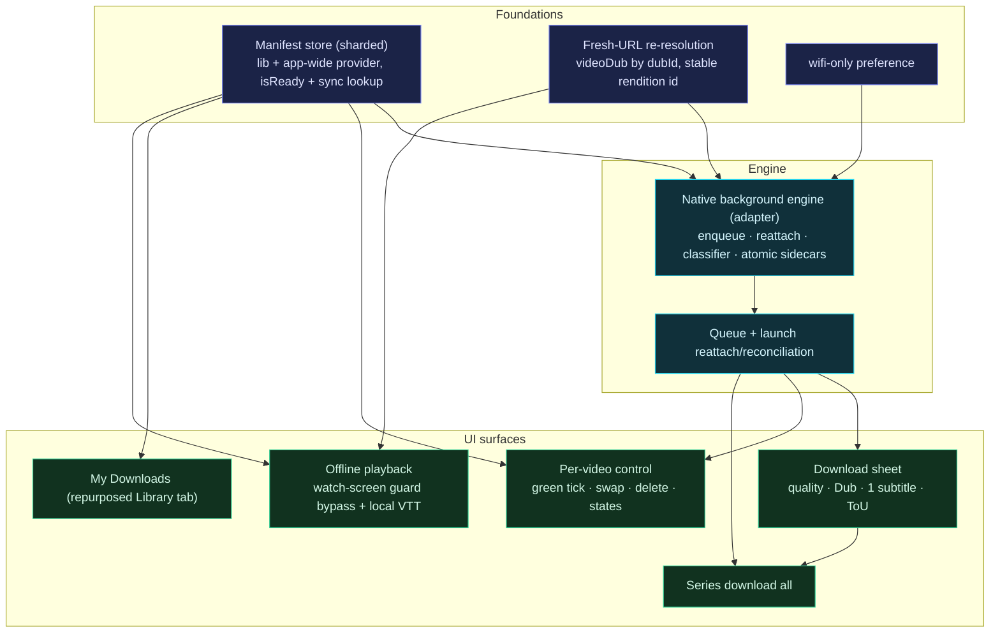

# feat: Mobile in-app offline video downloads

## Summary

Replace the mobile app's "download MP4 → OS share sheet → Camera Roll" flow with true in-app offline downloads. The user picks quality, audio language (Dub), and one subtitle track (or none), accepts the existing Terms of Use, and the media plus subtitle and poster are saved to backup-excluded app-private storage and played offline from a "My Downloads" surface. One copy per video (green tick), changed via a non-destructive swap; a whole series downloads as one batch. The download engine is a **native background-download library** running on the app's existing dev-client / prebuild: transfers continue while the app is backgrounded, screen-off, or OS-evicted, survive restart via reattach, are wifi-only-optional, queued, and resumable.

---

## Problem Frame

Field viewers in low-connectivity areas want to download a video on a good connection and watch it later, offline, in their own language. Today's control writes the MP4 to volatile cache and hands it to the OS share sheet (Camera Roll), then discards the cached copy. The result is a loose file outside the app, untied to language or subtitles, OS-purgeable, and unplayable in the app's player.

The app is already built and run as a **dev-client / prebuild** (committed `ios/` directory, config plugins in `app.json` including `expo-video`, EAS dev scripts), not pure Expo Go. That posture is what makes a real offline engine possible: a native background-download module can run that Expo Go could not. The feature targets that capability directly — downloads that keep going when the user locks the phone or switches apps, which is the whole point for someone prepping content in the field.

(An earlier draft of this plan assumed an Expo-Go-only constraint and dropped background downloads; the repo audit during review showed the app already prebuilds, so that constraint and its sacrifice were removed.)

---

## Key Technical Decisions

- KTD1. **Native background-download engine, behind one adapter.** Use a maintained background-download module (recommended: `@kesha-antonov/react-native-background-downloader`, which delegates to iOS background `URLSession` and Android `DownloadManager` + a foreground service, persists task state, and exposes a `getExistingDownloadTasks()` reattach pattern with stable task ids, per-task headers, and Range-based pause/resume). Wrap it behind a single `downloadEngine` adapter so the module is swappable. Reserve `expo-file-system` for small sidecar files (subtitle VTT, poster) and storage primitives (document paths, free-disk-space, atomic tmp-then-rename). Requires the dev-client build the app already uses plus the module's config plugin. (see origin: R8, R9)
- KTD2. **The manifest stores stable rendition identity, never volatile URLs.** Persist `{ dubDocumentId, renditionDocumentId, qualityLabel, subtitleLanguageSlug, videoSlug }`. Re-resolve fresh `downloads[].url` / `vttSrc` through the public `videoDub(id)` path immediately before enqueuing or resuming a task. The rendition is keyed by its server `documentId` (and `quality` string), **not** the UI-derived size tier, which is positional and unstable across re-resolution. Admin URLs expire, so a reattached task whose signed URL has lapsed gets a re-minted URL/headers via the module's `setDownloadParams` (or is re-enqueued) before resume. (see origin: R24)
- KTD3. **Persistence = pure parse/serialize lib + provider that does I/O.** Mirror `watchPreferences.ts` + `WatchPreferencesProvider.tsx`: tolerant `parse` returns defaults on any malformed/version-drift blob, writes are fire-and-forget, a version field gates the schema. The `DownloadsProvider` mounts app-wide at the root Stack via `require()` (not `import`, per the existing root-layout pattern), exposes a synchronous per-slug committed-copy lookup and an `isReady` flag, and surfaces write failures. The manifest is **sharded one key per download** plus an index key; module task state lives in the module's own store, so the manifest stays small.
- KTD4. **Non-destructive swap = two-phase, bundle-atomic manifest.** A committed copy and a pending copy with **attempt-unique, sanitized file paths** (per-download nonce; `videoSlug`/`dubId` stripped of path separators and `..`), atomic repoint-then-delete, recoverable on launch. A record becomes `Downloaded` (green tick) only after the MP4 **and** the chosen subtitle VTT are committed and size-verified; the original is never deleted until the replacement is verified. (see origin: R20, R23)
- KTD5. **Backup-excluded persistent storage.** Store media under the document directory with the iOS no-backup attribute set (via the module / a config plugin, now available on the dev-client) and the Android no-backup location. This both satisfies "stays until deleted" and avoids the App Store guideline 2.5.2 risk of backing up large re-downloadable media. (see origin: R12)
- KTD6. **Local playback via a new isolated `validateLocalMediaUrl` predicate.** Allow only `file://` URIs whose **normalized** path (parse with `URL`, `decodeURIComponent`, resolve `..`) is under the app document directory; exact-scheme match; unit-tested in isolation. The custom subtitle overlay's local-file branch validates the VTT path through the same predicate before reading it from disk — it must not simply bypass the existing `validateActionUrl` guard. (see origin: R26)
- KTD7. **Explicit error classifier with a subtitle-failure exit.** Transient (drop / wifi-only-on-cellular / backgrounded) → Paused, keep bytes; terminal (HTTP 4xx / integrity / storage-full) → Failed, keep for retry; user cancel → remove bytes. A terminal subtitle failure after a successful MP4 does not strand the item: it auto-degrades to no-subtitle and marks `Downloaded` (the user is told), rather than leaving a permanent Failed with no exit. Re-resolution that needs the network while offline → Queued, not Failed.
- KTD8. **Reuse the existing `VideoPlayer`; the watch screen is the offline entry point, gated on hydration.** When `DownloadsProvider` reports a committed local copy for the video, `app/watch/[slug].tsx` must short-circuit its "Video Not Found" / loading render guards and derive the player's frozen `creationSource` from `validateLocalMediaUrl(committedPath)` and the subtitle from the committed local VTT, ahead of the GraphQL source chain. Because the manifest hydrates async, the player mount waits on `DownloadsProvider.isReady` so the local path is resolvable synchronously before `VideoPlayer` freezes its source. My Downloads renders poster thumbnails and, on tap, navigates to `/watch/[slug]` with a manifest-derived seed (no per-row `VideoView`; Android decoder/OOM budget).
- KTD9. **Wifi-only via the download module's network constraint.** The module enforces wifi-only at the task level (Android `DownloadManager` network type; iOS `allowsCellularAccess`), so a persisted `wifiOnly` preference + per-download cellular override drive the task config rather than app-side connectivity polling. `@react-native-community/netinfo` (more reliable than `expo-network`; both work on the dev-client) is used only for an optional UI status hint, not as the gating mechanism.

---

## High-Level Technical Design

The work is a dependency spine: foundations and a validated engine before UI surfaces. Build order is the unit order below.



The PLAY seam is the watch screen: `app/watch/[slug].tsx` currently derives `playerSource` from `activeVariant?.hls ?? video?.streamingUrl ?? seedStreamingUrl` and short-circuits to "Video Not Found" when GraphQL yields nothing. Offline playback inserts a committed-local-copy check that both bypasses that guard and supplies the initial source.

### Download lifecycle (per item)

```mermaid
stateDiagram-v2
  [*] --> NotDownloaded
  NotDownloaded --> Queued: start (quality/Dub/subtitle + ToU)
  Queued --> Downloading: resolve URL, enqueue native task
  Queued --> Canceled: user cancels
  Downloading --> Paused: drop / backgrounded transient / wifi-only on cellular
  Paused --> Downloading: resume (re-resolve/refresh URL if expired)
  Downloading --> Failed: HTTP 4xx / integrity / storage-full
  Failed --> Queued: user retry
  Downloading --> Canceled: user cancels
  Downloading --> Downloaded: MP4 + chosen VTT verified (subtitle-fail auto-degrades)
  Downloaded --> NotDownloaded: delete (atomic)
  Downloaded --> Downloading: change download (swap; old kept until new verified)
  Canceled --> [*]
  Downloaded: Downloaded (green tick)
```



Background transfers continue while the app is backgrounded, screen-off, or OS-evicted; on launch the engine reattaches via `getExistingDownloadTasks()` and reconciles. iOS user force-quit cancels in-flight native tasks, which resume on reopen; Android continues via the foreground service (with the mandatory Android 14/15 notification). Partial bytes are kept on Paused/Failed and removed on Canceled or terminal failure; a partial is never presented as complete.

---

## Output Structure

New files (repo-relative; existing files modified are listed per unit):

```
apps/mobile/
├── app/
│   └── series/
│       └── download.tsx                   # series "download all" sheet route
├── src/
│   ├── lib/
│   │   ├── offlineManifest.ts             # pure parse/serialize, sharded keys (no I/O)
│   │   ├── downloadEngine.ts              # adapter over the native background module + classifier
│   │   ├── downloadUrlResolution.ts       # videoDub(id) → fresh rendition/subtitle URLs
│   │   ├── offlineFiles.ts                # sanitized paths, atomic write/rename/delete, free-space
│   │   ├── validateLocalMediaUrl.ts       # isolated, path-normalizing file:// allow-path predicate
│   │   └── __tests__/                      # offlineManifest / downloadUrlResolution / validateLocalMediaUrl
│   └── contexts/
│       └── DownloadsProvider.tsx          # manifest + queue + per-slug lookup + isReady, app-wide
```

The "My Downloads" UI repurposes the existing thin `app/(tabs)/library.tsx` stub rather than adding a parallel screen (see U9).

---

## Requirements

Carried from the origin requirements doc (`see origin` for full text). R-IDs match origin; R9 and R12 are now fuller than the brainstorm because the dev-client posture restores background downloading and backup-exclusion. The origin's deferred subtitle-multiplicity question is resolved to single-track (see U7).

**Selection & terms**

- R1–R5. Download sheet selection (quality, audio Dub, a single subtitle track [v1; origin R4 left multiplicity to planning] or "No subtitles") gated on the existing Terms of Use. (see origin: R1–R5)

**Series**

- R6–R7. Series "download all" applies one set of choices across segments, shows combined total size, and enqueues each segment through the standard queue. (see origin: R6–R7)

**Engine & reliability**

- R8. Resumable downloads (Range-based) that survive connection drops and app restart via reattach. (see origin: R8)
- R9. Downloads continue while the app is backgrounded, screen-off, or OS-evicted; reattach on launch. iOS force-quit cancels in-flight tasks and they resume on reopen; Android continues via a foreground service. (see origin: R9)
- R10. Wifi-only setting with a per-download cellular override, enforced at the task level by the download module. (see origin: R10)
- R11. Persistent queue (pending + active) that rehydrates across restart, with per-item progress. (see origin: R11)

**Storage & governance**

- R12. Media, subtitle, and poster persist in backup-excluded app-private storage (iOS no-backup attribute; Android no-backup location), not OS-evicted. (see origin: R12)
- R13–R15. No app cap with a free-space reserve; pre-download won't-fit check per queued item over the full footprint (video + subtitle + poster, handling missing/zero sizes); per-download and total storage shown. (see origin: R13–R15)

**Library & playback**

- R16–R18. A "My Downloads" surface reachable offline; full offline playback (video + the chosen subtitle from local files); offline experience independent of the online metadata cache, with a locally-downloaded poster and a download-state badge keyed off the local store. _R16–R18 depend on the U1(a) spike: if offline subtitle rendering fails on a platform, subtitles for that platform fall out of v1._ (see origin: R16–R18)

**State, swap & deletion**

- R19–R22. Green-tick state offers delete or change; change is a non-destructive swap with a replace-warning; delete is atomic/idempotent; the control distinguishes queued / downloading / paused / failed. (see origin: R19–R22)

**Integrity & offline-readiness**

- R23–R26. Launch reattach + reconciliation (never show partial as complete); manifest stores stable identity and re-resolves fresh URLs before enqueue/resume (offline → queued, not failed); defined byte handling for failed/canceled/storage-full; offline playback through the local-media allow-path. (see origin: R23–R26)

**Replacing the old export**

- R27. The in-app download replaces the raw-file export; saving a shareable file is removed. (see origin: R27)

---

## Implementation Units

### Phase A — Foundations & validation

### U1. Validation spikes (gating)

- **Goal:** De-risk three unknowns before engine work commits.
- **Requirements:** R8, R9, R12, R17.
- **Dependencies:** none.
- **Files:** throwaway spike branch on a dev-client build; record findings (no production code).
- **Approach:** (a) Offline subtitle rendering — confirm the custom overlay reads a local VTT and renders over a local MP4 on **both** iOS and Android. (b) Mux MP4 renditions — confirm `downloads[].url` for representative content are static MP4 renditions, not HLS-only. (c) **Background-download module integration** — confirm the chosen module builds in the dev client, that a download continues when the app is backgrounded and after an OS-evict, that `getExistingDownloadTasks()` reattaches on relaunch, that the iOS no-backup attribute can be set, and that the Android foreground-service notification appears (Android 14/15). Note the iOS force-quit-cancels behavior.
- **Execution note:** Spike first; U5 depends on (b) and (c), U10 on (a).
- **Test scenarios:** `Test expectation: none — investigation. Verification = documented findings + go/no-go.`
- **Verification:** A short finding per spike; if (b) fails (HLS-only), escalate scope; if (c) fails on a platform, fall back to a foreground-only engine for that platform and note it.

### U2. Offline manifest store

- **Goal:** A persistent, tolerant, sharded store of offline-download records, exposing a synchronous per-slug lookup and `isReady`.
- **Requirements:** R11, R16, R18, R23, R24.
- **Dependencies:** U1.
- **Files:** `apps/mobile/src/lib/offlineManifest.ts`, `apps/mobile/src/contexts/DownloadsProvider.tsx`, `apps/mobile/app/_layout.tsx` (mount via `require()`), `apps/mobile/src/lib/__tests__/offlineManifest.test.ts`.
- **Approach:** Pure lib owns the key scheme, the typed record (`{ videoSlug, dubDocumentId, renditionDocumentId, qualityLabel, subtitleLanguageSlug, state, committedPath, pendingPath, posterPath, bytesWritten, totalBytes }`), tolerant `parse` (→ defaults) and `serialize`. Shard one AsyncStorage key per download plus an index key; module task ids are referenced, not the bulky native task state. The app-wide provider does I/O (hydrate-before-paint), exposes `isReady`, a synchronous `committedFor(slug)` lookup for the watch-screen seam and badge, surfaces write failures, and is mounted with `require()` per the root-layout comment.
- **Patterns to follow:** `apps/mobile/src/lib/watchPreferences.ts` + `apps/mobile/src/contexts/WatchPreferencesProvider.tsx` (incl. its `isReady`); `apps/mobile/src/lib/cachePersistence.ts` (version + size discipline).
- **Test scenarios:**
  - Happy: serialize→parse round-trips; index + per-download keys stay consistent.
  - Edge: malformed / partial / version-drift / null → defaults, never throws.
  - Edge: two setters in one tick compose; `committedFor(slug)` returns synchronously after hydration.
  - Edge: write failure surfaces, not silently skipped.
- **Verification:** Provider hydrates without blocking first paint; `isReady` flips true; 50+ records stay under the per-key cap.

### U3. Wifi-only preference

- **Goal:** Persist a wifi-only toggle that drives the module's network constraint.
- **Requirements:** R10.
- **Dependencies:** U1.
- **Files:** extend `apps/mobile/src/lib/watchPreferences.ts` + its provider with `wifiOnly`; optionally add `@react-native-community/netinfo` for a UI status hint; tests alongside in `__tests__/`.
- **Approach:** `wifiOnly` is persisted; the per-download cellular override is session state. Both feed the download task's network-type constraint (KTD9) rather than app-side polling. netinfo, if added, only powers an optional "offline" UI hint.
- **Patterns to follow:** `watchPreferences.ts` preference extension.
- **Test scenarios:**
  - `Covers AE5.` wifi-only on → task enqueued with wifi-only constraint; cellular override clears it for one download.
  - Edge: preference persists; override is one-download-only.
- **Verification:** On a real device, a wifi-only download does not start on cellular without the override.

### U4. Fresh-URL re-resolution helper

- **Goal:** Turn a stored stable identity into fresh, non-expired media + subtitle URLs.
- **Requirements:** R24.
- **Dependencies:** U2.
- **Files:** `apps/mobile/src/lib/downloadUrlResolution.ts`, `apps/mobile/src/lib/queries.ts`, tests in `__tests__/`.
- **Approach:** Given `{ dubDocumentId, renditionDocumentId, qualityLabel, subtitleLanguageSlug }`, fetch the dub via the **public** `videoDub(id)` query (confirm no bearer is required; if it is, use an operation-scoped link, not a global header) and select the rendition by `renditionDocumentId` (fall back to `qualityLabel`, then nearest size) and the subtitle by language slug. Distinguish resolved / loaded-empty (removed upstream → terminal) / needs-network-offline (a typed error mapped to Queued, never Failed). Copy any array before sorting (Apollo freezes cached arrays).
- **Patterns to follow:** `apps/mobile/src/lib/dubMediaFetch.ts` (ledger-release dedupe); the lazy `videoDub(id)` pattern; language identity keyed on slug.
- **Test scenarios:**
  - Happy: identity → correct rendition URL + subtitle VTT URL.
  - Edge: renditionDocumentId absent → qualityLabel/nearest fallback; subtitle slug absent → resolve as no-subtitle + report.
  - Error: offline → typed needs-network error; upstream-removed → terminal.
  - `Covers AE4.` resume refreshes an expired URL before continuing.
- **Verification:** A stale URL never reaches a task; offline vs removed map distinctly.

### Phase B — Download engine

### U5. Native background download engine

- **Goal:** Enqueue and run background transfers (MP4 + subtitle + poster sidecars) with classified outcomes and bundle-atomic completion.
- **Requirements:** R8, R9, R12, R23, R25.
- **Dependencies:** U2, U3, U4; gated by U1(b) and U1(c).
- **Files:** `apps/mobile/src/lib/downloadEngine.ts`, `apps/mobile/src/lib/offlineFiles.ts`, add the background-download module + its config plugin, tests in `__tests__/`.
- **Approach:** A single adapter over the native module: enqueue a task with the re-resolved URL + headers, a stable task id, the wifi-only network constraint, and a progress callback. Download the chosen subtitle VTT and the poster as small sidecars (via `expo-file-system` or the module), to **attempt-unique, sanitized** paths (`offlineFiles` strips `/`, `\`, `..`, null bytes from `videoSlug`/`dubId`), atomic-rename on size-verify, and set the iOS no-backup attribute on the download root. Classify outcomes per KTD7, including the subtitle-failure auto-degrade. **Bundle completeness:** mark `Downloaded` only after the MP4 and the chosen subtitle (or explicit no-subtitle) are verified; the poster is non-blocking (missing → placeholder). On an expired signed URL at resume, re-resolve and `setDownloadParams` (or re-enqueue) before resuming.
- **Execution note:** Characterization coverage for the classifier and the bundle-completeness gate before wiring real transfers.
- **Technical design (directional):** `committedPath = downloads/{safeSlug}/{renditionDocumentId}.mp4`; `pendingPath = downloads/{safeSlug}/.pending-{nonce}.mp4`; rename pending→committed only after the full bundle verifies.
- **Patterns to follow:** the module's `getExistingDownloadTasks` reattach docs; atomic tmp-then-rename; the existing `${documentId}-` filename discipline.
- **Test scenarios:**
  - Happy: full bundle (MP4 + VTT + poster) → green tick; transfer continues when backgrounded.
  - Edge: OS-evict mid-transfer → reattaches and completes on relaunch (U1c).
  - Error: required subtitle terminal-fail after MP4 → auto-degrade to no-subtitle + Downloaded with notice `Covers AE8` (negative path); poster fail → Downloaded with placeholder.
  - Error: HTTP 4xx / integrity / storage-full → Failed (R25); cancel → bytes removed; expired URL at resume → refreshed before resume.
  - Security: a slug/dubId containing `../` is rejected/stripped before path construction.
- **Verification:** On device, a backgrounded download completes; a subtitle failure does not strand the item; files are excluded from backup.

### U6. Queue + launch reattach/reconciliation

- **Goal:** A persistent queue that survives restart, reattaches live native tasks, and reconciles partials.
- **Requirements:** R11, R23.
- **Dependencies:** U5.
- **Files:** `apps/mobile/src/contexts/DownloadsProvider.tsx`, `apps/mobile/src/lib/offlineManifest.ts`, tests in `__tests__/`.
- **Approach:** A persisted queue with per-item progress and a small concurrency cap. On launch, call `getExistingDownloadTasks()` and reconcile module tasks × manifest records × on-disk files: rebind live tasks to records, re-enqueue interrupted ones (refreshing URLs), delete orphaned `.pending` partials, and never present a partial as complete.
- **Patterns to follow:** `apps/mobile/src/lib/cachePersistence.ts` hydrate-before-paint; `dubMediaFetch.ts` dedupe ledger.
- **Test scenarios:**
  - Happy: queue of 3 with progress; concurrency cap respected.
  - `Covers AE3.` relaunch after background/OS-evict reattaches and continues; iOS force-quit → re-enqueues on reopen; partial never shown complete.
  - Edge: orphaned `.pending` with no record cleaned on launch; a live task with no record is adopted or canceled.
- **Verification:** Kill-and-relaunch leaves no orphans and no false-complete entries.

### Phase C — UI surfaces

### U7. Download sheet rework

- **Goal:** Replace the cache+share flow with selection that feeds the engine/queue.
- **Requirements:** R1–R5, R13–R15.
- **Dependencies:** U2, U4, U6.
- **Files:** `apps/mobile/src/components/watch/DownloadSheet.tsx`, `apps/mobile/app/watch/download.tsx`, tests alongside.
- **Approach:** Keep the Terms-of-Use modal + read-before-accept gate (a per-session, enqueue-time gate; a rehydrated mid-download item does not re-prompt) and the size-based quality tiering. Add a Dub picker **defaulting to the currently-active dub** (from `WatchSessionProvider`) and a single-select subtitle dropdown (reuse `SubtitleSheet`) with "No subtitles". Replace `handleDownload` (cache + `Sharing`) with an enqueue into `DownloadsProvider`, storing the rendition's `documentId`. Show the combined footprint (video + subtitle + poster) and the won't-fit pre-check. When opened via "change download" (U8), **pre-populate** quality/Dub/subtitle from the committed record. Copy any array before sorting.
- **Patterns to follow:** existing `tierDownloads` + ToU modal; `SubtitleSheet` single-select; cross-route `Snackbar`.
- **Test scenarios:**
  - Happy: select quality + Dub + one subtitle + accept ToU → item enqueued with rendition documentId.
  - Edge: "No subtitles" enqueues video-only `Covers AE7.`; download disabled until ToU accepted; Dub picker defaults to active dub.
  - Edge: change-download opens pre-filled from the committed record; only one subtitle selectable.
  - Edge: won't-fit footprint warns and blocks `Covers AE6.`
- **Verification:** Confirming creates a queued record carrying the stable rendition id and one/zero subtitle slug.

### U8. Per-video control, green tick, swap & delete

- **Goal:** The detail-page control reflects state and drives swap/delete.
- **Requirements:** R19, R20, R21, R22.
- **Dependencies:** U6.
- **Files:** `apps/mobile/src/components/watch/ActionButtonRow.tsx`, `apps/mobile/app/watch/[slug].tsx`, tests alongside.
- **Approach:** The control reads per-video state from `DownloadsProvider` with explicit visuals per state: not-downloaded (download icon); queued (clock); downloading (progress ring with percent); paused (resume affordance); failed (retry affordance); downloaded (green tick → delete or change). Change is the non-destructive swap (KTD4). Delete is atomic (media + subtitle + poster + manifest entry).
- **Technical design (directional):** swap = enqueue pending → on bundle-verified Downloaded, repoint manifest committed→new + delete old; on Failed, discard pending, keep committed.
- **Patterns to follow:** `Snackbar`; provider state lookup.
- **Test scenarios:**
  - `Covers AE1.` downloaded video shows green tick offering delete/change, not a blind re-download.
  - `Covers AE2.` swap whose new download fails leaves the original intact.
  - Edge: each of the 5 states renders distinctly; delete idempotent and recoverable mid-delete.
- **Verification:** Swap-then-fail keeps the old copy; every state is visually distinct.

### U9. My Downloads (repurpose the Library tab)

- **Goal:** An offline-reachable list of downloads with storage usage, delete, and tap-to-play.
- **Requirements:** R13, R15, R16, R18.
- **Dependencies:** U2, U6.
- **Files:** `apps/mobile/app/(tabs)/library.tsx` (repurpose the thin stub), `apps/mobile/app/(tabs)/_layout.tsx` (label/icon), tests alongside.
- **Approach:** Repurpose the existing thin Library tab (albums icon, content-thin stub) as the My Downloads home rather than adding a parallel screen. FlashList of manifest records from local data (title, local poster, size, state), reachable with no network, with a total-storage figure and per-row delete. Poster thumbnails only; **tapping a row navigates to `/watch/[slug]` with a seed built from the manifest record** (title, local poster path, and a flag the watch screen uses to take the offline source path). An empty state ("No downloads yet — open a video to save it for offline") shows when nothing is downloaded.
- **Patterns to follow:** `SubtitleSheet` FlashList (explicit height, MVCP-disabled); existing seed/navigation from carousels; no-gesture-handler constraint.
- **Test scenarios:**
  - Happy: lists downloads with sizes + total; tap navigates to the watch screen offline.
  - Edge: renders with no network (no GraphQL dependency); empty state shows.
  - Integration: delete updates the manifest and the detail-page badge.
- **Verification:** Airplane-mode: the tab lists downloads and tap-to-play works.

### U10. Offline playback

- **Goal:** Play a downloaded video and its single subtitle from local files, through the existing watch screen.
- **Requirements:** R17, R26.
- **Dependencies:** U2, U8, U9; gated by U1(a).
- **Files:** `apps/mobile/src/lib/validateLocalMediaUrl.ts`, `apps/mobile/app/watch/[slug].tsx`, `apps/mobile/src/components/watch/VideoPlayer.tsx`, `apps/mobile/src/components/watch/SubtitleOverlay.tsx`, `apps/mobile/src/lib/resolveImageUrl.ts`, `apps/mobile/src/lib/__tests__/validateLocalMediaUrl.test.ts`.
- **Approach:** Add an isolated, **path-normalizing** `validateLocalMediaUrl` (parse with `URL`, `decodeURIComponent`, resolve `..`, then prefix-check the document dir; exact `file:` scheme). In `app/watch/[slug].tsx`: gate the player mount on `DownloadsProvider.isReady`; when `committedFor(slug)` returns a record, **short-circuit the "Video Not Found"/loading guards** and set the frozen `creationSource` to the validated local MP4 and `subtitleVttSrc` to the committed local VTT, ahead of the GraphQL chain. Branch `SubtitleOverlay`: for a local VTT (validated via `validateLocalMediaUrl`), read it with `expo-file-system` and skip `fetch`/`validateActionUrl`. Add an offline branch so a local `file://` poster bypasses `resolveImageUrl` (which would strip it to null) and is passed to `expo-image` directly.
- **Execution note:** Test-first on `validateLocalMediaUrl` (path-traversal is the risk).
- **Patterns to follow:** `VideoPlayer.tsx` frozen `creationSource`; `WatchPreferencesProvider` `isReady` gating.
- **Test scenarios:**
  - `Covers AE8.` the chosen local VTT renders over a local MP4, offline, iOS + Android.
  - Integration: committed copy present → guards bypassed and local source mounts first; none → streaming chain unchanged.
  - Security: `file://` outside the doc dir rejected; `%2e%2e`/`..`/encoded traversal rejected; non-`file:` blocked; local subtitle branch still validates.
  - Edge: missing local subtitle degrades gracefully; local poster shows offline.
- **Verification:** Airplane-mode playback of a downloaded video with its subtitle and poster on both platforms.

### U11. Series "download all"

- **Goal:** Batch-download a whole series with one choice set and a combined size, with series-level state.
- **Requirements:** R6, R7.
- **Dependencies:** U4, U6, U7.
- **Files:** `apps/mobile/app/series/download.tsx`, `apps/mobile/app/series/_layout.tsx` (sheet registration), `apps/mobile/src/components/.../SeriesActionRow.tsx` (add Download entry + aggregate state), `apps/mobile/src/lib/seriesDownloadSize.ts`, tests alongside.
- **Approach:** Add a Download entry to the series action row and a series download sheet mirroring the watch sheet. A batch size resolver fetches each segment's chosen Dub (`videoDub` per segment, parallel with a concurrency cap), sums sizes, and shows "X segments, Y total". Confirm → enqueue each segment. Per-segment fallback: missing chosen quality → nearest available; missing chosen language → skip + report. The series action row shows aggregate state ("N of M downloaded" / progress).
- **Patterns to follow:** watch sheet route registration in `app/watch/_layout.tsx`; `dubMediaFetch` dedupe; concurrency-capped fan-out.
- **Test scenarios:**
  - `Covers AE9.` series sheet shows summed total before confirm.
  - Happy: confirm enqueues every segment; the action row shows aggregate progress.
  - Edge: a segment missing the chosen quality falls back; missing language skipped + reported; partial-resolve doesn't block the rest.
- **Verification:** A series enqueues all segments; aggregate state matches.

### Phase D — Governance & cleanup

### U12. Storage governance & poster persistence

- **Goal:** Free-space safety and accurate accounting; backup-excluded local poster.
- **Requirements:** R12, R13, R14, R15, R18.
- **Dependencies:** U5, U6.
- **Files:** `apps/mobile/src/lib/offlineFiles.ts` (free-space + reserve), `apps/mobile/src/lib/resolveImageUrl.ts` (source poster URL), `apps/mobile/src/contexts/DownloadsProvider.tsx` (size accounting), tests in `__tests__/`.
- **Approach:** Before each queued item starts, re-check free space against the full footprint (video + subtitle + poster), handling missing/zero admin sizes (HEAD or refuse, never assume fit), and keep a minimum reserve. Download the poster to a backup-excluded absolute local `file://` path. Use the modern `expo-file-system` free-disk API (`Paths.availableDiskSpace`) so this guard survives the SDK-55 legacy removal. Never auto-delete to make room.
- **Patterns to follow:** `resolveImageUrl.ts` for the source poster URL; modern `expo-file-system` paths.
- **Test scenarios:**
  - `Covers AE6.` per-queued-item won't-fit re-check.
  - Edge: missing/zero size → refuse-or-HEAD; reserve honored; sizes include subtitle + poster.
- **Verification:** A reserve-breaching download is blocked; the poster is backup-excluded and shows offline.

### U13. Remove old export

- **Goal:** Retire the raw-file export.
- **Requirements:** R27.
- **Dependencies:** U7.
- **Files:** `apps/mobile/src/components/watch/DownloadSheet.tsx`, `apps/mobile/package.json` (drop `expo-sharing` if unused elsewhere), tests alongside.
- **Approach:** Remove the `expo-sharing` / Camera-Roll path (the import and the `Sharing.shareAsync` call), and drop `expo-sharing` from `package.json` if this was its only consumer. No normalizer change: `normalizeVideo` already copies before sorting; new sorting code (U4, U7) carries the copy-before-sort discipline locally.
- **Test scenarios:**
  - Happy: no share-sheet path remains; download yields an in-app copy only.
- **Verification:** No `Sharing` import remains; `expo-sharing` removed from `package.json` if orphaned.

---

## Acceptance Examples

Carried from origin (AE1–AE9), with adjustments for the background engine. Test scenarios above link via `Covers AE<N>.`

- AE1 green-tick actions, AE2 swap-survives-failure, AE5 wifi override, AE6 won't-fit, AE7 no-subtitle, AE9 series-total. (see origin)
- AE3 _adjusted:_ a backgrounded or OS-evicted download reattaches and continues on relaunch; an iOS force-quit re-enqueues on reopen; a partial is never shown as complete.
- AE4 _adjusted:_ before enqueuing or resuming, the engine re-resolves/refreshes the media URL; an expired signed URL is refreshed (via `setDownloadParams` or re-enqueue) rather than failing the task.
- AE8 _clarified:_ the single chosen subtitle renders from its local file over the local MP4, offline, on both platforms; a terminal subtitle failure auto-degrades to no-subtitle (the video still becomes available) rather than stranding the item.

---

## Scope Boundaries

**Deferred for later** (from origin)

- Holding more than one audio language offline for the same video.

**Deferred to Follow-Up Work** (plan-local)

- **Multiple offline subtitle tracks per video with an offline switcher** — v1 stores one chosen subtitle track; the playback seam is single-track today.
- **HLS / DRM offline** — only relevant if U1(b) finds assets are HLS-only; that is a larger project (AVAssetDownloadTask / ExoPlayer offline keys).

**Outside this product's identity** (from origin)

- DRM / encryption-at-rest of downloaded media; exporting a raw shareable file.

---

## Risks & Dependencies

- **Native module + config plugin maintenance** (medium) — the background-download module is a third-party native dependency. Pin its version, isolate it behind the `downloadEngine` adapter (KTD1), and verify it in U1(c) on both platforms before building.
- **iOS force-quit cancels background tasks** (medium, accepted) — model as re-enqueue-on-reopen, not an error (R9, AE3).
- **Android 14/15 foreground-service constraints** (medium) — a mandatory download notification and a ~6h `dataSync` cap; chunk very large libraries and rely on reattach + retry.
- **Mux MP4 rendition availability** (high) — HLS-only makes the single-file path impossible. Mitigation: U1(b) go/no-go; HLS/DRM offline is a separate project.
- **Offline subtitle rendering unverified** (high) — gates U10 / R16–R18. Mitigation: U1(a) spike on both platforms; the custom overlay (not expo-video's track) is the rendering path, which sidesteps expo-video's lack of sidecar-VTT support.
- **Signed-URL expiry on resume** (medium) — re-resolve and `setDownloadParams` before resuming a reattached task (KTD2).
- **Path traversal via slugs/ids** (medium) — sanitize + normalize in `offlineFiles` and `validateLocalMediaUrl` (KTD4, KTD6).
- **Android decoder-slot / OOM** (medium) — My Downloads uses thumbnails + single player on tap (KTD8).
- **AsyncStorage ~2MB per-item cap** (low) — sharded one key per download; native task state lives in the module's store (U2/KTD3).
- **`videoDub(id)` auth** (low) — confirm the public query needs no bearer; if it does, use an operation-scoped link (U4).

---

## Sources / Research

- Origin requirements: `docs/brainstorms/2026-06-16-mobile-offline-video-downloads-requirements.md`.
- Persistence + provider patterns: `apps/mobile/src/lib/watchPreferences.ts`, `apps/mobile/src/contexts/WatchPreferencesProvider.tsx`, `apps/mobile/src/contexts/WatchSessionProvider.tsx`, `apps/mobile/src/lib/cachePersistence.ts`.
- Current download + player surfaces: `apps/mobile/src/components/watch/DownloadSheet.tsx`, `apps/mobile/app/watch/download.tsx`, `apps/mobile/src/components/watch/ActionButtonRow.tsx`, `apps/mobile/src/components/watch/VideoPlayer.tsx`, `apps/mobile/src/components/watch/SubtitleOverlay.tsx`, `apps/mobile/app/watch/[slug].tsx`, `apps/mobile/src/lib/watchSeed.ts`.
- Data shapes + re-resolution: `apps/mobile/src/lib/normalizeVideo.ts`, `apps/mobile/src/lib/queries.ts`, `apps/mobile/src/lib/dubMediaFetch.ts`, `apps/mobile/src/lib/resolveImageUrl.ts`, `apps/mobile/src/lib/validateUrl.ts`.
- Navigation / IA: `apps/mobile/app/(tabs)/_layout.tsx`, `apps/mobile/app/(tabs)/library.tsx`, `apps/mobile/app/watch/_layout.tsx`, `apps/mobile/app/series/_layout.tsx`, `apps/mobile/app/_layout.tsx`.
- Dev posture (the pivot): committed `apps/mobile/ios/`, config plugins in `apps/mobile/app.json` (`expo-router`, `expo-video` with `supportsBackgroundPlayback`), `apps/mobile/eas.json` and prebuild dev scripts — the app already runs on a dev client.
- External: `@kesha-antonov/react-native-background-downloader` (iOS background `URLSession`, Android `DownloadManager` + foreground service, `getExistingDownloadTasks`, `setDownloadParams`); Apple background-transfer + force-quit behavior; Android 14/15 foreground-service rules; Expo SDK 54 docs (`expo-video` local playback, `expo-file-system` modern free-disk API, `@react-native-community/netinfo` Expo-Go/dev-client status).
