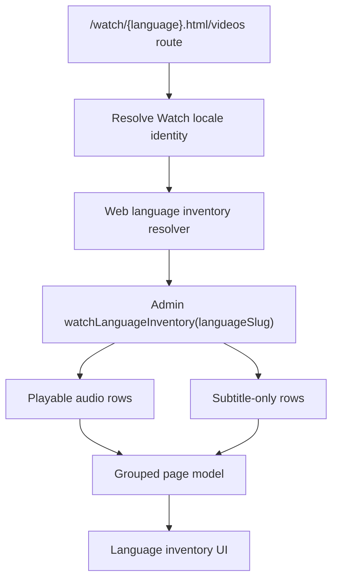

# feat: Watch language inventory page

## Summary

Build a Watch language-specific inventory page for regional leads and
missionaries. Admin will expose a bounded language catalog read model; Watch
will render audio-available collections/videos first, then subtitle-only
content.

---

## Problem Frame

The public Watch app already knows audio languages from public URL slugs, but
the `/videos` route is a placeholder and there is no localized inventory URL.
Leaders need a scan-friendly page that answers, "What can I show or promote in
this language?" without forcing them to search title by title or open
individual language pickers.

---

## Requirements

- R1. `/watch/videos` renders a default inventory and
  `/watch/{language}.html/videos` renders a language-specific inventory while
  keeping the `videos` segment `.html`-free.
- R2. The inventory lists collections/series and videos with playable audio
  before any subtitle-only content.
- R3. Subtitle-only content appears only when that language has a usable
  subtitle track and no playable audio dub for the same video.
- R4. Newly created or recently updated content in the language is promoted near
  the top without hiding the full grouped inventory.
- R5. Watch links use public audio language slugs via `watchVideoPath` and
  `watchEpisodePath`, never message-catalog locale keys.
- R6. The page avoids full dub graph fetches and keeps the heavy language
  availability work inside admin.

---

## Key Technical Decisions

- **Admin owns the language inventory read model:** The existing public `videos`
  query cannot filter dubs/subtitles by language, and fetching all dubs would
  repeat the known child x dub payload trap. Add a purpose-built admin query
  backed by raw SQL patterned after the Watch route/SEO manifest services.
- **Keep `/videos` as the default index URL:** The route already exists and is
  exempt from `.html` canonicalization. It remains a useful default fallback.
- **Add `/watch/{language}.html/videos` for language-specific inventory:** This
  keeps the language slug first, matching Watch language home URLs, while
  keeping `videos` as an app index segment.
- **Use the public route language slug for inventory language:** The proxy
  rewrites `/watch/{language}.html/videos` to an internal route that carries the
  original public language slug, so languages that fall back to English UI
  chrome still receive the correct inventory.
- **Present as an operator inventory, not a marketing landing page:** The
  design should fit Watch's image-forward style while prioritizing counts,
  availability labels, and fast scanning.

---

## High-Level Technical Design

---

## Implementation Units

### U1. Admin language inventory query

- **Goal:** Add a public admin GraphQL query that returns a compact,
  language-specific inventory model for Watch.
- **Requirements:** R2, R3, R4, R6
- **Dependencies:** None
- **Files:** `apps/admin/src/services/video.service.ts`,
  `apps/admin/src/graphql/types/video.ts`, `apps/admin/schema.graphql`,
  `packages/admin-graphql/src/admin-graphql-env.d.ts`
- **Approach:** Add service DTOs for inventory rows and a resolver field such
  as `watchLanguageInventory(languageSlug: String!, limit: Int)`. Use raw SQL
  CTEs to select published videos with playable dubs for the language, published
  collection/series parents whose children have playable dubs, and subtitle rows
  that do not have a same-video playable dub.
- **Patterns to follow:** `VideoMapperCatalogItem` objectRef wiring in
  `apps/admin/src/graphql/types/video.ts`; route-manifest `playable_video_audio`
  CTEs in `apps/admin/src/services/watch-route-manifest.service.ts`.
- **Test scenarios:** For language `spanish`, a video with a published HLS dub
  appears in the audio list; a video with both audio and subtitle appears only
  in audio; a video with a Spanish subtitle and no Spanish dub appears in
  subtitle-only; a collection with playable child audio appears in collections;
  missing or unknown language slugs return an empty inventory rather than a
  GraphQL error.
- **Verification:** The SDL exposes the new query and generated admin-graphql
  types compile for web consumption.

### U2. Web inventory resolver and page model

- **Goal:** Consume the admin query from `apps/web` and build route-safe card
  groups.
- **Requirements:** R1, R2, R3, R5, R6
- **Dependencies:** U1
- **Files:** `apps/web/src/lib/watch-language-inventory.ts`,
  `apps/web/src/proxy.ts`,
  `apps/web/src/lib/url-canonicalize.ts`,
  `apps/web/src/app/[locale]/[htmlLang]/videos/page.tsx`,
  `apps/web/src/app/[locale]/[htmlLang]/videos/[languageSlug]/page.tsx`,
  `apps/web/src/app/[locale]/[htmlLang]/videos/page.test.tsx`
- **Approach:** Add a cached server resolver that accepts `{ locale,
languageSlug }`, calls admin via `@forge/admin-graphql`, groups rows into
  collections, audio videos, subtitle-only videos, and promoted items, and
  constructs hrefs through route helpers.
- **Patterns to follow:** `apps/web/src/lib/watch-home.ts` for cached admin
  reads and card normalization; `apps/web/src/lib/content.ts` for public route
  link safety.
- **Test scenarios:** English route renders audio before subtitle-only; public
  language inventory URLs rewrite internally with the raw language slug; the
  page uses `english.html` links, not `/en.html`; empty admin results render a
  calm empty state.
- **Verification:** Focused `/videos` page tests pass.

### U3. Designed Watch language inventory UI

- **Goal:** Replace the placeholder with a polished, scan-friendly Watch page.
- **Requirements:** R1, R2, R4
- **Dependencies:** U2
- **Files:** `apps/web/src/components/watch-language-inventory/LanguageInventoryPage.tsx`,
  `apps/web/src/app/[locale]/[htmlLang]/videos/page.tsx`,
  `apps/web/messages/en.json`
- **Approach:** Render a first viewport with language name, totals, and promoted
  cards; then full-width sections for collections, videos with audio, and
  subtitles only. Reuse Watch visual language: dark image-backed bands, compact
  labels, focus rings, and hover/focus lift.
- **Patterns to follow:** `WatchHomePage`, `WatchHomeSection`,
  `WatchHomeCard`, and `SeriesEpisodeCard` motion/spacing.
- **Test scenarios:** Server-rendered HTML contains section headings in the
  required order and exposes clear labels for audio vs subtitle-only content.
- **Verification:** Helium screenshot shows no overlapping text, unreadable
  contrast, or blank image areas.

---

## Scope Boundaries

- Do not build client-side filters, infinite scroll, or a search box in this
  slice.
- Do not add an editor workflow for pinning promoted content; promotion is based
  on existing created/updated/published timestamps.
- Do not translate video metadata or infer content availability beyond admin's
  existing dub/subtitle data.

---

## Risks & Dependencies

- The new admin query changes the GraphQL schema, so deploy order must keep
  admin ahead of web or land both artifacts together.
- High-volume languages need bounded SQL and payload size. The resolver should
  cap lists and expose counts so the page remains useful without fetching every
  row on first render.
- Some public languages may not have a direct admin language row. The page
  should degrade to an empty inventory rather than failing the route.

---

## Documentation / Operational Notes

Add a PR validation note to inspect `/watch/videos` after deploy with real
production data and inspect at least one `/watch/{language}.html/videos` URL.
Healthy signals are a rendered language inventory shell, nonzero counts for
English, and links using public audio language slugs.
