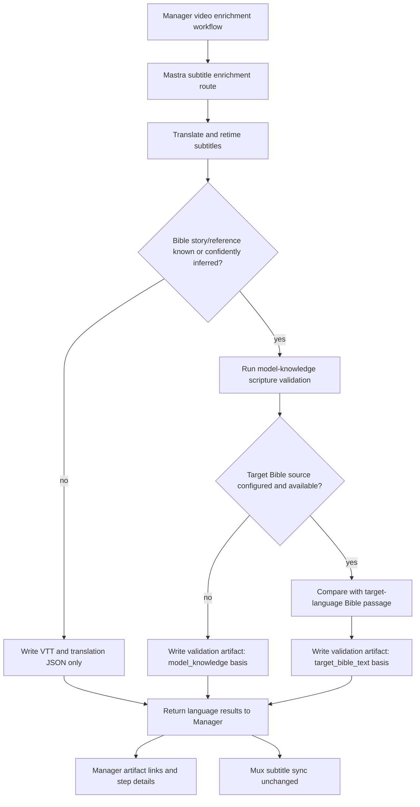

# feat: Add subtitle scripture accuracy validation

## Summary

Add a report-first subtitle scripture accuracy validation pass after Mastra completes subtitle translation and retiming. When a subtitle translation has a known or confidently inferred Bible-story reference, Mastra should use model knowledge to detect likely scripture drift, optionally compare against a configured target-language Bible text source when one is available, write a reviewable validation artifact, and return advisory risk signals to Manager.

This is intentionally not a blocking publish or Mux-sync gate. Translation remains usable, and validation can still run in model-only mode, when Bible-source coverage, licensing, credentials, or rate limits are missing. The first slice should make risky scripture drift visible without creating a full doctrinal approval product.

## Problem Frame

The existing biblical subtitle translation context plan improves translation prompts by telling the model that many videos are Christian gospel or Bible-story content. That helps the model translate closer to scripture-aware wording, but it does not validate the translated result after the fact.

Operators need a way to see whether a translated subtitle has likely drifted from the Bible story or passage it is based on. Examples include omitted details, invented details, changed names, shifted theological terms, or target-language phrasing that diverges from a known Bible text when a direct scripture story is being translated.

The current workflow already has the right ownership split:

- Mastra owns translation, retiming, scripture-context detection, provider prompts, and subtitle artifacts.
- Manager owns orchestration, job state, artifact presentation, and Mux subtitle sync.
- Mux sync should continue to depend on translation success, not on this advisory validation result.

## Goals

- Validate translated subtitles for Bible-story/scripture-sensitive videos after translation completes.
- Run a useful model-knowledge validation pass even when no Bible API or target-language Bible source is configured.
- Use target-language Bible text to improve confidence and auditability when a configured provider and Bible/version mapping are available.
- Produce structured advisory results that Manager can show to operators.
- Keep translation and Mux sync resilient when validation is model-only, unavailable, or inconclusive.
- Avoid storing provider secrets, raw prompts, or full copyrighted Bible text unless a configured license explicitly permits it.

## Non-Goals

- Do not validate source transcription or generated source-language subtitles in this slice.
- Do not block publish, Mux sync, or job completion based on validation results.
- Do not build a human review queue or doctrinal approval workflow.
- Do not implement broad theology validation beyond scripture-passage comparison for subtitle translation.
- Do not require a Bible API before scripture-drift validation can run.
- Do not hard-code one Bible provider as the permanent source of truth.
- Do not change Admin GraphQL contracts unless implementation discovers an unavoidable dependency.

## Requirements

### Validation Basis And Reference Handling

- R1. Mastra must attempt scripture validation when scripture context identifies one or more Bible references, or when the validator can confidently infer a Bible story/reference from the translated subtitle content and translation context.
- R2. Mastra must support a model-knowledge validation basis that can run without any Bible API, using the model's knowledge of Bible stories, likely references, names, sequence, and meaning.
- R3. Mastra must support a provider-agnostic Bible text adapter as an optional evidence upgrade, with provider choice and Bible/version mapping configured outside Manager.
- R4. Target-language Bible/version selection must be explicit per language or language family when external Bible text is used. Missing mapping should fall back to model-knowledge validation, not make validation unavailable.
- R5. Provider errors, missing credentials, licensing gaps, unsupported languages, and rate limits must degrade to model-knowledge validation when the validation model is available.
- R6. Validation artifacts must record the validation basis, such as `model_knowledge`, `target_bible_text`, or `unavailable`.
- R7. Provider metadata in artifacts must include enough provenance for review when external Bible text is used: provider name, bible/version id or label, reference, language, and retrieval status.

### Validation Behavior

- R8. Validation must run after translation artifacts are generated, using the translated subtitle text and either model knowledge alone or the resolved target-language Bible passage text when available.
- R9. Validation must produce structured advisory verdicts per language and reference: `pass`, `warning`, `needs_review`, or `unavailable`.
- R10. Findings must be bounded and reviewable: severity, category, rationale, affected subtitle segment ids or time ranges when available, short evidence snippets, and confidence.
- R11. The validator must distinguish between faithful natural-language adaptation and risky scripture drift. It should not require exact word-for-word matching unless the content appears to be a direct quote and a target Bible text source is available.
- R12. Model-only validation must communicate lower auditability than target-Bible-text validation, especially for exact target-language phrasing or Bible-version wording.
- R13. Same-language no-op results and non-Bible contexts must skip validation unless future requirements explicitly broaden the feature.

### Manager And Operator Surfacing

- R14. Manager must accept optional validation artifact keys and compact validation summaries from Mastra without breaking existing translation result parsing.
- R15. Manager must add validation artifacts to translation-step artifact links when present.
- R16. Manager job step details must expose an advisory validation summary per language without changing Mux sync behavior.
- R17. Existing successful translated subtitles must still sync to Mux even when validation is `warning`, `needs_review`, `model_knowledge`-only, or `unavailable`.

### Safety And Observability

- R18. Logs must be sanitized. Do not log provider keys, raw prompts, or full copyrighted Bible passage text.
- R19. Validation artifacts must not store full provider passage text unless the selected provider/license allows it. Prefer short snippets, hashes, provider ids, and structured findings.
- R20. Mastra must emit enough status information to separate provider/config fallback from actual `needs_review` scripture findings.
- R21. Validation latency and cost must be controlled by running only for languages and contexts where Bible-story signals or references are present.

## High-Level Design

## Key Technical Decisions

### KTD-1: Report-first validation

The first slice should be advisory. Model-only validation is useful but not definitive, and Bible-source coverage, licensing, and language/version mapping will be incomplete at first, so blocking publish would create false operational failures. `needs_review` should make risk visible, while Mux sync remains tied to translated subtitle success.

### KTD-2: Model knowledge is the baseline

The validator should work even when no Bible API is configured. The model can often identify Bible stories, likely references, obvious omissions, invented details, changed names, and meaning drift. Those results should be labeled with `basis: "model_knowledge"` and a confidence value so operators understand the finding is model-grounded rather than source-text-grounded.

### KTD-3: Mastra owns validation and optional Bible-provider access

Model validation prompts, optional Bible-provider credentials, reference resolution, and provider calls belong in `apps/mastra`. Manager should only receive sanitized artifact keys and summary data. This matches the existing boundary where Mastra owns translation, retiming, provider prompts, and scripture-context detection.

### KTD-4: Provider-agnostic adapter with API.Bible as an optional candidate

Implement a small internal provider interface rather than binding workflow code directly to a single API. API.Bible is a plausible optional candidate because its official docs cover Bible catalog lookup, passage retrieval, licensing/access, rate limits, and DBL/USX-oriented metadata. Provider approval and exact Bible/version mapping are prerequisites for enabling the `target_bible_text` basis in production, not prerequisites for validation overall.

### KTD-5: Validation happens after translation, not inside translation

The translation prompt should still use scripture context, but validation should inspect the completed translated subtitles as a separate step. This makes the result auditable and avoids hiding corrections inside the translation call.

### KTD-6: Additive result contract

Extend language artifact keys with an optional validation key, for example `artifactKeys.validation`, and add an optional compact validation summary on each language result. The summary should include verdict, basis, confidence, checked reference count, warning count, needs-review count, and unavailable reason when applicable. Existing `artifactKeys.vtt` and `artifactKeys.json` behavior should remain unchanged, and consumers that only care about subtitles continue to ignore validation.

### KTD-7: Provider unavailable usually falls back, not fails

Provider/config/licensing/rate-limit issues should not become language translation failures. When the validation model is available, these issues should produce `basis: "model_knowledge"` with source fallback reasons such as `provider_config_missing`, `bible_mapping_missing`, `reference_unsupported`, `provider_rate_limited`, or `provider_failed`. Reserve `unavailable` for cases where validation cannot run at all.

### KTD-8: Do not store full copyrighted passage text by default

The validation artifact should store basis, provenance, short evidence snippets, segment references, confidence, and structured findings. Full passage text should only be stored when the selected Bible source and license explicitly permit it.

## Implementation Units

### U1. Roadmap And Contract Shape

Create the roadmap entry for this feature and define the additive Mastra/Manager result shape before implementation.

Likely files:

- `docs/roadmap/media-generation/feat-193-subtitle-scripture-accuracy-validation.md`
- `docs/roadmap/README.md`
- `apps/mastra/src/services/subtitle-enrichment/types.ts`
- `apps/mastra/src/mastra/workflows/subtitle-enrichment.ts`
- `apps/manager/src/services/mastra-subtitle-enrichment.ts`
- `apps/manager/src/types/job.ts`

Implementation notes:

- Add a `SubtitleScriptureValidationResult` or similarly named shared local schema in Mastra.
- Extend `SubtitleLanguageResultSchema.artifactKeys` with optional `validation`.
- Add an optional compact language-level validation summary with verdict, basis, confidence, checked reference count, needs-review count, warning count, fallback reason, and unavailable reason when applicable.
- Mirror the optional validation artifact key and compact summary in Manager parsing.
- Keep existing success/failure envelope semantics unchanged.

Tests:

- Mastra accepts and returns language results with optional validation artifact keys.
- Manager parses old Mastra responses without validation keys.
- Manager parses new responses with validation keys, basis, confidence, and compact validation summaries.
- Translation success status is independent from validation verdict.

### U2. Optional Bible Source Adapter And Reference Resolver

Add a Mastra-owned adapter that resolves configured target-language Bible text for detected references when an external Bible source is enabled. This adapter upgrades validation basis from `model_knowledge` to `target_bible_text`; it is not required for validation to run.

Likely files:

- `apps/mastra/src/services/subtitle-enrichment/bible-source.ts`
- `apps/mastra/src/services/subtitle-enrichment/bible-source.test.ts`
- `apps/mastra/src/services/subtitle-enrichment/scripture-context.ts`
- `apps/mastra/src/env.ts` or the existing Mastra config surface
- `apps/mastra/AGENTS.md`
- `apps/mastra/CLAUDE.md`

Implementation notes:

- Define a provider interface that returns passage text plus provenance metadata.
- Keep API.Bible-specific URL/id logic behind one adapter implementation.
- Configure provider choice, API key, base URL, and target-language Bible/version mapping through Mastra env/config.
- Normalize detected Bible references into provider-compatible ids only when confidence is high enough.
- Use model-knowledge fallback for unsupported external references, unsupported provider languages, missing mapping, missing credentials, and provider failures when the validation model is available.
- Include fallback reasons in validation summaries so operators can tell when external Bible text was not used.

Tests:

- Missing provider config falls back to `model_knowledge` and does not throw through translation.
- Missing target-language Bible mapping falls back to `model_knowledge`.
- Provider success returns passage text with provenance.
- Provider 401/403/404/429/5xx are mapped to structured fallback reasons.
- Reference normalization handles book/chapter/verse ranges used by scripture context.

### U3. Scripture Accuracy Validator

Add a validator that compares translated subtitle text against model knowledge and, when available, target-language Bible passage text. It returns structured findings either way and labels the basis used.

Likely files:

- `apps/mastra/src/services/subtitle-enrichment/scripture-validation.ts`
- `apps/mastra/src/services/subtitle-enrichment/scripture-validation.test.ts`
- `apps/mastra/src/services/subtitle-enrichment/openrouter.ts`
- `apps/mastra/src/services/subtitle-enrichment/types.ts`

Implementation notes:

- Use deterministic guards first: empty text, missing references, unsupported context, and unavailable validation model.
- Use a structured LLM comparison for both model-only and target-Bible-text modes.
- Include the translated subtitle full text and relevant segment/timing data in the validator input.
- In model-only mode, ask the validator to identify likely Bible story, likely reference, risky meaning drift, omissions, additions, changed names, theological term shifts, and unsupported details from model knowledge.
- In target-Bible-text mode, ask the validator to compare against the supplied passage text and be stricter about direct quotes and version-specific phrasing.
- Return bounded evidence snippets and segment ids/time ranges rather than full passage dumps.
- Return `basis` and `confidence` on every validation result.
- Treat faithful natural-language adaptation as acceptable when meaning is preserved.

Tests:

- Faithful adaptation produces `pass` in model-only mode.
- Faithful adaptation produces `pass` in target-Bible-text mode.
- Minor model-only uncertainty produces `warning` with lower confidence.
- Invented scripture detail produces `needs_review`.
- Missing external passage falls back to model-only validation.
- Missing validation model produces `unavailable`.
- Validator output schema rejects unbounded or malformed findings.

### U4. Integrate Validation Into Mastra Subtitle Run

Run validation after each translated language completes and write validation artifacts alongside existing subtitle artifacts.

Likely files:

- `apps/mastra/src/services/subtitle-enrichment/run.ts`
- `apps/mastra/src/services/subtitle-enrichment/run.test.ts`
- `apps/mastra/src/mastra/workflows/subtitle-enrichment.ts`
- `apps/mastra/src/services/subtitle-enrichment/types.ts`

Implementation notes:

- Preserve current same-language no-op behavior.
- Only run validation for translated languages when scripture context contains references or strong Bible-story signals.
- Write a JSON artifact such as `subtitle-validation-${targetLanguage}` or `scripture-validation-${targetLanguage}`.
- Include validation artifact key in `artifactKeys.validation` when writing succeeds.
- Include a compact validation summary on the language result whenever validation is attempted, including basis, confidence, and fallback reason when external Bible text is not used.
- If optional Bible-source lookup fails after translation succeeds, fall back to model-only validation.
- If validation itself fails after translation succeeds, return the language as completed and record validation `unavailable` when possible.
- Avoid adding validation data to VTT artifacts.

Tests:

- Bible-story translation with a known or confidently inferred reference writes VTT, translation JSON, and validation JSON.
- Non-Bible translation writes only existing VTT and translation JSON.
- Same-language result skips validation.
- Optional Bible provider failure does not mark the language failed and falls back to model-only validation.
- Validation storage failure is logged and does not break completed subtitle translation unless existing storage guarantees require otherwise.

### U5. Surface Validation In Manager

Teach Manager to expose validation artifacts and advisory summaries in the translation step.

Likely files:

- `apps/manager/src/services/mastra-subtitle-enrichment.ts`
- `apps/manager/src/workflows/videoEnrichment.ts`
- `apps/manager/src/lib/job-artifacts.ts`
- `apps/manager/src/types/job.ts`
- Existing Manager tests around translation result parsing and artifact manifests

Implementation notes:

- Accept optional `artifactKeys.validation` and compact validation summaries from Mastra.
- Add dynamic artifact labels/descriptors for subtitle scripture validation artifacts.
- Include validation artifacts in the translation step artifact manifest when present.
- Use Mastra's compact validation summaries to populate `JobStepDetails`, such as highest verdict, basis, confidence, languages checked, languages using model-only fallback, languages unavailable, and needs-review count.
- Keep `syncTranslatedSubtitlesToMux` unchanged except for ignoring validation metadata.

Tests:

- Translation artifact manifest includes validation JSON when Mastra returns it.
- Translation artifact manifest remains unchanged for old Mastra results.
- Job step details summarize advisory validation basis and results from compact Mastra summaries without changing language completion.
- Mux sync still receives the same completed language VTT/JSON inputs as before.

### U6. Documentation And Operational Guardrails

Document how to enable, operate, and interpret the validation pass.

Likely files:

- `apps/mastra/AGENTS.md`
- `apps/mastra/CLAUDE.md`
- `apps/manager/AGENTS.md`
- `apps/manager/CLAUDE.md`
- `docs/roadmap/media-generation/feat-193-subtitle-scripture-accuracy-validation.md`

Implementation notes:

- Document that model-knowledge validation is the default baseline and Bible-source provider access is optional.
- Document required Mastra env/config for enabling the optional Bible-source provider path.
- Document that validation is advisory and non-blocking in this slice.
- Document that provider licensing and target-language Bible/version mapping must be approved before production use.
- Document what `pass`, `warning`, `needs_review`, and `unavailable` mean for operators.
- Document what `model_knowledge` and `target_bible_text` bases mean for operators.
- Document artifact privacy rules: no secrets, no raw prompts, no full copyrighted passage text unless license permits.

Tests:

- Documentation names the exact config keys introduced by implementation.
- Documentation explains model-only fallback behavior for missing provider/config/license coverage.
- Roadmap status and dependencies are updated at implementation completion.

## Acceptance Examples

### AE-1: Bible story with configured target Bible source

Input: English source subtitles for a Bible-story video, target language configured with a Bible/version mapping, and scripture context resolving to a known reference.

Expected:

- Translation completes.
- VTT and translation JSON artifacts are written.
- Validation JSON artifact is written.
- Manager translation step links all three artifacts.
- Job details show advisory verdict, `target_bible_text` basis, confidence, and summary.
- Mux sync uploads the translated VTT as before.

### AE-2: Bible story with no Bible provider config

Input: Same as AE-1, but Mastra has no Bible provider key or no target-language Bible mapping.

Expected:

- Translation completes.
- Existing subtitle artifacts are written.
- Validation still runs using `model_knowledge` basis.
- Validation artifact is written when validation completes.
- Job does not fail because external Bible text is unavailable.
- Manager summary shows model-only basis, confidence, and any fallback reason.

### AE-3: Non-Bible or low-confidence scripture context

Input: A generic video or a gospel-adjacent video with no confident Bible reference.

Expected:

- Translation completes as it does today.
- Validation is skipped.
- No validation artifact is required.
- Manager and Mux behavior remain unchanged.

### AE-4: Risky scripture drift in model-only mode

Input: A Bible-story translation that adds unsupported details or changes a key name/meaning, with no external Bible text configured.

Expected:

- Translation still completes.
- Validation artifact verdict is `needs_review` with `basis: "model_knowledge"`.
- Findings identify the likely story/reference, issue category, confidence, and affected segments/time ranges.
- Manager surfaces advisory risk with model-only basis.
- Mux sync is not blocked in this slice.

### AE-5: Risky scripture drift with target Bible text

Input: A Bible-story translation that adds unsupported details or changes a key name/meaning relative to the target-language Bible passage.

Expected:

- Translation still completes.
- Validation artifact verdict is `needs_review` with `basis: "target_bible_text"`.
- Findings identify the issue category and affected segments/time ranges.
- Manager surfaces advisory risk.
- Mux sync is not blocked in this slice.

## System-Wide Impact

### Mastra

- Adds a model-knowledge validation module to subtitle enrichment.
- Adds an optional Bible-source adapter for higher-confidence source-text validation.
- Adds optional provider credentials/config only for the external Bible-source path.
- Adds one optional artifact per validated target language.
- Adds extra model calls only for scripture-context translations, and provider calls only when optional external Bible text is configured.

### Manager

- Parses an additive validation artifact key.
- Adds validation artifacts and summaries to translation step details.
- Leaves existing workflow step ordering and Mux subtitle sync unchanged.

### Admin

- No planned Admin schema changes.
- No generated Admin GraphQL type changes expected.

### Mux

- No planned Mux contract changes.
- Translated VTT sync remains based on successful translated language results.

## Risks And Mitigations

- Model-memory risk: model-only validation can miss subtle passage/version differences or assert uncertain details too confidently. Mitigation: label basis and confidence, keep results advisory, and use target Bible text when exactness matters.
- Licensing risk: Bible providers may restrict display/storage of passage text. Mitigation: make external Bible text optional, store metadata and bounded snippets by default, and require provider/license approval before production enablement.
- Coverage risk: target-language Bible mappings may be incomplete. Mitigation: fall back to `model_knowledge` instead of failing validation.
- False-positive risk: subtitles may be faithful adaptations rather than direct Bible quotes. Mitigation: validator instructions should preserve meaning rather than demand exact wording, and direct-quote strictness should apply only when the content appears to quote scripture.
- Latency/cost risk: validation adds model calls, and optional provider calls when external Bible text is configured. Mitigation: run only when scripture references or strong Bible-story signals are present.
- Operator trust risk: advisory verdicts could be treated as definitive. Mitigation: label results as validation assistance and keep human review language in docs.
- Storage/privacy risk: artifacts could accidentally contain secrets, prompts, or too much Bible text. Mitigation: schema-level artifact constraints and tests for sanitized output.

## Validation Plan

- Mastra unit tests for model-only validation, optional Bible source adapter, reference normalization, provider fallback mapping, validation verdict schema, and subtitle run integration.
- Manager unit tests for Mastra response parsing, basis/confidence propagation, artifact manifest generation, job step detail summaries, and unchanged Mux sync inputs.
- Existing subtitle enrichment workflow tests for translated and same-language paths.
- Typecheck/lint for touched Mastra and Manager packages.
- Focused local workflow fixtures for one scripture-context translation in model-only mode and one with a mocked Bible provider.

## Dependencies

- No Bible provider is required for the first model-only validation slice.
- A provider and licensing decision is required only before enabling production `target_bible_text` validation.
- Mastra secret/config management is required only for optional provider credentials and language-to-Bible mapping.
- Agreement on artifact naming, recommended default: `subtitle-validation-${targetLanguage}`.
- Agreement that this slice remains advisory and non-blocking.

## Deferred Follow-Ups

- Blocking publish/Mux-sync gate for high-risk scripture drift.
- Human review queue and approval UI.
- Full doctrinal validation integration with `docs/roadmap/platform/feat-067-doctrinal-validation-engine.md`.
- Validation of generated source subtitles or transcription accuracy.
- Provider/version selection UI for operators.
- Translation feedback loop that re-runs translation after validation findings.

## Sources And Research

- Existing plan: `docs/plans/2026-06-16-001-feat-biblical-subtitle-translation-context-plan.md`
- Mastra subtitle run and types: `apps/mastra/src/services/subtitle-enrichment/run.ts`, `apps/mastra/src/services/subtitle-enrichment/types.ts`
- Mastra workflow route: `apps/mastra/src/mastra/workflows/subtitle-enrichment.ts`
- Manager Mastra client: `apps/manager/src/services/mastra-subtitle-enrichment.ts`
- Manager artifact handling: `apps/manager/src/lib/job-artifacts.ts`, `apps/manager/src/workflows/videoEnrichment.ts`
- Existing broad doctrinal roadmap: `docs/roadmap/platform/feat-067-doctrinal-validation-engine.md`
- API.Bible docs: `https://docs.api.bible/`
- API.Bible working with Bibles: `https://docs.api.bible/quick-start/working-with-bibles/`
- API.Bible passages guide: `https://docs.api.bible/guides/passages/`
- API.Bible licensing/access: `https://docs.api.bible/quick-start/licensing-and-access/`
- API.Bible rate limiting: `https://docs.api.bible/quick-start/rate-limiting/`
