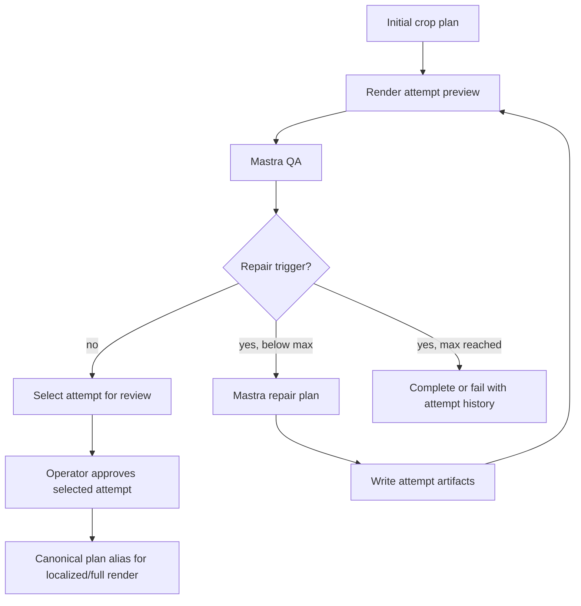

# Smart Crop repair loop with attempt previews

## Summary

Add an attempt-versioned Smart Crop repair loop for canonical crop plans. Crop-affecting QA warnings and repair verdicts should produce revised crop-path candidates, render a preview for every attempt, and leave the operator with a visible before/after history before approving the selected plan for downstream cropped-video renders.

---

## Problem Frame

Smart Crop QA is advisory today: `apps/manager/src/workflows/smartCrop.ts` stores the QA verdict and issues, but it does not change `segments[].cropKeyframes`. The job also has only one plan, one preview, and one QA artifact per asset, so a retry or repair would overwrite the visual evidence an operator needs to compare attempts. The next increment needs to make QA issues actionable without hiding the crop-path history.

---

## Requirements

- R1. A canonical Smart Crop job must create an initial crop attempt and at least one repair attempt when QA returns `needs_repair`, `fail`, or a repair-triggering `warning` or `critical` issue. Report-only warnings remain visible in QA but do not rewrite crop paths.
- R2. Every attempt must have durable, separately downloadable plan, preview, preview-frame, render-report, and QA artifacts so earlier attempts are never overwritten by later repairs.
- R3. Repair attempts must be generated by Mastra through an explicit Smart Crop repair contract; Manager may orchestrate and persist attempts but must not invent AI crop decisions.
- R4. The repair loop must use `SMART_CROP_MAX_REPAIR_ATTEMPTS = 2`, excluding attempt 0, and complete for operator review only when QA has no repair-triggering verdict or issues.
- R5. The job detail page must let a human switch between attempts and see the original landscape video with that attempt's crop box, shot markers, preview video, and QA issues.
- R6. Operator approval must approve the viewed selected attempt, validate the attempt index and manifest digest, and make that attempt the canonical plan consumed by localized/full render jobs.
- R7. Existing Smart Crop jobs and artifacts must keep rendering in the Manager UI; the new attempt contract is additive around the current `smart-crop-plan`, `smart-crop-preview`, and `smart-crop-qa` logical keys.
- R8. Validation must include a short Mux-library video smoke target, plus focused tests for the attempt artifacts, repair loop gating, crop-worker output naming, Mastra repair parsing, and Manager attempt UI.
- R9. Attempt artifacts must be served only through authorized Manager artifact routes; manifests store logical keys and digests, never presigned URLs or provider credentials.
- R10. Max-attempt terminal states must be deterministic for `pass`, `pass` with warnings, `needs_repair`, `fail`, critical issues, and QA-unavailable outcomes.

---

## High-Level Technical Design



The durable workflow remains Manager-owned. Mastra receives bounded repair requests and returns replacement plan segments for the affected canonical shots. Manager applies those replacement segments to the previous complete attempt plan, preserving unaffected shots and original segment order, before writing the next full attempt plan. crop-worker remains the only byte renderer, but its render request gains attempt-aware artifact naming so previews and frames from attempt 1 do not overwrite attempt 0.

---

## Key Technical Decisions

- **Attempt manifest as the UI source of truth:** Store `{assetId}/smart-crop-attempts-9x16-v1.json` with attempt indexes, artifact logical keys, verdict summaries, trigger issues, selected attempt, and provenance. This avoids scraping the job artifact manifest to reconstruct repair history.
- **Attempt artifacts use flat suffixes:** Use flat artifact types such as `smart-crop-plan-9x16-attempt-001-v1`, `smart-crop-preview-9x16-attempt-001`, and `smart-crop-qa-9x16-attempt-001-v1`. This preserves the storage validator's `{assetId}/{artifactType}.{ext}` rule.
- **Mastra repairs affected canonical shots:** The first repair pass targets issue-linked shots when QA provides `shotId`, then falls back to preview-rendered shots and finally the whole preview sample. This keeps requests bounded and avoids re-paying the full-video planner when QA found a local problem.
- **Manager owns the full-plan merge:** A repaired attempt starts as a copy of the previous complete attempt plan. Manager replaces exactly the requested `shotId` segments returned by Mastra, rejects missing/extra/empty replacements, preserves segment order, stamps repair provenance, and validates full-plan coverage before rendering.
- **Latest acceptable attempt is the default selection:** Repair attempts stay separate until approval. The UI defaults to the latest complete acceptable attempt; the operator can switch attempts, and approval canonicalizes the currently selected attempt only.
- **Approval is bound to manifest revision:** The approve request includes `attemptIndex` and the current attempt-manifest digest. The server re-reads the manifest, validates that the selected attempt belongs to the job/asset and is still selectable, re-parses the attempt plan, then copies it into the existing canonical plan artifact with `qa.status = "approved"`.
- **Canonical approval records the selected attempt:** Approving a repaired attempt copies that attempt plan into the legacy canonical artifact and marks the attempt manifest with the selected attempt/digest. Existing localized/full renders are not retroactively re-bound to a different crop path.
- **Attempt manifest has lifecycle states:** Attempts move through `planned`, `previewed`, `qa_unavailable`, `complete`, `failed`, `approved`, and `rejected`. Retry reconciliation verifies referenced artifacts before an attempt becomes selectable or approvable.
- **Repair trigger taxonomy is centralized:** Manager implements one `shouldRepairSmartCropQa` helper and tests every verdict/severity/max-attempt branch instead of scattering repair decisions across workflow code.
- **Repair does not introduce a manual crop editor:** Operators compare attempts and approve/reject. Pixel-level manual editing remains outside this increment.
- **Localized-specific repair is deferred:** This plan repairs canonical crop paths. Localized jobs continue to reuse the approved canonical plan through the timeline map; localized QA remains visible and advisory unless a later plan adds localized override attempts.

---

## Repair Decisions

The production default is two repair attempts after attempt 0. `SMART_CROP_MAX_REPAIR_ATTEMPTS` is a code constant in this increment, not a job option.

| Current QA state                                                                                  | Repairs remaining | Workflow action       | Job outcome                                             |
| ------------------------------------------------------------------------------------------------- | ----------------- | --------------------- | ------------------------------------------------------- |
| `pass` with no repair-triggering issues                                                           | any               | Stop repair loop      | `completed`, ready for operator approval                |
| `pass` with repair-triggering `warning` or `critical` issues                                      | yes               | Create repair attempt | stays running                                           |
| `needs_repair`                                                                                    | yes               | Create repair attempt | stays running                                           |
| `fail`                                                                                            | yes               | Create repair attempt | stays running                                           |
| repair-triggering `warning` or `critical` repeats with the same issue signature after max repairs | no                | Stop repair loop      | `completed`, operator may reject or force retry         |
| `needs_repair` after max repairs                                                                  | no                | Stop repair loop      | `completed`, operator may reject or force retry         |
| `fail` or any `critical` issue after max repairs                                                  | no                | Fail QA/repair step   | `failed`, artifacts remain downloadable through Manager |
| QA unavailable because of config/presign/provider auth                                            | any               | Do not repair         | existing advisory skipped behavior                      |
| `info` or report-only warning issues only                                                         | any               | Do not repair         | `completed`, ready for operator approval                |

`shouldRepairSmartCropQa` first classifies issues into repair-triggering versus report-only, then normalizes issue signatures by severity, `shotId` when present, rounded `atSeconds`, and description. Repeated signatures after a repair count against the max-attempt terminal behavior instead of consuming unbounded attempts.

---

## Operator Review Contract

The attempt comparison surface is a single-view toggle, not side-by-side video. It defaults to the latest complete acceptable attempt, falls back to the latest complete attempt, and then to attempt 0 for legacy or partial jobs. The selector label includes attempt number, QA verdict, issue count, and whether it is selected, approved, failed, or in progress.

Selecting an attempt updates the original-landscape crop overlay, shot timeline, preview video, QA issue list, and artifact links together. Issue rows are grouped by severity; selecting an issue seeks to `atSeconds` when present, highlights the linked `shotId` marker when present, and otherwise leaves the playhead unchanged with the issue still visible in the list.

Approval is enabled only for complete attempts with a parsed plan and matching manifest digest. Rejection records `qa.status = "rejected"` on the canonical alias only when one exists, records actor/timestamp on the selected attempt in the manifest, and leaves the job completed for force retry or future operator action. Final failed jobs keep retry as the primary recovery path.

Keyboard users must be able to tab through the attempt selector, shot markers, issue rows, preview video controls, and approve/reject actions in visual order. Controls need labels or `aria-label`s, current attempt and loading/error states need status text, and mobile layouts must keep the selected attempt and approval actions visibly connected.

---

## Smart Crop Repair Contract

`POST /forge-smart-crop-repair` follows the existing Mastra service envelope and bearer validation:

```json
{
  "asset": { "assetId": "asset123", "playbackId": "pb_abc" },
  "source": { "width": 1920, "height": 1080, "durationSeconds": 7200.04 },
  "target": { "aspectRatio": "9:16", "width": 1080, "height": 1920 },
  "attempt": {
    "index": 1,
    "previousPlanGeneratedAt": "2026-06-16T00:00:00.000Z"
  },
  "issues": [
    {
      "severity": "warning",
      "description": "Subject off-center",
      "atSeconds": 12,
      "shotId": "shot_00003"
    }
  ],
  "shots": [
    {
      "shotId": "shot_00003",
      "start": 10,
      "end": 14,
      "previousSegment": { "...": "previous full-plan segment" },
      "frameUrls": ["https://image.mux.com/..."]
    }
  ],
  "model": "qwen/qwen2.5-vl-72b-instruct"
}
```

Success returns `{ "ok": true, "segments": [<replacement plan segments>], "usage": { "inputTokens": 0, "outputTokens": 0 }, "model": "..." }`. Failure returns the same Smart Crop failure envelope used by `plan`, `align`, and `qa`. Mastra validates that every requested `shotId` appears exactly once and no unknown shot ids are returned. Manager validates the same invariant again before merging.

Repair prompts send only selected shot frames, previous segment data, and bounded QA issue fields. They must not include operator identity, credentials, presigned URL secrets beyond the short-lived frame URLs themselves, durable S3 keys, or unrelated plan segments. Provider output is untrusted until Zod validation and Manager-side merge validation pass.

---

## Artifact Access And Validation

Attempt artifact downloads go through the existing authenticated Manager artifact route. The route resolves the storage prefix from `options.smartCrop.assetId`, accepts only exact legacy keys or Smart Crop attempt logical keys matching the attempt manifest, and mints any presigned URL only after authentication and job-scoped validation. The attempt manifest stores logical keys, artifact types, digests, and status; it never stores presigned URLs.

crop-worker render requests add explicit `cropPlan.artifactType` and `render.artifactSuffix` fields. The request schema accepts only Smart Crop plan artifact types matching `smart-crop-plan-9x16-v1` or `smart-crop-plan-9x16-attempt-\d{3}-v1`, and only suffixes matching `attempt-\d{3}` for attempt outputs. The in-flight dedupe key includes target asset id, mode, crop plan asset id, crop plan artifact type, timeline map asset id, and artifact suffix.

QA frame-to-shot mapping is part of the attempt render contract. crop-worker render reports include the rendered `shotId`s per preview segment; Manager passes frame time plus rendered shot id candidates into Mastra QA, validates any returned issue `shotId` against those candidates, preserves valid `shotId`s in the QA artifact, and falls back to preview-sample repair when no issue has a valid shot id.

---

## Implementation Units

### U1. Attempt artifact contracts and Manager helpers

- **Goal:** Add attempt-aware artifact shapes and pure helper functions around Smart Crop plans, QA reports, render reports, and UI summaries.
- **Files:** `apps/manager/src/services/smartCrop.ts`, `apps/manager/src/lib/job-artifacts.ts`, `apps/manager/src/lib/smart-crop-report.ts`, `apps/manager/src/types/job.ts`, `apps/manager/src/services/smartCrop.test.ts`, `apps/manager/src/lib/job-artifacts.test.ts`.
- **Patterns:** Extend the existing duck-typed artifact parsers and dynamic artifact descriptor patterns. Keep legacy logical keys valid for old jobs.
- **Test Scenarios:** Parse/write an attempts manifest; resolve attempt logical keys; preserve legacy plan/preview/QA descriptors; summarize selected/latest attempts in the metadata report.

### U2. crop-worker attempt-aware render outputs

- **Goal:** Let render jobs read an attempt-specific crop plan artifact and write attempt-specific preview/report/frame artifacts.
- **Files:** `apps/crop-worker/src/routes/jobs.ts`, `apps/crop-worker/src/render.ts`, `apps/crop-worker/src/types.ts`, `apps/crop-worker/src/render.test.ts`, `apps/crop-worker/src/routes/jobs.test.ts`, `apps/crop-worker/src/crop-plan.ts`.
- **Patterns:** Keep optional request fields additive with current defaults. Include the crop plan artifact type and render artifact suffix in the in-flight dedupe key.
- **Test Scenarios:** Attempt preview writes suffixed MP4/report/frame names; default preview names remain unchanged; dedupe separates two attempts for the same asset and mode; render reports expose the rendered shot ids used by QA mapping.

### U3. Mastra Smart Crop repair route

- **Goal:** Add `/forge-smart-crop-repair` as a bounded repair decision workflow that returns replacement crop-plan segments for affected shots.
- **Files:** `apps/mastra/src/mastra/workflows/smart-crop-repair.ts`, `apps/mastra/src/mastra/index.ts`, `apps/mastra/src/services/smart-crop/openrouter-vision.ts`, `apps/mastra/src/services/smart-crop/planner.ts`, `apps/mastra/src/mastra/workflows/smart-crop-repair.test.ts`.
- **Patterns:** Mirror `smart-crop-plan` route auth, envelope, failure parsing, frame host allowlist, and deterministic `intentToKeyframes` planner. Do not import Manager or crop-worker code.
- **Test Scenarios:** Repair input validation rejects invalid issue/shot payloads; provider output must include exactly the requested shot ids; failure envelopes match existing Smart Crop reasons; repaired segments preserve schema compatibility with the canonical plan.

### U4. Manager repair loop orchestration

- **Goal:** Replace single-pass QA handling with a bounded canonical attempt loop: plan attempt 0, preview, QA, repair, preview, QA, select attempt, and persist attempt history.
- **Files:** `apps/manager/src/workflows/smartCrop.ts`, `apps/manager/src/services/mastra-smart-crop.ts`, `apps/manager/src/lib/workflow-steps.ts`, `apps/manager/src/app/api/smart-crop/jobs/[id]/approve/route.ts`, route/workflow tests under `apps/manager/src`.
- **Patterns:** Keep workflow step payloads small and artifact-backed. Treat Mastra config-shaped QA failures as unavailable, not as repair triggers. Use `FatalError` only for deterministic terminal failures.
- **Test Scenarios:** A QA warning triggers one repair attempt; info-only QA does not repair; max attempts stops the loop according to the repair decision table; final `fail` fails the QA/repair path; approval of attempt 1 with matching digest writes that plan to the canonical artifact and records the actor; stale digest approval is rejected.

### U5. Manager attempt comparison UI

- **Goal:** Show every repair loop on the job detail page through an attempt selector, original-video crop overlay, shot timeline, QA issue list, and attempt preview video.
- **Files:** `apps/manager/src/features/smart-crop/smart-crop-job-detail.tsx`, `apps/manager/src/features/smart-crop/smart-crop-plan-review-player.tsx`, `apps/manager/src/features/smart-crop/smart-crop-plan-player.ts`, `apps/manager/src/features/smart-crop/smart-crop-presenter.ts`, `apps/manager/src/app/globals.css`, related tests.
- **Patterns:** Extend the current original crop guide instead of adding a separate review surface. Use concise operational controls and avoid nested cards.
- **Test Scenarios:** Old single-plan jobs still load; attempt history loads multiple plans; default selection prefers the latest complete acceptable attempt; switching attempts changes the crop box and preview video source; QA issue selection seeks/highlights when possible; loading, missing artifact, partial manifest, in-progress, failed, and legacy states render without overlapping controls; browser smoke covers the seeded short Mux job.

### U6. Seed data, docs, and short-video smoke

- **Goal:** Provide a short Smart Crop demo job with multiple attempts and document the repair behavior for operators and future agents.
- **Files:** `apps/manager/src/cms/mock-seed.ts`, `apps/manager/CLAUDE.md`, `apps/crop-worker/CLAUDE.md`, `apps/mastra/CLAUDE.md`, `docs/roadmap/media-generation/feat-173-smart-crop-video-reframing.md`.
- **Patterns:** Keep mock/demo data in Manager. Update the authoritative plan or package guides only for durable contract deltas.
- **Test Scenarios:** Mock detail page shows attempt history using a short public Mux playback id from the library; smoke verifies the crop overlay and preview video controls render.

---

## Scope Boundaries

- This plan does not add a manual crop editor, drag handles, or operator-authored keyframes.
- This plan does not add localized-specific crop overrides; localized jobs consume the selected approved canonical plan.
- This plan does not change the 9:16-only, horizontal-pan MVP crop rule.
- This plan does not make Mastra own orchestration, storage, Mux output creation, or FFmpeg rendering.

---

## Risks & Dependencies

- **Artifact sprawl:** Attempt previews add more MP4/JPG artifacts per job. Mitigation: bound repair attempts and list only attempt artifacts in the attempt manifest.
- **Repair prompt overreach:** A model could change unaffected shots. Mitigation: repair requests are scoped to selected shot ids and the response must include exactly those ids.
- **Approval drift:** If approval writes the wrong attempt to the canonical alias, localized full renders use the wrong path. Mitigation: approval takes an explicit selected attempt plus manifest digest and re-parses the attempt plan before writing the alias.
- **Worker dedupe collision:** If attempt suffix or plan artifact type is omitted from the dedupe key, a retry could attach to another attempt's render. Mitigation: include plan artifact type and suffix in `jobDedupeKey`.
- **Partial attempt exposure:** If a workflow crashes between writing artifacts and manifest updates, the UI could show missing evidence. Mitigation: lifecycle states and retry reconciliation keep attempts unselectable until referenced artifacts parse successfully.
- **Artifact exposure:** More downloadable artifacts increase leak surface. Mitigation: authorized Manager routes validate job-scoped logical keys and never persist presigned URLs in manifests.
- **Provider data leakage:** Repair prompts cross a third-party model boundary. Mitigation: send only selected shot frames and bounded QA fields through allowlisted short-lived URLs, and validate all provider output before persistence.
- **Local QA limitations:** Local fallback storage cannot presign QA frames. Mitigation: unit-test the repair loop with mocked QA results and run the real short-Mux smoke only when S3/presign configuration is available.

---

## Acceptance Examples

- AE1. Given attempt 0 QA returns `pass` with one `warning`, when the canonical workflow continues, then Manager calls the repair route, stores attempt 1 artifacts, renders attempt 1 preview, and shows both attempts on the detail page.
- AE2. Given attempt 0 QA returns only `info` issues, when the canonical workflow continues, then no repair attempt is created and the job completes for operator review.
- AE3. Given two repair attempts still end with `fail`, when `SMART_CROP_MAX_REPAIR_ATTEMPTS` is reached, then the job fails with all complete attempt artifacts downloadable through Manager.
- AE4. Given an operator selects attempt 1 and approves with the current manifest digest, when a localized job renders later, then the canonical plan artifact contains attempt 1 crop keyframes with `qa.status = "approved"`.
- AE5. Given an old Smart Crop job with only legacy `smart-crop-plan` and `smart-crop-preview` artifacts, when the detail page loads, then the original crop guide still works without an attempts manifest.
- AE6. Given a stale browser tab approves attempt 0 with an old manifest digest after attempt 1 completes, when the server handles the request, then approval is rejected and the canonical alias is unchanged.
- AE7. Given Mastra repair returns only the requested segment replacements, when Manager writes attempt 1, then the attempt plan contains every segment from attempt 0 with only the requested `shotId`s replaced.

---

## Verification

- `pnpm --filter @forge/manager test -- smartCrop.test.ts mastra-smart-crop.test.ts smart-crop-plan-player.test.ts smart-crop-presenter.test.ts job-artifacts.test.ts`
- `pnpm --filter @forge/mastra test -- smart-crop-plan.test.ts smart-crop-qa.test.ts smart-crop-repair.test.ts planner.test.ts`
- `pnpm --filter @forge/crop-worker test -- render.test.ts routes/jobs.test.ts crop-plan.test.ts`
- `pnpm --filter @forge/manager typecheck`
- `pnpm --filter @forge/mastra typecheck`
- `pnpm --filter @forge/crop-worker typecheck`
- `pnpm --filter @forge/manager lint`
- `pnpm --filter @forge/mastra lint`
- `pnpm --filter @forge/crop-worker lint`
- Browser smoke: run Manager in mock mode, open `/dashboard/smart-crop/mock-smart-crop-1`, verify the seeded short Mux job shows multiple attempts, switch attempts, and confirm the crop box and preview video update.
- Real short-video smoke when config is present: run Manager, Mastra, and crop-worker against shared artifacts, create a canonical job from a short public Mux playback id in the library, force a mocked warning QA result if needed, and confirm a repaired attempt can be approved before a localized/full render consumes the selected plan.

---

## Sources / Research

- `docs/plans/2026-06-09-002-feat-smart-crop-plan.md` defines the current Smart Crop artifact, workflow, Mastra, and crop-worker contracts.
- `docs/roadmap/media-generation/feat-173-smart-crop-video-reframing.md` points to the active Smart Crop entry points and constraints.
- `docs/solutions/architecture-patterns/smart-crop-three-app-decomposition-20260610.md` preserves the Manager-orchestrates, Mastra-decides, crop-worker-renders split.
- `docs/solutions/architecture-patterns/re-renderable-jobs-output-provenance-and-locked-report-merge-20260611.md` explains why multi-output jobs need provenance-stamped output identity.
- `apps/manager/src/workflows/smartCrop.ts` currently stores QA results but does not mutate crop paths.
- `apps/crop-worker/src/render.ts` currently hardcodes single preview/report/frame artifact names.
- `apps/manager/src/features/smart-crop/smart-crop-plan-review-player.tsx` is the current original-video crop overlay surface to extend for attempt comparison.
