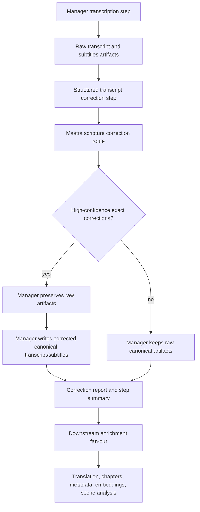
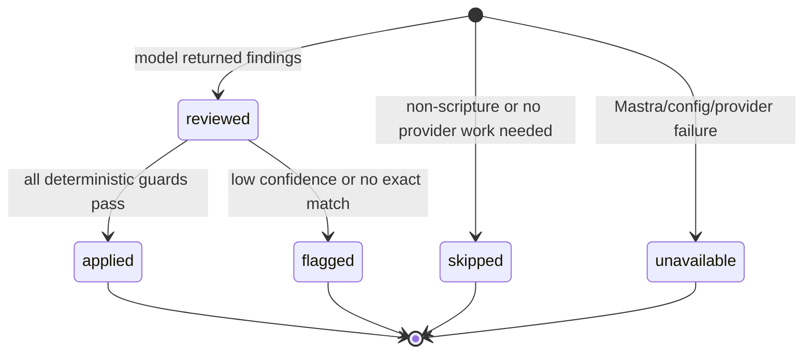

# feat: Add source transcript scripture correction

## Summary

Add a source-transcript scripture correction pass after transcription and before downstream enrichment. For high-confidence Bible-story ASR drift, the workflow should autocorrect canonical transcript/subtitle artifacts, preserve raw artifacts, and write a highlighted correction report so reviewers can audit what changed.

---

## Problem Frame

The existing subtitle scripture validation work checks translated subtitle artifacts after Mastra subtitle enrichment. It does not inspect source transcription artifacts, and same-language/source outputs are skipped by the translation validator. That leaves raw ASR mistakes such as `Son, the demon!` in a blind-man healing story unflagged before translation, metadata, chapters, embeddings, scene analysis, and Mux sync consume the transcript.

This plan fills that gap without turning source correction into a hidden rewrite. Mastra owns scripture/story detection and correction judgment; Manager owns workflow ordering, source artifact persistence, job state, review display, and downstream fan-out.

---

## Requirements

**Correction Behavior**

- R1. The workflow must run a source-transcript scripture correction check after transcription and before translation, chapters, metadata, embeddings, and scene analysis use transcript text.
- R2. The correction check must target likely Bible-story or scripture-referenced content, including cases inferred from title, label, Bible references, or source transcript text.
- R3. High-confidence ASR drift in scripture phrases, names, or story-critical statements must be eligible for automatic correction when the original text can be matched exactly inside a segment.
- R4. Low-confidence, broad, or non-exact suggestions must be flagged in the report but must not mutate canonical transcript or subtitle artifacts.
- R5. The corrected canonical `transcript` and `subtitles` artifacts must preserve timing and segment count unless a later plan explicitly adds retiming/splitting.

**Auditability And Highlighting**

- R6. When canonical source artifacts change, raw pre-correction artifacts must remain downloadable for comparison.
- R7. A correction report artifact must document every applied and flagged finding with segment index, time range, original text, corrected text when present, likely reference, confidence, basis, and a short reviewer-facing rationale.
- R8. Manager job details must highlight applied correction counts and needs-review counts on the transcription or structured-transcript step.
- R9. Review context refresh must include correction artifacts and correction step details so the review player can refresh when a correction report appears or changes.

**Compatibility And Safety**

- R10. If Mastra correction is unavailable, unconfigured, or fails, transcription must remain completed with the raw transcript and a visible unavailable/skipped correction summary.
- R11. Existing translation validation must continue to run on translated target subtitles; this source correction pass must not replace per-target subtitle scripture validation.
- R12. Transcription reruns must prune stale raw, corrected, and correction-report artifacts before relaunching enrichment.
- R13. Logs and durable artifacts must not include provider keys, raw prompts, hidden model reasoning, or full external Bible passage text.

---

## Acceptance Examples

- AE1. Given an English Mux transcript for the blind-man healing story with `Son, the demon! Have mercy on me!`, when source correction runs with high confidence for the likely `Son of David` phrase, then the canonical transcript/subtitles use `Son of David`, raw artifacts remain available, and the correction report highlights the changed segment.
- AE2. Given the same story with post-healing `I can't see!` where context makes `I can see!` a high-confidence ASR correction, then the canonical source artifacts are corrected before metadata, chapters, embeddings, translation, and scene analysis run.
- AE3. Given a phrase that looks suspicious but has no strong Bible-story context or exact text match, then Manager preserves the raw canonical artifacts and writes a flagged finding rather than applying a correction.
- AE4. Given Mastra correction config is missing or the correction route fails, then the workflow continues from raw transcription and surfaces the correction pass as unavailable instead of failing the enrichment job.
- AE5. Given an operator reruns transcription with Mux or ElevenLabs, then stale transcript correction artifacts and summaries are removed before the new run starts.

---

## Scope Boundaries

In scope:

- Source transcript scripture correction for Manager enrichment jobs.
- A Mastra-owned correction judgment route using model knowledge by default and optional existing Bible-source support when configured.
- Manager-side deterministic application of approved corrections to canonical transcript/subtitle artifacts.
- Raw artifact preservation, correction report artifacts, job-step summaries, artifact labels, review-context refresh, and rerun cleanup.

Out of scope:

- Editing human-authored source subtitles or canonical Core/Admin source data.
- Changing Mux text tracks directly for source-language generated subtitles.
- Retiming, merging, or splitting source transcript segments.
- Building a full transcript diff editor or human approval queue.
- Blocking job completion when source correction is unavailable.
- Replacing translated subtitle scripture validation.

### Deferred to Follow-Up Work

- A reviewer UI that renders inline transcript diffs beyond the downloadable correction report.
- Human approval before applying corrections when product policy requires editorial sign-off.
- Corpus-level evaluation for transcription QA across a representative production asset set.

---

## High-Level Technical Design

---

## Key Technical Decisions

- KTD1. **Autocorrect only after deterministic guards:** The model may identify likely scripture drift, but Manager should apply changes only when confidence is high and the reported original text exactly matches one source segment.
- KTD2. **Preserve raw artifacts before rewriting canonical artifacts:** Downstream systems need the corrected `transcript` and `subtitles` keys, while reviewers need the untouched ASR output for audit.
- KTD3. **Use the existing `structured_transcript` step:** The step already exists in the workflow vocabulary and fits a post-transcription normalization/correction pass without adding another workflow-state enum.
- KTD4. **Keep scripture judgment in Mastra, artifact mutation in Manager:** Mastra owns model prompts, scripture context, and Bible-source access; Manager owns source artifact persistence and job state.
- KTD5. **Make unavailable non-blocking:** A missing correction pass should not make transcription worse than today, so the workflow continues with raw artifacts and visible status.
- KTD6. **Do not change segment timing in this slice:** Correcting text only keeps downstream timing stable and avoids inventing a source retiming product.

---

## Implementation Units

### U1. Roadmap, Vocabulary, And Correction Contract

**Goal:** Create the tracked feature and define the source correction contract independently from translated subtitle validation.

**Requirements:** R1, R3, R4, R6, R7, R10, R11

**Dependencies:** None

**Files:**

- Create: `docs/roadmap/media-generation/feat-194-source-transcript-scripture-correction.md`
- Modify: `docs/roadmap/README.md`
- Modify: `docs/roadmap/media-generation/feat-193-subtitle-scripture-accuracy-validation.md`
- Modify: `CONCEPTS.md`
- Create: `apps/mastra/src/services/subtitle-enrichment/transcript-correction-types.ts`
- Create: `apps/mastra/src/services/subtitle-enrichment/transcript-correction-types.test.ts`
- Create: `apps/manager/src/lib/transcript-scripture-correction.ts`
- Create: `apps/manager/src/lib/transcript-scripture-correction.test.ts`

**Approach:** Define a correction-specific schema rather than overloading translated subtitle validation types. The contract should include verdict/status, basis, applied count, flagged count, unavailable/skipped reason, and bounded findings with segment indexes, timestamps, original text, corrected text, confidence, category, and likely reference.

**Patterns to follow:** `apps/mastra/src/services/subtitle-enrichment/types.ts`; `apps/manager/src/lib/subtitle-validation.ts`; roadmap dependency rules in `AGENTS.md`.

**Test scenarios:**

- Happy path: a correction result with one applied finding parses in Mastra and Manager shared schemas.
- Edge case: a result with no corrections and a skipped reason parses without findings.
- Error path: malformed findings with missing segment indexes or overlong evidence are rejected.
- Compatibility: translated subtitle validation summaries continue to parse unchanged.

**Verification:** The contract can represent applied, flagged, skipped, and unavailable source correction outcomes without changing translated subtitle validation result shapes.

### U2. Mastra Source Transcript Scripture Correction

**Goal:** Add Mastra logic and a protected route that evaluates source transcript segments and returns bounded correction findings.

**Requirements:** R2, R3, R4, R7, R10, R13

**Dependencies:** U1

**Files:**

- Create: `apps/mastra/src/services/subtitle-enrichment/transcript-correction.ts`
- Create: `apps/mastra/src/services/subtitle-enrichment/transcript-correction.test.ts`
- Create: `apps/mastra/src/mastra/workflows/transcript-scripture-correction.ts`
- Create: `apps/mastra/src/mastra/workflows/transcript-scripture-correction.test.ts`
- Modify: `apps/mastra/src/mastra/index.ts`
- Modify: `apps/mastra/src/services/subtitle-enrichment/scripture-context.ts`
- Modify: `apps/mastra/src/services/subtitle-enrichment/bible-source.ts`
- Modify: `apps/mastra/src/config/env.ts`
- Modify: `apps/mastra/AGENTS.md`
- Modify: `apps/mastra/CLAUDE.md`

**Approach:** Reuse the existing scripture-context detector and optional Bible-source lookup where possible, but prompt for source transcription accuracy instead of translated subtitle accuracy. The model output should be a correction plan, not an applied artifact: likely references, basis, confidence, and findings categorized as applied-candidate or flag-only. The route should be service-bearer protected like `/forge-subtitle-enrichment`.

**Patterns to follow:** `apps/mastra/src/mastra/workflows/subtitle-enrichment.ts`; `apps/mastra/src/services/subtitle-enrichment/scripture-validation.ts`; service route registration in `apps/mastra/src/mastra/index.ts`.

**Test scenarios:**

- Happy path: the blind-man sample with `Son, the demon!` returns a high-confidence correction candidate for `Son of David`.
- Happy path: a post-healing `I can't see!` line returns a high-confidence correction candidate only when the surrounding story context supports `I can see!`.
- Edge case: a suspicious phrase in `christian_general` content returns a flagged finding, not an applied candidate.
- Error path: model/provider failure returns an unavailable result that Manager can surface without failing transcription.
- Security: the service route rejects missing or invalid bearer auth before parsing or launching work.
- Safety: prompts and artifacts never include hidden model reasoning or full provider passage text.

**Verification:** Mastra tests prove source correction is route-protected, bounded, scripture-aware, and non-blocking when providers fail.

### U3. Manager Mastra Launcher And Deterministic Application

**Goal:** Add a Manager service client and deterministic correction applier that turns approved Mastra findings into corrected transcript segments.

**Requirements:** R1, R3, R4, R5, R10, R13

**Dependencies:** U1, U2

**Files:**

- Create: `apps/manager/src/services/mastra-transcript-scripture-correction.ts`
- Create: `apps/manager/src/services/mastra-transcript-scripture-correction.test.ts`
- Create: `apps/manager/src/services/transcript-scripture-correction.ts`
- Create: `apps/manager/src/services/transcript-scripture-correction.test.ts`
- Modify: `apps/manager/src/config/env.ts`
- Modify: `apps/manager/AGENTS.md`
- Modify: `apps/manager/CLAUDE.md`

**Approach:** The launcher posts source language, bounded transcript text/segments, provider provenance, and optional video context to Mastra. The deterministic applier should only replace exact text inside the reported segment, preserve start/end timing, preserve segment count, and downgrade suggestions to flag-only when confidence, exact-match, or length-change guards fail.

**Patterns to follow:** `apps/manager/src/services/mastra-subtitle-enrichment.ts`; `apps/manager/src/services/mastra-transcript-embeddings.ts`; `apps/manager/src/lib/vtt.ts`.

**Test scenarios:**

- Happy path: a valid Mastra response with one exact high-confidence correction produces corrected segments and an applied summary.
- Edge case: an original-text mismatch leaves the segment unchanged and records a flag-only finding.
- Edge case: a correction that would change timing or segment count is not applied.
- Error path: missing Mastra config returns `config_missing` and leaves raw transcript usable.
- Error path: network failure returns retryable service failure without throwing provider keys or transcript content into logs.

**Verification:** Manager can call the new Mastra route safely and apply corrections deterministically without trusting free-form model text.

### U4. Workflow Integration And Artifact Persistence

**Goal:** Insert source correction after transcription and before downstream fan-out, then persist raw, corrected, and report artifacts coherently.

**Requirements:** R1, R5, R6, R7, R8, R10, R11

**Dependencies:** U1, U2, U3

**Files:**

- Modify: `apps/manager/src/workflows/videoEnrichment.ts`
- Modify: `apps/manager/src/workflows/videoEnrichment.test.ts`
- Modify: `apps/manager/src/services/transcription.ts`
- Modify: `apps/manager/src/services/transcription.test.ts`
- Test: `apps/manager/src/workflows/videoEnrichment.test.ts`
- Test: `apps/manager/src/services/transcription.test.ts`

**Approach:** After `stepTranscribe`, run `structured_transcript` as a correction step. If corrections are applied, write `transcript-raw` and `subtitles-raw`, then overwrite canonical `transcript` and `subtitles` with corrected text while returning the corrected text/segments to the workflow. Always write a `transcript-correction-report` artifact when correction is attempted, including unavailable and flag-only outcomes. Downstream translation, chapters, metadata, embeddings, and scene analysis should use the corrected in-memory result.

**Patterns to follow:** Transcription artifact writing in `apps/manager/src/services/transcription.ts`; workflow step isolation in `apps/manager/src/workflows/videoEnrichment.ts`; artifact manifest merging in `buildDownloadableArtifactManifest`.

**Test scenarios:**

- Happy path: applied corrections cause downstream translation, chapters, metadata, embeddings, and scene analysis inputs to use corrected transcript text.
- Happy path: corrected canonical `transcript` and `subtitles` are written after raw artifact snapshots.
- Edge case: no corrections leaves canonical artifacts unchanged and marks `structured_transcript` skipped or completed with zero applied changes.
- Error path: correction unavailable keeps transcription completed and downstream steps running from raw transcript.
- Integration: artifact manifest contains raw artifacts and correction report only when appropriate.

**Verification:** Workflow tests demonstrate that the fan-out boundary receives one coherent transcript object and that artifact persistence matches the step summary.

### U5. Operator Highlighting, Review Context, And Rerun Cleanup

**Goal:** Surface correction highlights in Manager and prevent stale correction artifacts after reruns.

**Requirements:** R8, R9, R12

**Dependencies:** U4

**Files:**

- Modify: `apps/manager/src/types/job.ts`
- Modify: `apps/manager/src/lib/job-artifacts.ts`
- Modify: `apps/manager/src/lib/job-artifacts.test.ts`
- Modify: `apps/manager/src/lib/state.ts`
- Modify: `apps/manager/src/lib/state.test.ts`
- Modify: `apps/manager/src/features/jobs/live-job-steps-table.tsx`
- Create: `apps/manager/src/features/jobs/live-job-steps-table.test.tsx`
- Modify: `apps/manager/src/features/jobs/review-player/review-player-types.ts`
- Modify: `apps/manager/src/features/jobs/review-player/load-job-review-context.ts`
- Modify: `apps/manager/src/features/jobs/review-player/load-job-review-context.test.ts`
- Modify: `apps/manager/src/features/jobs/review-player/review-context-refresh-key.ts`
- Modify: `apps/manager/src/features/jobs/review-player/review-context-refresh-key.test.ts`
- Modify: `apps/manager/src/app/api/jobs/[id]/transcription/rerun/route.ts`
- Modify: `apps/manager/src/app/api/jobs/[id]/transcription/rerun/route.test.ts`

**Approach:** Add a `transcriptCorrection` step-detail summary with applied count, flagged count, basis, confidence, and unavailable/skipped reason. Extend artifact descriptors and labels for `transcript-raw`, `subtitles-raw`, and `transcript-correction-report`. The live steps table should show a compact highlight such as applied/needs-review counts without embedding the full diff. Review context should expose report artifact links and refresh when correction artifacts or details change. Rerun cleanup should remove stale correction artifacts alongside downstream derived artifacts.

**Patterns to follow:** Existing subtitle validation summary display in `apps/manager/src/features/jobs/live-job-steps-table.tsx`; review context validation domain in `apps/manager/src/features/jobs/review-player/load-job-review-context.ts`; rerun pruning for `subtitle-validation-*`.

**Test scenarios:**

- Happy path: transcription/structured-transcript step renders applied correction and needs-review counts.
- Happy path: job artifact links include raw transcript, raw subtitles, and correction report with human-readable labels.
- Integration: review context includes correction artifact metadata and refresh key changes when a correction report appears.
- Rerun: transcription rerun removes raw/corrected correction artifacts and old step details before relaunch.
- Edge case: unavailable correction summary renders as unavailable rather than a content warning.

**Verification:** Manager UI, state, artifact, review-context, and rerun tests prove correction highlights are visible and stale correction evidence cannot survive a new transcription run.

---

## System-Wide Impact

This change moves transcript quality correction earlier than all source-transcript consumers. That is intentional: corrected source artifacts should feed translation, chapters, metadata, transcript embeddings, and scene analysis so downstream generated artifacts do not preserve obvious scripture ASR drift.

The main compatibility rule is artifact identity. Existing consumers keep reading `transcript` and `subtitles`; the new raw and report artifacts provide auditability rather than replacing canonical artifact keys.

---

## Risks & Dependencies

- **False positive autocorrection:** Mitigate with high confidence thresholds, exact substring matching, no timing edits, raw artifact preservation, and report highlighting.
- **Provider or model unavailability:** Treat correction as non-blocking and surface unavailable status so the pipeline is no worse than current behavior.
- **Large transcript payloads:** Keep correction input bounded and avoid making long production smoke tests the only validation path; use focused fixtures plus a small real-asset smoke when implementation reaches deployment.
- **Artifact drift after rerun:** Prune correction artifacts and summaries whenever transcription reruns.
- **Bible-source licensing:** Do not store full external Bible passages in correction artifacts unless the configured provider license permits it.

---

## Sources & Research

- `docs/plans/2026-06-16-002-feat-subtitle-scripture-accuracy-validation-plan.md` establishes that translated subtitle validation intentionally excludes source transcription.
- `apps/manager/src/services/transcription.ts` writes canonical `transcript` and `subtitles` artifacts immediately after provider transcription.
- `apps/manager/src/workflows/videoEnrichment.ts` fans out translation, chapters, metadata, embeddings, and scene analysis from the transcription result.
- `apps/mastra/src/services/subtitle-enrichment/scripture-context.ts` and `apps/mastra/src/services/subtitle-enrichment/scripture-validation.ts` provide the closest existing scripture-aware structured-output patterns.
- `apps/manager/src/features/jobs/review-player/load-job-review-context.ts` and `apps/manager/src/features/jobs/review-player/review-context-refresh-key.ts` show the existing review-context pattern for validation artifacts.
- `docs/roadmap/media-generation/feat-048-production-transcription-qa-and-prompt-tuning.md` frames transcript quality as a known media-generation concern.
