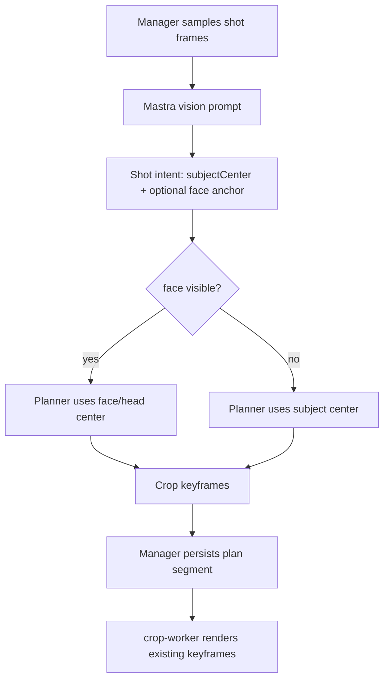

# Smart Crop face-first speaker anchoring

## Summary

Make Smart Crop anchor `speaker` and visible-person shots on the visible face/head rather than the torso when a face is present. This keeps the existing Manager-orchestrates, Mastra-decides, crop-worker-renders split while improving crop placement for shots where the current generic subject center can cut off a speaker's face.

---

## Problem Frame

Smart Crop currently asks Mastra's vision model for one generic `subjectCenter` per shot. The deterministic planner turns that point into horizontal 9:16 crop keyframes. In speaker shots, the model can choose a body or torso center even when a face is visible, which can leave the face near or beyond the crop edge while preserving empty background.

---

## Requirements

### Face anchoring

- R1. For `speaker` and person-focused shots with a visible face, Smart Crop must calculate crop keyframes from the face/head center instead of the body center.
- R2. When no face is visible or the model cannot identify one with confidence, Smart Crop must preserve the current `subjectCenter` fallback behavior.
- R3. Initial plan and repair plan prompts must both instruct the vision model to prefer face/head anchors for visible people.

### Compatibility

- R4. The crop-worker render contract must remain unchanged because it consumes final crop keyframes, not semantic subject anchors.
- R5. Existing Smart Crop plan artifacts without face-anchor fields must continue to parse and render.
- R6. Manager must not import Mastra code or make AI crop decisions; it may only accept additive plan metadata and persist Mastra-computed keyframes.

### Verification

- R7. Unit coverage must prove that visible-face intents produce right/left-adjusted crop keyframes that keep the face centered, and face-absent intents keep the current subject-center behavior.
- R8. Repair coverage must prove that face-aware repair output validates exactly like initial plan output and can replace affected shot segments without changing unaffected shots.

---

## Key Technical Decisions

- **Additive face anchor contract:** Extend Mastra's shot-intent JSON with optional face visibility and face-center fields while keeping `subjectCenter` required for backwards-compatible fallback and model clarity.
- **Planner chooses the anchor:** Keep the deterministic decision in `intentToKeyframes`: use face center only when the intent says a face is visible and both start/end face centers are valid; otherwise use `subjectCenter`.
- **Prompt and schema change instead of crop-worker change:** crop-worker should remain semantic-free. It already renders whatever `cropKeyframes` Mastra produces.
- **Repair uses the same anchoring rule:** Repair prompts must tell the model to move the crop to preserve visible faces/heads. The repair route should return replacement segments that have already run through the same face-aware planner.
- **Plan metadata remains optional:** If face anchor details are persisted on segments for debugging, Manager parsers must treat them as optional and old artifacts must remain valid.

---

## High-Level Technical Design

The only semantic change is before keyframe generation. Once Mastra emits `cropKeyframes`, Manager and crop-worker follow the existing artifact and render paths.

---

## Implementation Units

### U1. Face-aware intent schema and prompts

- **Goal:** Teach the initial Smart Crop plan and repair model contracts to report visible-face anchoring separately from generic subject anchoring.
- **Requirements:** R1, R2, R3, R5.
- **Dependencies:** None.
- **Files:** `apps/mastra/src/services/smart-crop/openrouter-vision.ts`, `apps/mastra/src/mastra/workflows/smart-crop-plan.ts`, `apps/mastra/src/mastra/workflows/smart-crop-repair.ts`, `apps/mastra/src/mastra/workflows/smart-crop-plan.test.ts`, `apps/mastra/src/mastra/workflows/smart-crop-repair.test.ts`.
- **Approach:** Extend the local Zod response schema with `faceVisible` and optional `faceCenter` for start/end normalized points. Update both plan and repair instructions so visible people use the face/head center as the crop anchor, not the torso, while still returning `subjectCenter` for fallback. Keep the response schema strict for known fields once the contract is updated.
- **Patterns to follow:** Existing `ShotIntentSchema`, `SHOT_INTENTS_RESPONSE_SCHEMA`, and repair validation that requires every requested `shotId` exactly once.
- **Test scenarios:** A plan response with `faceVisible: true` and `faceCenter` parses successfully; a response with `faceVisible: false` and no `faceCenter` parses successfully; malformed face-center coordinates are rejected; repair responses follow the same rules; responses with missing or extra shot ids still fail.
- **Verification:** Mastra Smart Crop plan and repair tests cover the new fields without changing service route auth or failure envelopes.

### U2. Face-first deterministic planner

- **Goal:** Convert face-aware intents into crop keyframes using the face/head center when available and the current subject center otherwise.
- **Requirements:** R1, R2, R4, R7.
- **Dependencies:** U1.
- **Files:** `apps/mastra/src/services/smart-crop/planner.ts`, `apps/mastra/src/services/smart-crop/planner.test.ts`.
- **Approach:** Add an anchor-selection helper inside the planner. The helper returns face start/end centers only when `faceVisible` is true and `faceCenter` is present; otherwise it returns `subjectCenter`. Leave the crop window, confidence fallback, dead zone, pan-speed cap, `slide_aware` centered behavior, and final keyframe format unchanged.
- **Patterns to follow:** Existing `xForSubjectCenter`, confidence fallback, dead-zone, and pan-speed tests.
- **Test scenarios:** A visible face at `cx=0.8` produces a crop shifted right even when body `subjectCenter.cx` is centered; visible face start/end centers produce animated keyframes; `faceVisible: false` uses `subjectCenter`; missing `faceCenter` uses `subjectCenter`; low confidence still falls back to centered crop; `slide_aware` still uses static centered crop.
- **Verification:** Planner tests prove the face-first branch and every fallback branch.

### U3. Manager additive metadata tolerance

- **Goal:** Keep Manager compatible with optional face-anchor plan metadata while preserving legacy artifacts.
- **Requirements:** R5, R6.
- **Dependencies:** U1, U2.
- **Files:** `apps/manager/src/services/mastra-smart-crop.ts`, `apps/manager/src/services/smartCrop.ts`, `apps/manager/src/services/mastra-smart-crop.test.ts`, `apps/manager/src/services/smartCrop.test.ts`.
- **Approach:** If Mastra plan segments expose face-anchor metadata for operator debugging, thread the fields as optional plan-segment properties and keep duck-typed parsers tolerant. Do not make Manager recompute crop `x` positions. If implementation keeps face fields internal to Mastra and only emits keyframes, this unit reduces to type/parser no-op verification.
- **Patterns to follow:** Existing optional `primarySubject`, `secondarySubjects`, and `avoidCutting` handling.
- **Test scenarios:** Manager accepts current plan segments with no face fields; Manager accepts plan segments with optional face-anchor metadata if emitted; parsed crop keyframes remain the source of truth; old artifacts continue to summarize and render.
- **Verification:** Manager service tests show additive compatibility and no cross-app imports.

### U4. Real-shot repair validation and documentation

- **Goal:** Cover the screenshot-shaped failure mode and document the face-first Smart Crop rule for future operators and agents.
- **Requirements:** R3, R7, R8.
- **Dependencies:** U1, U2, U3.
- **Files:** `apps/mastra/src/services/smart-crop/openrouter-vision.ts`, `apps/mastra/src/services/smart-crop/planner.test.ts`, `apps/manager/CLAUDE.md`, `apps/mastra/CLAUDE.md`, `docs/roadmap/media-generation/feat-173-smart-crop-video-reframing.md`.
- **Approach:** Add a regression fixture or test case equivalent to a speaker whose body is partly centered but whose visible face is near the right side of the frame. Document that Smart Crop anchors on visible faces for people-first shots and falls back to the full subject only when face anchoring is unavailable.
- **Patterns to follow:** Existing package guide env/contract notes and the feat-173 roadmap entry-point style.
- **Test scenarios:** Given a speaker intent with body center near `0.5` and face center near `0.75`, the keyframes track the face center; given a repair intent for a "face cut off" issue, replacement segments use face-aware anchoring; documentation mentions that crop-worker remains unchanged.
- **Verification:** Focused Mastra tests pass and package docs describe the new anchoring rule without changing artifact key literals.

---

## Scope Boundaries

- This plan does not add a deterministic face detector or new media-analysis dependency.
- This plan does not add manual crop editing, drag handles, or operator-authored keyframes.
- This plan does not change scene detection sensitivity, shot segmentation, timeline alignment gates, or crop-worker rendering.
- This plan does not change the 9:16-only, horizontal-pan MVP rule.

### Deferred to Follow-Up Work

- Add deterministic face detection on sampled frames if prompt/schema anchoring remains too inconsistent for production review.
- Expose face-anchor debug overlays in the Manager UI if operators need to compare face center, body center, and final crop box.

---

## Risks & Dependencies

- **Provider compliance risk:** Vision models may omit or misplace face anchors. Mitigation: strict schema validation plus fallback to `subjectCenter` when face anchor data is absent.
- **Over-tight face framing:** Centering only on a face can crop hands, objects, or text in some shots. Mitigation: keep `avoidCutting`, mode, confidence fallback, dead zone, and QA/repair loop in place.
- **Schema drift across apps:** Mastra and Manager carry local copies of plan segment shapes. Mitigation: keep face metadata optional and preserve crop keyframes as the render contract.
- **Repair inconsistency:** Initial plan and repair could use different anchoring rules. Mitigation: route both through the same `intentToKeyframes` helper and update both prompts.

---

## Acceptance Examples

- AE1. Given a speaker shot where the person's torso is centered but the visible face is near the right crop edge, when Mastra returns a visible face center, then the generated crop keyframes shift right to keep the face/head inside the 9:16 crop.
- AE2. Given a person shot with no visible face, when Mastra returns no face center, then Smart Crop uses the existing subject-center keyframe behavior.
- AE3. Given an old plan artifact without face-anchor fields, when Manager parses it, then the job detail page and crop-worker render path still use its existing crop keyframes.
- AE4. Given a repair issue describing a cut-off face, when Mastra returns replacement intent for the affected shot, then the replacement segment is generated with the same face-first planner rule and Manager replaces only that shot.

---

## Verification

- `pnpm --filter @forge/mastra test -- planner.test.ts smart-crop-plan.test.ts smart-crop-repair.test.ts`
- `pnpm --filter @forge/mastra typecheck`
- `pnpm --filter @forge/mastra lint`
- `pnpm --filter @forge/manager test -- mastra-smart-crop.test.ts smartCrop.test.ts`
- `pnpm --filter @forge/manager typecheck`
- `pnpm --filter @forge/manager lint`
- Browser smoke against an existing Smart Crop job or mock artifact where the original speaker crop box should shift toward the face after a force rerun.

---

## Sources / Research

- `docs/roadmap/media-generation/feat-173-smart-crop-video-reframing.md` defines Smart Crop ownership and active entry points.
- `docs/plans/2026-06-09-002-feat-smart-crop-plan.md` defines the current plan/fingerprint/render artifacts and the horizontal-only MVP crop rule.
- `docs/plans/2026-06-16-003-feat-smart-crop-repair-loop-plan.md` defines the repair loop and attempt artifacts that must use the same anchoring semantics.
- `docs/solutions/architecture-patterns/smart-crop-three-app-decomposition-20260610.md` preserves the Manager/Mastra/crop-worker boundary.
- `apps/mastra/src/services/smart-crop/openrouter-vision.ts` owns the current `subjectCenter` prompt and response schema.
- `apps/mastra/src/services/smart-crop/planner.ts` owns deterministic normalized-anchor-to-keyframe math.
- `apps/crop-worker/src/render.ts` confirms crop-worker renders existing keyframes and should not receive semantic face data.
