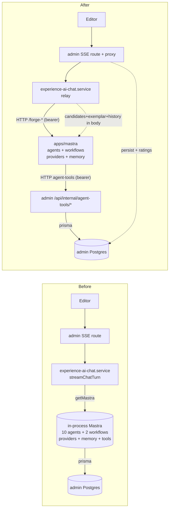

# feat: Consolidate admin's in-process Mastra into the standalone apps/mastra service

## Summary

Move the AI experience **draft-authoring** and **chat** Mastra agents + workflows out of the in-process `apps/admin/src/mastra` singleton and into the standalone `@forge/mastra` Railway service, reached over authenticated HTTP. Admin becomes a thin caller/proxy that keeps owning candidate retrieval, exemplar selection, draft re-validation, persistence, ABAC, chat history, and 👍/👎 ratings; `apps/mastra` becomes the LLM/agent generator. The work is phased behind feature flags (foundation → one-shot buffered draft → streaming chat → cutover/cleanup) so each leg can ship and roll back independently. This plan is grounded in a verification pass against `main` (see Context & Research) that corrected a stale-branch handoff.

---

## Problem Frame

Today the draft/chat agents run **in-process** inside the Next.js admin app via a lazy Mastra singleton (`apps/admin/src/mastra/index.ts`, `getMastra()`). This bolts a heavy AI-SDK + provider + `@mastra/core` + `@mastra/memory` dependency surface onto admin's request process, and means draft authoring has no independent deploy/scale/observability boundary. Every _other_ AI workflow (transcript/scene/experience embeddings, eval, smart-crop, firecrawl, subtitles) already lives in the standalone `apps/mastra` service behind authenticated `/forge-*` routes — draft-authoring is the last in-process holdout. The user's intent: **the Mastra code in the admin folder should live in the shared `apps/mastra` service.**

Three structural hard parts make this more than a file move:

1. The chat path must **stream** tokens to the editor; no existing `/forge-*` route streams (all buffer), and the live chat path uses `generate()` today, so streaming is a _new_ capability, not a port.
2. The chat agent's three tools read admin Postgres **in-process**; `apps/mastra` is forbidden from importing admin or touching admin Postgres (`apps/mastra/CLAUDE.md`), so the tools must be re-homed to HTTP callbacks.
3. The 👍/👎 rating scores are stored in admin and keyed to admin-persisted chat-message rows, so ratings (and a minimal Mastra storage handle) **stay** in admin even after the agent moves.

---

## Requirements

- R1. The draft-authoring + chat agents and the `multi-step-draft` / `quick-draft` workflows execute in `apps/mastra`, invoked by admin over authenticated HTTP — not via in-process `getMastra()`.
- R2. `apps/mastra` never imports from `apps/admin` (or `apps/manager`/`apps/auth`); every admin data dependency crosses as an HTTP payload validated by local/shared Zod.
- R3. The LLM draft-generation contract (`DraftExperienceSchema` + `SkeletonSchema` + per-type fill schemas + JSON extraction/coercion) is **single-sourced** so the generator (`apps/mastra`) and admin's re-validator cannot drift.
- R4. Admin retains ownership of: video-candidate retrieval, exemplar selection, draft re-validation/normalization, persistence + ContentRevision + ABAC, chat-history reads, and the 👍/👎 rating store.
- R5. The one-shot draft path cuts over behind a runtime flag with the in-process path as fallback; the buffered trigger mirrors the existing embedding two-leg contract.
- R6. The streaming chat path cuts over behind an independent flag; admin relays the upstream stream to the editor SSE channel; a closed editor tab cancels the upstream agent run; a remote timeout classifies as `timeout` (not a generic retryable network error).
- R7. The three agent tools become bearer-gated admin endpoints with all load-bearing filters enforced **server-side**: search playability (`playbackId !== null`), `contentTypes:["video"]`, field trim + limit caps; bible OR-match + locale-fallback `displayName`; image `VARIANT_PRIORITY`.
- R8. Every new cross-service env var is `.optional()`; the receiver's key is deployed before the caller's var (keyring-first); any new admin **receiver** CSV is added to `assertBearerCsvsDisjoint` in all required places.
- R9. After cutover, admin sheds the moved agents/workflows/providers/tools; the two divergent `ChatStreamEvent` declarations are reconciled to one admin-owned union; the dead `streaming-bridge.ts` is removed.
- R10. The chat-turn hardening present on main (90s `chatTurn` budget, `maxSteps` cap, post-`generate()` abort-resolves-empty guard) is preserved in the ported service; admin's outbound caller budget stays strictly larger than mastra's internal budget.

**Origin actors:** AI experience editor (admin user with `write:experiences`); admin SSR/server-action layer (caller); `apps/mastra` service (generator); operator (deploys keys, runs smokes).
**Origin flows:** F1 one-shot "Generate full page"/"Quick draft"; F2 streaming chat turn ("Send"); F3 👍/👎 rating; F4 mid-chat tool calls (video search / bible lookup / image fetch).

---

## Scope Boundaries

**MOVE → `apps/mastra`:** the chat + draft agents and `multi-step-draft`/`quick-draft` workflows; chat-model providers (`providers.ts`) + `gateway-constants.ts`; chat `Memory` primitive (rebuilt, not copied); prompts; `budgets.ts` (shared-dup); the 3 tools (rewritten as HTTP callbacks); the chat-provider env block.

**EXTRACT → shared package `@forge/experience-schema`:** `experience-ai.schemas.ts`, `extract-json-object.ts`, `coerce-draft.ts` (all pure-zod). Consumed by both admin and `apps/mastra`.

**STAY in `apps/admin` (data-ownership / authority):** video-candidate retrieval (`loadExperienceAiVideoCandidates`); exemplar selection (`selectExperienceExemplar` + `experience-ai-exemplar*`) — needs admin pgvector + embeddings; draft normalize/re-validate (`normalizeExperienceDraft` + `@/domain/blocks` `BlocksSchema`); persistence + ABAC (`ExperienceService.applyChatMutation`); chat-history reads + message persistence; the `chat-thumb-rating` scorer + the Mastra **scores** storage + the rating routes; editor SSE route + browser client + the admin-owned `ChatStreamEvent` contract; `mastra-studio-access.service.ts` (Studio auth, unrelated).

**DELETE:** `apps/admin/src/mastra/streaming-bridge.ts` and the dead 7-variant `apps/admin/src/mastra/chat-stream-event.ts` (reconcile to the live 4-variant union).

**Non-goals (this plan):**

- No change to the _behavior_ of generation (same prompts, same step chain plan→skeleton→fill→critique→revise, same schemas) — this is a relocation, not a redesign.
- No move of the embedding/eval/smart-crop/firecrawl workflows (already in `apps/mastra`).
- No change to the public consumer GraphQL surface or `apps/web`.

### Deferred to Follow-Up Work

- **Fully removing `apps/admin/src/mastra`**: admin must retain a _minimal_ Mastra handle for the scores store the rating routes use. Decoupling ratings from Mastra (a plain admin Prisma table) to delete the directory entirely is a separate follow-up.
- **Moving `auto-enrich` and the dormant `add-section` / `rewrite-copy` agents to a live trigger**: they are registered but have no live dispatch on main (see Key Technical Decisions). They come along as config, but wiring real callers is out of scope.
- **Streaming wire-format hardening choices** (raw `ReadableStream` vs `@mastra/ai-sdk`) are resolved at U9 implementation time after a thin Hono/Railway SSE smoke (see Open Questions).

---

## Context & Research

### Branch reconciliation (why this plan is trustworthy)

The origin handoff was authored on `fix/budgets-test-chatturn-90s`. An initial verification pass ran against the previous working branch `fix/ai-video-candidates-playability`, which was **82 commits behind main** and lacked repair, exemplar, the 90s budget, `maxSteps`, the abort guard, and `coerce-draft.ts`. **This plan is based on `main`** (worktree `feat/mastra-standalone-consolidation`, base `0e5e9fa6`), and a second verification pass confirmed main matches the handoff. Net corrections folded in below:

- **10 agents** registered on main (`apps/admin/src/mastra/index.ts:92-105`): `experience-default-chat`, `draft-experience`, `add-section`, `rewrite-copy`, `experience-planner`, `experience-critic`, `experience-reviser`, `experience-skeleton`, `experience-fill`, `auto-enrich` — plus 2 workflows. (Not "9"; not the stale branch's 8.)
- Workflow is the **two-phase** chain `plan → skeleton → fill → critique → revise` (`multi-step-draft-workflow.ts`); `quick-draft` omits revise. `exemplar: z.string().optional()` is in the input schema (`multi-step-draft-workflow.ts:118`).
- `chatTurn = 90_000`, `STEP_CAPS.toolCallingTurn = 8`, `multiStepDraft = 5` (`budgets.ts:100-128`). The chat service **wires** `maxSteps` (`experience-ai-chat.service.ts:192`) and has the **post-`generate()` abort guard** (`:205`, `:216`) — main is the correct, non-buggy state.
- `experience-ai.schemas.ts` imports **only zod** and exports `DraftExperienceSchema`, `SkeletonSchema`, `validateSkeleton`, `getFillSchemaForType`, `FILL_SCHEMAS_BY_TYPE`, `GENERATION_MIN_BLOCKS`, `VideoCandidate`, `buildDraftExperienceJsonSchema`. `extract-json-object.ts` (zero imports) and `coerce-draft.ts` (zod + relative `./experience-ai.schemas`) are also pure → clean shared package.
- `repair-draft.ts` exists: `REPAIR_AGENT_ID = "experience-reviser"`, `REPAIR_CALL_TIMEOUT_MS = 30_000`, runs via an injected `mastra.getAgentById(...)`; imports normalize + coerce-draft + extract-json-object + `@mastra/core` type only (no prisma).
- `experience-ai-exemplar.service.ts` needs admin embeddings (`generateExperienceEmbedding`) + pgvector (`$queryRaw`, `toPgVector`) → **stays admin**; the action already computes the exemplar string and ships it via `inputData.exemplar` (`generate-draft-action.ts:448-495`), degrading to no-exemplar on any failure.
- `AI_GATEWAY_CONSTRAINED_DECODING_TRUSTED`, `EXPERIENCE_AI_MAX_REPAIR_ATTEMPTS`, `EXPERIENCE_EXEMPLAR_MAX_DISTANCE`, `EXPERIENCE_EXEMPLAR_FALLBACK_SLUG` all exist on main (`config/env.ts`), all `.optional()`.
- `BibleBook` at `apps/admin/prisma/schema.prisma:1065`; `VideoImage` at `:1369` (exactly the handoff's numbers).

### Relevant code and patterns

- **Live one-shot path:** `apps/admin/src/app/dashboard/experiences/generate-draft-action.ts` (`runGenerateDraftAction`, `normalizeWithRepair`) → `getMastra().getWorkflowById("multi-step-draft"|"quick-draft")`.
- **Live chat path:** `apps/admin/src/app/api/experience-chat/stream/route.ts` → `apps/admin/src/services/experience-ai/experience-ai-chat.service.ts` (`streamChatTurn` + `runMastraChat`, `getMastra().getAgentById("experience-default-chat").generate(...)`). Wired `ChatStreamEvent` = `token_delta | mutation_applied | error | done` (`:54`).
- **Contract template (admin → mastra trigger + mastra → admin ingest):** `apps/admin/src/services/mastra-experience-embedding-client.ts` (Leg-1 caller) and `apps/admin/src/app/api/internal/mastra/experience-embeddings/route.ts` (Leg-2 receiver). `apps/mastra/src/services/admin-embedding-ingest-client.ts` = discriminated `{ok}|{ok:false,reason,retryable}` HTTP-client envelope.
- **Closest analog for the new agent-tool endpoints:** `apps/admin/src/app/api/internal/search-eval/search/route.ts` (rate-limit → dedicated bearer → `HybridSearchService.search`; plain-string `[label] event=… key=value` logging).
- **`apps/mastra` service routes:** `apps/mastra/src/mastra/index.ts` (15 `registerApiRoute("/forge-*")` handlers, all buffered `new Response(JSON.stringify(...))`); `apps/mastra/src/server/service-bearer.ts` (`isValidServiceBearer` / `MASTRA_SERVICE_API_KEYS`, `timingSafeEqual`); `apps/mastra/src/client/service-client.ts` (smoke caller template).
- **Auth invariant:** `apps/admin/src/config/env.ts` — `BEARER_CSV_KEYS` (`:534-544`), `assertBearerCsvsDisjoint` (`:560-605`), boot call (`:611-621`); per-type ingest validators in `apps/admin/src/auth/mastra-ingest-bearer.ts`.
- **Existing private workspace-package convention:** `packages/watch-url-policy`, `packages/feature-flags` (`private:true`, `type:module`, `exports: { ".": "./src/index.ts" }`, vitest 3.2.4).

### Institutional learnings (must encode)

- `docs/solutions/platform/mastra-embedding-workflow-ownership-pattern.md` — **the direct precedent**: this exact "move generation to Mastra, keep storage/authority in Admin, contract is HTTP+Zod" split already shipped for embeddings. Mirror it.
- `docs/solutions/security-issues/ssrf-defense-streaming-proxy-and-codeql-fp-20260504.md` — admin's SSE proxy to mastra is an SSRF candidate: host allowlist, no credential bleed, no off-allowlist redirect-follow, per-call timeout; CodeQL `js/request-forgery` fires per-method and inline suppression is ignored under GitHub Default Setup.
- `docs/solutions/best-practices/outbound-timeout-shorter-than-caller-budget-20260506.md` — admin's fetch-to-mastra budget strictly below admin's route ceiling; classify remote timeout as `timeout`, not network error.
- `docs/solutions/platform/admin-manager-enrichment-trigger-endpoint-20260506.md` — receiver deploys keyring entry FIRST; verify `503 config_missing → 401 wrong-bearer` before flipping the caller.
- `docs/solutions/runtime-errors/required-env-var-without-default-broke-railway-deploy-20260511.md` — new vars `.optional()`.
- `docs/solutions/runtime-errors/railway-logsv2-silences-nextjs-stdout-runtime-20260518.md` — admin route logging in plain-string `[label] event=name key=value`, not `JSON.stringify`.
- `docs/solutions/best-practices/mocked-shape-vs-real-contract-discipline-20260506.md` — real-DB smoke for the re-homed tool endpoints (mocked tests only prove branch shape).
- `docs/solutions/integration-issues/mastra-studio-api-auth-guard.md` — scope the service-bearer guard to `/forge-*`; do not let it cover Studio's built-in `/api/workflows` or Studio 401s.
- `docs/solutions/workflow-issues/ce-code-review-tier-2-mandatory-before-push-20260511.md` — Tier-2 review mandatory before push (auth + new env + dependency manifests + >3 dirs).
- Smart-crop decomposition (`docs/solutions/architecture-patterns/smart-crop-three-app-decomposition-20260610.md`) — cite for deadline-chain + `FatalError` classification + config-failure-degrades-not-fails; **not** its poll-not-callback law (wrong shape for an interactive SSE stream).

---

## Key Technical Decisions

- **Shared schema package `@forge/experience-schema`, not a local dup.** The LLM generation contract must be byte-identical on both sides; a local dup would silently drift (the exact failure the producer-consumer / mocked-vs-real learnings warn against). Extraction is clean: 3 pure-zod files (`experience-ai.schemas.ts`, `extract-json-object.ts`, `coerce-draft.ts`) with no admin-runtime imports. `@/domain/blocks` `BlocksSchema` is **not** needed by the workflow (only by admin's normalize) and stays in admin. (Overrides the literal "local Zod schemas" wording in `apps/mastra/CLAUDE.md`, which targets per-service _wire_ schemas, not a shared _generation_ contract — call this out in the mastra CLAUDE.md update.)
- **Two auth directions, two mechanisms.** (a) admin → mastra triggers (one-shot draft + streaming chat) **reuse** the existing receiver CSV `MASTRA_SERVICE_API_KEYS` (mastra is receiver; admin adds caller vars `MASTRA_DRAFT_BASE_URL`/`MASTRA_DRAFT_API_KEY` or reuses `MASTRA_BASE_URL`/`MASTRA_SERVICE_API_KEY`). (b) mastra → admin agent-tool callbacks need a **new admin receiver CSV** `ADMIN_AGENT_TOOLS_API_KEYS` (different capability than ingest/workflow keys), added to `assertBearerCsvsDisjoint` in all four places. Direction (b) is only needed by the chat path (the workflow uses `toolChoice:"none"`), so it lands in Phase 3.
- **Exemplar + candidates computed admin-side, shipped in the trigger body.** Both need admin pgvector + embeddings; `apps/mastra` must not touch admin Postgres. Wire payload: `{ prompt, locale, candidates: VideoCandidate[], exemplar? }`. Pin the candidate wire shape on **`videoId`** (the real `VideoCandidate` shape) and tighten the workflow's lenient `candidateSchema` (which currently declares `coreId` via passthrough) to match.
- **Repair orchestration moves with the workflow into `apps/mastra`.** `repair-draft.ts` only depends on the shared schema + the `experience-reviser` agent (which moves) + normalize-shaped errors; running it next to the agent avoids an extra admin↔mastra round-trip per repair attempt. Admin's final `normalizeExperienceDraft` re-validation stays as defense-in-depth after the wire. (Alternative kept in Open Questions.)
- **Ratings stay admin-local.** The scores store is keyed to admin-persisted `experienceChatMessage` rows. Keep the `chat-thumb-rating` scorer + the Mastra **scores** PostgresStore + rating routes in admin. The remote chat service's `done` event MUST keep emitting `producedBy` so admin stamps it on the message row and `RATABLE_PRODUCERS` still matches. Admin retains a _minimal_ Mastra storage handle for this (no agents/workflows).
- **`ChatStreamEvent`: keep the live 4-variant service-side union as canonical; delete the dead 7-variant file + `streaming-bridge.ts`.** They have zero non-test consumers; adopting them would add `mutation_proposal`/`tool_call_*` events the panel doesn't render.
- **Dormant agents come along as config (default), not as new features.** `experience-skeleton`/`experience-fill` are live (workflow). `add-section`/`rewrite-copy`/`auto-enrich` have no live dispatch on main; they move (cheap config + prompts, consolidation intent) but get no new caller and only "registered/Studio-invocable" verification. They can be dropped from the move with a one-line change if preferred.
- **Streaming is a new capability.** The live chat path uses `generate()` (single buffered `token_delta`), not token streaming. `Agent.stream()` → `MastraModelOutput.textStream`/`fullStream` and `registerApiRoute` Hono handlers can return a streaming `Response` (type-confirmed against `@mastra/core@1.36.0`), so no pre-commit prototype is required — but a thin Hono/Railway SSE smoke is budgeted inside U9 before the cutover.

---

## High-Level Technical Design

> _This illustrates the intended approach and is directional guidance for review, not implementation specification. The implementing agent should treat it as context, not code to reproduce._

**Before (in-process) → After (standalone):**



**Two contracts:**

```mermaid
sequenceDiagram
  participant Act as admin action/route
  participant M as apps/mastra
  Note over Act,M: One-shot (buffered) — Phase 2
  Act->>Act: load candidates + select exemplar (admin pgvector)
  Act->>M: POST /forge-experience-draft {prompt,locale,candidates,exemplar} (Bearer)
  M->>M: multi-step|quick workflow (plan→skeleton→fill→critique→revise) + repair
  M-->>Act: {ok:true,draft} | {ok:false,reason,retryable}
  Act->>Act: normalizeExperienceDraft + persist (ABAC)
  Note over Act,M: Streaming chat — Phase 3
  Act->>M: POST /forge-experience-chat (stream) {prompt,locale,candidates,history,state} (Bearer)
  M->>Act: agent-tool callbacks (search/bible/image) over HTTP (Bearer)
  M-->>Act: SSE token_delta… (ReadableStream)
  Act-->>Act: relay to editor; persist mutation + producedBy; ratings stay admin
```

---

## Output Structure

```
packages/experience-schema/                 # NEW shared pure-zod package
  package.json                              # @forge/experience-schema, private, type:module
  tsconfig.json
  src/
    index.ts                                # re-exports the three modules
    experience-ai.schemas.ts                # moved from apps/admin/src/services/experience-ai
    extract-json-object.ts                  # moved
    coerce-draft.ts                         # moved

apps/mastra/src/mastra/
  agents/                                   # NEW: ported draft/chat agents
  workflows/multi-step-draft.ts             # NEW: ported workflow (+ quick-draft) + repair
  prompts/                                  # NEW: ported prompts
  providers.ts, gateway-constants.ts        # NEW: chat-model factories
  memory.ts                                 # NEW: chat Memory primitive
  budgets.ts                                # NEW: shared-dup
  index.ts                                  # EXTEND: register agents/workflows + /forge-* routes
apps/mastra/src/services/
  admin-agent-tools-client.ts               # NEW: HTTP client to admin tool endpoints

apps/admin/src/app/api/internal/agent-tools/  # NEW receiver endpoints (Phase 3)
  search-videos/route.ts
  lookup-bible-verse/route.ts
  fetch-video-image/route.ts
apps/admin/src/auth/agent-tools-bearer.ts    # NEW receiver bearer validator
apps/admin/src/services/
  mastra-experience-draft-client.ts          # NEW one-shot caller (Phase 2)
```

---

## Implementation Units

Phased and dependency-ordered. U-IDs are stable.

### U1. Shared schema package `@forge/experience-schema`

**Goal:** Single-source the LLM generation contract so generator and re-validator can't drift.

**Requirements:** R3, R2.

**Dependencies:** None. **Blocks U4, U5, U6, U9.**

**Files:**

- Create: `packages/experience-schema/package.json`, `packages/experience-schema/tsconfig.json`, `packages/experience-schema/src/index.ts`
- Move: `apps/admin/src/services/experience-ai/experience-ai.schemas.ts`, `extract-json-object.ts`, `coerce-draft.ts` → `packages/experience-schema/src/`
- Modify (re-point imports to `@forge/experience-schema`): `apps/admin/src/mastra/workflows/multi-step-draft-workflow.ts`, `apps/admin/src/services/experience-ai/experience-ai-normalize.ts`, `repair-draft.ts`, `experience-ai-quality-draft.schemas.ts`, `experience-ai.service.ts`, `generate-draft-action.ts`, and any other importer (grep `experience-ai.schemas|extract-json-object|coerce-draft`)
- Modify: `apps/admin/package.json`, `apps/mastra/package.json` (add `@forge/experience-schema: workspace:*`); root `pnpm-workspace.yaml` if package globs need it
- Test: `packages/experience-schema/src/*.test.ts` (move colocated tests; add the shared-contract test below)

**Approach:** Mirror `packages/watch-url-policy` (private, `type:module`, `exports: { ".": "./src/index.ts" }`, vitest 3.2.4, zod v4). Keep `@/domain/blocks` `BlocksSchema` in admin. Verify no admin-runtime import sneaks in (the three files import only `zod` + each other).

**Patterns to follow:** `packages/watch-url-policy/package.json`, `packages/feature-flags`.

**Test scenarios:**

- Happy path: `DraftExperienceSchema.safeParse(validDraftFixture)` succeeds; `validateSkeleton`/`getFillSchemaForType` resolve.
- Contract parity (Covers R3): the _same_ draft fixture validates identically when imported via `@forge/experience-schema` from a test that imports nothing from `apps/admin` — proves the package is admin-free.
- Edge: `extractJsonObject` on fenced / near-valid / `jsonrepair`-needing inputs returns the same results as before the move (port existing cases).
- `coerce-draft` discriminator-normalization + unknown-block-drop cases preserved.

**Verification:** `pnpm --filter @forge/mastra typecheck` and `pnpm --filter @forge/admin typecheck` both resolve the schema symbols via the package; no `apps/admin` import in the package source; existing schema/coerce tests pass unchanged.

---

### U2. Chat-model providers + constants + budgets + prompts in `apps/mastra`

**Goal:** `apps/mastra` can construct chat `LanguageModel`s and holds the prompts/budgets the agents need.

**Requirements:** R1, R10.

**Dependencies:** None (parallel with U1). **Blocks U4.**

**Files:**

- Create: `apps/mastra/src/mastra/providers.ts`, `gateway-constants.ts`, `budgets.ts`, `prompts/*` (ported)
- Modify: `apps/mastra/src/config/env.ts` (add chat-provider vars, all `.optional()`), `apps/mastra/package.json` (add `@ai-sdk/google`, `@ai-sdk/openai`, `ollama-ai-provider-v2`)
- Test: `apps/mastra/src/mastra/providers.test.ts`

**Approach:** Port `providers.ts` chat factories (`getProvider`, `ProviderNotConfiguredError`, the gateway/`jesusfilm` + google + ollama + openrouter branches). Add env: `AI_GATEWAY_CHAT_ENABLED/_API_KEY/_MODEL/_BASE_URL`, `GOOGLE_GENERATIVE_AI_API_KEY`, `MASTRA_DEFAULT_PROVIDER`, `OLLAMA_BASE_URL` (chat), `AI_GATEWAY_CONSTRAINED_DECODING_TRUSTED`, `EXPERIENCE_AI_MAX_REPAIR_ATTEMPTS` — in `apps/mastra/src/config/env.ts`'s `z.object` schema + parse-args; production-only requirements go in `assertMastraRuntimeEnv()`'s `missing[]`, never as top-level required. `budgets.ts` is a shared-dup (admin keeps its own copy for the caller-side timeout). Watch the Mastra-CLI Rollup `createRequire` "Cannot determine intended module format" workaround the in-process agents use.

**Patterns to follow:** `apps/admin/src/mastra/providers.ts` (source), `apps/mastra/src/services/embedding-provider.ts` (env style), `apps/mastra/src/config/env.ts` (`assertMastraRuntimeEnv`).

**Test scenarios:**

- Happy path: `getProvider("jesusfilm")` builds a model when `AI_GATEWAY_CHAT_API_KEY` is set.
- Error path: `getProvider("jesusfilm")` throws `ProviderNotConfiguredError` when the key is unset; `getProvider("anthropic")` throws (reserved, not installed).
- Edge: default provider resolves from `MASTRA_DEFAULT_PROVIDER ?? "openrouter"`.

**Verification:** `apps/mastra` boots with the new chat env present; `assertMastraRuntimeEnv()` passes in a production-like env without the chat vars set (they're optional); typecheck green.

---

### U3. Chat `Memory` primitive in `apps/mastra`

**Goal:** The chat agent has conversation memory in the standalone service.

**Requirements:** R1.

**Dependencies:** None (parallel with U1/U2). **Blocks U4 (chat agent only).**

**Files:**

- Create: `apps/mastra/src/mastra/memory.ts`
- Modify: `apps/mastra/src/config/env.ts` (storage URL var if distinct), `apps/mastra/package.json` (`@mastra/memory` already-or-add; `@mastra/pg` present)
- Test: `apps/mastra/src/mastra/memory.test.ts`

**Approach:** Rebuild (don't copy) the `Memory` + `PostgresStore`/`PgVector` setup. Decide storage location: reuse `apps/mastra`'s existing `DATABASE_URL` + a `mastra`-style schema (mastra already runs a PostgresStore for runtime storage) vs a dedicated chat-memory schema. Semantic recall gated on the embeddings key being present (default storage-only), mirroring admin's `memory.ts`. Pool caps small (admin used 5/2).

**Patterns to follow:** `apps/admin/src/mastra/memory.ts` (reference), `apps/mastra/src/mastra/index.ts` storage wiring.

**Test scenarios:**

- Happy path: memory constructs storage-only when no embeddings key; constructs with semantic recall when present.
- Edge: missing storage URL falls back per the resolver (no throw at construction in non-prod).

**Verification:** memory builds in `apps/mastra`; a chat agent bound to it constructs without error.

---

### U4. Register the agents + workflows in `apps/mastra`

**Goal:** All draft/chat agents + the two workflows (+ repair) are registered and runnable in `apps/mastra` (no admin cutover yet).

**Requirements:** R1, R2.

**Dependencies:** U1, U2, U3. **Blocks U5, U9.**

**Files:**

- Create: `apps/mastra/src/mastra/agents/*` (ported 10 agents — or 7 live if dormant deferred), `apps/mastra/src/mastra/workflows/multi-step-draft.ts` (ported `multiStepDraftWorkflow` + `quickDraftWorkflow` + repair orchestration)
- Modify: `apps/mastra/src/mastra/index.ts` (register agents + workflows)
- Move: `apps/admin/src/services/experience-ai/repair-draft.ts` → `apps/mastra/src/mastra/workflows/repair-draft.ts` (re-point to `@forge/experience-schema`)
- Test: `apps/mastra/src/mastra/workflows/multi-step-draft.test.ts` (port the deterministic agent.generate-mock tests)

**Approach:** Port agents binding the U2 providers + (chat agent) U3 memory. Workflow agents (`planner/skeleton/fill/critique/reviser`) are memory-less. Keep `toolChoice:"none"` + `structuredOutput` gated on `AI_GATEWAY_CHAT_ENABLED && AI_GATEWAY_CHAT_API_KEY`. The chat agent's tools are wired in U8 (HTTP versions); until then the chat agent registers without tools, or with stub tools — workflow path needs no tools. `WorkflowStepError` now lives in the mastra workflow module; admin's `generate-draft-action` stops importing it (see U6).

**Patterns to follow:** `apps/admin/src/mastra/workflows/multi-step-draft-workflow.ts`, `apps/admin/src/mastra/agents/*`, `apps/mastra/src/mastra/index.ts` registration.

**Test scenarios:**

- Happy path: `multi-step-draft` run with mocked `agent.generate` returns a `DraftExperienceSchema`-valid draft through plan→skeleton→fill→critique→revise.
- Edge: `quick-draft` (no revise) returns a valid draft; structural-invariance holds (min blocks).
- Error path: a step that emits unparseable JSON surfaces `WorkflowStepError` with the right code; repair re-runs `experience-reviser` within `min(REPAIR_CALL_TIMEOUT_MS, remainingBudget)`.

**Verification:** `apps/mastra` registers the agents/workflows; the relocated smoke `smoke-mastra-draft-workflow` (U6) can drive `multi-step-draft` in `apps/mastra`.

---

### U5. One-shot buffered `/forge-experience-draft` route on `apps/mastra`

**Goal:** A bearer-gated buffered route that runs the draft workflows and returns one discriminated JSON envelope.

**Requirements:** R5, R2, R8, R10.

**Dependencies:** U4. **Blocks U6.**

**Files:**

- Modify: `apps/mastra/src/mastra/index.ts` (`registerApiRoute("/forge-experience-draft")`)
- Create: `apps/mastra/src/mastra/workflows/experience-draft-route.ts` (`handleExperienceDraftRouteRequest`)
- Test: `apps/mastra/src/mastra/workflows/experience-draft-route.test.ts`

**Approach:** Mirror the embedding `handle*RouteRequest` shape: validate `isValidServiceBearer` against `MASTRA_SERVICE_API_KEYS` (401 on miss), parse `{ prompt, locale, candidates, exemplar?, mode? }` with a strict Zod input, run `quick-draft`|`multi-step-draft` via `createRun().start({ inputData })` under an internal `AbortSignal.timeout(TIME_BUDGET_MS.multiStepWorkflow)`, return `{ ok:true, draft } | { ok:false, reason, retryable }`. No mastra→admin callback (admin persists from the response). Plain-string logging.

**Patterns to follow:** `apps/mastra/src/mastra/index.ts` (`forge-experience-embeddings` handler), `apps/mastra/src/services/admin-embedding-ingest-client.ts` (envelope shape).

**Test scenarios:**

- Happy path: valid bearer + valid body → `{ ok:true, draft }` that passes `DraftExperienceSchema`.
- Error path: missing/invalid bearer → 401; malformed body → 400/`{ok:false}`; internal timeout → `{ ok:false, reason:"timeout", retryable:true }`.
- Edge: `mode:"quick"` runs `quick-draft`; absent `exemplar` runs the default-path prompt.

**Verification:** curl the route with valid + invalid bearer; the relocated `smoke-mastra-draft-workflow` hits the standalone route and the returned draft passes admin's `normalizeExperienceDraft`.

---

### U6. Admin one-shot client + flag-gated cutover of `runGenerateDraftAction`

**Goal:** Admin can run the one-shot draft via the remote service behind a flag, with in-process fallback.

**Requirements:** R1, R4, R5, R10.

**Dependencies:** U5.

**Files:**

- Create: `apps/admin/src/services/mastra-experience-draft-client.ts` (Leg-1 caller)
- Modify: `apps/admin/src/app/dashboard/experiences/generate-draft-action.ts` (flag select remote vs `getMastra()`; drop `WorkflowStepError` import → import from client/shared or map remote `{ok:false}` codes), `apps/admin/src/config/env.ts` (add caller vars `MASTRA_DRAFT_BASE_URL`/`MASTRA_DRAFT_API_KEY` or reuse `MASTRA_BASE_URL`/`MASTRA_SERVICE_API_KEY`; flag `EXPERIENCE_AI_REMOTE_DRAFT`, all `.optional()`)
- Test: `apps/admin/src/services/mastra-experience-draft-client.test.ts`, update `generate-draft-action.test.ts`

**Approach:** Mirror `mastra-experience-embedding-client.ts`: `config_missing` short-circuit, `POST new URL("/forge-experience-draft", baseUrl)` with `Bearer`, `AbortSignal.timeout(MASTRA_DRAFT_TIMEOUT_MS)` **strictly larger** than mastra's internal `multiStepWorkflow` budget, single `response.json()`. Candidates + exemplar are computed admin-side (unchanged) and shipped in the body, keyed on `videoId`. Keep `normalizeWithRepair` admin-side as the final gate (repair _attempts_ run remote inside the workflow per U4; admin's `normalizeExperienceDraft` is defense-in-depth). Remote `{ok:false}` codes map to the existing typed error surface.

**Patterns to follow:** `apps/admin/src/services/mastra-experience-embedding-client.ts`; flag pattern per the `.optional()` learning.

**Test scenarios:**

- Happy path (flag on): remote returns a draft → action persists it (ABAC + ContentRevision) exactly as in-process did.
- Fallback (flag off): in-process `getMastra()` path unchanged.
- Error path: remote `{ok:false,reason:"timeout"}` surfaces as a clean timeout (no retry storm); `config_missing` (unset caller vars) → safe in-process fallback or clear error.
- Integration: candidate/exemplar prep still runs admin-side; the wire body carries `videoId`-keyed candidates.

**Verification:** with the flag on in a real env, "Generate full page" produces and persists a draft via the standalone service; with it off, behavior is byte-identical to today.

---

### U7. Admin agent-tool HTTP endpoints + new receiver bearer

**Goal:** Bearer-gated admin endpoints expose the three tools' data with all load-bearing filters server-side, for mastra to call.

**Requirements:** R7, R8, R2.

**Dependencies:** None hard (can build in parallel once Phase 3 starts); **Blocks U8.**

**Files:**

- Create: `apps/admin/src/app/api/internal/agent-tools/search-videos/route.ts`, `lookup-bible-verse/route.ts`, `fetch-video-image/route.ts`
- Create: `apps/admin/src/auth/agent-tools-bearer.ts` (`isValidAgentToolsBearer`, cloned from `mastra-ingest-bearer.ts`)
- Modify: `apps/admin/src/config/env.ts` — add `ADMIN_AGENT_TOOLS_API_KEYS` in **four** places: server schema, `runtimeEnv`, `BEARER_CSV_KEYS` const (`:534-544`), and the boot `assertBearerCsvsDisjoint` call object (`:611-621`)
- Test: `route.test.ts` for each + a real-DB smoke

**Approach:** Mirror `apps/admin/src/app/api/internal/search-eval/search/route.ts`: rate-limit → bearer → handler. Enforce server-side: search `contentTypes:["video"]` + `playbackId !== null` + field-trim + `limit` cap (max 20, default 8), `videoId = result.id`; bible OR-match (`osisId`/`paratextAbbreviation`/`alternateName`) + `orderBy {order:asc}` + locale-fallback `displayName` (locale → BCP-47 base → en → raw query) + `take` cap (max 10, default 3); image `VARIANT_PRIORITY = ["mobileCinematicHigh","videoStill","thumbnail","url"]`. Plain-string logging. Treat the caller (mastra) as untrusted: re-assert all caps.

**Patterns to follow:** `apps/admin/src/app/api/internal/search-eval/search/route.ts`, `apps/admin/src/auth/mastra-ingest-bearer.ts`, `apps/admin/src/mastra/tools/*` (the filter logic being relocated).

**Test scenarios:**

- Happy path: each endpoint returns the trimmed shape for valid input + valid bearer.
- Error path: invalid/missing bearer → 401 (timing-safe); over-cap `limit` clamped; unknown body → 400.
- **Load-bearing (Covers R7):** search omits rows with `playbackId === null` (a real-DB smoke proving unplayable videos never appear — mocked tests only prove branch shape); bible `displayName` resolves via locale-fallback; image returns first non-empty by `VARIANT_PRIORITY`.
- Boot invariant: a duplicate key across CSVs fails `assertBearerCsvsDisjoint` at boot (test the disjointness add).

**Verification:** curl each endpoint with valid + invalid bearer; real-DB smoke confirms the playability filter; admin boots with `ADMIN_AGENT_TOOLS_API_KEYS` set.

---

### U8. Mastra agent-tools HTTP client + re-home the three tools

**Goal:** The chat agent's tools call admin over HTTP instead of importing admin Prisma.

**Requirements:** R2, R7.

**Dependencies:** U4, U7. **Blocks U9.**

**Files:**

- Create: `apps/mastra/src/services/admin-agent-tools-client.ts`
- Create: `apps/mastra/src/mastra/tools/*` (HTTP-backed `searchVideos`, `lookupBibleVerse`, `fetchVideoImage`), wire into the chat agent (U4)
- Modify: `apps/mastra/src/config/env.ts` (`ADMIN_AGENT_TOOLS_URL` + `ADMIN_AGENT_TOOLS_API_KEY`, `.optional()`)
- Test: `apps/mastra/src/services/admin-agent-tools-client.test.ts`, tool tests

**Approach:** Mirror `admin-embedding-ingest-client.ts`: discriminated `{ok}|{ok:false,reason,retryable}`, `AbortSignal.timeout`, host validation/allowlist. Each tool is a thin transport wrapper preserving the same Zod input/output surface the agent already expects (keep `q`/`query` naming deliberate). Each round-trip must fit the 90s `chatTurn` budget with `maxSteps:8`.

**Patterns to follow:** `apps/mastra/src/services/admin-embedding-ingest-client.ts`.

**Test scenarios:**

- Happy path: tool returns mapped results from a mocked admin 200.
- Error path: admin 401 → `auth_failed`; 5xx → `retryable`; timeout → `timeout`; `config_missing` when URL/key unset.
- Integration: chat agent invokes a tool mid-turn and the result threads back into the agent loop (mock admin endpoint).

**Verification:** the chat agent, run in `apps/mastra` with the tool endpoints mocked/live, completes a tool-calling turn within budget.

---

### U9. Streaming `/forge-experience-chat` route + admin SSE proxy + flag-gated chat cutover

**Goal:** Admin relays a token stream from `apps/mastra` to the editor; closed tab cancels upstream; remote timeout classifies cleanly. Ratings stay admin-local.

**Requirements:** R1, R4, R6, R9 (partial), R10.

**Dependencies:** U4, U8.

**Files:**

- Modify: `apps/mastra/src/mastra/index.ts` (`registerApiRoute("/forge-experience-chat")` returning a streaming `Response`)
- Create: `apps/mastra/src/mastra/agents/experience-chat-route.ts` (`Agent.stream()` → SSE/`ReadableStream`)
- Modify: `apps/admin/src/services/experience-ai/experience-ai-chat.service.ts` (`runMastraChat`/`streamChatTurn` rewired behind `EXPERIENCE_AI_REMOTE_CHAT` to open the upstream stream and relay), `apps/admin/src/app/api/experience-chat/stream/route.ts` (proxy semantics; preserve `request.signal` break)
- Modify: `apps/admin/src/config/env.ts` (`MASTRA_CHAT_*` caller vars + `EXPERIENCE_AI_REMOTE_CHAT`, `.optional()`)
- Test: `experience-ai-chat.service.test.ts` (proxy/relay + abort + timeout classification)

**Approach:** First, a thin Hono/Railway SSE smoke to confirm `registerApiRoute` streams end-to-end (deferred wire-format choice: raw `ReadableStream` over `MastraModelOutput.textStream` [no new dep] vs `@mastra/ai-sdk` `toAISdkStream`/`createUIMessageStreamResponse` [matches docs, adds dep]). Admin reads `response.body.getReader()` and re-emits over its existing editor SSE channel (admin = proxy). **SSRF hardening** (per learning): host allowlist for the mastra base URL, no credential bleed, no off-allowlist redirect-follow, per-call timeout; expect per-method CodeQL `js/request-forgery` alerts. Abort: idle/heartbeat scheme (not a hard deadline) so a closed editor tab cancels the upstream run through both legs; remote timeout → `timeout` code (not network error). The remote `done` event MUST carry `producedBy` so admin persists it and ratings still attach. Admin still performs the in-process apply/persist/ABAC from the streamed result.

**Patterns to follow:** `docs/solutions/security-issues/ssrf-defense-streaming-proxy-and-codeql-fp-20260504.md`; `@mastra/core@1.36.0` `dist/docs/references/docs-server-custom-api-routes.md` (registerApiRoute streaming example); `outbound-timeout-shorter-than-caller-budget`.

**Test scenarios:**

- Happy path (flag on): tokens stream mastra → admin → editor; a `mutation_applied` then `done` (with `producedBy`) arrive; admin persists the mutation + ASSISTANT message.
- Error path: remote timeout → `error{code:"timeout"}` (not a retry storm); upstream 401 → clear error.
- Abort/cancel (Covers R6): closing the editor tab aborts `request.signal` → admin cancels the upstream fetch → mastra cancels the agent run.
- Integration: 👍/👎 on the streamed message attaches in admin's scores store (producedBy present); fallback (flag off) uses the in-process path unchanged.
- SSRF: a non-allowlisted base URL is rejected before fetch.

**Verification:** relocated `smoke-mastra-chat` streams end-to-end; closed-tab cancellation confirmed; remote timeout classified as `timeout`; 90s budget holds with multi-tool turns.

---

### U10. Cutover cleanup + admin shed + docs

**Goal:** Remove the moved code from admin, reconcile the stream-event contract, trim env, and document the new boundary.

**Requirements:** R9, R2.

**Dependencies:** U6, U9 stable in production.

**Files:**

- Delete: `apps/admin/src/mastra/agents/*` (moved ones), `workflows/multi-step-draft-workflow.ts`, `tools/*`, `providers.ts`, `gateway-constants.ts`, `streaming-bridge.ts`, the dead 7-variant `chat-stream-event.ts`; `apps/admin/src/services/experience-ai/repair-draft.ts`
- Modify: `apps/admin/src/mastra/index.ts` (reduce to the minimal scores-store + `chat-thumb-rating` scorer registration; keep `getMastraStorage`; drop agents/workflows/providers/memory-vector if unused by ratings), reconcile `ChatStreamEvent` to the single admin-owned 4-variant union, `apps/admin/src/config/env.ts` (remove chat-provider vars once consumers are gone — verify per-var: keep `OPENROUTER_API_KEY`, `OLLAMA_*`/embedding-gateway vars that have residual embedding-path consumers; keep `MASTRA_GATEWAY_*` Studio, `WORKFLOW_API_KEYS`, embedding timeouts), `apps/admin/CLAUDE.md` + `apps/mastra/CLAUDE.md` (document the new draft/chat ownership split + the `@forge/experience-schema` shared-contract exception to "local schemas")
- Test: update/trim admin mastra tests; `index.test.ts` reflects the reduced registry

**Approach:** Only after both flags have been stable in prod. Audit each env var's consumer set before deletion (some `OLLAMA_*`/gateway-embedding vars are shared with the embedding path and must stay). Keep the `chat-thumb-rating` scorer registration guarded out of VITEST (pg pool exhaustion). Leave a stale-env boot warning for removed caller vars if desired (precedent: the retired `SEARCH_API_KEYS` warning).

**Patterns to follow:** the `SEARCH_API_KEYS` stale-warning precedent; `mastra-embedding-workflow-ownership-pattern` doc shape.

**Test scenarios:**

- Test expectation: behavioral coverage lives in U6/U9; here assert the reduced admin registry still serves ratings (scores store reachable; a 👍/👎 write/read round-trips) and that `apps/admin` typechecks with the moved files gone.

**Verification:** `apps/admin/src/mastra` contains only the minimal ratings/storage core; `pnpm --filter @forge/admin typecheck` + tests green; ratings still work; `apps/mastra` owns generation.

---

## System-Wide Impact

- **Interaction graph:** `getMastra()` consumers reclassified — draft/chat MOVE (behind flags); rating routes (`messages/[messageId]/rating`, `threads/[threadId]/ratings`) STAY (need admin scores storage); CLI (`mastra-playground`, `list-chat-ratings`) and tests are dev-only. `generate-draft-action`'s compile-time `WorkflowStepError` import is relocated (U4/U6).
- **Error propagation:** remote `{ok:false,reason,retryable}` and stream `error{code}` must map onto admin's existing typed error surface; timeouts classify as `timeout` not network error (no retry storm).
- **State lifecycle risks:** admin remains the only writer of `experienceChatMessage` + ContentRevision; the streamed `done.producedBy` is load-bearing for rating attach.
- **API surface parity:** one-shot (buffered) and chat (streaming) are independent flags; either can roll back to in-process.
- **Integration coverage:** real-DB smoke for the agent-tool playability filter; end-to-end stream + cancel smoke; cross-service bearer (503→401→200) checks.
- **Unchanged invariants:** generation behavior (prompts, step chain, schemas) unchanged; consumer GraphQL + `apps/web` untouched; embedding/eval/smart-crop workflows untouched.

---

## Risks & Dependencies

| Risk                                                                              | Mitigation                                                                                                 |
| --------------------------------------------------------------------------------- | ---------------------------------------------------------------------------------------------------------- |
| Streaming through Hono/Railway behaves differently than the type surface suggests | Thin SSE smoke inside U9 _before_ cutover; flag-gated with in-process fallback                             |
| Schema drift between services                                                     | Single shared `@forge/experience-schema` package; contract-parity test (U1)                                |
| Unplayable `videoId` leaks to the agent                                           | Server-side `playbackId !== null` filter in U7 + real-DB smoke (mocked tests don't prove it)               |
| New env var bricks Railway boot                                                   | All new vars `.optional()`; production-required go in `assertMastraRuntimeEnv()` `missing[]`               |
| Cross-service 401 dead-minute on deploy                                           | Keyring-first: deploy receiver key before caller var; verify 503→401 shift                                 |
| SSRF / credential bleed via the proxy                                             | Host allowlist, no redirect-follow, no credential bleed, per-call timeout; expect per-method CodeQL alerts |
| Ratings break after chat moves                                                    | Ratings + scores store stay admin-local; remote `done` emits `producedBy` (contract obligation)            |
| Tool round-trips blow the 90s budget                                              | `maxSteps:8` + per-call tool timeouts; budget check in the stream smoke                                    |
| Admin caller timeout shorter than mastra internal budget → premature failure      | Admin caller budget strictly larger than mastra's internal workflow/chat budget                            |

---

## Open Questions

### Resolved during planning

- Base branch → **main** (worktree `feat/mastra-standalone-consolidation`); main already has repair/exemplar/90s/maxSteps/abort-guard.
- Schema home → **shared `@forge/experience-schema`** (3 pure-zod files).
- Workflow chain / agent count → **plan→skeleton→fill→critique→revise**, **10 agents** (7 live + 3 dormant) + 2 workflows.
- Exemplar/candidate ownership → **admin computes, ships over the wire** (keyed on `videoId`).
- `ChatStreamEvent` → keep live 4-variant; **delete** dead 7-variant + `streaming-bridge.ts`.
- Ratings → **stay admin-local**; remote emits `producedBy`.
- admin→mastra auth → **reuse `MASTRA_SERVICE_API_KEYS`**; mastra→admin tools → **new `ADMIN_AGENT_TOOLS_API_KEYS`** (Phase 3 only).

### Deferred to implementation

- Streaming wire format (raw `ReadableStream` vs `@mastra/ai-sdk`) — decide after the U9 SSE smoke.
- Repair placement final call — default is **move into the workflow**; revisit if the remote repair round-trip proves cheaper admin-side.
- Chat-memory storage location (shared mastra schema vs dedicated) — U3.
- Exact idle/heartbeat abort thresholds + max stream duration for the proxy — U9 (needs a concrete number, not inferred).
- Dormant agents (`add-section`/`rewrite-copy`/`auto-enrich`) final MOVE vs DEFER — default MOVE-as-config; flip with a one-line change if the team prefers a smaller surface.

---

## Documentation / Operational Notes

- **Deploy ordering (keyring-first):** for U5/U6, `MASTRA_SERVICE_API_KEYS` already exists on mastra; deploy the `/forge-experience-draft` route before flipping admin's caller flag. For U7/U8, deploy admin's `ADMIN_AGENT_TOOLS_API_KEYS` + endpoints (receiver) before mastra's caller vars. Verify `503 config_missing → 401 wrong-bearer → 200` at each step.
- **Flags:** `EXPERIENCE_AI_REMOTE_DRAFT` (one-shot) and `EXPERIENCE_AI_REMOTE_CHAT` (streaming) flip independently; one-shot first.
- **Logging:** all new admin route logging in plain-string `[label] event=name key=value` (Railway logsV2 silences `JSON.stringify`).
- **Tier-2 review:** mandatory before push (auth + new public-ish routes + dependency manifests + >3 dirs).
- **Origin handoff** lives on branch `docs/mastra-migration-handoff` (commit `cd0b4d81`); consider cherry-picking it onto this branch so plan + handoff travel together.

---

## Sources & References

- **Origin document:** `docs/plans/2026-06-18-001-feat-mastra-draft-authoring-to-standalone-migration-handoff.md` (branch `docs/mastra-migration-handoff`, commit `cd0b4d81`)
- Contract template: `docs/plans/2026-05-26-002-feat-mastra-experience-embedding-migration-plan.md` (+ transcript/scene siblings)
- Standalone runtime: `docs/plans/2026-05-22-001-feat-mastra-railway-runtime-plan.md`
- Chat channel + draft workflow design: `docs/plans/2026-05-18-001-feat-admin-mastra-only-chat-channel-plan.md`, `docs/plans/2026-05-19-001-feat-mastra-workflow-draft-generation-plan.md`
- Learnings: `docs/solutions/platform/mastra-embedding-workflow-ownership-pattern.md`, `docs/solutions/security-issues/ssrf-defense-streaming-proxy-and-codeql-fp-20260504.md`, `docs/solutions/best-practices/outbound-timeout-shorter-than-caller-budget-20260506.md`, `docs/solutions/platform/admin-manager-enrichment-trigger-endpoint-20260506.md`, `docs/solutions/runtime-errors/required-env-var-without-default-broke-railway-deploy-20260511.md`, `docs/solutions/runtime-errors/railway-logsv2-silences-nextjs-stdout-runtime-20260518.md`, `docs/solutions/best-practices/mocked-shape-vs-real-contract-discipline-20260506.md`, `docs/solutions/integration-issues/mastra-studio-api-auth-guard.md`, `docs/solutions/workflow-issues/ce-code-review-tier-2-mandatory-before-push-20260511.md`
- Key source files: `apps/admin/src/mastra/index.ts`, `apps/admin/src/mastra/workflows/multi-step-draft-workflow.ts`, `apps/admin/src/services/experience-ai/{experience-ai.schemas,extract-json-object,coerce-draft,repair-draft,experience-ai-normalize,experience-ai-exemplar.service,experience-ai-chat.service}.ts`, `apps/admin/src/app/dashboard/experiences/generate-draft-action.ts`, `apps/admin/src/app/api/experience-chat/stream/route.ts`, `apps/admin/src/app/api/internal/search-eval/search/route.ts`, `apps/admin/src/config/env.ts`, `apps/admin/src/auth/mastra-ingest-bearer.ts`, `apps/mastra/src/mastra/index.ts`, `apps/mastra/src/server/service-bearer.ts`, `apps/mastra/src/services/admin-embedding-ingest-client.ts`, `apps/admin/prisma/schema.prisma` (`BibleBook:1065`, `VideoImage:1369`)
