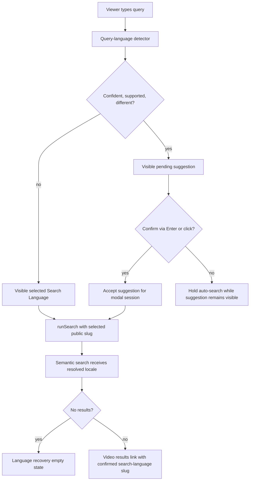
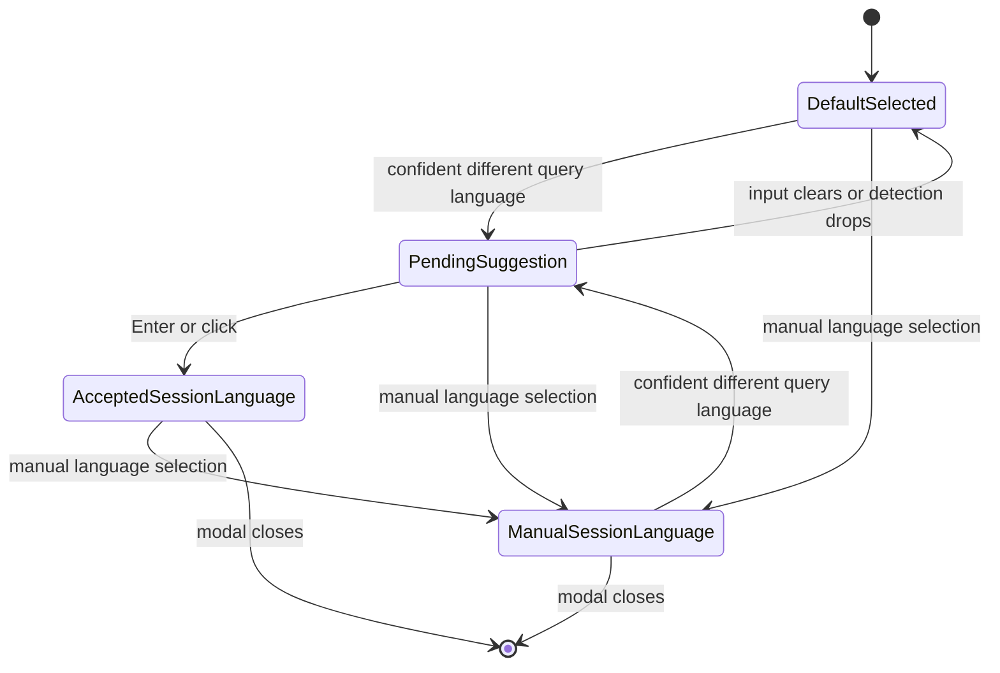

# feat: Add Multilingual Semantic Search Language Control

## Summary

Implement semantic-search-only language control in the global Watch search modal. The modal will expose a single Search Language for semantic searches, detect confident query-language mismatches, show a visible "Search in <language>" suggestion, and run semantic search in the confirmed language without changing route language, website language, audio language, or saved language preferences.

---

## Problem Frame

Watch viewers can type a query in one language while the current search context remains another language. That mismatch can make valid multilingual semantic searches look empty or wrong. The current code has language-aware search plumbing, but its language selector and metadata are tied to Algolia, and its resolver still considers saved search and audio-language preferences that this v1 explicitly excludes.

This plan uses `docs/brainstorms/2026-06-19-watch-multilingual-semantic-search-requirements.md` as the origin document. It covers the full brainstorm scope for semantic search and keeps adjacent work out: no Algolia behavior change, no saved search-language preference, no audio-language default, and no route or website-language mutation.

---

## Requirements

**Semantic Search Language Behavior**

- R1. The search bar detects the likely language of a typed query only when enough text exists to make a useful guess.
- R2. When detection is confident, supported, and different from the visible selected Search Language, the UI shows a visible suggestion to search in the detected language.
- R3. When the detected-language suggestion is visible, pressing Enter or clicking the suggestion confirms it and runs semantic search in the detected language.
- R4. When detection is low-confidence, unsupported, ambiguous, unavailable, or same-language, pressing Enter runs semantic search using the visible selected Search Language.
- R5. A manual single-select Search Language control is available for semantic search.

**Default Language Priority**

- R6. The initial selected Search Language defaults to the current website/watch route language when available.
- R7. If the website/watch route language is unavailable, the selected Search Language falls back to browser/device language when supported.
- R8. If neither route nor browser/device language is usable, the selected Search Language falls back to English.

**Scope Safety**

- R9. Search-language confirmation does not change website language, route language, audio language, or persisted watch-language settings.
- R10. Semantic no-result states explain that results may exist in another language and offer a language-based recovery path.
- R11. Multilingual semantic behavior is covered by eval cases where query language differs from website/watch language.
- R12. Plan-added scope constraint from the origin's Algolia boundary: Algolia search behavior remains unchanged; query-language suggestions and semantic single-select behavior are active only on semantic search paths.

---

## Key Technical Decisions

- **Public slug is the semantic language identity:** Semantic search should pass a selected public language slug through the existing server-action boundary, then resolve it to the search locale. English names stay useful for display and Algolia filters, but they are not the canonical semantic selection identity.
- **Semantic defaults ignore saved and audio preferences:** The resolver priority for semantic search is explicit in-session selection, route/watch language, browser/device language, then English. `forge_search_lang` and audio-language preference are not read or written for this v1.
- **Semantic language selection is singular:** The semantic Search Language is a single visible choice. Algolia's current multi-select language filters remain separate and unchanged.
- **Language metadata is not Algolia-owned:** The modal needs supported-language metadata even when the Algolia flag is off, so language option loading should be decoupled from Algolia facets while preserving the existing `algoliaEnabled` signal.
- **Detection lives behind an adapter:** Add a small query-language detection helper around `tinyld`, with Unicode script prechecks where useful, named minimum length, top-score, and top-vs-second margin constants. The adapter returns no suggestion unless it maps to one unambiguous supported public slug, and tests are the authority for the initial thresholds.
- **Visible suggestion pauses automatic search:** While a confident different-language suggestion is visible, the existing debounce should not fire a wrong-language search. Enter or click cancels pending debounce and runs exactly one semantic search in the detected language.
- **Accepted suggestions are session-only:** Accepting "Search in Spanish" updates the visible Search Language for the open modal session and load-more continuity, but writes no cookie and does not mutate route or audio state.
- **Algolia remains a separate mode:** When the modal is currently using Algolia for untyped video searches, keep its existing language/facet behavior. Do not add a semantic override that forces Algolia-enabled searches through semantic search.

---

## High-Level Technical Design

---

## Implementation Units

### U1. Rework Semantic Search Language Resolution

- **Goal:** Make semantic search resolve language from in-session slug, route/watch language, browser/device language, then English, without saved search or audio preference defaults.
- **Requirements:** R6, R7, R8, R9, R12
- **Dependencies:** None
- **Files:**
  - `apps/web/src/lib/search-language.ts`
  - `apps/web/src/lib/search-actions.ts`
  - `apps/web/src/lib/search-language.test.ts`
  - `apps/web/src/lib/search-actions.test.ts`
- **Approach:** Keep the resolver pure and reuse existing public Watch language helpers. Remove semantic dependency on search-language and audio-language preference readers. Prefer explicit semantic `languageSlug` over English-name selection for semantic calls, while leaving Algolia request shaping unchanged.
- **Patterns to follow:** `apps/web/src/lib/locale.ts` for public slug resolution; `docs/solutions/best-practices/language-identity-on-slug-not-bcp47-20260605.md` for slug identity; `docs/solutions/architecture-patterns/forge-algolia-search-modal-20260610.md` for the server-action boundary.
- **Test scenarios:**
  - Explicit in-session public slug searches in that locale even when route and browser signals differ.
  - Route/watch language beats browser/device language.
  - Browser/device language beats English fallback when supported.
  - Unsupported browser/device language falls back to English.
  - Semantic `runSearch` does not consult saved search-language or audio-language preference readers.
  - Algolia-enabled untyped video search still calls Algolia with the same language filter payload shape as before.
- **Verification:** Resolver and server-action tests prove the priority chain and Algolia non-regression.

### U2. Decouple Language Metadata and Semantic Manual Selection

- **Goal:** Make supported language options and a manual single-select Search Language available in semantic mode.
- **Requirements:** R5, R6, R7, R8, R9, R12
- **Dependencies:** U1
- **Files:**
  - `apps/web/src/lib/search-language-actions.ts`
  - `apps/web/src/lib/search-language-actions.test.ts`
  - `apps/web/src/components/FloatingSearchContext.tsx`
  - `apps/web/src/components/FloatingSearchController.tsx`
  - `apps/web/src/components/SearchOverlay.tsx`
  - `apps/web/src/components/__tests__/FloatingSearchProvider.test.tsx`
- **Approach:** Fetch language metadata regardless of the Algolia flag and keep returning the flag so the UI can branch cleanly. Store semantic selection as a selected option/public slug in controller context, pass `languageSlug` to `runSearch` for semantic searches and load-more, and key active semantic search signatures by slug. Seed semantic Search Language from route slug, then browser/device `Accept-Language`, then English; do not use geo-country suggestion for semantic defaults. Keep English-name arrays for Algolia filters/display and keep Algolia's existing multi-select UI isolated from the semantic single-select control. Remove client writes to the saved search-language preference for this semantic path.
- **Patterns to follow:** Existing `getSearchLanguageOptions` metadata query and `buildSearchLanguageOptions` option shape; current request-id guards in `FloatingSearchController`.
- **Test scenarios:**
  - Language options are returned when Algolia is disabled.
  - The semantic selector shows the route/watch language by default when available.
  - Browser/device recommendation seeds the selector when no route language is available.
  - Browser/device language beats geo-country suggestion when the two disagree.
  - Manual French selection runs semantic search in French and writes no search-language cookie.
  - Algolia-enabled mode still renders and behaves as the existing Algolia browse/filter UI.
- **Verification:** Component tests cover default selection, manual selection, and Algolia non-regression.

### U3. Add Query Language Detection Adapter

- **Goal:** Detect likely query language for supported semantic Search Language suggestions without network calls while typing.
- **Requirements:** R1, R2, R4, R9, R12
- **Dependencies:** U2
- **Files:**
  - `apps/web/package.json`
  - `pnpm-lock.yaml`
  - `apps/web/src/lib/search-query-language.ts`
  - `apps/web/src/lib/search-query-language.test.ts`
- **Approach:** Add `tinyld` as the initial browser-safe detector. Wrap it in a local adapter that normalizes query text, applies named minimum length/token checks, uses script hints for obvious non-Latin cases, and requires named top-score and top-vs-second margin constants. Map detector output to supported public slugs through an explicit allowlist or an unambiguous option mapping; ambiguous BCP-47 collisions return no suggestion. Tests are the authority for the initial thresholds.
- **Patterns to follow:** Pure helper style from `apps/web/src/lib/search-language.ts`; slug identity guidance from `CONCEPTS.md`.
- **Test scenarios:**
  - Confident supported Spanish query returns the Spanish Search Language option when English is selected.
  - Short, numeric, brand-only, mixed-language, and ambiguous queries return no suggestion.
  - Unsupported detector languages return no suggestion.
  - Same-as-selected language returns no suggestion.
  - BCP-47 collision or multiple possible public slugs returns no suggestion.
  - Non-Latin script examples map only when a supported public slug is unambiguous.
- **Verification:** Detector tests show conservative suggestion behavior before UI wiring depends on it.

### U4. Wire Suggestion, Enter, Click, and Empty-State Recovery

- **Goal:** Make the semantic query-language suggestion visible and confirmable, and make no-result states recoverable by language.
- **Requirements:** R2, R3, R4, R5, R9, R10, R12
- **Dependencies:** U2, U3
- **Files:**
  - `apps/web/src/components/FloatingSearchField.tsx`
  - `apps/web/src/components/FloatingSearchContext.tsx`
  - `apps/web/src/components/FloatingSearchController.tsx`
  - `apps/web/src/components/SearchOverlay.tsx`
  - `apps/web/src/components/__tests__/FloatingSearchProvider.test.tsx`
  - `apps/web/messages/en.json`
  - `apps/web/messages/*.json`
  - `apps/web/src/i18n/__tests__/messages-parity.test.ts`
- **Approach:** Derive a pending suggestion from current query plus current semantic Search Language. Render it near the input as an action, not as hidden state. While visible, hold the typing debounce; Enter or click accepts the suggestion, updates session selected Search Language, and starts one semantic search. When no suggestion is visible, Enter uses the selected Search Language. Clear or recompute suggestions on input clear, manual language selection, modal close, stale detection, and route changes. Semantic no-result copy should mention language recovery and expose the selector or detected-language retry; error states keep existing retry copy.
- **Patterns to follow:** Existing overlay focus trap, close behavior, debounce cleanup, URL sync guard, stale request guard, and load-more signature guard.
- **Test scenarios:**
  - Covers AE1. Spanish query on an English route shows "Search in Spanish" and Enter searches in Spanish once.
  - Covers AE2. Low-confidence query shows no suggestion and Enter searches in the visible selected language.
  - Covers AE3. Manual language selection searches with the manual language unless a different visible suggestion is confirmed.
  - Clicking the suggestion cancels a pending debounce and runs one semantic search in the detected language.
  - Load more after accepting a suggestion preserves query language and rejects stale language signatures.
  - Covers AE4. Semantic no-results show language recovery copy and a recovery action; semantic errors keep connection/retry copy.
  - Message parity passes after adding new SearchOverlay strings.
- **Verification:** Component tests prove the user-visible flows and prevent duplicate/wrong-language searches.

### U5. Add Multilingual Search Eval Mismatch Cases

- **Goal:** Make the offline search eval seed set represent query-language and website/watch-language mismatch cases.
- **Requirements:** R11
- **Dependencies:** U1
- **Files:**
  - `apps/mastra/src/services/offline-search-eval/types.ts`
  - `apps/mastra/src/services/offline-search-eval/seed-prompt-set.ts`
  - `apps/mastra/src/services/offline-search-eval/seed-prompt-set.test.ts`
- **Approach:** Extend seed prompt metadata with an optional website/watch locale context while keeping `locale` as the confirmed search locale used by the runner. Add at least two sanitized seed cases where the website/watch locale differs from the confirmed search locale, such as English route with Spanish query and French route with English query. Keep the eval runner offline and Admin-backed; do not move UI behavior into Mastra.
- **Patterns to follow:** `docs/solutions/architecture-patterns/mastra-offline-search-eval-orchestration-boundary-pattern.md` and existing `SEARCH_EVAL_SEED_PROMPT_SET_VERSION` versioning.
- **Test scenarios:**
  - Seed prompt IDs remain unique after adding mismatch cases.
  - Mismatch cases carry different website/watch and confirmed search locales.
  - Locale filtering still filters by confirmed search locale.
  - Prompt-set version changes when the committed seed semantics change.
- **Verification:** Seed prompt tests prove eval coverage exists without changing live search.

---

## Scope Boundaries

- Algolia search behavior and Algolia language facets are out of scope.
- Persisting a saved search-language preference is deferred.
- User audio-language setting is not an input to v1 defaults.
- Search confirmation does not mutate website/watch language, URL language, selected Dub, or persisted watch-language settings.
- Search-ranking optimization is deferred; this feature selects the right semantic search language and validates the mismatch case.
- Native browser `LanguageDetector`, MediaPipe, and heavier detector/model-download paths are deferred unless `tinyld` proves insufficient.

---

## System-Wide Impact

This change crosses the Watch web modal, the web server-action search boundary, localized message catalogs, and Mastra's offline search eval seed set. It should not require Admin schema changes, generated GraphQL type edits, or public route changes.

---

## Risks & Dependencies

- **Short-query false positives:** Detector scores are heuristics. Conservative thresholds, margin checks, and no-suggestion fallbacks protect users from surprise language switches.
- **Language identity collisions:** Multiple public language slugs can share a BCP-47 primary code. Detector mapping must be explicit or unambiguous, and tests should cover collisions.
- **Algolia flag confusion:** The modal already branches by feature flag. Semantic language behavior must stay hidden or inert when Algolia owns the active search path.
- **Metadata availability:** Semantic mode now depends on language metadata that was previously skipped when Algolia was off. Failure should degrade to English fallback and a usable search box.
- **Catalog copy churn:** SearchOverlay messages exist in many locale JSON files. Add keys through the repo's locale generation/check flow so parity stays green.

---

## Acceptance Examples

- AE1. Spanish query on English Watch page: the search bar shows "Search in Spanish"; Enter runs semantic search in Spanish.
- AE2. Low-confidence query: no detected-language suggestion becomes active; Enter searches in the visible selected language.
- AE3. Manual language override: choosing French makes semantic search use French unless a different visible suggestion is accepted.
- AE4. No results in selected language: the empty state explains that results may exist in another language and offers language recovery.
- AE5. Eval coverage: the search eval seed set includes mismatch cases where website/watch language differs from confirmed search language.

---

## Verification Strategy

Automated coverage should include focused unit tests for resolver priority, detector behavior, language metadata loading, search action request shape, overlay interaction, message parity, and Mastra seed prompt semantics.

Manual validation should start the local web app, open the embedded browser, and exercise the semantic modal with Algolia disabled or otherwise forced onto the semantic path. The browser pass should confirm the selector is visible, a Spanish query on an English route shows and accepts the detected-language suggestion, low-confidence text searches in the selected language, manual language selection works without persistence, and semantic no-results show language recovery copy.

---

## Sources & Research

- Origin requirements: `docs/brainstorms/2026-06-19-watch-multilingual-semantic-search-requirements.md`
- Product context: `PRODUCT.md`
- Repo constraints: `AGENTS.md`, `apps/web/AGENTS.md`, `apps/web/CLAUDE.md`
- Existing search pattern: `docs/solutions/architecture-patterns/forge-algolia-search-modal-20260610.md`
- Language identity learning: `docs/solutions/best-practices/language-identity-on-slug-not-bcp47-20260605.md`
- Search overlay fragility learnings: `docs/solutions/ui-bugs/watch-search-url-hydration-perpetual-loading.md`, `docs/solutions/best-practices/nextjs-search-overlay-ui-patterns-20260415.md`
- Offline eval boundary: `docs/solutions/architecture-patterns/mastra-offline-search-eval-orchestration-boundary-pattern.md`
- UX grounding: NN/g site search suggestions (`https://www.nngroup.com/articles/site-search-suggestions/`), NN/g usability heuristics (`https://www.nngroup.com/articles/ten-usability-heuristics/`), Baymard autocomplete UX (`https://baymard.com/blog/autocomplete-design`)
- Detector research: TinyLD (`https://github.com/komodojp/tinyld`), franc (`https://github.com/wooorm/franc`), MDN LanguageDetector (`https://developer.mozilla.org/en-US/docs/Web/API/LanguageDetector/detect`)
