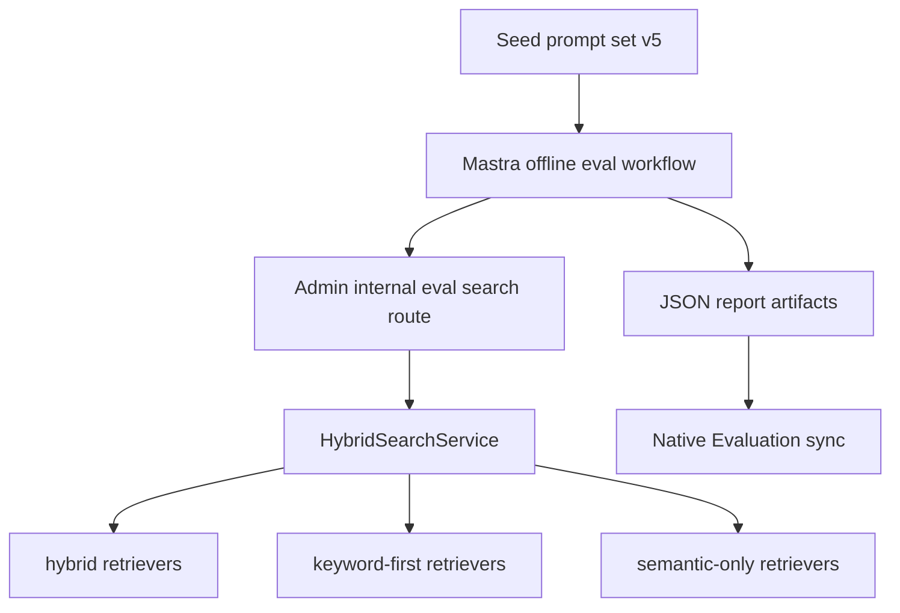
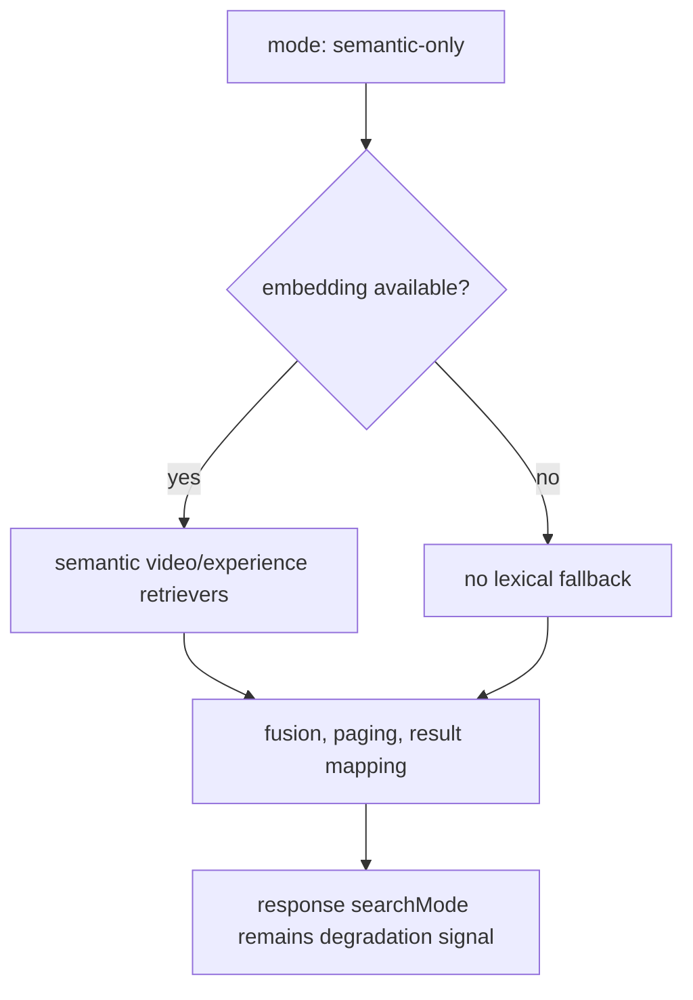

# feat: Watch Search Readiness Eval Suite

## Summary

Implement `feat-193` as a Watch search readiness suite that uses the committed
100-query prompt set and compares Admin search behavior across `hybrid`,
`keyword-first`, and internal-only `semantic-only` modes. The plan keeps public
Watch search unchanged while making Mastra reports and native Evaluation sync
preserve the requested pipeline mode.

---

## Problem Frame

The team needs a launch-readiness answer for Watch search that is stronger than
manual spot checks. Admin already owns live search execution and Mastra already
owns offline eval prompt sets, baselines, comparisons, and report artifacts, so
the right implementation extends those boundaries instead of adding another
search path.

The new diagnostic risk is `semantic-only`: adding it to the global Admin mode
decoder would expose it through public REST and GraphQL because those surfaces
already forward `mode` to the search service. The plan therefore treats
`semantic-only` as a privileged eval mode available only through the internal
eval route.

---

## Requirements

**Dataset**

- R1. Preserve a committed prompt set with exactly 100 realistic Watch search
  queries.
- R2. Cover product titles, felt needs, Bible topics, misspellings, synonyms,
  confusing queries, multilingual queries, and scene-like queries.
- R3. Keep real Algolia-derived aggregate examples as prompt provenance,
  including `jesus` as the highest-traffic baseline case.

**Eval Modes**

- R4. Allow Mastra eval workflows to run `hybrid`, `keyword-first`, and
  `semantic-only`.
- R5. Run `semantic-only` through Admin internal eval search without keyword,
  title, or full-text candidate retrieval.
- R6. Preserve the requested pipeline mode separately from the runtime
  degradation signal.
- R7. Protect keyword-first brand/product intent for `bible project` and
  `Jesus`.

**Reporting And Boundaries**

- R8. Keep reports detailed enough to diagnose bad matches from ranked
  per-query results.
- R9. Surface judged comparison outcomes, obvious failures, no-result cases, and
  summary metrics.
- R10. Make launch-readiness review possible without rereading every raw result.
- R11. Keep Admin as the search execution authority and Mastra as the offline
  eval owner.
- R12. Keep `semantic-only` internal to eval execution.
- R13. Do not add an Algolia-backed eval mode, parity runner, fallback path, or
  follow-up ticket from this work.

---

## High-Level Technical Design

The same prompt set feeds each eval run. Mastra passes the requested pipeline
mode to Admin over the authenticated internal eval route, Admin executes the
mode, and Mastra records the requested mode in report and native Evaluation
metadata.

`semantic-only` isolates semantic/vector retrieval. If embeddings are
unavailable, it must not dispatch lexical fallback retrievers; the requested
mode remains visible through eval metadata so reviewers can distinguish a
diagnostic semantic-only failure from a normal keyword-only degradation.

---

## Key Technical Decisions

- **Internal-only semantic-only gate:** Add a privileged service option for
  internal eval modes instead of recognizing `semantic-only` through the global
  public decoder. Public REST and GraphQL should continue treating
  `semantic-only` as an unknown mode that falls back to `hybrid`.
- **Smallest retrieval branch:** Add the semantic-only behavior at the
  centralized retrieval branch in Admin search, reusing the existing semantic
  retrievers and preserving `hybrid` and `keyword-first` behavior.
- **No lexical fallback in semantic-only:** Embedding failure in semantic-only
  should produce no keyword/title/full-text candidates. It should return the
  existing `SearchResponse` shape with `results: []`, `hasMore: false`, the
  query preserved, and `searchMode: "keyword-only"` as the runtime degradation
  signal. Reports must preserve the requested pipeline mode separately.
- **Mode-aware baseline identity:** Readiness runs should use mode-suffixed
  baseline names (`seed-baseline-hybrid`, `seed-baseline-keyword-first`,
  `seed-baseline-semantic-only`) and Native Evaluation source keys should
  include the requested mode so `hybrid`, `keyword-first`, and `semantic-only`
  evidence for the same prompt set stays distinguishable. The existing
  `seed-baseline` name remains backward compatible for current single-mode
  usage unless an operator chooses a mode-specific name.
- **Algolia as provenance only:** Algolia-derived aggregate queries remain in
  prompt notes and tags, but no Algolia execution mode is added.

---

## Implementation Units

### U1. Readiness Prompt Set

- **Goal:** Keep the v5 readiness prompt set as the suite input for all eval
  modes.
- **Requirements:** R1, R2, R3, R7
- **Dependencies:** None
- **Files:**
  - `apps/mastra/src/services/offline-search-eval/seed-prompt-set.ts`
  - `apps/mastra/src/services/offline-search-eval/seed-prompt-set.test.ts`
  - `docs/roadmap/content-discovery/feat-193-watch-search-readiness-eval-suite.md`
- **Approach:** Preserve the 100-prompt v5 dataset, including aggregate
  Algolia provenance and the brand/product prompts for `bible project` and
  `Jesus`.
- **Patterns to follow:** Existing seed prompt shape in
  `apps/mastra/src/services/offline-search-eval/seed-prompt-set.ts`.
- **Test scenarios:**
  - Assert the prompt set has exactly 100 prompts and unique IDs.
  - Assert required readiness tags are present.
  - Assert `jesus` is tagged as an Algolia-derived product-title baseline.
  - Assert `bible project` is tagged as a brand/product prompt for
    keyword-first regression review.
- **Verification:** Focused seed prompt test passes and roadmap notes describe
  the v5 dataset.

### U2. Internal-Only Semantic-Only Admin Mode

- **Goal:** Allow `semantic-only` only through the internal eval path while
  preserving public search behavior.
- **Requirements:** R4, R5, R6, R11, R12
- **Dependencies:** U1
- **Files:**
  - `apps/admin/src/services/hybrid-search.service.ts`
  - `apps/admin/src/services/hybrid-search.service.test.ts`
  - `apps/admin/src/services/hybrid-search.keyword-first.test.ts`
  - `apps/admin/src/app/api/internal/search-eval/search/route.ts`
  - `apps/admin/src/app/api/internal/search-eval/search/route.test.ts`
  - `apps/admin/src/app/api/search/route.test.ts`
  - `apps/admin/src/graphql/queries/hybrid-search.test.ts`
- **Approach:** Add a privileged service option that lets the internal eval route
  opt into eval-only modes. Extend Admin search branching so semantic-only
  dispatches semantic video and experience retrievers only, respects
  `contentTypes`, skips every lexical retriever, and leaves the response
  degradation signal unchanged.
- **Patterns to follow:** Keyword-first branch tests in
  `apps/admin/src/services/hybrid-search.keyword-first.test.ts`; mode decoder
  tests in `apps/admin/src/services/hybrid-search.service.test.ts`.
- **Test scenarios:**
  - Covers AE2. `semantic-only` dispatches semantic retrievers and skips video
    keyword, experience keyword, weighted keyword, trigram, and exact-title
    retrievers.
  - `semantic-only` with `contentTypes: ["video"]` skips experience retrievers.
  - Embedding failure in semantic-only dispatches no lexical retrievers and
    returns the existing `SearchResponse` contract with `results: []`,
    `hasMore: false`, the query preserved, and `searchMode: "keyword-only"`.
  - Public REST with `mode=semantic-only` does not activate semantic-only.
  - Public GraphQL with `mode: "semantic-only"` does not activate semantic-only.
  - Internal eval route forwards `mode: "semantic-only"` with the privileged
    service option.
- **Verification:** Admin focused search service, route, REST, and GraphQL tests
  pass.

### U3. Mastra Workflow Mode Plumbing

- **Goal:** Let Mastra leaf and orchestrator workflows accept and pass through
  `semantic-only`.
- **Requirements:** R4, R6, R8, R11
- **Dependencies:** U2
- **Files:**
  - `apps/mastra/src/mastra/workflows/offline-search-eval.ts`
  - `apps/mastra/src/mastra/workflows/offline-search-eval.test.ts`
  - `apps/mastra/src/mastra/workflows/search-eval-orchestrator.ts`
  - `apps/mastra/src/mastra/workflows/search-eval-orchestrator.test.ts`
  - `apps/mastra/src/services/offline-search-eval/runner.ts`
  - `apps/mastra/src/services/offline-search-eval/runner.test.ts`
  - `apps/mastra/src/services/admin-search-eval-client.test.ts`
- **Approach:** Extend workflow schemas and tests to include `semantic-only`.
  The runner already sends `input.searchMode` as Admin payload `mode` and stores
  it in report metadata, so keep that pass-through path intact and add focused
  assertions.
- **Patterns to follow:** Existing `keyword-first` payload assertions in
  `apps/mastra/src/services/admin-search-eval-client.test.ts`.
- **Test scenarios:**
  - Offline workflow schema accepts `searchMode: "semantic-only"`.
  - Orchestrator schema accepts `searchMode: "semantic-only"`.
  - Runner sends Admin payload `mode: "semantic-only"`.
  - Report metadata records requested mode `semantic-only` while result
    `searchMode` remains the Admin degradation signal.
  - `algolia` and `algolia-backed` are not accepted as Mastra workflow modes.
- **Verification:** Focused Mastra workflow, runner, and Admin eval client tests
  pass.

### U4. Native Evaluation And Mode-Aware Reporting

- **Goal:** Preserve requested mode in native Evaluation inputs and avoid
  clobbering evidence across modes.
- **Requirements:** R6, R8, R9, R10
- **Dependencies:** U3
- **Files:**
  - `apps/mastra/src/services/offline-search-eval/native-evaluation.ts`
  - `apps/mastra/src/services/offline-search-eval/native-evaluation.test.ts`
  - `apps/mastra/src/services/offline-search-eval/report.ts`
  - `apps/mastra/src/services/offline-search-eval/report.test.ts`
  - `apps/mastra/src/services/offline-search-eval/artifacts.ts`
  - `apps/mastra/src/services/offline-search-eval/artifacts.test.ts`
- **Approach:** Extend native search eval schemas and helper functions so
  `semantic-only` survives sync. Include requested mode in native source keys so
  multiple modes for the same prompt set do not overwrite each other, and make
  docs/run recipes use mode-specific baseline names for mode-by-mode evidence.
- **Patterns to follow:** Native Evaluation bridge patterns in
  `docs/solutions/architecture-patterns/mastra-native-evaluation-search-eval-bridge-pattern.md`.
- **Test scenarios:**
  - Native input schema accepts `mode: "semantic-only"`.
  - Native projection maps report metadata mode `semantic-only` to
    `searchOptions.mode: "semantic-only"`.
  - Native source keys differ for the same prompt case across `hybrid` and
    `semantic-only`.
  - The run recipe names mode-suffixed baselines so two modes do not share the
    same baseline/report identity by accident.
  - Report summaries distinguish requested mode from baseline mode and runtime
    degradation.
- **Verification:** Native Evaluation and report artifact tests pass.

### U5. Launch-Readiness Documentation And Validation

- **Goal:** Make the ticket handoff explain how to run and interpret the suite.
- **Requirements:** R8, R9, R10, R12, R13
- **Dependencies:** U1, U2, U3, U4
- **Files:**
  - `docs/roadmap/content-discovery/feat-193-watch-search-readiness-eval-suite.md`
  - `docs/brainstorms/2026-06-21-watch-search-readiness-eval-suite-requirements.md`
  - `CONCEPTS.md`
- **Approach:** Update roadmap notes to state that the executable suite covers
  `hybrid`, `keyword-first`, and internal-only `semantic-only`; keep Algolia
  execution out of scope. Keep the origin requirements doc aligned when product
  acceptance cases change, and keep `CONCEPTS.md` as the glossary source for
  Semantic-Only Search. Define the recommended run recipe as mode-specific
  baseline/report runs (`seed-baseline-hybrid`,
  `seed-baseline-keyword-first`, `seed-baseline-semantic-only`) rather than an
  implicit three-mode matrix.
- **Patterns to follow:** Roadmap progress note style already present in
  `docs/roadmap/content-discovery/feat-193-watch-search-readiness-eval-suite.md`.
- **Test scenarios:**
  - Documentation names `semantic-only` as diagnostic and internal-only.
  - Documentation names `bible project` and `Jesus` as keyword-first
    brand/product readiness checks.
  - Documentation names the mode-suffixed baseline convention for running the
    three readiness modes.
  - Documentation does not promise Algolia-backed comparison.
  - `CONCEPTS.md` defines Semantic-Only Search as an eval diagnostic rather
    than a public Watch behavior.
- **Verification:** Docs are formatted and code verification results are
  reflected in the final ticket summary.

---

## Scope Boundaries

- Public Watch search behavior changes are out of scope except to ensure
  `semantic-only` remains unavailable publicly.
- Algolia-backed comparison, fallback, or parity execution is out of scope.
- Search query analytics logging is out of scope.
- Multilingual search-language UX is out of scope.
- Scene embedding ranking policy changes are out of scope.

---

## Risks And Dependencies

- **Mode leakage risk:** Public REST and GraphQL forward `mode`, so semantic-only
  must be gated by an internal service option.
- **Misleading degradation risk:** Response `searchMode` can say
  `keyword-only` when embeddings fail; requested pipeline mode must remain
  visible in eval metadata.
- **Native sync clobber risk:** Native item source keys need requested mode to
  keep mode-specific evidence distinct.
- **Baseline interpretation risk:** Comparing a semantic-only run against a
  hybrid baseline is intentional diagnostic work, so reports should label the
  mode mismatch as expected when the operator requested it.

---

## Acceptance Examples

- AE1. Given the readiness suite prompt set, when a reviewer inspects it, then
  it contains 100 realistic prompts across the required query categories and
  includes the top Algolia-derived query.
- AE2. Given the suite runs in `semantic-only` mode, when Admin executes the
  search, then keyword, title, and full-text retrieval do not contribute
  candidates.
- AE3. Given the suite runs in `keyword-first` mode, when it searches
  `bible project`, then Bible Project videos appear near the top of the ranked
  results.
- AE4. Given the suite runs in `keyword-first` mode, when it searches `Jesus`,
  then the JESUS film/video appears near the top of the ranked results.
- AE5. Given a report was produced for `keyword-first`, when the report metadata
  is inspected, then it records `keyword-first` as the requested pipeline mode
  even if the response also reports runtime search degradation.
- AE6. Given the suite finishes a comparison run, when the team opens the
  report, then they can see summary metrics, obvious failures, no-result cases,
  and per-query ranked results.
- AE7. Given this ticket is complete, when public Watch search runs, then it has
  not been changed to expose semantic-only search and the ticket has not added
  an Algolia-backed eval mode.

---

## Sources And Research

- `docs/brainstorms/2026-06-21-watch-search-readiness-eval-suite-requirements.md`
- `docs/roadmap/content-discovery/feat-193-watch-search-readiness-eval-suite.md`
- `/tmp/compound-engineering/ce-brainstorm/watch-search-readiness-20260621/grounding.md`
- `docs/solutions/architecture-patterns/mastra-offline-search-eval-orchestration-boundary-pattern.md`
- `docs/solutions/architecture-patterns/mastra-native-evaluation-search-eval-bridge-pattern.md`
- `docs/solutions/platform/admin-hybrid-search-keyword-first-r4-extension-pattern.md`
- `docs/solutions/runtime-errors/silent-semantic-search-degradation-missing-openrouter-key-20260415.md`
- `apps/admin/src/services/hybrid-search.service.ts`
- `apps/admin/src/app/api/internal/search-eval/search/route.ts`
- `apps/mastra/src/mastra/workflows/offline-search-eval.ts`
- `apps/mastra/src/mastra/workflows/search-eval-orchestrator.ts`
- `apps/mastra/src/services/offline-search-eval/native-evaluation.ts`
