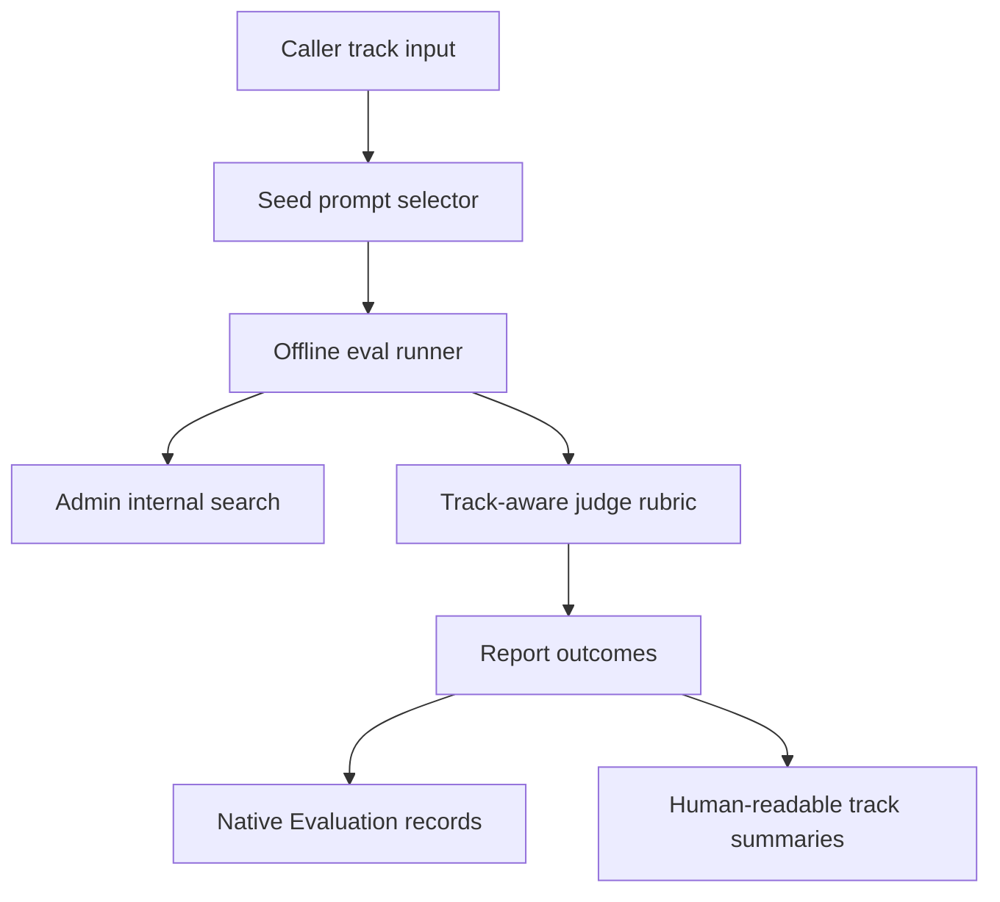
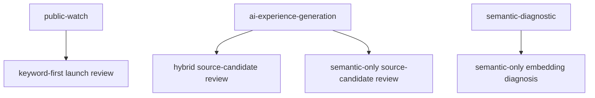

# feat: Search Eval Caller-Specific Prompt Tracks

## Summary

Extend the Mastra offline search eval suite so prompt sets are selected and
reported by caller job: public Watch search, AI experience generation, and
semantic diagnostics. The existing keyword-first Watch readiness set remains
the public-search launch lens, while hybrid and semantic-only get agent-focused
and diagnostic prompt tracks with matching judge criteria.

---

## Problem Frame

The prod-backed readiness run made keyword-first look strongest for public
Watch search, especially brand and product-title intent. It also made hybrid
and semantic-only look weak against the same public prompt set, even though
those modes are expected to serve agent retrieval and embedding diagnosis.

The current eval suite has prompt provenance by source, locale, and search mode,
but not by caller job. Without a first-class caller track, reports can imply a
single launch-readiness score across modes that do different work.

---

## Requirements

The requirements below preserve the origin document's R-IDs so implementation
units can trace back to the brainstorm without ID drift.

**Track Model**

- R1. Support caller-specific tracks for public Watch search, AI experience
  generation, and semantic diagnostics.
- R2. Each track must declare the caller, intended job, suitable search modes,
  and success criteria before results are judged.
- R3. The public Watch track must keep the current 100-prompt v5 seed set as
  its starting point.
- R4. A report must identify which caller track produced its prompts so readers
  do not compare modes against the wrong job.

**Public Watch Track**

- R5. The public Watch track must continue to prioritize product titles, brand
  names, exact titles, misspellings, common user queries, and multilingual
  viewer search behavior.
- R6. The public Watch track must continue to include `bible project` and
  `Jesus` as brand/product readiness cases for keyword-first search.
- R7. Hybrid and semantic-only results may be captured against the public Watch
  track for diagnosis, but their public launch score must not be inferred from
  this track unless the team explicitly chooses to ship them for public Watch.

**AI Experience-Generation Track**

- R8. The AI experience-generation track must focus on agent tasks such as
  finding videos for a theme, felt need, Bible topic, audience, persona, season,
  or devotional idea.
- R9. The AI track must judge whether returned results are useful source
  candidates for the agent, not whether they match an exact title.
- R10. The AI track must include prompts that resemble machine instructions,
  such as finding related videos for a topic or selecting material for a
  generated experience section.
- R11. The AI track must record enough result context for a reviewer to decide
  whether an agent could reasonably use the returned candidates.

**Semantic Diagnostic Track**

- R12. The semantic diagnostic track must isolate whether content embeddings can
  retrieve relevant material without keyword, title, or full-text retrieval
  rescuing the result set.
- R13. Semantic diagnostic prompts must emphasize concepts, paraphrases,
  transcript meaning, scene-like descriptions, and non-title thematic queries.
- R14. A poor semantic diagnostic score must be treated as embedding or corpus
  evidence, not as a direct public Watch launch blocker.

**Reporting**

- R15. Reports must avoid a single global readiness score that mixes caller
  tracks with different jobs.
- R16. Reports must summarize each track separately with mode, wins/losses or
  judged quality, no-result cases, and obvious failure examples.
- R17. Reports must make cross-track caveats visible, especially when a mode is
  bad for public title lookup but useful for agent retrieval.

---

## High-Level Technical Design

Caller track becomes an eval dimension alongside search mode. The track filters
which prompts run, shapes how pairwise results are judged, and travels into
artifacts so reports from different caller jobs cannot be accidentally compared
as one launch-readiness surface.

The public Watch track remains the default for current workflows. AI and
semantic tracks are opt-in eval scopes for agent and diagnostic use cases.

---

## Key Technical Decisions

- **Caller track is first-class metadata:** Store track identity in prompt
  definitions, runner input, reports, native Evaluation records, and source keys
  instead of relying on tags alone.
- **Track facts live in one registry:** Define caller, job, suitable modes,
  default mode, success criteria, and judge rubric text in one
  `SEARCH_EVAL_CALLER_TRACKS` registry so runner, judge, report, and native sync
  do not duplicate partial track switch statements.
- **Keep public Watch as the default:** Default workflow inputs to
  `public-watch` so existing seed-baseline and compare runs preserve current
  behavior unless an operator asks for an agent or diagnostic track.
- **Reject track mismatches before judging:** Compare runs should fail before
  judge calls when baseline and current caller tracks differ. Metadata-only
  warnings are not enough because the mixed comparison would still create the
  misleading cross-job score this work exists to prevent.
- **Make baseline identity track-aware:** Derive default baseline names from the
  selected caller track and refuse capture-time overwrites when an existing
  baseline name belongs to a different track. Legacy untracked baselines read as
  `public-watch`.
- **Use multi-track prompts where useful:** Let prompts declare multiple tracks
  when a query is valid in more than one context, but report the requested track
  as the run identity.
- **Make old artifacts readable:** Add optional track fields or normalize missing
  track metadata to `public-watch` at read time so strict artifact parsing does
  not break existing baselines and reports.
- **Judge by job, not only relevance:** The judge prompt should describe
  public-title intent, agent source-candidate usefulness, or semantic diagnostic
  relevance depending on the track.
- **No Algolia execution in this plan:** Algolia remains prompt provenance for
  the public Watch set. This plan does not add parity, fallback, or analytics
  execution against Algolia.

---

## Scope Boundaries

- This plan does not change Admin's public Watch search behavior.
- This plan does not change the public search mode selected by the Watch site.
- This plan does not add Algolia-backed eval execution or fallback comparison.
- This plan does not score final generated experiences or devotionals.
- This plan does not decide scene embedding weighting except by making semantic
  diagnostics easier to inspect.

### Deferred to Follow-Up Work

- Production re-runs for each track and mode after implementation.
- Any product decision to expose hybrid or semantic-only differently on public
  Watch search.
- A later experience-quality eval that scores the generated page or devotional,
  not only the source candidates.
- Candidate-review seed submission, promoted-candidate provenance, and promoted
  native-sync filtering by caller track. Those are related, but they widen this
  plan beyond report/native eval provenance for the current readiness suite.

---

## Implementation Units

### U1. Track Model And Prompt Selection

- **Goal:** Add caller-track identity to seed prompts and select prompts by
  track plus locale.
- **Requirements:** R1, R2, R3, R5, R6, R8, R10, R12, R13
- **Dependencies:** None
- **Files:**
  - `apps/mastra/src/services/offline-search-eval/types.ts`
  - `apps/mastra/src/services/offline-search-eval/seed-prompt-set.ts`
  - `apps/mastra/src/services/offline-search-eval/seed-prompt-set.test.ts`
- **Approach:** Add a `SearchEvalCallerTrack` type with `public-watch`,
  `ai-experience-generation`, and `semantic-diagnostic`. Define a shared
  `SEARCH_EVAL_CALLER_TRACKS` registry with `id`, `caller`, `job`,
  `suitableModes`, `defaultMode`, `successCriteria`, and
  `judgeRubricDescription`. Extend `SeedPromptCase` with caller-track
  membership, default the current v5 prompts to `public-watch`, and add
  track-filter helpers that compose with locale filtering. Add enough AI and
  semantic diagnostic prompts to cover the brainstorm categories without
  changing the current public Watch prompt count contract.
- **Patterns to follow:** Existing `seedPrompt` factory and
  `seedPromptsForLocales` helper in
  `apps/mastra/src/services/offline-search-eval/seed-prompt-set.ts`.
- **Test scenarios:**
  - Covers AE1. `public-watch` returns the existing v5 public prompt set with
    `seed-bible-project` and `seed-jesus`.
  - Track filtering returns only prompts assigned to the requested caller track.
  - Locale filtering and track filtering compose without dropping valid prompts
    for the selected locale.
  - Track definitions expose caller, job, suitable modes, default mode, success
    criteria, and judge rubric text for every supported caller track.
  - Every supported caller track has at least one matching prompt and every
    prompt's tracks reference registry entries.
  - Prompt IDs remain unique across all tracks.
  - A prompt assigned to multiple tracks appears for each requested track but
    preserves one stable prompt ID.
- **Verification:** Seed prompt tests prove public Watch compatibility and new
  track filtering behavior.

### U2. Workflow And Runner Track Propagation

- **Goal:** Let Mastra offline eval and orchestrator workflows run a selected
  caller track and persist the track in metadata.
- **Requirements:** R1, R2, R3, R4, R7, R15, R17
- **Dependencies:** U1
- **Files:**
  - `apps/mastra/src/services/offline-search-eval/runner.ts`
  - `apps/mastra/src/services/offline-search-eval/runner.test.ts`
  - `apps/mastra/src/mastra/workflows/offline-search-eval.ts`
  - `apps/mastra/src/mastra/workflows/offline-search-eval.test.ts`
  - `apps/mastra/src/mastra/workflows/search-eval-orchestrator.ts`
  - `apps/mastra/src/mastra/workflows/search-eval-orchestrator.test.ts`
- **Approach:** Add a `callerTrack` workflow and runner input that defaults to
  `public-watch`. Filter seed prompts by `callerTrack`, include the selected
  track in `SearchEvalMetadata`, validate the requested search mode against the
  registry's suitable modes, derive default baseline names from the caller
  track, and refuse capture-time overwrites when an existing baseline name has a
  different caller track.
- **Patterns to follow:** Existing `searchMode` schema propagation from
  workflow input through runner metadata.
- **Test scenarios:**
  - Offline workflow schema defaults `callerTrack` to `public-watch`.
  - Orchestrator schema accepts all supported caller tracks and rejects unknown
    values.
  - Runner passes the selected caller track to the prompt selector.
  - Runner rejects unsupported caller-track/search-mode combinations before any
    Admin search call.
  - Baseline capture metadata records the selected caller track.
  - Default baseline names differ by caller track.
  - Baseline capture refuses to overwrite an existing baseline name from a
    different caller track while treating legacy untracked baselines as
    `public-watch`.
  - Compare mode rejects baseline/current track mismatch before judge calls.
- **Verification:** Focused runner and workflow tests pass with each supported
  track.

### U3. Backwards-Compatible Artifact And Report Metadata

- **Goal:** Make baselines, reports, and summaries track-aware without breaking
  existing strict JSON artifacts.
- **Requirements:** R2, R4, R11, R15, R16, R17
- **Dependencies:** U2
- **Files:**
  - `apps/mastra/src/services/offline-search-eval/types.ts`
  - `apps/mastra/src/services/offline-search-eval/artifacts.ts`
  - `apps/mastra/src/services/offline-search-eval/artifacts.test.ts`
  - `apps/mastra/src/services/offline-search-eval/report.ts`
  - `apps/mastra/src/services/offline-search-eval/report.test.ts`
  - `apps/mastra/src/services/offline-search-eval/baseline-portability.ts`
  - `apps/mastra/src/services/offline-search-eval/baseline-portability.test.ts`
- **Approach:** Add optional or normalized caller-track metadata to artifact
  schemas, baseline cases, comparison outcomes, and report summaries. Derive a
  `callerTrackMix` alongside `promptSourceMix`, and add `trackSummaries` with
  selected caller track, mode, wins/losses or judged quality, no-result count,
  and representative failure examples before aggregate totals.
- **Patterns to follow:** Existing optional compatibility handling in
  `baseline-portability.ts` and mode-aware metadata added for semantic-only.
- **Test scenarios:**
  - Existing artifacts without caller-track metadata read as `public-watch`.
  - New baseline artifacts include selected caller track in metadata and cases.
  - Reports include selected caller track and caller-track mix.
  - Reports include track summary fields for selected track, mode, no-result
    count, judged outcome counts, and representative failures.
  - Baseline/current track mismatch is rejected before report finalization.
  - Redaction keeps track metadata while still removing sensitive generated
    candidate details.
- **Verification:** Artifact schema, report, and baseline portability tests pass
  against both old-shape fixtures and new track-aware fixtures.

### U4. Track-Aware Judge Rubrics

- **Goal:** Judge search results according to the selected caller track's job.
- **Requirements:** R2, R9, R11, R13
- **Dependencies:** U2
- **Files:**
  - `apps/mastra/src/services/offline-search-eval/judge.ts`
  - `apps/mastra/src/services/offline-search-eval/judge.test.ts`
  - `apps/mastra/src/services/offline-search-eval/runner.ts`
  - `apps/mastra/src/services/offline-search-eval/runner.test.ts`
- **Approach:** Extend `JudgePairInput` with the selected caller track and read
  rubric text from `SEARCH_EVAL_CALLER_TRACKS`. Public Watch judging favors
  viewer query intent, product/title matches, and obvious relevance. AI
  experience-generation judging favors useful source candidates for a generated
  experience, devotional, or recommendation. Semantic diagnostics favor
  conceptual match quality without rewarding lexical rescue.
- **Patterns to follow:** Existing pairwise forward/swapped judge calls and
  `collapseSwapVerdicts` behavior in the runner.
- **Test scenarios:**
  - Public Watch judge request includes product/title readiness guidance.
  - AI experience-generation judge request includes source-candidate usefulness
    guidance.
  - Semantic diagnostic judge request includes concept and embedding relevance
    guidance.
  - Calibration calls pass caller track through to the judge.
  - Forward and swapped compare calls use the same track rubric for a case.
- **Verification:** Judge request-body tests and runner judge-call assertions
  prove the rubric changes by caller track.

### U5. Native Evaluation Report Provenance

- **Goal:** Preserve caller-track identity when syncing search eval reports into
  Mastra native Evaluation.
- **Requirements:** R2, R4, R16, R17
- **Dependencies:** U3, U4
- **Files:**
  - `apps/mastra/src/services/offline-search-eval/native-evaluation.ts`
  - `apps/mastra/src/services/offline-search-eval/native-evaluation.test.ts`
- **Approach:** Add caller track to native input metadata, dataset keys,
  experiment keys, source anchors, and item metadata for report sync. Keep
  source keys mode-aware and make them track-aware so the same query can have
  separate report evidence for public Watch, AI retrieval, and semantic
  diagnostics.
- **Patterns to follow:** Existing native source-key identity that includes
  search mode in `native-evaluation.ts`.
- **Test scenarios:**
  - Native input schema accepts supported caller tracks.
  - Native dataset and experiment keys differ by caller track for the same
    baseline and search mode.
  - Dataset item metadata includes caller track and search mode.
  - Report outcome source keys include caller track.
  - Native report metadata includes track summary context without promoted
    candidate provenance.
- **Verification:** Native Evaluation tests prove track identity survives report
  sync.

### U6. Documentation And Roadmap Notes

- **Goal:** Make the new caller-track model usable by humans and future agents.
- **Requirements:** R4, R15, R16, R17
- **Dependencies:** U1, U2, U3, U4, U5
- **Files:**
  - `docs/roadmap/content-discovery/feat-193-watch-search-readiness-eval-suite.md`
  - `apps/mastra/AGENTS.md`
  - `apps/mastra/CLAUDE.md`
  - `CONCEPTS.md`
- **Approach:** Update roadmap progress notes and Mastra package guidance to
  explain the default public Watch track, the AI experience-generation track,
  and the semantic diagnostic track. Keep `CONCEPTS.md` limited to glossary
  terms and avoid turning it into the spec.
- **Patterns to follow:** Existing Mastra offline search eval ownership notes in
  `apps/mastra/AGENTS.md` and environment/run guidance in
  `apps/mastra/CLAUDE.md`.
- **Test scenarios:** Test expectation: none - this unit updates documentation
  only.
- **Verification:** Documentation names the available tracks, their intended
  modes, and the caveat that public Watch behavior is unchanged.

---

## Acceptance Examples

- AE1. Given the public Watch track, when the team reviews keyword-first search,
  then `bible project` and `Jesus` remain first-class readiness cases.
- AE2. Given hybrid performs poorly on exact-title public Watch prompts, when
  the report is read, then the report does not treat that alone as failure for
  AI experience generation.
- AE3. Given the AI experience-generation track, when a prompt asks for videos
  related to a Bible theme or devotional idea, then results are judged by agent
  usefulness rather than exact title match.
- AE4. Given the semantic diagnostic track, when semantic-only fails concept or
  paraphrase prompts, then the report frames the result as embedding/corpus
  evidence.
- AE5. Given any report, when a reviewer opens its summary, then the caller
  track and search mode are visible before the score is interpreted.

---

## System-Wide Impact

Admin search remains the execution authority and public Watch search behavior
does not change. Mastra gains a new eval dimension that affects prompt
selection, report interpretation, judging, and native Evaluation identity.
Existing baselines become legacy-compatible public Watch artifacts unless they
are recaptured with a different caller track.

---

## Risks & Dependencies

- **Strict artifact schemas:** Adding required fields would break existing JSON
  baselines. Mitigation: normalize missing caller-track metadata to
  `public-watch` or make the new fields optional at the schema boundary.
- **Prompt-set drift:** Agent-focused prompts could accidentally enter the public
  Watch readiness score. Mitigation: default to `public-watch` and test track
  filtering.
- **Judge ambiguity:** A generic relevance prompt will keep penalizing
  agent-focused modes for not matching titles. Mitigation: make the judge rubric
  track-aware and test the rendered judge request.
- **Score comparability:** Cross-track reports may still invite a single global
  score. Mitigation: show track summaries separately and avoid aggregating
  readiness across tracks.
- **Language catalog edge cases:** The previous prod run exposed at least one
  unsupported `languageSlug`. This plan should not block on that issue, but
  track-filtered runs should preserve rejected cases in reports where they
  occur.

---

## Sources / Research

- Origin requirements:
  `docs/brainstorms/2026-06-22-search-eval-caller-specific-prompt-tracks-requirements.md`
- Prior plan:
  `docs/plans/2026-06-21-001-feat-watch-search-readiness-eval-suite-plan.md`
- Roadmap ticket:
  `docs/roadmap/content-discovery/feat-193-watch-search-readiness-eval-suite.md`
- Mastra search eval code:
  `apps/mastra/src/services/offline-search-eval/`
- Mastra workflow code:
  `apps/mastra/src/mastra/workflows/offline-search-eval.ts`
  and `apps/mastra/src/mastra/workflows/search-eval-orchestrator.ts`
- Local glossary: `CONCEPTS.md`
