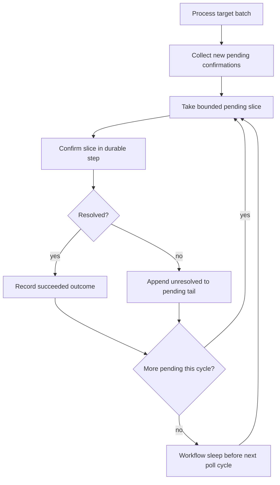
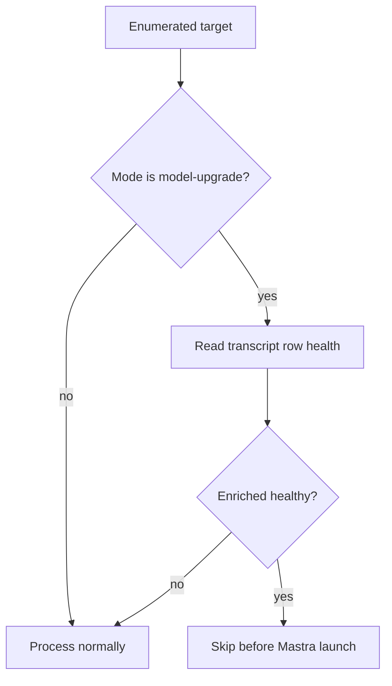

# fix: Bound transcript backfill confirm resume

## Summary

Fix the production transcript embedding backfill failure by bounding pending
Mastra ingest confirmation work, then resume from the known `1_jf-0-0` failure
point without rewriting transcript rows that are already enriched and healthy.

---

## Problem Frame

The all-language `MODEL_UPGRADE` run `wrun_01KVJ5MSF2V6EEMG7FDQQKFF84` failed
after `stepConfirmTranscriptEmbeddingIngests` carried a large pending
confirmation list through Workflow storage. The confirm step had about 620 KB
of CBOR input/output, ran past the Graphile worker task boundary, and left a
duplicate `step_started` event that useworkflow treated as a corrupted event
log. Late Mastra ingests still wrote rows after the parent run failed, so the
resume must treat Admin storage health as source of truth.

---

## Requirements

**Workflow durability**

- R1. Confirmation of timed-out Mastra launches must be split into bounded
  durable step inputs so no confirm step scans the whole pending list.
- R2. Unresolved pending confirmations must rotate fairly across slices so an
  old unresolved Mastra run cannot starve newer pending runs.
- R3. Final pending-failure projection must also be bounded so the timeout path
  cannot create a giant failure step.

**Resume correctness**

- R4. A model-upgrade resume must skip transcript targets whose current Admin
  row is enriched healthy: source kind present, model-upgrade/force generation,
  all chunks have embeddings, and all chunks have non-empty
  `embedding_input_text`.
- R5. A resume may use existing GraphQL `coreIds` / `languages` filters to
  start at the known failure region, but it must not add a new ad hoc trigger
  path outside the existing Admin backfill endpoint.
- R6. The production resume should first target `1_jf-0-0` in all languages to
  prove the confirm fix on the failure shape before expanding to the remaining
  all-language work.

**Operational evidence**

- R7. The runbook must record the fix, validation, deploy, resume command shape,
  and post-resume status counts.
- R8. A compounding note must capture the generalizable Workflow lesson because
  this was a production incident and repeated an event-log corruption pattern.

---

## Key Technical Decisions

- KTD1. Bound confirm work at the workflow caller, not only inside the step:
  slicing before `stepConfirmTranscriptEmbeddingIngests` keeps the persisted
  step input small and avoids repeating the 620 KB CBOR payload shape.
- KTD2. Rotate unresolved confirmations to the end of the pending list:
  fairness matters because long `1_jf-0-0` Mastra runs can remain pending while
  later runs complete.
- KTD3. Keep resume on the existing GraphQL trigger: the operator path remains
  `triggerTranscriptEmbeddingBackfill` with `mode: MODEL_UPGRADE` and scoped
  `coreIds` when proving the fix.
- KTD4. Skip healthy targets before Mastra launch during model-upgrade resume:
  upserts make duplicate rows unlikely, but provider work and elapsed time are
  the real operational cost.

---

## High-Level Technical Design

The resume selector runs before target processing:

---

## Implementation Units

### U1. Bound pending confirmation steps

- **Goal:** Ensure `stepConfirmTranscriptEmbeddingIngests` only receives a
  bounded slice of pending confirmations and rotates unresolved items fairly.
- **Requirements:** R1, R2.
- **Dependencies:** None.
- **Files:**
  - `apps/admin/src/workflows/transcriptEmbeddingBackfill.ts`
  - `apps/admin/src/workflows/transcriptEmbeddingBackfill.test.ts`
- **Approach:** Add a small runtime constant for confirmation batch size. Change
  `confirmPendingTranscriptIngestsOnce` and the final wait loop to pass only the
  next slice into `stepConfirmTranscriptEmbeddingIngests`, append unresolved
  confirmations to the tail, and sleep only after a full pending cycle has been
  checked.
- **Execution note:** Start with a failing unit test that creates many pending
  confirmations and asserts the confirm step never receives the full list.
- **Patterns to follow:** Current process-step bounding in
  `apps/admin/src/workflows/transcriptEmbeddingBackfill.ts`; production
  incident notes in
  `docs/solutions/workflow-issues/transcript-embedding-backfill-cancel-and-resume-operations.md`.
- **Test scenarios:**
  - Many pending confirmations with no matching rows are confirmed in slices no
    larger than the configured limit.
  - A pending item unresolved in the first slice moves behind untouched pending
    items so later items can be checked.
  - A resolved item in a slice emits a succeeded outcome and is removed from the
    pending list.
- **Verification:** Workflow tests prove bounded step inputs and fair rotation.

### U2. Bound pending failure projection

- **Goal:** Prevent the final 20-minute timeout path from passing a large
  pending list into one failure step.
- **Requirements:** R3.
- **Dependencies:** U1.
- **Files:**
  - `apps/admin/src/workflows/transcriptEmbeddingBackfill.ts`
  - `apps/admin/src/workflows/transcriptEmbeddingBackfill.test.ts`
- **Approach:** Add a workflow helper that calls
  `stepFailPendingTranscriptEmbeddingIngests` in the same bounded slices used
  for confirmation.
- **Test scenarios:**
  - When the final confirmation window expires with more pending items than the
    batch limit, failure outcomes are produced through multiple bounded calls.
  - Existing single-pending timeout behavior still reports `network_error`.
- **Verification:** Tests cover both multi-slice timeout and the existing
  single-item timeout contract.

### U3. Skip already healthy enriched transcript rows during resume

- **Goal:** Avoid re-embedding rows already upgraded by prior failed runs.
- **Requirements:** R4, R5.
- **Dependencies:** None.
- **Files:**
  - `apps/admin/src/workflows/transcriptEmbeddingBackfill.ts`
  - `apps/admin/src/workflows/transcriptEmbeddingBackfill.test.ts`
  - `apps/admin/src/graphql/mutations/transcript-embedding.ts`
  - `apps/admin/src/graphql/mutations/transcript-embedding.test.ts`
- **Approach:** Add an opt-in resume selector on the existing GraphQL mutation
  or a model-upgrade-only target pruning path. The selector should check
  current `video_transcript` / `video_transcript_chunk` health before launch and
  omit healthy targets from the process batches. Keep direct ingest
  `model-upgrade` semantics unchanged so lower-level services can still rewrite
  when explicitly called.
- **Test scenarios:**
  - In resume/model-upgrade selection, a target with all enriched v2 chunks is
    not sent to Mastra.
  - A legacy row, incomplete chunk set, missing `embedding_input_text`, or no
    transcript row remains eligible.
  - `coreIds` and `languages` filters continue to apply before or with the
    resume selector.
- **Verification:** Dispatch-shape and workflow tests prove the existing
  endpoint remains the trigger surface and that healthy rows are skipped.

### U4. Document and compound the production fix

- **Goal:** Preserve the incident learning and operator resume sequence.
- **Requirements:** R7, R8.
- **Dependencies:** U1, U2, U3.
- **Files:**
  - `docs/solutions/workflow-issues/transcript-embedding-backfill-cancel-and-resume-operations.md`
  - A new or updated `docs/solutions/` note selected by `ce:compound`
- **Approach:** Update the runbook with the bounded-confirm fix and exact
  validation evidence. Run `ce:compound` after implementation to record the
  general Workflow pattern.
- **Test expectation:** none -- documentation unit.
- **Verification:** The runbook names the root cause, code-level fix,
  deployment state, and resume query shape.

### U5. Ship and resume from the failure region

- **Goal:** Deploy the hotfix and resume without replaying known healthy rows.
- **Requirements:** R5, R6, R7.
- **Dependencies:** U1, U2, U3, U4.
- **Files:**
  - No source file changes expected beyond deployment metadata and docs.
- **Approach:** After tests and review pass, ship the Admin and Admin worker
  change. Trigger the existing Admin GraphQL backfill with
  `mode: MODEL_UPGRADE`, `coreIds: ["1_jf-0-0"]`, and no language filter. Confirm
  current storage health before and after the run, then decide whether to run
  the remaining corpus with the same skip-healthy selector.
- **Test expectation:** none -- operational rollout unit.
- **Verification:** Production storage shows a new run id, bounded step
  durations, no repeated 300s confirm tasks, and no provider calls for already
  healthy transcript rows.

---

## Risks & Dependencies

- The existing report still accumulates per-target outcomes in memory. If the
  resumed run expands beyond `1_jf-0-0`, watch report payload size and consider
  a follow-up summarized-report change before another full 208k-target run.
- The Gateway/provider may still reject some long `1_jf-0-0` languages. This
  fix prevents Admin Workflow corruption; it does not guarantee provider
  success for every long transcript.
- Production deploy must include both `@forge/admin` and
  `@forge/admin/worker`, because the web service starts runs and the worker
  executes durable steps.

---

## Documentation / Operational Notes

The first resume should not use an unfiltered all-language mutation. It should
use the existing GraphQL endpoint with `coreIds: ["1_jf-0-0"]`, omitted
`languages`, and `mode: MODEL_UPGRADE`, after confirming the healthy-skip
selector is present in the deployed worker. Only expand scope after the new run
proves confirm steps stay well under the Graphile task boundary.

---

## Sources / Research

- `apps/admin/src/workflows/transcriptEmbeddingBackfill.ts`
- `apps/admin/src/workflows/_steps/process-transcript-embedding-group.ts`
- `apps/admin/src/workflows/transcriptEmbeddingBackfill.test.ts`
- `apps/admin/src/graphql/mutations/transcript-embedding.ts`
- `docs/solutions/workflow-issues/transcript-embedding-backfill-cancel-and-resume-operations.md`
- `apps/admin/AGENTS.md`
- `apps/admin/CLAUDE.md`
