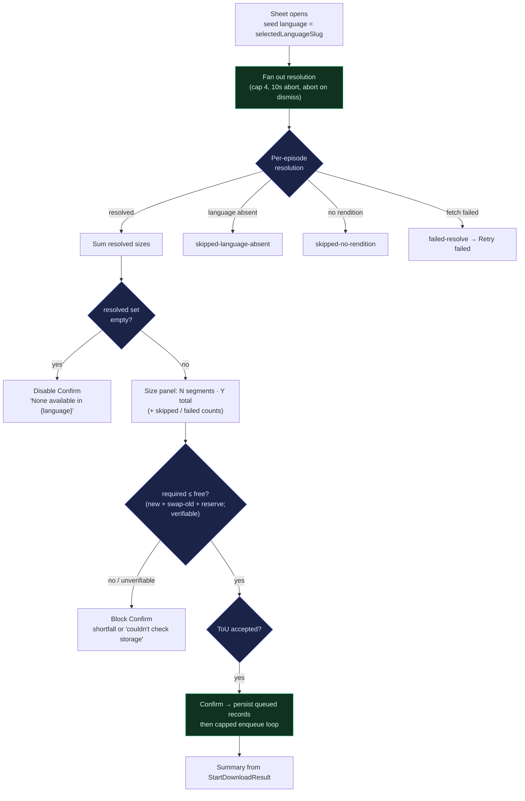
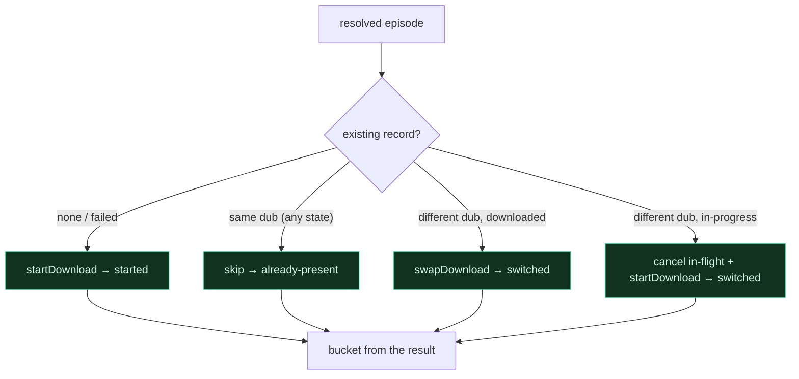

# feat: Mobile series download-all

## Summary

Add a "Download all" entry to the series detail page that opens a sheet, applies one quality / audio-language / subtitle choice across every episode, shows the combined size before the user accepts Terms of Use, and enqueues each episode through the already-shipped per-video download queue. This is U11 from the offline-downloads plan (`docs/plans/2026-06-16-001-feat-mobile-offline-video-downloads-plan.md`), deferred when the per-video path shipped (PRs #1326, #1338). The series path is orchestration on top of the shipped engine — no rework of the per-video flow.

---

## Problem Frame

The per-video offline-download feature shipped, but a series still has no way to download its episodes in one action — the series action row carries only Language and Share, with a comment asserting "a series has no single asset to download." A field viewer prepping a multi-episode series for offline viewing must open and download each episode by hand.

The reuse is real but not free. Episodes on the series screen are lean cards (`{ documentId, slug, label, title, posterUrl }`) with no embedded dubs, and the series GraphQL query is deliberately lean — the `birth-of-jesus` 2,259-dub / 9.5MB incident is why per-episode dub media is never projected into a series query. So "show the combined size" needs a lazy, per-episode resolution path that didn't exist for the per-video sheet (which inherits a single already-loaded dub). That resolution, an aggregate storage gate, a per-episode outcome taxonomy, and a batch language-switch are the genuinely new work; the download engine, queue, manifest, and URL re-resolution are reused unchanged.

---

## Key Technical Decisions

- KTD1. **Reuse the shipped per-video engine end-to-end.** `startDownload` / `swapDownload` / `downloadEngine` / `downloadUrlResolution` / `DownloadsProvider` are unchanged. The series path is a resolver plus a sheet that drives the provider once per episode. `DownloadsProvider` mounts at the root layout, so `useDownloads()` is reachable from `app/series/*`, and each `startDownload` call inherits the one-copy guard, the storage reserve, URL re-resolution, and validation per episode. (see origin: R7)

- KTD2. **Route B — lazy per-episode two-hop resolution.** When the sheet opens, resolve each episode on demand: `GET_VIDEO_BY_SLUG(slug)` → pick the dub whose `language.slug` equals the chosen language → `GET_VIDEO_DUB(dubDocumentId)` → `resolveFromMedia` / `selectRendition`. This is pay-for-use (fetches only when downloading, not on every series page load), additive (no change to the `apps/tv`-synced lean `seriesWatchVideoFragment`), and reuses two tested queries. The rejected alternative (project per-episode dub ids into `GET_SERIES_BY_SLUG`) would add an episodes×languages id matrix to every series page load and re-touch the fragment the 9.5MB incident hardened. (see origin: R6, R24)

- KTD3. **Language identity by `languageSlug`, never bcp47.** The one chosen language is matched against each episode's dubs by the unique `languageSlug` — bcp47 collides (`ko` vs `ko-kmr`, `en` vs `en-nai`, three Kurdish dialects share `kmr`), which would silently enqueue the wrong dub on episodes sharing a tag prefix. bcp47 is used only for best-effort device-locale seeding.

- KTD4. **A typed per-episode outcome taxonomy, bucketed from the provider result — not the pre-call decision.** Resolution classifies each episode into `resolved` / `skipped-language-absent` / `skipped-no-rendition` / `failed-resolve`. Enqueue classifies from the **actual** `StartDownloadResult` (or cancel-then-start result), never from the pre-call `decideEpisodeAction`: `ok:true` from start → `started`; `ok:true` from swap/switch → `switched`; `reason:"exists"` → `already-present`; `reason:"insufficient-storage"|"error"` → `couldnt-start`. This matters because a "swap" can return `exists` and no-op (e.g. an identical rendition, or an in-progress record), so bucketing from the decision would over-report `switched` when nothing changed. The size panel reads the resolution taxonomy; the summary reads the enqueue taxonomy.

- KTD5. **Aggregate "N of M" is a read-side intersection — no new persisted field.** `OfflineDownloadRecord` gains no `seriesSlug`. The series action row derives state by intersecting `series.episodes[].slug` with `useDownloads().downloadedSlugs` (for N) and `offlineRecords` (for the in-progress affordance). M is `series.episodes.length`. (see origin: R11)

- KTD6. **Block Confirm on an aggregate storage pre-check that budgets the transient swap footprint, and never green-light an unverifiable total.** The per-call guard is non-atomic, so the sheet pre-checks before Confirm. The required total is `Σ(new rendition sizes) + Σ(existing on-disk size of every swap/switch target, because the old copy lives alongside the new until verified) + the reserve`; budgeting only `Σ(new) + reserve` understates a Spanish-over-English batch and can strand on a near-full device. Two guards on the total: (a) if any resolved size is missing/zero the total is a **lower bound** — do not report "fits"; surface "size unverified" and block (or require an explicit proceed), never silently approve an understated total; (b) if `freeDiskBytes()` returns 0 (API unavailable) treat the gate as unverifiable and block with "couldn't check storage" rather than proceeding unguarded (the per-call backstop also no-ops on 0). The per-call guard remains the backstop. (see origin: R14)

- KTD7. **Both the resolution fan-out and the enqueue loop are concurrency-capped and abortable.** The repo has a per-id dedupe ledger (`ensureDubMedia` in `dubMediaFetch.ts`, with its sync-throw slot-leak guard) and an in-flight cap (`prefetchHeroStream` in `useHeroStream.ts`), but no combined helper. Add one (resolution cap 4, 10s per-episode `AbortController` timeout mirroring `reresolveMediaUrl`), aborted on sheet dismiss. The **enqueue** loop is also capped — swaps especially must not all be in flight at once, or peak old+new footprint exceeds the budgeted reserve. Copy-before-sort every Apollo-cached array (`[...arr].sort()` / `.toSorted()`) — in-place sort throws on the frozen cache.

- KTD8. **Sheet selection mirrors the per-video inherit pattern, plus a new subtitle picker.** Audio language is seeded from `selectedLanguageSlug`; the sheet's audio row is **tappable** and opens the existing series language sheet (`/series/language`) so the user can change it without leaving the flow (not a dead read-only row). Quality is the abstract Highest / High / Low tier, resolved per episode by `tierDownloads(episodeDownloads)` then **selecting the entry whose `.tier` matches the chosen label with a nearest-tier fallback** — never a shared positional index, since the tier array is variable-length (1 rendition → `[Highest]`, 2 → `[Highest, Low]`, 3+ → `[Highest, High, Low]`). The displayed total is the sum of _resolved_ renditions, not the tier's nominal size. Subtitle is a new single-language picker (a tap-to-open sub-sheet mirroring the audio language pattern) whose options are the **union** of subtitle languages across resolved episodes, default "No subtitles", resolved per episode via the same `GET_VIDEO_DUB` response and degrading to none where a track is absent.

---

## High-Level Technical Design

The sheet is a lifecycle: resolve on open, gate on size, enqueue on confirm, summarize. The per-episode decision at enqueue is the load-bearing branch.

The enqueue decision per resolved episode is **state-aware** (not just dub-id):

Notes: `swapDownload` only acts on a `downloaded` record (it falls through to `startDownload` otherwise, which returns `exists`). So an episode still downloading in the OLD language is not switched by a naive swap — it must be explicitly canceled and restarted in the new language (the `different dub, in-progress` branch), or the language change is silently lost. Quality-only differences within the same dub (same `dubDocumentId`) are `already-present`; the batch swaps on language change only. To survive backgrounding mid-Confirm, the loop persists a `queued` manifest record per resolved episode synchronously (no network) before driving transfers, so the existing queue processor / launch reattach finishes the batch even if the foreground loop is suspended.

---

## Requirements

Carried from the origin brainstorm's series scope (R6, R7, R11, R14, AE9) with plan-local additions for the outcome taxonomy and the v1 batch language-switch.

**Series selection & terms**

- R1. The series detail page exposes a "Download all" entry that opens a download sheet. (see origin: R6)
- R2. The sheet applies one quality tier, one audio language (seeded from the series' selected language, changeable inline), and one subtitle choice (including "No subtitles") across every episode. (see origin: R6, R4)
- R3. The user must accept the existing Terms of Use before the batch can start. (see origin: R5)

**Size resolution & storage**

- R4. Before confirm, the sheet resolves each episode's chosen-dub rendition lazily (Route B) and shows the segment count and summed total size of the resolved set. (see origin: R6, AE9)
- R5. The sheet blocks Confirm when the summed footprint (new renditions plus the transient on-disk copies of swap targets) plus the reserve exceeds free space, or when the total is unverifiable (any zero/missing size, or free space unreadable); it never auto-deletes to make room. (see origin: R14)

**Enqueue & per-episode rules**

- R6. Confirm enqueues each resolved episode through the standard per-video queue; each follows the same one-copy, state, storage, and integrity rules as a single download, and the batch is persisted (queued records) so it survives backgrounding. (see origin: R7, R11)
- R7. Per-episode outcomes are classified from the provider result and summarized (started / switched / already present / skipped: language-absent or no-rendition / couldn't-start: storage or error). The summary is enqueue-framed, not completion-framed — it reports what was _started_, since `startDownload` returns on handoff, not on completion.
- R8. An episode already downloaded in a different audio language is switched via a non-destructive swap; one still downloading in a different language is canceled and restarted in the chosen language; one already in the chosen language (any state) is left as-is.

**Aggregate state**

- R9. The series action row derives and shows aggregate state ("N of M downloaded" plus an in-progress affordance) as a read-side intersection of episode slugs with the download records — no new persisted field. (see origin: R11)

**Reliability**

- R10. The pre-confirm resolution fan-out is concurrency-capped, per-episode-timeout-bounded, and aborted on sheet dismiss; partial resolution does not block the resolved set; a total or offline failure shows an offline-distinct retry rather than an empty "0 segments"; an all-skipped resolved set disables Confirm with a "none available in this language" message. (see origin: R24)

---

## Implementation Units

### U1. Concurrency-capped, abortable fan-out helper

- **Goal:** A reusable primitive that maps N items through an async fn with a concurrency cap, an `AbortSignal`, and per-item settled results (never rejects the whole batch). Used by U2's resolution fan-out and U3's enqueue loop.
- **Requirements:** R10.
- **Dependencies:** none.
- **Files:** `apps/mobile/src/lib/concurrentMap.ts`, `apps/mobile/src/lib/__tests__/concurrentMap.test.ts`.
- **Approach:** `mapWithConcurrency(items, limit, fn, signal)` returns `Promise<Array<{ status: "fulfilled"; value } | { status: "rejected"; reason }>>`. Models the in-flight counter on `prefetchHeroStream` (`MAX_PREFETCH_INFLIGHT`) and the abort on `reresolveMediaUrl`. A synchronous throw inside `fn` for one item must settle that item as rejected and free its slot, not abort the run (the sync-throw slot-leak discipline from `dubMediaFetch.ts`). On `signal.abort()`, in-flight items settle rejected and no further items start. Two consumers in this plan (resolution fan-out, enqueue loop), each with its own cap — the isolated cap/abort/sync-throw semantics are unit-tested here rather than re-derived inline twice.
- **Execution note:** Test-first — the cap, abort, and sync-throw semantics are the whole point and are easy to get subtly wrong.
- **Patterns to follow:** `apps/mobile/src/hooks/useHeroStream.ts` (`prefetchHeroStream` in-flight cap), `apps/mobile/src/lib/dubMediaFetch.ts` (sync-throw guard), `apps/mobile/src/contexts/DownloadsProvider.tsx` (`reresolveMediaUrl` AbortController).
- **Test scenarios:**
  - Happy: 10 items, cap 4 → at most 4 run concurrently; all results returned in input order.
  - Edge: a `fn` that throws synchronously for one item settles it rejected and does not stall the remaining items.
  - Edge: an item whose promise rejects settles rejected; siblings still resolve.
  - Error: `signal` already aborted → resolves to all-rejected with no `fn` calls; abort mid-run starts no new items.
- **Verification:** Concurrency never exceeds the cap; one item's failure never fails the batch; abort halts new work.

### U2. Shared tiering extraction + series download resolver

- **Goal:** Make the per-video tiering/format helpers importable, then turn a series' episodes plus one `{ qualityTier, languageSlug, subtitleLanguageSlug }` choice into a typed per-episode resolution with a summed size, and decide start/swap/switch/skip per episode.
- **Requirements:** R2, R4, R5, R7, R8.
- **Dependencies:** U1.
- **Files:** `apps/mobile/src/lib/downloadTiers.ts` (new — extracted), `apps/mobile/src/components/watch/DownloadSheet.tsx` (re-import the extracted helpers), `apps/mobile/src/lib/seriesDownloadResolver.ts`, `apps/mobile/src/lib/__tests__/seriesDownloadResolver.test.ts`.
- **Approach:** First extract `tierDownloads`, `formatFileSize`, and the `QualityTier` / `TieredDownload` types from `DownloadSheet.tsx` (where they are module-private) into `src/lib/downloadTiers.ts`, export them, and re-import in `DownloadSheet.tsx` so the per-video sheet and the series resolver share one tiering implementation (no copy-paste drift). Then export a pure `resolveSeriesDownload(episodes, choice, deps, signal)` where `deps = { fetchVideoBySlug, fetchVideoDub }` are injected (the route wires the real `client.query` versions; tests inject mocks). Per episode, via `mapWithConcurrency`: `fetchVideoBySlug(slug)` → pick the dub with `language.slug === choice.languageSlug` (absent → `skipped-language-absent`) → `fetchVideoDub(dubDocumentId)` → `tierDownloads(downloads)`, select the entry whose `.tier === choice.qualityTier` with a nearest-tier fallback (none → `skipped-no-rendition`). Resolve the subtitle by reusing `resolveFromMedia(normalizeDubMedia(dub), { subtitleLanguageSlug })` (which returns `subtitleUrl` + `subtitleMissing`) rather than matching raw `videoEdition.subtitles` — same tested selection the per-video sheet uses. Sum `Number(rendition.size)` across `resolved` episodes; when any resolved size is missing/zero, mark the total a lower bound (consumed by KTD6's gate, not just display). Copy every Apollo array before sorting. Also export `decideEpisodeAction(record, resolution) → "start" | "swap" | "switch" | "skip"`: no record or `failed` → start; same `dubDocumentId` → skip; different `dubDocumentId` and record `downloaded` → swap; different `dubDocumentId` and record in-progress (`queued`/`downloading`/`paused`) → switch (cancel + start).
- **Execution note:** Test-first on the taxonomy and `decideEpisodeAction` — every downstream UI count maps to a bucket.
- **Patterns to follow:** `apps/mobile/src/lib/downloadUrlResolution.ts` (`resolveFromMedia` / `selectRendition` / `selectSubtitle` fallback chains), `apps/mobile/src/lib/normalizeVideo.ts` (`normalizeDubMedia`), `apps/mobile/src/lib/dubMediaFetch.ts` (`ensureDubMedia` dedupe ledger keyed per id).
- **Test scenarios:**
  - Happy: 5 episodes all available in the chosen language → 5 `resolved`, total = sum of resolved rendition sizes.
  - Edge: `Covers AE2.` chosen language absent on some episodes → those are `skipped-language-absent`, counted, never dropped or failed.
  - Edge: tier selection is by label, not index — an episode with 2 renditions (`[Highest, Low]`) under a "High" choice falls back to the nearest tier, never indexes out of bounds or silently picks "Low".
  - Edge: an episode with no downloadable rendition → `skipped-no-rendition`; a missing subtitle track → resolved with `subtitleMissing`, not a failure.
  - Edge: a resolved rendition with zero/missing size → total flagged as a lower bound.
  - Error: `fetchVideoBySlug` / `fetchVideoDub` rejects or times out → `failed-resolve`; siblings still resolve.
  - Decision: no/failed record → `start`; same `dubDocumentId` → `skip`; different + `downloaded` → `swap`; different + `downloading` → `switch`.
- **Verification:** A mixed series yields a correct four-way resolution split and an accurate resolved-set total; `decideEpisodeAction` returns `switch` (not `skip`) for an in-progress old-language episode; the per-video sheet still tiers correctly after the extraction.

### U3. Series download sheet route

- **Goal:** The formSheet that resolves on open, shows the size panel and all its edge states, gates on storage and Terms of Use, persists then enqueues on Confirm, and summarizes outcomes from the provider results.
- **Requirements:** R1, R2, R3, R4, R5, R6, R7, R8, R10.
- **Dependencies:** U2.
- **Files:** `apps/mobile/app/series/download.tsx`, `apps/mobile/app/series/_layout.tsx` (register the `download` screen), `apps/mobile/src/components/watch/DownloadSheet.tsx` (export `TermsModal` or extract it for reuse), `apps/mobile/src/contexts/DownloadsProvider.tsx` (export `STORAGE_RESERVE_BYTES`; add a synchronous batch-persist entry so queued records are written before network), `apps/mobile/app/series/__tests__/download.test.tsx`.
- **Approach:** Register `download` in `app/series/_layout.tsx` with `{ ...SHEET_BASE_OPTIONS, sheetAllowedDetents: [...DOWNLOAD_SHEET_DETENTS] }`; the route is already inside `SeriesSessionProvider`. Read `series.episodes` / `selectedLanguageSlug` / `languages` from `useSeriesSession()` and the provider API from `useDownloads()` / `useWatchPreferences()`. On mount run `resolveSeriesDownload` (U2) with an `AbortController` (aborted on unmount), injecting `client.query(GET_VIDEO_BY_SLUG, …)` and `client.query(GET_VIDEO_DUB, { fetchPolicy: "cache-first" })`. Render an inline-changeable audio-language row (tap → `/series/language`), a quality tier picker, a subtitle-language sub-sheet (union of resolved-episode subtitle languages, default "No subtitles"), and the Terms-of-Use gate (reuse the extracted `TermsModal`). **Sheet states:** resolving → `Resolving X of N…` progress (X counts settled episodes; spinner while X=0; pickers visible but Confirm disabled); total/offline failure → `SheetError` with an offline-distinct message + Retry; partial → size panel showing resolved `N segments · Y total`, a combined skipped line, and a "Retry failed" that re-runs only `failed-resolve` episodes while Confirm stays available on the resolved set; all-skipped (resolved set empty) → Confirm disabled with "None of the episodes are available in {language}". Run KTD6's storage pre-check (block on shortfall / lower-bound / unreadable free space). On Confirm: persist a `queued` record per resolved episode synchronously, then run the capped enqueue loop calling `decideEpisodeAction` → `startDownload` / `swapDownload` / cancel+`startDownload` / skip, bucketing each episode from its actual result (KTD4). Show an enqueue-framed summary panel built from the buckets (suppress zero-count buckets; `already-present` reads "already downloaded"); an all-`ok` batch dismisses with the existing "Download started" snackbar. Give the inner FlashList an explicit height from the detent and set `maintainVisibleContentPosition={{ disabled: true }}`.
- **Patterns to follow:** `apps/mobile/app/watch/download.tsx` (sub-state gates, ToU gate, enqueue call shape, `insufficient-storage` stay-on-sheet), `apps/mobile/src/components/watch/DownloadSheet.tsx` (`tierDownloads` via the new `downloadTiers`, `TermsModal`), `apps/mobile/app/watch/_layout.tsx` (route registration), `apps/mobile/app/series/language.tsx` (the audio-language sub-sheet), `apps/mobile/src/components/watch/SheetLoading.tsx` / `SheetError.tsx`.
- **Test scenarios:**
  - Happy: `Covers AE1.` opening the sheet renders "N segments · Y total" from the resolved set before Confirm; Download is disabled until ToU is accepted.
  - Edge: `Covers AE3.` required total (new + swap-old + reserve) > free → Confirm blocked, shortfall shown, nothing enqueued; a lower-bound or unreadable total blocks with "size unverified" / "couldn't check storage".
  - Edge: `Covers AE8.` all episodes skipped → Confirm disabled, "none available in {language}" shown (distinct from the SheetError total-failure path).
  - Integration: `Covers AE4.` Confirm calls `startDownload` for new episodes, `swapDownload` for downloaded different-language episodes, cancel+`startDownload` for in-progress different-language episodes, and skips same-language records; the summary buckets from results, so a swap that returns `exists` counts `already-present`, not `switched`.
  - Integration: `Covers AE5.` a same-language record in `downloading` state → counted already-present (not re-enqueued).
  - Edge: `Covers AE6.` the post-Confirm summary uses enqueue language ("started / switched / skipped / couldn't start"), not "downloaded".
  - Edge: resolution total failure → `SheetError` with retry (not "0 segments"); "Retry failed" re-runs only the failed episodes; offline shows the offline-distinct message.
  - Edge: dismissing the sheet mid-resolution aborts the fan-out (no post-unmount state updates); the persisted queued records survive a simulated backgrounding mid-Confirm.
- **Verification:** In the simulator on a multi-episode series, the sheet shows the summed total, blocks on a contrived storage shortfall, a Confirm enqueues new episodes while swapping/switching ones in another language, and backgrounding mid-Confirm still completes the batch.

### U4. Series action row Download entry and aggregate state

- **Goal:** Add a "Download all" action to the series row and surface aggregate download state for the series.
- **Requirements:** R1, R9.
- **Dependencies:** U3.
- **Files:** `apps/mobile/src/components/watch/SeriesActionRow.tsx`, `apps/mobile/app/series/[slug].tsx`, `apps/mobile/src/components/watch/__tests__/SeriesActionRow.test.tsx`.
- **Approach:** Add a Download `ActionItem` (`arrow-down-circle-outline`) as a third entry, retune `styles.row` `gap` (currently `64`, sized for two; verify the three-item row on a 320pt-width device), and replace the "a series has no single asset to download" comment. Add an aggregate-state prop `downloadState: { downloaded: number; total: number; inProgress: boolean }`. In `app/series/[slug].tsx`, derive it from `useSeriesSession().series.episodes` intersected with `useDownloads().downloadedSlugs` (downloaded count) and `offlineRecords` filtered to `queued` / `downloading` / `paused` (in-progress flag); pass `onDownload={() => router.push("/series/download")}`. Labels: "Download all" when downloaded = 0 and not in-progress; "Downloading… (N of M)" when in-progress; "All downloaded" when downloaded = M; otherwise "N of M downloaded". M = `episodes.length`, N = `downloaded` only, `failed` excluded from N. The action stays tappable in every state (re-opening the sheet allows a language change); set an `accessibilityLabel` matching the visible label.
- **Patterns to follow:** existing `SeriesActionRow` `ActionItem` map and `app/series/[slug].tsx` render site (`onLanguage` → `router.push("/series/language")` precedent); `useDownloads()` selectors (`downloadedSlugs`, `offlineRecords`).
- **Test scenarios:**
  - Happy: 0 downloaded → "Download all"; some downloaded → "N of M downloaded"; all downloaded → "All downloaded".
  - Edge: an in-progress record shows "Downloading… (N of M)" without changing N; a `failed` record is excluded from N.
  - Integration: deleting one episode's download individually recomputes N from the intersection (no stale persisted count).
  - Edge: three-item row renders without clipping on a narrow device (verify in simulator); each state has a distinct `accessibilityLabel`.
- **Verification:** The row shows an accurate live state that updates as downloads complete or are deleted, and the Download action opens the series sheet in every state.

---

## Acceptance Examples

These are plan-local (AE1–AE8); the `Covers AE<N>.` links in the units above reference these, with the origin acceptance example noted in parentheses where one maps.

- AE1. Series total before confirm. **Covers R4.** **Given** a series of N episodes and a chosen quality / language, **When** the user opens "Download all", **Then** the sheet shows "N segments · Y total" for the resolved set before they confirm. (origin AE9)
- AE2. Language-absent episodes are skipped, not failed. **Covers R7.** **Given** a chosen language present on only some episodes, **When** the sheet resolves, **Then** the absent episodes are shown as skipped and counted, never silently dropped or shown as errors.
- AE3. Won't-fit (or unverifiable) blocks the batch. **Covers R5.** **Given** the required total (new renditions + swap-target on-disk copies + reserve) exceeds free space, or any size is unknown, **When** the user reaches Confirm, **Then** Confirm is blocked with the shortfall or a "size unverified" notice, and nothing is started or deleted.
- AE4. Batch language switch survives failure. **Covers R8.** **Given** episodes downloaded in English, **When** the user picks Spanish and Download all, **Then** those episodes swap to Spanish non-destructively, and an episode whose swap fails keeps its English copy.
- AE5. Re-tap mid-batch doesn't double-enqueue. **Covers R7.** **Given** a batch still downloading in the chosen language, **When** the user re-opens Download all, **Then** in-progress same-language episodes count as already-present and are not enqueued again.
- AE6. Summary is enqueue-framed and result-derived. **Covers R7.** **Given** a confirmed batch, **When** the summary shows, **Then** it reports started / switched / skipped / couldn't-start derived from the provider results — a swap that no-ops (`exists`) counts already-present, not switched.
- AE7. In-progress old-language episode is switched. **Covers R8.** **Given** an episode still downloading in English, **When** the user picks Spanish and Download all, **Then** that episode is canceled and restarted in Spanish (not left finishing in English and reported as already-present).
- AE8. All-skipped disables Confirm. **Covers R10.** **Given** a chosen language absent on every episode, **When** the sheet resolves, **Then** Confirm is disabled with a "none available in this language" message, distinct from a network-failure error state.

---

## Scope Boundaries

**Deferred for later** (from origin)

- Holding more than one audio language offline for the same video — a series re-download in a new language _swaps_ (replaces), it does not stack.

**Deferred to Follow-Up Work** (plan-local)

- The origin's series-edge-case question (a segment lacking the chosen quality or language) is resolved here: per-episode fallback in U2 (nearest tier; skip-and-report for absent language) and aggregate state in U4. What stays deferred is a per-segment override UX (picking a different language or quality for one episode only).
- Per-episode quality re-selection from the batch — the batch swaps on language change only; a same-language quality change stays a per-video action.
- A combined per-episode progress view for an in-flight series batch beyond the action-row state.
- Per-item batch queue controls (pause / reorder / cancel the whole series at once) — individual items use the existing per-video controls.

**Outside this product's identity** (from origin)

- DRM / encryption-at-rest; exporting a raw shareable file.

---

## Open Questions

- **In-progress old-language switch policy.** The plan's default (AE7) cancels an in-flight old-language download and restarts it in the chosen language, discarding partial bytes. The alternative is to defer the switch until the in-flight download completes and report it distinctly. Cancel-and-restart is chosen because it is faithful to the user's explicit language choice; confirm before implementing U2's `decideEpisodeAction` switch branch.
- Concurrency caps and per-episode timeout (resolution cap 4, 10s; an enqueue cap small enough that concurrent swap old+new footprint stays within the budgeted reserve) are set as defaults; tune against deployed admin (prod runs ~10–25× slower than local). The per-episode fan-out uses `GET_VIDEO_BY_SLUG` / `GET_VIDEO_DUB`, not the un-indexed `childDubLanguages` path, so the 2.5–4.9s aggregation cost does not apply here.

---

## Risks & Dependencies

- **Re-bloating the lean series query** (high, mitigated) — never add `dubs` / `downloads` back to `seriesWatchVideoFragment` or the `children` projection; Route B (KTD2) keeps resolution off the series query entirely. The fragment is SYNC-tagged with `apps/tv/src/lib/videoQueries.ts`.
- **Swap doubles transient on-disk footprint** (high, mitigated) — a batch of non-destructive swaps keeps each old copy until the new one verifies; the storage pre-check budgets `Σ(new) + Σ(swap-target old sizes) + reserve` and the enqueue cap bounds how many are in flight (KTD6, KTD7).
- **In-progress language switch is not a swap** (high, mitigated) — `swapDownload` only acts on `downloaded` records; `decideEpisodeAction` routes in-progress old-language episodes to cancel+restart (KTD4, AE7), else the language change is silently lost.
- **Apollo frozen-array crash** (medium) — every dub / rendition / episode array sorted in the resolver must be copied first; the bug reproduces only on a warm cache, so fresh-object unit tests won't catch it (KTD7).
- **Unverifiable storage total** (medium, mitigated) — a lower-bound total (zero/missing sizes) or `freeDiskBytes()===0` blocks Confirm rather than silently approving an under-counted batch (KTD6).
- **bcp47 language collision** (medium) — match by `languageSlug` only (KTD3).
- **Background-batch completion** (medium, mitigated) — the Confirm loop persists `queued` records synchronously before any network await, so a backgrounded mid-Confirm still completes via the queue processor / launch reattach; verify in the simulator with the `withBackgroundDownloaderAppDelegate` plugin active.
- **Slow N-episode fan-out** (low) — surfaced via "Resolving X of N…" progress and an abortable, capped fan-out; the user can Retry failed and Confirm on the resolved set.

---

## Sources / Research

- Origin (series scope R6, R7, R11, R14, F2, AE9 + the deferred series-edge-case question): `docs/brainstorms/2026-06-16-mobile-offline-video-downloads-requirements.md`.
- Deferred unit this implements: U11 in `docs/plans/2026-06-16-001-feat-mobile-offline-video-downloads-plan.md`.
- Shipped engine to reuse: `apps/mobile/src/contexts/DownloadsProvider.tsx` (`startDownload` / `swapDownload` — note `swapDownload` only acts on `downloaded` records — `getRecord` / `downloadedSlugs` / `offlineRecords`, `STORAGE_RESERVE_BYTES` [needs export], `reresolveMediaUrl`, the `freeDiskBytes()===0` don't-block sentinel), `apps/mobile/src/lib/downloadUrlResolution.ts` (`resolveFromMedia` / `selectRendition` / `selectSubtitle`), `apps/mobile/src/lib/offlineManifest.ts` (`OfflineDownloadRecord` stores `dubDocumentId`), `apps/mobile/src/lib/offlineFileSystem.ts` (`freeDiskBytes`).
- Helpers to extract/export (currently module-private): `tierDownloads` / `formatFileSize` / `TermsModal` in `apps/mobile/src/components/watch/DownloadSheet.tsx`.
- Sheet + route to mirror: `apps/mobile/app/watch/download.tsx`, `apps/mobile/app/watch/_layout.tsx` (`DOWNLOAD_SHEET_DETENTS`), `apps/mobile/src/components/watch/SheetLoading.tsx`, `apps/mobile/src/components/watch/SheetError.tsx`, `apps/mobile/app/series/language.tsx`.
- Series surfaces: `apps/mobile/src/contexts/SeriesSessionProvider.tsx`, `apps/mobile/app/series/[slug].tsx`, `apps/mobile/app/series/_layout.tsx`, `apps/mobile/src/components/watch/SeriesActionRow.tsx`.
- Queries: `apps/mobile/src/lib/queries.ts` (`GET_SERIES_BY_SLUG`, `seriesWatchVideoFragment`, `GET_VIDEO_BY_SLUG`, `GET_VIDEO_DUB`), `apps/mobile/src/lib/normalizeVideo.ts` (`WatchEpisode`, `WatchChildLanguage`, `normalizeDubMedia`).
- Concurrency / fetch patterns: `apps/mobile/src/lib/dubMediaFetch.ts` (`ensureDubMedia` dedupe ledger, sync-throw guard), `apps/mobile/src/hooks/useHeroStream.ts` (`prefetchHeroStream` in-flight cap).
- Learnings: `docs/solutions/design-patterns/lean-bulk-lazy-per-item-graphql-fetch-20260604.md`, `docs/solutions/performance-issues/tv-mobile-series-detail-overfetch-and-childdublanguages-index-20260619.md`, `docs/solutions/best-practices/language-identity-on-slug-not-bcp47-20260605.md`, `docs/solutions/runtime-errors/apollo-inmemorycache-frozen-array-sort-crash-20260616.md`, `docs/solutions/best-practices/flashlist-v2-maintainvisiblecontentposition-default-20260605.md`, `docs/solutions/best-practices/bottom-sheet-migration-expo-sdk54-pitfalls-20260527.md`, `docs/solutions/developer-experience/verifying-mobile-expo-worktree-changes-in-simulator-20260608.md`.
- iOS background-session plugin (memory-only gotcha): `apps/mobile/plugins/withBackgroundDownloaderAppDelegate.js`.
