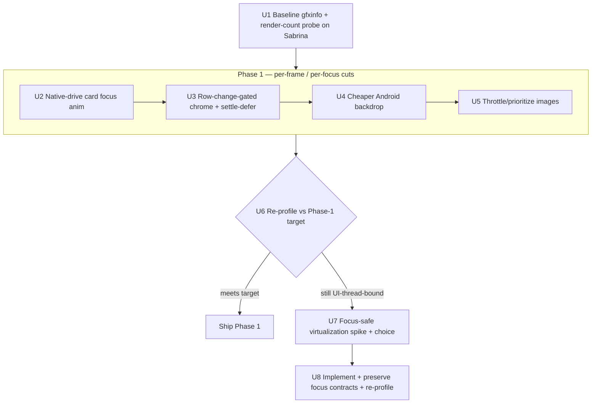
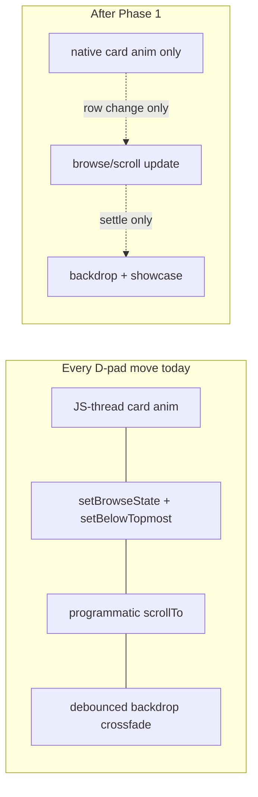

# perf: Smooth Android TV home D-pad navigation

## Summary

Cut the per-move **UI-thread** cost of D-pad navigation on the `apps/tv` home screen so it's fluid on the cheapest Android TV. Measure-gated, two-phase: Phase 1 lands low-risk per-frame/per-focus reductions (native-drive the card focus animation, stop per-horizontal-move chrome/scroll churn, cheaper Android backdrop, throttle image loads), then re-profile; Phase 2 virtualizes off-screen rails **only if** the UI thread is still saturated. Apple TV behavior and visuals are untouched.

---

## Problem Frame

On `apps/tv/app/index.tsx`, a `dumpsys gfxinfo` capture on a Chromecast with Google TV (Sabrina) during a D-pad sweep measured **117/117 frames janky (100%)**, **50th-percentile 150ms** (99th 250ms; 60fps budget is 16ms), **72 frames "Slow UI thread"**, **91 missed vsyncs** — a UI-thread (CPU) bottleneck, not GPU. Research (see Sources) confirms the cost sources and corrects one origin assumption:

- All ~8 section rails mount at once (`app/index.tsx` `model.sections.map(...)` inside a plain `ScrollView`, no vertical virtualization) → every card across every rail mounts its Image and its own `useFocusAnimation` Animated value.
- **The card focus animation is JS-driven.** `apps/tv/src/components/watch/useFocusAnimation.ts` uses `useNativeDriver: false` on purpose (it interpolates into `shadowOpacity`/colors). On every D-pad move a ~180ms JS-thread `Animated.timing` runs on the focused **and** blurred `HomeCard` — directly on the hot path. (Origin doc named `needsOffscreenAlphaCompositing`/`renderToHardwareTextureAndroid` as the cost; those props live only in the legacy `FocusableCard`, which is **not** on the home screen — see origin: `docs/brainstorms/2026-06-23-tv-android-home-performance-requirements.md`.)
- Per-focus fan-out: a single card focus fires `setBrowseState` + `setBelowTopmost` + a programmatic `scrollTo` **immediately on every move** (even within-row horizontal moves), and arms the debounced showcase commit that re-renders `HomeScreen` and starts a ~600ms full-screen backdrop crossfade.
- ~50+ image decodes kick off on mount; no `priority`/`cachePolicy` on home images, no throttling.

This surfaced only because the focus fix on this branch turned per-view `onFocus` on for Android for the first time — it is the natural follow-up, not a regression.

---

## Key Technical Decisions

- **KTD1 — Retarget the card-focus lever to the native driver.** The win on `HomeCard` is moving transform (translateY+scale) and the ring opacity to `useNativeDriver: true`, and removing the JS-driven `shadowOpacity` from the Android hot path (shadow can't be native-animated). Not "drop offscreen compositing" — that prop isn't on `HomeCard`. tvOS keeps the full treatment.
- **KTD2 — Single-slot / poster-only ambient backdrop on Android.** Replacing the two-slot full-screen crossfade (`HomeBackdrop.tsx`) with a cheaper single-slot/poster ambient on Android both cuts per-move decode+crossfade cost and sidesteps the known A→B→A cached-slot freeze (see Sources). tvOS keeps the crossfade.
- **KTD3 — Gate chrome/scroll updates on row change; defer heavy work to focus-settle.** Within-row horizontal moves must not run `setBrowseState`/`setBelowTopmost`/`scrollTo`. Those fire only on a row transition; the backdrop/showcase commit stays settle-deferred. This makes a horizontal sweep cost only the (now native) card animation.
- **KTD4 — Measure-gated Phase 2; prefer focus-safe viewport-gated lazy-mount over recycling.** If Phase 1 misses target, not-mounting off-screen rails is the structural lever. A recycling list (FlashList/`VirtualizedList`) recycles/unmounts rows the focus engine targets (the `RailPad` over-hang cells, the row's `onLayout`-measured `y`), risking the focus contract. The lower-risk default is a viewport-gated lazy-mount (`LazySection` pattern), final mechanism chosen at the Phase 2 spike.
- **KTD5 — Every Android cut is platform-gated; tvOS untouched; no regression to the focus bridge.** All changes guard on `Platform.OS === "android"`. The committed `patches/react-native-tvos@0.81.5-2.patch` (Pressable→`tvFocusEventHandler`) must keep working — focus rings/scale must still appear and track focus on Android.
- **KTD6 — Verification is real-device, not local.** Local timing is unrepresentative (10–25×). Each gate is a Sabrina `gfxinfo` capture plus a focus-traversal smoke (cross-rail column preservation, hero↔rail bridge, restore-last-focus, RailPad over-hang). Pure decision logic (image-throttle, Phase-2 windowing) gets colocated unit tests; animations/visuals are verified on-device.

---

## High-Level Technical Design

The measure-gated flow and the per-focus work split:

Per-focus work, before vs after Phase 1:

_Directional guidance for review — not implementation specification._

---

## Implementation Units

### Phase 0 — Measurement

### U1. Establish the jank measurement gate + quantify fan-out

- **Goal:** A repeatable Sabrina `gfxinfo` capture over a fixed D-pad sequence, recorded as the baseline and re-run after each phase; plus a one-off render-count probe to quantify per-move re-render fan-out.
- **Requirements:** R1, R2; SC1.
- **Dependencies:** none.
- **Files:** `docs/plans/` measurement note (the fixed sequence + adb commands, recorded with results); temporary, **non-committed** render-count instrumentation in `apps/tv/app/index.tsx` and `apps/tv/src/components/home/HomeCard.tsx` (reverted before the Phase 1 commits).
- **Approach:** Define the sequence (e.g. DOWN into rail 1, 5× RIGHT, DOWN, 5× RIGHT, UP, LEFT). `dumpsys gfxinfo org.jesusfilm.forgetv reset` → drive sequence via `adb input keyevent` → dump and record Total/Janky frames, percentiles, Missed Vsync, Slow UI thread. Temporary `console.count` in `HomeScreen` render and `HomeCard` render confirms how many components re-render per single focus move (validates KTD3's premise).
- **Patterns to follow:** real-device measurement per the series-detail perf learning (local timing 10–25× off).
- **Execution note:** measure-first — this baseline is the gate every later unit compares against.
- **Test expectation:** none — measurement/instrumentation, no shipped behavior.
- **Verification:** baseline numbers recorded; fan-out quantified (renders per move for `HomeScreen` and `HomeCard`).

### Phase 1 — Per-frame / per-focus cost reduction (no structural change)

### U2. Native-drive the home card focus animation

- **Goal:** Remove the per-move JS-thread animation. Drive transform (translateY + scale) and the focus-ring opacity on the native driver; drop the JS-driven `shadowOpacity` from the Android focus path.
- **Requirements:** R4, R6, R11, R12.
- **Dependencies:** U1.
- **Files:** `apps/tv/src/components/watch/useFocusAnimation.ts`, `apps/tv/src/components/home/HomeCard.tsx`; check `apps/tv/src/components/home/HomeHeroCarousel.tsx` (CTA/chevron share the hook).
- **Approach:** Split the single JS `progress` so transform + ring opacity use a native-driver value; on Android, render the focus state with the white ring only (no animated shadow). tvOS keeps the shadow/full treatment. Keep `focusTransform`'s memoize-at-call-site convention.
- **Patterns to follow:** `tv-carousel-card-focus-animation-overflow` (Animated, not React state); `rn-animated-react18-cleanup-review-false-positives` (only dependency-re-run / infinite-loop animations need `stop()` — do not churn finite native tweens).
- **Test scenarios:** if a pure interpolation helper is extracted, unit-test its input→output mapping (progress 0 → rest transform; progress 1 → lifted/scaled). The animation smoothness itself is verified on-device (U6), not unit-tested.
- **Verification:** on Sabrina, a within-row sweep shows the focus ring/scale tracking presses with no JS-thread animation on the move; rings still appear (no focus-bridge regression).

### U3. Gate chrome/scroll on row change; defer heavy work to settle

- **Goal:** A within-row horizontal move must not fire `setBrowseState`/`setBelowTopmost`/`scrollTo`. Fire row-dependent updates only on a row transition; keep the backdrop/showcase commit settle-deferred.
- **Requirements:** R3, R5.
- **Dependencies:** U1.
- **Files:** `apps/tv/app/index.tsx` (`handleRowFocus`/`handleCardFocus` wiring, the `belowTopmost`/`browseState` updates and the topmost rail's `restoreLastFocus` prop), `apps/tv/src/components/home/HomeRail.tsx` (`handleCardFocus` → call `onRowFocus` only on row entry), `apps/tv/src/components/home/homeScrollState.ts` (a pure "did the focused row change" decision).
- **Approach:** Track the current focused row; emit `onRowFocus` only on transition. `browseState`/`belowTopmost`/`scrollTo` update only then (preserving the existing row-anchored scroll + deferred-`onLayout`-`y` contract). Showcase stays debounced. Avoid re-rendering the topmost rail on every move (the `restoreLastFocus`/`belowTopmost` coupling).
- **Patterns to follow:** `tv-home-row-anchored-scroll-native-focus-scroll-disabled` — keep `resolveRowScrollTarget` pure, preserve the `null`-means-unmeasured contract and the y-cache reset on section-set change; pure `.ts` + colocated `.test.ts` convention (`homeScrollState.ts`).
- **Test scenarios:** `homeScrollState.test.ts` — same row twice → no row-focus event; new row → fires once with the new index; row set changes → measured-y handling unchanged. `Covers R3.`
- **Verification:** render-count probe (U1) shows a within-row move re-renders only the focused/blurred card, not `HomeScreen`; row changes still anchor-scroll correctly on Sabrina.

### U4. Cheaper Android ambient backdrop

- **Goal:** Replace the two-slot full-screen crossfade with a single-slot / poster-only ambient on Android, updated on settle. tvOS keeps the crossfade.
- **Requirements:** R7, R11.
- **Dependencies:** U3 (settle-gating).
- **Files:** `apps/tv/src/components/home/HomeBackdrop.tsx`.
- **Approach:** On Android, render one image slot that swaps the settled card's artwork (snap or a single short fade), not two stacked slots crossfading per move. Keep the deep-scrim/browse-state behavior. Confirm which card type is on screen (it is `HomeCard`) and validate compositing on a real Android TV.
- **Patterns to follow:** `tv-home-backdrop-crossfade-aba-stall` (the freeze a single slot sidesteps — don't assume `onLoad` re-fires for a cached slot); `android-tv-density-scaling-and-native-view-clipping` (validate `overflow`/native-view layering on-device); `tv-focus-driven-hero-patterns` (poster/image-based ambient, no video player on home).
- **Test scenarios:** none (visual) — `Test expectation: none — visual change, verified on-device`.
- **Verification:** on Sabrina, no per-move full-screen crossfade on Android; backdrop updates on settle without the A→B→A freeze; no invisible-native-view/clipping regression.

### U5. Throttle and prioritize home image loading

- **Goal:** Stop ~50+ simultaneous decodes on mount from dominating the main thread.
- **Requirements:** R8.
- **Dependencies:** U1.
- **Files:** `apps/tv/src/components/home/HomeCard.tsx` (Image `priority`/`cachePolicy`), and `HeroPager.tsx`/`HomeBackdrop.tsx` priority where appropriate; an optional pure capped/deduped prefetch decision in a new `apps/tv/src/lib/` helper if a pool is added.
- **Approach:** Adopt the mobile convention (`priority="low"` on rail card images, `cachePolicy="memory-disk"`); if a prefetch pool is added, mirror the capped+deduped+slot-leak-guarded shape from `useHeroStream`. Note: the structural fix for off-screen decodes is Phase 2 virtualization — this is the in-phase mitigation.
- **Patterns to follow:** `apps/mobile/src/components/home/HomeCard.tsx` (`priority="low"`), `apps/mobile/src/components/search/TopicCard.tsx` (`cachePolicy`), `apps/mobile/src/hooks/useHeroStream.ts` (capped/deduped pool).
- **Test scenarios:** if a pool helper is added, unit-test the concurrency cap + dedupe + slot release on a thrown load; otherwise `Test expectation: none — config props, verified on-device`.
- **Verification:** mount no longer kicks off all decodes at full priority; visible cards still populate promptly on Sabrina.

### U6. Phase 1 re-profile gate

- **Goal:** Re-run U1's measurement after U2–U5; compare to the Phase-1 target; decide whether Phase 2 is warranted.
- **Requirements:** R1, R2; SC1.
- **Dependencies:** U2, U3, U4, U5.
- **Files:** the U1 measurement note (append post-Phase-1 results + the gate decision).
- **Test expectation:** none — measurement/decision gate.
- **Verification:** post-Phase-1 Sabrina `gfxinfo` recorded; if it meets the Phase-1 target (SC1), stop and ship Phase 1; if still UI-thread-bound, proceed to U7. Decision recorded in the note.

### Phase 2 — Gated structural change (only if U6 misses target)

### U7. Focus-safe virtualization spike + mechanism choice

- **Goal:** Characterize the focus contract, then spike not-mounting off-screen rails and pick the mechanism that preserves it.
- **Requirements:** R9, R10, R2.
- **Dependencies:** U6 (gate).
- **Files:** spike in `apps/tv/app/index.tsx`; a new pure windowing module `apps/tv/src/components/home/homeRailWindow.ts` (+ `.test.ts`); possibly a `LazyRail` wrapper.
- **Approach:** First write the focus-traversal smoke checklist as the acceptance gate (cross-rail Up/Down column preservation, hero↔rail bridge, restore-last-focus, RailPad over-hang bounce). Then compare viewport-gated lazy-mount (`LazySection` pattern, extending the existing `onLayout`-`y` measurement — no `measureInWindow` at 60fps) vs a tuned `VirtualizedList`/FlashList (new tv dependency). Choose the option that keeps the 3 focus contracts and avoids the per-row Animated mount blow-up.
- **Patterns to follow:** `android-lazy-section-viewport-gating-oom-fix` (viewport-gated template; avoid 60fps `measureInWindow`); `react-native-tvos-flatlist-sheet-virtualization-pitfalls` (per-row Animated mount cost; cap mounted rows; focus-teleport artifact; Modal-`visible` keeps subtrees mounted); `tv-rail-overhang-pad-bounce-focus`, `tv-home-row-anchored-scroll-native-focus-scroll-disabled`, `tv-sticky-header-nextfocus-asymmetry-bridge` (the 3 contracts). Mobile `apps/mobile/src/components/home/HomeScreen.tsx` + `HomeShelf.tsx` (vertical FlashList feed of memoized rows) and tv `LanguagePanel.tsx`/`InPlayerMenu.tsx` (`windowSize`/`initialNumToRender`/`getItemLayout` recipe) as alternatives.
- **Execution note:** characterization-first — the focus-traversal smoke must exist and pass on the current build before structure changes, so a regression is detectable.
- **Test scenarios:** `homeRailWindow.test.ts` — given focused row + viewport, which rail indices are mounted (window includes a buffer above/below; first paint mounts the top window; descending focus expands). `Covers R9.`
- **Verification:** spike demonstrates off-screen rails not mounting while the focus-traversal smoke passes on Sabrina; mechanism chosen and recorded.

### U8. Implement chosen virtualization, preserve focus contracts, re-profile

- **Goal:** Implement the U7 choice; keep all R10 focus contracts; hit the Phase-2 target.
- **Requirements:** R9, R10, R12; SC1.
- **Dependencies:** U7.
- **Files:** `apps/tv/app/index.tsx`, `apps/tv/src/components/home/homeRailWindow.ts`, the rail wrapper(s).
- **Approach:** Apply the windowing/lazy-mount from U7. Preserve the `onLayout`-`y` measurement + cache-reset-on-section-change, keep `RailPad` cells targetable for whatever rails are mounted, keep the hero↔rail `TVFocusGuideView` bridge, and don't regress the topmost-rail restore-last-focus.
- **Patterns to follow:** as U7.
- **Test scenarios:** `homeRailWindow.test.ts` extended for mount/unmount transitions as focus moves; real-device focus-traversal smoke is the integration gate (mocks won't prove focus). `Covers R10.`
- **Verification:** Sabrina `gfxinfo` meets the Phase-2 stretch target (SC1); focus-traversal smoke passes (no stranded focus, no skipped shorter rail, hero↔rail intact, restore-last-focus intact).

---

## Success Criteria

- **SC1.** On Sabrina, over the U1 sequence: janky frames drop from 100% and median frame-time from ~150ms. **Phase 1 target:** < 50% janky and median < 33ms (30fps floor). **Phase 2 / stretch:** < 10% janky and median ≈ 16ms (60fps). Missed-vsync count drops proportionally. _(Confirmed targets; revisit if Phase 1 lands far above or below.)_
- **SC2.** A D-pad sweep across and between rails tracks presses with no visible lag on Sabrina.
- **SC3.** Apple TV navigation and visuals are unchanged — no visible or measured regression.

---

## Scope Boundaries

**In scope**

- The `apps/tv` home screen focus/navigation path (`app/index.tsx` + home components), Android TV.

**Deferred to Follow-Up Work**

- Phase 2 (U7–U8) is gated — undertaken only if U6 misses the Phase-1 target.
- A `/ce-compound` writeup consolidating "virtualize TV home rails without breaking the focus contract" if Phase 2 ships (no existing learning covers it).

**Out of scope**

- Other screens (watch, search, series) and the legacy `FocusableCard` — except where a shared change (image `priority` convention) helps for free.
- Initial-load and idle-ambient (hero auto-advance) as separate goals — improved only insofar as the nav work helps.
- Any tvOS visual or behavioral change; adding `@shopify/flash-list` to `apps/tv` unless U7 selects it.

---

## Risks & Dependencies

- **Virtualization vs. the focus contract (primary).** Phase 2 risks the row-anchored scroll (`onLayout`-`y`), the `RailPad` over-hang catcher, and the hero↔rail `TVFocusGuideView` bridge — `nextFocus*` silently no-ops across the offset sticky header, so these depend on mounted targets. Mitigation: characterization smoke before structure change (U7), and KTD4's preference for lazy-mount over recycling.
- **Android-only compositing quirks.** Changing card focus visuals (U2) and the backdrop (U4) touches `overflow:hidden` / native-view layering with documented Android-TV-only failures — change one thing at a time and screenshot on real Android TV.
- **Native-driver audit churn.** Don't "fix" finite native tweens or React-18 setState-after-unmount false positives (per the cleanup-false-positives learning) — only dependency-re-run / infinite-loop animations need `stop()`.
- **GPU contribution unconfirmed.** Sabrina doesn't report GPU frame timing; the diagnosis rests on the "Slow UI thread" signal. If Phase 1 underperforms versus the predicted UI-thread savings, re-examine GPU cost before Phase 2.
- **Dependency:** the committed `patches/react-native-tvos@0.81.5-2.patch` (Pressable focus bridge) must remain in effect — it is what makes Android focus visuals fire at all.

---

## Open Questions

**Resolve before / during planning** — resolved:

- Jank targets → SC1 (confirmed).
- Android backdrop → KTD2 single-slot/poster-only (confirmed acceptable).

**Deferred to implementation**

- Exact split of native vs JS values in `useFocusAnimation` (U2) — settled against real focus visuals.
- Whether U5 needs a prefetch pool or just `priority`/`cachePolicy` — decided from the U1 fan-out/decode profile.
- Phase 2 mechanism (lazy-mount vs FlashList vs tuned `VirtualizedList`) — chosen at the U7 spike against the focus-traversal smoke.

---

## Sources & Research

**Codebase (grounding):**

- `apps/tv/app/index.tsx` — home orchestrator: focus→state wiring, `sections.map` (no vertical virtualization), per-move `setBrowseState`/`scrollTo` fan-out.
- `apps/tv/src/components/watch/useFocusAnimation.ts` — JS-driver focus hook (the per-move hot path).
- `apps/tv/src/components/home/HomeCard.tsx`, `HomeRail.tsx` — memoized card/rail; `HomeCard` has no offscreen-compositing props (origin correction).
- `apps/tv/src/components/home/HomeBackdrop.tsx`, `HeroPager.tsx` — heavy per-move animation/image layers.
- `apps/tv/src/components/FocusableCard.tsx` — only place `needsOffscreenAlphaCompositing`/`renderToHardwareTextureAndroid` live (legacy, not home).
- `apps/mobile/src/components/home/HomeScreen.tsx`, `HomeShelf.tsx`, `apps/mobile/src/hooks/useHeroStream.ts` — Phase 2 prior art (vertical FlashList feed, memoized rows, capped/deduped concurrency).

**Institutional learnings (`docs/solutions/`):**

- `design-patterns/tv-home-row-anchored-scroll-native-focus-scroll-disabled-20260615.md` — row-anchored scroll contract (U3, U7/U8).
- `design-patterns/tv-rail-overhang-pad-bounce-focus-20260616.md` — RailPad over-hang catcher (U7/U8).
- `design-patterns/tv-sticky-header-nextfocus-asymmetry-bridge-20260619.md` — hero↔rail bridge (U7/U8).
- `best-practices/tv-focus-driven-hero-patterns-20260420.md` — Focus-Driven Showcase model (U4).
- `ui-bugs/tv-home-backdrop-crossfade-aba-stall-20260615.md` — A→B→A freeze a single-slot backdrop sidesteps (U4).
- `best-practices/rn-animated-react18-cleanup-review-false-positives-20260615.md` — native-driver audit rubric (U2).
- `best-practices/react-native-tvos-flatlist-sheet-virtualization-pitfalls.md` — TV list virtualization + per-row Animated cost (U7/U8).
- `mobile/android-lazy-section-viewport-gating-oom-fix.md` — viewport-gated lazy-mount template (U7/U8).
- `ui-bugs/android-tv-density-scaling-and-native-view-clipping-20260416.md` — Android-TV compositing blast radius (U2, U4).
- `ui-bugs/tv-carousel-card-focus-animation-overflow-20260416.md` — Animated-not-state focus (U2).

**Measurement baseline (Sabrina Chromecast, 2026-06-23):** 117/117 janky, 50th 150ms / 99th 250ms, 72 slow-UI-thread, 91 missed-vsync.
