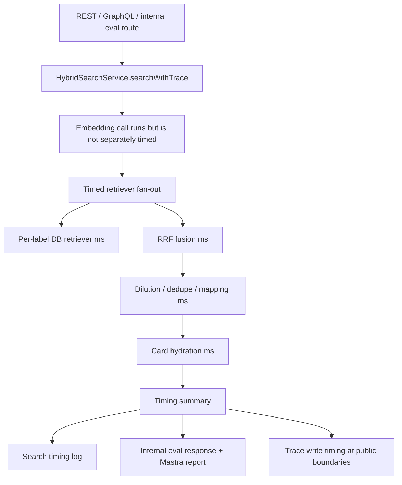

# feat: Add Search Path Latency Logging

## Summary

Add production-safe timing visibility to Admin search so keyword-first, hybrid,
and internal semantic-only searches report where latency is spent. The first
slice measures route/service work, DB-backed retriever calls, fusion, dilution,
dedupe, mapping, hydration, and trace writes; it intentionally does not measure
embedding latency.

---

## Problem Frame

`feat-175` needs production evidence before the next optimization move. Current
prod-backed eval artifacts show whole-query latency around 4.2-4.6 seconds on
average, but the Admin search path does not expose the stage timings needed to
separate DB retrieval cost from RRF, hydration, trace persistence, or transport.

The requested implementation should add the missing measurement layer without
changing public search response shape, leaking search query text, or timing the
embedding provider call.

---

## Requirements

- R1. Emit a production-visible search timing log for successful and degraded
  Admin search requests across REST, GraphQL, and the internal eval route.
- R2. Include DB-backed retrieval elapsed time per retriever label, including
  semantic video, keyword video, weighted keyword video, trigram video, exact
  title video, semantic experience, and keyword experience when they run.
- R3. Do not emit or return embedding latency, even though the embedding call
  remains part of total service time.
- R4. Include non-retriever timings for retrieval fan-out total, RRF fusion,
  dilution cap, dedupe, mapping, card hydration, trace write, and total search
  service time where the boundary can observe them.
- R5. Keep public REST and GraphQL response shapes unchanged.
- R6. Extend the internal search-eval contract and Mastra client/report types so
  per-query timing details survive strict schema parsing and later eval reports.
- R7. Logs and artifacts must not include raw query text, raw vectors, bearer
  tokens, user ids, IPs, or per-result debug payloads.
- R8. Timing values must be bounded non-negative millisecond numbers and use the
  existing `[search] event=name key=value` log format that Railway surfaces.

---

## Key Technical Decisions

- **Measure retriever promises as DB retrieval timing:** Each retriever function
  is the service-level DB retrieval boundary. Wrapping the promises where the
  orchestrator dispatches them gives per-label timing without rewriting raw SQL
  or leaking parameters.
- **Return timings only from internal trace/eval surfaces:** Public search
  responses stay stable. `searchWithTrace` can return a timing summary beside
  the existing internal trace metadata, while REST and GraphQL use it only for
  logs and trace-write measurement.
- **Do not split out embedding latency:** Total search time still includes
  embedding because users wait for it, but no `embeddingMs` field is produced.
  That matches the requested measurement boundary.
- **Teach Mastra the new internal eval shape in the same PR:** The eval client
  currently uses a strict Admin search response schema. Adding timing fields to
  the internal route requires matching parser, runner, artifact, and report
  updates so the data is not discarded or rejected.
- **Keep log fields parser-friendly:** Emit only controlled labels, modes,
  route names, counts, and numeric timings. Use the plain-string `event=...`
  format documented for Railway logsV2.

---

## High-Level Technical Design

---

## Scope Boundaries

In scope:

- Admin search service timing summary and structured logs.
- Internal eval route timing response shape.
- Mastra strict parser/report updates needed to preserve internal eval timings.
- Unit tests proving timing presence, privacy boundaries, and parser
  compatibility.

Deferred to follow-up work:

- Running production canaries and comparing all three modes after the PR is
  deployed.
- Changing ranking, SQL query plans, HNSW indexes, retriever timeouts, or
  hydration strategy.
- Browser RUM or frontend input-to-results timing.
- Persisting detailed per-stage timing in Admin trace tables.

---

## Implementation Units

### U1. Add Admin Search Timing Summary

- **Goal:** Produce an internal timing summary from the Admin search
  orchestrator without exposing it on public API responses.
- **Requirements:** R1, R2, R3, R4, R5, R7, R8
- **Dependencies:** None
- **Files:**
  - `apps/admin/src/services/hybrid-search.service.ts`
  - `apps/admin/src/services/hybrid-search.service.test.ts`
- **Approach:** Add a timing helper based on a monotonic clock. Wrap each
  retriever promise at construction time so fulfilled, rejected, and empty-list
  paths record per-label elapsed time. Measure retrieval fan-out total, fusion,
  dilution cap, dedupe, mapping, hydration, and total service time. Add the
  summary to `SearchWithTraceResult`, not `SearchResponse`.
- **Patterns to follow:** Existing retriever labels and `Promise.allSettled`
  orchestration in `hybrid-search.service.ts`; existing log sanitizer and
  privacy posture around `sanitizeForLog`.
- **Test scenarios:**
  - A successful hybrid search returns a timing summary with per-label retriever
    timings for dispatched retrievers.
  - A rejected retriever still records that label's elapsed time and appears in
    `failedRetrievers`.
  - Keyword-first records the weighted, trigram, and exact-title labels when
    videos are requested.
  - Internal semantic-only skips lexical retrievers and records only dispatched
    semantic labels.
  - No timing field named `embeddingMs` or equivalent is present.
- **Verification:** Admin search service tests pass and public `search()`
  response shape remains unchanged.

### U2. Log Boundary Timings For REST And GraphQL

- **Goal:** Emit parseable production logs for public Admin search boundaries
  and include trace-write elapsed time where those boundaries perform trace
  writes.
- **Requirements:** R1, R3, R4, R5, R7, R8
- **Dependencies:** U1
- **Files:**
  - `apps/admin/src/app/api/search/route.ts`
  - `apps/admin/src/app/api/search/route.test.ts`
  - `apps/admin/src/graphql/queries/hybrid-search.ts`
  - Relevant GraphQL query tests if existing mocks assert trace shape
- **Approach:** After `searchWithTrace`, time `recordSearchTraceSafely` and log
  one `[search] event=search_timing ...` line with route, mode, locale, result
  count, total ms, retriever total, per-label retriever ms, fusion, dilution,
  dedupe, mapping, hydration, and trace-write ms. Emit controlled values only.
- **Patterns to follow:** Existing `event=search.request` plain-string logs and
  Railway logsV2 guidance in
  `docs/solutions/runtime-errors/railway-logsv2-silences-nextjs-stdout-runtime-20260518.md`.
- **Test scenarios:**
  - REST happy path logs `event=search_timing` with route `rest` and numeric
    timing fields.
  - REST logging does not include the raw query, bearer, key id, vector, or
    debug payload.
  - GraphQL route uses the same field names with route `graphql`.
  - Trace write timeout or failure still produces a timing log without rejecting
    the successful search response.
- **Verification:** Route tests prove logs are parseable and response contracts
  remain unchanged.

### U3. Extend Internal Eval Timing Contract

- **Goal:** Return and preserve per-query Admin timing from the internal eval
  route so later prod query sweeps can report all three modes with DB retrieval
  timing.
- **Requirements:** R1, R2, R3, R4, R6, R7, R8
- **Dependencies:** U1
- **Files:**
  - `apps/admin/src/app/api/internal/search-eval/search/route.ts`
  - `apps/admin/src/app/api/internal/search-eval/search/route.test.ts`
  - `apps/mastra/src/services/admin-search-eval-client.ts`
  - `apps/mastra/src/services/admin-search-eval-client.test.ts`
  - `apps/mastra/src/services/offline-search-eval/runner.ts`
  - `apps/mastra/src/services/offline-search-eval/runner.test.ts`
  - `apps/mastra/src/services/offline-search-eval/types.ts`
  - `apps/mastra/src/services/offline-search-eval/artifacts.ts`
  - Relevant report/artifact tests that assert strict report schema
- **Approach:** Change the internal eval route to call `searchWithTrace` and
  return an envelope that carries the normal search fields plus a `timings`
  object. Update Mastra's strict schema to accept that internal shape, normalize
  timings into the runner result, and aggregate or expose per-case stage
  timings in eval artifacts without breaking old artifacts.
- **Patterns to follow:** Strict zod response parsing in
  `admin-search-eval-client.ts`; report timing metadata in
  `offline-search-eval/types.ts`; internal Admin HTTP boundary guidance in
  `docs/solutions/architecture-patterns/mastra-offline-search-eval-orchestration-boundary-pattern.md`.
- **Test scenarios:**
  - Internal eval response includes timings for a successful query.
  - Mastra client accepts the new response shape and rejects malformed negative
    timing values.
  - Existing search result normalization still truncates snippets and defaults
    optional card fields.
  - Runner/report output includes Admin stage timing data without raw query text
    beyond existing eval prompt artifacts.
  - Old artifacts without stage timings remain readable if the report schema is
    expanded.
- **Verification:** Admin internal eval route tests and Mastra offline search
  eval parser/report tests pass.

---

## Risks & Dependencies

- Mastra's strict schemas can reject the internal response if Admin changes land
  without matching client updates. Keep Admin and Mastra changes in the same PR.
- Total search time will still include the unreported embedding call. Reports
  must label this clearly so readers do not mistake the sum of visible stages
  for the total.
- Logging per retriever label creates a new production signal. Keep field names
  stable enough for the immediate query sweep, but treat them as internal
  observability rather than public contract.
- The timing layer may show that optimization belongs in SQL or hydration. This
  PR should stop at measurement and leave those changes for the evidence-backed
  follow-up.

---

## Sources & Research

- `docs/roadmap/content-discovery/feat-175-admin-semantic-search-latency.md`
- `docs/plans/2026-06-12-001-fix-semantic-search-performance-proof-plan.md`
- `apps/admin/src/services/hybrid-search.service.ts`
- `apps/admin/src/services/hybrid-search-retrievers.ts`
- `apps/admin/src/services/hybrid-search-keyword-first-retrievers.ts`
- `apps/admin/src/app/api/search/route.ts`
- `apps/admin/src/graphql/queries/hybrid-search.ts`
- `apps/admin/src/app/api/internal/search-eval/search/route.ts`
- `apps/mastra/src/services/admin-search-eval-client.ts`
- `apps/mastra/src/services/offline-search-eval/runner.ts`
- `docs/solutions/runtime-errors/railway-logsv2-silences-nextjs-stdout-runtime-20260518.md`
- `docs/solutions/security-issues/log-injection-sanitizer-user-input-structured-logs-20260429.md`
- `docs/solutions/architecture-patterns/internal-diagnostic-search-modes-need-mode-aware-eval-identity.md`
