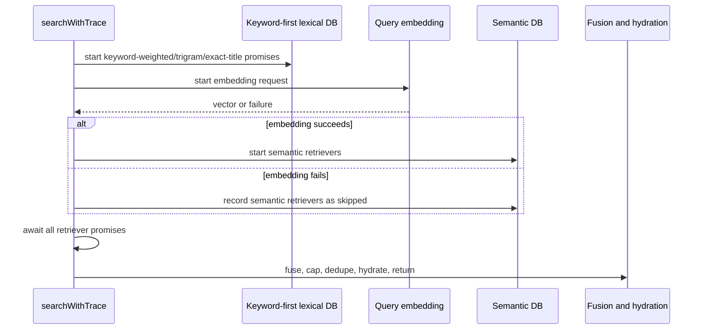

# perf: Parallelize keyword-first Admin search retrieval

## Summary

Reduce Admin `keyword-first` search latency by starting lexical video retrieval before query embedding finishes, while keeping ranking semantics, response shape, and existing timing logs unchanged.

---

## Problem Frame

Production timing logs from `feat-175` show `keyword-first` searches wait on embedding before dispatching lexical retrievers that do not need the embedding. That sequencing adds avoidable wall time before the same fused candidate lists can be processed. The first latency slice should overlap independent work before changing semantic SQL, hydration projection, or ranking logic.

---

## Requirements

### Latency Behavior

- R1. `keyword-first` video lexical retrievers start without waiting for query embedding.
- R2. Semantic video and semantic experience retrieval still run only after a successful embedding.
- R3. Embedding failure still degrades to the existing keyword-only behavior for public hybrid and keyword-first modes.

### Contract Preservation

- R4. Public REST and GraphQL search response shapes remain unchanged.
- R5. Existing retriever labels, timing labels, `searchMode`, and dilution-cap behavior remain compatible with current production logs.
- R6. `hybrid` and public-fallback unknown modes keep their existing retriever dispatch behavior.
- R7. Internal `semantic-only` mode still skips lexical retrievers.

### Verification

- R8. Tests prove lexical retrievers can be in flight while embedding is still pending.
- R9. The merged change is measured in production with the same representative GraphQL and internal eval queries used for the baseline timing sample.

---

## Key Technical Decisions

- **Overlap, do not rerank:** The PR should change when independent retriever promises are created, not how results are scored, fused, capped, deduped, or hydrated. This keeps result quality stable.
- **Keep the single orchestrator:** `HybridSearchService.searchWithTrace` remains the branching point for `hybrid`, `keyword-first`, and `semantic-only`, matching the existing keyword-first extension pattern.
- **Make retrieval timing overlap-aware:** `embedding_ms` still measures only embedding. For `keyword-first`, `db_retrievals_ms` should measure the full overlap-aware retrieval phase from the first early lexical retriever launch until all early lexical and embedding-gated semantic retrievers have settled. Stage timings are not additive after this change; per-retriever and DB labels remain the source for individual SQL durations.
- **Defer SQL and hydration changes:** `semantic-video.query` and `hydration.video.findMany` are the larger remaining bottlenecks, but this PR should not change SQL shape or Prisma hydration. Those need separate EXPLAIN/projection work and quality checks.

---

## High-Level Technical Design

---

## Implementation Units

### U1. Start Keyword-First Lexical Retrieval Before Embedding Resolves

- **Goal:** Reorder `keyword-first` video retrieval setup so lexical DB promises are created immediately, while semantic retrievers remain embedding-gated.
- **Requirements:** R1, R2, R3, R5, R7
- **Dependencies:** none
- **Files:**
  - `apps/admin/src/services/hybrid-search.service.ts`
- **Approach:** Introduce an early lexical retrieval collection for the `keyword-first` video branch using the existing `timedRetrieval` wrapper and `SearchTimingRecorder`. Attach a rejection handler immediately by starting an early `Promise.allSettled` over those lexical promises before crossing any embedding `await`. Start embedding in parallel, append semantic retrievers after embedding succeeds, or mark them skipped after failure. Merge early lexical outcomes with semantic outcomes through the existing labeled failure-isolation path.
- **Patterns to follow:** `docs/solutions/platform/admin-hybrid-search-keyword-first-r4-extension-pattern.md`; `docs/solutions/performance-issues/admin-search-stage-db-timing-instrumentation-20260624.md`
- **Test scenarios:** Covered in U2.
- **Verification:** A code review can see lexical retriever calls no longer sit behind `await this.embedder(query)`, and no fusion or response-mapping code changed.

### U2. Add Orchestrator Coverage For Overlap And Mode Safety

- **Goal:** Prove the reordering preserves mode contracts and creates the intended overlap.
- **Requirements:** R1, R3, R6, R7, R8
- **Dependencies:** U1
- **Files:**
  - `apps/admin/src/services/hybrid-search.keyword-first.test.ts`
  - `apps/admin/src/services/hybrid-search.service.test.ts`
- **Approach:** Add a test where the embedder promise is held pending and `mode="keyword-first"` is invoked; assert the lexical retrievers have already been dispatched before resolving the embedding. Keep existing embedding-failure and semantic-only expectations green so the public degradation and eval-only semantic isolation contracts are protected.
- **Patterns to follow:** `docs/solutions/best-practices/test-first-regression-snapshot-byte-identical-default-20260429.md`
- **Test scenarios:**
  - `keyword-first` with a pending embedder dispatches `keyword-weighted-video`, `trigram-video`, and `exact-title-video` before the embedding resolves.
  - `keyword-first` with a pending embedder and a rejecting lexical retriever keeps the rejection handled through the settled-outcome path.
  - `keyword-first` with embedding failure still returns `searchMode="keyword-only"` and keeps semantic retrievers skipped.
  - Existing hybrid and unknown-mode regression coverage still proves keyword-first lexical retrievers are not dispatched outside the keyword-first branch.
  - `semantic-only` still does not dispatch keyword-first lexical retrievers.
- **Verification:** Focused Vitest coverage passes for the Admin hybrid search service suite.

### U3. Measure Production After Merge

- **Goal:** Compare the merged PR against the current production timing baseline using the same timing logs.
- **Requirements:** R5, R9
- **Dependencies:** U1, U2
- **Files:**
  - `docs/roadmap/content-discovery/feat-175-admin-semantic-search-latency.md`
- **Approach:** Before merge, use the existing production baseline traces to estimate the theoretical overlap ceiling for each query: the visible win is bounded by the lexical DB work that can fit under embedding time, and can still be masked by semantic SQL or hydration. After the PR deploys to Railway production, run representative `keyword-first`, `hybrid`, and `semantic-only` searches through Admin production with at least two passes of `the bible project`, `jesus`, and `hope when life is hard`. Capture client time, `total_ms`, `embedding_ms`, `db_retrievals_ms`, retriever timings, DB timings, `hydration_ms`, and `trace_write_ms`. Report whether `keyword-first` total wall time moved toward the overlap ceiling, and name semantic SQL, hydration, or embedding as the remaining dominant blocker when it does not.
- **Patterns to follow:** Existing production timing log format from `formatSearchTimingLogLine`.
- **Test scenarios:** Test expectation: none -- this unit is operational measurement after deploy.
- **Verification:** The final report includes before/after timings and names the remaining dominant bottleneck.

---

## Scope Boundaries

### In Scope

- Reorder independent keyword-first lexical retrieval relative to embedding.
- Preserve current result quality by leaving retrieval SQL, RRF, dilution cap, dedupe, hydration, and public response mapping unchanged.
- Run production timing probes after deployment.

### Deferred to Follow-Up Work

- Optimize `semantic-video.query` using production-shaped `EXPLAIN (ANALYZE, BUFFERS)`.
- Replace broad hydration with a lean search-card projection or denormalized search result table.
- Cache query embeddings by normalized query, locale, and embedding model version.
- Move trace writes fully off the request path.

---

## Risks & Dependencies

- **Unhandled promise timing:** Starting lexical promises earlier means they may reject before semantic retrievers are created. The implementation must attach an immediate settled-outcome promise before awaiting embedding so Node does not emit unhandled rejections.
- **Metric interpretation:** `db_retrievals_ms` becomes an overlap-aware retrieval phase metric in `keyword-first`; it is no longer additive with `embedding_ms`. The comparison should use `total_ms`, retriever-specific timings, and DB-specific timings together.
- **Production variance:** Embedding and DB timings vary between cold and warm runs. The report should compare patterns across several queries rather than claiming success from one fast request.

---

## Sources & Research

- `docs/roadmap/content-discovery/feat-175-admin-semantic-search-latency.md`
- `docs/solutions/performance-issues/admin-search-stage-db-timing-instrumentation-20260624.md`
- `docs/solutions/platform/admin-hybrid-search-keyword-first-r4-extension-pattern.md`
- `docs/solutions/performance-issues/pgvector-hnsw-index-bypass-with-where-filter-20260415.md`
- `apps/admin/AGENTS.md`
