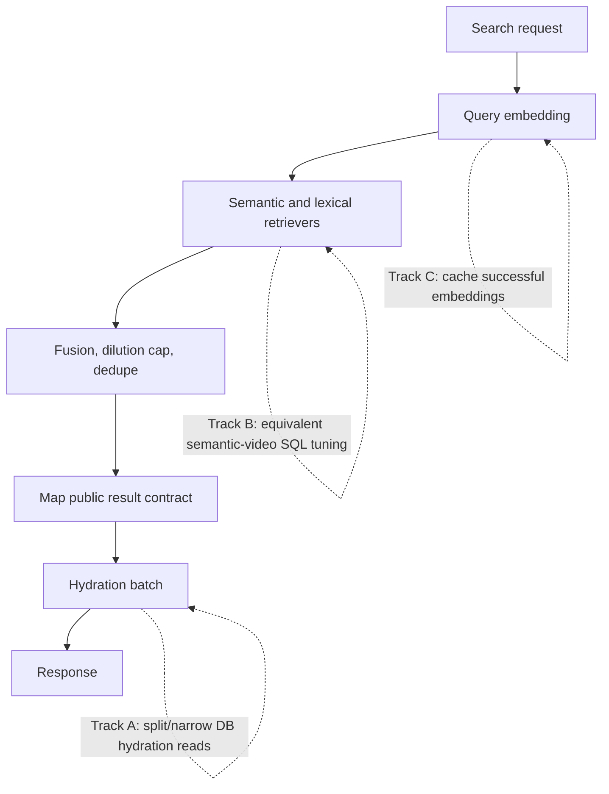

# perf: Optimize Admin search hydration, semantic SQL, and query embeddings

## Summary

Reduce Admin search latency on the same production path measured for `feat-175` by optimizing the slow database and embedding layers while preserving current search results. This plan covers hydration query optimization, semantic-video SQL tuning, and a query embedding cache; trace-write offloading remains deferred.

---

## Problem Frame

Production timing after the keyword-first overlap PR did not show a reliable improvement. The remaining visible costs are dominated by `semantic-video.query` and card hydration, with query embedding still paid on every repeated request. The user wants query optimization first, with the specific constraint that result quality and result shape must not change.

The roadmap ticket already frames this as latency recovery rather than timeout masking. The safe path is to reduce database work and avoid repeat provider calls without changing retriever labels, RRF list order, dedupe, dilution-cap behavior, public response fields, or trace-write behavior.

---

## Requirements

### Result Preservation

- R1. Hydration optimization must preserve result IDs, order, scores, `hasMore`, `searchMode`, `query`, and every public display field for equivalent database rows.
- R2. Semantic-video SQL optimization must keep the `semantic-video` retriever label and current best-transcript-evidence-per-video semantics.
- R3. No optimization may drop semantic retrieval, narrow candidate recall, change RRF list order, or solve latency by returning degraded keyword-only results.

### Latency And Observability

- R4. Hydration database work must be split or narrowed so logs expose which hydration sub-layer is slow.
- R5. Semantic-video database timing must remain visible under a stable comparable label, with any added labels treated as more granular DB-layer diagnostics.
- R6. Repeated identical query embedding requests should avoid repeat provider calls within a bounded process-local cache.

### Scope Control

- R7. Trace-write behavior stays unchanged in this pass.
- R8. Public REST and GraphQL search response contracts remain unchanged.
- R9. Existing keyword-first, hybrid, semantic-only, and degraded keyword-only behavior remains covered by tests.

---

## Key Technical Decisions

- **Optimize projection, not ranking:** Hydration may change how display data is loaded, but not what final search results contain. Semantic SQL may reduce repeated work inside the same logical candidate semantics, but not introduce HNSW-first windows or recall-reducing prefilters in this pass.
- **Keep the orchestrator contract:** `HybridSearchService.searchWithTrace` remains the single orchestrator for pipeline mode, embedding degradation, fusion, dedupe, mapping, hydration, and private timings.
- **Split hydration with explicit DB labels:** Replace the single broad nested Prisma hydration query with narrow batch reads for base video metadata, localized snippets, images, dubs, and child counts. Preserve the fallback behavior where hydration failure logs and returns pre-hydration results.
- **Semantic SQL tuning stays equivalence-bound:** Prefer query-shape changes that compute the query vector once, remove redundant casts or joins, and preserve the current ordering tie-breakers. Defer HNSW-first transcript windows until there is a separate recall/diversity proof.
- **Byte-identical public response oracle:** For selected fixtures and representative queries, preservation means byte-identical public JSON after excluding timing/log side effects. Result IDs, order, scores, display fields, `hasMore`, `query`, and `searchMode` are all part of the oracle.
- **Process-local embedding cache only:** Cache successful query embeddings by normalized query text, provider, model, and dimensions for a short TTL with in-flight dedupe. Do not cache failures, and do not introduce shared infrastructure or persistent query storage.
- **Provider health counters remain provider-call counters:** Cache hits are search successes, but should not be counted as fresh provider attempts. Failures on cache misses still flow through the existing degradation and health-counter path.
- **Plain-string timing logs remain the observability surface:** New timing labels must continue through the existing `[search] event=... key=value` formatter. Do not add JSON-shaped runtime logs for Railway production timing.

---

## High-Level Technical Design

---

## Implementation Units

### U1. Add Result-Equivalence Characterization For Search Cards

- **Goal:** Lock the current response contract before changing hydration or semantic SQL.
- **Requirements:** R1, R2, R3, R8, R9
- **Dependencies:** none
- **Files:**
  - `apps/admin/src/services/hybrid-search.service.test.ts`
  - `apps/admin/src/services/hybrid-search-retrievers.test.ts`
  - `apps/admin/src/services/hybrid-search.keyword-first.test.ts`
- **Approach:** Add focused characterization around hydration overlay rules, semantic-video SQL shape, and mode-specific dispatch. The tests should assert final public response equality for the hydration cases that matter: localized description/snippet precedence, image priority, playback fallback, primary-dub duration preference, child count, missing hydration rows, and hydration failure pass-through.
- **Technical design:** Public response comparison ignores timings, logs, and private trace summaries. It does not ignore any field returned through REST or GraphQL search results.
- **Execution note:** Start this unit before changing query shape so the tests prove preservation rather than the rewritten implementation.
- **Patterns to follow:** Existing card-pill hydration tests in `apps/admin/src/services/hybrid-search.service.test.ts`; SQL-shape tests in `apps/admin/src/services/hybrid-search-retrievers.test.ts`.
- **Patterns to follow:** Existing card-pill hydration tests in `apps/admin/src/services/hybrid-search.service.test.ts`; SQL-shape tests in `apps/admin/src/services/hybrid-search-retrievers.test.ts`; `docs/solutions/integration-issues/semantic-search-video-card-display-metadata-hydration.md`; `docs/solutions/best-practices/prisma-raw-sql-invariant-assertions-20260423.md`.
- **Test scenarios:**
  - A video with semantic evidence keeps its ID, score, start seconds, and order while localized description/image/playback/label/duration/child count are hydrated.
  - Empty-string retriever image and playback fields use hydrated fallbacks; non-empty retriever values remain authoritative.
  - A primary-language playable dub is preferred for duration; otherwise the first duration-ordered playable dub is used.
  - Missing hydration rows pass through with pre-hydration fields.
  - Hydration query failure logs once and returns the original result array.
  - Semantic-video SQL still selects transcript evidence only, preserves locale/provenance/visibility gates, and keeps final hydration outside the transcript-source candidate collapse.
- **Verification:** Focused tests fail if public result fields, semantic SQL invariants, or mode dispatch behavior drift.

### U2. Optimize Hydration Query Shape Without Changing Results

- **Goal:** Reduce hydration latency and expose per-layer DB timings while preserving final card output.
- **Requirements:** R1, R4, R8
- **Dependencies:** U1
- **Files:**
  - `apps/admin/src/services/hybrid-search.service.ts`
  - `apps/admin/src/services/hybrid-search.service.test.ts`
  - `apps/admin/src/services/hybrid-search-timing.test.ts`
- **Approach:** Replace the broad nested `video.findMany` hydration read with narrow batch reads keyed by the final page of video IDs. Keep the same selection semantics for localized snippets, image priority, playable dubs, and published child counts. Record separate DB timings for each hydration sub-layer while retaining aggregate `hydrationMs`.
- **Patterns to follow:** `recordSearchDbTiming` in `apps/admin/src/services/hybrid-search-timing.ts`; existing display-only hydration fallback in `apps/admin/src/services/hybrid-search.service.ts`; `docs/solutions/integration-issues/semantic-search-video-card-display-metadata-hydration.md`.
- **Test scenarios:**
  - Final response for the characterized hydration fixtures remains identical after the query rewrite.
  - Each hydration sub-query records a DB timing label with status and result count.
  - Experience-only searches do not run video hydration queries.
  - A rejected hydration sub-query logs `event=hydration_failed` and leaves the response unchanged.
  - Hydration still sends only the final page video IDs, not overfetch candidates.
- **Verification:** Service tests demonstrate response equivalence and the timing log formatter includes the new hydration DB labels.

### U3. Tune Semantic-Video SQL Within Current Candidate Semantics

- **Goal:** Reduce redundant SQL work in `semantic-video.query` without changing semantic-video result semantics.
- **Requirements:** R2, R3, R5, R8, R9
- **Dependencies:** U1
- **Files:**
  - `apps/admin/src/services/hybrid-search-retrievers.ts`
  - `apps/admin/src/services/hybrid-search-retrievers.test.ts`
  - `apps/admin/src/services/transcript-embedding-ingest.contract.test.ts`
- **Approach:** Keep transcript-only retrieval and per-video best evidence semantics. Apply only equivalence-preserving query-shape changes, such as binding the query vector once in a CTE and reusing it for score and ordering, or removing redundant final joins when selected evidence data is already available. Keep the stable `semantic-video.query` DB timing label for comparison.
- **Technical design:** HNSW-first nearest-neighbor windows are out of scope for this PR because they can alter distinct-video recall before per-video collapse.
- **Patterns to follow:** `docs/roadmap/content-discovery/feat-175-admin-semantic-search-latency.md`; `docs/solutions/architecture-patterns/admin-semantic-video-transcript-evidence-pattern.md`; `docs/solutions/performance-issues/pgvector-hnsw-index-bypass-with-where-filter-20260415.md`; `docs/solutions/database-issues/set-local-requires-transaction-for-pgvector-search.md`; `docs/solutions/best-practices/prisma-raw-sql-invariant-assertions-20260423.md`.
- **Test scenarios:**
  - SQL still contains transcript evidence only and no scene source.
  - Locale, published visibility, non-null embedding, and Qwen-compatible provenance gates remain present.
  - Candidate limit remains after per-video evidence collapse.
  - Tie-break ordering remains score, timecode, and stable evidence ID as before.
  - Mapping still returns the same `VideoSemanticResult` fields from mocked rows.
- **Verification:** Existing retriever tests and contract tests pass, and any SQL-shape change is readable enough for production `EXPLAIN` follow-up.

### U4. Add Bounded Query Embedding Cache

- **Goal:** Avoid repeated embedding-provider latency for identical live search queries while keeping embedding semantics unchanged.
- **Requirements:** R3, R6, R8, R9
- **Dependencies:** U1
- **Files:**
  - `apps/admin/src/services/hybrid-search.service.ts`
  - `apps/admin/src/services/hybrid-search.service.test.ts`
  - `apps/admin/src/services/embeddings.service.test.ts`
- **Approach:** Wrap the default live-query embedder with a small process-local TTL cache and in-flight promise dedupe. Key by normalized query text plus the current provider/model/dimension contract available in the service layer. Cache only fulfilled vectors; failures must continue to trigger the existing degradation path and health counters.
- **Patterns to follow:** `docs/solutions/best-practices/batched-provider-input-position-stable-contract-20260505.md` for preserving the singular `generateExperienceEmbedding` contract; `docs/solutions/best-practices/openrouter-only-embedding-provider-contract.md` for provider/model provenance; existing embedding failure health tests in `apps/admin/src/services/hybrid-search.service.test.ts`.
- **Test scenarios:**
  - Two identical default-embedder searches within the TTL call the provider once and return the same results.
  - Concurrent identical requests share one in-flight embedding promise.
  - Different normalized query keys call the provider separately.
  - Provider failures are not cached; the next request retries and health counters still record the failed attempt.
  - Cache hits do not increment provider-attempt counters if the counter remains scoped to real provider calls.
  - Injected test embedders remain injectable and deterministic.
- **Verification:** Unit tests prove cache hits reduce provider calls without changing search response fields or degradation behavior.

### U5. Validate And Compare Timings

- **Goal:** Prove the PR is safe locally and ready for production timing comparison after merge.
- **Requirements:** R1, R3, R4, R5, R7, R8, R9
- **Dependencies:** U2, U3, U4
- **Files:**
  - `docs/roadmap/content-discovery/feat-175-admin-semantic-search-latency.md`
  - `docs/solutions/performance-issues/`
- **Approach:** Run focused Admin search tests, typecheck, and lint for touched files. After deployment, run the same production canaries used for the previous comparison: `the bible project`, `jesus`, and `hope when life is hard` across keyword-first, hybrid, and semantic-only where applicable. Compare service timings, client timings, top-N video IDs, evidence/snippet parity, image/playback null-rate deltas, and the new DB-layer hydration labels.
- **Patterns to follow:** `docs/solutions/performance-issues/admin-search-stage-db-timing-instrumentation-20260624.md`; `docs/solutions/runtime-errors/railway-logsv2-silences-nextjs-stdout-runtime-20260518.md`.
- **Test scenarios:** Test expectation: none -- this unit is validation and measurement, not new runtime behavior.
- **Verification:** The report names whether hydration, semantic SQL, embedding, or trace write remains the dominant bottleneck. It includes cold/warm timing samples, response `searchMode`, top-N IDs, evidence/snippet parity, and image/playback null-rate deltas. Trace write is measured but not optimized in this pass.

---

## Scope Boundaries

### In Scope

- Optimize hydration queries while preserving the final public response exactly.
- Apply equivalence-preserving semantic-video SQL tuning.
- Add a bounded process-local query embedding cache for successful embeddings.
- Keep and improve DB-layer timing visibility for the touched search layers.

### Deferred to Follow-Up Work

- Move trace writes off the request path or into post-response execution.
- Prototype HNSW-first transcript candidate windows.
- Add or change pgvector indexes based on production `EXPLAIN`.
- Change ranking, RRF weights, dilution-cap rules, dedupe semantics, or semantic evidence source mix.

---

## Risks & Dependencies

- **Hidden hydration behavior drift:** Splitting one nested Prisma query into multiple reads can accidentally change row ordering or null fallback. Characterization tests must land before the rewrite.
- **Semantic recall regression:** An apparently faster vector query can degrade quality if it bounds candidates before per-video collapse. This pass must avoid HNSW-first windows unless separate eval proof exists.
- **Cache staleness:** Query embeddings should be stable for short periods, but a long cache TTL could obscure provider-contract changes. Keep TTL short and process-local.
- **Production variance:** Cold and warm database/cache states vary. Compare multiple runs and look at per-layer timings rather than one total duration.
- **Trace-write temptation:** Trace write may still be visible in logs after these changes, but it stays deliberately untouched until the first three optimizations are measured.

---

## Open Questions

- OQ1. Production `EXPLAIN` proof may be needed after deployment if semantic SQL remains dominant. This is deferred to measurement unless the implementation changes candidate-window semantics, which this plan forbids.

---

## Sources & Research

- `docs/roadmap/content-discovery/feat-175-admin-semantic-search-latency.md`
- `docs/plans/2026-06-24-001-perf-admin-search-parallel-keyword-plan.md`
- `docs/solutions/performance-issues/admin-search-stage-db-timing-instrumentation-20260624.md`
- `docs/solutions/integration-issues/semantic-search-video-card-display-metadata-hydration.md`
- `docs/solutions/platform/admin-hybrid-search-keyword-first-r4-extension-pattern.md`
- `docs/solutions/architecture-patterns/admin-semantic-video-transcript-evidence-pattern.md`
- `docs/solutions/performance-issues/pgvector-hnsw-index-bypass-with-where-filter-20260415.md`
- `docs/solutions/database-issues/set-local-requires-transaction-for-pgvector-search.md`
- `docs/solutions/best-practices/openrouter-only-embedding-provider-contract.md`
- `docs/solutions/best-practices/prisma-raw-sql-invariant-assertions-20260423.md`
- `docs/solutions/runtime-errors/railway-logsv2-silences-nextjs-stdout-runtime-20260518.md`
- `apps/admin/AGENTS.md`
- `CONCEPTS.md`
