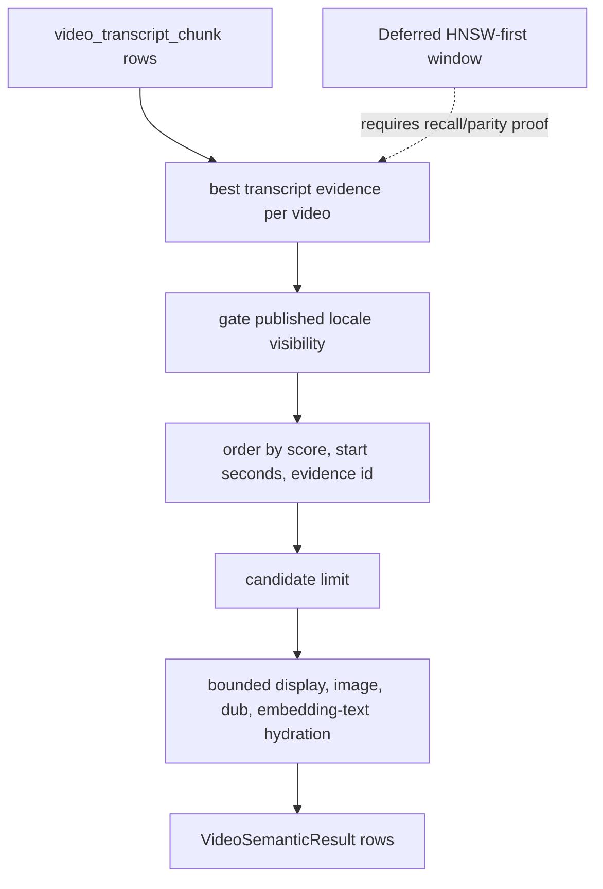

# perf: Optimize Admin semantic DB retrieval

## Summary

Reduce the production `semantic-video.query` bottleneck without changing Admin
search ranking, result IDs, result order, scores, or public card fields. The
safe first slice is an exact SQL-shape rewrite: choose the best transcript
evidence per video before joining visibility and display tables, then keep the
same post-collapse candidate ordering and limit.

---

## Problem Frame

After PR #1370, production timing for `keyword-first` search improved, but the
dominant service-layer cost remains semantic database retrieval. The newest
canaries showed median `semantic-video.query`/retrieval wait around 1.7-2.3s
for `the bible project`, `jesus`, and `hope when life is hard`.

The tempting optimization is an HNSW-first nearest-neighbor window, but that can
change recall before Admin collapses transcript chunks to one result per video.
This plan therefore starts with an exact rewrite that preserves current
best-transcript-evidence-per-video semantics while reducing the number of rows
that flow through `video`, `video_locale`, image, dub, and embedding-text
hydration work.

---

## Requirements

- R1. The public search response must preserve result IDs, order, scores,
  `searchMode`, `hasMore`, `query`, snippets, start seconds, images,
  playback IDs, labels, durations, and child counts for equivalent DB rows.
- R2. `semantic-video` must stay one RRF retriever label; do not add a new
  transcript-specific list or change keyword-first dilution semantics.
- R3. The SQL rewrite must preserve transcript-only evidence, provenance gates,
  locale/language gates, published visibility gates, and stable tie-breakers.
- R4. Any faster query shape must keep the existing `semantic-video.query`
  timing label so production before/after comparisons remain apples-to-apples.
- R5. HNSW-first candidate windows are deferred unless implementation proves
  result parity with a distinct-video guarantee or explicit eval gate.
- R6. Validation must include focused unit coverage and a production canary
  timing/result-stability comparison after deploy.
- R7. Pre-merge validation must include data-level parity coverage for
  duplicate locale rows, hidden/unpublished visibility, null start seconds,
  equal-score ties, and bounded hydration fallbacks; SQL shape alone is not
  enough to prove R1.

---

## Key Technical Decisions

- **Optimize the exact path first:** Keep the current all-transcript best row
  per video semantics. Rewrite the query so the all-chunk scan no longer joins
  video visibility and display data for every candidate chunk.
- **Move visibility after per-video collapse but before candidate limit without
  multiplying videos:** Visibility is video-level for the selected locale, so
  filtering after best evidence is selected per video preserves evidence choice.
  Because broad `video_locale.locale` is not unique per video, the visibility
  step must use a one-row-per-video shape: gate with `EXISTS` before the
  candidate window and select a deterministic display locale row only after the
  window is bounded.
- **Keep survivor hydration bounded:** Display title, image, dub, and `embedding::text`
  hydration should stay after the semantic candidate window, not inside the
  unbounded transcript chunk collapse.
- **Do not force HNSW with planner knobs in this pass:** `SET LOCAL` or
  `enable_seqscan=off` can hide planner problems and change connection-wide
  behavior. If exact SQL remains slow, a later PR should prototype an HNSW-first
  window with recall proof and production `EXPLAIN`.
- **Use SQL-shape tests plus data-level parity tests:** Raw SQL structure should
  assert CTE order, gates, candidate-window tie-breakers, and bounded hydration
  placement using the existing tagged-template scraping pattern. Data-backed
  parity tests should cover the result-preservation edges that SQL text cannot
  prove.

---

## High-Level Technical Design

The exact rewrite keeps the same logical output as the current query. It changes
where expensive joins happen: from every transcript chunk in the collapse step
to one best evidence row per video before candidate-window ordering.

---

## Implementation Units

### U1. Add semantic DB SQL-shape characterization

- **Goal:** Lock the current semantic retrieval contract before rewriting SQL.
- **Requirements:** R1, R2, R3, R4, R7
- **Dependencies:** none
- **Files:**
  - `apps/admin/src/services/hybrid-search-retrievers.test.ts`
  - `apps/admin/src/services/transcript-embedding-ingest.contract.test.ts`
- **Approach:** Strengthen SQL-text tests around `searchVideoSemantic` so they
  fail if transcript evidence, provenance gates, language gates, visibility
  gates, candidate-limit placement, one-row-per-video candidate shape, or
  bounded hydration placement changes. Add data-level parity fixtures for
  duplicate locale variants, hidden/unpublished visibility, null start seconds,
  equal-score ties, image fallback, and dub playback fallback. Keep row-mapping
  tests focused on the public `VideoSemanticResult` shape.
- **Execution note:** Add characterization before touching the retriever query.
- **Patterns to follow:** `docs/solutions/best-practices/prisma-raw-sql-invariant-assertions-20260423.md`.
- **Test scenarios:**
  - SQL contains exactly one `semantic-video.query` DB timing path through
    `searchVideoSemantic`.
  - SQL reads `video_transcript_chunk` and does not read scene embedding tables
    or removed Qwen columns.
  - SQL keeps `vt.language`, `vtc.language`, embedding non-null, approved model,
    dimensions, provider, native dimensions, and null transform gates.
  - SQL keeps `v.deleted_at IS NULL`, `vl.status = 'published'`, and
    `vl.deleted_at IS NULL` before the final semantic candidate limit.
  - SQL keeps candidate-window tie-breakers by score, start seconds, and
    evidence id, and existing post-mix public ordering by video id for exact
    ties remains covered.
- **Verification:** Focused retriever tests fail for semantic topology drift
  before any performance rewrite lands.

### U2. Rewrite semantic-video SQL to collapse before visibility/display joins

- **Goal:** Reduce semantic DB retrieval time while preserving exact result
  semantics.
- **Requirements:** R1, R2, R3, R4, R7
- **Dependencies:** U1
- **Files:**
  - `apps/admin/src/services/hybrid-search-retrievers.ts`
  - `apps/admin/src/services/hybrid-search-retrievers.test.ts`
  - `apps/admin/src/services/transcript-embedding-ingest.contract.test.ts`
- **Approach:** Restructure `searchVideoSemantic` into separate CTEs: query
  vector, raw best transcript evidence per video, visible semantic candidates,
  requested language ids, and final bounded hydration. The visibility CTE joins
  `video` after best evidence selection and gates published locale availability
  with `EXISTS` before `ORDER BY ... LIMIT`. The final select then hydrates
  exactly one deterministic `video_locale` display row for each bounded
  survivor, along with image, dub, and embedding text.
- **Technical design:** Directional CTE shape:
  - `query_embedding`: bind the vector once.
  - `best_transcript_per_video`: choose one transcript chunk per video by
    distance, start seconds, and evidence id.
  - `visible_semantic_candidates`: keep exactly one row per visible video by
    using `EXISTS` for published requested-locale visibility.
  - `transcript_source`: order visible candidates by source score and stable
    candidate-window tie-breakers, then apply `candidateLimit`.
  - final select: hydrate deterministic display title, image, dub playback, and
    embedding text for survivors.
- **Patterns to follow:** `docs/solutions/performance-issues/admin-search-result-preserving-latency-optimization.md`; `docs/solutions/platform/admin-transcript-embeddings-vector-reuse-pattern.md`; `docs/solutions/architecture-patterns/admin-semantic-video-transcript-evidence-pattern.md`.
- **Test scenarios:**
  - Mocked rows still map to identical `VideoSemanticResult` fields.
  - SQL places `JOIN video` and display-locale selection after the best
    transcript per-video CTE, but proves the locale lookup cannot multiply
    candidates before the candidate-window limit.
  - Data-level fixtures with duplicate published `video_locale` rows for one
    broad locale still emit one `VideoSemanticResult` for that video.
  - SQL keeps image, dub, and `embedding::text` hydration outside the unbounded
    best-evidence collapse.
  - SQL still binds the query vector once through the materialized CTE.
  - Contract tests that ingest transcript chunks still feed searchable rows into
    `searchVideoSemantic`.
- **Verification:** Focused search retriever and transcript-ingest contract
  tests pass, with no public response-shape changes.

### U3. Add a safe production explain/timing comparison path

- **Goal:** Prove the exact rewrite improved the real production bottleneck and
  did not destabilize results.
- **Requirements:** R1, R4, R5, R6
- **Dependencies:** U2
- **Files:**
  - `docs/roadmap/content-discovery/feat-175-admin-semantic-search-latency.md`
  - `docs/solutions/performance-issues/`
- **Approach:** After merge and deployment, run the same production canaries:
  `the bible project`, `jesus`, and `hope when life is hard` through Admin
  GraphQL `mode=keyword-first`. Compare client timings, service timings,
  `semantic-video.query` timings, top result signatures, and full response
  stability. If possible, capture production `EXPLAIN (FORMAT JSON)` for the
  new SQL shape without `ANALYZE`.
- **Patterns to follow:** `docs/solutions/performance-issues/admin-search-stage-db-timing-instrumentation-20260624.md`; `docs/solutions/performance-issues/pgvector-hnsw-index-bypass-with-where-filter-20260415.md`.
- **Test scenarios:** Test expectation: none -- this unit is deployment
  measurement and documentation, not runtime behavior.
- **Verification:** The final report names old vs new service timing, client
  timing, `semantic-video.query` timing, and whether every repeated response was
  stable.

### U4. Decide whether HNSW-first needs a follow-up

- **Goal:** Keep a sharper next step if exact SQL still leaves semantic DB
  retrieval too slow.
- **Requirements:** R5, R6
- **Dependencies:** U3
- **Files:**
  - `docs/roadmap/content-discovery/feat-175-admin-semantic-search-latency.md`
  - `docs/solutions/performance-issues/admin-search-result-preserving-latency-optimization.md`
- **Approach:** If the exact rewrite materially improves timings, keep
  HNSW-first deferred. If semantic DB retrieval remains dominant, record a
  follow-up scope that prototypes an adaptive nearest-neighbor window with a
  distinct-video floor, duplicate-heavy regression prompts, and Mastra search
  eval proof before it can ship.
- **Patterns to follow:** `docs/solutions/architecture-patterns/admin-semantic-video-transcript-evidence-pattern.md`.
- **Test scenarios:** Test expectation: none -- this unit is a go/no-go
  decision based on production measurement.
- **Verification:** The roadmap ticket either moves closer to completion or
  names the exact follow-up proof needed for HNSW-first work.

---

## Scope Boundaries

### In Scope

- Rewrite `semantic-video.query` for exact candidate semantics.
- Strengthen raw SQL-shape tests around semantic DB retrieval.
- Add data-level parity coverage for duplicate locale and tie-breaker edge
  cases before the rewrite ships.
- Re-run production timing and result-stability canaries after deploy.
- Record the HNSW-first follow-up decision in the roadmap and solution notes
  after production measurement.

### Deferred to Follow-Up Work

- HNSW-first nearest-neighbor windows that can change pre-collapse recall.
- New pgvector indexes or index-rebuild operations.
- Ranking, RRF weights, dilution-cap behavior, or public response contract
  changes.
- Trace-write repair or offloading.

---

## Risks & Dependencies

- **Equivalence risk:** Moving visibility after evidence selection is safe only
  because visibility is video/locale-level, not chunk-level. Because broad
  locale rows can be duplicated per video, tests should keep visibility before
  candidate limiting and prove the visibility/display step cannot multiply a
  video into multiple semantic candidates.
- **Planner uncertainty:** The exact rewrite may reduce join work but still scan
  and sort transcript chunks. Production timing determines whether this slice is
  enough.
- **HNSW temptation:** A nearest-neighbor source window is likely faster but can
  drop distinct videos when one long video contributes many top chunks.
- **Production variance:** Compare medians and per-layer timings across repeated
  runs rather than one request.

---

## Documentation / Operational Notes

- Keep the `feat-175` roadmap ticket in progress until production timings and
  result-stability checks are recorded.
- Do not mark HNSW-first complete from this PR; it is a separate relevance and
  recall proof.

---

## Sources & Research

- `docs/roadmap/content-discovery/feat-175-admin-semantic-search-latency.md`
- `docs/plans/2026-06-25-001-perf-admin-search-hydration-semantic-cache-plan.md`
- `docs/solutions/performance-issues/admin-search-result-preserving-latency-optimization.md`
- `docs/solutions/platform/admin-transcript-embeddings-vector-reuse-pattern.md`
- `docs/solutions/architecture-patterns/admin-semantic-video-transcript-evidence-pattern.md`
- `docs/solutions/performance-issues/pgvector-hnsw-index-bypass-with-where-filter-20260415.md`
- `docs/solutions/best-practices/prisma-raw-sql-invariant-assertions-20260423.md`
- `apps/admin/AGENTS.md`
- `CONCEPTS.md`
