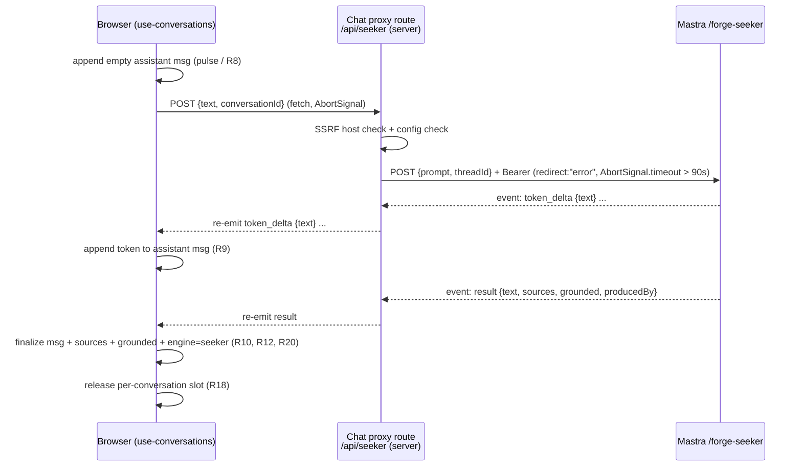

# feat: Wire chat app to the Seeker `/forge-seeker` route

## Summary

Give `apps/chat` its first backend: a feature-flagged, server-to-server SSE proxy
that relays browser messages to the internal `/forge-seeker` route (shipped in
feat-204) and streams Seeker's grounded, source-cited answers into the existing
chat UI. Default off — when the flag is off the app keeps using today's
client-side stub (`buildStubReply`); when on, a small trusted internal audience
can dogfood Seeker end-to-end. This is the chat-side consumer only — **no
Mastra-side change** (see origin: `docs/brainstorms/2026-06-25-chat-wire-seeker-route-requirements.md`).

The dogfood is a decision-producing experiment: it answers whether Seeker's
grounding is good enough to justify the deferred auth + guardrail work toward a
public surface. "Done" means the team can reach that judgment in the real UI,
not merely that tokens stream.

---

## Problem Frame

`/forge-seeker` exists and streams the seeker agent over a stable, bearer-gated
contract, but nothing consumes it. `apps/chat` answers every message from a
synchronous, never-failing client stub (`src/lib/chat-stub.ts` `buildStubReply`);
its CLAUDE.md lists auth, a database, API routes, and env vars as "Intentionally
Absent." So Seeker can only be exercised through Mastra Studio, one tester at a
time — the team has no way to use it as a _chat_ (multi-turn, real UI, judging
whether answers are backed by cited passages).

This wiring closes that gap for internal dogfooding without crossing the
documented production gates (safety/crisis guardrails, persisted memory, a public
surface), which all stay deferred.

**Accepted-risk framing (do not "fix" in v1).** The v1 proxy is an
unauthenticated, un-rate-limited, same-origin endpoint. The chat origin is
already world-reachable HTTPS (an unadvertised Railway-generated domain — no
`jesusfilm.org` DNS, no Cloudflare, no auth). The only thing limiting reach is
URL obscurity plus a small trusted audience — **this is the absence of a gate,
not a gate.** Real inbound auth (R5) and a per-caller rate/concurrency cap are
hard prerequisites before the audience widens at all. This plan implements the
accepted risk and documents it in code; it does not add an inbound gate.

---

## Key Finding — Memory Contract Verified (resolves R7 / AE3)

The brainstorm flagged one technical risk to resolve **before** locking the seam
shape: does `agent.stream(prompt, { memory: { thread, resource } })` throw when
recalling a never-created thread (outcome (c))?

**Resolved: it does not throw — outcome (a) holds.** In `@mastra/core@1.36.0`
(the version `apps/mastra` resolves), the agent's stream memory-prep path
(`chunk-AM3IOVFX.js`, the `prepareMemory`-equivalent block) does:

```text
existingThread = await memory.getThreadById({ threadId })
if (existingThread) { use it }
else { memory.createThread({ threadId, resourceId, saveThread: true }) }   // auto-create
```

The thread is created **before** messages are added or recall runs. The
`recall()`-throws-on-never-created-thread behavior documented in
`apps/mastra/src/mastra/memory.test.ts:73-77` is the _low-level_ API and is **not**
on the `agent.stream` path the route uses.

**Consequences for this plan:**

- Forwarding the browser `Conversation.id` as the Seeker `threadId` (R6) is safe.
  First turn on a fresh thread will not error.
- Multi-turn recall (AE3) works — the same `threadId` recalls earlier turns.
  AE3 is **achievable, not merely contingent**; it is not waived.
- A Mastra restart that drops the in-memory thread is _expected_ to degrade
  gracefully — the next turn re-creates the thread (losing prior recall, no
  crash). **This sub-claim is weaker than the first-turn claim:** it additionally
  requires `InMemoryStore.getThreadById` to return falsy (not throw) for a wiped
  thread id. The auto-create _branch_ is confirmed in source, but the
  getThreadById-returns-falsy-vs-throws behavior under `InMemoryStore`
  specifically was not separately verified. Treat restart-degradation as
  **expected but unverified** until the Verification step exercises it (create
  thread → wipe store / restart Mastra → second turn re-creates, not throws).
- **No thread-creation ownership moves to the chat proxy.** The route + agent own
  it. The proxy stays a thin relay.

This finding was verified by source inspection only (no code change, no live
run). The first-turn no-throw claim is well-evidenced (the auto-create branch is
on the stream path); confirm it — and the restart-degradation sub-claim — with
one live first-turn + post-restart run before the dogfood relies on multi-turn
recall. AE3 has a documented stateless fallback if either fails.

---

## Requirements Traceability

All requirement IDs (R1–R20), flows (F1–F3), and acceptance examples (AE1–AE8)
are from the origin brainstorm. Mapping to implementation units:

| Requirement cluster            | Requirements            | Units               |
| ------------------------------ | ----------------------- | ------------------- |
| Feature flag + config          | R1, R2, R19             | U1, U6              |
| Server-side SSE proxy + bearer | R3, R4, R5              | U1 (bearer env), U2 |
| Conversation identity          | R6, R7                  | U2, U5              |
| Streaming + rendering          | R8, R9, R10             | U3, U5, U7          |
| Reply-seam reshape             | R11                     | U3                  |
| Sources + grounding            | R12, R13                | U4, U7              |
| Failure + timeout handling     | R14, R15, R16, R17, R18 | U2, U3, U5          |
| Engine attribution             | R20                     | U4, U5, U7          |

Acceptance examples AE1–AE8 are enforced by the test scenarios in U8 (the
behavioral suite) and the per-unit scenarios that own each behavior.

---

## High-Level Technical Design

### Happy-path relay (F1, flag on)



### Failure mapping (F3)

The proxy collapses every failure into a single terminal `error { reason }`
frame on the proxy's own SSE channel, so the client has exactly one parse path.
**Two distinct origins for a reason — do not conflate them in the parser:**

- **Relayed from an upstream in-stream SSE frame:** only `timeout` and
  `generation_failed`. These are the _sole_ `error` frame reasons
  `/forge-seeker` ever emits on its SSE channel (see `seeker-route.ts` — the
  terminal frame is `budgetSignal.aborted ? "timeout" : "generation_failed"`).
- **Synthesized by the proxy from the upstream HTTP status or a transport
  outcome — never an in-stream frame:** `model_key_missing` (Mastra returns it
  as a **503 JSON body**, not an SSE frame — `seeker-route.ts` Gate 4),
  `config_missing`, `ssrf_blocked`, `auth_failed` (upstream 401/403),
  `network_error`, `cancelled`.

So the proxy MUST classify the upstream **HTTP status before** entering the
stream-parse path (mirroring admin's client, which checks `response.status`
before reading `response.body`). A naïve "relay the frame verbatim" parser would
never see `model_key_missing` (it arrives as a 503 with a JSON body) and would
misclassify it as `network_error`/`generation_failed`, defeating R16's distinct
config/unavailable bucket. The client maps each reason to a distinct user-facing
notice (R16) and, mid-stream, keeps already-streamed partial text (R17).

### Flag selection (R1, R2)

```text
page.tsx (server component)
  → reads isSeekerChatEnabled() from server env (runtime, no NEXT_PUBLIC)
  → passes seekerEnabled: boolean prop
    → AppShell → useConversations(seekerEnabled)
       seekerEnabled === false → buildStubReply path (no fetch, no Mastra — AE1)
       seekerEnabled === true  → POST /api/seeker, stream
```

The boolean is the only flag value that crosses to the client; the bearer and
base URL never leave the server. The proxy route **independently** re-checks the
flag and its own config (defense in depth): a client that forces `seekerEnabled`
on against an unconfigured server gets a visible `config_missing` failure, never
a half-working call.

---

## Key Technical Decisions

### KTD1 — Flag is a server-read boolean prop, not a `NEXT_PUBLIC` var

`page.tsx` is a server component; it reads the server-only enable flag at request
time and passes `seekerEnabled` down as a prop. Chosen over `NEXT_PUBLIC_*`
because: (a) runtime-flippable via Railway env with no rebuild (a
`NEXT_PUBLIC_*` value is baked at build time); (b) no secret surface — only a
boolean crosses the server→client boundary; (c) matches the brainstorm's
"deployment-wide flag, not per-user" framing. The flag is a convenience toggle,
not a security boundary (R2, see origin Dependencies).

### KTD2 — Proxy parses and re-emits SSE frames (not raw byte passthrough)

The route builds its own `ReadableStream<Uint8Array>` and re-emits frames after
parsing the upstream stream, mirroring the `start()/enqueue/closed/cancel`
structure in `apps/mastra/src/mastra/agents/seeker-route.ts`. Raw
`response.body` passthrough was rejected: it cannot inject a synthesized terminal
`error` frame when the **outbound timeout or a network drop fires mid-stream**,
which would strand the client with a truncated stream and no terminal frame
(violating R14/R17). Parsing also lets the proxy normalize transport failures
into the same `error { reason }` shape Mastra uses, so the client has one parse
path. A **chat-local** `readSseStream` helper (`apps/chat/src/lib/sse.ts`,
**forked** from `apps/admin/src/services/experience-ai/mastra-experience-chat-client.ts`'s
reference parser — admin's is coupled to its own `@/config/env` import, and chat
has no shared util package to extract into) is used by both the proxy (to parse
upstream) and the client seam (to parse the proxy stream) — two adjacent call
sites _within chat_, not a cross-app share. **Drift risk:** the fork is ~30 lines
of minimal SSE parsing; if Mastra's frame format changes (e.g. multi-line
`data:`), both admin's and chat's copies must change. Accepted because a
shared-package extraction is heavier than the duplication at this size; revisit
if a third consumer appears.

### KTD3 — `env.ts` via zod, every var `.optional()`

Chat gains its first validated env surface using `zod` (repo-wide convention;
mirrors `apps/mastra/src/config/env.ts`). **Every** Seeker var is `.optional()`
with a runtime fallback, so a default-off deploy boots with zero new env-var
prerequisite (R19; per the root CLAUDE.md "opt-in scaffolding env vars must be
`.optional()`" learning — required-at-boot vars brick unprovisioned Railway
deploys). The enable check `isSeekerChatEnabled()` mirrors Mastra's string-boolean
(`=== "true"`). Adding `zod` is a new dependency for `@forge/chat`; the
hand-rolled-validator alternative was rejected because every other app in the
repo validates env with zod and divergence is not worth saving one small dep.

### KTD4 — Outbound timeout 95s, inside R15's two-sided window

The proxy→Mastra fetch is bound by `AbortSignal.timeout(SEEKER_TIMEOUT_MS)`
composed with the caller's signal, default **95000ms** — strictly greater than
the route's 90s `chatTurn` ceiling (so a route-side timeout returns a clean
`timeout` rather than being misclassified as a network error, AE4) and below the
platform connection ceiling. Default mirrors admin's `MASTRA_CHAT_TIMEOUT_MS`
(95s).

**Two premises, only one currently evidenced.** (1) No Cloudflare fronts chat —
sourced from origin Dependencies (the chat origin sits on a raw Railway domain,
so the ~100s Cloudflare edge cap that constrains admin does not apply). (2)
Railway imposes no sub-95s cap on a streaming response on the **public
browser→chat-proxy leg** — this is the load-bearing half and is currently
_asserted, not measured_. Prior art is favorable but not identical: admin's
`/forge-experience-chat` holds a 95s SSE relay in production, but admin is
Cloudflare-fronted and the admin→Mastra leg is private. **Before treating AE4 as
a hard guarantee, the Verification step empirically holds a >95s stream open
browser→chat-proxy on the actual Railway chat service** (or cites a confirmed
long-stream public surface on the same Railway plan). If it does not hold, lower
`SEEKER_TIMEOUT_MS` below the measured ceiling and map over-budget turns to a
transport-abort failure (R15 permits this). Re-confirm both premises if
Cloudflare ever fronts chat (see Risks).

### KTD5 — `Message` type extended with optional view-only fields

`sources?`, `grounded?`, `engine?` ("stub" | "seeker") are added as **optional**
fields on `Message` in `src/lib/conversations.ts` so display stays a pure view
concern and the AI-SDK-aligned `id`/`role`/`content` core is untouched (R12, R20).
`engine` marks every assistant turn's producer so a Seeker answer — including a
legitimately ungrounded one — is never visually confusable with a stub answer
(R20). A new `SeekerSource` type mirrors the wire shape
(`{ sourceName, title, url, score, snippet }`).

### KTD6 — Source fields are untrusted (RAG-corpus-originated)

`url`/`title`/`snippet` render as **text, never HTML**; links enforce an
`https:`-only scheme allowlist and carry `rel="noopener noreferrer"` (R12). A
non-https or unparseable `url` renders the source as un-linked text. This is a
client-side render concern in U7.

### KTD7 — Plain-string structured logging in the proxy

The proxy route logs `[seeker-proxy] event=… reason=…` plain-string key=value
(never `JSON.stringify`), per the root CLAUDE.md "Railway logsV2 silences
JSON-stringified payloads from Next.js runtime route handlers" learning. No raw
exception text or upstream body is interpolated into logs (log-injection guard).

---

## Implementation Units

### U1. Env scaffold + enable flag

**Goal:** Chat's first validated env surface — Mastra base URL, service bearer,
SSRF host allowlist, outbound timeout, and the enable flag — all optional at boot.

**Requirements:** R19, R2 (flag), R5 (bearer held server-side originates here).

**Dependencies:** none.

**Files:**

- `apps/chat/src/config/env.ts` (new)
- `apps/chat/src/config/env.test.ts` (new)
- `apps/chat/package.json` (add `zod` dependency)

**Approach:** Validate `process.env` with zod. Vars (all `.optional()`, mirror
Mastra naming where it eases operator transfer):

- `SEEKER_CHAT_ENABLED` — string-boolean; `isSeekerChatEnabled()` returns
  `=== "true"`.
- `SEEKER_MASTRA_BASE_URL` — Mastra base URL (private Railway network).
- `SEEKER_MASTRA_API_KEY` — service bearer (must match an entry in Mastra's
  `MASTRA_SERVICE_API_KEYS`).
- `SEEKER_MASTRA_ALLOWED_HOSTS` — CSV SSRF allowlist; unset → operator-set host
  trusted (`redirect:"error"` still guards), matching admin's `hostAllowed`.
- `SEEKER_TIMEOUT_MS` — coerced number, default 95000 (KTD4).
  Export a typed `env` object + `isSeekerChatEnabled()`. Normalize empty strings to
  undefined (mirror Mastra's `emptyToUndefined`). Never throw at boot when vars are
  absent.

**Patterns to follow:** `apps/mastra/src/config/env.ts` (zod + `emptyToUndefined`

- `SEEKER_ROUTE_ENABLED` string-boolean + `isSeekerRouteEnabled()`).

**Test scenarios:**

- `isSeekerChatEnabled()` is `true` only for exactly `"true"`; `false` for unset,
  `""`, `"false"`, `"1"`, `"TRUE"`.
- Empty-string env vars normalize to undefined.
- Module import with **no** Seeker env vars set does not throw (default-off boot).
- `SEEKER_TIMEOUT_MS` coerces a numeric string; falls back to 95000 when unset.

---

### U2. Server-side SSE proxy route handler

**Goal:** A same-origin App Router route that holds the bearer + base URL
server-side, checks SSRF before fetch, relays Seeker's SSE frames to the browser,
and normalizes every failure into a terminal `error { reason }` frame.

**Requirements:** R3, R4, R5, R6, R15, R16; supports R9/R10/R17 (relay), R7
(threadId forward).

**Dependencies:** U1.

**Files:**

- `apps/chat/src/app/api/seeker/route.ts` (new — `POST` handler)
- `apps/chat/src/app/api/seeker/route.test.ts` (new)
- `apps/chat/src/lib/sse.ts` (new — chat-local `readSseStream` parser, forked
  from admin per KTD2)
- `apps/chat/src/lib/sse.test.ts` (new)

**Deploy-mode precondition (verified):** `apps/chat/next.config.ts` has no
`output: "export"` and deploys via `next start` (server mode), so this — chat's
first server-side surface (its CLAUDE.md lists "No API routes" as Intentionally
Absent) — is served in production. Re-confirm no `output: "export"` is added.

**Approach:**

- Accept `POST { text, conversationId }`. Validate both are non-empty strings AND
  bounded: reject a `text` over a few KB and an over-long `conversationId` via the
  non-SSE 400 path. The length cap is the one cost-amplification lever still
  available under the accepted unauth posture (R5 defers the rate/concurrency cap,
  not input bounds) — a single caller must not be able to POST a multi-megabyte
  prompt into a ~90s paid generation. Map `conversationId` → Seeker `threadId`,
  `text` → `prompt`. Omit `resourceId` (route supplies its default — R6).
- **Gate order (defense in depth):** enable flag (`isSeekerChatEnabled()`) →
  config present (`baseUrl` + `apiKey`) → SSRF host allowlist
  (`hostAllowed(baseUrl, allowedHosts)`) → fetch. A failed gate emits a terminal
  `error` frame (`config_missing` / `ssrf_blocked`) on a 200 SSE response — the
  client always parses frames, never branches on HTTP status for the
  flag/config/SSRF cases. (A malformed request body is the one true non-SSE 400.)
- Fetch `/forge-seeker` with `Authorization: Bearer`, `redirect:"error"`,
  `accept: text/event-stream`, and `AbortSignal.timeout(SEEKER_TIMEOUT_MS)`
  composed (`AbortSignal.any`) with the inbound `request.signal`.
- **Classify the upstream HTTP status BEFORE entering the stream-parse path**
  (mirror admin's client checking `response.status` before `response.body`): 401/
  403 → synthesize `auth_failed`; **503 → read the JSON body's `reason`
  (`model_key_missing`)**; 404 → the route-disabled case; 400 → a body-contract
  bug; other non-2xx → `network_error`. Only `response.ok` with a non-null body
  proceeds to the stream parser. This is required because Mastra returns
  `model_key_missing` as a 503 JSON body, never an in-stream frame (see HTD
  Failure mapping) — a verbatim-relay parser would silently drop it.
- Build the response as a `ReadableStream<Uint8Array>` whose `start()` parses the
  upstream body via `readSseStream` and re-emits `token_delta` and `result`
  frames. The only in-stream `error` frames the upstream emits are `timeout` and
  `generation_failed` — pass those through. On a mid-stream read throw / timeout /
  network drop, synthesize a terminal `error` frame onto the proxy's own
  still-open controller: `timeout` when the budget signal aborted, `cancelled`
  when the caller aborted, `network_error` otherwise. Mirror seeker-route's
  `closed`/`cancel` guards so a client disconnect aborts the upstream fetch and
  stops emitting (R18 server leg).
- **Sources sanitization boundary:** the proxy re-emits the upstream `result`
  frame's `sources[]` as-is — the actual untrusted-RAG mitigation (https-scheme
  allowlist + text-only render) lives at the render layer (KTD6/U7). Note this in
  the handler so a future reader knows render is the sole sanitization seam;
  optionally field-project sources here (mirroring seeker-route's `projectSource`)
  if defense-in-depth at the seam is wanted later.
- **Accepted-risk doc comment** at the top of the handler: no inbound auth gate,
  no rate limit; reachable by anyone who can reach the chat origin; gated only by
  URL obscurity + a small trusted audience (not a gate). Cite the origin
  brainstorm Dependencies. Explicitly state inbound auth + rate cap are
  prerequisites before any public reachability — do not add them here (R5).
- Plain-string logging only (KTD7).

**Patterns to follow:**

- `apps/admin/src/services/experience-ai/mastra-experience-chat-client.ts`
  (`hostAllowed`, `readSseStream`, `redirect:"error"`, timeout composition,
  discriminated reasons).
- `apps/mastra/src/mastra/agents/seeker-route.ts` (`ReadableStream` start/enqueue/
  `closed`/`cancel` structure, SSE frame encoding, plain-string logging).

**Test scenarios:**

- _Covers AE1 indirectly:_ flag off → route emits `error { reason: "config_missing" }`
  (or the disabled equivalent) without fetching Mastra (assert fetch spy not
  called). (Primary AE1 — no network at all — is enforced client-side in U5/U8.)
- _Covers AE6:_ upstream 401 → terminal `error { reason: "auth_failed" }`, never a
  silent success.
- Upstream **503 with `{ reason: "model_key_missing" }` body** → terminal
  `error { reason: "model_key_missing" }` (NOT misclassified as network_error) —
  the HTTP-status classifier reads the body before stream-parse.
- Over-length `text` (above the cap) → 400, no fetch; over-length
  `conversationId` → 400, no fetch.
- _Covers AE4:_ budget signal aborts before/at stream → terminal
  `error { reason: "timeout" }` (use an injectable tiny timeout, not real 95s).
- _Covers AE2/AE7:_ upstream `token_delta` then `result {sources, grounded}`
  frames re-emit verbatim to the proxy stream (including empty `sources`).
- SSRF: `SEEKER_MASTRA_ALLOWED_HOSTS` set and base host not in it →
  `ssrf_blocked`, no fetch.
- `redirect:"error"` is set on the outbound fetch (assert fetch options).
- Malformed body (missing `text` or `conversationId`) → 400 JSON, no fetch.
- Caller `request.signal` aborts mid-stream → upstream fetch aborted, stream
  closed, no enqueue-after-close throw.
- `readSseStream` (sse.test.ts): parses multi-frame buffers split across chunks;
  ignores frames with no `data:`; skips unparseable JSON; surfaces `event` +
  parsed `data` per frame.

---

### U3. Client streaming reply seam

**Goal:** Reshape `chat-stub.ts` from a synchronous string function into an async
streaming seam: token callback + terminal discriminated result, with the stub
preserved for the flag-off path.

**Requirements:** R11, R9, R10, R16, R17.

**Dependencies:** U1, U2.

**Files:**

- `apps/chat/src/lib/chat-stub.ts` (reshape — keep `buildStubReply`; add
  `streamReply`)
- `apps/chat/src/lib/chat-stub.test.ts` (extend)

**Approach:** Export `streamReply({ text, conversationId, seekerEnabled, signal,
onToken }): Promise<ReplyResult>` where:

- `ReplyResult = { ok: true; text: string; sources: SeekerSource[]; grounded:
boolean; engine: "stub" | "seeker" } | { ok: false; reason: ReplyFailureReason;
partialText: string }`.
- `seekerEnabled === false`: resolve via `buildStubReply(text)` —
  `engine: "stub"`, empty sources, `grounded: false`. Keep a small latency so the
  pulse is visible (preserve `STUB_REPLY_DELAY_MS` semantics), abortable via
  `signal`. **No fetch** (AE1).
- `seekerEnabled === true`: `fetch("/api/seeker", { method: "POST", body, signal })`,
  parse the proxy stream with `readSseStream`. Invoke `onToken(text)` per
  `token_delta`; accumulate full text; on terminal `result` resolve `ok:true`
  with `engine: "seeker"`; on terminal `error` resolve `ok:false` with the
  mapped reason and the accumulated `partialText` (R17). A fetch throw/abort maps
  to `cancelled`/`network_error`.
- **First terminal frame wins.** The seam treats the FIRST `result` or `error`
  frame as authoritative and ignores any subsequent frames, then stops reading.
  This guards the route-timeout-vs-proxy-timeout double-frame race: the route's
  90s budget and the proxy's 95s budget are only 5s apart, so a borderline turn
  could in principle yield two terminal frames (route emits `timeout`, proxy also
  synthesizes one). Without this rule the seam could finalize twice.
- `ReplyFailureReason` is the closed union the UI maps to messages (R16):
  `timeout | generation_failed | model_key_missing | config_missing |
ssrf_blocked | auth_failed | network_error | cancelled | parse_error`.

**Patterns to follow:** admin's discriminated `{ ok, reason }` relay result; the
existing `chat-stub.ts` seam comment (this file is the swap point).

**Test scenarios:**

- Flag off → resolves `ok:true engine:"stub"` with `buildStubReply(text)`, no
  `fetch` call (spy).
- Flag on, mocked stream `token_delta`×N then `result` → `onToken` fired N times
  in order; resolves `ok:true engine:"seeker"` with concatenated text, sources,
  grounded.
- Flag on, mocked `result` with empty `sources` → `ok:true`, `sources: []`
  (drives AE7 rendering).
- Flag on, `token_delta`×2 then `error {reason:"generation_failed"}` →
  `ok:false`, `partialText` holds the 2 tokens (R17).
- Flag on, `fetch` rejects → `ok:false reason:"network_error"`.
- `signal` aborts mid-stream → `ok:false reason:"cancelled"`.
- Flag on, two terminal frames (`result` then a late `error`, or two `error`s) →
  the seam finalizes once on the FIRST frame and ignores the second (first-
  terminal-wins).

---

### U4. Message + source type extension

**Goal:** Add optional view-only fields so display is a pure view concern.

**Requirements:** R12, R20.

**Dependencies:** none (can land alongside U3).

**Files:**

- `apps/chat/src/lib/conversations.ts` (extend `Message`; add `SeekerSource`)
- `apps/chat/src/lib/conversations.test.ts` (extend if behavior added; else
  type-only)

**Approach:** Add to `Message`: `sources?: SeekerSource[]`, `grounded?: boolean`,
`engine?: "stub" | "seeker"`, and an optional `error?: ReplyFailureReason` (or a
rendered notice string) for the failure-turn render. Add
`SeekerSource = { sourceName: string; title: string | null; url: string; score:
number; snippet: string }`. Keep `id`/`role`/`content` untouched (AI-SDK-aligned).

**Patterns to follow:** existing `Message`/`Conversation` types; the wire
`SeekerWireSource` shape in `seeker-route.ts`.

**Test scenarios:** `Test expectation: none` for pure type additions. If a
helper is added (e.g., a `grounded`-with-no-sources discriminator used by the
view), unit-test that helper's branches.

---

### U5. `use-conversations` streaming rework

**Goal:** Replace the `setTimeout`/`STUB_REPLY_DELAY_MS` reply model with an
async streaming model: pre-first-token pending state, token-by-token append,
terminal finalize/error, and per-conversation slot held across the full stream
lifecycle.

**Requirements:** R8, R9, R10, R14, R17, R18, R7, R20.

**Dependencies:** U3, U4, U6 (consumes the `seekerEnabled` prop).

**Files:**

- `apps/chat/src/lib/use-conversations.ts` (rework)

**Approach:**

- `useConversations(seekerEnabled: boolean)`. On `send`: keep the synchronous
  double-send guard (one in-flight reply per conversation) and the
  `activeIdRef`/`targetId` capture. Replace the timer map with an
  `AbortController` map keyed by conversation id — this is the in-flight set and
  the cancel handle. `pendingIds` derives from its keys (same sync-helper shape).
- Append the user message, then append an **empty assistant message**
  immediately so the pulse cursor shows pre-first-token (R8). Track the streaming
  assistant message id per conversation.
- Call `streamReply({ ..., seekerEnabled, signal, onToken })`. `onToken` appends
  to the streaming assistant message's `content` (R9). On `ok:true` finalize with
  `text` + `sources` + `grounded` + `engine` (R10, R20). On `ok:false`, **keep
  the partial text already streamed**, mark the message with the failure
  (`error` field) so the UI renders a visible notice (R14, R17) — never re-enable
  the composer without a visible failure.
- Wrap the **entire** async callback body in `try/finally`; the `finally` aborts
  nothing but **releases the per-conversation slot** (deletes the AbortController
  entry + syncs pendingIds) on every path: terminal result, error, timeout,
  caller disconnect (R18; per the root CLAUDE.md fire-and-forget slot-leak guard —
  guard the whole body, not just the await).
- Unmount cleanup: abort all in-flight controllers + clear the map (replaces the
  timer-clear effect).
- Forward `conversationId = targetId` as the `threadId` carrier (R6/R7); same id
  across turns → same thread (recall works per Key Finding).

**Patterns to follow:** the existing `use-conversations.ts` per-conversation
pending/double-send/`syncPendingIds` structure; root CLAUDE.md
`in-memory-slot-reservation-fire-and-forget` learning.

**Test scenarios:** (hook-level; the full behavioral suite is U8)

- `send` appends user msg + an empty assistant msg immediately (pending visible
  before any token).
- Double-send into the same conversation while in-flight is a no-op; a second
  conversation can send in parallel.
- Slot releases on `ok:true`, on `ok:false`, and on abort (assert `pendingIds`
  empties in all three).
- On `ok:false` after partial tokens, the assistant message retains the partial
  `content` and gains the error marker.
- Unmount aborts in-flight controllers without state-update warnings.

---

### U6. Flag prop threading (page → AppShell)

**Goal:** Read the server-only enable flag at request time and pass it to the
client tree.

**Requirements:** R1, R2.

**Dependencies:** U1.

**Files:**

- `apps/chat/src/app/page.tsx` (read `isSeekerChatEnabled()`, pass
  `seekerEnabled` prop)
- `apps/chat/src/components/shell/app-shell.tsx` (accept `seekerEnabled` prop,
  pass to `useConversations`)

**Approach:** `page.tsx` stays a server component; call `isSeekerChatEnabled()`
and render `<AppShell seekerEnabled={...} />`. `AppShell` threads it into
`useConversations(seekerEnabled)`. No other component needs the flag. Only the
boolean crosses the server→client boundary (KTD1).

- **Mandatory: add `export const dynamic = "force-dynamic"` to `page.tsx`.**
  `page.tsx` is today a props-less static server component with no dynamic API.
  Next.js 16 static-optimizes such a route and folds a bare `process.env` read
  into the build-time prerender — so without `force-dynamic`, flipping
  `SEEKER_CHAT_ENABLED` on Railway would NOT change the served page until a
  rebuild, silently defeating KTD1's whole "runtime-flippable, no rebuild"
  rationale. `force-dynamic` forces per-request render so the env read is live.

**Patterns to follow:** existing `page.tsx` → `AppShell` server/client boundary;
Next.js App Router route-segment config (`export const dynamic`).

**Test scenarios:** `Test expectation: none` for the prop pass-through.
**Verification (manual, build-time):** build with the flag off, flip the Railway
env, confirm the served HTML reflects the new flag value **without a rebuild** —
proves `force-dynamic` actually opted the route out of static optimization.
Behavior with each flag value is exercised in U8 by rendering `AppShell` with
`seekerEnabled` both ways.

---

### U7. Streaming render + sources + grounding + engine marker

**Goal:** Render the streaming assistant turn, the sources list, the grounded
indicator, the "no sources cited" state, the engine marker, and the mid-stream
error notice — all from the (untrusted) `Message` fields.

**Requirements:** R8, R9, R12, R13, R20, R14/R17 (error notice).

**Dependencies:** U4, U5.

**Files:**

- `apps/chat/src/components/chat/message-list.tsx` (modify — pulse on streaming/
  empty assistant msg; render sources/grounded/engine/error per assistant turn)
- `apps/chat/src/components/chat/sources-list.tsx` (new — presentational)
- `apps/chat/src/components/chat/sources-list.test.tsx` (new)

**Approach:**

- **Per-turn layout order** (resolves the IA so two implementers don't diverge):
  assistant answer text → metadata row (`text-ash`) carrying the grounded
  indicator + engine marker → sources list below. The answer the dogfooder is
  reading always comes first; metadata never precedes it.
- Pre-first-token / streaming: show the existing Lamplight pulse cursor on an
  assistant message whose `content` is still empty (R8); keep streaming text as
  it grows (R9). Reconcile with the current standalone `pending` `<li>` — pending
  is now "an assistant message is in-flight," derived from the streaming state.
- **Screen-reader announcement for streaming (R9 accessibility).** The streaming
  assistant turn renders inside an `aria-live="polite"` `aria-atomic="false"`
  region so appended tokens are announced (the current one-shot `sr-only`
  "Replying" label only announces the pulse, never the answer). To avoid flooding
  the SR queue on a fast token stream, **announce on coalesced updates**: keep
  the visual token-by-token append, but let the live region settle on the final
  `result` (the simplest correct choice — coalesce rather than per-token
  announce). Decide region scope: one live region per assistant turn (not the
  whole list) so switching the active conversation mid-stream doesn't move or
  duplicate the announcement.
- `sources-list.tsx`: render a compact list of `{ title ?? sourceName }` linked
  to `url`. **Untrusted (KTD6):** only render an anchor when `url` parses as
  `https:`; otherwise plain text. All anchors `rel="noopener noreferrer"
target="_blank"` with a visible/`sr-only` "opens in new tab" cue. All source
  text rendered as text. Show `snippet` as plain text.
- **Grounded indicator — three enumerated states** (R13; grounding is the signal
  the dogfood exists to read, so the states are named here, not left to the
  implementer): (1) **grounded + cited** — sources present, `grounded: true`;
  (2) **grounded, no passages cited** — `grounded: true` but `sources` empty (the
  visibly-distinct state); (3) **ungrounded** — `grounded: false`. Each gets
  distinct badge copy + Vigil token (e.g. grounded → a calm token, ungrounded →
  `vesper`/`ash` caution). When `sources` is empty, render an explicit **"No
  sources cited"** state (not a blank container); reconcile its copy with the
  state-2 badge so they don't contradict (the badge says "grounded, no passages
  cited"; the list area says "No sources cited" — one consistent reading).
- **Engine marker (R20) — mark BOTH engines, always present.** Every assistant
  turn carries its engine tag: a muted "Stub" tag on `engine: "stub"` turns, a
  "Seeker" tag on `engine: "seeker"` turns. Making the marker always-present (not
  "Seeker-only, stub unmarked") means a flag flip mid-conversation can never
  produce the unmarked-vs-marked mix R20 forbids.
- Error notice (R14/R17): when a message carries an `error`, render the partial
  text (if any) followed by a visible failure notice with **`role="alert"`** (so
  a screen reader announces it on arrival, even mid-stream — without it an SR user
  experiences the silently-re-enabled composer R14 exists to prevent), mapped from
  the reason to an R16 user-facing bucket (timeout / generation failure /
  config-unavailable / auth / network). Style in Vigil tokens
  (`text-vesper`/`ash`), visually distinct from normal assistant text.
- Use Vigil tokens (`linen`, `ash`, `vesper`, `lamplight`, `vellum` for the
  snippet) per `apps/chat/CLAUDE.md`; no raw hex, no emoji.

**Patterns to follow:** existing `message-list.tsx` pulse + Vigil token usage;
`apps/chat/CLAUDE.md` palette/comment conventions.

**Test scenarios:**

- _Covers AE2:_ streaming tokens append into the assistant turn; final text +
  sources list + grounded indicator render.
- _Covers AE7:_ the three grounded states render distinctly — (1) grounded+cited,
  (2) grounded + empty `sources` shows "No sources cited" AND the distinct
  "grounded, no passages cited" badge, (3) ungrounded — assert each is a different
  rendered state, not identical markup.
- _Covers AE8:_ a `engine: "seeker"` turn renders the "Seeker" marker; a
  `engine: "stub"` turn renders the "Stub" marker — both engines always marked,
  no unmarked turn.
- Untrusted url: `http:`/`javascript:`/malformed `url` → rendered as text, no
  anchor; `https:` url → anchor with `rel="noopener noreferrer"`.
- Source `title`/`snippet` containing HTML-like text renders as text (no markup
  injection).
- A message with an `error` + partial text renders the partial text and a visible
  failure notice carrying `role="alert"`.
- Pre-first-token: an in-flight assistant message with empty content shows the
  pulse inside an `aria-live="polite"` region.

---

### U8. Behavioral suite rework (app-shell.test.tsx)

**Goal:** Migrate the AppShell behavioral suite from the synchronous fake-timer/
`buildStubReply` model to the async streaming model, and add the AE1–AE8
acceptance tests. This is the largest test migration — the current suite asserts
`vi.advanceTimersByTime(STUB_REPLY_DELAY_MS)` and exact `buildStubReply(...)`
equality across ~20 cases.

**Requirements:** AE1–AE8 (and regression-preserves the existing UX behaviors).

**Dependencies:** U5, U6, U7.

**Files:**

- `apps/chat/src/components/shell/app-shell.test.tsx` (rework)

**Approach:**

- **Rework the global fake-timer `beforeEach`, not just per-test waits.** The
  current suite installs `vi.useFakeTimers({ shouldAdvanceTime: true })` in a
  top-level `beforeEach` and binds `userEvent` to `vi.advanceTimersByTime`. The
  Seeker path resolves via promise/microtask-driven stream frames, not the 800ms
  timer; under an installed fake clock an awaited streaming-mock interaction can
  stall. Restructure the timer setup: split into two describe blocks — a
  **stub-path block** keeping fake timers (for `STUB_REPLY_DELAY_MS` latency) and
  a **Seeker-path block** on real timers with a manually-resolvable mock stream —
  OR keep `shouldAdvanceTime: true` (which lets real microtasks flow) and ensure
  the streaming mock resolves on flushed microtasks. Keep the `userEvent`
  `advanceTimers` binding consistent within each block. Do not leave the global
  fake clock installed around the Seeker tests.
- Replace fake-timer reply waiting with a mocked `streamReply` (or a mocked
  `fetch` returning a controllable SSE stream) so tests drive token/terminal
  frames deterministically. Render `AppShell` with `seekerEnabled` both `false`
  (stub path) and `true` (Seeker path).
- Preserve the existing behavioral guarantees that still apply: empty-state
  removal on first send, pending pulse, disabled-while-pending, double-send
  no-op, Enter/Shift-Enter, input clears, per-conversation routing of a reply
  when switching mid-reply, pending attaches to the awaiting conversation,
  parallel send across conversations, reselect restores history, unmount cleanup,
  reselect-active no-op + draft retention. Rewrite their reply-arrival mechanism
  to the streaming mock; keep the assertions about routing/pending/guard intact.
- Add acceptance tests:
  - **AE1** (R1): `seekerEnabled={false}` → a send produces the stub reply and
    **no `fetch`** occurs (spy asserts zero calls — the strongest form of "no
    request reaches Mastra").
  - **AE2** (R9/R10/R12): `seekerEnabled={true}`, mocked `token_delta`×N +
    `result` → tokens appear progressively; final text + sources + grounded
    render.
  - **AE3** (R7): two sends in the same conversation forward the **same**
    `conversationId`/`threadId` (assert the proxy/seam received the same id both
    turns — recall works per Key Finding; this asserts identity continuity, the
    contract chat owns, not Mastra's recall behavior).
  - **AE4** (R15/R16): mocked terminal `error {reason:"timeout"}` → a distinct
    timeout message renders (not a generic network error).
  - **AE5** (R17): `token_delta`×2 then `error` → partial text retained, error
    notice appended, composer re-enabled.
  - **AE6** (R14): mocked `error {reason:"auth_failed"}` → visible failure, not a
    silently re-enabled composer.
  - **AE7** (R13): mocked `result` with empty `sources` → "No sources cited"
    state; grounded-no-citations visibly distinct.
  - **AE8** (R20): `seekerEnabled={true}` → assistant turn marked Seeker; assert
    a conversation never renders unmarked stub + Seeker turns together.
- Keep RTL + fake-timers usage only where still needed (the stub-path latency);
  the Seeker path is driven by the streaming mock, not timers.

**Patterns to follow:** the existing `app-shell.test.tsx` (RTL +
`userEvent.setup({ advanceTimers })` + the `messageTexts()`/`form` helpers);
`apps/chat/CLAUDE.md` testing notes (jsdom, fake-timer pairing).

**Test scenarios:** the AE1–AE8 list above, plus the preserved-behavior
regressions enumerated in Approach. `Covers AE<N>.` prefixes applied per case.

---

## Scope Boundaries

### In scope

- Feature-flagged server-to-server SSE proxy in `apps/chat` consuming
  `/forge-seeker`; streaming render of tokens, sources, grounding, engine
  attribution; failure/timeout handling; chat's first `env.ts`.

### Deferred for later (origin: brainstorm Scope Boundaries — follow-on tickets)

- **Chat auth** — unlocks `resourceId = userId`, per-user flag targeting
  (LaunchDarkly), server-minted/owner-checked `threadId` re-plumb.
- **Postgres-persisted Seeker memory + conversation persistence** — durable,
  listable, restorable threads. v1 memory is Mastra's in-memory store (lost on
  Mastra restart); client history resets on browser refresh.
- **Per-conversation URLs** — deep-linkable conversations; depends on both auth
  and Postgres memory.
- **Capturing the grounding verdict** — thumbs/note/export of
  `{ prompt, answer, sources, grounded, verdict }`. v1 dogfooders record
  judgments manually.

### Outside this work entirely (origin: brainstorm)

- Any Mastra-side change — `/forge-seeker` shipped in feat-204; this is the
  consumer. Do not relocate any Mastra responsibility here.
- The `apps/mastra-gateway` browser-facing path — server-to-server bearer is the
  chosen model (settled in feat-204).
- Safety/crisis guardrails — a Mastra-side release gate. The v1 interim is the
  flag + URL obscurity + small trusted audience (not an access boundary).
- **An inbound auth gate or rate/concurrency cap on the proxy** — explicitly an
  accepted v1 risk (R5), and a prerequisite before any public reachability. Not
  in this plan.

### Deferred to Follow-Up Work (plan-local)

- None identified. If implementation surfaces an adjacent refactor, route it
  here rather than expanding a unit.

---

## Risks & Dependencies

### Deploy ordering (receiver-first)

`/forge-seeker` must be deployed with `SEEKER_ROUTE_ENABLED="true"` and a
provisioned `MASTRA_SERVICE_API_KEYS` value **before** chat's
`SEEKER_MASTRA_API_KEY`/`SEEKER_CHAT_ENABLED` are set — else the first chat call
401s during the dead minute. Chat reaches Mastra over Railway's private network
(Mastra has no public domain).

### Deploy precondition — private-network reachability (verify before flag-on)

`SEEKER_MASTRA_BASE_URL` is expected to be a `*.railway.internal` host. This
assumes the chat Railway service is provisioned into the **same Railway
private-network namespace as Mastra** and can resolve that host from its
container (admin reaches Mastra the same way, but admin/Mastra are established
peers). If chat lives in a different project or lacks private networking, every
flag-on turn yields `network_error` in prod with **no local signal** (local dev
points at a reachable URL). Confirm chat↔Mastra private-network reachability
before flipping the flag.

### Accepted risk (do not mitigate in v1)

The proxy is unauthenticated, un-rate-limited, world-reachable. Each turn is a
~90s paid generation, so an open proxy is a cost-amplification surface. This is
the documented v1 posture (R5); the mitigation is the flag + small trusted
audience + URL obscurity (not a gate). Code documents it; inbound auth + rate cap
are pre-public prerequisites.

### Thread-id confidentiality

Every v1 thread shares the route's one default `resourceId`, so Mastra's
owner-check is inert; an unguessable `crypto.randomUUID` conversation id is the
sole confidentiality barrier between conversations, and the proxy forwards it
verbatim with no ownership check. Anyone who _obtains_ a thread id (screen-share,
devtools, logs, referrer) can replay that conversation. Acceptable only for the
small trusted audience; genuine isolation arrives post-auth via
`resourceId = userId`. Do not log the `threadId`/`conversationId` (KTD7 keeps raw
values out of logs).

### Timeout window assumption (KTD4) — AE4 contingent until measured

The 95s outbound timeout sitting inside the R15 window depends on two premises:
(1) **no Cloudflare** in front of chat (sourced), and (2) **Railway imposes no
sub-95s cap on the public browser→chat-proxy streaming leg** (asserted, not
measured). Premise 2 is load-bearing for AE4: if Railway closes the stream before
the route's 90s `timeout` frame reaches the browser, the user sees a generic
`network_error` instead of the distinct timeout message AE4 promises. **Treat AE4
as contingent until the Verification step holds a >95s stream open
browser→chat-proxy on the real Railway chat service.** If it fails, lower
`SEEKER_TIMEOUT_MS` below the measured ceiling and map over-budget turns to a
transport-abort failure (R15). Re-confirm both premises if Cloudflare ever fronts
chat.

### Memory contract — restart-degradation unverified (Key Finding)

The first-turn no-throw claim is well-evidenced (auto-create branch on the stream
path). The Mastra-restart-mid-conversation graceful-degradation sub-claim
additionally requires `InMemoryStore.getThreadById` to return falsy (not throw)
for a wiped thread; that was not separately verified. If it throws, every
in-flight conversation hard-errors on its next turn after a (routine) Mastra
redeploy. Verify via the post-restart run in Verification; AE3 has a stateless
fallback if it fails.

### New dependency

`zod` is added to `@forge/chat` (U1). Low risk — repo-wide standard.

---

## Verification

- `pnpm --filter @forge/chat test` — AE1 (flag off, no Mastra call), AE2 (stream
  - sources + grounded), AE3 (same threadId across turns), AE4 (timeout message),
    AE5 (partial text + re-enable), AE6 (401 visible failure), AE7 ("no sources
    cited"), AE8 (engine attribution), plus preserved behavioral regressions.
- `pnpm --filter @forge/chat typecheck && pnpm --filter @forge/chat lint &&
pnpm --filter @forge/chat build`.
- Confirm default-off mode introduces no required-at-boot env var (build/boot
  with zero Seeker env set).
- **Flag runtime-flip (U6/KTD1):** build with `SEEKER_CHAT_ENABLED` off, flip the
  env, confirm the served page changes **without a rebuild** — proves
  `force-dynamic` defeated static optimization.
- **Memory contract live check (Key Finding):** with a reachable `/forge-seeker`,
  send a first turn on a brand-new conversation id (must not throw), then a second
  turn (recall works), then restart Mastra and send a third turn on the same id
  (must re-create, not throw). If the restart turn throws, fall back to stateless
  per-turn and waive AE3.
- **AE4 stream-ceiling check (KTD4):** hold a >95s SSE stream open
  browser→chat-proxy on the real Railway chat service (or cite a confirmed
  long-stream public surface on the same plan). If it drops early, lower
  `SEEKER_TIMEOUT_MS` and remap over-budget to a transport-abort failure.
- Browser-verify on port 3200 (per the chromium rule in
  `.claude/rules/chromium-browser-access.md`): flag on, stream a turn, confirm
  sources render and a failure path shows a visible error. (Requires a reachable
  `/forge-seeker` + valid bearer; if unavailable locally, verify the failure
  path renders a `config_missing`/`network_error` notice and note the happy-path
  browser check as deferred to a wired environment.)

---

## Sources & Research

- Origin brainstorm: `docs/brainstorms/2026-06-25-chat-wire-seeker-route-requirements.md`
  (R1–R20, F1–F3, AE1–AE8, Dependencies/Assumptions, Outstanding Questions).
- Roadmap ticket: `docs/roadmap/ai-chat/feat-205-chat-wire-seeker-route.md`.
- Route consumed: `apps/mastra/src/mastra/agents/seeker-route.ts`
  (`handleSeekerRouteRequest`, frame vocabulary, `SEEKER_DEFAULT_RESOURCE_ID`,
  budget, `ReadableStream` start/cancel structure).
- Relay to mirror: `apps/admin/src/services/experience-ai/mastra-experience-chat-client.ts`
  (`readSseStream`, `hostAllowed`, `redirect:"error"`, timeout composition,
  discriminated `{ ok, reason }`).
- Memory contract evidence: `@mastra/core@1.36.0` agent stream memory-prep
  (`getThreadById` → `createThread({ saveThread: true })`); low-level recall
  throw at `apps/mastra/src/mastra/memory.test.ts:73-77`.
- Seam being replaced: `apps/chat/src/lib/chat-stub.ts`,
  `apps/chat/src/lib/use-conversations.ts`, `apps/chat/src/lib/conversations.ts`,
  `apps/chat/src/components/chat/message-list.tsx`,
  `apps/chat/src/components/shell/app-shell.test.tsx`.
- Env pattern: `apps/mastra/src/config/env.ts` (zod, `emptyToUndefined`,
  `SEEKER_ROUTE_ENABLED` string-boolean).
- Root `CLAUDE.md` learnings applied: outbound-timeout-shorter-than-caller-budget;
  fire-and-forget slot-leak guard; Railway logsV2 plain-string logging; opt-in
  env vars must be `.optional()`; SSRF defense for streaming proxies.
- App conventions: `apps/chat/CLAUDE.md` (Vigil tokens, testing model, comments,
  "Intentionally Absent" list this settles).
