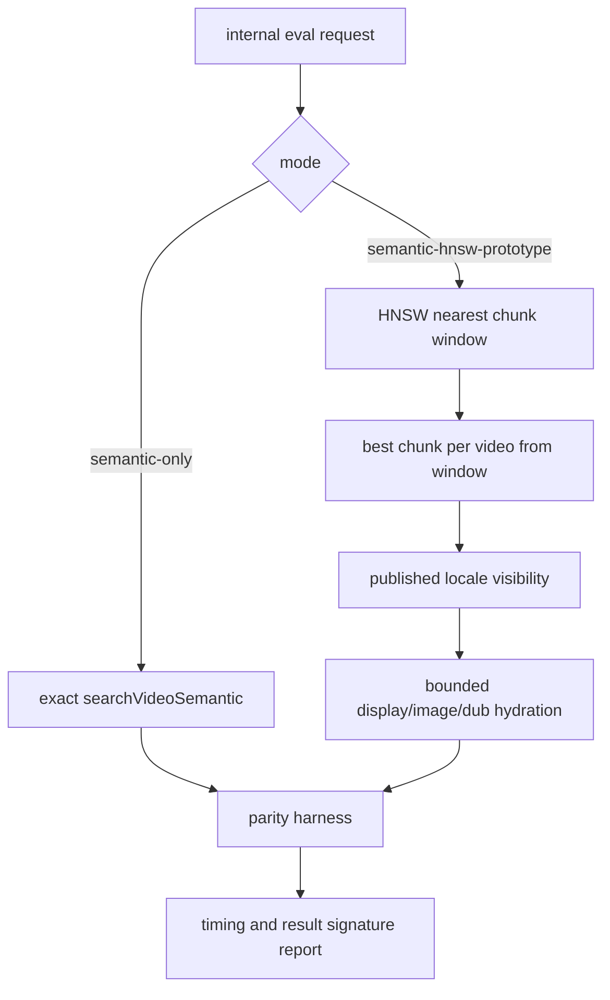

# perf: Prototype Admin semantic HNSW retrieval

## Summary

Add an internal-only Admin search mode that evaluates an HNSW-first transcript
retrieval path against the current exact semantic-video query. The default
keyword-first and hybrid search paths must remain unchanged until production
timing, top-result parity, and distinct-video recall prove the prototype is safe.

---

## Problem Frame

The current semantic-video query preserves exact best transcript chunk per video
behavior by scanning the eligible transcript corpus, collapsing to one chunk per
video, and only then limiting visible candidates. That shape protects quality,
but it blocks the database from using the existing
`video_transcript_chunk_embedding_hnsw*` indexes for the expensive nearest-neighbor
part of the query.

Production timing now shows the safe pool and fan-out changes brought Admin
search into sub-second median service times for the representative canaries, but
the roadmap still keeps HNSW-first retrieval as the next larger optimization.
This plan implements it as a gated prototype so speed can be measured without
silently degrading semantic recall.

---

## Requirements

- R1. Public search callers must not be able to select the prototype mode; unknown
  public `mode` values still warn and fall back to `hybrid`.
- R2. The default `semantic-video` retriever must keep its exact no-pre-window
  query shape, timing label, result mapping, and public response behavior.
- R3. The prototype must use an HNSW-first nearest transcript chunk window before
  collapsing to one candidate per video, with DB timing separated from the
  default query.
- R4. The prototype must preserve existing provenance, language, visibility,
  display hydration, image hydration, dub lookup, and row-mapping rules after its
  candidate window.
- R5. A parity harness must compare the default semantic path and the prototype
  path by result IDs, order, scores, snippets, timecodes, and distinct-video
  count before the prototype can be considered for promotion.
- R6. Focused tests must prove the prototype is internal-only and that the
  default path has not gained HNSW-first behavior.

---

## Key Technical Decisions

- **Gate as an internal Search Pipeline Mode:** Add a literal internal mode that
  `normalizeMode` accepts only when `allowInternalEvalModes` is true. This
  matches the existing `semantic-only` diagnostic boundary and avoids GraphQL or
  Web contract changes.
- **Compare against semantic-only first:** Route the prototype as a semantic
  diagnostic path, not as the new keyword-first default. This isolates the
  algorithmic change in video semantic retrieval before mixing it with lexical
  rankers.
- **Keep default SQL exact:** Leave `searchVideoSemantic` as the source of truth
  for current best-evidence-per-video behavior. Add a sibling retriever for the
  prototype so tests can assert both shapes independently.
- **Use transaction-scoped pgvector tuning:** Apply `SET LOCAL hnsw.ef_search`
  and bounded iterative-scan settings inside the same Prisma transaction as the
  prototype query, following the existing pgvector transaction rule.
- **Start with conservative prototype constants:** Use a nearest-row window of
  `max(limit * 20, 1000)` bounded to `5000`, `hnsw.ef_search = 200`, and
  `hnsw.max_scan_tuples = 20000`. These values are prototype defaults for
  parity measurement, not public search tuning.
- **Make parity measurable, not implied:** Add a small script that can call the
  internal eval-search route for both modes and emit compact timing and signature
  comparisons. Promotion remains a later decision after production measurements.

---

## High-Level Technical Design

The prototype intentionally moves the first `LIMIT` earlier than the default
query. That is the performance lever and the relevance risk, so the default
path and the parity harness must make the difference visible.

---

## Implementation Units

### U1. Add the internal prototype mode boundary

- **Goal:** Allow authenticated internal eval callers to request the prototype
  while keeping public search mode behavior unchanged.
- **Requirements:** R1, R6
- **Dependencies:** none
- **Files:**
  - `apps/admin/src/services/hybrid-search.service.ts`
  - `apps/admin/src/services/hybrid-search.service.test.ts`
  - `apps/admin/src/services/hybrid-search.keyword-first.test.ts`
  - `apps/admin/src/app/api/internal/search-eval/search/route.test.ts`
- **Approach:** Extend `SearchPipelineMode` with an internal-only prototype
  literal. Update `normalizeMode` so it accepts the literal only when
  `allowInternalEvalModes` is true, mirroring `semantic-only`. Keep public
  unknown-mode fallback and warning behavior unchanged.
- **Patterns to follow:** Existing `semantic-only` internal eval mode handling in
  `apps/admin/src/services/hybrid-search.service.ts`.
- **Test scenarios:**
  - `normalizeMode` accepts the prototype mode only with
    `allowInternalEvalModes: true`.
  - Public `normalizeMode` calls treat the prototype mode as unknown and fall
    back to `hybrid` with one warning.
  - The internal eval route continues passing `allowInternalEvalModes: true`.
  - Keyword-first tests prove the prototype does not run on normal
    `keyword-first` requests.
- **Verification:** Focused search service and internal eval route tests prove
  the mode gate.

### U2. Add the HNSW-first semantic video retriever

- **Goal:** Implement a sibling retriever that can measure HNSW-first transcript
  retrieval without modifying the default semantic-video path.
- **Requirements:** R2, R3, R4, R6
- **Dependencies:** U1
- **Files:**
  - `apps/admin/src/services/hybrid-search-retrievers.ts`
  - `apps/admin/src/services/hybrid-search-retrievers.test.ts`
  - `apps/admin/src/services/transcript-embedding-ingest.contract.test.ts`
- **Approach:** Add a `searchVideoSemanticHnswPrototype` function that selects a
  bounded nearest transcript chunk window ordered by vector distance, collapses
  that window to one chunk per video, then reuses the same visibility and
  hydration rules as the default query. Run the `SET LOCAL` statements and query
  inside one Prisma transaction, use the documented prototype constants, and
  record a prototype-specific DB timing label.
- **Patterns to follow:** `searchVideoSemantic` for row mapping and visibility;
  `apps/admin/src/services/experience.search.ts` for transaction-scoped
  `SET LOCAL hnsw.ef_search`.
- **Test scenarios:**
  - Default `searchVideoSemantic` still has no `nearest_transcript_chunks` CTE
    and no pre-collapse `LIMIT`.
  - Prototype SQL contains a nearest chunk CTE ordered by
    `vtc.embedding <=> qe.embedding` with a pre-collapse limit.
  - Prototype SQL keeps language, embedding non-null, provider, model,
    dimensions, native dimensions, transform-version, and published locale gates.
  - Prototype SQL applies visibility before the final candidate limit and
    display/image/dub hydration after the final candidate limit.
  - Prototype execution records a distinct DB timing label so production logs can
    compare it with `semantic-video.query`.
- **Verification:** Focused retriever tests pass and prove the default path did
  not change.

### U3. Wire the prototype into internal eval search and add parity reporting

- **Goal:** Let operators run production canaries against both semantic modes and
  compare speed plus result signatures.
- **Requirements:** R3, R5, R6
- **Dependencies:** U2
- **Files:**
  - `apps/admin/src/services/hybrid-search.service.ts`
  - `apps/admin/src/services/hybrid-search.service.test.ts`
  - `apps/admin/src/scripts/search-hnsw-parity.ts`
  - `apps/admin/package.json`
- **Approach:** When the internal prototype mode is requested, dispatch the new
  retriever under a semantic diagnostic branch and skip lexical retrievers. Add a
  script that calls the internal eval-search endpoint for `semantic-only` and
  the prototype mode across supplied queries, then emits per-query timing and
  result signature comparisons.
- **Patterns to follow:** Internal eval route contract in
  `apps/admin/src/app/api/internal/search-eval/search/route.ts`; production
  timing log fields in `apps/admin/src/services/hybrid-search-timing.ts`.
- **Test scenarios:**
  - Prototype mode dispatches the HNSW retriever for video content.
  - Prototype mode does not dispatch keyword, title, or hybrid keyword
    retrievers.
  - Existing `semantic-only` behavior still dispatches the default semantic
    video retriever.
  - The parity script rejects missing endpoint or auth configuration with a
    clear error.
- **Verification:** Focused search service tests pass, and the script can run
  against a configured internal eval-search endpoint after deployment.

### U4. Preserve the evaluation gate in docs

- **Goal:** Keep the roadmap honest that HNSW-first is still a prototype until
  parity and speed measurements pass.
- **Requirements:** R5
- **Dependencies:** U3
- **Files:**
  - `docs/roadmap/content-discovery/feat-175-admin-semantic-search-latency.md`
  - `docs/solutions/performance-issues/`
- **Approach:** Update the roadmap and solution note after implementation to
  record the prototype mode, its parity harness, and the rule that it cannot
  become default without production result-parity and distinct-video evidence.
- **Patterns to follow:** `docs/solutions/performance-issues/admin-semantic-db-retrieval-visible-candidate-window.md`.
- **Test scenarios:** Test expectation: none -- this unit documents the rollout
  gate rather than runtime behavior.
- **Verification:** The docs name the prototype as gated follow-up work, not the
  next default.

---

## Scope Boundaries

- Public Web search, GraphQL input typing, ranking weights, RRF constants,
  dilution cap behavior, and default `keyword-first` retrieval are out of scope.
- New indexes and index rebuilds are out of scope because the transcript chunk
  HNSW indexes already exist.
- Promotion of HNSW-first to default is out of scope until production parity and
  distinct-video recall pass.
- Trace write optimization remains out of scope so timing observability stays
  available during this experiment.

---

## Risks & Dependencies

- **Recall risk:** A nearest chunk window can contain many chunks from one long
  video, reducing distinct videos before the per-video collapse.
- **Planner risk:** HNSW usage still needs production-shaped `EXPLAIN` evidence;
  SQL shape alone does not prove the planner chose the partial index.
- **Timing variance:** Production canaries need repeated runs and result
  signatures so embedding-provider waits and cache effects do not masquerade as
  database gains.
- **Internal contract risk:** The internal eval-search route is used for search
  evaluation tooling, so the prototype mode name must be literal and documented
  enough for repeatable experiments.

---

## Sources / Research

- `docs/roadmap/content-discovery/feat-175-admin-semantic-search-latency.md`
- `docs/plans/2026-06-25-003-perf-admin-search-semantic-db-retrieval-plan.md`
- `docs/plans/2026-06-25-004-perf-admin-search-pool-fanout-plan.md`
- `docs/solutions/performance-issues/admin-semantic-db-retrieval-visible-candidate-window.md`
- `docs/solutions/performance-issues/pgvector-hnsw-index-bypass-with-where-filter-20260415.md`
- `docs/solutions/database-issues/set-local-requires-transaction-for-pgvector-search.md`
- `docs/solutions/platform/admin-transcript-embeddings-vector-reuse-pattern.md`
- `apps/admin/src/services/hybrid-search-retrievers.ts`
- `apps/admin/src/services/hybrid-search.service.ts`
- `apps/admin/src/app/api/internal/search-eval/search/route.ts`
