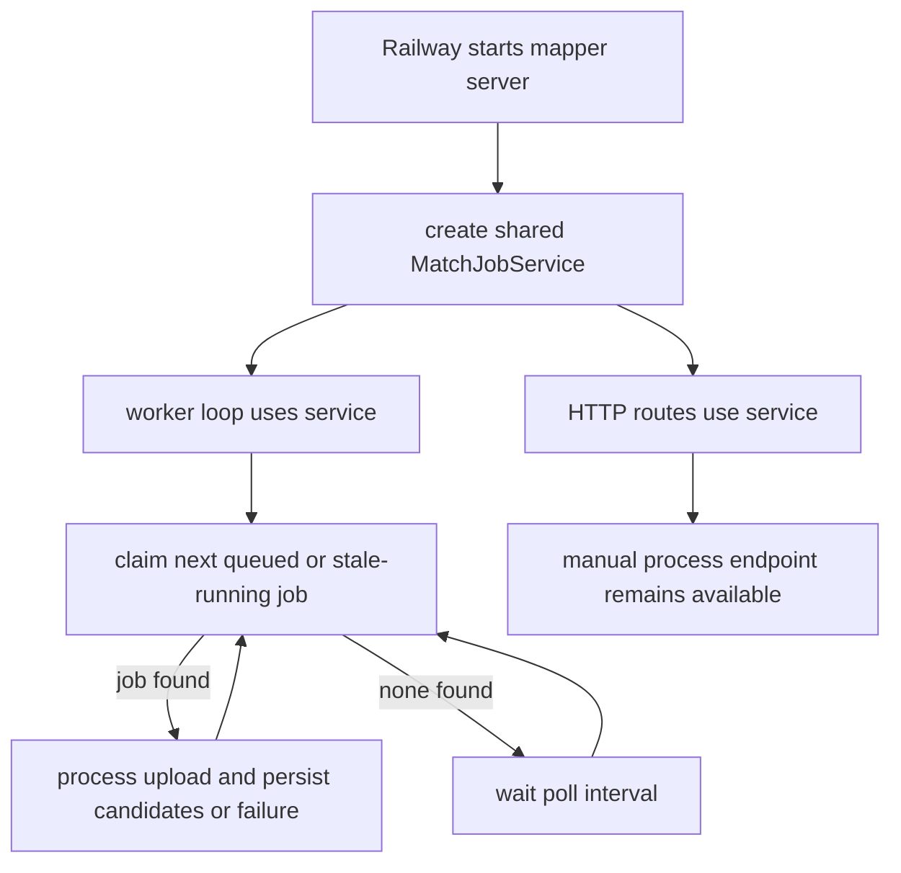

# fix: Drain yt-video-mapper queued match jobs

## Summary

The mapper backend accepts match jobs but does not run an autonomous processor, so durable jobs can remain `queued` forever unless an operator manually calls the process endpoint. This plan adds a bounded in-process worker loop that reuses the existing durable claim semantics, drains queued and stale-running jobs, and keeps the explicit process endpoint available for operator recovery.

---

## Problem Frame

Production health checks pass because the HTTP server is alive, but job progress depends on a separate call to `POST /match-jobs/:jobId/process`. Recent testing volume exposed that no background consumer is started by the Railway service. The existing deployment stores uploads on a persistent volume and match job rows in Postgres, so a fixed runtime can drain the backlog after deploy without replacing the job model.

---

## Requirements

**Processing behavior**

- R1. The mapper service must autonomously claim and process queued Match Jobs after startup.
- R2. The processor must reclaim stale `running` jobs using the existing stale-running window so jobs abandoned by a crash are not stuck indefinitely.
- R3. Manual `POST /match-jobs/:jobId/process` must continue to work for targeted operator recovery.

**Operational behavior**

- R4. The worker must be bounded to one process-local loop by default and avoid unbounded concurrent media processing.
- R5. The runtime must log safe worker lifecycle and job-drain events without exposing bearer tokens, upload bytes, or media URLs.
- R6. Production queue cleanup must use authenticated Railway/Postgres access or a deployed worker; local Codex cannot enumerate production queued rows from the public API alone.

---

## Key Technical Decisions

- KTD1. Add an embedded worker loop instead of changing job creation to fire-and-forget auto-processing. The prior mapper pattern intentionally made job rows durable and processable by a worker/operator; a loop preserves that shape while removing the missing-consumer failure.
- KTD2. Claim the next processable job through the repository, not by listing IDs and then calling the public route. This keeps queued and stale-running recovery atomic enough for a single service replica and avoids adding a public queue-listing surface.
- KTD3. Keep concurrency at one for this fix. The matcher reads uploaded bytes and compares signatures; a single lane is the safest default for clearing the current backlog without surprising Railway resource usage.
- KTD4. Make worker startup explicit in the server boot path and configurable through env. Tests should keep deterministic control over processing, while production should start the worker unless disabled.

---

## High-Level Technical Design

---

## Implementation Units

### U1. Repository and service next-job claim

- **Goal:** Add a service method that processes the next queued or stale-running Match Job without requiring a known job ID.
- **Requirements:** R1, R2, R3.
- **Dependencies:** None.
- **Files:** `apps/yt-video-mapper-backend/src/services/match-job.service.ts`, `apps/yt-video-mapper-backend/src/db/match-job.repository.ts`, `apps/yt-video-mapper-backend/src/services/match-job.service.test.ts`.
- **Approach:** Extend the repository contract with a next-processable claim that orders by queued time, claims either `queued` or stale `running`, and returns the claimed record. Refactor service processing so the explicit job-id path and the next-job path share the same terminal success/failure handling.
- **Patterns to follow:** Existing `claimQueued` stale-running semantics in `PrismaMatchJobRepository`; existing upload cleanup and safe error-code handling in `MatchJobService.processJob`.
- **Test scenarios:**
  - Queued jobs are claimed oldest-first and completed with candidates.
  - A stale running job is reclaimed and processed.
  - A fresh running job is not claimed by the next-job processor.
  - Explicit `processJob(jobId)` still processes a known queued job.
- **Verification:** Mapper backend tests pass for the service and repository paths.

### U2. Embedded worker loop

- **Goal:** Start a bounded background loop that drains processable Match Jobs while the server is running.
- **Requirements:** R1, R2, R4, R5.
- **Dependencies:** U1.
- **Files:** `apps/yt-video-mapper-backend/src/worker.ts`, `apps/yt-video-mapper-backend/src/worker.test.ts`, `apps/yt-video-mapper-backend/src/config/env.ts`, `apps/yt-video-mapper-backend/src/config/env.test.ts`, `apps/yt-video-mapper-backend/src/server.ts`.
- **Approach:** Add a small worker module that repeatedly calls the service next-job method until no job is available, then sleeps for a configured poll interval. Start it from `startServer` with the same service instance used by HTTP routes. Keep the exported test handler free of implicit worker startup.
- **Patterns to follow:** Existing env parsing in `config/env.ts`; safe structured logging style used by worker services.
- **Test scenarios:**
  - Worker calls the processor immediately on start and repeats after a poll interval when no work is available.
  - Worker continues after a job failure because the service records terminal failure internally.
  - Server dependency construction uses one shared `MatchJobService` for routes and worker startup.
  - Env parsing accepts explicit worker enable/disable and poll interval values.
- **Verification:** Focused worker, env, and server tests pass.

### U3. Operational docs and smoke guidance

- **Goal:** Update mapper deployment guidance so operators know the service now owns autonomous queue draining and how to clear the current backlog.
- **Requirements:** R5, R6.
- **Dependencies:** U1, U2.
- **Files:** `apps/yt-video-mapper-backend/docs/railway-deployment.md`, `apps/yt-video-mapper-backend/README.md`.
- **Approach:** Document the worker env vars, the expected post-deploy behavior for queued rows, and the fallback when Railway/Postgres access is required to inspect or delete stale jobs directly.
- **Patterns to follow:** Existing Railway deployment notes and match job smoke section.
- **Test scenarios:** Test expectation: none -- documentation-only unit.
- **Verification:** Documentation names the worker behavior and the queue cleanup access boundary.

### U4. Production queue cleanup

- **Goal:** Clear the production backlog after the fix is available to the running service.
- **Requirements:** R1, R2, R6.
- **Dependencies:** U2.
- **Files:** No code files expected unless implementation discovers a missing operator affordance.
- **Approach:** Prefer deploying or restarting the fixed service so the worker drains queued and stale-running rows through normal processing. If immediate cleanup is needed before deploy, use authenticated Railway/Postgres access to inspect queued rows and either process known job IDs through the existing endpoint or mark intentionally discarded test rows terminal.
- **Patterns to follow:** Railway deployment verification notes in `apps/yt-video-mapper-backend/docs/railway-deployment.md`; prior Railway config verification solution notes.
- **Test scenarios:** Test expectation: none -- operator action over production state.
- **Verification:** A post-cleanup queue count shows no unwanted queued rows, or the operator records any intentionally retained rows.

---

## Risks & Dependencies

- **Railway access:** Queue clearing requires Railway CLI auth, Postgres credentials, or the deployed worker. The current Codex environment has the public API token but cannot list all production job IDs from the public API.
- **Resource use:** Processing uploads inside the HTTP service can consume CPU. Single-job concurrency and a configurable worker enable flag limit blast radius for this fix.
- **Partial backlog quality:** Some queued rows may be test uploads with no expected candidates. Draining them to `complete` with empty candidates is acceptable when the request was valid and the matcher finds no evidence.

---

## Documentation / Operational Notes

After the fix is deployed, verify `/health`, submit a small authenticated smoke job, and confirm it leaves `queued` without manually calling `/process`. For the existing backlog, use Railway/Postgres access to count remaining `queued` and stale `running` rows after the worker has had time to drain.

---

## Sources / Research

- `apps/yt-video-mapper-backend/src/server.ts` currently defaults `autoProcessMatchJobs` to false.
- `apps/yt-video-mapper-backend/src/routes/match-jobs.ts` only calls `service.processJob` when auto-processing is enabled or the process endpoint is called.
- `docs/solutions/platform/yt-video-mapper-backend-app-durable-match-job-upload-poll-process-pattern.md` defines the durable upload, poll, and explicit drain pattern.
- `apps/yt-video-mapper-backend/docs/railway-deployment.md` records the production service shape, persistent upload volume, and manual process smoke.
