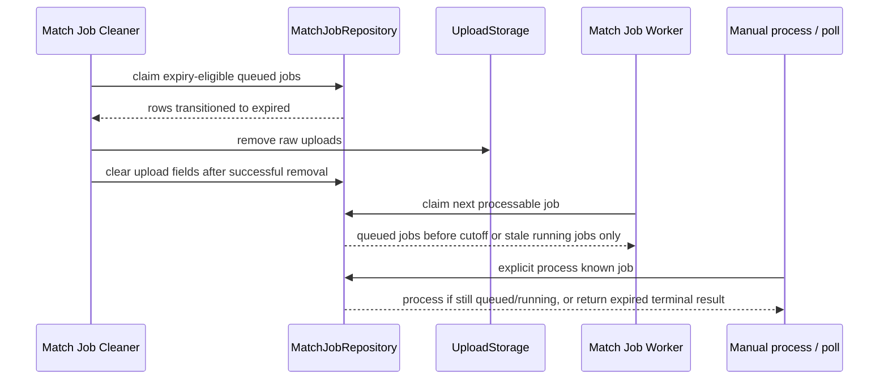
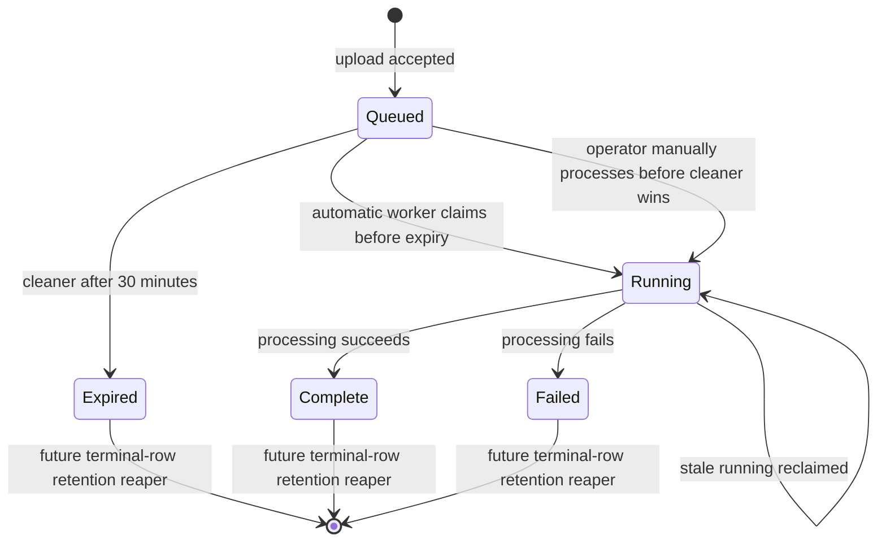

# feat: Expire yt-mapper queued match jobs

## Summary

Add a yt-video-mapper-only cleaner that expires abandoned queued Match Jobs after 30 minutes, removes their raw uploads, and keeps lightweight expired rows pollable with `job_expired`. The automatic worker will avoid claiming expiry-eligible queued jobs, while the manual process endpoint can still rescue an overdue queued job until the cleaner marks it `expired`.

---

## Problem Frame

The mapper backend now has an autonomous worker, but forgotten uploads can still sit in durable queue state when no worker claims them soon enough or no client returns to poll them. The origin requirements define this as a yt-mapper-scoped queue hygiene problem, not a cross-service queue framework. The plan keeps the existing durable Match Job model and adds a bounded cleaner path that protects raw upload storage without deleting the public polling trail for known job IDs.

---

## Requirements

**Status and API contract**

- PR1. Add `expired` as a distinct terminal Match Job status for `apps/yt-video-mapper-backend` only.
- PR2. Polling an expired job returns `{ jobId, status: "expired", errorCode: "job_expired" }` and does not expose upload metadata.
- PR3. Existing `queued`, `running`, `complete`, and `failed` response behavior remains unchanged for non-expired jobs.
- PR4. Expired jobs are terminal and cannot be claimed by the automatic worker or manual process endpoint.

**Expiry and cleanup behavior**

- PR5. A queued Match Job is expiry-eligible when `queuedAt` is at least 30 minutes old.
- PR6. Running jobs are never queue-expired, including stale running jobs; they remain governed by stale-running reclaim.
- PR7. The cleaner transitions eligible queued jobs to `expired` before attempting raw upload deletion.
- PR8. After successful upload deletion, the cleaner clears upload storage fields from the expired row so the preserved row is lightweight.
- PR9. If upload deletion fails after the row is expired, later cleaner runs retry cleanup for expired rows that still have upload storage fields.
- PR10. Existing queued jobs that are already older than 30 minutes at rollout expire on the first cleaner pass.

**Runtime and operations**

- PR11. The cleaner runs independently of client polling and independently of the Match Job Worker loop.
- PR12. The cleaner runs on a fixed one-minute cadence and must not overlap a prior long-running cleanup tick; multi-instance deployments coordinate with a database-backed lock before doing cleaner work.
- PR13. The automatic worker does not claim expiry-eligible queued jobs; the manual process endpoint can still process an overdue queued job before the cleaner marks it expired.
- PR14. Cleaner logs use safe job IDs, counts, and error codes without bearer tokens, upload bytes, or media URLs.
- PR15. Documentation explains the cleaner's fixed 30-minute expiry, one-minute cadence, rollout behavior for old queued jobs, and production smoke expectations.
- PR16. Cleaner logs expose stuck-upload cleanup counts and repeated cleanup failure signals so operators can see when expired rows still reference raw uploads.

**Origin traceability**

- PR1 maps to origin R1 and R7.
- PR2 maps to origin R10.
- PR3 maps to origin R13.
- PR4 maps to origin R11.
- PR5 maps to origin R2.
- PR6 maps to origin R3.
- PR7 maps to origin R6 and R7, with ordering added for race safety.
- PR8 maps to origin R6 and R8, with field clearing added to satisfy the lightweight-row decision.
- PR9 is derived from PR8 to make upload cleanup retryable after storage failures.
- PR10 maps to origin R4 and AE5.
- PR11 maps to origin R9.
- PR12 maps to origin R5.
- PR13 maps to origin R12, with automatic-worker filtering added to protect PR10 during rollout.
- PR14 is an operational safety requirement derived from the cleaner runtime.
- PR15 is an operational handoff requirement derived from the deployment scope.
- PR16 is an operational observability requirement derived from the upload cleanup retry path.

---

## Key Technical Decisions

- **KTD1. Use a real enum status for `expired`.** The job status is persisted as a Postgres enum and mapped through Prisma, so a migration plus status mapping keeps the public API, repository, and service model aligned with the new terminal state.
- **KTD2. Keep automatic and manual claim rules intentionally different.** The worker-facing next-job path skips queued jobs at or past the expiry threshold so rollout backlog expires, while explicit `processJob(jobId)` keeps the manual rescue window from the requirements.
- **KTD3. Mark expired before deleting uploads.** The cleaner must win a conditional `queued -> expired` transition before touching storage, preventing a worker or operator from claiming a row whose input was deleted first.
- **KTD4. Retry upload cleanup for expired rows with leftover upload keys.** Storage deletion can fail after the status transition, so the lightweight-row guarantee needs a retry path that clears upload fields only after deletion succeeds.
- **KTD5. Run the cleaner as its own runtime loop.** Folding expiry into the worker loop would make cleanup dependent on processing cadence and worker enablement, which conflicts with abandoned-job cleanup.
- **KTD6. Do not add an `expiredAt` column in v1.** `status`, `safeErrorCode`, `updatedAt`, and existing `retentionExpiresAt` are enough for the public behavior; terminal-row reaping remains a separate follow-up.
- **KTD7. Keep cleaner policy fixed in production.** The user-selected 30-minute expiry and one-minute cadence are service behavior, not operator-tunable policy in v1; tests can inject shorter intervals and page sizes. `MATCH_JOB_CLEANER_ENABLED` is a rollout and incident kill switch only, not a timing knob.
- **KTD8. Coordinate cleaner passes with a database lock.** The in-process no-overlap guard prevents local reentry, while a database-backed lock prevents multiple app instances from running the cleaner pass at the same time.

---

## High-Level Technical Design

---

## Implementation Units

### U1. Expired status and public contract

- **Goal:** Add `expired` as a persisted terminal Match Job status and expose the required polling response.
- **Requirements:** PR1, PR2, PR3, PR4.
- **Dependencies:** None.
- **Files:** `apps/yt-video-mapper-backend/prisma/schema.prisma`, `apps/yt-video-mapper-backend/prisma/migrations/20260629000100_add_expired_match_job_status/migration.sql`, `apps/yt-video-mapper-backend/src/services/match-job.service.ts`, `apps/yt-video-mapper-backend/src/db/match-job.repository.ts`, `apps/yt-video-mapper-backend/src/db/schema.test.ts`, `apps/yt-video-mapper-backend/src/services/match-job.service.test.ts`, `apps/yt-video-mapper-backend/src/routes/match-jobs.test.ts`.
- **Approach:** Add `EXPIRED @map("expired")` to the Prisma enum and a forward migration that mirrors the repo's existing enum-add migration style. Extend the TypeScript status union, Prisma status maps, terminal-state checks, and polling result shape. Keep `failed` handling intact so matcher failures and expiry remain distinguishable.
- **Patterns to follow:** Existing `MatchJobStatus` mappings in `apps/yt-video-mapper-backend/src/db/match-job.repository.ts`; failed-result response shape in `apps/yt-video-mapper-backend/src/services/match-job.service.ts`; schema assertions in `apps/yt-video-mapper-backend/src/db/schema.test.ts`.
- **Test scenarios:**
  - Covers AE2. A job with status `expired` polls as `{ jobId, status: "expired", errorCode: "job_expired" }`.
  - Calling the manual process endpoint for an expired job returns the terminal expired payload and does not invoke matching.
  - Status mapping round-trips `expired` between Prisma and the public service model.
  - Existing failed jobs still return `status: "failed"` with their safe error code.
- **Verification:** Service, route, and schema tests prove the new status is terminal and publicly distinguishable from failure.

### U2. Atomic expiry repository and service behavior

- **Goal:** Add race-safe queued-job expiry that removes raw uploads only after a successful status transition.
- **Requirements:** PR5, PR6, PR7, PR8, PR9, PR10, PR13.
- **Dependencies:** U1.
- **Files:** `apps/yt-video-mapper-backend/src/services/match-job.service.ts`, `apps/yt-video-mapper-backend/src/db/match-job.repository.ts`, `apps/yt-video-mapper-backend/src/services/upload-storage.ts`, `apps/yt-video-mapper-backend/src/services/match-job.service.test.ts`.
- **Approach:** Add repository operations that conditionally transition only `queued` rows with `queuedAt <= cutoff` to `expired`, return only rows won by that transition, and later clear upload fields after successful storage deletion. Add a companion cleanup path for already-expired rows that still have upload fields, so a storage error on one tick can be retried on a later tick. Keep explicit `claimQueued(jobId)` eligible for overdue queued jobs until the cleaner wins.
- **Technical design:** Directional guidance only: each cleaner pass should loop through eligible rows in pages of an internal `MATCH_JOB_CLEANER_PAGE_SIZE` constant until no eligible page remains; the page size bounds each database transition, not the whole pass. Use current-row predicates for every status transition, and treat missing upload files as cleanup success because `FileSystemUploadStorage.remove` is already idempotent.
- **Patterns to follow:** Conditional `updateMany` claim semantics in `PrismaMatchJobRepository`; best-effort upload cleanup helper in `MatchJobService`; atomic-update caution from `docs/solutions/database-issues/db-lock-must-be-atomic-update-not-select-for-update.md`.
- **Test scenarios:**
  - Covers AE1. A queued job older than 30 minutes becomes `expired`, deletes its upload, and remains pollable.
  - A queued job at 29 minutes 59 seconds does not expire.
  - A queued job at exactly 30 minutes expires when using the cutoff predicate.
  - Covers AE3. A running job older than 30 minutes is not expired.
  - A stale running job older than 30 minutes remains reclaimable through the existing stale-running path.
  - Covers AE4. Manual `processJob(jobId)` can claim and process an overdue queued job before the cleaner transitions it.
  - If the cleaner wins before manual processing, the manual process path returns the expired terminal result and does not run extraction or matching.
  - A storage deletion error leaves upload fields present for retry, and a later cleaner pass removes the upload and clears those fields.
  - Multiple cleaner attempts or lost races do not delete upload bytes for rows they did not transition.
- **Verification:** Service tests cover the state transitions, race boundaries, and storage cleanup semantics without requiring a live database.

### U3. Worker claim filtering and rollout safety

- **Goal:** Ensure old queued backlog expires on rollout instead of being auto-processed before the cleaner sees it.
- **Requirements:** PR6, PR10, PR13.
- **Dependencies:** U2.
- **Files:** `apps/yt-video-mapper-backend/src/services/match-job.service.ts`, `apps/yt-video-mapper-backend/src/db/match-job.repository.ts`, `apps/yt-video-mapper-backend/src/services/match-job.service.test.ts`, `apps/yt-video-mapper-backend/src/worker.test.ts`.
- **Approach:** Thread the expiry cutoff into the worker-facing next-job claim so automatic processing only claims queued jobs that are still younger than the expiry window, while preserving stale-running reclaim. Do not apply that age filter to explicit manual processing.
- **Patterns to follow:** Existing `claimNextQueued` ordering by queued time; origin requirement that manual rescue remains possible until cleaner marks the job expired.
- **Test scenarios:**
  - Covers AE5. A queued job older than 30 minutes is not claimed by the automatic worker and is expired by the cleaner.
  - A queued job younger than 30 minutes is still claimed and processed by the automatic worker.
  - A stale running job older than 30 minutes is still claimed by the automatic worker as stale running.
  - A manual process call can process an older queued job before cleaner expiry.
- **Verification:** Worker-facing tests prove rollout backlog is routed to cleaner expiry without breaking normal fresh-job processing.

### U4. Cleaner runtime loop

- **Goal:** Run the cleaner on its own one-minute cadence in the yt-mapper server runtime.
- **Requirements:** PR5, PR11, PR12, PR14, PR16.
- **Dependencies:** U2, U3.
- **Files:** `apps/yt-video-mapper-backend/src/cleaner.ts`, `apps/yt-video-mapper-backend/src/cleaner.test.ts`, `apps/yt-video-mapper-backend/src/server.ts`, `apps/yt-video-mapper-backend/src/server.test.ts`, `apps/yt-video-mapper-backend/src/db/match-job.repository.ts`.
- **Approach:** Add a `startMatchJobCleaner` loop with fake-timer-testable scheduling, an in-process no-overlap guard, a database-backed per-pass lock, safe structured logs, and a `stop()` handle mirroring the worker shape. Use fixed production constants for 30-minute queued expiry, one-minute cadence, and bounded page size, with shorter values injectable only in tests. Start and stop the cleaner alongside the server runtime using the same `MatchJobService`, keep the cleaner independent from `MATCH_JOB_WORKER_ENABLED`, and add `MATCH_JOB_CLEANER_ENABLED=false` as a forward-only rollout kill switch.
- **Patterns to follow:** `startMatchJobWorker` timer and stop-handle pattern in `apps/yt-video-mapper-backend/src/worker.ts`; repository-owned atomic database operations in `apps/yt-video-mapper-backend/src/db/match-job.repository.ts`.
- **Test scenarios:**
  - Cleaner runs immediately on start, then waits the fixed one-minute interval.
  - Cleaner does not schedule an overlapping tick when one cleanup call is still pending.
  - Two cleaner instances cannot both run work for the same tick because only one obtains the database-backed lock.
  - Cleaner logs and continues after one cleanup error.
  - `stop()` prevents further ticks after an in-flight cleanup resolves.
  - Server runtime starts the cleaner with the route service and stops it on server close.
  - Cleaner production behavior is fixed at `queued expiry=30 minutes`, `interval=60000 ms`, with test-injected overrides only.
  - `MATCH_JOB_CLEANER_ENABLED=false` prevents cleaner startup without disabling the worker.
  - A cleaner pass with `batchSize + 1` overdue queued jobs expires all eligible rows before the pass completes, using more than one bounded page.
- **Verification:** Cleaner and server tests demonstrate independent runtime behavior from the worker loop, global pass coordination, and stuck-upload observability.

### U5. Documentation and operational verification

- **Goal:** Document the yt-mapper cleaner behavior, fixed runtime policy, and production smoke expectations.
- **Requirements:** PR14, PR15, PR16.
- **Dependencies:** U1, U2, U3, U4.
- **Files:** `apps/yt-video-mapper-backend/README.md`, `apps/yt-video-mapper-backend/docs/railway-deployment.md`, `docs/solutions/platform/yt-video-mapper-backend-app-durable-match-job-upload-poll-process-pattern.md`.
- **Approach:** Update docs to name the Match Job Cleaner, its fixed 30-minute expiry and one-minute cadence, the first-rollout behavior for overdue queued rows, stuck-upload cleanup logging, and the poll response for expired jobs. Clarify that expired rows remain until a separate terminal-row reaper exists because current code records `retentionExpiresAt` but does not delete terminal rows yet.
- **Patterns to follow:** Existing Railway env and smoke sections in `apps/yt-video-mapper-backend/docs/railway-deployment.md`; existing durable match-job solution note caveat.
- **Test scenarios:** Test expectation: none -- documentation-only unit.
- **Verification:** Documentation gives operators enough information to deploy, smoke, and understand old queued-row expiry without exposing secrets.

---

## Acceptance Examples

- AE1. Abandoned queued job expires: A queued job older than 30 minutes becomes `expired`, its upload is removed, and the row remains pollable.
- AE2. Expired poll response: Polling an expired job returns `{ jobId, status: "expired", errorCode: "job_expired" }`.
- AE3. Running jobs are not queue-expired: A running job older than 30 minutes is left for stale-running reclaim.
- AE4. Manual rescue wins before cleaner: A known overdue queued job can still process if the manual endpoint claims it before the cleaner status transition.
- AE5. Existing backlog expires on rollout: Old queued rows that already exceed 30 minutes expire on the first cleaner pass.

---

## Scope Boundaries

### In Scope

- yt-video-mapper match job status, service, repository, cleaner runtime, tests, and docs.
- A forward-only Prisma migration for the `expired` enum value and any index needed for cleaner predicates.
- Fixed cleaner runtime policy with test-injected timing and page-size controls.

### Deferred to Follow-Up Work

- A general terminal-row retention reaper that deletes old expired, complete, and failed rows.
- A public queue listing or admin dashboard for inspecting all queued jobs.
- Streaming upload storage hardening for large inputs.

### Out of Scope

- Queue cleanup behavior outside `apps/yt-video-mapper-backend`.
- Killing or expiring `running` jobs by total age.
- Replacing the process-local worker with an external queue service.

---

## Risks & Dependencies

- **Enum migration risk:** `expired` is a forward database enum change. Rollback should be forward-only by deploying code that tolerates the value and, if needed, setting `MATCH_JOB_CLEANER_ENABLED=false` rather than trying to remove the enum value.
- **Worker/cleaner race:** The worker currently starts immediately and can claim old queued rows. U4 mitigates this by filtering automatic claims with the expiry cutoff.
- **Upload cleanup failure:** A filesystem deletion error after status expiry could leave storage behind. U2 and U4 mitigate this with retryable expired-row cleanup, structured stuck-upload counts, and field clearing only after successful deletion.
- **Cleaner overlap:** A large backlog could make one tick run longer than a minute, and multiple app instances could otherwise duplicate cleaner work. U4 mitigates this with an in-process no-overlap guard, a database-backed lock, and bounded page draining.
- **Cleaner outage:** Because the automatic worker skips expiry-eligible queued jobs, a persistent cleaner failure could strand old queued rows. U4 mitigates this with repeated-failure logging that should be included in production smoke and alert review.
- **Production observability:** The cleaner needs safe logs and smoke guidance because the public API cannot list the whole queue.

---

## Documentation / Operational Notes

The deployed Railway service runs `db:migrate:deploy` before `start`, so the enum migration must land before code that can write `expired`. Production smoke should create one fresh job and confirm it completes or remains processable normally, then verify an intentionally aged local/test fixture through automated tests rather than trying to age a prod upload for 30 minutes.

---

## Sources / Research

- Origin requirements: `docs/brainstorms/2026-06-29-yt-mapper-queued-job-expiry-requirements.md`.
- Current lifecycle and polling: `apps/yt-video-mapper-backend/src/services/match-job.service.ts`.
- Current Prisma status mapping and claim logic: `apps/yt-video-mapper-backend/src/db/match-job.repository.ts`.
- Current schema and indexes: `apps/yt-video-mapper-backend/prisma/schema.prisma`.
- Runtime worker pattern: `apps/yt-video-mapper-backend/src/worker.ts` and `apps/yt-video-mapper-backend/src/worker.test.ts`.
- Upload storage deletion semantics: `apps/yt-video-mapper-backend/src/services/upload-storage.ts`.
- Railway service and env docs: `apps/yt-video-mapper-backend/docs/railway-deployment.md`.
- Durable match job pattern: `docs/solutions/platform/yt-video-mapper-backend-app-durable-match-job-upload-poll-process-pattern.md`.
- Retention scheduler caution: `docs/solutions/platform/admin-search-trace-retention-pattern.md`.
- Atomic update caution: `docs/solutions/database-issues/db-lock-must-be-atomic-update-not-select-for-update.md`.
