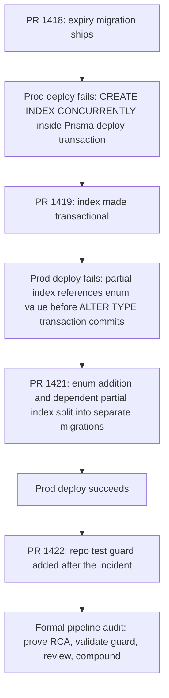

# fix: Formalize yt-mapper Prisma migration root-cause remediation

## Summary

This plan verifies and formalizes the root-cause remediation for the
yt-video-mapper production migration failures that happened during the queued
job expiry rollout. The corrective work is not another production change by
default; it is an evidence-backed audit of the merged migration fix and safety
guard, followed by formal review and durable learning capture.

---

## Problem Frame

The queued-job expiry feature reached production through three migration
iterations. PR 1418 introduced the feature and first migration. PR 1419 removed
`CREATE INDEX CONCURRENTLY` after Prisma deploy failed in a transaction. PR 1421
split the enum addition from the partial index after Postgres rejected same
transaction use of the newly added enum value. PR 1422 added a test guard after
the fact, but that guard was merged before this formal CE pipeline ran.

The root cause to validate is a workflow and test-surface gap: review and local
verification did not have a general pre-merge invariant for SQL that is unsafe
inside Prisma `migrate deploy` transactions. The final production migrations may
now be correct, but the formal pipeline must prove the causal chain, validate
the remediation, and capture the learning without making another unapproved
prod-facing change.

---

## Requirements

**Root-cause evidence**

- R1. The formal pass must identify the full causal chain from original SQL
  shape to production deploy failure using repository, PR, deploy, and primary
  database documentation evidence.
- R2. The formal pass must distinguish failed migration attempts from
  successfully applied migration history, preserving the repo's Forward-Only
  Migration and Known Recoverable Migration concepts.

**Remediation verification**

- R3. Existing yt-video-mapper migrations must avoid `CONCURRENTLY` and avoid
  referencing a newly added enum literal in the same migration that adds it.
- R4. The repository guard must fail on synthetic fixtures for both deploy
  failure modes and pass against every current yt-mapper migration.
- R5. Verification must run from a branch based on `upstream/main`, not from an
  already-merged hotfix branch with different ancestry or generated artifacts.

**Process control**

- R6. The formal run must not merge or deploy additional changes without
  explicit user approval after review.
- R7. Durable learning must land in `docs/solutions/` or an equivalent formal
  `ce:compound` artifact so future mapper migration work can find the trap
  before production deploy.

---

## High-Level Technical Design

The formal pipeline audits the landed state rather than introducing a new
runtime path. Any additional remediation discovered by review becomes a new,
separately approved change.

---

## Key Technical Decisions

- KTD1. Treat the root cause as a missing migration-safety invariant, not as a
  remaining bad production migration. The final migrations are split and
  transaction-compatible; the broader failure was that this compatibility was
  learned from prod deploy failures instead of enforced before merge.
- KTD2. Keep the prevention guard in the mapper schema test surface. The
  current guard in `apps/yt-video-mapper-backend/src/db/schema.test.ts` scans
  every mapper migration and already runs in the backend test command used by
  CI.
- KTD3. Ground the rule in primary sources. Prisma documents `migrate deploy`
  as the production migration path and recommends pre-deploy migration safety
  checks; PostgreSQL documents that `CREATE INDEX CONCURRENTLY` cannot run
  inside a transaction block and that a new enum value added inside a
  transaction cannot be used until commit.
- KTD4. Do not use this formal run as a backdoor deployment. The review target
  is the causal chain, tests, docs, and existing merged remediation. Shipping
  anything new requires a separate approval point.

---

## Implementation Units

### U0. Evidence Access Prerequisites

**Goal:** Establish the deployment and database evidence sources needed before
the formal RCA can claim the production history.

**Requirements:** R1, R2

**Dependencies:** None

**Files:** `apps/yt-video-mapper-backend/docs/railway-deployment.md`

**Approach:** Collect Railway production deployment log URLs or pasted log
excerpts for the first failed deploy, the second failed deploy, and the final
successful deploy. Collect a production `_prisma_migrations` status readout
that shows failed rows separately from applied rows. If any source is
unavailable, mark U1 blocked for that evidence and carry the limitation into
the handoff instead of inferring the production state from PR metadata alone.

**Patterns to follow:** Production verification notes in
`apps/yt-video-mapper-backend/docs/railway-deployment.md`

**Test scenarios:** Test expectation: none -- this unit collects operational
evidence.

**Verification:** The working notes include deploy-log evidence or an explicit
access limitation for each failed and successful deploy, plus the migration
table status evidence or its access limitation.

### U1. Root-Cause Evidence Audit

**Goal:** Prove the causal chain behind the migration failures and identify
whether the merged state still has an unresolved defect.

**Requirements:** R1, R2

**Dependencies:** U0

**Files:** `apps/yt-video-mapper-backend/prisma/migrations/20260629000100_add_expired_match_job_status/migration.sql`, `apps/yt-video-mapper-backend/prisma/migrations/20260629000200_add_expired_upload_cleanup_index/migration.sql`, `apps/yt-video-mapper-backend/docs/railway-deployment.md`, `CONCEPTS.md`

**Approach:** Compare the two repaired migrations against the two production
failure modes and the repo's forward-only migration definitions. Use PR merge
metadata for PRs 1418, 1419, 1421, and 1422 as chronology only, not as the
source of deploy error truth. Use U0's Railway log excerpts and
`_prisma_migrations` snapshot as production evidence; if either artifact is
unavailable, the handoff must state that limitation before concluding R2.

**Patterns to follow:** `docs/solutions/workflow-issues/yt-video-mapper-railway-prisma-backend-deployment.md`, `docs/solutions/deployment/railway-dashboard-override-shadows-railway-toml-20260429.md`

**Test scenarios:** Test expectation: none -- this unit is evidence collection
and classification.

**Verification:** The handoff names the causal chain with no unresolved
`somehow` gap, cites failed-deploy and migration-table evidence or names the
access gap, and states whether any new code change is required.

### U2. Remediation Guard Verification

**Goal:** Verify that the merged test guard covers the production failure modes
generically, not only by asserting the current migration filenames.

**Requirements:** R3, R4, R5

**Dependencies:** U1

**Files:** `apps/yt-video-mapper-backend/src/db/schema.test.ts`, `apps/yt-video-mapper-backend/prisma/migrations/*/migration.sql`

**Approach:** Inspect the guard for three properties: it scans all migration
directories, strips SQL comments, and has synthetic failing fixtures for both
`CONCURRENTLY` and same-migration enum literal reuse. Reconstruct the
historical bad migration bodies from PR 1418 and PR 1419 with `git show`, then
verify the guard reports the two production failure modes against those
historical inputs before accepting PR 1422 as remediation.

**Patterns to follow:** Existing schema regression tests in
`apps/yt-video-mapper-backend/src/db/schema.test.ts`

**Test scenarios:**

- Given a synthetic migration containing `CREATE INDEX CONCURRENTLY`, the guard
  returns a deploy-transaction violation.
- Given a synthetic migration that adds enum value `expired` and uses
  `'expired'` again later, the guard returns a split-migration violation.
- Given unsafe-looking SQL only in comments, the guard returns no violation.
- Given the current mapper migrations, the guard returns no violations.
- Given the historical PR 1418 migration body with `CREATE INDEX CONCURRENTLY`,
  the guard reports the deploy-transaction violation.
- Given the historical PR 1419 migration bodies where the same migration adds
  `expired` and uses `'expired'` in a partial index predicate, the guard reports
  the split-migration violation.

**Verification:** `pnpm --filter @forge/yt-video-mapper-backend test -- src/db/schema.test.ts`

### U3. Package Validation on the Correct Base

**Goal:** Confirm the landed remediation is valid from `upstream/main` with the
generated Prisma client present.

**Requirements:** R5

**Dependencies:** U2

**Files:** `apps/yt-video-mapper-backend/package.json`, `apps/yt-video-mapper-backend/prisma/schema.prisma`

**Approach:** Run the backend verification commands after regenerating Prisma
when needed. Treat missing generated Prisma output as an environment setup
issue, not as a remediation failure, because the build regenerates it. Also run
`pnpm --filter @forge/yt-video-mapper-backend db:migrate:deploy` against a
disposable Postgres database from a clean schema so the formal audit exercises
the same Prisma migration runner class that failed in production.

**Patterns to follow:** Verification commands in
`docs/prototypes/yt-video-mapper/tickets/ytm-010-prisma-migration-deploy-safety.md`

**Test scenarios:** Test expectation: none -- this unit executes existing
package verification rather than adding behavior.

**Verification:** Backend schema test, disposable-Postgres migrate deploy, full
backend tests, typecheck, lint, format check, and build pass.

### U4. Formal Review of Root Cause and Remediation

**Goal:** Run `ce:review` against the root-cause remediation, including the
test guard and the formal artifacts from this plan.

**Requirements:** R1, R3, R4, R6

**Dependencies:** U1, U2, U3

**Files:** `apps/yt-video-mapper-backend/src/db/schema.test.ts`, `docs/plans/2026-06-30-001-fix-yt-mapper-prisma-migration-root-cause-plan.md`

**Approach:** Review for false positives, false negatives, missing migration
failure modes, and whether any new production-facing change is being smuggled
through the formal audit. Because PR 1422 is already merged, do not review the
empty current worktree as the remediation scope. Review the merged guard
explicitly by comparing `6737b4c1^` to `6737b4c1`, and include this plan as an
additional review artifact.

**Patterns to follow:** Formal `ce:review` output under
`/tmp/compound-engineering/ce-code-review/`

**Test scenarios:** Test expectation: none -- review output is the artifact.

**Verification:** `ce:review` returns a formal review envelope with no P0 or P1
findings requiring code changes before handoff.

### U5. Compound the Migration-Safety Learning

**Goal:** Preserve the incident lesson where future yt-mapper and Prisma
migration work will find it before deployment.

**Requirements:** R7

**Dependencies:** U1, U2, U4

**Files:** `docs/solutions/workflow-issues/yt-video-mapper-prisma-migration-transaction-safety.md`

**Approach:** Capture the root cause, detection signals, prevention guard,
false-confidence trap, and when to split enum migrations from dependent SQL.

**Patterns to follow:** Existing solution-note shape in
`docs/solutions/workflow-issues/yt-video-mapper-railway-prisma-backend-deployment.md`

**Test scenarios:** Test expectation: none -- this unit creates durable
engineering documentation.

**Verification:** `ce:compound` produces or updates a `docs/solutions/` note
that names the failure mode and links the guard.

---

## Scope Boundaries

- This formal run does not change production runtime behavior unless review
  finds a new defect and the user explicitly approves a follow-up fix.
- This formal run does not roll back PR 1422 by default; it audits the merged
  remediation and reports whether rollback or follow-up is warranted.
- This formal run is scoped to `apps/yt-video-mapper-backend` and its Prisma
  migrations, not every Prisma service in the monorepo.

---

## Risks & Dependencies

- A regex-based migration guard can miss more complex SQL parsing cases. The
  present guard is acceptable for the two incident patterns, but a broader
  monorepo migration linter would be separate work.
- Prisma and PostgreSQL behavior are external contracts. The plan uses primary
  docs as sources and should be revisited if the project changes its migration
  runner or database engine.
- Generated Prisma client output is intentionally not tracked. Full validation
  may require `pnpm --filter @forge/yt-video-mapper-backend db:generate` before
  test or typecheck commands.

---

## Sources & Research

- `apps/yt-video-mapper-backend/src/db/schema.test.ts` contains the merged
  guard and synthetic fixtures.
- `apps/yt-video-mapper-backend/prisma/migrations/20260629000100_add_expired_match_job_status/migration.sql` adds the enum value without referencing it again.
- `apps/yt-video-mapper-backend/prisma/migrations/20260629000200_add_expired_upload_cleanup_index/migration.sql` creates the dependent partial index after the enum-add migration commits.
- `docs/prototypes/yt-video-mapper/tickets/ytm-010-prisma-migration-deploy-safety.md` records the current acceptance criteria.
- `docs/solutions/workflow-issues/yt-video-mapper-railway-prisma-backend-deployment.md` records the mapper Railway/Prisma deployment contract.
- `https://www.prisma.io/docs/orm/prisma-client/deployment/deploy-database-changes-with-prisma-migrate` documents `prisma migrate deploy` and pre-deploy migration safety checks.
- `https://www.postgresql.org/docs/current/sql-createindex.html` documents that `CREATE INDEX CONCURRENTLY` cannot run inside a transaction block.
- `https://www.postgresql.org/docs/current/sql-altertype.html` documents that a newly added enum value inside a transaction cannot be used until commit.
