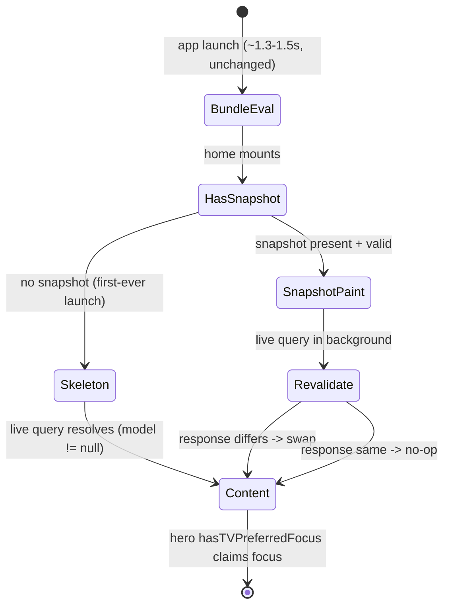

## Summary

Implement the client-side performance work for `apps/tv` defined in the origin brainstorm: lazy-load the heavy series language union off the initial fetch, make Home feel instant (loading skeleton plus a stale-while-revalidate snapshot for repeat launches), gate search input to cut cold query-embedding hits, scope the search bearer per-operation, fix the per-citation bible-verse N+1, and remove a dead query. Two latency targets additionally depend on admin-side handoffs recorded under Risks & Dependencies; the prod search token is embargoed until admin lands fleet-aware rate-limit bucketing.

## Problem Frame

A 2026-06-30 benchmark (see origin) found TV content delivery mostly healthy but flagged three real client-addressable costs: the series detail query is the heaviest payload, cold Home shows a blank spinner for ~3.6–4.4 s, and search fires a server-side cold query-embedding per novel prefix (1–7 s, a 30 s outlier seen). Research sharpened three of these:

- The watch→series shared-fragment over-fetch was **already trimmed** (`docs/solutions/performance-issues/tv-mobile-series-detail-overfetch-and-childdublanguages-index-20260619.md`): 1.25 MB → 854 KB. The residual ~835 KB and its latency are dominated by the `childDubLanguages` **server-side DISTINCT-ON aggregation** over ~137k rows with no composite index — so the remaining client lever is to move that field off the blocking initial fetch, and the full latency target needs a parallel admin index/count.
- TV attaches its search bearer **globally** on the Apollo `HttpLink` — the same latent bug mobile fixed (`docs/solutions/architecture-patterns/fleet-client-bearer-must-be-operation-scoped-not-global.md`); it simply has never shipped a token. Even Search-scoped, every TV device shares one `consumer:<key>` 60/min bucket, so the prod token is embargoed until admin lands fleet-aware bucketing.
- Mobile already solved the identical cold-launch with a stale-while-revalidate snapshot (`docs/solutions/design-patterns/asyncstorage-swr-snapshot-slow-admin-resolver.md`) that paints real content instantly on repeat launches — stronger prior art than a skeleton alone, which only ever shows a placeholder.

The cold-embedding latency itself is computed in admin and is not client-fixable; the client controls how often it is paid, how the wait is presented, and how much data each screen pulls.

---

## Key Technical Decisions

- **KTD1 — Trim the operation, never select-and-ignore.** Lazy-loading the language union is freeze-safe only if the initial series operation stops _selecting_ `childDubLanguages`. Apollo's `InMemoryCache` then returns referentially-stable `data` and the `normalizeSeries` `WeakMap` memo stays warm, so the ~2,259-dub re-normalize never re-runs. Keeping the field "just in case" evaporates that safety. The secondary query writes `childDubLanguages` to the **same** `Video:<id>` entity, but because the lean operation no longer selects it, field-granular result caching keeps the lean `data` ref stable — so languages must be read from the secondary query's own state, never back through the memoized `record` (see U1; origin KTD; `docs/solutions/design-patterns/lean-bulk-lazy-per-item-graphql-fetch-20260604.md`).
- **KTD2 — Home skeleton is non-focusable; reuse the existing hero initial-focus path.** The skeleton replaces only the spinner (loading) render branch. The content branch is unchanged, so the hero carousel's existing one-shot `hasTVPreferredFocus` claims focus when content mounts — exactly as today. `focusMemory` is for stack-pop re-entry, not this swap, and must not be wired into it. The only new requirement is that the skeleton makes no TV-focus claim of its own.
- **KTD3 — Skeleton and snapshot are complementary, sequenced.** The skeleton covers the first-ever cold launch (no snapshot yet) and the revalidate window; the snapshot gives instant _real_ content on every later launch. The snapshot unit is independently deferrable if only the skeleton is wanted.
- **KTD4 — Search bearer is operation-scoped, prod token embargoed.** Replace the global header with per-operation attachment (bearer on the Search op only; public ops send no `Authorization`), mirroring mobile's `authHeadersForOperation`. Mint a TV-dedicated `WEB_ADMIN_API_KEYS` entry (never reuse web/mobile's). The prod token stays unprovisioned until admin ships fleet-aware (`consumer:<key>:<ip>`) bucketing.
- **KTD5 — The ≥3-char gate applies to typed input only.** Explicit submit, category-card, and recent-chip taps fire immediately and must bypass the gate (they carry a known, intentional term).
- **KTD6 — Reuse existing cache/dedupe patterns, don't invent.** The bible-verse fix and the category-thumbnail burst both mirror the module-scope `thumbnailCache` Map and the `ensureDubMedia` dedupe-ledger + retry orchestrator already in the repo. RN's `fetch` ignores `cache`, so a JS-side Map is the dedupe lever.
- **KTD7 — Validate targets against deployed admin on a real TV device.** Local resolver timing is unrepresentative (loopback + tiny DB hid a ~12× cost). Benchmark SC1/SC2/SC7 against prod admin via the EAS `EXPO_PUBLIC_GRAPHQL_URL`, not a local server.

---

## High-Level Technical Design

Home cold-launch states after this work. The skeleton replaces the spinner on a true cold start; the snapshot short-circuits to instant real content on repeat launches.



Series initial render no longer waits on the language union:

```mermaid
sequenceDiagram
  participant S as Series screen
  participant L as Lean query (no childDubLanguages)
  participant A as Secondary languages query
  S->>L: fetch on mount (cache-first)
  L-->>S: hero + episode rail render; count shows placeholder
  S->>A: fetch language union (secondary)
  A-->>S: hero count + language panel populate
```

---

## Requirements

This plan implements origin requirements R1–R13 and success criteria SC1–SC7, with these partials and deferrals made explicit so a unit-by-unit sign-off cannot over-claim. **R1** sheds `childDubLanguages` only; the `variants: dubs` half of its trim, and **R2 clause 2** (parent dub on-demand), are deferred to follow-up. **SC1**'s "both lists removed" is therefore structurally partial (one list this plan; byte target pending the measurement), not merely pending a number. **SC4** (search returns 200) is gated on the admin fleet-aware-bucketing dependency (see Risks) and is not deliverable by client units alone. **SC5** (no focus/nav regression) is cross-cutting, owned jointly by U2 (skeleton→content focus) and U4/U5 (search nav) and verified in their tests. Traceability is per-unit below. The origin's three review-deferred questions are resolved as: search ship-first is **not** a standalone hotfix (embargoed — U7 / Risks); focus destination is the existing hero path (KTD2 / U2); search success-criteria framing measures embedding _frequency_, with cold-wait _latency_ deferred to admin (U4 / Success Criteria framing).

---

## Implementation Units

### U1. Lazy-load the series language union and re-key completeness

**Goal:** Remove `childDubLanguages` from the initial series fetch and load it in a secondary query that feeds a **separate** view input, so the hero and episode rail render without the heavy server aggregation; re-key the completeness/bounce signal to a field the lean query still carries; show an em-dash placeholder for the hero language count until the union arrives.

**Requirements:** R1 (partial — `childDubLanguages` only; the `variants: dubs` half is deferred to follow-up), R3, R2 clause 1 (lean query renders the hero without the union; clause 2, the parent dub on-demand, is deferred). Advances SC1 (partial — one list), SC7.

**Dependencies:** none.

**Files:**

- `apps/tv/src/lib/videoQueries.ts` — drop `childDubLanguages` from `GET_SERIES_BY_SLUG`; add a secondary `GET_SERIES_LANGUAGES` that selects the **same** `Video:<id>` entity (`videoBySlug(slug){ id childDubLanguages { ... } }`) so the lean read stays referentially stable per KTD1.
- `apps/tv/app/series/[slug].tsx` — fire the secondary query and derive a **separate** `languages` view-input from its result (a small `normalizeLanguages` over the secondary data, with a pending state). **Rewire the three current `record.languages` consumers onto it**: the action-row pill caption (`:182`), the hero meta count (`:214`), and the `SeriesLanguagePanel` `languages` prop (`:370`). Re-key `resolveLeafBounce` completeness off the lean-query `children` key instead of `childDubLanguages !== undefined` (feasibility confirmed `children` is a top-level selection no other query writes).
- `apps/tv/src/lib/normalizeVideo.ts` — `record.languages` from the lean query stays `[]` permanently (correct — nothing merges into the memoized `record`); the language view-input is normalized separately so the WeakMap memo never re-walks the dubs.
- `apps/tv/src/components/series/seriesScreenState.ts` — move the completeness predicate to the new `children`-key signal.
- `apps/tv/src/lib/videoQueries.test.ts` — over-fetch guard.

**Approach:** The secondary query is cache-first and non-blocking; the count and panel populate from its **own** state on arrival. Do **not** repopulate `record.languages` — `record` is memoized on the lean query's ref (KTD1), and re-deriving a combined object would miss the WeakMap and re-walk thousands of dubs (the exact freeze KTD1 prevents). The hero count renders an em-dash (`—`, no animation) while pending and the number on resolve; because `record.languages.length` is always a number, the placeholder must come from the separate pending state, not `record`. The completeness re-key must not let a warm-cache partial eject mid-load. On secondary-query error/timeout (the 15s Apollo abort vs the ~5.3s unindexed aggregation, a 30s outlier seen), the count stays at the em-dash and the panel shows an empty/retry affordance — never a permanent blank.

**Patterns to follow:** the lean-bulk + lazy-per-item split (`apps/tv/src/lib/videoQueries.ts` `GET_VIDEO_DUB`); the `print()`-based over-fetch jest guard asserting the bulk fragment omits a field (`apps/tv/src/lib/videoQueries.test.ts` `childDubLanguages` assertion).

**Test scenarios:**

- Lean series result (no `childDubLanguages`) renders hero + episode rail; the hero count shows the em-dash placeholder, not `0`.
- Secondary languages result populates the count, pill, and panel from the separate view-input; the dub list is not re-normalized (memo stays warm; `record.languages` stays `[]`).
- Completeness: a warm-cache partial (children present, languages absent) resolves to render/pending and does not bounce-eject.
- Secondary-query timeout/error: count stays at the em-dash, panel shows empty/retry, not a permanent blank.
- Over-fetch guard: `print(GET_SERIES_BY_SLUG)` does not contain `childDubLanguages`.
- Covers SC1 (payload), SC7 (render path).

**Verification:** Series detail renders hero + episodes from the lean fetch; the count fills a beat later (em-dash → number) with no `0` flash; benchmarked payload reported against deployed admin (KTD7).

### U2. Home loading skeleton

**Goal:** Replace the cold-launch spinner with a non-focusable skeleton of the hero + rails, shown only while `model == null && loading`.

**Requirements:** R4, R5, R6; SC2; SC5 (owns the skeleton→content focus/nav regression check).

**Dependencies:** none.

**Files:**

- `apps/tv/src/components/home/HomeSkeleton.tsx` — new, non-focusable placeholder matching the hero + rail layout.
- `apps/tv/app/index.tsx` — render `HomeSkeleton` in the `resolveHomeScreenState` `"loading"` branch in place of the `ActivityIndicator` (`app/index.tsx:339-351`).
- `apps/tv/src/lib/watchHome/homeScreenState.ts` — unchanged logic (loading only when `model == null`); confirm warm re-entry returns content immediately.

**Approach:** The skeleton lives in the existing loading branch, which is separate from the content branch. Because the content branch is unchanged, the hero's `hasTVPreferredFocus` claims focus on swap (KTD2). The skeleton must hold no focusable nodes and make no `requestTVFocus` call.

**Patterns to follow:** `WATCH_THEME` tokens and the existing centered loading block in `app/index.tsx`; layout mirrors `HomeHeroCarousel` + `HomeRail` dimensions.

**Test scenarios:**

- `model == null && loading` → skeleton renders; `ActivityIndicator` no longer used on Home.
- Warm re-entry (cache-first returns a model) → skeleton does not appear; content renders immediately.
- Skeleton holds no focusable element; on transition to content the hero receives focus (no competing claim).
- SC5: existing Home D-pad navigation is unchanged after the spinner→skeleton swap (no new focus regression).
- Covers SC2.

**Verification:** Cold Home shows the skeleton at first JS render (~1.5 s after launch) instead of a blank spinner; D-pad focus lands on the hero when content arrives; no skeleton flash on warm navigation.

### U3. Home stale-while-revalidate snapshot

**Goal:** Persist the last successful home model and paint it instantly on the next launch while the live query revalidates and swaps only on change — instant real content on repeat launches.

**Requirements:** extends R4/R5 (perceived performance); advances SC2 for repeat launches.

**Dependencies:** U2 (skeleton covers the first-ever launch with no snapshot).

**Files:**

- `apps/tv/src/lib/watchHome/homeSnapshot.ts` — new persist/load with a fragment-version gate, TTL, and size cap.
- `apps/tv/src/hooks/useWatchHome.ts` — paint snapshot on mount, revalidate, swap on change; race guards so a late disk read never paints over live data; never-paint-empty contract.

**Approach:** Mirror the mobile pattern and its hard-won guardrails exactly. The mobile pattern carries **no focus guarantee** (it is not a D-pad UI), so TV must add one: the revalidate swap must preserve D-pad focus when the focused card's key survives the new model, and fall back to the hero's `hasTVPreferredFocus` when it does not — a stale→live reshape under an already-focused rail must never drop focus to top-left (`focusMemory.restore` only fires on stack-pop re-entry, not an in-place model swap). This unit is independently deferrable (KTD3); if deferred, U2's skeleton still delivers the every-cold-launch perceived win.

**Execution note:** Mirror the guardrails in `docs/solutions/design-patterns/asyncstorage-swr-snapshot-slow-admin-resolver.md` — version gate tied to the home fragment, 7-day TTL, sub-2 MB Android item cap, never-paint-empty at both storage and screen layers, `networkLandedRef`/`cancelled` race guards.

**Patterns to follow:** the mobile AsyncStorage SWR snapshot (cited above); existing `useWatchHome` cache-first/network-only modes.

**Test scenarios:**

- First launch (no snapshot) → falls through to U2 skeleton; on success the model is persisted.
- Repeat launch → snapshot paints within ~1 s of JS boot; live query revalidates; identical response → no visible swap; changed response → content swaps.
- Never paints empty: an empty/invalid snapshot is ignored, not rendered.
- Version gate: a fragment-shape change invalidates the stored snapshot.
- Race guard: a late disk read after the live response has landed does not overwrite live data.
- Focus preservation: a revalidate swap while a rail card is focused keeps focus if the card survives the new model, and falls back to the hero if it does not — never dropping to top-left.
- Covers SC2 (repeat-launch perceived performance).

**Verification:** Second and later cold launches show real home content within ~1 s; never a blank or stale-forever state.

### U4. Search input gating: ≥3-char minimum + 900 ms debounce + retain browse view

**Goal:** Fire the semantic search only when the trimmed typed query is ≥3 characters, raise the auto-submit debounce to ~900 ms, and keep the browse view mounted under 3 characters — without blocking explicit submit/category/recent paths.

**Requirements:** R7, R8, R9; SC3; SC5 (owns the search-nav regression check).

**Dependencies:** none.

**Files:**

- `apps/tv/app/search.tsx` — change the browse-vs-results gate `hasQuery` from `> 0` to `>= 3` (keeps `SearchBrowse` mounted under 3 chars).
- `apps/tv/src/lib/search.ts` — `DEFAULT_DEBOUNCE_MS` 600 → 900; add the `< 3` minimum to the **typed/debounce path only** (the debounce-effect pre-call gate), in lockstep with the browse gate. Leave `runSearch`'s empty-only gate (`trimmed.length === 0`) unchanged.
- `apps/tv/src/lib/search.test.ts` — gate + debounce coverage.

**Approach:** The `< 3` minimum lives only on the typed path (the browse gate in `search.tsx` + the debounce-effect pre-call gate). `runSearch` is the **shared** firing site for the immediate paths (`submit`, `runQuery`, `retry`), so its gate must stay empty-only — adding `< 3` there would suppress category-card / recent-chip / submit taps whose known term is under 3 chars, contradicting KTD5.

**Patterns to follow:** mobile debounced-search mechanics (`docs/solutions/best-practices/mobile-search-ui-patterns-20260416.md`) — the `requestIdRef` stale-guard belongs in U5.

**Test scenarios:**

- Typing a 1–2 char prefix fires zero embeddings and keeps the browse view mounted.
- A 3-char trimmed query fires after ~900 ms.
- A category-card / recent-chip tap with a known term fires immediately even if shorter than 3 chars.
- `submit` bypasses the typed-input gate.
- SC5: existing search D-pad navigation is unchanged by the gate and debounce change.
- Covers SC3 (zero-fire on short prefixes; debounce constant).

**Verification:** No embedding fires for short prefixes; browse view stays put under 3 chars; live results still return on real queries.

### U5. Search cold in-flight state

**Goal:** Eliminate the blank-idle window — when a ≥3-char query is pending (debounce running or fetch in flight), show a (delayed) loading indicator in the results area instead of a blank pane, and guard against stale responses overwriting a newer query.

**Requirements:** R7 (live results stay responsive); addresses the origin cold-search observation.

**Dependencies:** U4.

**Files:**

- `apps/tv/app/search.tsx` — results-pane state so a pending query shows loading, not the null idle branch.
- `apps/tv/src/components/search/SearchResultsGrid.tsx` — the `idle`-with-pending-query case renders a loading state rather than returning `null`.
- `apps/tv/src/lib/search.ts` — expose a pending flag; add a `requestIdRef` stale-guard.

**Approach:** Today `hasQuery` flips to results-view immediately while `state` stays `idle` until the debounce timer fires, so the grid's idle branch renders `null` (a blank pane). Show a delayed (~500 ms) loading indicator — a centered `ActivityIndicator` in the `WATCH_THEME` accent, **not** a skeleton grid (result count is unknown during the debounce window, so a grid skeleton would jump when real cards arrive). The `requestIdRef` increment-and-compare prevents a superseded response from setting state. D-pad focus stays on the search keyboard during loading; do not move focus into the results area until result cards mount, so a Down press never lands in a focusless dead zone.

**Patterns to follow:** the delayed-skeleton timer + `requestIdRef` stale-guard and unconditional `finally` cleanup from `docs/solutions/best-practices/mobile-search-ui-patterns-20260416.md`.

**Test scenarios:**

- Query ≥3 chars typed → results area shows loading (not blank) through the debounce + fetch window.
- Fast warm result → no loading flash (delayed reveal).
- A stale (superseded) response does not overwrite the newer query's results.
- Loading timer is cleaned on result, on a new query, and on unmount.
- D-pad Down from the keyboard during the loading state does not escape into a focusless dead zone.

**Verification:** No blank pane between keystroke and results; no stuck loading; no flash on fast results.

### U6. Browse category-thumbnail first-session burst

**Goal:** Stop firing six cold per-category semantic searches on the first browse-screen entry. Warm re-entry is already free via the module-scope cache; this targets the cold burst.

**Requirements:** R10; SC3.

**Dependencies:** none.

**Files:**

- `apps/tv/src/components/search/useCategoryThumbnails.ts` and `apps/tv/src/lib/search/categories.ts` (or equivalent `CATEGORIES` source) — prefer static curated thumbnails per category (eliminates the search entirely); fall back to a single batched query if a curated image set is not acceptable.

**Approach:** `CATEGORIES` is a fixed 6-entry list, making static curated thumbnails the cheapest correct option — zero search calls. If product wants live representative thumbnails, replace six `limit:1` calls with one batched call.

**Patterns to follow:** the existing module-scope `thumbnailCache` Map (`useCategoryThumbnails.ts`).

**Test scenarios:**

- First browse entry fires 0 searches (static) or 1 (batched), not 6.
- Warm re-entry still fires 0 (existing cache).
- Each category renders a thumbnail.
- Covers SC3 (first-session burst).

**Verification:** Cold browse entry no longer issues six embeddings; thumbnails render.

### U7. Search bearer: operation-scoped header (prod token embargoed)

**Goal:** Attach the consumer bearer only to the Search operation; public operations send no `Authorization` header. Add the fleet-protection test. Do not provision the prod token — that is gated on an admin dependency.

**Requirements:** R11; SC4 (gated on admin — see Risks).

**Dependencies:** none in `apps/tv`; SC4 verification depends on the admin handoff.

**Files:**

- `apps/tv/src/lib/apolloClient.ts` — replace the global `HttpLink` `Authorization` header with per-operation attachment (mirror mobile's `authHeadersForOperation`).
- `apps/tv/src/lib/config.ts` — unchanged token source.
- `apps/tv/src/lib/apolloClient.test.ts` — fleet-protection contract.

**Approach:** Mirror mobile's operation-scoped link. The "public op + token → empty header" test is the fleet-protection contract and must be present. The scoped-link change is safe to merge ahead of the embargo: `getApiToken()` reads the unprovisioned `EXPO_PUBLIC_ADMIN_GRAPHQL_TOKEN`, so attaching the header is a runtime no-op until a token ships — the self-DoS requires an affirmative premature token provision. To make that embargo a real gate rather than a doc note, consider a paired enable flag (e.g. `EXPO_PUBLIC_SEARCH_BEARER_ENABLED`) so the token alone is inert (mirrors the repo's "move the precondition into the schema" rule). Provisioning rules and the prod-token embargo live in Risks & Dependencies.

**Patterns to follow:** `docs/solutions/architecture-patterns/fleet-client-bearer-must-be-operation-scoped-not-global.md` (mobile `authHeadersForOperation` + its unit test).

**Test scenarios:**

- Public op (home/series/watch) with a token set → no `Authorization` header.
- Search op with a token set → bearer present.
- Public op with no token → no header (unchanged).

**Verification (client):** the fleet-protection test passes. **SC4 (200 not 401) is verified only after the admin dependency lands** and a TV-dedicated token is provisioned.

### U8. Bible-verse N+1 → per-citation cache + dedupe ledger

**Goal:** Each unique citation fetches at most once across mounts; duplicate citations dedupe; the existing fan-out only fetches uncached citations.

**Requirements:** R12; SC6.

**Dependencies:** none.

**Files:**

- `apps/tv/src/hooks/useBibleVerses.ts` — add a module-scope per-citation cache and dedupe ledger; the existing `Promise.all` fan-out fetches only uncached citations.
- `apps/tv/src/lib/bibleVerseFetch.ts` — optional extraction of the dedupe-ledger orchestrator if it keeps the hook clean.

**Approach:** Reuse the established patterns (KTD6): a module-scope `Map` keyed by citation (book/chapter/verse) like `thumbnailCache`, plus the `ensureDubMedia`-style ledger (a `requested` set; a failed fetch deletes its key so a later mount retries; whole body wrapped so a sync throw still releases the slot). RN ignores `fetch` `cache`, so the JS Map is the dedupe lever. The existing AbortController/timeout fan-out stays.

**Patterns to follow:** `docs/solutions/design-patterns/lean-bulk-lazy-per-item-graphql-fetch-20260604.md` (the `ensureDubMedia` ledger); the `thumbnailCache` Map.

**Test scenarios:**

- N citations with duplicates → one request per unique citation.
- Repeat mount of the same verse set → zero new requests (served from cache).
- A failed citation is left uncached and retries on the next mount.
- A sync throw mid-dispatch still releases the ledger slot.
- Covers SC6.

**Verification:** Watch detail with multiple citations issues at most one request per unique citation; repeat visits hit the cache.

### U9. Remove the dead `GetWatchSetting` query

**Goal:** Delete the unused `GET_WATCH_SETTING` query and its tests.

**Requirements:** R13.

**Dependencies:** none.

**Files:**

- `apps/tv/src/lib/queries.ts` — remove `GET_WATCH_SETTING`.
- `apps/tv/src/lib/queries.test.ts` — remove its test references.

**Approach:** Pure dead-code removal; Home resolves via `GET_WATCH_HOME_VIDEOS`, not `watchSetting`.

**Test expectation:** none — dead-code removal; existing suite and typecheck stay green.

**Verification:** No non-test references remain; typecheck and tests pass.

---

## Scope Boundaries

**In scope:** the nine units above — series language lazy-load, Home skeleton + snapshot, search gating + in-flight state + category-thumbnail burst + bearer scoping, bible-verse N+1, dead-query removal.

### Deferred to Follow-Up Work

- Trimming the series `variants: dubs` per-language list — gated on measuring whether the series screen consumes it and whether it materially adds bytes after the `childDubLanguages` lazy-load lands.
- Provisioning the prod search token — gated on the admin fleet-aware bucketing dependency below.

**Out of scope (owned elsewhere):** Home D-pad navigation jank, rail virtualization, and FlashList migration — owned by `docs/plans/2026-06-23-001-perf-tv-android-home-navigation-plan.md`. The server-side search cold-embedding optimization and the `childDubLanguages` index/count — admin-owned (Risks). Voice search.

---

## Risks & Dependencies

**External (admin) dependencies:**

- **Search fleet-aware rate-limit bucketing** (`consumer:<key>:<ip>`) — blocks shipping the prod search token (U7 / SC4). Until it lands, even a Search-scoped fleet shares one 60/min bucket → self-DoS. Mint a TV-dedicated `WEB_ADMIN_API_KEYS` entry, receiver-first. **Rotation overlap for TV is weeks, not the sub-hour of a server-side env swap:** binaries update via TestFlight / APK sideload at user discretion, so the old key must stay valid in admin's CSV until install metrics confirm the new binary has reached the fleet (budget ~4–8 weeks) — revoking early breaks search for every un-updated device.
- **`childDubLanguages` composite index / count field** — the series latency target (SC1/SC7) depends on this in parallel with U1's client lazy-load; the client move alone removes the aggregation from the _initial_ fetch but the secondary fetch still hits the unindexed aggregation.

**Risks:**

- **Completeness re-key (U1).** Mis-keying `resolveLeafBounce` could eject a warm-cache partial mid-load (blank/bounce). Mitigation: key off a field the lean query always carries; cover the partial-cache case in tests.
- **Snapshot correctness (U3).** Stale/empty paints or races. Mitigation: mirror the mobile guardrails exactly (version gate, never-paint-empty, race guards).
- **Focus regression (U2).** A focusable skeleton would steal the hero's initial focus. Mitigation: skeleton makes no focus claim; test that the hero receives focus on swap.
- **Local-vs-deployed timing (KTD7).** Validating against a local admin would understate latency ~12×; benchmark against deployed admin on a real TV device.

---

## Open Questions

- **Search UX is embargo-coupled.** U4/U5 (and U6's batched fallback) only deliver user-facing value once a working token exists — search 401s without one, and the prod token is embargoed (U7). Decide whether they ship ahead of the embargo, which is justified only if TV dev/preview real-device builds carry a working search token to validate the UX (EAS builds hit prod admin — confirm whether they do).
- **Which per-language list dominates the 835 KB** — measure `childDubLanguages` vs `variants: dubs` and whether the series screen consumes `variants: dubs` at all, before setting SC1's adjusted byte target and deciding the deferred second-list trim.
- **U3 section identity across snapshot→live** — confirm whether the revalidate swap updates the hero/rail props in place or can reorder/remount rails, to bound the focus-drop blast radius the U3 guardrail must cover.
- **U6 thumbnail assets / U2 skeleton motion** — the static-thumbnail path needs six category images sourced (else the batched-query fallback); confirm whether the skeleton blocks animate (shimmer) or stay static.

---

## Sources & Research

- Origin: `docs/brainstorms/2026-06-30-tv-client-performance-sweep-requirements.md` (requirements, benchmark table, the three review-deferred questions).
- `docs/solutions/performance-issues/tv-mobile-series-detail-overfetch-and-childdublanguages-index-20260619.md` — series over-fetch already trimmed; residual is the server aggregation; over-fetch guard-test precedent.
- `docs/solutions/design-patterns/lean-bulk-lazy-per-item-graphql-fetch-20260604.md` — Apollo memo-stability proof (KTD1) and the `ensureDubMedia` dedupe-ledger reused in U8.
- `docs/solutions/design-patterns/asyncstorage-swr-snapshot-slow-admin-resolver.md` — the snapshot pattern + guardrails for U3.
- `docs/solutions/best-practices/mobile-search-ui-patterns-20260416.md` — debounce/`requestIdRef`/delayed-skeleton mechanics for U4/U5.
- `docs/solutions/architecture-patterns/fleet-client-bearer-must-be-operation-scoped-not-global.md` — operation-scoped bearer + prod embargo for U7.
- `docs/solutions/design-patterns/tv-back-nav-focus-restoration-screen-focus-memory.md` — focus-restore context (confirms `hasTVPreferredFocus` suffices for the cold skeleton→content swap; screen-level memory is for stack-pop, not this case).
