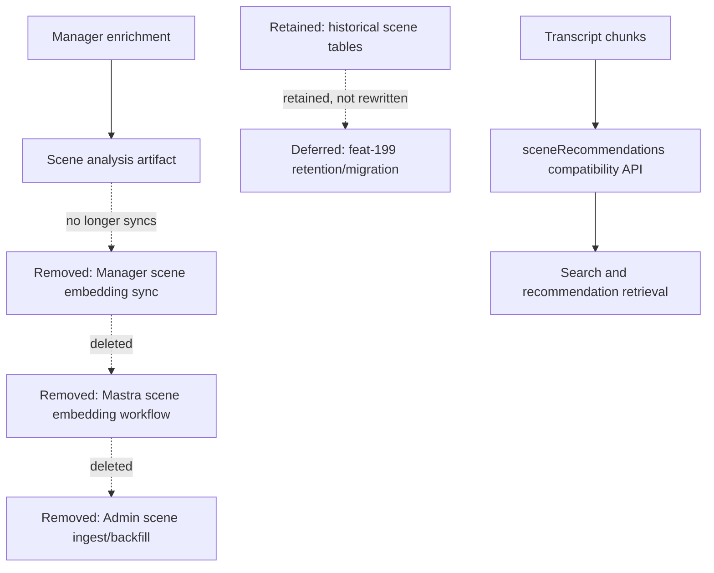

# refactor: Remove legacy scene embedding pipeline

## Summary

Remove the legacy scene embedding writer pipeline now that search and recommendation relevance are transcript-backed. The change deletes Admin, Mastra, and Manager surfaces that only generate or sync scene embeddings while retaining historical scene tables and scene-analysis artifacts for non-search product uses.

---

## Problem Frame

`feat-193` is the deletion follow-up to enriched transcript search. Earlier work intentionally moved background content embedding generation into Mastra and kept scene embedding producers available while search quality was still being realigned. The active search path no longer consumes scene embeddings, so the remaining scene embedding backfill, ingest, sync, and operator surfaces are dead writer paths that can confuse operators and preserve obsolete fallback assumptions.

The cleanup must not delete `video_scene` or `video_scene_locale` data. Data retention and migration remain deferred to `feat-199`; this plan only removes code paths that create or refresh scene embedding vectors.

---

## Requirements

**Pipeline removal**

- R1. Remove Admin scene embedding GraphQL, workflow, ingest, service, client, permission, env, and CLI entry points that populate `video_scene` or `video_scene_locale` embeddings.
- R2. Remove Mastra scene embedding workflow registration, HTTP route, Admin scene ingest client, scene provider config, env keys, and tests.
- R3. Remove Manager scene embedding sync services, REST proxy, job artifact report UI, review-player status, automation template, and Admin GraphQL proxy logic.

**Boundaries**

- R4. Preserve historical scene tables, rows, backup behavior, and cleanup scripts unless they are scene embedding writers.
- R5. Preserve Manager scene analysis generation when it has a non-search owner, but stop syncing its output into Admin scene embeddings.
- R6. Preserve public compatibility names such as `sceneRecommendations` and `/api/scene-embedding/recommendations` while ensuring their retrieval uses transcript chunks rather than scene tables.

**Proof**

- R7. Regenerate Admin GraphQL SDL and typed GraphQL environment so `triggerSceneEmbeddingBackfill` is no longer exposed.
- R8. Focused tests must prove the removed mutation is absent, transcript-backed recommendations still avoid scene tables, run-embeds rejects retired scene flags, and Manager scene analysis remains optional and isolated.
- R9. Final grep/audit must leave no retired scene embedding writer identifiers except intentional absence assertions.

---

## Key Technical Decisions

- **Delete writer paths, not data:** The ticket removes code that creates or refreshes scene embeddings, but leaves table definitions, backups, and historical rows intact because retention belongs to `feat-199`.
- **Keep compatibility API names:** `sceneRecommendations` remains public API vocabulary for current clients, but the backing retriever stays transcript-chunk based. A rename would be a separate client-coordinated API migration.
- **Keep Manager scene analysis without Admin sync:** Scene analysis still produces product artifacts for enrichment and review. The removed step is the follow-up sync into Admin scene embedding storage.
- **Narrow `run-embeds` to active pipelines:** The Admin CLI keeps transcript and experience backfill modes, treats `both` as a legacy transcript-only alias, and rejects retired scene retry flags with explicit errors.
- **Use generated schema artifacts as proof:** Removing the Admin mutation import is not enough; the SDL and gql.tada environment must be regenerated so downstream type consumers cannot call the retired mutation.

---

## High-Level Technical Design

The diagram distinguishes scene analysis from scene embedding. Scene analysis remains a Manager artifact path; scene embedding sync, generation, ingest, and backfill are removed.

---

## Scope Boundaries

### In Scope

- Remove dead scene embedding writer, trigger, ingest, env, generated schema, and test surfaces across Admin, Mastra, and Manager.
- Update operator-facing wording that still implies Admin or Mastra can run scene embedding backfills.
- Keep focused regression coverage around the new absence of scene embedding writer APIs.

### Deferred to Follow-Up Work

- Delete or migrate historical `video_scene` and `video_scene_locale` rows under `feat-199`.
- Rename public `sceneRecommendations` or `/api/scene-embedding/recommendations` compatibility APIs after frontend/mobile clients are ready.
- Decide whether older cleanup utilities for legacy OpenAI scene vectors should move under the future retention/migration ticket.

### Out of Scope

- Public search ranking changes unrelated to removing scene embedding writers.
- Changes to Manager scene-analysis artifact generation itself.
- Database migrations that drop scene tables, columns, indexes, or rows.

---

## Implementation Units

### U1. Remove Admin scene embedding writer surfaces

- **Goal:** Delete Admin code that launches, generates, ingests, or authorizes scene embedding backfills.
- **Requirements:** R1, R4, R7, R9
- **Dependencies:** None
- **Files:** `apps/admin/src/graphql/schema.ts`, `apps/admin/src/graphql/schema.test.ts`, `apps/admin/src/graphql/schema.security.test.ts`, `apps/admin/src/graphql/mutations/scene-embedding.ts`, `apps/admin/src/graphql/mutations/scene-embedding.test.ts`, `apps/admin/src/workflows/sceneEmbeddingBackfill.ts`, `apps/admin/src/workflows/sceneEmbeddingBackfill.test.ts`, `apps/admin/src/services/scene-embedding.service.ts`, `apps/admin/src/services/scene-embedding.service.test.ts`, `apps/admin/src/services/scene-embedding-ingest.service.ts`, `apps/admin/src/services/scene-embedding-ingest.service.test.ts`, `apps/admin/src/services/mastra-scene-embedding-client.ts`, `apps/admin/src/services/mastra-scene-embedding-client.test.ts`, `apps/admin/src/app/api/internal/mastra/scene-embeddings/route.ts`, `apps/admin/src/app/api/internal/mastra/scene-embeddings/route.test.ts`, `apps/admin/src/auth/mastra-ingest-bearer.ts`, `apps/admin/src/auth/mastra-ingest-bearer.test.ts`, `apps/admin/src/auth/permissions.ts`, `apps/admin/src/auth/permissions.test.ts`, `apps/admin/src/config/env.ts`, `apps/admin/src/config/env.test.ts`, `apps/admin/.env.example`
- **Approach:** Remove the mutation import from schema assembly, delete the scene workflow/service/ingest modules, remove `write:scene-embeddings`, and trim scene ingest env keys and bearer validation. Keep transcript and experience embedding paths unchanged.
- **Patterns to follow:** `apps/admin/src/graphql/mutations/transcript-embedding.ts`, `apps/admin/src/workflows/transcriptEmbeddingBackfill.ts`, `apps/admin/src/services/transcript-embedding.service.ts`
- **Test scenarios:** Assert the Pothos mutation root does not expose `triggerSceneEmbeddingBackfill`; assert permission tests no longer include `write:scene-embeddings`; assert env defaults no longer include scene embedding concurrency or Mastra scene timeout.
- **Verification:** Admin schema and permission tests pass, and retired scene embedding identifiers disappear from Admin source except intentional absence assertions.

### U2. Reduce Admin CLIs and manager artifact readers to active pipelines

- **Goal:** Remove scene retry/backfill logic from local embedding CLIs and scene-analysis artifact readers used only by the removed backfill.
- **Requirements:** R1, R4, R8, R9
- **Dependencies:** U1
- **Files:** `apps/admin/src/scripts/run-embeds.ts`, `apps/admin/src/scripts/run-embeds.test.ts`, `apps/admin/src/services/manager-artifacts.service.ts`, `apps/admin/src/services/manager-artifacts.service.test.ts`, `apps/admin/src/services/manager-artifacts-preflight.service.ts`, `apps/admin/src/services/manager-artifacts-preflight.service.test.ts`, `apps/admin/src/workflows/_steps/load-manager-artifact.ts`, `apps/admin/src/storage/s3.ts`, `apps/admin/src/scripts/refresh-core-id-mapping.ts`, `apps/admin/src/scripts/trigger-enrichment.ts`, `apps/admin/src/scripts/trigger-enrichment.test.ts`
- **Approach:** Keep `run-embeds` focused on transcript and experience pipelines, emit clear retired errors for scene-only flags, delete scene-artifact preflight, and leave transcript artifact reading in place.
- **Patterns to follow:** Existing transcript backfill group loading in `apps/admin/src/workflows/_steps/process-transcript-embedding-group.ts`; current S3 artifact reader error-classification tests.
- **Test scenarios:** `run-embeds` accepts `transcript`, `experience`, `both`, and `all`; rejects `scene`, `--from-report`, and `--scene-mode`; transcript artifact reader still classifies missing, invalid, and transport errors without logging transcript text.
- **Verification:** CLI unit tests and manager-artifact reader tests pass without importing deleted scene modules.

### U3. Remove Mastra scene embedding workflow and provider config

- **Goal:** Delete the Mastra route and workflow that generated scene embeddings for Admin.
- **Requirements:** R2, R9
- **Dependencies:** U1
- **Files:** `apps/mastra/src/mastra/index.ts`, `apps/mastra/src/mastra/workflows/scene-embedding.ts`, `apps/mastra/src/mastra/workflows/scene-embedding.test.ts`, `apps/mastra/src/services/admin-scene-ingest-client.ts`, `apps/mastra/src/services/admin-scene-ingest-client.test.ts`, `apps/mastra/src/services/embedding-provider.ts`, `apps/mastra/src/config/env.ts`, `apps/mastra/src/config/env.test.ts`, `apps/mastra/.env.example`
- **Approach:** Remove `/forge-scene-embeddings`, workflow registration, scene ingest client, scene embedding defaults, scene provider accessor, and scene-specific env requirements. Preserve transcript and experience provider config.
- **Patterns to follow:** Transcript and experience workflow registration in `apps/mastra/src/mastra/index.ts`; shared AI Gateway provider tests in `apps/mastra/src/config/env.test.ts`.
- **Test scenarios:** Mastra production env validation no longer requires scene ingest URL/key; content embedding provider helpers cover transcript and experience only; index registration no longer lists the scene workflow route.
- **Verification:** Mastra config tests pass and exact scene embedding env/provider identifiers are absent.

### U4. Remove Manager scene embedding sync and UI/reporting surfaces

- **Goal:** Stop Manager from syncing scene analysis into Admin scene embeddings and remove the related operator/report UI.
- **Requirements:** R3, R5, R8, R9
- **Dependencies:** U1, U3
- **Files:** `apps/manager/src/workflows/videoEnrichment.ts`, `apps/manager/src/workflows/videoEnrichment.test.ts`, `apps/manager/src/services/sceneEmbeddingSync.ts`, `apps/manager/src/services/sceneEmbeddingSync.test.ts`, `apps/manager/src/lib/scene-embedding-sync-report.ts`, `apps/manager/src/features/jobs/scene-embedding-sync-card.tsx`, `apps/manager/src/features/jobs/live-job-steps-table.tsx`, `apps/manager/src/features/jobs/review-player/review-player-presenter.ts`, `apps/manager/src/features/jobs/review-player/review-player-types.ts`, `apps/manager/src/features/jobs/review-player/review-player-card.tsx`, `apps/manager/src/types/job.ts`, `apps/manager/src/app/api/jobs/[id]/transcription/rerun/route.ts`, `apps/manager/src/lib/smart-crop-report.ts`
- **Approach:** Keep optional scene analysis running in enrichment, but remove the subsequent sync call, sync report artifact, UI auto-expand logic, review status, and rerun pruning for the removed artifact key.
- **Patterns to follow:** Existing optional scene-analysis failure isolation in `apps/manager/src/workflows/videoEnrichment.ts`; existing Mastra transcript embedding correlation display in live job steps.
- **Test scenarios:** Scene analysis runs when requested; scene analysis does not run when it is not requested; scene analysis failure logs and does not fail the enrichment job; no scene embedding sync service is imported; review player compare status only reports still-produced comparisons.
- **Verification:** Manager workflow and UI type checks pass, and no `sceneEmbeddingSync` identifiers remain.

### U5. Remove Manager-to-Admin scene backfill proxy and automation affordances

- **Goal:** Delete Manager trigger/proxy surfaces that only call the removed Admin scene embedding mutation.
- **Requirements:** R3, R9
- **Dependencies:** U1
- **Files:** `apps/manager/src/app/api/admin-embeds/scene/route.ts`, `apps/manager/src/lib/admin-embed-trigger.ts`, `apps/manager/src/lib/admin-embed-trigger.test.ts`, `apps/manager/src/features/agents/automation-contract.ts`, `apps/manager/src/features/agents/automation-store.ts`, `apps/manager/src/features/agents/automation-validation.test.ts`, `apps/manager/src/app/api/automations/runs/[id]/enqueue/route.ts`, `apps/manager/src/app/api/backfill/start/route.ts`, `apps/manager/src/app/api/backfill/status/route.ts`, `apps/manager/src/app/api/backfill/cancel/route.ts`
- **Approach:** Narrow the admin embed proxy helper to transcript backfills, remove the scene admin-embeds route, drop dormant scene embedding automation templates, and update retired backfill endpoints so they do not point operators to a replacement scene backfill.
- **Patterns to follow:** Transcript-only proxy behavior in `apps/manager/src/app/api/admin-embeds/transcript/route.ts`; existing automation contract validation pattern.
- **Test scenarios:** Transcript proxy forwards args and unwraps Admin responses; network, parse, GraphQL, and config errors stay covered; automation validation rejects unsupported scene embedding templates while supported transcript embedding templates remain valid; retired backfill endpoints return gone with no scene backfill replacement.
- **Verification:** Manager admin-embed trigger and automation validation tests pass.

### U6. Preserve transcript-backed recommendation compatibility and non-search scene reads

- **Goal:** Keep compatibility APIs and justified scene data reads while removing search/recommendation dependence on scene embeddings.
- **Requirements:** R4, R5, R6, R8, R9
- **Dependencies:** U1, U2
- **Files:** `apps/admin/src/services/scene-recommendations-retriever.ts`, `apps/admin/src/services/scene-recommendations-retriever.test.ts`, `apps/admin/src/services/scene-recommendations.service.ts`, `apps/admin/src/services/scene-recommendations.service.test.ts`, `apps/admin/src/app/api/scene-embedding/recommendations/route.ts`, `apps/admin/src/graphql/queries/scene-recommendations.ts`, `apps/admin/src/services/experience-ai/experience-ai.service.ts`, `apps/admin/src/services/experience-ai/experience-ai.service.test.ts`, `apps/admin/src/services/experience-ai/video-context-pack.service.ts`, `apps/admin/src/app/dashboard/live-data.ts`
- **Approach:** Leave `sceneRecommendations` and `/api/scene-embedding/recommendations` as compatibility names backed by `video_transcript_chunk`. Preserve the existing public access model: REST rate limiting, GraphQL's explicit public scope, published/non-deleted visibility filters, limit clamping, and the existing recommendation DTO shape. Leave non-search scene reads in experience AI context packs and dashboard counts because they are not scene embedding retrieval or writer paths.
- **Patterns to follow:** Negative SQL assertions in `apps/admin/src/services/scene-recommendations-retriever.test.ts`; compatibility wording in `apps/admin/src/services/scene-recommendations.service.ts`.
- **Test scenarios:** Recommendation and Experience AI semantic-candidate SQL do not read `video_scene` or `video_scene_locale`; route and GraphQL resolver still validate arguments, preserve public access controls, and return transcript-backed recommendations; non-search scene reads are documented rather than deleted.
- **Verification:** Recommendation service tests pass and grep audit classifies remaining scene table references as compatibility, retention, backup, cleanup, or non-search product reads.

### U7. Regenerate schemas, docs, and roadmap state

- **Goal:** Make generated artifacts and ticket metadata match the removed pipeline.
- **Requirements:** R7, R8, R9
- **Dependencies:** U1, U2, U3, U4, U5, U6
- **Files:** `apps/admin/schema.graphql`, `packages/admin-graphql/src/admin-graphql-env.d.ts`, `apps/admin/CLAUDE.md`, `apps/manager/CLAUDE.md`, `apps/manager/AGENTS.md`, `apps/mastra/CLAUDE.md`, `apps/mastra/AGENTS.md`, `docs/roadmap/content-discovery/feat-193-remove-legacy-scene-embedding-pipeline.md`
- **Approach:** Regenerate Admin SDL and gql.tada environment, mark `feat-193` completed, remove dependency wording that implies `feat-198` blocks this cleanup, and audit active operator/agent guidance so it no longer points to retired scene embedding backfill instructions. Historical brainstorms, plans, and solutions may keep old pipeline references as archival context.
- **Patterns to follow:** Existing `schema:print` and `admin-graphql generate` artifacts.
- **Test scenarios:** Schema tests assert `triggerSceneEmbeddingBackfill` is absent; generated GraphQL environment no longer exposes the mutation; roadmap frontmatter lists only `feat-192` as a dependency.
- **Verification:** Generated artifacts are current, focused test suites pass, and final exact grep leaves only intentional absence assertions.

---

## System-Wide Impact

This plan reduces content embedding ownership to active transcript and experience paths. Admin remains the vector storage and search authority; Mastra remains the background embedding workflow owner for live embedding types; Manager remains the media artifact and scene-analysis owner. Removing the scene embedding path also removes stale operator affordances that implied scene embeddings could still be repaired or refreshed for search.

---

## Risks & Dependencies

- **Compatibility naming risk:** Clients may still rely on `sceneRecommendations` and the legacy route path. Mitigation: keep the API names and back them with transcript chunks.
- **Over-deletion risk:** Generic scene-analysis and historical scene-table reads can look similar to scene embedding code. Mitigation: delete only writer/sync/backfill paths and classify remaining scene references by owner.
- **Generated artifact drift:** Removing source imports without regenerating SDL would leave stale downstream type surfaces. Mitigation: regenerate Admin SDL and gql.tada output as a required unit.
- **Typecheck noise:** Full Admin typecheck may fail on unrelated repository issues. Mitigation: run focused tests plus type checks for touched Manager, Mastra, and generated GraphQL packages, and report unrelated Admin blockers separately.

---

## Documentation / Operational Notes

Operators should no longer be pointed to scene embedding backfills. If historical scene data needs deletion, migration, or archival, that work belongs to `feat-199` and should include an explicit data-retention plan.

After deploy, remove or revoke retired scene ingest secrets from Admin and Mastra deployment environments once confirmed they are not shared with transcript or experience ingest credentials.

---

## Sources / Research

- `docs/roadmap/content-discovery/feat-193-remove-legacy-scene-embedding-pipeline.md`
- `docs/brainstorms/2026-05-25-mastra-embedding-search-migration-requirements.md`
- `docs/brainstorms/2026-04-10-scene-embeddings-from-enrichment-pipeline-requirements.md`
- `docs/brainstorms/2026-06-21-watch-search-readiness-eval-suite-requirements.md`
- `docs/plans/2026-04-29-006-feat-local-embed-pipeline-and-manager-trigger-plan.md`
- `CONCEPTS.md`
- `apps/admin/src/services/scene-recommendations-retriever.test.ts`
- `apps/manager/src/workflows/videoEnrichment.ts`
- `apps/mastra/src/mastra/index.ts`
