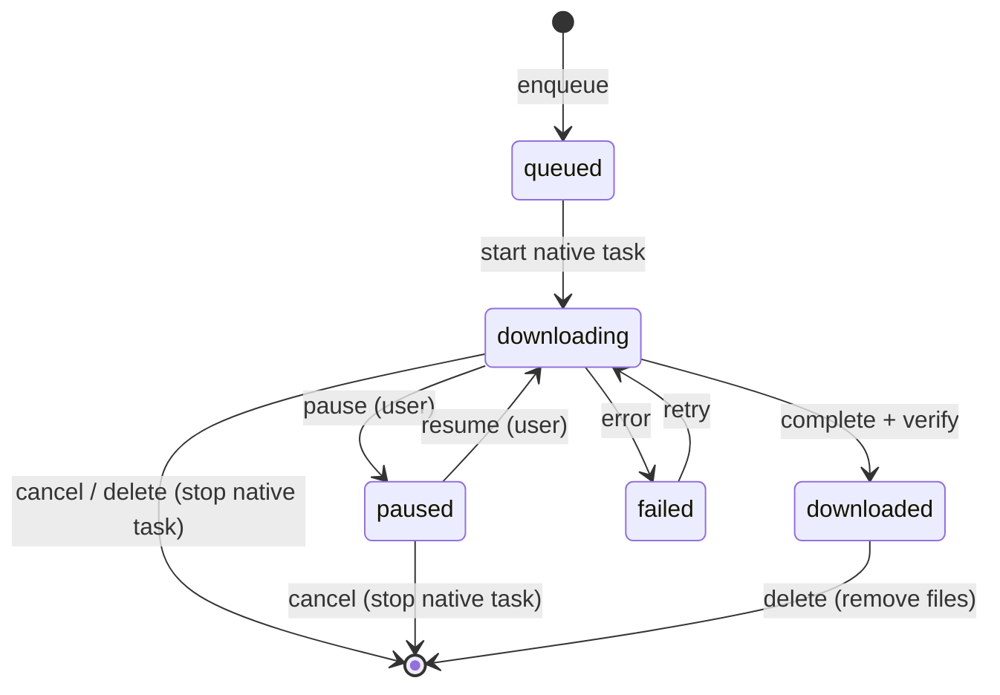
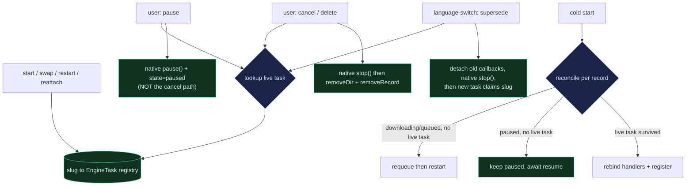

# Mobile Download All Completion - Plan

## Goal Capsule

- **Objective:** Finish the mobile Download All feature to a shippable v1.1 — fix its two correctness defects, add pause/resume/cancel controls, show per-episode download state on the series grid, and add the missing route/provider tests.
- **Product authority:** Urim (owns `apps/mobile`). Admin-side changes are handed off, not made here.
- **Sizing (was the external blocker):** Admin types `VideoDubDownload.size` as nullable, so some prod download rows may return `null`. Rather than hard-block on that, the Confirm gate is relaxed (R12): the sheet sums only successfully-resolved sizes, marks unknown-size episodes as such, and still lets the batch proceed (the engine falls back to OS-reported bytes at download time). The `download.size` back-fill becomes a nice-to-have for total accuracy, not a ship prerequisite; no admin change is made here.
- **Sequencing:** R1–R3 (correctness) are self-contained and independent of the pause/resume/badge UX and its tests; ship them as a fast-follow increment ahead of the R4–R12 increment so the data/battery/corruption fix reaches users without waiting on the larger feature.

---

## Product Contract

### Summary

Close out Download All: stop the native transfer when a download is deleted, cancelled, or language-switched (today it keeps running); keep a chosen subtitle across an app relaunch (today it silently drops); add pause/resume/cancel controls per-item in Library and a "Pause all / Cancel all" bar on the series page; show each episode's saved/downloading/queued state as a corner badge on the series grid; and add the missing render tests plus a guard for the enqueue ordering invariant.

### Problem Frame

The v1 series Download All shipped the whole enqueue-and-persist pipeline, but deliberately deferred in-flight management UX and left two defects that a field viewer hits in normal use.

The defects are reachable today. `deleteDownload` removes the on-disk directory and the manifest record but never stops the native task, and every `startMediaDownload` call site discards the returned task handle — so deleting or cancelling a downloading item (from the existing Library trash button) leaves the transfer running to completion, wasting cellular data and battery and letting a completion handler write into a deleted directory. The batch language-switch has the same shape: it deletes then restarts the same id while the old-language native task may still be live. Separately, the reattach and restart-interrupted paths rebuild download handlers with `subtitleUrl: null` because the subtitle's volatile URL is never persisted, so an episode that finishes after an app relaunch commits media-only and the user's chosen subtitle disappears with no error.

The deferred UX is the rest of the gap. Downloads can be deleted from Library but not paused, resumed, or cancelled in flight; a running series batch has no single stop; and the series episode grid gives no per-episode signal of what is saved or downloading. The underlying transfer library already supports `pause()`, `resume()`, and `stop()` — the engine adapter simply wraps none of them yet.

### Key Decisions

- KD1. Corner badge over ring-overlay or status-line for per-episode state. A coarse glyph keeps the dense episode grid lean and matches the app's existing checkmark idiom; live percentage stays in Library where a row can afford it.
- KD2. Controls at two levels, reusing existing surfaces — not a new screen. Per-item pause/resume/cancel extend the existing Library rows (which already delete); the series batch control is a new affordance on the existing series action row.
- KD3. Wrap the native task's pause/resume/stop in the engine adapter and expose pause/resume/cancel through the provider. Delete, cancel, and the language-switch route through the same native stop. Because stopping a task fires an async `canceled` callback that routes to `deleteDownload(slug)`, superseding an in-flight task (R2) must neutralize or fully await the old task's terminal callbacks before the replacement claims the same slug — "fixed once at the adapter" is insufficient for the id-reuse path.
- KD4. Per-episode and batch state stay derived from the read-side intersection of episode slugs with download records — no new persisted field. This continues the v1 plan's KTD5; a global cross-series downloads hub, which would need a persisted series identity, stays out of scope.
- KD5. The download sheet stays enqueue-and-dismiss. The series batch bar is the only in-flight progress surface; no live progress is added inside the sheet.

### Requirements

**Correctness fixes**

- R1. Deleting or cancelling an in-flight download stops the underlying native transfer, not just the on-disk directory and manifest record, so no bytes continue after removal and no completion handler writes into a deleted directory.
- R2. The batch language-switch stops the superseded in-flight native task before starting the replacement, and neutralizes the old task's terminal (`canceled`/`done`) callbacks so its async cleanup cannot delete the freshly-started replacement on the shared slug.
- R3. A chosen subtitle track survives an app relaunch: an episode that finishes downloading after the app restarts commits with its subtitle, not media-only.

**In-flight controls**

- R4. Each Library download row exposes state-appropriate controls: pause and cancel while downloading, resume and cancel while paused, delete when saved.
- R5. Pausing halts the transfer and persists a paused state; resuming continues it. The paused state survives backgrounding; across a relaunch it resumes in place when the native task survived, and otherwise stays paused (resume restarts it cleanly on user action) rather than silently auto-restarting.
- R6. While a series batch is downloading, the series page shows a "Pause all / Cancel all" affordance that pauses or cancels every in-flight episode of that series in one action; when the series has paused episodes and none downloading, it shows "Resume all / Cancel all" and resumes them all in one action.

**Per-episode state on the series grid**

- R7. Each series episode card shows a corner badge for that episode's download state: saved, downloading, queued, paused, or none. No live percentage on the card.
- R8. The badge derives from the existing download records, updates as downloads complete, pause, or are deleted, and adds no new persisted per-episode field. The badge state is also exposed to screen readers via the card's `accessibilityLabel` (e.g., "{title}, downloading" / "{title}, saved offline"), reusing the badge-state labels.

**Test & invariant hardening**

- R9. The pause/resume/cancel decision logic and the series download route's behavior have test coverage, following the repo's pure-extraction precedent (extract decision logic into dependency-free helpers and unit-test them, as `apps/tv`'s `WatchSessionProvider` and this app's `seriesDownloadEnqueue.ts` / `download.test.tsx` already do). Add a React Native render harness only for residual behavior pure extraction genuinely can't reach, recording that decision against the two prior mobile plans that declined the dependency.
- R10. A test guards the load-bearing enqueue ordering invariant (snapshot pre-batch records before writing the queued placeholders) so reversing the two steps fails CI.

**Cancellation & sizing**

- R11. Cancel (per-item, R4) and Cancel all (batch, R6) show a destructive confirmation before stopping the transfer and deleting partial data, matching the existing Library delete confirm; pause, resume, and their batch forms need no confirmation.
- R12. The Confirm gate tolerates a missing rendition size: the sheet sums only successfully-resolved sizes, marks unknown-size episodes as such, and does not block Confirm on a missing size (the engine falls back to OS-reported bytes at download time). The storage pre-check treats the summed total as a lower bound and warns rather than hard-blocks when unknown-size episodes are present.

### Visualizations

Download-record lifecycle with the new controls. Every exit from `downloading` and `paused` other than natural completion now stops the native task (R1, R2), and pause/resume are user-driven (R4, R5).

Series-grid corner badge, mapped from the derived record state (R7, R8):

| Record state  | Grid badge                            |
| ------------- | ------------------------------------- |
| downloaded    | Saved (check)                         |
| downloading   | In-progress glyph                     |
| queued        | Queued glyph                          |
| paused        | Paused glyph                          |
| none / failed | No badge (failed surfaces in Library) |

### Acceptance Examples

- AE1. Cancel stops the transfer. **Covers R1, R11.** **Given** an episode downloading, **When** the user cancels it in Library and confirms the destructive prompt, **Then** the native transfer stops, the partial file and record are removed, and no later completion handler writes into the deleted directory.
- AE2. Language-switch stops the old transfer. **Covers R2.** **Given** an episode still downloading in English, **When** the user picks Spanish and Download all, **Then** the English native task is stopped before the Spanish one starts, with no orphaned English transfer and no id collision.
- AE3. Subtitle survives relaunch. **Covers R3.** **Given** a batch with a chosen subtitle, **When** the app is relaunched mid-download and an episode then finishes, **Then** it commits with the subtitle track, not media-only.
- AE4. Pause and resume round-trip. **Covers R5.** **Given** a paused download, **When** the user resumes it, **Then** it continues from where it paused; if a relaunch dropped the underlying task, it stays paused and restarts cleanly on the next resume rather than silently auto-restarting or hanging.
- AE5. Batch cancel-all. **Covers R6, R11.** **Given** a series batch downloading 3 of 12, **When** the user taps Cancel all and confirms, **Then** every in-flight episode of that series stops and is removed, while already-saved episodes are untouched.
- AE6. Badge reflects live state. **Covers R7, R8.** **Given** episodes in mixed states, **When** the grid renders, **Then** each card shows the matching badge, and deleting one episode's download updates its badge with no stale count.
- AE7. Missing size doesn't block the batch. **Covers R12.** **Given** a series where some episodes have no admin size, **When** the user opens Download all, **Then** the total shows the sum of the resolved sizes with unknown-size episodes marked as such, Confirm is not blocked, and those episodes still download via OS-reported bytes.
- AE8. Pause-all then resume-all. **Covers R6.** **Given** a batch downloading, **When** the user taps Pause all and later Resume all, **Then** all in-flight episodes pause together and later resume together with no per-item interaction.

### Scope Boundaries

**Deferred for later**

- Admin `VideoDubDownload.size` nullability fix — owned by admin; not built here. The mobile side tolerates missing sizes (R12) instead of waiting on a back-fill.
- Resume-from-partial-bytes after a force-quit (when the native task did not survive) — stays restart-from-zero. User-initiated pause/resume (task still alive) is in scope; OS-evicted resume is not.
- Per-segment language/quality override, per-episode quality re-selection, and holding more than one audio language offline (swap, not stack) — carried from the v1 plan's deferrals.
- In-sheet live aggregate progress bar — the series batch bar is the in-flight progress surface.
- A global cross-series "Downloads" hub — would require a persisted series identity that KD4 declines.

**Outside this product's identity**

- DRM, encryption-at-rest, and exporting a raw shareable file (from the v1 plan).

### Dependencies / Assumptions

- The Confirm gate is relaxed to tolerate a missing `download.size` (R12), so a fully back-filled prod is no longer a prerequisite. The download engine already falls back to OS-reported bytes at download time, so unknown-size episodes still download; only the pre-flight total is affected.
- Pause/resume/cancel require an addressable live native task. The provider must retain native-task references keyed by slug — populated on start/swap/restart and on relaunch reattach (reattached tasks are registered for control, not just re-bound to handlers) — since today every start call site discards the handle and no registry exists. `listExistingDownloadTasks` provides a recovery path.
- Cold-start reconciliation must distinguish `paused` from interrupted `downloading`/`queued`: a paused record with no surviving native task stays `paused` awaiting user action, not requeued into a zero-byte restart (R5).
- `@kesha-antonov/react-native-background-downloader` exposes `pause()`, `resume()`, and `stop()` on the download task (confirmed in `apps/mobile/node_modules/@kesha-antonov/react-native-background-downloader/lib/DownloadTask.d.ts`); the controls wrap these.
- All work is mobile-only; no admin schema change ships here, so no admin-before-mobile deploy ordering applies.

### Outstanding Questions

**Resolved in planning**

- Subtitle recovery (R3) → re-resolve the sidecar via `reresolveMediaUrl` from the persisted `subtitleLanguageSlug` on reattach/restart; no volatile URL is persisted (KTD5, U6).
- Paused item evicted by the OS → stays paused awaiting a user resume, not auto-restarted (KTD4, U5).
- Series batch affordance → a slim bar that relabels Pause all / Resume all / Cancel all by aggregate state (U8).

**Deferred to Implementation**

- Correctness gate — verify on real iOS/Android: (a) does `pause()` emit a `downloadFailed(-999)` cancel event? If so the pause path must guard the `userCancel`→delete branch (KTD2). (b) Does `stop()` emit the same? (c) After slug reuse, does the native layer dispatch the OLD transfer's terminal event to the newly-created same-id task, or collide two tasks on one id? This governs the supersede design (KTD3). It also determines resume-in-place vs restart-from-zero after process death.

### Sources / Research

- v1 feature plan — what shipped and its explicit follow-up deferrals: `docs/plans/2026-06-23-001-feat-mobile-series-download-all-plan.md`.
- Engine adapter with no stop/pause/resume wrapper: `apps/mobile/src/lib/downloadEngine.ts`.
- `deleteDownload` (dir + record only) and start call sites discarding the task handle; reattach and restart-interrupted passing `subtitleUrl: null`: `apps/mobile/src/contexts/DownloadsProvider.tsx`.
- Manifest record persists `subtitleLanguageSlug` but no subtitle URL: `apps/mobile/src/lib/offlineManifest.ts`.
- Existing per-item delete and status surface (extend for pause/resume/cancel): `apps/mobile/src/components/watch/MyDownloadsSection.tsx`, `apps/mobile/app/(tabs)/library.tsx`.
- Static episode card and grid (badge target): `apps/mobile/src/components/series/SeriesEpisodeCard.tsx`, `apps/mobile/src/components/series/SeriesEpisodesGrid.tsx`.
- Series action row and aggregate derivation (batch-control target): `apps/mobile/src/components/watch/SeriesActionRow.tsx`, `apps/mobile/app/series/[slug].tsx`.
- Pure-logic tests, no RN render harness (`@testing-library/react-native` absent): `apps/mobile/app/series/__tests__/download.test.tsx`, `apps/mobile/package.json`.
- Transfer library API: `apps/mobile/node_modules/@kesha-antonov/react-native-background-downloader/lib/DownloadTask.d.ts`.
- Reusable v1 learnings: `docs/solutions/best-practices/language-identity-on-slug-not-bcp47-20260605.md`, `docs/solutions/runtime-errors/apollo-inmemorycache-frozen-array-sort-crash-20260616.md`, `docs/solutions/developer-experience/verifying-mobile-expo-worktree-changes-in-simulator-20260608.md`.

---

## Planning Contract

Product Contract preservation: requirements (R1–R12) and product decisions (KD1–KD5) unchanged; the three Deferred-to-Planning questions are resolved in the Planning Contract (KTD4, KTD5, U8).

### Key Technical Decisions

- KTD1. Native pause/resume/stop are wrapped in the engine adapter (`apps/mobile/src/lib/downloadEngine.ts`), and the provider owns the single source of live handles: a slug→`EngineTask` registry populated on start, swap, restart, and reattach. Every control and every supersede looks the task up there — today all four sites discard the handle (`DownloadsProvider.tsx:640/745/513`; `wireExistingTask` returns void), so no registry exists yet.
- KTD2. Pause is provider-driven state, plus a guard on the delete route. A user pause calls native `pause()` and sets `state:'paused'` directly (not the interruption path). But `attachHandlers` routes native `.error` through `classifyInterruption`, and a `userCancel` maps to `deleteDownload` (`downloadOutcome.ts:33-42`, `DownloadsProvider.tsx:456`); since iOS `pause()` may surface as a cancel-with-resume-data firing that same `userCancel` event, the pause path also guards the `onInterruption` `userCancel`→`deleteDownload` branch while the record is `paused` (or neutralizes the task's terminal callbacks on pause), so a pause can never delete the download. Whether `pause()` emits that event on-device is a correctness gate (Open Questions), not a resume-quality detail.
- KTD3. Supersede-safe language-switch. The native library dispatches terminal events by slug id to whichever task currently holds the id, so detaching the OLD task's closures does not stop a late event from hitting the NEW same-slug task. Superseding must instead either await the old task's terminal event (its slug cleared from the library's task map) before the replacement claims the slug, or guard the new record's `onInterruption` to ignore a `userCancel` that arrives before its first `onBegin`. The switch must also clear or adopt the old record (removeRecord, or a fresh queued placeholder) so `startDownload`'s `exists` guard doesn't no-op the new-language start. A provider `supersedeDownload(slug)` primitive (registry lookup + supersede-stop, never routing to `deleteDownload`) is the single injected entry point.
- KTD4. Reconcile distinguishes paused. A new keep-paused reconcile action for a `paused` record with no surviving live task, replacing the current `downloading/paused/queued → requeue` grouping (`downloadReconciliation.ts:52-59`) that restarts from zero (`DownloadsProvider.tsx:544-550`).
- KTD5. Subtitle recovery by re-resolution, not persistence. On reattach/restart, when a record carries a `subtitleLanguageSlug` (already persisted; no subtitle URL is stored — `offlineManifest.ts:49-73`), re-resolve the subtitle sidecar via `reresolveMediaUrl` (`DownloadsProvider.tsx:125`, network-only from stable identity) and commit it. Avoids storing a volatile signed URL.
- KTD6. Relaxed size gate. `evaluateStorageGate` no longer hard-returns `unverifiable-total` on a lower-bound total (`seriesDownloadEnqueue.ts:49`); the sheet sums resolved sizes, marks unknown-size episodes, treats the total as a lower bound, and warns (not hard-block) only on a near-full device. The engine already falls back to OS-reported bytes at download time.
- KTD7. Per-episode badge via a slug→state lookup threaded into the grid. `deriveSeriesDownloadState` (`seriesDownloadAggregate.ts:21`) is extended to expose a per-episode state map and a paused-aggregate flag; the grid passes a per-slug state into each card. No new persisted field (continues KD4).
- KTD8. Test strategy: pure extraction. The pause/resume/cancel/reconcile/badge decision logic moves into React-free sibling modules and is unit-tested directly, mirroring `apps/tv/src/contexts/watchSessionState.ts` + `WatchSessionProvider.test.tsx`. A render harness (`@testing-library/react-native`) is added only for residual behavior extraction can't reach, with the decision recorded against `docs/plans/2026-04-20-001-feat-tablet-experience-layout-plan.md` and `docs/plans/2026-06-08-001-feat-mobile-discover-browse-topics-plan.md`.

### High-Level Technical Design

Stop-routing is the load-bearing correctness gate — four user/system actions converge on the native task, and only the right pairing of native call, record state, and callback handling avoids the delete-races this plan fixes. Prose is authoritative where it and the diagram disagree.

### Assumptions & Constraints

- The transfer library's `task.pause()/resume()/stop()` behave per its typings across iOS/Android background sessions (present in `DownloadTask.d.ts`). Whether `pause()` suspends a resumable session task or cancels-with-resume-data is unverified device behavior (Open Questions); it only affects resume-in-place vs restart-from-zero, not the control surface.
- All work is `apps/mobile`-only; no admin schema change. Copy-before-sort every Apollo-cached array touched (frozen-cache crash).
- Aggregate and badge state stay derived (no persisted `seriesSlug`), per KD4.
- The worktree has no `node_modules`; run `pnpm install` before U1 can typecheck against the native `DownloadTask` surface.

### Sequencing

Two shippable increments. The correctness units (U1, U3, U4, U5, U6) are self-contained and can land as a fast-follow ahead of the UX and tests (Sequencing note in the Goal Capsule). The UX and sizing units (U7–U10) and test hardening (U11) follow. U2 (registry) is shared infrastructure both increments need, so it lands with the first.

---

## Implementation Units

| U-ID | Title                                                                  | Key files                                                                          | Depends    |
| ---- | ---------------------------------------------------------------------- | ---------------------------------------------------------------------------------- | ---------- |
| U1   | Engine pause/resume/stop + supersede stop                              | `downloadEngine.ts`                                                                | —          |
| U2   | Provider task registry                                                 | `DownloadsProvider.tsx`                                                            | U1         |
| U3   | Provider control API; stop-on-delete/cancel; pause off the cancel path | `DownloadsProvider.tsx`, `downloadControls.ts`                                     | U1, U2     |
| U4   | Supersede-safe language-switch                                         | `seriesDownloadEnqueue.ts`                                                         | U1, U2, U3 |
| U5   | Reconcile keeps paused across relaunch                                 | `downloadReconciliation.ts`, `DownloadsProvider.tsx`                               | U2         |
| U6   | Subtitle survives relaunch (re-resolve)                                | `DownloadsProvider.tsx`                                                            | U2         |
| U7   | Library row controls + cancel confirm                                  | `MyDownloadsSection.tsx`                                                           | U3         |
| U8   | Series batch bar (Pause/Resume/Cancel all)                             | `SeriesActionRow.tsx`, `app/series/[slug].tsx`, `seriesDownloadAggregate.ts`       | U3         |
| U9   | Series-grid per-episode badge + a11y                                   | `SeriesEpisodeCard.tsx`, `SeriesEpisodesGrid.tsx`, `seriesDownloadAggregate.ts`    | U8         |
| U10  | Relaxed size gate                                                      | `seriesDownloadEnqueue.ts`, `seriesDownloadResolver.ts`, `app/series/download.tsx` | —          |
| U11  | Test hardening: ordering guard + coverage                              | `seriesDownloadEnqueue.test.ts`, `downloadControls.test.ts`                        | U3, U4     |

### U1. Engine pause/resume/stop + supersede stop

- Goal: Expose pause/resume/stop over the native task in the engine adapter, plus a supersede-mode stop that neutralizes the task's terminal callbacks so a later delete-on-cancel can't fire.
- Requirements: R1, R2, R4, R5; KTD1, KTD2, KTD3.
- Dependencies: none.
- Files: `apps/mobile/src/lib/downloadEngine.ts`, `apps/mobile/src/lib/__tests__/downloadEngine.test.ts`.
- Approach: Add `pauseTask(task)`, `resumeTask(task)`, `stopTask(task, { supersede }?)` wrapping the native `task.pause()/resume()/stop()`. `stopTask({supersede:true})` first neutralizes the handlers `attachHandlers` bound (`downloadEngine.ts:66`) — a guard flag the handler closures check — so the async terminal `.error(userCancel)`/`.done` no longer invoke `onInterruption`/`onDone`. Keep `startMediaDownload` the only caller of `task.start()` (`:117`). Return the `EngineTask` so the provider registers it.
- Execution note: Test-first — the supersede callback-neutralize is the subtle correctness piece.
- Patterns to follow: `attachHandlers` binding (`downloadEngine.ts:66`); `EngineTask` type (`:21`).
- Test scenarios:
  - `pauseTask` calls native `pause()` and emits no interruption/done callback.
  - `resumeTask` calls native `resume()` on a paused task.
  - `stopTask` (default) calls native `stop()`.
  - Covers AE2. `stopTask({supersede:true})` stops the task, and a subsequently-fired native `.error(userCancel)` / `.done` does not invoke `onInterruption`/`onDone` (fake task whose `stop()` later fires a terminal event).
- Verification: adapter exposes pause/resume/stop; a superseded task's late terminal callbacks are inert; `task.start()` stays single-sourced.

### U2. Provider task registry

- Goal: Retain live `EngineTask` handles keyed by video slug so controls and supersede can act on an in-flight task; register on start, swap, restart, and relaunch reattach.
- Requirements: R4, R6; KTD1.
- Dependencies: U1.
- Files: `apps/mobile/src/contexts/DownloadsProvider.tsx`.
- Approach: Add a `Map<slug, EngineTask>` ref in the provider. Populate it in `startDownload` (`:640`), `swapDownload` (`:745`), inline `restartInterrupted` (`:513`), and the reattach loop where `wireExistingTask` runs (`DownloadsProvider.tsx:595-630`, the call at `:618`) — reattach is the currently-missing registration point (the `:576-581` requeue/repair branch already registers via `restartInterrupted`). Delete entries on terminal states. Expose an internal `getLiveTask(slug)` for U3/U4.
- Patterns to follow: reconcile dispatch (`DownloadsProvider.tsx:576-581`); `listExistingDownloadTasks` supplies reattach handles (`downloadEngine.ts:134`).
- Test scenarios:
  - Covers AE4. registry adds on start/swap/restart and on reattach; `getLiveTask` returns the handle for an in-flight slug and `undefined` after completion.
  - terminal state removes the registry entry (no leak).
- Verification: after start and after a simulated relaunch-reattach, the slug resolves to a live task.

### U3. Provider control API; stop-on-delete/cancel; pause off the cancel path

- Goal: Add pause/resume/cancel to the provider, make delete and cancel stop the live native task first, and keep pause off the cancel→delete branch. Extract the decision logic into a pure module for tests.
- Requirements: R1, R2, R4, R5; KTD1, KTD2, KTD3.
- Dependencies: U1, U2.
- Files: `apps/mobile/src/contexts/DownloadsProvider.tsx`, `apps/mobile/src/lib/downloadControls.ts` (new pure module), `apps/mobile/src/lib/__tests__/downloadControls.test.ts`.
- Approach: Add `pauseDownload(slug)`, `resumeDownload(slug)`, `cancelDownload(slug)`, and `supersedeDownload(slug)` to the context value (`:847-880`, type `:90-112`). `pauseDownload` → `getLiveTask` → `pauseTask` + `patch({state:'paused'})`, and guards the `onInterruption` `userCancel`→`deleteDownload` branch while `state==='paused'` (KTD2). `resumeDownload` → `resumeTask`, or the hoisted restart path if no live task. `cancelDownload` and `deleteDownload` (`:293`) → `stopTask` then `removeVideoDir` + `removeRecord`, so the transfer actually stops (R1). `supersedeDownload` → `getLiveTask` → `stopTask({supersede:true})`, never routing to delete (consumed by U4). Hoist the `restartInterrupted` re-resolve+`startMediaDownload` core (currently effect-local at `:513`) to a provider `useCallback` so both the reattach effect and `resumeDownload`'s no-live-task branch share it. Extract the "record state + action → engine call" mapping into `downloadControls.ts` (pure) and unit-test it (KTD8); the genuine native `userCancel`→delete route (`:456`) stays for native-originated cancels.
- Execution note: Test-first on the pure control-decision mapping.
- Patterns to follow: apps/tv `watchSessionState.ts` extraction; `deleteDownload` (`:293`), `onInterruption` (`:450-461`).
- Test scenarios:
  - Covers AE1. `cancelDownload` on a downloading slug stops the native task, removes dir + record; no later done-callback writes into the removed dir.
  - `pauseDownload` sets `state:'paused'` via native `pause()` and does not call `deleteDownload`.
  - `resumeDownload` resumes a paused slug with a live task; restarts cleanly when no live task.
  - control-decision mapping (pure): downloading → pause+cancel; paused → resume+cancel; downloaded → delete only; queued → cancel; failed → delete.
  - `deleteDownload` on a saved record removes files with no native stop (no live task).
- Verification: cancelling a downloading item halts the transfer (sim + on-device); pause never deletes.

### U4. Supersede-safe language-switch

- Goal: The batch language-switch supersedes the old in-flight task and clears/adopts its record so the new-language download actually starts and the old task's async cleanup can't delete it.
- Requirements: R2; KTD3.
- Dependencies: U1, U2, U3.
- Files: `apps/mobile/src/lib/seriesDownloadEnqueue.ts`, `apps/mobile/app/series/download.tsx` (inject the new dep), `apps/mobile/src/lib/__tests__/seriesDownloadEnqueue.test.ts`, `apps/mobile/app/series/__tests__/download.test.tsx`.
- Approach: Inject the provider `supersedeDownload(slug)` primitive (U3) into `EnqueueDeps` and wire it into the deps object in `app/series/download.tsx`. In the switch path (`seriesDownloadEnqueue.ts:178-185`), replace the plain `deleteDownload`-then-`startDownload` with `supersedeDownload(slug)` followed by clearing/adopting the old record — a fresh queued placeholder via `queueBatchRecords`, or `removeRecord` — so `startDownload`'s `exists` guard doesn't no-op the new-language start, then `startDownload`. Per KTD3, the supersede either awaits the old task's terminal event before the new task claims the slug or the new record guards `onInterruption` against a pre-`onBegin` `userCancel`.
- Execution note: Test-first on the supersede-then-adopt-then-start ordering.
- Patterns to follow: existing switch path (`:178-185`); `EnqueueDeps` injection at the `app/series/download.tsx` deps site; `decideEpisodeAction` (`seriesDownloadResolver.ts:262`).
- Test scenarios:
  - Covers AE2. the old task is superseded (callbacks neutralized) before the new task starts; a late old-task terminal event does not delete the new record.
  - Covers AE2. a switch whose new-language start fails leaves the prior copy recoverable (no orphaned delete).
  - after a switch, `startDownload` actually creates the new-language task (the old `downloading` record is cleared/adopted, not left to trigger the `exists` no-op).
  - `decideEpisodeAction` still returns `switch` for an in-progress old-language episode.
- Verification: language-switch on an in-flight episode swaps cleanly with no orphaned transfer or deleted replacement.

### U5. Reconcile keeps paused across relaunch

- Goal: A paused record with no surviving native task stays paused awaiting a user resume, instead of being requeued into a zero-byte restart.
- Requirements: R5; KTD4.
- Dependencies: U2.
- Files: `apps/mobile/src/lib/downloadReconciliation.ts`, `apps/mobile/src/contexts/DownloadsProvider.tsx`, `apps/mobile/src/lib/__tests__/downloadReconciliation.test.ts`.
- Approach: Split `paused` out of the `downloading/queued` case (`downloadReconciliation.ts:52-59`): new `keep-paused` action when a paused record has no live task (else `rebind`). In the provider dispatch (`:576-581`), `keep-paused` leaves the record `paused` (no `restartInterrupted`, no `bytesWritten:0` reset). `downloading`/`queued` keep their requeue behavior.
- Execution note: Test-first — this is the R5 contradiction fix.
- Patterns to follow: reconcile cases (`downloadReconciliation.ts:44/52-59/64/74`).
- Test scenarios:
  - Covers AE4. paused + no live task → `keep-paused` (not requeue); paused + live task → `rebind`; downloading + no live task → `requeue`.
  - provider dispatch: `keep-paused` writes no state change and does not reset `bytesWritten`.
- Verification: after a relaunch that drops the task, a paused download is still paused; resume restarts cleanly; it never silently auto-downloads.

### U6. Subtitle survives relaunch (re-resolve)

- Goal: An episode that finishes after a relaunch commits with its chosen subtitle, by re-resolving the sidecar from the persisted language slug rather than a persisted URL.
- Requirements: R3; KTD5.
- Dependencies: U2.
- Files: `apps/mobile/src/contexts/DownloadsProvider.tsx`, `apps/mobile/src/lib/__tests__/downloadsProvider.subtitle.test.ts` (pure helper if the resolve step is extracted).
- Approach: On the reattach `rebind` and `restartInterrupted` paths (today building handlers with `subtitleUrl:null`, `:558-566/616-628`), when the record carries `subtitleLanguageSlug`, re-resolve a fresh `subtitleUrl` via `reresolveMediaUrl` (`:125`) and thread it into the commit so the sidecar is fetched + committed. Wire the surviving task's handlers synchronously FIRST — never block `wireExistingTask` on the network round-trip, or a near-complete task's `done` fires unbound and the task is evicted — then run `reresolveMediaUrl` in parallel and patch the subtitle URL the finalize closure reads (a mutable holder or record patch), or resolve it lazily inside `onDone`. No new persisted field.
- Patterns to follow: `reresolveMediaUrl` network-only re-fetch (`:125`); fresh-download subtitle fetch (`:358-381`).
- Test scenarios:
  - Covers AE3. reattach/restart of a record with a `subtitleLanguageSlug` re-resolves and commits the subtitle (not media-only).
  - a record with `subtitleLanguageSlug` null commits media-only (unchanged).
  - re-resolve failure degrades to media-only without failing the whole commit.
- Verification: relaunch mid-batch with a chosen subtitle → the finished episode has the subtitle track.

### U7. Library row controls + cancel confirm

- Goal: Each Library row shows state-appropriate pause/resume/cancel controls; cancel shows a destructive confirm matching the existing delete.
- Requirements: R4, R11; KD2.
- Dependencies: U3.
- Files: `apps/mobile/src/components/watch/MyDownloadsSection.tsx`, `apps/mobile/src/components/watch/__tests__/MyDownloadsSection.test.tsx` (thin render assertion).
- Approach: Beside the trash `Pressable` (`MyDownloadsSection.tsx:132-154`), render state-driven controls using U3's `downloadControls.ts` state→control-set function (single source; do not duplicate the mapping) — downloading → pause + cancel; paused → resume + cancel; downloaded → delete; queued → cancel; failed → delete. Wire to `pauseDownload/resumeDownload/cancelDownload` (U3). Cancel and delete reuse the existing `Alert.alert` destructive confirm (`:134-149`); pause/resume are confirm-free. Give adjacent icons adequate spacing/`hitSlop` (residual concern).
- Patterns to follow: existing row + Alert confirm (`:132-154`); status switch (`:51`).
- Test scenarios:
  - the control-set mapping is covered by U3's `downloadControls.test.ts` (single source); this unit adds a thin assertion that the row renders the mapped controls, and that cancel triggers the destructive confirm while pause/resume do not.
- Verification (sim): a downloading item shows pause + cancel; pausing flips to resume; cancel prompts before removing.

### U8. Series batch bar (Pause/Resume/Cancel all)

- Goal: While a series batch is in flight, show Pause all / Cancel all; when paused with none downloading, Resume all / Cancel all; batch cancel confirms.
- Requirements: R6, R11; KTD7.
- Dependencies: U3.
- Files: `apps/mobile/src/lib/seriesDownloadAggregate.ts`, `apps/mobile/src/components/watch/SeriesActionRow.tsx`, `apps/mobile/app/series/[slug].tsx`, `apps/mobile/src/lib/__tests__/seriesDownloadAggregate.test.ts`.
- Approach: Extend `deriveSeriesDownloadState` (`seriesDownloadAggregate.ts:21`, type `:10`) with `pausedAggregate = anyPaused && !anyDownloading` — the existing `inProgress` already counts `paused` (IN_PROGRESS_STATES includes it), so it can't be the Pause-all trigger. In `SeriesActionRow` (`:117`), check `pausedAggregate` FIRST → Resume all / Cancel all; else, when a downloading/queued record is present → Pause all / Cancel all. Handlers iterate the series' derived in-flight slugs (no persisted set) calling U3 controls. Cancel all confirms and names the count.
- Patterns to follow: `deriveSeriesDownloadState` / `seriesDownloadLabel` (`:21/66`); action-row props (`SeriesActionRow.tsx:30-43`).
- Test scenarios:
  - Covers AE5. cancel-all stops + removes all in-flight episodes; saved episodes untouched.
  - Covers AE8. pause-all then resume-all round-trips; the bar relabels between states.
  - aggregate: downloading present → `inProgress`; all paused, none downloading → paused flag; mixed → `inProgress`.
  - cancel-all shows a confirm naming the count.
- Verification (sim): batch shows Pause all; pausing flips to Resume all; Cancel all confirms then clears.

### U9. Series-grid per-episode badge + a11y

- Goal: Each episode card shows a corner badge for its download state, spoken via the card's `accessibilityLabel`.
- Requirements: R7, R8; KTD7.
- Dependencies: U8.
- Files: `apps/mobile/src/components/series/SeriesEpisodeCard.tsx`, `apps/mobile/src/components/series/SeriesEpisodesGrid.tsx`, `apps/mobile/src/lib/seriesDownloadAggregate.ts`, `apps/mobile/src/lib/__tests__/seriesDownloadAggregate.test.ts`.
- Approach: `deriveSeriesDownloadState` also returns a `Map<slug, badgeState>` (saved/downloading/queued/paused/none). `SeriesEpisodesGrid` (`renderItem`, `:23-25`) looks up each episode's state and passes it to the card; pass the badge-state map as the list's `extraData` and include it in `renderItem`'s dependency array so rows recompute when a badge changes (else the memoized `renderItem` freezes badges — R8/AE6). `SeriesEpisodeCard` (`:9-12`) gains a `downloadState` prop → renders the corner glyph and appends the state to `accessibilityLabel` (`:28`, e.g. "{title}, downloading" / "{title}, saved offline"). failed/none → no badge.
- Patterns to follow: badge-state table in the Product Contract Visualizations; existing card render (`SeriesEpisodeCard.tsx:23-61`).
- Test scenarios:
  - Covers AE6. each state maps to the correct badge glyph; none/failed → no badge.
  - deleting a slug's record recomputes its badge (no stale count).
  - `accessibilityLabel` includes the state string per badge state.
- Verification (sim): the grid shows checks on saved episodes and a progress glyph on the downloading one; VoiceOver speaks the state.

### U10. Relaxed size gate

- Goal: The Confirm gate tolerates missing rendition sizes — sum resolved sizes, mark unknown-size episodes, treat the total as a lower bound, and warn rather than hard-block.
- Requirements: R12; KTD6.
- Dependencies: none.
- Files: `apps/mobile/src/lib/seriesDownloadEnqueue.ts`, `apps/mobile/src/lib/seriesDownloadResolver.ts`, `apps/mobile/app/series/download.tsx`, `apps/mobile/src/lib/__tests__/seriesDownloadEnqueue.test.ts`.
- Approach: In `evaluateStorageGate` (`seriesDownloadEnqueue.ts:46`), stop early-returning `unverifiable-total` on `resolution.totalIsLowerBound` (`:49`); instead run free-space math against the summed resolved sizes and return a lower-bound-warn outcome only when free space is tight. The sheet (`app/series/download.tsx`) shows the resolved sum via `formatTierSize` / `formatFileSize` (`downloadTiers.ts:27/11`) and marks unknown-size episodes; Confirm stays enabled. Keep the `freeDiskBytes()===0` unreadable-storage block. Unknown-size episodes still download via the OS-reported-bytes fallback.
- Patterns to follow: existing gate + `StorageGate` union (`seriesDownloadEnqueue.ts:24-27/46-49`); resolver `totalIsLowerBound`.
- Test scenarios:
  - Covers AE7. some episodes lack size → total = sum of resolved, unknown marked, Confirm not blocked.
  - lower-bound total on a near-full device → warn (not hard block).
  - `freeDiskBytes()===0` → still blocks (unreadable storage unchanged).
  - fully-sized series → exact total, no warning (regression).
- Verification: a series with a null-size episode shows a summed total and downloads.

### U11. Test hardening: ordering guard + coverage

- Goal: Guard the enqueue ordering invariant and confirm the extracted decision logic is covered; add a render harness only if residual behavior can't be reached by extraction.
- Requirements: R9, R10; KTD8.
- Dependencies: U3, U4.
- Files: `apps/mobile/src/lib/seriesDownloadEnqueue.ts`, `apps/mobile/app/series/download.tsx` (extract the `onConfirm` orchestration), `apps/mobile/src/lib/__tests__/seriesDownloadEnqueue.test.ts`, `apps/mobile/src/lib/__tests__/downloadControls.test.ts`, `apps/mobile/package.json` (only if a render harness proves necessary).
- Approach: The snapshot→`queueBatchRecords`→enqueue ordering lives in `app/series/download.tsx` `onConfirm`, not the pure enqueue module, so extract that orchestration into a pure `runSeriesBatchEnqueue(deps)` helper in `seriesDownloadEnqueue.ts` and assert there that reversing snapshot vs queue yields zero starts (R10). Confirm the pure `downloadControls.ts`, reconcile, and aggregate modules from U3–U9 carry the pause/resume/cancel/badge behavior (R9). If a genuinely un-extractable behavior remains, add `@testing-library/react-native` for just that, recording the decision against the two prior mobile plans.
- Patterns to follow: apps/tv `WatchSessionProvider.test.tsx` extraction; existing `app/series/__tests__/download.test.tsx` pure-logic style.
- Test scenarios:
  - Covers R10. reversing snapshot/`queueBatchRecords` ordering causes zero episodes to start (the guard fails on regression).
  - the control-decision, reconcile-paused, and badge-state modules have direct unit coverage.
  - Test expectation: this unit is tests; verification is CI-green.
- Verification: `pnpm --filter @forge/mobile test` green; reversing the ordering invariant fails a test.

---

## Verification Contract

| Gate               | Command / action                                                                 | Applies to |
| ------------------ | -------------------------------------------------------------------------------- | ---------- |
| Unit tests         | `pnpm --filter @forge/mobile test`                                               | all units  |
| Typecheck          | `pnpm --filter @forge/mobile typecheck`                                          | all units  |
| Lint               | `pnpm --filter @forge/mobile lint`                                               | all units  |
| Simulator smoke    | reload sim → open a multi-episode series (e.g. LUMO) → exercise the changed flow | U7–U10     |
| On-device behavior | pause/resume + background/relaunch on real iOS and Android devices               | U1–U6      |

The native pause/stop/resume, background completion, and paused-across-relaunch behaviors cannot be proven by the RN test harness — they need a real-device relaunch on both platforms. Copy-before-sort every Apollo-cached array touched.

---

## Definition of Done

Global:

- R1–R12 satisfied; AE1–AE8 have covering tests.
- `test`, `typecheck`, `lint` green for `@forge/mobile`.
- Cancelling or deleting a downloading item stops the native transfer (verified on-device); a user pause never deletes; a language-switch never orphans or self-deletes.
- A paused download survives a relaunch as paused; a chosen subtitle survives a relaunch.
- The size gate no longer hard-blocks on a missing size.
- No new persisted per-episode or per-series field; no admin change.
- Abandoned or experimental code from the run is removed.

Per-unit: each unit's Verification line holds. The correctness increment (U1, U2, U3, U4, U5, U6) may ship as an independent PR ahead of the UX, sizing, and test units, per the Sequencing note.
