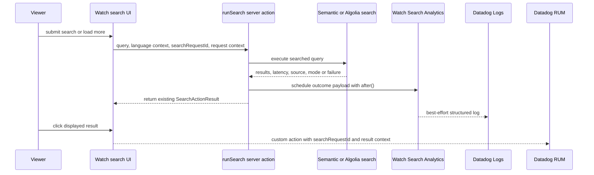

# feat: Watch Search Analytics

## Summary

Implement Watch Search Analytics as canonical server-side Datadog Logs emitted from the Watch search server action, with non-blocking delivery and supplemental RUM click/browser context. The plan keeps analytics separate from eval tracing, records the exact server-executed query, excludes app identity fields, and leaves an optional Watch Analytics Context hook for future Watch-event enrichment.

---

## Problem Frame

`feat-197` exists because the replacement Watch search path needs the product-observability value Algolia used to provide: top queries, no-result queries, failures, latency, result counts, language mismatch signals, and clicked results. The requirement is analytics for real viewer search behavior, not Mastra eval sampling or Admin-owned search trace storage.

The canonical counts must not depend on Datadog RUM sampling, browser blockers, or client SDK initialization. Every Watch search or load-more request that reaches the server action should schedule a server-side Datadog log event without delaying the search response.

---

## Requirements

**Canonical Server Analytics**

- R1. Watch search emits one canonical server-side Datadog Logs event for every submitted search request and load-more request that reaches the server action.
- R2. Canonical server-side events cover completed, failed, and no-result outcomes without changing the public search response shape.
- R3. Datadog delivery is asynchronous, best-effort, fire-and-forget, and never awaited by the user-facing search response.
- R4. Completed and no-result server events include query text, result count, result source, search mode, latency, site language, selected Search Language, detected query language when available, and a generated `searchRequestId`.
- R5. Failed server events include query context, result source when known, language context, elapsed time when available, and a safe failure category.
- R6. Load-more events include query context, requested page position or offset, added result count, total visible result count, and failure state when load-more fails.

**Supplemental Browser Context**

- R7. Result-clicked actions are attempted through supplemental RUM when RUM is initialized and sampled, with query context, clicked result id, slug, type, title, position, result source, selected Search Language, and `searchRequestId`; if exact click counts become required, add a server-side click beacon later.

**Payload Policy**

- R8. V1 sends exact query text as accepted and executed by `runSearch` rather than hashing, categorizing, or redacting it.
- R9. Search event payloads exclude app-supplied identity fields: name, email, full user id, auth token, cookie, bearer/API key material, IP address, and manually-added session identifiers.
- R10. The operations docs and verification state that raw query text can contain sensitive words a viewer typed, even though no app identity fields are attached.

**Reviewability**

- R11. The Datadog review path lets the team inspect top queries, no-result queries, failed queries, clicked results, language mismatch signals, and search-mode health.
- R12. The operations docs include the Datadog MCP query path when available and a Datadog UI query path when MCP coverage is unavailable.

**Watch Context Compatibility**

- R13. The search analytics contract accepts an optional sanitized Watch context object without requiring Watch event collection to exist.
- R14. When no Watch context provider exists, search analytics still emits the same core server-side analytics events.
- R15. Future Watch context may include anonymous page, video, playback, language, and referrer fields while following the same identity exclusion policy as search events.
- R16. Canonical Watch analytics requires an explicit Watch analytics surface so non-Watch `runSearch` callers do not pollute Watch search counts; if a Watch caller omits `searchRequestId`, the server generates a per-request fallback id.
- R17. `watch_search.query` is the only raw user-text exception in the server event; payload construction uses a whole-event allowlist for `watch_search.*` and `watch_context.*` fields.
- R18. Optional page/referrer context is value-sanitized to route or origin-level values, length-bounded, and unable to drop or corrupt canonical `watch_search.*` fields when oversized.
- R19. RUM custom actions attach only bounded Watch search action context from this feature and do not add app-provided name, email, full user id, token, cookie, IP, bearer/API key, or manual session id context.
- R20. Release verification proves `forge-web` logs reach Datadog with queryable structured `watch_search.*` attributes before the ticket is considered complete.

---

## Key Technical Decisions

- KTD1. **Datadog Logs are canonical.** Server-side structured logs are the source of truth because they fire from the request handler that already receives every submitted search reaching the app. Datadog RUM remains useful for browser context, but its sampling and SDK availability make it the wrong canonical sink for every-search analytics.
- KTD2. **Use Next `after` for non-blocking analytics.** The search action schedules analytics after the response work is ready, so Datadog send latency is outside the user-facing search path. This is best-effort, not durable exactly-once delivery across process death.
- KTD3. **Activate web server Datadog forwarding before emitting analytics.** `apps/web` already has Datadog APM/log helpers, but its `instrumentation.ts` currently avoids calling `configureDatadog()`. The plan mirrors the Admin app's Node-runtime registration pattern so structured search logs have a forwarding path in production.
- KTD4. **Add a structured analytics sender instead of using `watch-observability`.** `watch-observability` is shaped for safe breadcrumbs and strips characters from messages; Watch Search Analytics needs exact query text and queryable structured attributes.
- KTD5. **Correlate with a per-search request id.** The UI generates a random `searchRequestId` per submitted result set and reuses it for load-more and RUM click actions. This supports server/RUM correlation without persistent viewer identity.
- KTD6. **Log the server-executed query boundary.** The canonical query is the exact query the server action actually searches after existing trim/length behavior. If product later wants over-200-character raw input analysis, that should be a separate search contract decision.
- KTD7. **Keep exact query out of tags and log-based metric dimensions.** Query text belongs in a log attribute for analysis and inspection; bounded fields such as outcome, source, mode, language, and failure category are the fields to facet or convert to metrics.
- KTD8. **Gate canonical Watch analytics by surface.** `runSearch` is shared by Watch and non-Watch surfaces, so canonical Watch events require an explicit Watch analytics surface/context. Watch callers get a client-generated id for UI/RUM correlation, while the server supplies a fallback id when needed so logging is not dependent on perfect client context.
- KTD9. **Use a whole-event allowlist.** The analytics builder creates the final Datadog payload from explicit fields rather than copying request objects, error objects, result objects, headers, or arbitrary custom attributes. This keeps `watch_search.query` as the only raw user-text exception.
- KTD10. **Treat exact query logs as sensitive observability data.** V1 intentionally logs exact query text, so access, retention, saved views, exports, dashboards, alerts, and rollback guidance belong in the operations note rather than being left implicit.

---

## High-Level Technical Design

Canonical server log attributes should use a stable `watch_search.*` family. The core set is `watch_search.event_name`, `watch_search.search_request_id`, `watch_search.request_type`, `watch_search.outcome`, `watch_search.query`, `watch_search.result_count`, `watch_search.added_result_count`, `watch_search.visible_result_count`, `watch_search.result_source`, `watch_search.requested_search_mode`, `watch_search.response_search_mode`, `watch_search.latency_ms`, `watch_search.offset`, `watch_search.route_language_slug`, `watch_search.search_language_slug`, `watch_search.resolved_language_slug`, `watch_search.detected_query_language`, and `watch_search.failure_category`. Optional future context should stay under a separate `watch_context.*` allowlist.

The server action should treat `watch_search.surface=watch-search` as the canonical analytics gate. If the surface is absent, `runSearch` keeps working but does not emit Watch analytics. If the surface is present and `searchRequestId` is missing, the server emits with a generated id and the UI still receives results normally.

---

## Implementation Units

### U1. Web Datadog Server Bootstrap and Structured Log Support

- **Goal:** Ensure `apps/web` configures Datadog server logging in the Node runtime and can emit structured custom attributes without routing exact query text through a flattened console message.
- **Requirements:** R1, R3, R8, R9, R10, R11, R12, R17, R18, R20.
- **Dependencies:** None.
- **Files:** `apps/web/src/instrumentation.ts`, `apps/web/src/observability/datadog.ts`, `apps/web/src/observability/datadog-logs.ts`, `apps/web/src/observability/datadog.test.ts`, `apps/web/src/observability/datadog-logs.test.ts`, `apps/web/src/instrumentation.test.ts`.
- **Approach:** Mirror Admin's Node-runtime `register()` pattern so `configureDatadog()` runs only under `NEXT_RUNTIME === "nodejs"`. Extend the existing syslog payload builder or add a small structured-log helper that preserves `message`, `service`, `env`, trace ids, and custom attributes as Datadog attributes rather than message-only JSON, while retaining the existing no-op behavior when Datadog Agent settings are absent.
- **Patterns to follow:** `apps/admin/src/instrumentation.ts`, `apps/admin/src/observability/datadog.test.ts`, `apps/admin/src/observability/datadog-logs.test.ts`, `apps/web/src/observability/datadog.ts`, `apps/web/src/observability/datadog-logs.ts`.
- **Test scenarios:**
  - Given `NEXT_RUNTIME=nodejs`, `register()` dynamically imports and calls `configureDatadog()` once.
  - Given a non-Node runtime or no runtime value, `register()` does not import `dd-trace` or configure Datadog.
  - Given structured attributes containing exact query text, the syslog JSON preserves the attribute value and still includes `service`, `env`, `status`, trace id, and span id.
  - Given a fixture payload with `watch_search.query`, `watch_search.outcome`, `watch_search.result_source`, and `watch_search.latency_ms`, the payload shape keeps those as structured attributes that Datadog MCP/Explorer can query after ingestion.
  - Given `DD_AGENT_HOST` is absent, log forwarding remains a no-op and search analytics callers do not throw.
  - Given the UDP callback receives an error, the helper swallows it in production and preserves the existing dev-only diagnostic behavior.
- **Verification:** Web server startup has a production log-forwarding path, structured log payloads are queryable in Datadog, missing Datadog configuration cannot break local or preview search, and `forge-web` production logging readiness is confirmed before search analytics is treated as released.

### U2. Watch Search Analytics Contract and Non-Blocking Emitter

- **Goal:** Define the allowlisted analytics payload, outcome classification, optional Watch Analytics Context hook, and fire-and-forget scheduling wrapper used by the search action.
- **Requirements:** R1, R2, R3, R4, R5, R6, R8, R9, R13, R14, R15, R17, R18.
- **Dependencies:** U1.
- **Files:** `apps/web/src/lib/watch-search-analytics.ts`, `apps/web/src/lib/watch-search-analytics.test.ts`, `apps/web/src/lib/watch-observability.ts`, `apps/web/src/lib/watch-observability.test.ts`.
- **Approach:** Add a dedicated server-only analytics module that builds normalized success, no-result, failed, and load-more payloads from a whole-event allowlist. The module should schedule emission via `after`, wrap scheduler failures, synchronous callback failures, pending sends, and async rejections in error swallowing, and keep any Datadog network send outside the response path. Normalize page/referrer context to route or origin-level values, length-bound optional context fields, and leave `watch-observability` in place for availability breadcrumbs rather than exact-query transport.
- **Patterns to follow:** `apps/web/src/lib/watch-observability.ts` for safe allowlist posture, `docs/solutions/best-practices/in-memory-slot-reservation-fire-and-forget-20260506.md` for wrapping fire-and-forget callbacks, and `docs/solutions/platform/admin-search-trace-retention-pattern.md` for keeping analytics writes out of availability paths.
- **Test scenarios:**
  - Given a successful initial search with results, the builder creates `outcome=completed`, `request_type=search`, exact server-executed query, result count, source, mode, latency, language context, and `searchRequestId`.
  - Given a successful search with zero results, the builder creates `outcome=no_result` while preserving the same query and language attributes.
  - Given load-more succeeds, the builder records `request_type=load_more`, offset, added result count, visible result count, source, and query context.
  - Given any failure category, the builder emits `outcome=failed` with a safe category and without raw stack, auth, cookie, session, IP, or bearer material.
  - Given the query text looks like an email address, token, phone number, or person name, that raw text appears only in `watch_search.query` and is not copied into any other attribute.
  - Given analytics input, request context, failure objects, result metadata, logger custom attributes, or optional Watch context include disallowed identity-like keys, the final payload only includes allowed `watch_search.*` and `watch_context.*` fields.
  - Given page or referrer context includes query strings, fragments, credentials, tokens, emails, session ids, bearer material, or IP-like values, the payload records only the sanitized route or origin-level value.
  - Given optional Watch context is oversized, field-level bounds keep the event under the configured payload ceiling and preserve canonical `watch_search.*` fields.
  - Given `after` throws while scheduling, the scheduled callback throws synchronously, the sender promise rejects, or the sender promise remains pending, the caller resolves normally and no Datadog network work is awaited before the search response.
- **Verification:** Analytics payload construction is deterministic, identity exclusion is test-covered, exact query text is retained in the intended attribute, and the emitter is non-blocking by construction.

### U3. Instrument `runSearch` for Every Reached Search Outcome

- **Goal:** Capture exactly one canonical server analytics event for each `runSearch` invocation from Watch search, including semantic success/failure, Algolia success/failure, no-result, load-more, and unexpected exceptions.
- **Requirements:** R1, R2, R3, R4, R5, R6, R8, R9, R10, R16, R17.
- **Dependencies:** U1, U2.
- **Files:** `apps/web/src/lib/search-actions.ts`, `apps/web/src/lib/search-actions.test.ts`, `apps/web/src/lib/search.ts`, `apps/web/src/lib/search.test.ts`.
- **Approach:** Add an explicit Watch analytics input to `runSearch` carrying the Watch surface, `searchRequestId`, request type, visible result count, expected result source for load-more, detected query language, and optional Watch context. Emit canonical Watch analytics only when the Watch surface is present, generate a fallback `searchRequestId` when needed, and classify load-more source mismatch as a failed analytics outcome while preserving the current response union. Wrap the action so all reachable Watch branches schedule one event after building their existing response, including errors that occur before the semantic/Algolia branch returns.
- **Patterns to follow:** Existing `runSearch` response construction in `apps/web/src/lib/search-actions.ts`, `docs/solutions/architecture-patterns/forge-algolia-search-modal-20260610.md` for server-action boundary instrumentation, and `docs/solutions/performance-issues/admin-search-stage-db-timing-instrumentation-20260624.md` for result source/mode/latency dimensions.
- **Test scenarios:**
  - Covers AE1. Given semantic search succeeds with results, `runSearch` returns the same success shape and schedules one completed server event.
  - Covers AE2. Given semantic search succeeds with zero results, `runSearch` returns the same empty success shape and schedules one no-result event.
  - Covers AE3. Given semantic search throws, `runSearch` returns the existing failed response and schedules one failed event.
  - Given Algolia is enabled and succeeds, the event records Algolia source, returned query, latency, next offset, and facets without changing UI response shape.
  - Given Algolia returns `ok=true` with zero hits or zero transformed results, the event records `outcome=no_result` rather than `completed`.
  - Given Algolia returns `ok=false`, the event records the failed outcome and safe failure category.
  - Given a Watch load-more request returns a different source than the displayed result set expected, the event records a failed load-more outcome with a safe source-mismatch category while the UI can keep its existing failure behavior.
  - Given feature flag resolution, transform, or another pre-return step throws, the action still schedules one failed event before preserving the intended failure behavior.
  - Covers AE7. Given the analytics send helper throws or rejects, the search action still returns its normal result and no Datadog error reaches the caller.
  - Given the analytics sender promise never settles, the search action returns before that promise settles.
  - Given `after` scheduling itself throws, the search action preserves the current response shape and no unhandled rejection escapes.
  - Given the input query exceeds the existing server cap, the analytics event records the exact capped query that was searched.
  - Given a Watch caller includes the explicit analytics surface, exactly one canonical event is scheduled; given a non-Watch caller omits that surface, no Watch analytics event is scheduled.
- **Verification:** Unit coverage proves one scheduled event per reached Watch search request, no response-shape regressions, no extra awaits on Datadog delivery, no non-Watch pollution, and no identity fields in branch-specific payloads.

### U4. Thread Search Request Context and RUM Click Actions Through the Watch UI

- **Goal:** Generate and preserve anonymous per-search context in the Watch UI, then report supplemental result-click actions through Datadog RUM without affecting navigation.
- **Requirements:** R3, R4, R6, R7, R9, R11, R13, R15, R16, R19.
- **Dependencies:** U2, U3.
- **Files:** `apps/web/src/components/FloatingSearchController.tsx`, `apps/web/src/components/FloatingSearchContext.tsx`, `apps/web/src/components/FloatingSearchProvider.tsx`, `apps/web/src/components/SearchOverlay.tsx`, `apps/web/src/components/search/VideoCard.tsx`, `apps/web/src/components/DatadogRum.tsx`, `apps/web/src/components/__tests__/FloatingSearchProvider.test.tsx`, `apps/web/src/components/__tests__/DatadogRum.test.tsx`, `apps/web/src/components/search/VideoCard.test.tsx`.
- **Approach:** Generate a random `searchRequestId` for each submitted query result set, persist it with the active search signature, and reuse it for load-more and clicked-result context. Pass the explicit Watch analytics surface, detected query language, selected Search Language, expected load-more result source, and visible result count into the server analytics input. Add a small `reportDatadogRumAction` helper around `datadogRum.addAction`, then have result cards call it with stable action names and bounded context before normal Link navigation proceeds.
- **Patterns to follow:** `apps/web/src/components/FloatingSearchController.tsx` active signature handling, `apps/web/src/components/DatadogRum.tsx` error-reporting guard, `apps/web/src/components/search/VideoCard.tsx` link/navigation behavior, and `docs/solutions/ui-bugs/watch-semantic-search-language-metadata-confirmation-race.md` for preserving active result-set language context.
- **Test scenarios:**
  - Given a new submitted query, the UI generates a new `searchRequestId` and passes it to `runSearch`.
  - Given load-more for the displayed result set, the UI reuses the same `searchRequestId`, query, source, and language context.
  - Given load-more for the displayed result set, the UI passes expected result source and visible result count so the server can classify source mismatch as a load-more analytics failure.
  - Given the input field changes after results render, clicking an old result reports the query context from the displayed result set rather than the current input text.
  - Covers AE4. Given the third result is clicked and RUM is initialized for a sampled session, a custom action is recorded with position `3`, result id or slug, result type, title, query context, result source, selected Search Language, and `searchRequestId`, while the Link `href` remains unchanged.
  - Given RUM is uninitialized, sampled out, or `addAction` throws, navigation and visible search behavior still work.
  - Given RUM custom action context is built, it includes only bounded Watch search fields and does not add app user/global context such as name, email, full user id, token, cookie, IP, bearer/API key, or manual session id.
  - Given optional Watch context exists, the RUM payload includes only the same allowlisted anonymous context fields used by the server analytics contract.
- **Verification:** Client tests prove request ids are stable for a displayed result set, RUM click reporting is supplemental and failure-safe, and result links continue to use the Watch route builders.

### U5. Datadog Review Path, Operations Notes, and Roadmap Closure

- **Goal:** Document how the team inspects Watch Search Analytics in Datadog MCP and the Datadog UI, then close the roadmap verification loop.
- **Requirements:** R10, R11, R12, R15, R18, R20.
- **Dependencies:** U1, U2, U3, U4.
- **Files:** `docs/operations/watch-search-analytics-datadog.md`, `docs/observability/datadog.md`, `docs/roadmap/content-discovery/feat-197-watch-search-query-outcome-logging.md`.
- **Approach:** Add a focused operations note that names the canonical log query, expected attribute family, Datadog MCP tools, and common analysis recipes. Include examples for top queries, no-result queries, failures by category, p95 latency, source/mode distribution, language context, and supplemental RUM clicks. Document exact-query access/retention expectations, no broad monitors or exports that include raw query text, `searchRequestId` as correlation-only, and a rollback path for disabling exact query emission if policy changes. Update the roadmap ticket verification once the implementation is in place.
- **Patterns to follow:** `docs/operations/watch-datadog-availability-incidents.md`, `docs/observability/datadog.md`, Datadog MCP `datadog/logs` guidance for `analyze_datadog_logs`, and Datadog RUM aggregation guidance from the available MCP tool surface.
- **Test scenarios:** Test expectation: none -- this is documentation and roadmap verification. The executable verification belongs to U1-U4.
- **Verification:** A teammate can use Datadog MCP or Datadog Log Explorer to answer the required product questions without reading implementation code, a synthetic Watch search can be found in production Datadog as a `forge-web` log with structured `watch_search.*` attributes and no identity fields, and the docs state that server logs are canonical while RUM is supplemental.

---

## Scope Boundaries

- In scope: every Watch search and load-more request that reaches `runSearch`, canonical server-side Datadog Logs, non-blocking analytics delivery, supplemental RUM clicked-result actions, optional Watch Analytics Context allowlist, and Datadog review documentation.
- Out of scope: unsubmitted keystrokes, abandoned browser input, requests that never reach the server action, Mastra eval trace storage, Admin search trace retention, Watch event storage/API routes, durable exactly-once queueing, database persistence for analytics, and a full Datadog dashboard or monitor.

### Deferred to Follow-Up Work

- A server-side click beacon if clicked-result counts must become exact rather than RUM-sampled.
- Query redaction, hashing, or sensitive-pattern classification if the team later decides exact query text is too risky.
- Dedicated dashboards, monitors, or log-based metrics after the team has observed enough live field cardinality.

---

## System-Wide Impact

This change affects public Watch search, web server observability bootstrap, Datadog log volume, Datadog RUM custom action volume, and future Watch-event analytics compatibility. It should not affect Admin GraphQL contracts, generated GraphQL clients, search result ranking, public Watch URLs, or visible modal behavior.

---

## Risks & Dependencies

- **Best-effort delivery:** Next `after` is appropriate for non-blocking analytics, but it is not a durable queue. A process crash or shutdown can lose scheduled analytics.
- **Datadog Agent/syslog availability:** Canonical logs depend on production Datadog forwarding being configured and active for `forge-web`.
- **High-cardinality query text:** Exact query text is required for product analytics but must remain a log attribute, not a tag or log-based metric dimension.
- **Raw-query access:** Exact query logs are sensitive observability data. Saved views, exports, monitors, dashboards, and alert notifications should avoid broad exposure of `watch_search.query`, and access should stay limited to users who need search analytics.
- **Payload size and truncation:** Optional Watch context must be length-bounded so large page/referrer/video fields cannot truncate canonical `watch_search.*` attributes or produce invalid Datadog payloads.
- **RUM session context:** The app should not attach identity fields, but Datadog RUM can still attach Datadog-managed anonymous session context to browser events.
- **Shared server action callers:** `runSearch` also has non-Watch call sites, so Watch analytics must be gated by explicit surface/context rather than inferred from the action alone.
- **Correlation id cardinality:** `searchRequestId` is for joining one server event to supplemental UI/RUM context. It should not become a log-based metric dimension, dashboard group-by default, or long-lived viewer identifier.

---

## Acceptance Examples

- AE1. Given a viewer searches `Jesus`, when `runSearch` returns results, then a server-side Datadog Logs event is scheduled with query text `Jesus`, result count, result source, search mode, latency, language context, and `searchRequestId`.
- AE2. Given a search completes with zero results, when the server action returns the empty result response, then Datadog receives a no-result event that can be grouped by query and language context.
- AE3. Given Datadog send fails while a failed-search event is being emitted, when the server action handles the search failure, then the viewer still sees the normal retry state and no identity fields are sent.
- AE4. Given search results are visible and RUM is initialized for a sampled session, when a viewer clicks the third result, then RUM records a clicked-result action with position `3`, query context, result metadata, and `searchRequestId`, and normal navigation continues.
- AE5. Given a viewer submits raw text they typed, when the server event is emitted, then v1 sends the exact server-executed query text to Datadog without hashing or redaction.
- AE6. Given no Watch context provider exists, when a search event is emitted, then the core server payload is still sent; given sanitized Watch context exists, then allowed context fields are included.
- AE7. Given Datadog is slow or unavailable, when a viewer submits a search, then the search response returns without waiting for Datadog and no Datadog delivery error is surfaced.
- AE8. Given a viewer loads more results from a displayed result set, when the server action handles the request, then the server event uses the same `searchRequestId`, records `request_type=load_more`, offset, added result count, visible result count, source, and language context; if the returned source mismatches the expected source, the analytics outcome is failed with a safe source-mismatch category.
- AE9. Given RUM is unavailable, sampled out, or the RUM SDK throws during a result click, when the viewer activates a result, then navigation still continues and canonical server search analytics are unaffected.

---

## Documentation / Operational Notes

Datadog MCP review should use `analyze_datadog_logs` for canonical counts and aggregation over server logs, and `aggregate_datadog_rum_events` only for supplemental click/browser context. The operations doc should include the required `extra_columns` declarations for `watch_search.*` attributes because Datadog MCP's SQL virtual table only exposes custom attributes after they are declared.

Suggested analysis recipes:

- Top searches by `watch_search.query` for completed and no-result server events.
- No-result rate by `watch_search.query`, selected Search Language, and route language.
- Failed-search count by `watch_search.failure_category`, result source, and hour.
- p95 latency by result source and response search mode.
- Load-more volume and failure rate by query/source/language.
- Supplemental RUM click count by result position and result type, with `searchRequestId` used only to inspect or correlate individual sessions of events.

---

## Sources / Research

- `docs/brainstorms/2026-07-01-watch-search-analytics-requirements.md`
- `docs/roadmap/content-discovery/feat-197-watch-search-query-outcome-logging.md`
- `CONCEPTS.md`
- `apps/web/AGENTS.md`
- `apps/web/src/lib/search-actions.ts`
- `apps/web/src/lib/search.ts`
- `apps/web/src/components/FloatingSearchController.tsx`
- `apps/web/src/components/DatadogRum.tsx`
- `apps/web/src/components/search/VideoCard.tsx`
- `apps/web/src/observability/datadog.ts`
- `apps/web/src/observability/datadog-logs.ts`
- `apps/admin/src/instrumentation.ts`
- `apps/admin/src/observability/datadog.test.ts`
- `apps/admin/src/observability/datadog-logs.test.ts`
- `docs/solutions/architecture-patterns/forge-algolia-search-modal-20260610.md`
- `docs/solutions/ui-bugs/watch-semantic-search-language-metadata-confirmation-race.md`
- `docs/solutions/best-practices/in-memory-slot-reservation-fire-and-forget-20260506.md`
- `docs/solutions/platform/admin-search-trace-retention-pattern.md`
- `docs/solutions/performance-issues/admin-search-stage-db-timing-instrumentation-20260624.md`
- [Next.js `after`](https://nextjs.org/docs/app/api-reference/functions/after)
- [Datadog Logs API](https://docs.datadoghq.com/api/latest/logs/)
- [Datadog log facets](https://docs.datadoghq.com/logs/explorer/facets/)
- [Datadog logs to metrics](https://docs.datadoghq.com/logs/log_configuration/logs_to_metrics/)
- [Datadog RUM user actions](https://docs.datadoghq.com/real_user_monitoring/application_monitoring/browser/tracking_user_actions/)
- Datadog MCP `datadog/logs` skill and available Datadog MCP log/RUM aggregation tools.
