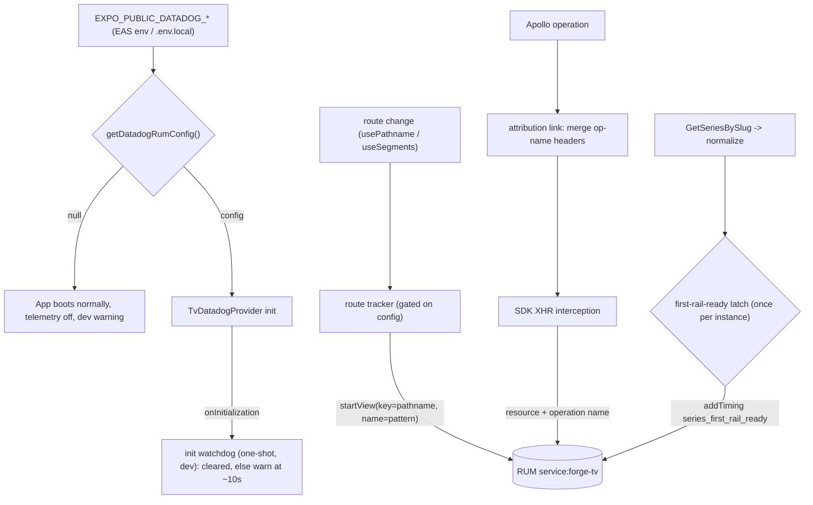

# TV Datadog Activation and RUM Depth - Plan

## Goal Capsule

- **Objective:** Finish the TV Datadog rollout in one branch: remove the dev boot-smoke scaffolding, add route-level RUM views, per-operation GraphQL attribution, a series render timing, and a dev-visible SDK init-failure warning; provision the development and preview EAS profiles with real Datadog credentials; document the remaining operational steps as a runbook.
- **Authority:** This plan > `docs/roadmap/platform/feat-225-tv-datadog-production-activation.md` + `docs/roadmap/platform/feat-226-tv-rum-instrumentation-depth.md` > repo conventions (`apps/tv/CLAUDE.md`). Where this plan's Key Technical Decisions diverge from a ticket's literal code suggestion (view naming), the plan wins — the divergences were user-confirmed.
- **Stop conditions:** Never provision the production EAS profile (privacy-gated, out of scope). Never bump `@datadog/mobile-react-native` (pnpm patch coupling). Surface a genuine blocker (contradicts the Product Contract or needs credentials the session can't obtain) instead of guessing.
- **Execution profile:** Pure helpers first with colocated unit tests, then wiring; verify with the three `@forge/tv` package commands plus a live provisioned simulator session.

---

## Product Contract

### Summary

One branch delivers both remaining P1 TV observability tickets: the RUM integration shipped in PR #1434 becomes real (credentials provisioned for development and preview builds, verification scaffolding removed) and deep enough to answer performance questions (per-route views, per-operation GraphQL attribution, a series render timing, a visible init-failure signal). All new decision logic lands as pure helpers with colocated tests behind thin components, and the deferred operational steps ship as a runbook inside the existing observability doc.

### Problem Frame

PR #1434 shipped opt-in Mobile RUM for `apps/tv`, but no EAS profile carries the credentials, so every real build boots with telemetry silently off. What the integration does capture is too shallow to act on: every event lands under the implicit ApplicationLaunch view, every GraphQL call is an indistinguishable POST to `/api/graphql`, and the dominant felt cost from the 2026-06-30 perf sweep — roughly three seconds of client-side parse/render on series detail — has no tracked number. Meanwhile the dev-only boot-smoke event fires a fake error into Error Tracking on every dev launch, and a failed SDK init is completely silent.

### Key Decisions

- **Both tickets on one branch.** feat-226's instrumentation is verified against the same credentials feat-225 provisions, and the two tickets touch the same handful of files; one PR avoids a stacked-review round trip.
- **Session scope is code plus provisioning.** All code from both tickets lands, and the development and preview EAS profiles get real credentials. Real builds, hardware verification, the intake alert, and production credentials move to a runbook.
- **Production provisioning stays behind the privacy gate.** `TrackingConsent.GRANTED` at 100% session sampling needs product/legal sign-off before the production profile gets credentials; this branch does not pre-empt that decision.
- **Roadmap consequence:** feat-226 can close when this branch merges; feat-225 stays in progress until the runbook's hardware verification completes.

### Requirements

**Activation (feat-225)**

- R1. Dev launches fire no synthetic "tv boot smoke" error or log; the RUM-disabled dev warning still appears when credentials are absent.
- R2. The development and preview EAS profiles carry `EXPO_PUBLIC_DATADOG_CLIENT_TOKEN`, `EXPO_PUBLIC_DATADOG_APPLICATION_ID`, and `EXPO_PUBLIC_DATADOG_SITE=US1`; preview also carries `EXPO_PUBLIC_DATADOG_ENV=preview` (development stays unset and defaults to development) so preview sessions never tag as production.
- R3. Builds without credentials keep booting normally with telemetry off (the null-gate is unchanged).

**Instrumentation depth (feat-226)**

- R4. Every route change is tracked as its own RUM view, so events attribute to home, series, watch, and search rather than a single launch view.
- R5. GraphQL RUM resources carry the operation name, making the heavy series query distinguishable from search — without renaming any operation.
- R6. The series detail screen reports a `series_first_rail_ready` timing when its first rail is rendered from the normalized query result.
- R7. Dev builds warn visibly when credentials are provisioned but SDK init has not completed within roughly 10 seconds of mount; release builds stay silent.
- R8. All new instrumentation follows the never-throw telemetry pattern and preserves the search-keyboard privacy behavior (generic key action name).
- R10. Recent-search chips stop shipping the user's typed query as a RUM action name; the chip gets a generic action name the way the keyboard keys do.

**Operational handoff**

- R9. A runbook covers the deferred steps: the Datadog usage/intake alert for `service:forge-tv`, Android TV preview-APK verification, Apple TV TestFlight verification, and production-profile provisioning gated on the privacy sign-off.

### Acceptance Examples

- AE1. **Covers R1, R3.** Given a dev launch with no Datadog env vars, when the app boots, then it boots normally, logs the `[datadog] RUM disabled` warning, and sends nothing to Datadog — and Error Tracking receives no "tv boot smoke" events from builds at this commit onward.
- AE2. **Covers R4, R6.** Given a cold simulator launch with dev credentials and navigation from home into a series, when the session reaches RUM, then it shows one view per visited route and the series view carries a `series_first_rail_ready` timing in the expected 2-4s range.
- AE3. **Covers R5.** Given the series screen and a search both execute their queries, when their RUM resources land, then each carries its own operation name and the two are separable by facet in the RUM explorer.
- AE4. **Covers R7.** Given credentials are provisioned but the native SDK never finishes initializing (for example a JS-only reload against a stale binary), when about 10 seconds pass after mount, then the dev console warns that telemetry init failed.

### Success Criteria

- In-branch: `pnpm --filter @forge/tv test`, `typecheck`, and `lint` are green; a live simulator session shows per-route views, operation-named GraphQL resources, and the series timing.
- Post-runbook: sessions appear in RUM from an Android TV device and a physical Apple TV with the correct `env` per build type, and the intake alert is active on `service:forge-tv`.

### Scope Boundaries

- Deferred to the runbook, not this branch: EAS preview/TestFlight builds, hardware verification, the Datadog intake/usage alert, production-profile credentials.
- Video playback gets no dedicated RUM view this branch: the player overlay is not a route, so playback telemetry attributes to the underlying series/watch view. Deliberate deferral, not an omission.
- Separate tickets, untouched: feat-227 (symbol upload CI, patch maintenance guards) and feat-228 (Datadog MCP, Hermes profiler pairing).
- Constraints carried from the tickets: no `expo-datadog` config plugin, no SessionReplay or WebViewTracking packages, client tokens only in `EXPO_PUBLIC_*` (never API keys), no GraphQL operation renames, and no weakening of the unprovisioned null-gate.

### Dependencies and Assumptions

- The "Forge TV" RUM application exists in Datadog (it backed PR #1434's simulator verification); its client token and application ID are retrievable from the RUM Applications page. No local env file holds them.
- The EAS CLI is authenticated with owner access to the `jesus-film-project` account.
- `@datadog/mobile-react-native@3.5.2` provides every needed API — verified: `DATADOG_GRAPH_QL_OPERATION_NAME_HEADER` (plus type/variables variants), `DdRum.startView`/`addTiming`, and the `DatadogProvider` `onInitialization` prop.
- `apps/tv/src/lib/datadog.test.ts` does not reference the boot-smoke block, so its removal needs no test changes.

### Open Questions

- Deferred, blocks only the post-merge production step (not this branch): product/legal sign-off on `TrackingConsent.GRANTED` at 100% session sampling before the production profile is provisioned.

### Sources

- `docs/roadmap/platform/feat-225-tv-datadog-production-activation.md`, `docs/roadmap/platform/feat-226-tv-rum-instrumentation-depth.md` — the tickets this contract narrows.
- `apps/tv/CLAUDE.md` (Observability section) and `docs/observability/datadog.md` ("TV production variables") — setup semantics, the `eas env:create` var list, and the already-decided runbook home.
- `docs/plans/2026-06-30-001-perf-tv-client-performance-sweep-plan.md` — the perf baseline the series timing must make measurable.
- `docs/solutions/integration-issues/datadog-mobile-rum-tvos-integration.md` — tvOS pnpm patch coupling, why the config plugin stays excluded, pod-install + DerivedData gotcha on any patch regeneration.
- `docs/solutions/performance-issues/tv-mobile-series-detail-overfetch-and-childdublanguages-index-20260619.md` — the two-query series split; the timing must latch on the lean query's first paint, never the lazy languages query.
- `docs/solutions/mobile/expo-env-file-handling.md` — EAS visibility semantics (`secret` vars never reach `EXPO_PUBLIC_*` bundles; `--channel` ≠ `--environment`).
- SDK internals verified against the installed `@datadog/mobile-react-native@3.5.2`: init is a `globalThis`-keyed singleton (`DatadogProviderState`), so `onInitialization` fires at most once per JS process; the GraphQL headers are stripped by the SDK's XHR interception only after async init completes.
- expo-router `usePathname` returns the resolved literal path (`/series/mark`), `useSegments` the route pattern (`["series", "[slug]"]`).
- Code anchors: `apps/tv/src/components/DatadogRum.tsx` (boot-smoke block, provider config), `apps/tv/src/lib/apolloClient.ts` + `apps/tv/src/lib/authHeaders.ts` (link chain + per-operation header precedent), `apps/tv/src/contexts/watchSessionState.ts` + `apps/tv/src/components/series/seriesScreenState.ts` (pure-helper-behind-thin-shell precedent), `apps/tv/src/components/search/SearchBrowse.tsx` (recent-search chip label), `apps/tv/src/env.ts` (top-level `EXPO_PUBLIC_*` inlining).

---

## Planning Contract

Product Contract preservation: R1-R9, AE1-AE4, Key Decisions, and Scope Boundaries carried from the brainstorm unchanged except — R10 added (recent-search chip action naming, user-confirmed at the scoping synthesis), one Scope Boundary added (no dedicated player view), and the two resolved Open Questions rewritten in place (runbook home was already decided in the prior integration work; `EXPO_PUBLIC_DATADOG_VERSION` stays unset per KTD6). Post-review: R2, KTD6, U6, and U7 updated per the confirmed doc-review fixes (thread `ddActionName` through `FocusableCard`; explicit `env=preview` tag on the preview environment).

### Key Technical Decisions

- KTD1. **View identity: name by route pattern, key by literal pathname.** `DdRum.startView(key: pathname, name: pattern)` where the pattern comes from `useSegments` (e.g. `series/[slug]`). Pattern names keep view-name cardinality bounded (one facetable "series" view, satisfying the one-view-per-route acceptance case); pathname keys still restart the view per navigation, including slug-to-slug. Rejects the ticket's literal `startView(pathname, pathname)` for its unbounded per-slug name cardinality.
- KTD2. **Series timing fires once per screen instance, latched on rail-ready, not merely data-arrived.** The latch is a pure predicate deciding "first render where the normalized record yields a non-empty episode rail", covering cache-synchronous, network-async, and partial-data arrivals (`returnPartialData: true` can surface a record before episodes exist). Pop-back revisits restart the view (KTD1) but deliberately carry no timing — re-firing would record ~0ms noise into the metric that exists to measure cold parse/render cost.
- KTD3. **Init watchdog is one-shot per JS process, mirroring the SDK's own singleton.** SDK init runs behind a `globalThis`-keyed guard, so `onInitialization` never re-fires after the first init; a per-mount timer would false-warn on every remount (Fast Refresh, ErrorBoundary re-render). The watchdog arms once per process, only when provisioned, is cleared by `onInitialization`, and warns only in dev.
- KTD4. **Attribution link mirrors the auth link and must spread-merge headers.** A raw `ApolloLink` (same shape as the existing auth link) sets the SDK's exported operation-name (and operation-type) headers from a pure `operationName -> headers` helper; anonymous operations get no headers. It merges over `operation.getContext().headers` so the search bearer survives. It attaches whenever the config gate passes, independent of SDK init state — during the brief cold-launch window before the SDK patches XHR, the custom header reaches admin un-stripped, which is benign (React Native enforces no CORS; the GraphQL server ignores unknown headers) and accepted so the first heavy series query stays attributed.
- KTD5. **Pure helpers in plain `.ts` modules; components stay thin.** jest-expo cannot load `.tsx` module graphs, so every new decision (view naming, header mapping, timing latch, watchdog state) is a pure exported function with colocated tests, following the existing telemetry-helper and screen-state precedent. All Datadog calls go through never-throw wrappers.
- KTD6. **Provisioning: `eas env:create` per environment with plaintext visibility.** Values are bundle-inlined by design, so `sensitive`/`secret` buys nothing and breaks later read-back (`secret` never reaches `EXPO_PUBLIC_*` bundles at update time at all). Preview gets an explicit `EXPO_PUBLIC_DATADOG_ENV=preview`: preview is a release build (`__DEV__` false), so the SDK's two-bucket default would tag external testers' sessions `env:production` before the privacy gate clears. Development leaves ENV unset (defaults to development); `EXPO_PUBLIC_DATADOG_VERSION` stays unset everywhere (defaults to the app version).
- KTD7. **Runbook extends the existing docs, no new doc.** Operational steps land in `docs/observability/datadog.md` under the TV section, with `apps/tv/CLAUDE.md`'s Observability section updated to drop the boot-smoke note and describe the new instrumentation.
- KTD8. **No SDK version change.** The tvOS pnpm patch is keyed to `@datadog/mobile-react-native@3.5.2` and pnpm only warns on key mismatch; a bump would silently reintroduce the tvOS build break and is out of scope.

### High-Level Technical Design

The prose in KTD1-KTD4 is authoritative for every relationship shown.

---

## Implementation Units

### U1. Remove boot-smoke scaffolding

- **Goal:** Dev launches stop firing the synthetic boot-smoke error/log; the RUM-disabled warning stays.
- **Requirements:** R1 (AE1)
- **Dependencies:** none
- **Files:** `apps/tv/src/components/DatadogRum.tsx`
- **Approach:** Delete the `reportDatadogError(new Error("[datadog] tv boot smoke")...)` and `datadogLog.info(...)` calls inside the `__DEV__` effect; keep the `!provisioned` warning branch; rewrite the effect's "TEMPORARY scaffolding" comment to describe the remaining warning.
- **Test scenarios:** Test expectation: none — dev-only scaffolding removal; `datadog.test.ts` has no boot-smoke references (verified).
- **Verification:** Fresh dev launch logs no boot-smoke error; the RUM-disabled warning still appears without creds.

### U2. Route-level RUM views

- **Goal:** Every route change starts a RUM view named by route pattern.
- **Requirements:** R4, R8 (AE2)
- **Dependencies:** none
- **Files:** `apps/tv/src/lib/datadog.ts`, `apps/tv/src/lib/datadog.test.ts`, `apps/tv/src/components/DatadogRouteTracker.tsx` (new), `apps/tv/app/_layout.tsx`
- **Approach:** Pure `resolveViewName(segments, pathname)` in `datadog.ts` returning `{ key, name }` per KTD1, plus a never-throw `startDatadogView` wrapper. `DatadogRouteTracker` watches `usePathname()`/`useSegments()` in an effect and calls the wrapper on change, gated on `getDatadogRumConfig() != null`; renders null. Mount it inside the router context in `_layout.tsx`, respecting that file's defensive `require()` structure.
- **Patterns to follow:** `hostFromUrl`/`toFirstPartyHostConfigs` (pure helpers + tests in `datadog.test.ts`, jest mock factory extended with `DdRum.startView`); the `TvDatadogProvider` gating.
- **Test scenarios:** `["series","[slug]"]` + `/series/mark` and `/series/luke` map to the same name with different keys; root index maps to a stable home name; search maps to `search`; empty/undefined segments fall back to the pathname; the wrapper swallows a rejecting `DdRum.startView` (never throws).
- **Verification:** Live sim session shows one view per visited route (home, series, watch, search) instead of only ApplicationLaunch.

### U3. GraphQL operation attribution link

- **Goal:** GraphQL RUM resources carry the operation name; existing headers survive.
- **Requirements:** R5, R8 (AE3)
- **Dependencies:** none
- **Files:** `apps/tv/src/lib/datadog.ts`, `apps/tv/src/lib/datadog.test.ts`, `apps/tv/src/lib/apolloClient.ts`
- **Approach:** Pure `datadogGraphqlHeaders(operationName, operationType)` in `datadog.ts` using the SDK's exported header constants; a raw `ApolloLink` (mirroring the auth link's `getContext`/`setContext` spread-merge shape) inserted between the auth link and `HttpLink`, attached only when `getDatadogRumConfig() != null` per KTD4.
- **Patterns to follow:** `authHeadersForOperation` + the auth link in `apolloClient.ts`.
- **Test scenarios:** Defined operation name yields the operation-name header (and type header for a query vs mutation); undefined/anonymous name yields an empty record; link-chain test composing a fake bearer-setting link + the attribution link + a terminating link asserts both the bearer and the Datadog header reach the terminating link (Gap: a non-spread `setContext` would clobber the search bearer); unprovisioned config yields no headers.
- **Verification:** Live sim session shows `GetSeriesBySlug` and the search operation as separately facetable RUM resources.

### U4. Series first-rail render timing

- **Goal:** The series screen reports `series_first_rail_ready` once per instance when its first rail is ready.
- **Requirements:** R6, R8 (AE2)
- **Dependencies:** U2 (timing lands on the pattern-named series view)
- **Files:** `apps/tv/src/components/series/seriesScreenState.ts`, `apps/tv/src/components/series/seriesScreenState.test.ts`, `apps/tv/src/lib/datadog.ts` (never-throw `addDatadogTiming` wrapper), `apps/tv/src/lib/datadog.test.ts`, `apps/tv/app/series/[slug].tsx`
- **Approach:** Pure latch predicate in `seriesScreenState.ts` (alongside `resolveScreenState`) deciding "fire now?" from the previous/next normalized record and a fired flag, per KTD2 — rail-ready means a non-empty episodes list, so partial-data records without episodes don't fire early. The screen holds the fired flag in a ref keyed to the mounted slug and calls the wrapper from an effect.
- **Patterns to follow:** The `bouncedRef`/fire-once ref-guard idiom already in `series/[slug].tsx`; `seriesScreenState.test.ts` fixtures.
- **Test scenarios:** Cache-synchronous record with episodes at first evaluation fires exactly once; null -> record-with-episodes (network) fires once; partial record with zero episodes does not fire, then fires when episodes arrive; error with no record never fires; after firing, further record identity changes do not re-fire; wrapper swallows a rejecting `DdRum.addTiming`.
- **Verification:** Cold sim load of a series shows the timing at 2-4s on the series view; a pop-back revisit shows a series view without the timing (KTD2, deliberate).

### U5. Init-failure watchdog

- **Goal:** Dev builds visibly warn when a provisioned mount never completes SDK init.
- **Requirements:** R7, R8 (AE4)
- **Dependencies:** U1 (same file; land the removal first)
- **Files:** `apps/tv/src/lib/datadog.ts`, `apps/tv/src/lib/datadog.test.ts`, `apps/tv/src/components/DatadogRum.tsx`
- **Approach:** Pure watchdog factory in `datadog.ts` holding module-level one-shot state per KTD3 (armable once per JS process; `markInitialized` cancels; deadline ~10s warns via `console.warn`, dev-only). `TvDatadogProvider` passes `onInitialization` to `DatadogProvider` to mark initialized and arms the watchdog only when provisioned.
- **Test scenarios:** (fake timers) armed + initialized before deadline never warns; armed + deadline passes warns exactly once; second arm in the same process is a no-op (double-mount / Fast Refresh — Gap: per-mount timers false-positive because `onInitialization` fires at most once per process); unprovisioned never arms; release mode (`__DEV__` false) never warns.
- **Verification:** With creds provisioned and a JS-only reload against a stale binary, the dev console warns within ~10s; normal provisioned boot stays silent.

### U6. Recent-search chip action naming

- **Goal:** Recent-search chips stop leaking typed queries into RUM action names.
- **Requirements:** R10, R8
- **Dependencies:** none
- **Files:** `apps/tv/src/components/search/SearchBrowse.tsx`, `apps/tv/src/components/FocusableCard.tsx`
- **Approach:** The chip renders through `FocusableCard`, which forwards only named props to its internal Pressable, so a call-site spread would be silently dropped. Add an optional `ddActionName` prop to `FocusableCardProps`, forward it onto the internal Pressable as the non-typed `dd-action-name` attribute (the same spread trick `KeyButton.tsx` uses), and pass `ddActionName="recent-search"` on the chip in `SearchBrowse.tsx`. Other `FocusableCard` call sites stay unset; the accessibility label keeps the query for screen readers. Result cards (public catalog titles) deliberately unchanged.
- **Test scenarios:** Test expectation: none — attribute-only change mirroring the existing `KeyButton` pattern; no decision logic.
- **Verification:** Live sim session: tapping a recent-search chip produces a `recent-search` RUM action, not the query text.

### U7. EAS provisioning and operational runbook

- **Goal:** Development and preview builds carry real credentials; every deferred operational step has a copy-paste runbook.
- **Requirements:** R2, R9, R3 (AE1 unchanged for unprovisioned builds)
- **Dependencies:** U1-U6 (the live-sim verification in this unit exercises all instrumentation)
- **Files:** `docs/observability/datadog.md`, `apps/tv/CLAUDE.md`, plus EAS-side state (no `eas.json` diff — env vars live server-side per environment)
- **Approach:** Pull the client token + application ID from the "Forge TV" RUM application page (browser session or user paste); `eas env:create` the vars per KTD6 for the `development` and `preview` environments with plaintext visibility (three vars on development; those plus `EXPO_PUBLIC_DATADOG_ENV=preview` on preview). Extend the observability doc's TV section with the runbook: intake/usage alert for `service:forge-tv`, Android TV preview-APK verification, Apple TV TestFlight verification (altool path per `apps/tv/DISTRIBUTION.md`), production provisioning gated on the privacy sign-off, and the no-dedicated-player-view note. Update `apps/tv/CLAUDE.md`'s Observability section: drop the boot-smoke sentence, describe route views / attribution / timing / watchdog, note the verified-live status.
- **Execution note:** Operational unit — the proof is a live provisioned simulator session and `eas env:list` output, not unit coverage.
- **Test scenarios:** Test expectation: none — config/doc unit; behavior proven by the live smoke below.
- **Verification:** `eas env:list --environment development` (and preview) shows the vars per KTD6; a cold sim session with creds appears in RUM Explorer under `service:forge-tv` with per-route views, operation-named resources, the series timing, and no boot-smoke error.

---

## Verification Contract

| Gate           | Command / procedure                                                                                                                                                                          | Applies to       |
| -------------- | -------------------------------------------------------------------------------------------------------------------------------------------------------------------------------------------- | ---------------- |
| Unit tests     | `pnpm --filter @forge/tv test`                                                                                                                                                               | U2-U5            |
| Types          | `pnpm --filter @forge/tv typecheck`                                                                                                                                                          | all units        |
| Lint           | `pnpm --filter @forge/tv lint`                                                                                                                                                               | all units        |
| Live sim smoke | TV Metro on port 8082 (`EXPO_TV=1`), deep-link `exp+jesus-film-forge-tv:///series/<slug>` after a cold launch with creds in `apps/tv/.env.local`; then check RUM Explorer `service:forge-tv` | U1-U6 end-to-end |
| Provisioning   | `eas env:list --environment development` / `--environment preview` shows the Datadog vars per KTD6                                                                                           | U7               |
| Error Tracking | No new "tv boot smoke" events after this commit                                                                                                                                              | U1               |

Cold-relaunch before judging any playback-adjacent behavior in the sim — a hot reload into player files wedges playback with a known black/0:00 signature that is not a code regression.

## Definition of Done

- R1-R10 delivered via U1-U7; the three package commands green.
- A live provisioned simulator session verified in RUM Explorer: per-route pattern-named views, operation-named GraphQL resources, `series_first_rail_ready` in the 2-4s range, a `recent-search` action, no boot-smoke error.
- Development and preview EAS environments provisioned; the runbook and CLAUDE.md updates merged with the code.
- Deferred items (hardware verification, intake alert, production credentials + privacy sign-off) live in the runbook — none silently dropped.
- Roadmap statuses updated per repo convention: feat-225 and feat-226 `in-progress` on branch start; feat-226 eligible for `complete` on merge, feat-225 stays `in-progress` pending runbook execution.
- No dead or experimental code left in the diff.
