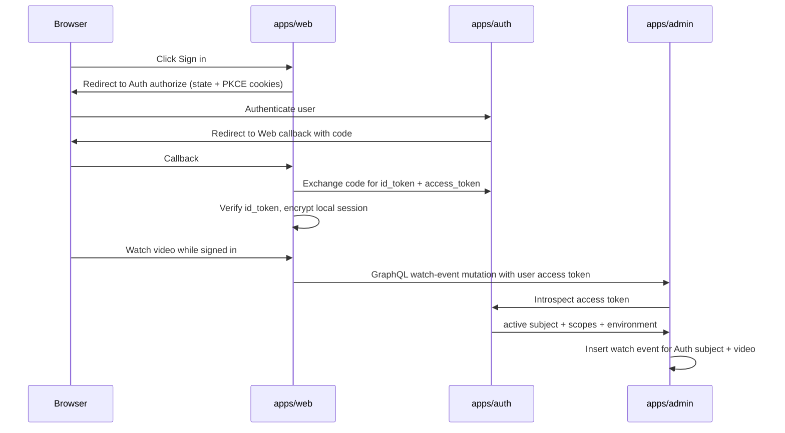
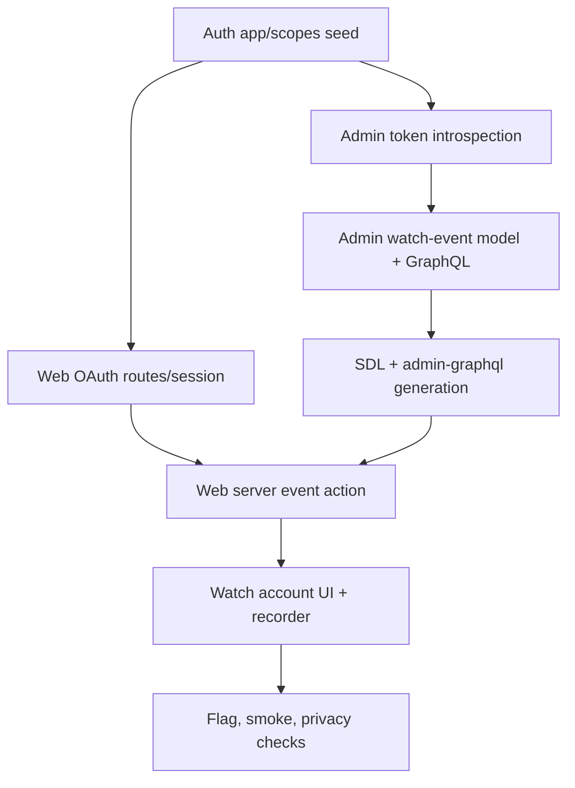

# Web Auth Sign-In and Watch Events

## Overview

Add optional public Web sign-in through Jesus Film Auth and use it to attach
meaningful viewing activity to canonical Admin video records. The public watch
experience remains anonymous-first. Signed-in state adds identity continuity,
account affordances, and server-side watch-event collection without gating
normal watch, search, browse, or share flows (see origin:
`docs/brainstorms/2026-07-02-web-auth-watch-history-requirements.md`).

This is a multi-service feature:

| Surface                  | Responsibility                                                                                                              |
| ------------------------ | --------------------------------------------------------------------------------------------------------------------------- |
| `apps/auth`              | Register Web as a first-party OAuth client and issue user-delegated tokens for `web:watch-events:write`.                    |
| `apps/web`               | Initiate OAuth, hold Web-local encrypted session state, expose account/sign-out UI, and capture meaningful playback events. |
| `apps/admin`             | Validate user-delegated Auth tokens, own durable watch-event persistence, and expose the typed contract Web consumes.       |
| `packages/admin-graphql` | Regenerate the gql.tada contract after Admin schema changes.                                                                |

## Problem Frame

`apps/web` already uses `auth.jesusfilm.org` for the completed download gate,
but that path is narrow: Web forwards Better Auth cookies back to Auth to check
download eligibility. This work should replace that narrow API-session check
with the new Web-local Auth session as the primary download-gate state. The
public Web app does not yet have a general signed-in state, account affordance,
or durable user-linked viewing data. The new feature should follow Admin's
no-shared-cookie Auth posture while recognizing that this is no longer
display-only authentication: watch events are user data, so the authenticated
subject must be revocable/introspectable before Admin persists data for it.

## Requirements Trace

- R1-R3. Optional Web sign-in uses Jesus Film Auth as identity authority and a
  Web-local relying-client session, conceptually mirroring Admin's redirect +
  PKCE + callback shape.
- R4-R6. Anonymous use remains first-class; signed-out users get a non-blocking
  sign-in affordance and signed-in users get account/sign-out affordances.
- R7-R13. Watch-event collection is the v1 signed-in capability, recorded only
  after meaningful playback, tied to canonical videos, and useful for future
  personalization/analytics without exposing a v1 history UI.
- R14-R17. Watch events are private user data; do not expose them in public
  output, logs, or persisted token material.
- R18-R20. Existing download-gate behavior migrates to the new Web-local Auth
  session while proxy protections remain intact.

## Scope Boundaries

- Do not require sign-in for normal public Web browsing, search, playback, or
  sharing.
- Do not build saved videos, playlists, recommendations, account profiles,
  notifications, parental controls, visible watch history, or broad preferences.
- Do not add Admin, Manager, editorial, partner, or staff authorization to
  public Web.
- Do not rely on shared `.jesusfilm.org` cookies for Web's general session.
- Do not import Auth internals into `apps/web` or Web internals into
  `apps/auth`.
- Do not expose user-specific watch events in static metadata, SEO output,
  anonymous page payloads, or public cacheable responses.

### Deferred to Separate Tasks

- Saved videos, visible watch history, and recommendations: future
  personalization features after the identity/event-storage boundary is proven.
- Full public account profile/preferences: future account product work.
- Anonymous event buffering/linking: valuable follow-up, but explicitly out of
  the first implementation unless separately approved.

## Context & Research

### Relevant Code and Patterns

- `apps/admin/src/app/api/auth/login/route.ts`,
  `apps/admin/src/app/api/auth/callback/route.ts`,
  `apps/admin/src/auth/oauth-client.ts`, and
  `apps/admin/src/auth/auth-session.ts` provide the proven Auth relying-client
  flow shape: authorization code + PKCE, state cookie, callback verification,
  and app-local session cookie.
- `docs/plans/2026-06-30-002-feat-chat-auth-plan.md` contains important
  cautions for public-ish Auth clients: verify `id_token` only for identity,
  do not fall back to opaque access tokens, derive/allowlist signing algorithms,
  and keep anonymous use valid. It also explicitly notes that durable per-user
  state requires revocation or introspection before trusting the subject.
- `apps/auth/src/domain/apps.ts` and
  `apps/auth/src/scripts/seed-first-party-apps.ts` seed first-party OAuth
  clients, exact redirect URIs, environment metadata, scopes, and service
  clients. Web should be added here rather than configured ad hoc.
- `apps/auth/src/domain/scopes.ts` is the Auth scope registry. Web event writes
  need an explicit scope so the grant is visible and auditable.
- `apps/auth/src/auth/config.ts` emits first-party user claims into ID tokens,
  supports OAuth provider behavior, and exposes the `/api/auth/oauth2/introspect`
  path through Better Auth.
- `apps/admin/src/auth/manager-service-token.ts` is the closest local pattern
  for resource-side Auth token introspection: call Auth introspection with a
  confidential client, check `active`, issuer, audience, client id, environment,
  scope, and expiry.
- `apps/admin/src/graphql/context.ts`, `principal.ts`, and `permissions.ts`
  define request-bound principals and permission matrices. Add a narrow
  `WEB_USER` principal rather than widening `CONSUMER_BEARER`.
- `apps/admin/src/graphql/public-resolvers.regression.test.ts` and
  `classification.test.ts` enforce GraphQL auth posture and type
  classification; new user-event types must be explicitly classified and should
  not accidentally become public.
- `apps/web/src/lib/admin-client.ts` keeps Admin GraphQL bearer access
  server-only. User-event calls need their own server-only client path because
  they carry a user-delegated token, not the public consumer bearer.
- `apps/web/src/components/watch/WatchPageClient.tsx`,
  `apps/web/src/components/watch/HeroPlayer.tsx`, and existing watch tests are
  the capture points for playback state, resume params, and modal interactions.
- `docs/roadmap/content-discovery/feat-090-watch-event-collection.md` is an
  older, not-started anonymous/session-based watch-event collection ticket for
  personalization. This plan should be reconciled with that work before
  implementation so the system does not create competing event streams. The
  signed-in path here should either reuse the eventual shared event model or
  become the authenticated extension of it.

### Institutional Learnings

- `docs/solutions/auth/admin-sso-uses-oauth-local-session-not-shared-cookies.md`:
  do not widen Auth cookies; first-party apps should be OAuth relying clients
  with host-local session state.
- `docs/solutions/auth/better-auth-secret-must-not-fallback-to-hardcoded-value.md`:
  auth-critical secrets in Next apps must not have hardcoded runtime fallbacks;
  use optional build-time env plus fail-closed runtime guards.
- `docs/solutions/architecture-patterns/consumer-bearer-rate-limit-identity-pattern-20260513.md`:
  `CONSUMER_BEARER` is intentionally permissionless. Do not grant it watch
  event access; create a distinct user principal/token path.
- `docs/solutions/best-practices/nextjs-cross-suspense-action-queue-with-url-params-20260421.md`:
  client-side URL cleanup and cross-boundary action signals should use
  `history.replaceState` when avoiding RSC re-navigation matters.
- `docs/solutions/design-patterns/watch-chapter-optimistic-navigation-feedback.md`:
  watch UI changes should preserve canonical route helpers and normal browser
  link behavior.

### External References

- OpenID Connect Core 1.0 ID Token validation guidance:
  `https://openid.net/specs/openid-connect-core-1_0.html`
- OAuth 2.0 Token Introspection, RFC 7662:
  `https://datatracker.ietf.org/doc/html/rfc7662`

## Key Technical Decisions

- **Admin owns durable watch events.** Auth owns identity/grants; Web has no
  database and already reads public content through Admin. Admin is the right
  owner for content-adjacent viewing events keyed by Auth subject and canonical
  video records.
- **Use user-delegated Auth tokens for event writes, not Web-asserted identity
  headers.** Web may initiate the flow and hold the local session, but Admin
  should only persist watch events after it validates an active Auth-issued
  token.
- **Add a `WEB_USER` principal in Admin.** Do not widen `CONSUMER_BEARER`.
  `WEB_USER` represents a human Auth subject from a validated Web token and
  should satisfy only watch-event write permissions.
- **Use explicit Web token semantics for event writes.** Auth should issue Web
  user access tokens with `web:watch-events:write` and environment metadata.
  Admin should reject event tokens that do not come from an expected Web client
  or lack the expected scope.
- **Use GraphQL for the Admin-Web contract.** Web's app guidance says Web reads
  from Admin through `@forge/admin-graphql`. Adding a watch-event mutation to
  Admin GraphQL keeps the contract typed and generated, while Web calls it only
  from server routes/actions that can attach the user token.
- **Store user tokens only in encrypted, HttpOnly Web session state.** A signed
  JWT cookie is not enough for an access token because the browser holder can
  still inspect its value. The Web session should be authenticated and
  encrypted, host-only, `SameSite=Lax`, and Secure in production.
- **Meaningful playback threshold starts at 30 seconds or 10% watched,
  whichever comes first after intentional playback starts.** This is a planning
  default to avoid page-load event spam while counting short clips.
- **No visible watch-history UI in v1.** Put sign-in/account affordance in the
  existing watch chrome/header area and provide sign-out. Do not expose a
  history page, recently watched list, or history menu entry in this slice.

## Open Questions

### Resolved During Planning

- **Which service owns durable watch events?** Admin owns them, because the
  data is content-adjacent and should be tied to canonical Admin video records.
  Auth remains identity/grant authority.
- **How does Admin trust the user subject?** Admin introspects the
  user-delegated Auth access token and mints `WEB_USER` only for active,
  environment-correct, scope-correct tokens.
- **What counts as meaningful viewing?** Use a threshold of 30 seconds or 10% of
  duration after intentional playback starts. Implementation may tune exact
  debounce/write cadence, but should not record events on page load.
- **Where does the UI live?** Use the current watch experience chrome/account
  area for sign-in/sign-out only; no broad homepage redesign and no v1 history
  surface.

### Deferred to Implementation

- **Exact schema/index names:** final Prisma model, GraphQL type, and migration
  names should follow local naming conventions when implemented.
- **Exact write cadence:** implementation should choose a bounded client flush
  cadence after testing `HeroPlayer` event behavior; the plan defines the
  threshold and privacy boundary, not the timer internals.
- **Final copy:** short account/sign-in copy can be finalized during UI
  implementation, but it must not imply a visible watch-history feature exists
  in v1.

## High-Level Technical Design

> _This illustrates the intended approach and is directional guidance for
> review, not implementation specification. The implementing agent should treat
> it as context, not code to reproduce._

## Implementation Units

- [ ] **Unit 1: Auth Web Client and Watch-Event Scope**

**Goal:** Register Web as a first-party Auth app for local, preview, staging,
and production, with an explicit watch-event write scope and token audience
metadata.

**Requirements:** R1-R3, R10, R14-R17

**Dependencies:** None

**Files:**

- Modify: `apps/auth/src/domain/scopes.ts`
- Modify: `apps/auth/src/domain/apps.ts`
- Modify: `apps/auth/src/domain/apps.test.ts`
- Modify: `apps/auth/src/scripts/seed-first-party-apps.ts`
- Modify: `apps/auth/src/scripts/seed-first-party-apps.test.ts`
- Modify: `apps/auth/.env.example`
- Test: `apps/auth/src/domain/apps.test.ts`
- Test: `apps/auth/src/scripts/seed-first-party-apps.test.ts`

**Approach:**

- Add first-party Web app seeds with environment-specific client IDs,
  exact-match callback URLs under the Web host, post-logout redirects, allowed
  origins, and default scopes.
- Add an explicit Auth scope named `web:watch-events:write` so the grant is
  operator-visible and auditable.
- Include environment metadata that lets Admin verify Web-issued user-delegated
  access tokens for the watch-event resource, and keep the expected Web client
  allowlist configurable in Admin.
- If Auth's current seed shape cannot represent the needed audience/client
  metadata cleanly, generalize the seed type rather than special-casing Web.

**Patterns to follow:**

- `ADMIN_APP_SEED`, `MANAGER_APP_SEED`, and `MASTRA_STUDIO_APP_SEED` in
  `apps/auth/src/domain/apps.ts`
- Manager service client seeding in `apps/auth/src/scripts/seed-first-party-apps.ts`

**Test scenarios:**

- Happy path: Web local/staging/production clients are present with exact
  callback URLs and `web:watch-events:write`.
- Edge case: unknown scope in Web defaults fails through `assertKnownScopes`.
- Error path: production Web environment without approved/valid redirect
  metadata is rejected by app policy tests.
- Integration: seeding creates Web OAuth clients with metadata needed for token
  audience/environment checks and does not disturb existing Admin/Manager seeds.

**Verification:**

- Auth app registry tests prove Web clients and scopes are registered
  deterministically.

- [ ] **Unit 2: Web OAuth Client and Encrypted Local Session**

**Goal:** Add optional Web sign-in/sign-out with Auth authorization code + PKCE,
ID-token verification, and encrypted Web-local session state containing only
server-needed identity/session material.

**Requirements:** R1-R6, R14-R17, R19

**Dependencies:** Unit 1

**Files:**

- Create: `apps/web/src/auth/oauth-client.ts`
- Create: `apps/web/src/auth/oauth-state.ts`
- Create: `apps/web/src/auth/web-session.ts`
- Create: `apps/web/src/app/api/auth/login/route.ts`
- Create: `apps/web/src/app/api/auth/callback/route.ts`
- Create: `apps/web/src/app/api/auth/logout/route.ts`
- Modify: `apps/web/src/env.ts`
- Modify: `apps/web/.env.example`
- Modify: `apps/web/package.json`
- Test: `apps/web/src/auth/oauth-client.test.ts`
- Test: `apps/web/src/auth/web-session.test.ts`
- Test: `apps/web/src/app/api/auth/login/route.test.ts`
- Test: `apps/web/src/app/api/auth/callback/route.test.ts`
- Test: `apps/web/src/app/api/auth/logout/route.test.ts`
- Test: `apps/web/src/env.test.ts`

**Approach:**

- Adapt Admin's flow shape: login route sets short-lived state, PKCE verifier,
  and return-target cookies; callback exchanges the code; Web verifies the
  `id_token` against Auth JWKS, issuer, audience, expiry, and allowed signing
  algorithms.
- Do not accept an opaque access token as identity. Keep the access token only
  as server-side session material for Admin watch-event calls.
- Store session material in an authenticated encrypted HttpOnly cookie. The
  cookie should be host-only, `SameSite=Lax`, Secure in production, short-lived,
  and fail closed to anonymous when missing, expired, malformed, or when the
  signing/encryption secret is unavailable.
- Add optional env vars so Web boots anonymous-only when Auth is not configured,
  but fail closed on auth-path use if required secrets are absent.
- Preserve the existing download-gate verifier only as a temporary bridge until
  Unit 6 migrates download access to the new Web-local Auth session.

**Execution note:** Implement auth verification test-first. The riskiest
regressions are accepting the wrong token as identity or accepting tampered
session cookies.

**Patterns to follow:**

- `apps/admin/src/auth/oauth-client.ts`
- `apps/admin/src/auth/oauth-state.ts`
- `apps/admin/src/auth/auth-session.ts`
- `docs/plans/2026-06-30-002-feat-chat-auth-plan.md`

**Test scenarios:**

- Happy path: login route redirects to Auth authorize URL with state, PKCE, and
  sanitized return target.
- Happy path: callback with valid state/code/token creates encrypted session and
  redirects to the return target.
- Edge case: absent Auth env hides or disables sign-in rather than dead-ending.
- Error path: callback rejects missing code, mismatched state, missing
  verifier, absent `id_token`, wrong issuer, wrong audience, expired token, and
  non-allowlisted signing algorithm.
- Error path: malformed, tampered, plaintext, or expired session cookie reads as
  anonymous.
- Security: raw access token and ID token are never returned in JSON responses
  or logged by callback error handling.
- Integration: logout clears Web session and returns the user to a safe Web
  location without clearing Auth-domain cookies.

**Verification:**

- Web can establish and clear a local session in tests without making anonymous
  browsing fail when env is absent.

- [ ] **Unit 3: Admin Web User Principal and Token Introspection**

**Goal:** Teach Admin to authenticate user-delegated Web Auth tokens and mint a
narrow `WEB_USER` principal for watch-event operations only.

**Requirements:** R2-R3, R14-R17, R18-R20

**Dependencies:** Unit 1

**Files:**

- Create: `apps/admin/src/auth/web-user-token.ts`
- Modify: `apps/admin/src/auth/principal.ts`
- Modify: `apps/admin/src/auth/permissions.ts`
- Modify: `apps/admin/src/graphql/context.ts`
- Modify: `apps/admin/src/graphql/context.test.ts`
- Modify: `apps/admin/src/auth/permissions.test.ts`
- Modify: `apps/admin/src/config/env.ts`
- Modify: `apps/admin/.env.example`
- Test: `apps/admin/src/auth/web-user-token.test.ts`
- Test: `apps/admin/src/graphql/context.test.ts`
- Test: `apps/admin/src/auth/permissions.test.ts`

**Approach:**

- Add a `WEB_USER` principal carrying the Auth subject and any safe
  non-sensitive metadata needed for rate-limit bucketing or service ABAC.
- Add Admin env for the Auth introspection client credentials, expected Web
  client IDs, expected event audience, and expected environment.
- Reuse the Manager service-token introspection posture: bounded timeout,
  fail-closed on network or non-OK responses, check active status, issuer,
  audience, client id, environment claim, expiry, and required event scope.
- Add a `write:watch-events` permission key granted only to `WEB_USER` and
  Admin override where appropriate. Keep `CONSUMER_BEARER` empty.
- Insert `WEB_USER` token resolution into `createContext` without weakening
  existing precedence. Session/admin principals should still win over bearer
  headers, and existing workflow/manager/video-mapper/consumer behavior should
  remain unchanged.

**Patterns to follow:**

- `apps/admin/src/auth/manager-service-token.ts`
- `apps/admin/src/graphql/context.ts`
- `docs/solutions/architecture-patterns/consumer-bearer-rate-limit-identity-pattern-20260513.md`

**Test scenarios:**

- Happy path: active Web access token with correct issuer, audience, client id,
  environment, expiry, and scope mints `WEB_USER`.
- Edge case: a valid Admin session still wins over a Web user token.
- Error path: inactive, expired, wrong issuer, wrong audience, wrong client,
  wrong environment, missing scope, malformed response, timeout, and failed
  introspection all produce no `WEB_USER`.
- Security: `CONSUMER_BEARER` still satisfies no permission keys, including the
  new watch-event key.
- Integration: context resolution order remains stable for existing
  workflow/manager/video-mapper/consumer bearer tests.

**Verification:**

- Admin can distinguish Web user tokens from service bearers and refuses to
  persist watch events without a validated Auth subject.

- [ ] **Unit 4: Admin Watch-Event Data Model and GraphQL Contract**

**Goal:** Add durable, private watch-event storage and a typed GraphQL mutation
for writing meaningful viewing events.

**Requirements:** R7-R17, R20

**Dependencies:** Unit 3

**Files:**

- Modify: `apps/admin/prisma/schema.prisma`
- Create: `apps/admin/prisma/migrations/<timestamp>_watch_events/migration.sql`
- Create: `apps/admin/src/services/watch-events.service.ts`
- Create: `apps/admin/src/graphql/types/watch-events.ts`
- Modify: `apps/admin/src/graphql/schema.ts`
- Modify: `apps/admin/src/graphql/classification.test.ts`
- Modify: `apps/admin/src/graphql/schema.test.ts`
- Modify: `apps/admin/src/graphql/public-resolvers.regression.test.ts`
- Test: `apps/admin/src/services/watch-events.service.test.ts`
- Test: `apps/admin/src/graphql/types/watch-events.test.ts`

**Approach:**

- Store append-friendly events keyed by Auth subject plus canonical
  video/language/variant context. Keep PII out of the row where possible; the
  subject and canonical video references are enough for this slice.
- Include sequence-friendly data: event type, occurred-at timestamp,
  playback-position seconds when available, optional duration/progress metadata,
  and request/session correlation identifiers that are safe to persist.
- Join to existing Admin video models by ID for validation. Do not duplicate
  full public video payloads into event rows.
- Add a GraphQL mutation behind `write:watch-events`, with service-layer checks
  using the `WEB_USER` subject from context.
- Classify new event types as ABAC-gated/private. They must not appear in the
  public resolver manifest and must not expose raw tokens, emails, or Auth
  claims.

**Execution note:** Add service tests before wiring GraphQL. The core privacy
and ownership behavior is easier to pin at the service boundary.

**Patterns to follow:**

- Service-owned mutations in `apps/admin/src/services/*`
- Pothos resolver patterns in `apps/admin/src/graphql/types/managerJob.ts`
- Classification guards in `apps/admin/src/graphql/classification.test.ts`

**Test scenarios:**

- Happy path: `WEB_USER` writes a watch event after meaningful playback with
  Auth subject, canonical video ID, language/variant context, event type,
  occurred-at time, and playback position when available.
- Happy path: repeated meaningful playback creates bounded, sequence-friendly
  events rather than overwriting the only record of the user's path.
- Edge case: noisy progress pings are rejected or coalesced according to the
  chosen write cadence.
- Edge case: deleted/unpublished/unavailable videos do not leak private or draft
  data through the event mutation response.
- Error path: anonymous, `CONSUMER_BEARER`, and unrelated service principals
  cannot write watch events.
- Integration: generated SDL contains the expected event mutation but the
  public-resolver regression test does not classify it as public.

**Verification:**

- Admin owns a private, user-scoped event contract that is impossible to call
  anonymously or through the existing consumer bearer.

- [ ] **Unit 5: Regenerate Admin GraphQL Consumer Contract**

**Goal:** Propagate the new Admin GraphQL watch-event contract to the generated
consumer package so Web can call it with typed operations.

**Requirements:** R10-R13, R18-R20

**Dependencies:** Unit 4

**Files:**

- Modify: `apps/admin/schema.graphql`
- Modify: `packages/admin-graphql/src/admin-graphql-env.d.ts`
- Test: `packages/admin-graphql/src/admin-graphql-env.d.ts`

**Approach:**

- Regenerate Admin SDL after adding Pothos types.
- Regenerate `packages/admin-graphql` gql.tada introspection.
- Do not hand-edit generated outputs.

**Patterns to follow:**

- `apps/admin/AGENTS.md` SDL emission instructions
- `packages/admin-graphql/CLAUDE.md`

**Test scenarios:**

- Test expectation: none -- generated artifact update only. Drift checks and
  downstream typed Web operations in Unit 6 prove the contract is usable.

**Verification:**

- The generated GraphQL artifacts reflect the new event contract and remain
  parseable by gql.tada.

- [ ] **Unit 6: Web Watch-Event Server Action and Session-Aware Admin Client**

**Goal:** Add Web server-only helpers/actions for writing watch events through
Admin GraphQL with the validated user token from the encrypted Web session.

**Requirements:** R7-R17, R18-R20

**Dependencies:** Units 2, 4, 5

**Files:**

- Create: `apps/web/src/lib/watch-events.ts`
- Create: `apps/web/src/lib/watch-event-actions.ts`
- Modify: `apps/web/src/lib/admin-client.ts` or create a dedicated
  user-token Admin GraphQL client helper near it
- Modify: `apps/web/src/app/api/auth/session/route.ts`
- Modify: `apps/web/src/components/watch/download-session-access.ts`
- Modify: `apps/web/src/components/watch/download-session-client.ts`
- Test: `apps/web/src/lib/watch-events.test.ts`
- Test: `apps/web/src/lib/watch-event-actions.test.ts`
- Test: `apps/web/src/app/api/auth/session/route.test.ts`
- Test: `apps/web/src/components/watch/__tests__/WatchPageClient.download.test.tsx`
- Test: `apps/web/src/components/watch/__tests__/DownloadModal.test.tsx`

**Approach:**

- Keep user-token Admin calls server-only. Browser components call server
  actions or same-origin Web routes; they never receive the raw Auth access
  token.
- Add a dedicated Admin GraphQL client path that attaches the user's Auth access
  token as `Authorization` only for watch-event operations. Keep the existing
  consumer-bearer client for public content reads.
- Fail closed to no-op event writes when the Web session is missing, expired,
  invalid, or when Admin rejects token introspection.
- Migrate the existing download-gate session check to read the new Web-local
  Auth session as the primary authenticated state. A user who completed the new
  Web sign-in must be allowed through gated downloads without a second sign-in
  loop.
- Retire the direct Better Auth cookie verifier where possible. If rollout
  needs a temporary fallback, keep it explicitly compatibility-only, behind
  tests, and remove/deprecate it once the Web-local session path is proven.

**Patterns to follow:**

- `apps/web/src/lib/admin-client.ts`
- `apps/web/src/lib/search-actions.ts`
- `apps/web/src/components/watch/download-session-access.ts`

**Test scenarios:**

- Happy path: signed-in Web session writes watch events via Admin GraphQL
  without exposing tokens to the returned payload.
- Edge case: absent or invalid session treats the event write as a no-op and
  leaves playback uninterrupted.
- Error path: Admin 401/403/introspection failure clears or ignores stale
  session state without logging token material.
- Integration: the download modal allows a newly Web-signed-in user through the
  download-account gate using the new Web-local session and still
  redirects/prompts when no valid Web-local session exists.

**Verification:**

- Web server-only event calls use typed Admin operations and preserve
  anonymous-first behavior on failure.

- [ ] **Unit 7: Watch Playback Capture and Account UI**

**Goal:** Add the visible signed-in account affordance and meaningful playback
capture from the watch player, without exposing a watch-history UI.

**Requirements:** R4-R13, R15-R16

**Dependencies:** Units 2 and 6

**Files:**

- Create: `apps/web/src/components/watch/WatchAccountMenu.tsx`
- Create: `apps/web/src/components/watch/WatchEventRecorder.tsx`
- Modify: `apps/web/src/components/watch/WatchPageClient.tsx`
- Modify: `apps/web/src/components/watch/HeroPlayer.tsx`
- Modify: `apps/web/messages/en.json` and generated/translated message handling
  as appropriate for new UI strings
- Test: `apps/web/src/components/watch/__tests__/WatchAccountMenu.test.tsx`
- Test: `apps/web/src/components/watch/__tests__/WatchEventRecorder.test.tsx`
- Test: `apps/web/src/components/watch/__tests__/HeroPlayer.test.tsx`
- Test: `apps/web/src/components/watch/__tests__/WatchPageClient.download.test.tsx`

**Approach:**

- Show a non-blocking sign-in affordance when no Web session exists and an
  account menu with sign-out when signed in. Do not add a history entry.
- Capture meaningful playback only after intentional playback begins and the
  threshold is crossed. Avoid recording during muted poster previews, page
  loads, failed autoplay attempts, or quick accidental visits.
- Debounce/bound event writes. Use last-known position and flush on threshold,
  periodic progress, pause, route change, and visibility changes where reliable.
- Preserve existing `?t=` resume behavior. Do not mutate public watch URLs into
  account-specific URLs.

**Execution note:** Characterize existing `HeroPlayer` resume/autoplay behavior
before adding recorder side effects so event writes do not regress playback.

**Patterns to follow:**

- `apps/web/src/components/watch/DownloadModal.tsx` for account-gate error and
  client/server coordination
- `apps/web/src/components/watch/SiblingCarousel.tsx` and
  `docs/solutions/design-patterns/watch-chapter-optimistic-navigation-feedback.md`
  for preserving watch-route link behavior
- `apps/web/src/components/watch/HeroPlayer.tsx` existing `?t=` resume handling

**Test scenarios:**

- Happy path: signed-out user sees sign-in affordance and can watch normally.
- Happy path: signed-in user sees account menu and sign-out.
- Happy path: signed-in user watches past 30 seconds/10% and an event write is
  scheduled with video, language, variant, timestamp, and resume position.
- Edge case: muted preview/autoplay-blocked state does not write events until
  user commits playback.
- Edge case: very short clips can count via 10% watched without waiting 30
  seconds.
- Edge case: near-complete playback does not resume at the final seconds.
- Error path: failed event write does not interrupt playback or show raw
  technical errors.
- Integration: no visible watch-history route, menu entry, or recently watched
  surface is introduced in v1.

**Verification:**

- Signed-in watch events are captured while anonymous playback and current
  watch route behavior remain unchanged.

- [ ] **Unit 8: Rollout, Observability, and Privacy Hardening**

**Goal:** Add rollout controls, privacy checks, and browser smoke coverage for
the multi-service behavior.

**Requirements:** R14-R20 and all success criteria

**Dependencies:** Units 1-7

**Files:**

- Modify: `packages/feature-flags/src/registry.ts`
- Modify: `apps/web/src/lib/feature-flags.ts`
- Modify: `apps/web/.env.example`
- Modify: `apps/admin/.env.example`
- Modify: `apps/auth/.env.example`
- Modify: `docs/roadmap/platform/feat-229-web-auth-watch-history.md`
- Test: `apps/web/src/lib/feature-flags.test.ts`
- Test: browser smoke or Playwright coverage under `apps/web` test structure
  chosen during implementation

**Approach:**

- Gate the visible account affordance and event recorder behind a server-side
  LaunchDarkly flag with local fallback defaulting off, while keeping low-level
  auth routes safe when directly visited.
- Add structured non-PII outcome logs for callback success/failure,
  watch-event write accepted/rejected, and Admin introspection rejection
  classes. Do not log subject, email, token, raw path with sensitive query, or
  event detail.
- Add browser smoke or integration proof for signed-out watch, sign-in return,
  durable event persistence, absence of visible watch-history UI, and
  download-gate regression.
- Update the roadmap ticket with implementation notes when complete.

**Patterns to follow:**

- `apps/web/src/app/api/download/route.ts` requires a signed-in Web session for
  download `GET` requests before resolving or fetching upstream media.
- Existing Web browser-smoke artifacts referenced from completed watch tickets

**Test scenarios:**

- Happy path: flag off hides account UI and recorder while anonymous
  watch still works.
- Happy path: flag on exposes account UI and event recorder when Auth env is
  configured.
- Error path: missing Auth env under flag on fails closed with no dead-end
  browser login URL.
- Security: logs for callback/event failures contain reason codes but no raw
  token, email, subject, or event payload.
- Integration: browser smoke verifies signed-in event persistence and
  Web-local-session-backed download access in one user-like flow.

**Verification:**

- The feature can roll out gradually, fail closed, and be smoke-tested without
  exposing private watch events or token material.

## System-Wide Impact

- **Interaction graph:** Browser, Web routes/actions, Auth OAuth/token
  endpoints, Admin GraphQL, Admin Prisma, and LaunchDarkly all participate.
- **Error propagation:** Auth or Admin auth failures should degrade Web to
  anonymous/no-op event writes, not block public playback.
- **State lifecycle risks:** Duplicate writes, stale encrypted sessions, revoked
  Auth sessions, and near-complete resume positions need explicit handling.
- **API surface parity:** Admin schema changes require `apps/admin/schema.graphql`
  and `packages/admin-graphql/src/admin-graphql-env.d.ts` regeneration in the
  same PR.
- **Integration coverage:** Unit tests alone will not prove the redirect,
  playback capture, and persistence loop; browser smoke or integration coverage
  is required.
- **Unchanged invariants:** Public watch content remains cacheable/anonymous;
  `CONSUMER_BEARER` remains permissionless; download proxy SSRF/range/filename
  protections remain unchanged.

## Risks & Dependencies

| Risk                                                          | Mitigation                                                                                                                                                      |
| ------------------------------------------------------------- | --------------------------------------------------------------------------------------------------------------------------------------------------------------- |
| Web stores a raw access token in an inspectable signed cookie | Use encrypted authenticated HttpOnly session state; never return token material to client JS.                                                                   |
| Admin trusts Web-supplied subject instead of Auth             | Mint `WEB_USER` only after Admin-side token introspection succeeds.                                                                                             |
| Existing consumer bearer gains real permissions               | Add distinct `WEB_USER`; keep `CONSUMER_BEARER_PERMISSIONS` empty and tested.                                                                                   |
| Event writes make public watch routes dynamic                 | Keep recorder/client actions separate from static route data; do not call `cookies()` from cacheable RSC watch trees unless the route is intentionally dynamic. |
| Login dead-ends when Auth registration/env is missing         | Auth UI hidden/default-off unless configured; routes fail closed with safe redirects/errors.                                                                    |
| User watch events leak through logs or public metadata        | Log reason codes only; keep event writes behind authenticated GraphQL; add tests for response shape and cache behavior.                                         |
| Cross-service rollout ordering breaks sign-in                 | Seed/register Auth clients before enabling Web flag in each environment.                                                                                        |

## Documentation / Operational Notes

- Update `.env.example` files for Auth/Web/Admin with non-secret placeholders
  and comments explaining which service owns each secret.
- Document rollout ordering in the roadmap ticket completion notes: Auth seed
  first, Admin deploy second, Web UI flag last.
- Production must provision per-environment Web OAuth clients, Web session
  encryption secret, Admin introspection credentials, and LaunchDarkly flag
  defaults before enabling the visible account surface and recorder.
- Browser smoke should capture proof for signed-out watch, signed-in account
  affordance, durable event persistence, absence of visible watch-history UI,
  and Web-local-session-backed download-gate behavior.

## Sources & References

- **Origin document:** `docs/brainstorms/2026-07-02-web-auth-watch-history-requirements.md`
- **Roadmap ticket:** `docs/roadmap/platform/feat-229-web-auth-watch-history.md`
- **Existing Web download gate:** `docs/roadmap/platform/feat-146-web-user-accounts-download-gate.md`
- **Admin OAuth pattern:** `apps/admin/src/app/api/auth/login/route.ts`,
  `apps/admin/src/app/api/auth/callback/route.ts`,
  `apps/admin/src/auth/oauth-client.ts`,
  `apps/admin/src/auth/auth-session.ts`
- **Chat auth plan:** `docs/plans/2026-06-30-002-feat-chat-auth-plan.md`
- **Auth registry:** `apps/auth/src/domain/apps.ts`,
  `apps/auth/src/domain/scopes.ts`,
  `apps/auth/src/scripts/seed-first-party-apps.ts`
- **Admin introspection pattern:** `apps/admin/src/auth/manager-service-token.ts`
- **OIDC Core:** `https://openid.net/specs/openid-connect-core-1_0.html`
- **OAuth Token Introspection:** `https://datatracker.ietf.org/doc/html/rfc7662`
