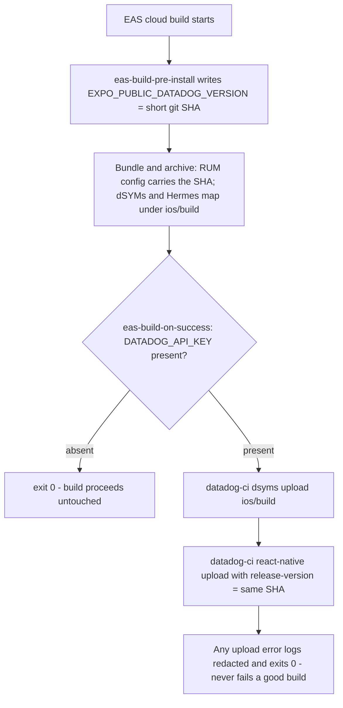

# TV Datadog Observability Completion - Plan

## Goal Capsule

- **Objective:** Finish the TV app's Datadog observability rollout, bring its data coverage to parity with apps/web where tvOS allows, and add the TV-native telemetry web has no counterpart for: complete feat-225's tail honestly, deliver feat-227's symbol upload + patch guard, deliver feat-228's agent tooling + Hermes profiler, true up the roadmap, mirror web's non-sensitive signals (action naming, the idle Logs pipe, search analytics), and diverge from web where TV's product is different (video playback QoE; optional focus-navigation health).
- **Authority:** This plan > `docs/roadmap/platform/feat-225-tv-datadog-production-activation.md` + `feat-227-tv-datadog-build-pipeline-hardening.md` + `feat-228-tv-perf-tooling-mcp-and-profiler.md` > repo conventions (`apps/tv/CLAUDE.md`). Divergences from ticket wording, the data-parity scope (R17–R21), and the TV-native divergence scope (R22–R26) are user-confirmed on 2026-07-03.
- **Stop conditions:** Never let the upload hook fail a build. Never bump `@datadog/mobile-react-native` (patch coupling). If the profiler does not compile for tvOS, document and fall back per U6. Never add Session Replay or user-identity/PII to TV — the two sensitive signals that are hard stop conditions (KTD-11); the full set of three deliberately-unmatched web signals is documented in R20. Telemetry (parity or QoE) must never throw into playback or navigation — every emit routes through `safeDatadogCall`.
- **Open blockers:** None. The privacy sign-off gate was dropped by user decision (2026-07-03): web already collects more-sensitive data (Session Replay + user email/name) with no recorded sign-off, and TV collects strictly less (no PII, no replay), so TV's telemetry needs no separate product/legal gate. The new behavioral data (content actions, search Logs, playback QoE) ships active on merge; U8 records the data inventory + rationale in the runbook rather than blocking on approval.
- **Execution profile:** Config/CI/ops-heavy work — smoke and real-build verification over unit coverage, except pure helpers (context/QoE-session builders, arg construction) which get colocated jest tests. U4/U6 verify only on a real EAS build; U9/U10/U13 verify in the dev client + Datadog RUM/Logs (U13 on the birth-of-jesus segment per the apps/tv verification convention).

---

## Product Contract

Product Contract preservation: R3/R16 were rewritten during initial enrichment. The 2026-07-03 data-parity revision added R17–R21, U9–U12, KTD-9–14, AE5–AE7; a doc-review pass corrected R17–R19/KTD-9/KTD-10/U9/U10/AE5/AE6; delivery was changed to a single PR. This revision **adds a TV-native divergence track** (R22–R26, U13–U14, KTD-15/16, AE8/AE9) per the user's 2026-07-03 request to instrument what TV has that web doesn't (video QoE; optional focus health). Existing R1–R21, U1–U12, KTD-1–14, AE1–AE7 are unchanged.

### Summary

Finish TV observability end to end, match web's data where tvOS permits, and instrument what makes TV different from web. Production telemetry activated behind a privacy gate; crash reports made readable via a secret-gated symbol upload + a CI patch guard; telemetry made agent-queryable with a Hermes profiler path; the roadmap trued up; web's non-sensitive signals mirrored (clean action naming, the idle Logs pipe, a per-search log + result-click action); and a deliberate divergence for TV's core product — video playback QoE (time-to-first-frame, rebuffering, errors, completion) plus optional focus-navigation health — which web's browsing-shaped telemetry has no counterpart for. Session Replay and user PII stay unmatched by design.

### Problem Frame

The TV app's RUM shipped (#1434) and its instrumentation depth landed (#1449) — route views are live in production. But the 2026-07-03 verification showed feat-225's operational tail never happened despite #1450 marking it complete: no production credentials, no `forge-tv` monitor, all 6 RUM sessions simulator-only, no privacy sign-off. Crash stacks arrive unsymbolicated; the tvOS SDK pnpm patch can silently rot on a version bump; agents can't query TV telemetry without a human; the ~3s series parse has no function-level profile; the roadmap README lists none of feat-225 through 228.

A data-coverage audit surfaced three parity gaps (`trackInteractions` fires title-named actions on D-pad select — the shipped `dd-action-name` P0 fix proves it, so cards need clean names not new actions; the Logs pipe is wired but idle; TV has no search-analytics signal), all closeable while staying replay-free and PII-free.

A separate question is more consequential: **TV is fundamentally a video player, and web's telemetry does not instrument playback.** So the single most valuable TV signal has no parity counterpart. Today the fullscreen player (`VideoPlayer.tsx`, root-mounted, fresh per session) already listens for `playingChange`, `statusChange`, `playToEnd`, and `timeUpdate`, but emits zero telemetry from them — so time-to-first-frame, rebuffering, playback errors, and completion are invisible in production. These are exactly the field failures that don't reproduce locally (decoder-slot starvation, source-recreation stalls). This plan therefore adds a deliberate divergence: match web where the question is shared (joinable dashboards), diverge where TV's product is different (video QoE), and lean into TV's anonymity (no accounts → no PII) as an advantage rather than a gap.

### Key Decisions

- **Reopen feat-225** — verification showed all four tail items undone; it closes only when R1–R5 hold.
- **Skip upstreaming the tvOS patch** — user decision; the patch stays a local carry protected by the new CI guard.
- **No privacy sign-off gate (user decision, 2026-07-03).** Web collects more-sensitive data (replays + email/name) with no recorded sign-off, and TV is PII-free and replay-free, so production credentials are provisioned without waiting on product/legal; U8 records the data inventory + this rationale in the runbook.
- **Match web's data, not its risk** — mirror web's non-sensitive signals; never add Session Replay or user PII (KTD-11).
- **Diverge for TV-native signals** — video QoE (and optional focus health) are deliberate divergences, not parity gaps: web has nothing to mirror here (KTD-15).
- **Deliver as a single PR** covering all six streams (roadmap truth, build pipeline, agent tooling, production activation, data parity, TV-native telemetry), sequenced internally in the dependency order below. Steps that can't live in a code diff — EAS credential provisioning, hardware smoke, the runbook data inventory, and the U7 Datadog monitor — happen outside the PR and are tracked in the runbook/ticket. If the U6 profiler spike fails, its dependency and patch are removed before merge so no abandoned experiment lands in the diff.

### Requirements

**Production activation (feat-225 tail)**

- R1. The telemetry data inventory (`TrackingConsent.GRANTED` at 100% sampling; sessions, views, resources, errors, native crashes, content-selection actions, search Logs, playback QoE; no PII, no Session Replay) is recorded in the runbook alongside the web-parity rationale. No product/legal sign-off gate applies (user decision 2026-07-03).
- R2. The production EAS environment carries the Datadog client token, application ID, and site; unprovisioned builds keep booting normally.
- R3. Every TV build carries a per-build version label shared by its RUM sessions and its symbol uploads.
- R4. A Datadog monitor alerts on abnormal intake volume for `service:forge-tv`.
- R5. Live RUM sessions are confirmed from both an Android TV device/emulator and a physical Apple TV, with device models distinct from the simulator.
- R6. The feat-225 roadmap ticket reflects reality at every point.

**Build pipeline (feat-227)**

- R7. Successful TV builds upload native crash symbols and RN source maps when the API-key secret is present, and skip silently — build still green — when it is absent.
- R8. Uploads carry the same service and version as the running app.
- R9. CI fails loudly when any pnpm-patched package's installed version no longer matches its patch key.
- R10. The feat-227 ticket records upstreaming as deferred so it can close on R7–R9.

**Agent tooling (feat-228)**

- R11. A fresh agent session can query `forge-tv` telemetry via a registered Datadog MCP and docs alone.
- R12. A documented recipe answers "did TV telemetry arrive in the last N minutes?"
- R13. The Hermes profiler spike either produces a flame graph of a cold series-detail load, or documents the tvOS incompatibility + the simulator-only fallback.
- R14. Profile capture is triggerable with the TV remote in dev builds, with no profiler cost on release runtime paths.

**Roadmap hygiene**

- R15. `docs/roadmap/README.md` is regenerated to include feat-225 through feat-228 with correct statuses.
- R16. Ticket frontmatter encodes only real cross-ticket dependencies.

**Data parity with web**

- R17. The core content cards on home, series, and search carry a stable low-cardinality `dd-action-name` so their already-firing auto tap-actions are clean content-selection signals, not raw titles; no parallel manual action is added.
- R18. Search-result selection emits web's `watch_search.result_clicked` custom RUM action with the achievable bounded subset (position from the list index, id, slug, title cap ≤160ch, type, a client-generated `search_request_id`, language `en`, `result_source: "semantic"` constant). No raw query text, no PII.
- R19. TV's idle Logs pipe emits a per-**search** structured `DdLogs` record mirroring web's canonical `@watch_search.*` shape (outcome, result_count, latency_ms, request_type) — distinct from the result-click action, never double-recorded.
- R20. The docs document the parity outcome: which web signals TV matches, and the three it deliberately does not (Session Replay, server-side APM spans, user-identity/PII).
- R21. (Optional) TV opts into Mobile Vitals (CPU/memory) and an explicit long-task threshold, only if it lands without new native risk.

**TV-native telemetry (diverge from web)**

- R22. TV records per-playback video QoE from the fullscreen player — time-to-first-frame, rebuffering (count + ratio), playback errors, and completion — as a PII-free signal web has no counterpart for. Discrete events + a per-session summary land in `forge-tv` RUM/Logs.
- R23. Rebuffering is measured heuristically from `statusChange` `loading↔readyToPlay` transitions, gated to exclude initial load, in-flight seeks (`seekTargetRef`), and dub-source swaps; the heuristic and expo-video's lack of a true `buffering` status are documented.
- R24. Playback errors capture the available `statusChange.error.message` (unread today), capped and URL/query-stripped before it reaches Error Tracking (the string is native, outside app control); the docs note `PlayerError` exposes only a message, so error categorization is string-based, not a structured HLS/decoder taxonomy.
- R25. (Optional) Current video-track bitrate/resolution (`videoTrack.size.width`/`height`, `videoTrack.bitrate` — note the nested `size` shape) is attached to the QoE summary only when expo-video populates it on the device; when null on tvOS/Android HLS the field is omitted, not sent empty.
- R26. (Optional, focus health) The one genuine JS-observable Home fault signal is recorded — back-navigation focus-restore failures (the discarded `focusMemory.restore()` result). `RailPad` bounces are not recorded: `RailPad` is the overhang catcher and only fires on _successful_ redirects, so it cannot observe a true dead-end. Documented as Home-only, since tvOS/`TVFocusGuideView` expose no generic dead-end hook and Android-TV focus events depend on the react-native-tvos patch.

### Acceptance Examples

- AE1. **Covers R7, R8.** Keyed build → dSYMs tagged with the version; keyless build → green with the step skipped.
- AE2. **Covers R9.** Bumping the SDK on a scratch branch turns CI red; reverting turns it green.
- AE3. **Covers R5.** RUM shows sessions whose device models are a real Apple TV and Android TV, not the simulator.
- AE4. **Covers R11, R12.** A fresh agent answers "forge-tv sessions in the last hour" and "slowest GraphQL operation" via MCP + docs alone.
- AE5. **Covers R17.** Selecting a home/series/search card produces a RUM tap action named by the stable `dd-action-name`, not the title; no second action per select.
- AE6. **Covers R18, R19.** A search emits a per-search `DdLogs` record; a result select emits a `watch_search.result_clicked` action with the bounded subset; neither carries raw query text or PII, and the click is not duplicated into Logs.
- AE7. **Covers R20.** The doc enumerates the three deliberately-unmatched web signals with a reason each.
- AE8. **Covers R22, R23, R24.** Playing the birth-of-jesus segment emits `video_playback` telemetry: a `video_playback.started` log carrying a numeric `ttff_ms` (not a view timing), zero-or-more rebuffer signals during playback (none for the initial load, a seek, or a dub switch), and a `video_playback.summary` on completion or Back-dismiss (watched_ms, duration_ms, rebuffer_count, rebuffer_ratio, content_id = Mux playback id); a playback that errors emits a playback error carrying the capped/stripped SDK message. No field carries a title, query, or PII.
- AE9. **Covers R26.** A failed back-restore on Home re-entry (the `restore()` boolean is `false`) emits a `focus.restore_failed` signal.

### Scope Boundaries

Deferred for later:

- Upstreaming the tvOS patch; fixing the series-detail slowness (the profiler only names it); Android source-map upload verification; CI enforcement of README freshness.
- Naming actions on every D-pad surface — R17 covers the core content cards only, not the shared `FocusableCard` primitive or the SDUI section renderers.
- App-wide focus-navigation instrumentation — R26 covers only the two JS-observable Home hooks; a generic dead-end signal is not exposed by tvOS (see below).

Platform-blocked or not-applicable parity (documented in R20):

- **Session Replay** — unsupported on tvOS; never add.
- **User identity / PII** — TV has no login surface; PII-free by design.
- **Server-side APM spans** — TV is a pure client; the cross-service trace picture is already achieved via `firstPartyHosts` → tracecontext to the admin GraphQL host.

TV-native divergence limits (documented in R23–R26):

- No true `buffering` status in expo-video, so rebuffer accounting is heuristic, not exact.
- `PlayerError` is `{ message }` only — no structured HLS/decoder/manifest taxonomy.
- Bitrate/resolution track data may be null on tvOS/Android HLS — attached only when populated.
- No generic "D-pad press with nowhere to go" callback; focus health is Home-only and best-effort.

Out of scope: bumping the SDK; SessionReplay/WebViewTracking; vendor migration; weakening the null-gate; making symbol upload a mandatory build phase; feature-flag/global-context parity (absent on web too); lowering sampling to web's 50% (KTD-12).

### Dependencies / Assumptions

Verified 2026-07-03 (activation + repo audit): production EAS env has no Datadog vars; preview/development fully provisioned; no `forge-tv` monitor; all 6 sessions simulator-only; no env sets `EXPO_PUBLIC_DATADOG_VERSION` (config consumes it); route views work in prod; no `eas-build-on-success` hook; no patch-pin guard; two patched deps; upload precedent is web's manual `datadog:sourcemaps`; `.mcp.json` has only railway + chrome-devtools; profiler absent.

Verified 2026-07-03 (parity + doc-review): web RUM at 50% sampling, replay at 10% (`mask-user-input`); web attaches `setUser` PII; web emits two distinct search events (per-search log + result-click action); TV `trackInteractions` fires a title-named tap action on D-pad select (repo P0 `dd-action-name` fix proves it); `FocusableCard` already spreads `dd-action-name`, `HomeCard` doesn't; TV `SearchResult` lacks `result_source`/server `request_id`/language (locale hardcoded `en`); mobile SDK 3.5.2 API names — `DdRum.addAction` (needs `RumActionType.CUSTOM`), `DdLogs`, `addAttribute(s)`, `setUserInfo`; Session Replay blocked on tvOS.

Verified 2026-07-03 (playback + focus scout): the watch player is `apps/tv/src/components/VideoPlayer.tsx` — root-mounted via `VideoPlayerOverlay` (`app/_layout.tsx:195`), a fresh `useVideoPlayer` instance per session, source frozen at first value then swapped via `replaceAsync`. It already listens for `playingChange` (sets `hasStarted` on first `isPlaying`), `statusChange` (branches `error`/`loading`/`readyToPlay`; `payload.error.message` available but unread), `playToEnd` (clean completion), and `timeUpdate` (`currentTime`/`bufferedPosition`). `expo-video 3.0.16` status enum is `idle|loading|readyToPlay|error` with **no `buffering`**; the code already separates seek stalls (`seekTargetRef`). `PlayerError = { message }` only. `player.videoTrack`/`videoTrackChange`/`availableVideoTracks` exist but are unused and unverified on TV. Focus: no generic dead-end hook; only `HomeRail.tsx` `RailPad` bounce and the discarded `focusMemory.restore()` boolean (`app/index.tsx:94`) are observable, Home-only; Android-TV `Pressable.onFocus` depends on `patches/react-native-tvos@0.81.5-2.patch`. No Datadog call exists in the player or focus code today; `apps/tv/src/lib/datadog.ts` provides `reportDatadogError`, `datadogLog`, `addDatadogTiming`, all via `safeDatadogCall`.

Open — verified at execution time: `SOURCEMAP_FILE` honoring (U4); profiler tvOS compile (U6); `DD_API_KEY` vs `DATADOG_API_KEY` (U4 sets both); mobile vitals + video-track values on real hardware (U8/U12/U13-R25).

### Outstanding Questions

Resolve before / during planning:

- **Privacy gating (resolved 2026-07-03):** the new behavioral data ships active on merge; no sign-off gate. Rationale: web already collects more-sensitive data (replays + email/name) with no recorded sign-off, and TV is PII-free and replay-free. The runbook records the data inventory (U8).

Deferred to planning: upload mechanism (resolved — KTD-1); MCP location (resolved — KTD-6); R21/U12 and R25/R26/U14 are optional and droppable.

---

## Planning Contract

### Key Technical Decisions

- KTD-1. **Symbol upload runs as `eas-build-on-success`** — the only place the dSYMs exist. A hook failure fails the build, so the script's first act is the key check: absent → `exit 0`; upload errors log-and-exit-0.
- KTD-2. **Per-build version = short git SHA, injected at build time** via `eas-build-pre-install`; the on-success hook passes the same value as `--release-version`.
- KTD-3. **Pin `pnpm dlx @datadog/datadog-ci@5.8.0`** to match web/admin.
- KTD-4. **dSYM upload primary; the Hermes map staged** (`SOURCEMAP_FILE` then a re-export fallback).
- KTD-5. **Patch guard = unconditional CI job** modeled on `format` — root `package.json` isn't a `@forge/*` package.
- KTD-6. **Datadog MCP = hosted OAuth `http` entry**, `toolsets=core,error-tracking&omit_tools=update_datadog_error_tracking_issue,manage_datadog_error_tracking_issue_comments`; verify the write-tool names against the live catalog.
- KTD-7. **Profiler trigger gates on `EXPO_PUBLIC_ENABLE_PROFILER`, Pressable-based.**
- KTD-8. **Intake alert = RUM monitor on `service:forge-tv` event volume.**
- KTD-9. **Content actions already fire; name them, don't add new ones.** `trackInteractions` fires a RUM tap action on D-pad select (repo P0 `dd-action-name` fix proves it). Parity = a stable low-cardinality `dd-action-name` on content cards; a parallel manual `addAction` is rejected (double-count + web-divergent).
- KTD-10. **Web's two search events → two distinct TV events; the click is never duplicated into Logs.** A per-search `DdLogs` record + the result-click `DdRum.addAction`, the click builder using explicit named-key assignment (no spreads) so no stray field leaks; a jest test asserts the key set equals the allowlist even with extra input keys. No raw query, no PII.
- KTD-11. **Parity is non-sensitive only** — never Session Replay, never `setUserInfo` PII.
- KTD-12. **Keep 100% sampling (web is 50%);** cross-app absolute-count comparisons normalize for the difference (see U11).
- KTD-13. **Verified 3.5.2 API names:** `DdRum.addAction` (needs `RumActionType.CUSTOM`), `DdLogs`, `addAttribute(s)`, `setUserInfo`. Not `setUser`/`setAttributes`/`registerRum`.
- KTD-14. **`DATADOG_API_KEY` at EAS `secret` visibility** (write-only); no shell tracing around it; datadog-ci output redacted on the failure log.
- KTD-15. **Video QoE is a deliberate divergence from web, not a parity item.** TV is a video product; web's telemetry doesn't instrument playback, so there is nothing to mirror. QoE is emitted from the root-mounted fullscreen `VideoPlayer` (fresh instance per session — the clean per-playback anchor) by feeding its already-wired listeners (`playingChange`, `statusChange`, `playToEnd`, `timeUpdate`, plus `sourceChange` for swap-gating) into a pure `VideoQoeSession` accumulator; no new player. **TTFF is emitted as a numeric `ttff_ms` field on a `datadogLog` event, never via `addDatadogTiming`** — `DdRum.addTiming` is name-only and would record time from the active _route_ view's start (detail-page dwell), not the player mount. All QoE emits go through `datadogLog` (started, rebuffer, summary) and `reportDatadogError` (errors), `safeDatadogCall`-guarded so QoE never throws into playback. The summary is finalized once, on whichever of `playToEnd` or unmount fires first (most sessions end via Back/unmount, so an emit-once guard on the unmount cleanup captures the majority abandonment path). Rebuffering is heuristic (no `buffering` status; `loading` is overloaded), counted only when `hasStarted && seekTargetRef === null && !sourceSwapping`, where `sourceSwapping` is a ref `useSessionPlayback` sets before `replaceAsync` and clears on the next `readyToPlay` (else every dub switch miscounts as a rebuffer). `content_id` is the Mux playback id via `extractMuxPlaybackId(streamingUrl)` — never `title`/`subtitle`. All fields numeric/enum/low-cardinality; no PII.
- KTD-16. **Focus health is limited to the one genuine fault tvOS exposes to JS, and optional.** There is no generic "D-pad press with nowhere to go" callback (`TVFocusGuideView`/`trapFocus` absorb it natively), and the `RailPad` bounce is _not_ a fault — it only fires on successful overhang redirects, so recording it would report healthy navigation as 100% dead-ends. The one real signal is the discarded `restore()` boolean at `app/index.tsx:94` (a failed back-navigation focus restore) — Home-only, gated behind the Android-TV Pressable→`onHWKeyEvent` patch. Drop if it adds noise.

### High-Level Technical Design

Web → TV parity matrix (drives U9–U11):

| Web signal                                 | TV today                    | Parity action                     | Unit |
| ------------------------------------------ | --------------------------- | --------------------------------- | ---- |
| Supplemental result-click action           | none                        | mirror, achievable bounded subset | U10  |
| Auto click/tap actions                     | fire on select, title-named | stable `dd-action-name`           | U9   |
| Canonical per-search log                   | Logs pipe idle              | per-search `DdLogs`               | U10  |
| Session Replay / user PII / server APM     | none / none / client-linked | not attempted (documented)        | U11  |
| Views / resources / GraphQL attr / crashes | at or beyond web            | —                                 | —    |

TV-native divergence (no web counterpart — drives U13–U14):

| TV-native signal                           | Source hook (verified)                                                           | Unit |
| ------------------------------------------ | -------------------------------------------------------------------------------- | ---- |
| Time-to-first-frame                        | mount → first `playingChange(true)`; emit numeric `ttff_ms` (not `addTiming`)    | U13  |
| Rebuffering (count + ratio)                | `statusChange` `loading↔readyToPlay`, gated on seek + initial-load + source-swap | U13  |
| Playback errors                            | `statusChange → error` + capped/stripped `payload.error.message`                 | U13  |
| Completion + session summary               | `playToEnd` or unmount (Back), emit-once                                         | U13  |
| Bitrate / resolution (optional)            | `player.videoTrack.size`/`bitrate` / `videoTrackChange` (values unverified)      | U13  |
| Back-restore failure (optional, Home-only) | discarded `restore()` boolean at `app/index.tsx:94`                              | U14  |

The build-time pipeline U4 creates:

---

## Implementation Units

### U1. Reopen and true up ticket metadata

- **Goal:** feat-225 back to in-progress, feat-227 records the upstreaming deferral.
- **Requirements:** R6, R10, R16 · **Dependencies:** none
- **Files:** `docs/roadmap/platform/feat-225-*.md`, `feat-227-*.md`
- **Test scenarios:** none — metadata; checked by U2. **Verification:** frontmatter parses; feat-225 in-progress; feat-227 deferral note.

### U2. Regenerate the roadmap README index

- **Goal:** README lists feat-225 through 228 with correct statuses.
- **Requirements:** R15 · **Dependencies:** U1
- **Files:** `docs/roadmap/README.md` (generated) · **Approach:** `pnpm --filter roadmap generate:readme` (Node 24); commit the all-lane diff whole.
- **Test scenarios:** none. **Verification:** rows for 225..228; a second run yields no diff.

### U3. Patch-pin CI guard

- **Goal:** CI fails when a `pnpm.patchedDependencies` key no longer matches the installed version.
- **Requirements:** R9 · **Dependencies:** none
- **Files:** `scripts/check-patched-deps.mjs` (new), `.github/workflows/ci.yml`
- **Approach:** dependency-free script comparing each key to `pnpm-lock.yaml`; unconditional CI job modeled on `format`.
- **Test scenarios:** aligned → exit 0; mismatch → exit 1 naming both versions; missing → exit 1. **Execution note:** covers AE2. **Verification:** CI green with the new job.

### U4. Version injection + symbol upload hooks

- **Goal:** every build carries the git-SHA version; keyed builds upload dSYMs + the RN map; keyless untouched; the write key never leaks.
- **Requirements:** R3, R7, R8 · **Dependencies:** none (U3 recommended first)
- **Files:** `apps/tv/package.json`, `apps/tv/scripts/eas-build-pre-install.sh` + `eas-build-on-success.sh` (new), `apps/tv/src/lib/datadogSymbols.ts` + `.test.ts`, `apps/tv/.env.example`, `docs/observability/datadog.md`
- **Approach:** pre-install writes the version; on-success key-checks then uploads (both `DD_API_KEY`/`DATADOG_API_KEY`), `--visibility secret`, no shell tracing, redacted failure log. Fallbacks per KTD-4.
- **Test scenarios:** covers AE1. Pure-helper jest tests (SHA shortening, arg construction, key gate); real-build keyless/keyed. **Execution note:** first keyed build verifies dSYM path + `SOURCEMAP_FILE`. **Verification:** AE1 both halves; TV gates green; no key in log.

### U5. Datadog MCP registration + agent recipe

- **Goal:** a fresh agent queries `forge-tv` via MCP + docs, no mutating tools exposed.
- **Requirements:** R11, R12 · **Dependencies:** none
- **Files:** `.mcp.json`, `docs/observability/datadog.md`, `apps/tv/CLAUDE.md`
- **Approach:** http entry per KTD-6; document the regression-hunt loop + the R12 recipe.
- **Test scenarios:** none — config + docs. **Verification:** covers AE4; the two write tools absent from the list.

### U6. Hermes profiler spike (tvOS)

- **Goal:** a flame graph of a cold series-detail load, or a documented incompatibility + fallback.
- **Requirements:** R13, R14 · **Dependencies:** U3
- **Files:** `apps/tv/package.json`, root `package.json`, `patches/react-native-release-profiler@0.4.4.patch` (new), `apps/tv/src/components/ProfilerTrigger.tsx`, `apps/tv/src/lib/profilerGate.ts` + `.test.ts`, `apps/tv/app/_layout.tsx`
- **Approach:** compile-proof first; fail → remove + document the RN-DevTools fallback; success → an `EXPO_PUBLIC_ENABLE_PROFILER`-gated Pressable trigger.
- **Test scenarios:** `profilerGate` enable/disable; trigger excluded when the flag is absent. **Execution note:** spike; cold-relaunch before judging. **Verification:** prebuild + `pod install` succeed (or fallback documented); dominant functions named.

### U7. Intake-abuse monitor

- **Goal:** abnormal `service:forge-tv` volume alerts the team.
- **Requirements:** R4 · **Dependencies:** U5
- **Files:** `docs/observability/datadog.md` · **Approach:** RUM monitor, threshold above organic traffic.
- **Test scenarios:** none. **Verification:** monitor search returns it; test notification received.

### U8. Production credentials, data-inventory record, hardware verification

- **Goal:** production telemetry live and honest, with the data inventory recorded (no sign-off gate).
- **Requirements:** R1, R2, R5, R6 · **Dependencies:** U4, U5, U7, U9, U10, U13 (so the runbook inventory covers all the new data)
- **Files:** `docs/observability/datadog.md`, `docs/roadmap/platform/feat-225-*.md`, `docs/roadmap/README.md`
- **Approach:** (1) record the telemetry data inventory in the runbook — sessions, views, resources, errors, native crashes, content-selection actions (U9), the search action + per-search Logs (U10), playback QoE (U13); `TrackingConsent.GRANTED` @ 100%; no SessionReplay, no PII — with the web-parity rationale for why no sign-off gate applies (user decision 2026-07-03). (2) `eas env:create` production creds (client token plaintext; write key secret). (3) Hardware smoke via adb + altool; confirm device model ≠ simulator via the U5 recipe. (4) Flip feat-225 complete, regen README.
- **Test scenarios:** none — operational; AE3 is the gate. **Execution note:** user-in-the-loop for hardware; no external approval blocks it. **Verification:** covers AE3.

### U9. Stable action naming on content cards

- **Goal:** home/series/search content cards carry a stable low-cardinality `dd-action-name`.
- **Requirements:** R17 · **Dependencies:** none
- **Files:** `apps/tv/src/components/home/HomeCard.tsx` (add `ddActionName`), the series/search content cards where missing; **not** `FocusableCard.tsx` or the SDUI renderers
- **Approach:** `FocusableCard` already spreads `dd-action-name`; give each core card a stable name (`home-card`, `series-episode`, `search-result`), not the title. No manual `addAction` (KTD-9).
- **Patterns:** the shipped `ddActionName` on `KeyButton`/`SearchBrowse`.
- **Test scenarios:** (dev client) card select → one action named by `dd-action-name`, not the title; SDUI unchanged; no second action. **Execution note:** covers AE5. **Verification:** AE5; TV gates green.

### U10. Search analytics — per-search log + result-click action

- **Goal:** web's two search signals mirrored distinctly, bounded and PII-free.
- **Requirements:** R18, R19 · **Dependencies:** none (U9 recommended for result-card naming)
- **Files:** `apps/tv/src/lib/watchSearchRum.ts` + `.test.ts` (pure builder, named-key assignment), `apps/tv/src/lib/datadog.ts` (add `reportDatadogAction` over `DdRum.addAction(RumActionType.CUSTOM, …)`; reuse `datadogLog`), the search hook (`search.ts` — client `search_request_id` UUID; per-search log on completion), the result-select handler (thread the list index)
- **Approach:** (a) per-search `datadogLog.info("watch_search", { outcome, result_count, latency_ms, request_type, search_request_id })`; (b) result-click `reportDatadogAction("watch_search.result_clicked", built context)` with the achievable subset, named-key assignment, no spreads, no raw query. Result card gets a stable `dd-action-name` (U9).
- **Patterns:** web's `watch-search-rum.ts` + `buildWatchSearchAnalyticsLogEvent`; `datadogLog`.
- **Test scenarios:** covers AE6. Builder produces exactly the bounded keys even with extra input props; caps title 160; no raw query. Per-search log carries the five fields. Emit paths no-op unprovisioned; never throw. **Verification:** AE6; TV gates green.

### U11. Document the parity outcome

- **Goal:** the docs state what TV matches and the three it deliberately doesn't, plus the sampling caveat.
- **Requirements:** R20 · **Dependencies:** U9, U10
- **Files:** `docs/observability/datadog.md`, `apps/tv/CLAUDE.md`
- **Approach:** a "Web parity" subsection: matched signals + the three unmatched (Session Replay, server APM, user PII) with reasons; the sample-rate normalization note (web ×2).
- **Test scenarios:** none. **Verification:** covers AE7.

### U12. (Optional) Mobile Vitals + long-task threshold

- **Goal:** match web's performance-signal posture via Mobile Vitals + a long-task threshold, if clean.
- **Requirements:** R21 · **Dependencies:** U8 (real-hardware access for verification)
- **Files:** `apps/tv/src/components/DatadogRum.tsx`, `apps/tv/src/lib/datadog.ts`
- **Approach:** add `vitalsUpdateFrequency` + `longTaskThresholdMs`; drop if vitals show native instability.
- **Test scenarios:** none — config. **Execution note:** optional; skip if it complicates U8. **Verification:** vitals appear from a real device; no new crashes.

### U13. Video playback QoE instrumentation

- **Goal:** per-playback QoE (time-to-first-frame, rebuffering, errors, completion) from the fullscreen player — the TV-native signal web has no counterpart for, PII-free.
- **Requirements:** R22, R23, R24 (R25 optional) · **Dependencies:** none
- **Files:** `apps/tv/src/lib/videoQoe.ts` + `apps/tv/src/lib/videoQoe.test.ts` (pure `VideoQoeSession` accumulator), `apps/tv/src/components/VideoPlayer.tsx` (feed the accumulator from the existing listeners + flush on unmount), `apps/tv/src/components/watch/useSessionPlayback.ts` (expose a `sourceSwappingRef`), `apps/tv/src/lib/datadog.ts` (reuse `datadogLog`/`reportDatadogError`), `docs/observability/datadog.md`
- **Approach:** a pure `VideoQoeSession` (constructed at player mount) fed by `VideoPlayer.tsx`'s already-wired listeners: `onFirstPlaying()` (first `playingChange(true)`/`hasStarted`, `:1013`) sets `ttff_ms` = now − mount; `onStatus(status, { seeking, sourceSwapping })` counts a rebuffer only when `status==="loading"` after `hasStarted`, not seeking (`seekTargetRef`, `:1142`), and not `sourceSwapping`; `onError(message)` from `statusChange → error` (`:1113`, reading the unread `payload.error.message`); `onEnded()` from `playToEnd` (`:979`); `onTime(currentTime)` from `timeUpdate` tracks watched position; `finalize()` builds the summary once (emit-once guard). Emit via `datadogLog` only: `video_playback.started` `{ ttff_ms, content_id, platform }` on first playing (**not** `addDatadogTiming` — KTD-15); `video_playback.rebuffer` `{ duration_ms }` per rebuffer; `reportDatadogError` with a capped (~300ch), URL/query-stripped message on error (single argument, not duplicated into context); `video_playback.summary` `{ ttff_ms, rebuffer_count, rebuffer_ratio, watched_ms, duration_ms, completed, content_id, platform }` on `finalize()`, fired from whichever of `onEnded` or the unmount cleanup happens first (Back-dismiss is the majority path). `content_id = extractMuxPlaybackId(streamingUrl)` (`muxUrl.ts`) — never `title`/`subtitle`. `sourceSwapping` comes from a ref `useSessionPlayback` sets before `replaceAsync` and clears on the next `readyToPlay`. Optional (R25): attach `videoTrack` `{ size: { width, height }, bitrate }` via `videoTrackChange` when populated, omit when null. All emits `safeDatadogCall`-guarded; the accumulator is pure and never touches the SDK.
- **Patterns to follow:** the existing `VideoPlayer.tsx` listeners (`:979/:1003/:1046/:1102`); the `extractMuxPlaybackId` helper (`muxUrl.ts`); `apps/tv/src/lib/datadog.ts` wrappers + `safeDatadogCall`.
- **Test scenarios:** covers AE8. Pure accumulator (jest): mount→firstPlaying at Δt → `ttff_ms==Δt`; N `loading→readyToPlay` cycles after `hasStarted` → `rebuffer_count==N`; a `loading` during a seek, before `hasStarted`, or while `sourceSwapping` is NOT counted; `onError` caps a >300ch message and strips a `https://…?token=…` substring; `finalize()` emits the summary exactly once even when `onEnded` and unmount both fire; summary carries only numeric/enum/id fields (assert `content_id !== title`/`subtitle`, no query/PII keys); ratio math on zero watched time is guarded. Non-throw on malformed input.
- **Execution note:** covers AE8. Verify in the dev client on the birth-of-jesus segment: watch and Back out early (confirm the summary still flushes), then watch to completion; force a network stall for a rebuffer and a dub switch (confirm the switch is NOT counted as a rebuffer); confirm `ttff_ms`, the summary, and a rebuffer appear in `forge-tv` Logs. Cold-relaunch before judging (Fast-Refresh zombie-player).
- **Verification:** AE8 observed; `pnpm --filter @forge/tv test && typecheck && lint` green.

### U14. (Optional) Focus-navigation health — Home only

- **Goal:** record the one genuine JS-observable Home fault signal — a failed back-navigation focus restore.
- **Requirements:** R26 · **Dependencies:** none
- **Files:** `apps/tv/app/index.tsx` (capture the discarded `restore()` result at `:94`), `apps/tv/src/lib/datadog.ts` (reuse `datadogLog`)
- **Approach:** at `app/index.tsx:94`, when `focusMemory.restore()` returns `false` on a genuine re-entry, `datadogLog.warn("focus.restore_failed", {})`. The `RailPad` bounce is deliberately not instrumented — it only fires on successful redirects, so it is not a fault (KTD-16). Home-only; no app-wide dead-end hook exists; Android-TV focus depends on the RN-tvos patch.
- **Test scenarios:** minimal — (dev client) a forced restore-fail on Home re-entry emits the warning. **Execution note:** optional/low-priority; drop if noisy. **Verification:** covers AE9.

---

## Verification Contract

| Gate                    | Command / check                                                                                                                                                                                                                | Applies to                     |
| ----------------------- | ------------------------------------------------------------------------------------------------------------------------------------------------------------------------------------------------------------------------------ | ------------------------------ |
| TV package gates        | `pnpm --filter @forge/tv test && pnpm --filter @forge/tv typecheck && pnpm --filter @forge/tv lint`                                                                                                                            | U4, U6, U9, U10, U12, U13, U14 |
| Patch guard local       | `node scripts/check-patched-deps.mjs` exits 0 on aligned tree                                                                                                                                                                  | U3, U6                         |
| AE2 drill               | Scratch SDK bump → CI red; revert → green                                                                                                                                                                                      | U3                             |
| CI                      | `forge-ci` green including the new unconditional job                                                                                                                                                                           | U3                             |
| Keyless / keyed build   | Keyless → green + skip line, no key in log; keyed → dSYMs tagged with the SHA                                                                                                                                                  | U4 (AE1)                       |
| README idempotence      | `generate:readme` twice → no second diff                                                                                                                                                                                       | U2                             |
| Agent telemetry         | Fresh session answers AE4's queries; write tools absent                                                                                                                                                                        | U5 (AE4)                       |
| Profiler spike          | Prebuild + `pod install` succeed with the profiler, or documented fallback                                                                                                                                                     | U6                             |
| Hardware sessions       | RUM device models: real Apple TV + Android TV                                                                                                                                                                                  | U8 (AE3)                       |
| Monitor exists          | Monitors search `forge-tv` returns the intake monitor                                                                                                                                                                          | U7                             |
| Content-action naming   | Card select → one action named by `dd-action-name`, not the title; SDUI unchanged                                                                                                                                              | U9 (AE5)                       |
| Search-analytics parity | Per-search Log + result-click action; no query text/PII; no Log duplicate                                                                                                                                                      | U10 (AE6)                      |
| Parity docs             | The three unmatched web signals + normalization note enumerated                                                                                                                                                                | U11 (AE7)                      |
| Playback QoE            | birth-of-jesus: Back-out early still flushes a summary; to completion → `ttff_ms` + summary + (forced) rebuffer in Logs; a dub switch is NOT a rebuffer; an error carries a capped/stripped message; no title/query/PII fields | U13 (AE8)                      |
| Focus health (optional) | forced back-restore fail on Home re-entry → `focus.restore_failed` warning                                                                                                                                                     | U14 (AE9)                      |

---

## Definition of Done

- **Single-PR delivery:** all six streams land in one changeset. The PR is mergeable when the criteria below hold; U8's operational tail (prod creds, hardware, the runbook data inventory) and the U7 monitor happen outside the diff without blocking merge.
- U1–U7, U9–U11, and U13 complete and verified per their gates; U8 executed (prod creds provisioned, hardware verified) — its only external dependency is physical TV hardware, not any approval. U12 and U14 (and R25 within U13) are optional and may be dropped.
- All AEs observed (AE3 may be parked with U8's blocker; AE9 only if U14 ships).
- Data parity: clean low-cardinality content actions (no titles, no double-count); the search per-search Log + result-click action with bounded PII-free fields; the Logs pipe no longer idle. No Session Replay, no PII (KTD-11).
- TV-native QoE: playback emits TTFF, rebuffer, error, and completion telemetry from the fullscreen player, with only numeric/enum/low-cardinality fields (no titles, queries, or PII); rebuffer accounting is gated per KTD-15.
- Roadmap truth: feat-225 status matches reality at close; feat-227 closes only if R7–R9 shipped; README regenerated after any flip.
- No abandoned experiments; no debug scaffolding in hooks, the trigger, the action naming, or the QoE path; the write key appears in no build log.
- Learnings captured: the first-EAS-hook findings and the "auto tap-actions fire on TV D-pad select — name them, don't re-emit" and "video QoE from the root player's existing listeners" patterns considered for `docs/solutions/` in a `ce-compound` pass.

---

## Risks & Dependencies

- **Sourcemap capture unproven** (KTD-4): dSYMs alone symbolicate native crashes; the map path is staged with a fallback.
- **Profiler tvOS compile unknown** (U6): the failure arm is first-class.
- **Action / QoE cardinality** (U9/U10/U13): content actions use stable low-cardinality `dd-action-name`; QoE fields are numeric/enum/low-cardinality with no titles or queries; the search click builder uses named-key assignment (no spreads) + an extra-keys test. All guard against the volume/PII inflation KTD-11 avoids.
- **Rebuffer heuristic** (U13/R23): expo-video has no `buffering` status, so rebuffer is inferred from `loading↔readyToPlay` gated on `hasStarted`, seek (`seekTargetRef`), and a `sourceSwapping` ref exposed by `useSessionPlayback` (else every dub switch miscounts). Backgrounding/resume is a similar class — first-real-device verification confirms the gating excludes initial load, dub swaps, and resume.
- **Video-track values unverified on TV** (U13/R25): bitrate/resolution may be null; attached only when populated, so a null path degrades to omission, not an empty field.
- **Focus health coverage is partial** (U14/R26): Home-only, best-effort; no generic tvOS dead-end hook; Android-TV depends on the RN-tvos Pressable patch.
- **Write-key exposure** (U4/KTD-14): secret visibility; no shell tracing; redacted failure log.
- **New behavioral data in preview/dev** (U8): ships active per the 2026-07-03 no-sign-off-gate decision (web collects more with none; TV is PII-free); the runbook records the data inventory.
- **MCP endpoint churn / write-tool names** (U5): verified against the live catalog before wiring.
- **First EAS hook** (U4): worker quirks possible; keyless-skip bounds the blast radius.
- **External dependency**: only physical TV hardware for AE3 verification; no approval blocks provisioning.

---

## Sources & Research

- Prior shipped plan: `docs/plans/2026-07-02-001-feat-tv-datadog-activation-rum-depth-plan.md` (feat-225/226 code, PR #1449).
- Tickets: `docs/roadmap/platform/feat-225/227/228-*.md`; web refs `feat-182/215/210-*.md`.
- Patch story + the `dd-action-name` P0 fix + EAS env visibility gotcha: `docs/solutions/integration-issues/datadog-mobile-rum-tvos-integration.md`, `docs/solutions/best-practices/datadog-rum-deep-instrumentation-semantics.md`.
- Runbook + variable set: `docs/observability/datadog.md`; roadmap drift recipe + MCP precedent under `docs/solutions/`.
- Perf baseline: `docs/brainstorms/2026-06-30-tv-client-performance-sweep-requirements.md` (SC7).
- **Data-parity audit + doc-review (2026-07-03):** web `apps/web/src/components/DatadogRum.tsx`, `lib/watch-search-analytics.ts`, `watch-search-rum.ts`, `observability/datadog.ts`; TV `apps/tv/src/lib/datadog.ts`, `DatadogRum.tsx`, `DatadogRouteTracker.tsx`, `apolloClient.ts`, `FocusableCard.tsx`, `HomeCard.tsx`, search `queries.ts`/`search.ts`; mobile SDK 3.5.2 tag.
- **Playback + focus scout (2026-07-03):** `apps/tv/src/components/VideoPlayer.tsx` (listeners at `:979/:1003/:1013/:1046/:1081/:1102/:1113/:1138/:1157`), `app/_layout.tsx:195`, `contexts/VideoPlayerContext.tsx`, `components/watch/useSessionPlayback.ts`, `expo-video 3.0.16` types (`VideoPlayerStatus`, `PlayerError`, `VideoTrack`), `components/home/HomeRail.tsx:83`, `home/focusMemory.ts`, `app/index.tsx:94`, `patches/react-native-tvos@0.81.5-2.patch`.
- EAS hooks + datadog-ci v5 + Datadog MCP + profiler: Expo docs + eas-cli source, datadog-ci READMEs, docs.datadoghq.com/mcp_server, margelo/react-native-release-profiler.
