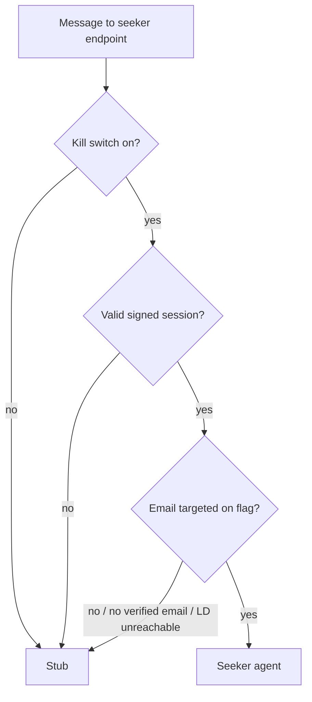

# Chat Seeker LaunchDarkly Dogfood Gate - Plan

## Goal Capsule

- **Objective:** Gate the real seeker agent in production chat behind a per-user LaunchDarkly allowlist, so hand-picked internal dogfooders get the agent and everyone else gets the stub.
- **Product authority:** the Product Contract below.
- **Open blockers:** a production LaunchDarkly SDK key for the chat service does not exist yet; and the trustworthiness of `email_verified` across apps/auth's signup and migration paths is unconfirmed — a production-flip blocker, since R4 hangs the gate on that claim. (feat-231, previously the third blocker, is complete: production sign-in verified end-to-end, PR #1465.)
- **Dogfood outcome:** the phase exists to establish whether seeker's replies are fit to widen (answer quality and reliability as judged by the dogfooders). The observation channel is deliberately lightweight for a hand-picked group: dogfooders' direct feedback in the team channel, made provenance-checkable by the R15 gate-decision log — a reported bad answer can be confirmed as seeker rather than a cold-start stub. The phase ends with an explicit widen / iterate / kill decision, which is the trigger for the deferred prerequisites (rate cap; revocation + membership gate). A structured rating or feedback instrument is out of scope (no UI changes) and becomes its own ticket if wanted.

---

## Product Contract

### Summary

Add a boolean LaunchDarkly flag with individually-targeted emails that decides seeker-vs-stub per signed-in user in production chat, layered on top of the existing `SEEKER_CHAT_ENABLED` kill switch and enforced server-side at page load and on every request to the seeker endpoint. Allowlisted, signed-in dogfooders get the real seeker agent; every other caller — signed-in but untargeted, anonymous, or a direct API script — gets the stub.

### Problem Frame

The seeker agent is wired end-to-end (feat-205) and chat sign-in works locally and in production (feat-207, feat-229, feat-231), but the only seeker switch is the all-or-nothing `SEEKER_CHAT_ENABLED` env var: on for everyone or off for everyone. The seeker endpoint also has no inbound auth — an accepted v1 risk whose own header names a real inbound gate a hard prerequisite before the audience widens. The team now wants to dogfood the real agent in production, which is exactly that widening moment: without per-user gating, enabling seeker in prod would expose the agent and its LLM spend to the public internet.

### Key Decisions

- **Enforce at the seeker endpoint, riding the existing 8h no-revocation session cookie.** The chat identity's "MUST NEVER gate authorization" warning prescribes session revocation plus a login-time membership gate before identity grants access — oversized for a named-person dogfood list. Individual LaunchDarkly targeting is default-deny per person: the list itself is the membership gate for this feature. Delisting is the first-line cutoff — next-message under normal operation, confirmed via the R15 grant log (the delisted user stops producing grant lines), with the env kill switch as the guaranteed service-wide backstop when propagation is in doubt (the SDK serves last-synced rules during a stream disruption). Accepted residual risk: a stolen or stale cookie of a still-targeted teammate reaches the dogfood agent for up to 8 hours — and with no per-caller rate cap, that window's LLM spend is bounded only by an operator noticing (via the R15 grant log, the in-scope volume signal) and cutting access off.
- **Compose with `SEEKER_CHAT_ENABLED`, don't replace it.** The env var stays as the coarse service-level kill switch; the flag adds the per-user layer on top. Both must pass. Chosen over single-control-surface replacement to keep a shutoff that does not depend on LaunchDarkly.
- **Individual targeting by email, engineer-managed in the LaunchDarkly dashboard.** Adding or removing a dogfooder is a dashboard edit, no deploy. Chosen over segments (no reuse case yet) and domain rules (too wide for a hand-picked test group). Individual targets only — adding any targeting rule to this flag is the audience-widening move that requires the deferred prerequisites first (R13, R17).
- **Fail closed — made a property of chat's wiring, not left to operator discipline.** The flag's default variation is stub, but the shared flag package consults the flag's env override before the default on every failure path (missing SDK key, init timeout or cooldown, evaluation error), in every environment. Chat's deployed wiring must therefore withhold the seeker flag's override from the client's local fallback, making the override a local-dev-only affordance (R12) — a deliberate divergence from the web prior art, which passes its overrides in unconditionally. With that in place, an unreachable LaunchDarkly, a missing SDK key, an evaluation error — or a leftover override variable — can only remove seeker access, never grant it.

### Actors

- A1. **Dogfooder** — signed-in user whose email is individually targeted on the flag.
- A2. **Signed-in non-dogfooder** — authenticated but not targeted.
- A3. **Anonymous visitor** — no session.
- A4. **Direct API caller** — any of the above hitting the seeker endpoint without the chat UI.
- A5. **Operator** — engineer with LaunchDarkly dashboard access, managing targets and the kill switch.

### Requirements

**Gating behavior**

- R1. A dogfooder (A1) in production chat receives real seeker replies.
- R2. A signed-in non-dogfooder (A2) receives the stub experience — the same stub path as today, with no error state and no upsell.
- R3. An anonymous visitor (A3) receives the stub; the flag is not evaluated for anonymous sessions.
- R4. A signed-in identity whose session carries no email claim, or whose email the identity provider has not verified (`email_verified` is not true), is treated as not targeted.

**Enforcement**

- R5. The seeker endpoint enforces the full gate on every request — kill switch, verified session, flag decision — identically for UI traffic and direct callers (A4).
- R6. The page derives its seeker-vs-stub mode server-side from the same inputs as the endpoint, so UI mode and enforcement agree at page load.
- R7. Removing a user's target takes effect on their next message once the rule change syncs — seconds under normal operation, best-effort while the SDK's LaunchDarkly stream is disrupted. The operator confirms propagation via the R15 grant log; the env kill switch is the backstop when it is in doubt. The user's UI may stay in seeker mode until that message or a refresh.
- R8. When the kill switch is off, every user gets the stub regardless of the flag.
- R9. When LaunchDarkly is unreachable or unconfigured, every user gets the stub — regardless of the flag's local override env, which chat's deployed wiring must not honor (local-dev-only, per R12 and the fail-closed decision).

**Operations**

- R10. Adding or removing a dogfooder is a LaunchDarkly dashboard edit by an engineer — no code change, no deploy.
- R11. The new flag key is registered in the shared flag registry before first use.
- R12. Local development gets seeker without a LaunchDarkly account via the registry's env-override fallback, combined with configured local chat auth and a signed-in, email-bearing session — the local gate keeps the same shape as production.
- R14. The gate normalizes the identity's email (trim, lowercase) before evaluation, and dashboard targets are entered lowercase.
- R15. Every gate decision for a signed-in user — grants as well as denials — logs a fixed non-PII outcome code (granted, kill switch, LD unavailable, not targeted, no verified email) in the chat service's existing plain-string event-log format. Denial codes let an operator classify a dogfooder's stub report from logs alone; grant lines are the seeker-vs-stub provenance for dogfood feedback, the per-user volume signal behind the accepted spend risk, and the confirmation that a delist propagated (R7).
- R16. Write access to the flag's targeting is limited to a small named engineering operator group, and the LaunchDarkly audit log is the record of who added or removed a dogfooder.
- R17. The flag's registry description carries the individual-targets-only boundary, and launch verification confirms the flag has zero targeting rules.

**Documentation**

- R13. The chat identity's display-only contract is amended to permit named-person feature gating via LaunchDarkly — individual targets only, internal staff dogfooders only — while still forbidding broader authorization (rule-based targeting, anyone outside the org, or reuse beyond seeker dogfooding) until revocation and a membership gate exist.

### Key Flows

- F1. **Dogfooder chats.**
  - **Trigger:** A1 opens production chat signed in and sends a message.
  - **Steps:** Page resolves seeker mode server-side; the message hits the seeker endpoint; the gate passes; the reply streams from the seeker agent.
  - **Covers:** R1, R5, R6.
- F2. **Non-dogfooder chats.**
  - **Trigger:** A2 or A3 uses production chat.
  - **Steps:** Page resolves stub mode; replies come from the stub; nothing reaches the seeker upstream.
  - **Covers:** R2, R3, R6.
- F3. **Mid-session delisting.**
  - **Trigger:** A5 removes a dogfooder's email while that user is mid-conversation.
  - **Steps:** The user's next message fails the gate and gets stub behavior; their UI may lag until refresh.
  - **Covers:** R7, R10.
- F4. **Kill switch.**
  - **Trigger:** A5 turns the flag off for everyone, or the env kill switch is off.
  - **Steps:** Every user gets the stub from their next message.
  - **Covers:** R8 for the env kill switch; the flag-off arm serves the flag's off-variation, which is stub per the fail-closed decision.

### Acceptance Examples

- AE1. **Covers R1, R5, R6.** Given a targeted, signed-in teammate in production, when they send a message, then the reply streams from the seeker agent.
- AE2. **Covers R2, R6.** Given a signed-in user who is not targeted, when they chat, then they get stub replies and no request reaches the seeker upstream.
- AE3. **Covers R3.** Given an anonymous visitor, when they chat, then they get the stub and the flag is never evaluated.
- AE4. **Covers R5.** Given a direct POST to the seeker endpoint with no valid session, when the kill switch is on, then the caller still gets no seeker reply.
- AE5. **Covers R7, R10.** Given a dogfooder mid-conversation, when an operator removes their email target, then their next message gets stub behavior.
- AE6. **Covers R9.** Given LaunchDarkly is unreachable, when a dogfooder sends a message, then they get the stub.
- AE7. **Covers R4.** Given a signed-in identity whose session carries no email claim, or an email the provider has not verified, when they chat, then they get the stub.
- AE8. **Covers R8.** Given the kill switch is off, when a targeted dogfooder sends a message, then they get the stub regardless of LaunchDarkly targeting.
- AE9. **Covers R9.** Given a deployed environment with the flag's local override env set to the seeker-granting value and LaunchDarkly unreachable, when any user chats, then they still get the stub.

### Scope Boundaries

- Session revocation and a login-time membership gate — deferred; the display-only warning is amended (R13) instead. Required before gating expands beyond a named-person list — "expands" is concrete: targeting anyone outside the org, any rule-based targeting on the flag, or reusing the list beyond seeker dogfooding.
- A per-caller rate or concurrency cap on the seeker endpoint — stays an open, documented prerequisite for any wider audience; out of scope while dogfooders are hand-picked. Usage monitoring beyond the R15 grant log (spend dashboards, budget alerts) is likewise deferred.
- UI changes — no request-access flow, no which-agent indicator; non-targeted users simply get today's stub.
- A multi-variate agent-selector flag — boolean only until a second real agent exists.
- Retiring `SEEKER_CHAT_ENABLED` — kept deliberately as the composed kill switch.
- Non-engineer self-serve allowlist management.

### Dependencies / Assumptions

- feat-231 (deployed-environment OAuth clients) is complete — production sign-in is verified end-to-end (PR #1465) — so production dogfooding is unblocked on the auth side; the gate can still land and be verified locally first.
- A production LaunchDarkly SDK key must be provisioned for the chat service; until then production fails closed to stub.
- The baseline includes the seeker proxy's `*.railway.internal` transport allowance (PR #1456, merged).
- Dogfooders sign in with accounts whose verified email claim matches the email targeted in LaunchDarkly. apps/auth enforces one account per email (`@@unique([email])`), so a targeted address cannot be claimed by a second account; whether `email_verified` is trustworthy for every signup and migration path is unverified and blocks the production flip (see Open blockers). The claim is not yet readable in chat's identity — the id_token verifier currently drops it — so planning must thread it into the session shape (R4).
- Flag evaluation is in-process against locally synced rules — per-message checks add no network hop, and dashboard changes propagate in seconds.
- Ordering: production `SEEKER_CHAT_ENABLED` and the Mastra upstream vars stay unset until the flag-gated build is live in production with its deny path verified, and are unset again before any rollback to a pre-gate build — a pre-gate build gates seeker on the env var alone. Flipping the flag on chat's published production host also triggers a re-run of the exposure check in `docs/solutions/auth/public-repo-oauth-seed-railway-domain-exposure-calculus.md` — this feature supplies its inbound-auth prerequisite; the rate/concurrency-cap prerequisite stays deferred by explicit owner decision (Scope Boundaries), with the R15 grant log as the compensating control.
- The chat service's LaunchDarkly SDK key is its own per-environment Railway secret, not shared with web's; a leaked server SDK key exposes the flag's synced ruleset including the dogfooder email list, so leak response is rotation plus a review of that exposure.
- Immediately after a chat deploy (SDK init window) and during the flag package's 30s init-failure cooldown, targeted dogfooders briefly get the stub — correct fail-closed behavior that will surface in dogfooder reports (see R15).

### Outstanding Questions

**Deferred to Planning**

- The seeker endpoint's exact response when the gate denies a request (a stub-shaped stream vs an explicit denial the client maps to stub behavior).
- The LaunchDarkly context shape (stable user key vs email-as-attribute) and the flag's registry name — constrained: the chosen shape must keep user emails out of LaunchDarkly-bound analytics/event payloads (private attributes or events disabled) and must preserve individual-targets-only operation (R17).
- Whether page and endpoint share one decision helper — they must agree (R6); the mechanism is planning's call.
- Whether `email_verified` can be trusted for every apps/auth signup path (including email+password) and for migration-era accounts — promoted to a production-flip blocker (Goal Capsule). Email uniqueness itself is confirmed: apps/auth enforces `@@unique([email])`.
- Who owns the widen / iterate / kill decision at the end of the dogfood phase, and where the prerequisite work it triggers (rate cap; revocation + membership gate) gets ticketed.

### Sources

- `apps/chat/src/app/api/seeker/route.ts` — gate-order comment and the accepted-risk header naming inbound auth and a rate cap as prerequisites.
- `apps/chat/src/auth/identity.ts` and `apps/chat/CLAUDE.md` — the display-only identity contract R13 amends.
- `packages/feature-flags/src/registry.ts` and `packages/feature-flags/src/launchdarkly.ts` — flag registry, context shape, and the fallback chain behind R9/R12.
- `apps/web/src/lib/feature-flags.ts` — the only existing LaunchDarkly consumer; wiring prior art.
- `apps/chat/src/lib/chat-stub.ts` — the seeker/stub reply seam the page threads.
- `docs/roadmap/ai-chat/feat-231-chat-auth-prod-oauth-client.md` — the production OAuth dependency.
