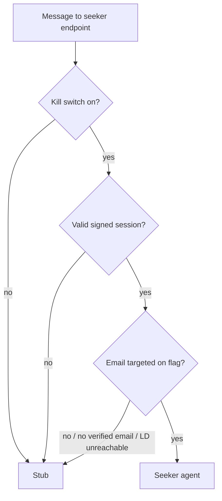
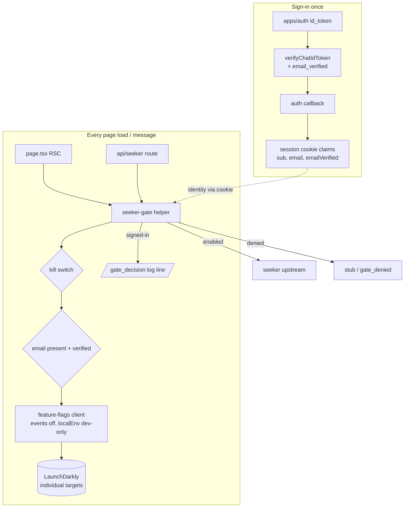

> **Amendment (2026-07-13, feat-240 rewording):** the revocation half of this
> plan's widening precondition (R13's "until revocation and a membership gate
> exist" and the Scope Boundaries entry "Required before gating expands beyond
> a named-person list") is superseded: feat-240 dropped the
> session-lease/revocation design by decision. The login-time membership-gate
> requirement stands unchanged; revocation is deliberately not required —
> accepted for an 8h cookie whose only power is reading the holder's own
> conversation history; revisit if the session gets longer or the cookie
> starts gating more than that. Decision record:
> `docs/roadmap/ai-chat/feat-240-chat-sign-out-force-login.md`. The original
> text below is unmodified.

# Chat Seeker LaunchDarkly Dogfood Gate - Plan

## Goal Capsule

- **Objective:** Gate the real seeker agent in production chat behind a per-user LaunchDarkly allowlist, so hand-picked internal dogfooders get the agent and everyone else gets the stub.
- **Product authority:** the Product Contract below. Planning decisions live in the Planning Contract; on conflict, the Product Contract wins.
- **Open blockers:** none for implementation. The `email_verified` trustworthiness question was resolved during planning (see Planning Contract — every production path that sets it true chains to a real verification). The production LaunchDarkly SDK key for the chat service is an operational rollout prerequisite, not a code blocker — until provisioned, production fails closed to stub.
- **Stop conditions:** surface to the owner instead of guessing if implementation contradicts the Product Contract's gate matrix, requires a change to apps/auth, or requires weakening the fail-closed constraint (R9/AE9).
- **Dogfood outcome:** the phase exists to establish whether seeker's replies are fit to widen (answer quality and reliability as judged by the dogfooders). The observation channel is deliberately lightweight for a hand-picked group: dogfooders' direct feedback in the team channel, made provenance-checkable by the R15 gate-decision log — a reported bad answer can be confirmed as seeker rather than a cold-start stub. The phase ends with an explicit widen / iterate / kill decision, which is the trigger for the deferred prerequisites (rate cap; revocation + membership gate). A structured rating or feedback instrument is out of scope (no UI changes) and becomes its own ticket if wanted.

---

## Product Contract

_Preservation note: unchanged from the twice-reviewed requirements version (R/A/F/AE IDs and text intact), except in-place, no-scope-change doc-review alignments: Outstanding Questions and the `email_verified` dependency bullet reflect planning-resolved answers; R4 names the distinct `no_email` outcome code instead of overloading "not targeted"; the delisting decision bullet, R7, and R15 define positive delist confirmation as the gate line flipping to `not_targeted` rather than grant-line absence (inconclusive for an idle user); R17 adds the flag's fallthrough-variation launch check; the Ordering assumption records the pre-gate-rollback fail-open path as an accepted, checklisted residual risk with the structural alternative considered and declined; and the SDK-key isolation assumption is softened from a settled claim into a pre-flip topology decision (dedicated LD environment recommended), sequenced as Rollout Runbook step 1._

### Summary

Add a boolean LaunchDarkly flag with individually-targeted emails that decides seeker-vs-stub per signed-in user in production chat, layered on top of the existing `SEEKER_CHAT_ENABLED` kill switch and enforced server-side at page load and on every request to the seeker endpoint. Allowlisted, signed-in dogfooders get the real seeker agent; every other caller — signed-in but untargeted, anonymous, or a direct API script — gets the stub.

### Problem Frame

The seeker agent is wired end-to-end (feat-205) and chat sign-in works locally and in production (feat-207, feat-229, feat-231), but the only seeker switch is the all-or-nothing `SEEKER_CHAT_ENABLED` env var: on for everyone or off for everyone. The seeker endpoint also has no inbound auth — an accepted v1 risk whose own header names a real inbound gate a hard prerequisite before the audience widens. The team now wants to dogfood the real agent in production, which is exactly that widening moment: without per-user gating, enabling seeker in prod would expose the agent and its LLM spend to the public internet.

### Key Decisions

- **Enforce at the seeker endpoint, riding the existing 8h no-revocation session cookie.** The chat identity's "MUST NEVER gate authorization" warning prescribes session revocation plus a login-time membership gate before identity grants access — oversized for a named-person dogfood list. Individual LaunchDarkly targeting is default-deny per person: the list itself is the membership gate for this feature. Delisting is the first-line cutoff — next-message under normal operation, positively confirmed via the R15 gate log: the delisted user's next gate line flips to `not_targeted`, while a further `granted` line proves the delist has not synced (absence of lines alone is inconclusive — the user may simply be idle). The env kill switch is the guaranteed service-wide backstop when no fresh decision line appears and propagation is in doubt (the SDK serves last-synced rules during a stream disruption). Accepted residual risk: a stolen or stale cookie of a still-targeted teammate reaches the dogfood agent for up to 8 hours — and with no per-caller rate cap, that window's LLM spend is bounded only by an operator noticing (via the R15 grant log, the in-scope volume signal) and cutting access off.
- **Compose with `SEEKER_CHAT_ENABLED`, don't replace it.** The env var stays as the coarse service-level kill switch; the flag adds the per-user layer on top. Both must pass. Chosen over single-control-surface replacement to keep a shutoff that does not depend on LaunchDarkly.
- **Individual targeting by email, engineer-managed in the LaunchDarkly dashboard.** Adding or removing a dogfooder is a dashboard edit, no deploy. Chosen over segments (no reuse case yet) and domain rules (too wide for a hand-picked test group). Individual targets only — adding any targeting rule to this flag is the audience-widening move that requires the deferred prerequisites first (R13, R17).
- **Fail closed — made a property of chat's wiring, not left to operator discipline.** The flag's default variation is stub, but the shared flag package consults the flag's env override before the default on every failure path (missing SDK key, init timeout or cooldown, evaluation error), in every environment. Chat's deployed wiring must therefore withhold the seeker flag's override from the client's local fallback, making the override a local-dev-only affordance (R12) — a deliberate divergence from the web prior art, which passes its overrides in unconditionally. With that in place, an unreachable LaunchDarkly, a missing SDK key, an evaluation error — or a leftover override variable — can only remove seeker access, never grant it.

### Actors

- A1. **Dogfooder** — signed-in user whose email is individually targeted on the flag.
- A2. **Signed-in non-dogfooder** — authenticated but not targeted.
- A3. **Anonymous visitor** — no session.
- A4. **Direct API caller** — any of the above hitting the seeker endpoint without the chat UI.
- A5. **Operator** — engineer with LaunchDarkly dashboard access, managing targets and the kill switch.

### Requirements

**Gating behavior**

- R1. A dogfooder (A1) in production chat receives real seeker replies.
- R2. A signed-in non-dogfooder (A2) receives the stub experience — the same stub path as today, with no error state and no upsell.
- R3. An anonymous visitor (A3) receives the stub; the flag is not evaluated for anonymous sessions.
- R4. A signed-in identity whose session carries no email claim, or whose email the identity provider has not verified (`email_verified` is not true), is denied the seeker and receives the stub — logged under the distinct `no_email` outcome code (R15), not `not_targeted`.

**Enforcement**

- R5. The seeker endpoint enforces the full gate on every request — kill switch, verified session, flag decision — identically for UI traffic and direct callers (A4).
- R6. The page derives its seeker-vs-stub mode server-side from the same inputs as the endpoint, so UI mode and enforcement agree at page load.
- R7. Removing a user's target takes effect on their next message once the rule change syncs — seconds under normal operation, best-effort while the SDK's LaunchDarkly stream is disrupted. The operator confirms propagation via the R15 gate log — the user's next gate line flips to `not_targeted` (absence of grant lines alone is inconclusive, as is an `ld_unavailable` line — LD did not genuinely answer, e.g. a stream disruption or cold-start window); the env kill switch is the backstop when it is in doubt. The user's UI may stay in seeker mode until that message or a refresh.
- R8. When the kill switch is off, every user gets the stub regardless of the flag.
- R9. When LaunchDarkly is unreachable or unconfigured, every user gets the stub — regardless of the flag's local override env, which chat's deployed wiring must not honor (local-dev-only, per R12 and the fail-closed decision).

**Operations**

- R10. Adding or removing a dogfooder is a LaunchDarkly dashboard edit by an engineer — no code change, no deploy.
- R11. The new flag key is registered in the shared flag registry before first use.
- R12. Local development gets seeker without a LaunchDarkly account via the registry's env-override fallback, combined with configured local chat auth and a signed-in, email-bearing session — the local gate keeps the same shape as production.
- R14. The gate normalizes the identity's email (trim, lowercase) before evaluation, and dashboard targets are entered lowercase.
- R15. Every gate decision for a signed-in user — grants as well as denials — logs a fixed non-PII outcome code (granted, kill switch, LD unavailable, not targeted, no email — missing or unverified) in the chat service's existing plain-string event-log format. Denial codes let an operator classify a dogfooder's stub report from logs alone; grant lines are the seeker-vs-stub provenance for dogfood feedback and the per-user volume signal behind the accepted spend risk; a delisted user's gate line flipping to `not_targeted` is the positive confirmation that a delist propagated (R7).
- R16. Write access to the flag's targeting is limited to a small named engineering operator group, and the LaunchDarkly audit log is the record of who added or removed a dogfooder.
- R17. The flag's registry description carries the individual-targets-only boundary, and launch verification confirms the flag has zero targeting rules and that its fallthrough/default variation resolves to stub.

**Documentation**

- R13. The chat identity's display-only contract is amended to permit named-person feature gating via LaunchDarkly — individual targets only, internal staff dogfooders only — while still forbidding broader authorization (rule-based targeting, anyone outside the org, or reuse beyond seeker dogfooding) until revocation and a membership gate exist.

### Key Flows

- F1. **Dogfooder chats.**
  - **Trigger:** A1 opens production chat signed in and sends a message.
  - **Steps:** Page resolves seeker mode server-side; the message hits the seeker endpoint; the gate passes; the reply streams from the seeker agent.
  - **Covers:** R1, R5, R6.
- F2. **Non-dogfooder chats.**
  - **Trigger:** A2 or A3 uses production chat.
  - **Steps:** Page resolves stub mode; replies come from the stub; nothing reaches the seeker upstream.
  - **Covers:** R2, R3, R6.
- F3. **Mid-session delisting.**
  - **Trigger:** A5 removes a dogfooder's email while that user is mid-conversation.
  - **Steps:** The user's next message fails the gate and gets stub behavior; their UI may lag until refresh.
  - **Covers:** R7, R10.
- F4. **Kill switch.**
  - **Trigger:** A5 turns the flag off for everyone, or the env kill switch is off.
  - **Steps:** Every user gets the stub from their next message.
  - **Covers:** R8 for the env kill switch; the flag-off arm serves the flag's off-variation, which is stub per the fail-closed decision.

### Acceptance Examples

- AE1. **Covers R1, R5, R6.** Given a targeted, signed-in teammate in production, when they send a message, then the reply streams from the seeker agent.
- AE2. **Covers R2, R6.** Given a signed-in user who is not targeted, when they chat, then they get stub replies and no request reaches the seeker upstream.
- AE3. **Covers R3.** Given an anonymous visitor, when they chat, then they get the stub and the flag is never evaluated.
- AE4. **Covers R5.** Given a direct POST to the seeker endpoint with no valid session, when the kill switch is on, then the caller still gets no seeker reply.
- AE5. **Covers R7, R10.** Given a dogfooder mid-conversation, when an operator removes their email target, then their next message gets stub behavior.
- AE6. **Covers R9.** Given LaunchDarkly is unreachable, when a dogfooder sends a message, then they get the stub.
- AE7. **Covers R4.** Given a signed-in identity whose session carries no email claim, or an email the provider has not verified, when they chat, then they get the stub.
- AE8. **Covers R8.** Given the kill switch is off, when a targeted dogfooder sends a message, then they get the stub regardless of LaunchDarkly targeting.
- AE9. **Covers R9.** Given a deployed environment with the flag's local override env set to the seeker-granting value and LaunchDarkly unreachable, when any user chats, then they still get the stub.

### Scope Boundaries

- Session revocation and a login-time membership gate — deferred; the display-only warning is amended (R13) instead. Required before gating expands beyond a named-person list — "expands" is concrete: targeting anyone outside the org, any rule-based targeting on the flag, or reusing the list beyond seeker dogfooding.
- A per-caller rate or concurrency cap on the seeker endpoint — stays an open, documented prerequisite for any wider audience; out of scope while dogfooders are hand-picked. Usage monitoring beyond the R15 grant log (spend dashboards, budget alerts) is likewise deferred.
- UI changes — no request-access flow, no which-agent indicator; non-targeted users simply get today's stub.
- A multi-variate agent-selector flag — boolean only until a second real agent exists.
- Retiring `SEEKER_CHAT_ENABLED` — kept deliberately as the composed kill switch.
- Non-engineer self-serve allowlist management.

### Dependencies / Assumptions

- feat-231 (deployed-environment OAuth clients) is complete — production sign-in is verified end-to-end (PR #1465) — so production dogfooding is unblocked on the auth side; the gate can still land and be verified locally first.
- A production LaunchDarkly SDK key must be provisioned for the chat service; until then production fails closed to stub.
- The baseline includes the seeker proxy's `*.railway.internal` transport allowance (PR #1456, merged).
- Dogfooders sign in with accounts whose verified email claim matches the email targeted in LaunchDarkly. apps/auth enforces one account per email (`@@unique([email])`), so a targeted address cannot be claimed by a second account. `email_verified` trustworthiness was confirmed during planning (see Planning Contract — Verified-email evidence); the claim is not yet readable in chat's identity — the id_token verifier currently drops it — so implementation threads it into the session shape (R4, U2).
- Flag evaluation is in-process against locally synced rules — per-message checks add no network hop, and dashboard changes propagate in seconds.
- Ordering: production `SEEKER_CHAT_ENABLED` and the Mastra upstream vars stay unset until the flag-gated build is live in production with its deny path verified, and are unset again _before_ any rollback to a pre-gate build — a pre-gate build gates seeker on the env var alone, so rolling back with the vars still set serves seeker to the public internet. That pre-rollback unset is operator discipline, an acknowledged exception to the wiring-level fail-closed principle (which governs the LD-evaluation axis — missing key, timeout, leftover override — not the deploy lifecycle). Accepted for the hand-picked dogfood phase: the operator is the ticket owner, the exposure window is a pre-gate rollback in the initial rollout period, and the control is a required, checklisted pre-rollback step (DoD). The structural alternative that removes the discipline dependency — a gated-build-only enable var (e.g. `SEEKER_CHAT_GATED_ENABLED`) so a pre-gate build inherits nothing enabling — was considered and declined by the ticket owner: it conflicts with the ticket's keep-`SEEKER_CHAT_ENABLED` constraint, expands U3/U5 scope, and the residual it removes is narrow (a pre-gate rollback in the initial rollout window, operated by the owner). The checklisted pre-rollback unset is the accepted control. Flipping the flag on chat's published production host also triggers a re-run of the exposure check in `docs/solutions/auth/public-repo-oauth-seed-railway-domain-exposure-calculus.md` — this feature supplies its inbound-auth prerequisite; the rate/concurrency-cap prerequisite stays deferred by explicit owner decision (Scope Boundaries), with the R15 grant log as the compensating control.
- Whether the chat service's LaunchDarkly SDK key is isolated from web's is a pre-flip topology decision, not a settled fact: LaunchDarkly mints one server SDK key per _environment_ (within a project), not per service, so a genuinely separate key requires giving chat its own LD environment (or project). Recommended — a dedicated LD environment for chat, so its key, the dogfooder-email ruleset, and the R17 zero-rules check are isolated from web and rotation is independent. If chat instead shares web's environment/key, the dogfooder list is synced to every service using that key (web included) and rotation affects both — a shared, not chat-only, leak-response blast radius. This is Rollout Runbook step 1; targeting, the zero-rules confirmation, and Verification rows 4-6 all run against whichever environment it picks. Either way, a leaked server SDK key exposes the flag's synced ruleset including the dogfooder email list, so leak response is rotation plus a review of that exposure.
- Immediately after a chat deploy (SDK init window) and during the flag package's 30s init-failure cooldown, targeted dogfooders briefly get the stub — correct fail-closed behavior that will surface in dogfooder reports (see R15).

### Outstanding Questions

**Deferred (non-blocking)**

- Who owns the widen / iterate / kill decision at the end of the dogfood phase, and where the prerequisite work it triggers (rate cap; revocation + membership gate) gets ticketed.
- apps/auth's trusted-provider implicit account linking (`trustedProviders` in `apps/auth/src/auth/config.ts`) links a social login to an existing same-email user even when the provider's email assertion is unverified — and a linked login inherits the account wholesale, including its already-true `email_verified` and `sub`, so a successful link against a dogfooder's address would pass this gate. The dismissal ground is provider practice, not orthogonality: Google/Apple/Okta assert verified emails and Facebook never asserts one, making an unverified-assertion link against a dogfooder's address a remote path. Worth its own ticket on the linking policy itself; not a gate blocker.
- R16 assumes LaunchDarkly can restrict one flag's targeting writes to a named group; per-flag custom roles are typically enterprise-tier. The flip owner confirms the org's LD plan supports it before the flip, or records the fallback (dashboard discipline + the audit log) as the accepted control.
- KTD8's onboarding `sub`↔email mapping names its sources but not a durable home — the flip owner picks where it lives (runbook, ops doc, or pinned team-channel thread) and records it there during the row-6 walk.

_(The four questions previously deferred to planning — deny-response shape, LaunchDarkly context shape, shared decision helper, `email_verified` trustworthiness — are resolved in the Planning Contract below.)_

### Sources

- `apps/chat/src/app/api/seeker/route.ts` — gate-order comment and the accepted-risk header naming inbound auth and a rate cap as prerequisites.
- `apps/chat/src/auth/identity.ts` and `apps/chat/CLAUDE.md` — the display-only identity contract R13 amends.
- `packages/feature-flags/src/registry.ts` and `packages/feature-flags/src/launchdarkly.ts` — flag registry, context shape, and the fallback chain behind R9/R12.
- `apps/web/src/lib/feature-flags.ts` — the only existing LaunchDarkly consumer; wiring prior art.
- `apps/chat/src/lib/chat-stub.ts` — the seeker/stub reply seam the page threads.
- `docs/roadmap/ai-chat/feat-231-chat-auth-prod-oauth-client.md` — the production OAuth dependency.

---

## Planning Contract

### Key Technical Decisions

- KTD1. **One shared decision helper; identity injected by the caller.** A server-only module (`apps/chat/src/lib/seeker-gate.ts`) owns the whole decision — kill switch AND identity checks AND flag evaluation — and returns `{ seekerEnabled, outcome }`. `page.tsx` calls it with `getChatIdentity()` (RSC `cookies()`); the route calls it with the identity read from the request's cookie header via `readChatSessionCookie`, mirroring how the cookie is already read on both surfaces today. Injecting the identity keeps the helper pure enough for matrix testing and guarantees R6 (page and endpoint agree) by construction.
- KTD2. **Gate denial at the route is a new terminal SSE `error` reason, `gate_denied`, and the client maps it to the local stub.** Every route failure today is a 200 SSE stream with one terminal `error {reason}` frame; the client's reason handling is an exhaustive switch (`assertNever`), so a new reason is a compile-forced change, not a silent gap. On `gate_denied`, `streamSeekerReply` falls back to the client-side stub for that message — F3's "next message gets stub behavior" without building a server-side stub renderer. One deny reason for all deny causes: the SSE frame stays non-probing (a direct caller can't distinguish untargeted from unverified); the R15 log codes carry the detail server-side. This resolves the deny-response planning question on the "explicit denial the client maps to stub behavior" arm.
- KTD3. **LaunchDarkly context: `kind: "user"`, key = normalized email; LD events disabled.** Individual targeting matches on the context key, so email-as-key is what keeps the flag on individual targets with zero rules (R17) — a `sub`-keyed context would force an email _rule_. The PII constraint is satisfied on the events-disabled arm: chat's client passes `sendEvents: false` and `diagnosticOptOut: true` through `FeatureFlagClientOptions.options` (the shared package configures neither today, and the SDK's default is events ON), so evaluation contexts are never shipped to LaunchDarkly's analytics. Targeting sync is unaffected — events are telemetry only. `name` is omitted from the context. Explicit trade-off: with events off, the LD dashboard's Insights/evaluation counts and context autocomplete stay empty for this flag — the R15 gate log is the sole evaluation-observability surface, and a new target is validated by its first `granted` line, not by the dashboard. `sendEvents: false` is a client-level option, so every flag this chat client evaluates inherits the same dashboard blindness — fine today (`chatSeekerDogfood` is chat's only flag), but a constraint a future chat flag consumer should know.
- KTD4. **New outcome-preserving evaluation export in `@forge/feature-flags`.** `booleanVariation` collapses every LD failure into the fallback boolean, which makes R15's `ld_unavailable` and `not_targeted` codes indistinguishable. Add a detail variant (directionally `booleanVariationDetail`) returning `{ value, source }` where `source` is `"launchdarkly" | "override" | "default"`, with the same fallback chain; `booleanVariation` becomes a thin wrapper over it. The LD-answered arm must call the SDK's `boolVariationDetail` (extending `LaunchDarklyClientLike` accordingly) and route `reason.kind === "ERROR"` resolutions to the fallback arm (branch on `kind === "ERROR"` alone — the SDK types `errorKind` as a plain optional string, so `FLAG_NOT_FOUND`/`MALFORMED_FLAG`/`CLIENT_NOT_READY`/`WRONG_TYPE` are illustrative, not a branch set) — the SDK resolves the passed default on these instead of throwing, so a plain `variation()` call would report a missing or archived flag as a genuine LD answer and log `not_targeted` when the truth is `ld_unavailable`. Chat maps: LD genuinely answered false → `not_targeted`; fallback resolved (no key, init timeout/cooldown, in-LD error resolution incl. missing/malformed flag, evaluation throw, non-boolean variation) → `ld_unavailable`; value true from an LD-answered or override source → `granted` (default is fixed false per KTD7, so it can never yield a grant).
- KTD5. **The override is withheld by construction: chat passes `localEnv` to the client only when `NODE_ENV === "development"`.** The shared package never reads `process.env` — the consumer decides what lands in `localEnv` — so deployed builds (Railway runs production builds) simply never expose `FORGE_CHAT_SEEKER_DOGFOOD_DEFAULT` to the fallback chain, making AE9 a wiring property — the unit test pins the branch logic (a non-development NODE_ENV never exposes the override to the fallback chain), and the build-time inlining of `process.env.NODE_ENV` to `production` in the deployed server bundle pins the deployed value (kept belt-and-suspenders by the DoD pre-flip NODE_ENV check). Deliberate divergence from `apps/web/src/lib/feature-flags.ts`, which passes its overrides unconditionally.
- KTD6. **`email_verified` rides the existing session cookie, strict `=== true`.** The claim threads mint-to-read: `verifyChatIdToken` extracts it (missing / false / non-boolean → not verified), the auth callback passes it into the cookie claims, `ChatIdentity` gains an `emailVerified` field, and the gate requires `email === present` AND `emailVerified === true` before evaluating the flag. Sessions signed before this deploy carry no claim and read as unverified — fail-closed; dogfooders sign in again after the gated build deploys (Operational Rollout).
- KTD7. **Flag registry identity:** name `chatSeekerDogfood`, key `forge.chat.seekerDogfood`, override env `FORGE_CHAT_SEEKER_DOGFOOD_DEFAULT`, `defaultValue: false` — the registry's established naming pattern, first non-`watch` entry. The description carries the individual-targets-only boundary (R17).
- KTD8. **Gate log lines carry the opaque `sub`, never the email.** R15's purposes — per-user volume, delist-propagation confirmation — need the line attributable to a user. The subject id is the non-PII attributor: `[seeker-gate] event=gate_decision surface=<page|route> outcome=<code> sub=` in the established plain-string format (Railway logsV2 silences JSON payloads from Next.js route handlers). When the flag was evaluated (`granted` / `not_targeted` / `ld_unavailable`), the line also carries `source=<launchdarkly|override|default>` — the value KTD4 computes but would otherwise discard at the log seam. This makes grant provenance self-evident: `granted source=launchdarkly` is a real targeting hit, while `granted source=override` is a local-dev grant — the permanent, log-level guard behind Verification row 4's override-unset check. Outcome codes are the fixed set `granted | kill_switch | ld_unavailable | not_targeted | no_email` (`no_email` covers both missing and unverified email, per the ticket's code set). Anonymous visitors produce no line (R15 scopes logging to signed-in users; R3 forbids flag evaluation for them). At onboarding, the flip owner records each dogfooder's `sub`↔email pair (from their first `granted` line during the row-6 walk, or apps/auth's `users` table) so a volume anomaly or delist confirmation is attributable to a person during an incident without putting emails in logs.

### Verified-email evidence (planning-resolved blocker)

`email_verified === true` from apps/auth is trustworthy for this gate. Per-path findings (apps/auth, Better Auth 1.6.2 + oauth-provider):

- Claim minting: `email_verified` comes from the `users.email_verified` DB column (`DEFAULT false`), re-read from the DB at token mint (`apps/auth/src/auth/config.ts` `firstPartyUserClaims`).
- Public email+password signup: disabled — `handleEmailSignUp` never reaches Better Auth (`apps/auth/src/app/api/auth/[...all]/route.ts`).
- Firebase migration sign-in (the only email-account creator): flips `emailVerified: true` only after the Firebase token asserts `email_verified === true` and the token email matches — verified mailbox.
- Google/Apple/Okta: `disableSignUp: true`; on sign-in, Better Auth flips the flag only when the provider asserts verified AND emails match — standard OIDC provider trust. Facebook maps to false and never flips it.
- Agent-login handles: minted with `emailVerified: true` on synthetic `@agent-login.jesusfilm.internal` addresses, but minting is local/preview-only and production clients 403 agent actors at authorize; synthetic addresses would also never be targeted. Accepted residual, no action.
- Email updates: no email-change surface exists (`changeEmail` disabled, `updateUser` rejects `email`, admin plugin absent), so no stale-verified path exists.

### High-Level Technical Design

Both surfaces converge on one helper; the flag package is the only LD touchpoint; the verified-email claim arrives via the session cookie minted at OAuth callback.

Decision-to-outcome mapping (helper internals, directional):

| Condition (evaluated in order)                                                                                     | `seekerEnabled` | Outcome code           | Logged?        |
| ------------------------------------------------------------------------------------------------------------------ | --------------- | ---------------------- | -------------- |
| `SEEKER_CHAT_ENABLED` not `"true"`                                                                                 | false           | `kill_switch`          | signed-in only |
| No identity (anonymous)                                                                                            | false           | — (no flag evaluation) | no             |
| No email claim, or `emailVerified !== true`                                                                        | false           | `no_email`             | yes            |
| Flag evaluates false via LaunchDarkly                                                                              | false           | `not_targeted`         | yes            |
| Fallback chain resolved false (no SDK key, init timeout/cooldown, missing/malformed flag, eval error, non-boolean) | false           | `ld_unavailable`       | yes            |
| Flag resolves true (LD targeting; or dev-only override locally)                                                    | true            | `granted`              | yes            |

### Assumptions

- The deny arm chosen in KTD2 (client maps `gate_denied` to the local stub) and the context shape in KTD3 (email-as-key + events disabled) were the Product Contract's explicitly delegated planning calls; no product behavior changes.
- `NODE_ENV === "development"` is the local-dev discriminator for KTD5. Railway builds run `NODE_ENV=production`; vitest can inject `localEnv` directly, so tests don't depend on NODE_ENV.
- An `actor_type === "human"` check is not added: the agent-login vector is already production-blocked in apps/auth and synthetic addresses can't be targeted. Threading a second claim is deferred hardening, not scope.
- Routing `gate_denied` through the route's existing `fail()` path emits a `[seeker-proxy] event=proxy_error reason=gate_denied` line at the route in addition to the `[seeker-gate] event=gate_decision` line — expected (the `fail()` path is reused, not forked). The two are complementary: `[seeker-gate]` carries the per-user outcome and `sub`; `[seeker-proxy]` marks the SSE frame. The `proxy_error` reason set gains `gate_denied` as a member; the `[seeker-gate]` label is new.

---

## Implementation Units

### U1. Flag registry entry + outcome-preserving evaluation in `@forge/feature-flags`

- **Goal:** Register `chatSeekerDogfood` and add the detail-returning evaluation variant so consumers can distinguish an LD answer from a fallback resolution.
- **Requirements:** R11, R17 (registry description); enables R15's `ld_unavailable`/`not_targeted` split (KTD4, KTD7).
- **Dependencies:** none.
- **Files:** `packages/feature-flags/src/registry.ts`, `packages/feature-flags/src/launchdarkly.ts`, `packages/feature-flags/src/index.ts`, `packages/feature-flags/src/launchdarkly.test.ts`.
- **Approach:** New registry entry per KTD7 with a description stating both boundaries: individual-targets-only (zero rules; widening requires revocation + membership gate first) and override-is-local-dev-only (chat's deployed wiring withholds `localOverrideEnv`, a deliberate divergence from web's unconditional prior art — future flag consumers should not rediscover this by accident). In `launchdarkly.ts`, build the detail variant on the SDK's `boolVariationDetail` — extend `LaunchDarklyClientLike` with a REQUIRED `boolVariationDetail` member and update the existing suite's fakes to implement it (an optional member with a `variation()` fallback would typecheck and stay green while silently skipping the ERROR routing): a genuinely evaluated answer returns `{ value, source: "launchdarkly" }`; `reason.kind === "ERROR"` resolutions (FLAG_NOT_FOUND, MALFORMED_FLAG, CLIENT_NOT_READY, WRONG_TYPE) route to the fallback chain and return `source: "override" | "default"`; `booleanVariation` delegates to it. Behavior of every existing path is unchanged.
- **Patterns to follow:** existing `as const` registry entries; `launchdarkly.test.ts`'s injected-`initClient` fake pattern.
- **Test scenarios:**
  - Happy path: LD variation true → `{ value: true, source: "launchdarkly" }`; LD variation false → `{ value: false, source: "launchdarkly" }`.
  - No SDK key → `source: "default"`, value = registry default (false); with override env present in `localEnv` → `source: "override"` honoring the parsed value.
  - Init timeout, evaluation throw, and non-boolean variation each → fallback with `source` reflecting override-vs-default resolution.
  - In-LD error resolution: injected fake returns a detail with `reason: { kind: "ERROR", errorKind: "FLAG_NOT_FOUND" }` → fallback source (`"default"`/`"override"`), never `"launchdarkly"`.
  - Cooldown window: second call inside 30s after init failure → fallback without re-init (existing behavior, now asserted through the detail variant).
  - Existing `booleanVariation` suite: resolved-value expectations stay identical, but tests that currently spy or stub the `variation` member (called-with args, evaluation throw, non-boolean value) migrate those spies and assertions onto `boolVariationDetail` — `booleanVariation` now delegates through it and no longer calls `variation` directly, so a spy left on `variation` never fires.
- **Verification:** `pnpm --filter @forge/feature-flags test` green; registry exports typecheck across consumers.

### U2. Thread `email_verified` through chat session claims

- **Goal:** Make verified-email status readable from `ChatIdentity` so the gate can enforce R4.
- **Requirements:** R4 (KTD6).
- **Dependencies:** none.
- **Files:** `apps/chat/src/auth/oauth-client.ts`, `apps/chat/src/auth/oauth-client.test.ts`, `apps/chat/src/app/api/auth/callback/route.ts`, `apps/chat/src/app/api/auth/callback/route.test.ts`, `apps/chat/src/auth/session-cookie.ts`, `apps/chat/src/auth/session-cookie.test.ts`.
- **Approach:** `verifyChatIdToken` extracts `payload.email_verified` with a strict boolean check into `VerifiedChatIdentity.emailVerified`; the callback passes it to `createChatSessionCookie`; `ChatIdentity` gains `emailVerified?: boolean`, written into and projected out of the JWT claims. Absent claim on read (legacy sessions) → `undefined`, which the gate treats as unverified.
- **Patterns to follow:** the existing claim projections in `oauth-client.ts` (string-typed guards per claim) and `session-cookie.ts` (sign/read symmetry); `// @vitest-environment node` on auth tests.
- **Test scenarios:**
  - Covers AE7 groundwork. id_token with `email_verified: true` → identity carries `emailVerified: true`; with `false`, missing, or a non-boolean value (`"true"`) → not verified.
  - Cookie roundtrip: created with `emailVerified: true` reads back `true`; legacy cookie payload without the claim reads back `undefined`.
  - Callback seam (the join the isolated halves miss): a callback whose exchanged id_token asserts `email_verified: true` sets a session cookie that reads back `emailVerified: true` via `readChatSessionCookie` — guards the one-line pass-through that compiles clean if forgotten (the field is optional).
  - Existing identity/session tests stay green (field is additive).
- **Verification:** `pnpm --filter @forge/chat test` green for auth suites; typecheck green.

### U3. Chat flag client wiring (fail-closed by construction)

- **Goal:** Give apps/chat a LaunchDarkly client whose deployed configuration cannot honor the seeker override and never ships emails to LD analytics.
- **Requirements:** R9, R12 (KTD3, KTD5); AE9.
- **Dependencies:** U1 (registry entry names the override env).
- **Files:** `apps/chat/package.json`, `apps/chat/src/config/env.ts`, `apps/chat/src/config/env.test.ts`, `apps/chat/src/lib/feature-flags.ts` (new), `apps/chat/src/lib/feature-flags.test.ts` (new), `apps/chat/vitest.config.ts`, `apps/chat/src/__mocks__/server-only.ts` (new), `apps/chat/.env.example`.
- **Approach:** Add `@forge/feature-flags` (workspace) dependency. Env schema gains `LAUNCHDARKLY_SDK_KEY` and `FORGE_CHAT_SEEKER_DOGFOOD_DEFAULT`, both `.optional()` with the `emptyToUndefined` wrapper — the boots-clean-with-none-set guarantee holds. New module builds the client via `createFeatureFlagClient` with `sendEvents: false` + `diagnosticOptOut: true` in `options`, `timeoutSeconds: 0.25`, and `localEnv` populated only when `NODE_ENV === "development"`; expose a factory seam (options/env injectable) so tests don't depend on module-level state, alongside the module singleton for app use. Add commented `LAUNCHDARKLY_SDK_KEY` and `FORGE_CHAT_SEEKER_DOGFOOD_DEFAULT` entries to `apps/chat/.env.example`, matching its existing convention. `import "server-only"` throws at import time under vitest — mirror web's fix (`apps/web/vitest.config.ts` aliases `server-only` to a local stub): add the alias to `apps/chat/vitest.config.ts` with a `src/__mocks__/server-only.ts` stub; no package.json dependency needed (Next resolves it natively at build).
- **Execution note:** confirm how Next.js resolves `process.env.NODE_ENV` in chat's server bundle — if it is build-inlined to `production`, a runtime `NODE_ENV=development` service variable cannot flip the deployed path and KTD5 is structurally robust (the pre-flip NODE_ENV check in the DoD is then belt-and-suspenders); if it is read at runtime, that pre-flip check is load-bearing. Keep the check either way.
- **Patterns to follow:** `apps/web/src/lib/feature-flags.ts` for the `import "server-only"` singleton shape — except its unconditional `localEnv`, which is the explicitly-forbidden part; `resetFeatureFlagClientCacheForTests` for isolation.
- **Test scenarios:**
  - Covers AE9. Deployed mode (non-development), override env set to a granting value, no SDK key → evaluation resolves false.
  - Development mode, override env set → evaluation resolves true (R12's local path).
  - Env module imports cleanly with neither new var set (boots-clean regression, per the Railway optional-env learning).
  - Client construction passes `sendEvents: false` and `diagnosticOptOut: true` (assert via injected `initClient` capturing options).
- **Verification:** `pnpm --filter @forge/chat test` and `typecheck` green.

### U4. Seeker gate decision helper

- **Goal:** One server-side function that produces the gate decision and the R15 log line for both surfaces.
- **Requirements:** R1–R4, R8, R9, R14, R15 (KTD1, KTD8); AE3, AE6, AE7, AE8.
- **Dependencies:** U1, U2, U3.
- **Files:** `apps/chat/src/lib/seeker-gate.ts` (new), `apps/chat/src/lib/seeker-gate.test.ts` (new).
- **Approach:** `resolveSeekerGate(identity, { surface })` implements the decision table in the Planning Contract: kill switch → anonymous short-circuit (no flag evaluation, no log) → email present + `emailVerified === true` → normalize email (trim, lowercase) → evaluate `chatSeekerDogfood` via the detail variant with a `kind: "user"` context keyed on the normalized email → map `{ value, source }` to the outcome code. Emits `[seeker-gate] event=gate_decision surface=<surface> outcome=<code> sub=` for signed-in identities, grants and denials alike, adding `source=<launchdarkly|override|default>` on evaluated outcomes (KTD8). Dependencies (env read, flag evaluation, logger) injectable for tests.
- **Execution note:** write the outcome-matrix tests first — the branch-per-code discipline below is the unit's real contract.
- **Test scenarios (one per branch, such that only that branch can match — mocked-shape-vs-real-contract discipline):**
  - Covers AE8. Kill switch off + signed-in targeted identity → `{ seekerEnabled: false, outcome: "kill_switch" }`, logged.
  - Covers AE3. Anonymous → disabled, flag evaluator never invoked, no log line.
  - Covers AE7. Signed-in, no email → `no_email`; signed-in, email present but `emailVerified` false/undefined → `no_email`.
  - Signed-in verified, LD answers false → `not_targeted`.
  - Covers AE6. Signed-in verified, detail source `"default"` (no key / timeout / error) with value false → `ld_unavailable`.
  - Signed-in verified, LD answers true → `granted`, logged with the caller's surface, the identity's `sub`, and `source=launchdarkly`; the same grant via the dev-only override logs `source=override` (provenance split, KTD8).
  - Covers R14. Identity email `"  Person@Example.COM "` → evaluation context key `"person@example.com"`.
  - Log-format assertion: emitted line is a plain string matching the fixed format, contains no email.
- **Verification:** `pnpm --filter @forge/chat test` green; every outcome code exercised by at least one test that fails if its branch is removed.

### U5. Enforce at the route and page; client maps denial to stub

- **Goal:** Wire the helper into both surfaces so only a targeted, signed-in, verified caller reaches the seeker upstream — and a denied UI degrades to stub, not an error.
- **Requirements:** R1, R2, R5, R6, R7 (KTD1, KTD2); AE1, AE2, AE4, AE5.
- **Dependencies:** U4.
- **Files:** `apps/chat/src/app/api/seeker/route.ts`, `apps/chat/src/app/api/seeker/route.test.ts`, `apps/chat/src/app/page.tsx`, `apps/chat/src/lib/conversations.ts`, `apps/chat/src/lib/chat-stub.ts`, `apps/chat/src/lib/chat-stub.test.ts`, `apps/chat/src/components/chat/message-list.tsx`.
- **Approach:** Route: the testable core (`handleSeekerProxyRequest`) gains an injected gate resolver; on deny it emits the terminal SSE `error {reason: "gate_denied"}` frame via the existing `fail()` path, before any upstream fetch; the existing gate-order comment extends to `kill switch + per-user gate → config present → SSRF`, and the accepted-risk header is rewritten to reflect that inbound auth now exists while the rate cap remains open. `POST` wiring resolves the identity from the request cookie and calls the helper with `surface: "route"`. Page: `page.tsx` (already an async, `force-dynamic` RSC) derives `seekerEnabled` from the same helper (`surface: "page"`). Client: `gate_denied` joins `REPLY_FAILURE_REASONS` in `conversations.ts` — the route's `fail()` typing, `toReason`, and the exhaustive `failureNotice` switch all key off that union, which is what makes the new reason compile-forced; `streamSeekerReply` maps a `gate_denied` frame to the client-side stub for that message (F3/AE5 — the stale seeker-mode UI degrades gracefully).
- **Execution note:** extend the existing injected-dependencies route-test pattern (test the core, not the `POST` wrapper; fake upstream SSE via `encodeSseFrame` + `ReadableStream`).
- **Test scenarios:**
  - Covers AE1. Gate resolver grants → request proxies upstream (fetch invoked, frames stream through).
  - Covers AE2/AE4. Gate resolver denies → terminal `gate_denied` frame, upstream `fetchImpl` never invoked — for each deny outcome code.
  - Gate runs after body validation (malformed body still 400 JSON) but before any upstream call.
  - Covers AE5. `chat-stub.test.ts`: a seeker stream ending in `gate_denied` yields a stub reply for that message, not a failure notice; other error reasons still map to their existing failure notices.
  - `message-list` switch handles `gate_denied` (compile-level; snapshot or unit assertion on the mapped copy if it renders).
- **Verification:** `pnpm --filter @forge/chat test`, `typecheck`, `lint` green; manual local smoke per Verification Contract row 3.

### U6. Amend the display-only identity contract (R13)

- **Goal:** Record the bounded carve-out so the identity contract and repo docs match the shipped gate.
- **Requirements:** R13.
- **Dependencies:** U4, U5 (documents shipped behavior).
- **Files:** `apps/chat/src/auth/identity.ts` (JSDoc), `apps/chat/src/auth/anon-id.ts` (contract comment), `apps/chat/CLAUDE.md`.
- **Approach:** Amend the `getChatIdentity()` JSDoc, `anon-id.ts`'s "like the session's claims it must never gate authorization (R7)" comparison (which becomes false once session claims gate the seeker decision), and both `apps/chat/CLAUDE.md` sites (the display-only warning in Authentication, and the "Intentionally Absent: no authorization" entry) with the carve-out: named-person feature gating via LaunchDarkly individual targets, internal staff dogfooders only; rule-based targeting, non-org targets, or reuse beyond seeker dogfooding still require revocation + a membership gate first. Note: `grep -rni 'gate authoriz' apps/chat/` finds all three sites (the CLAUDE.md occurrence is lowercase and line-wrapped). Beyond the carve-out sites, three further `apps/chat/CLAUDE.md` statements are falsified by the gate and must be corrected in the same pass (none are `gate authoriz` grep hits): the Authentication section's claim that the seeker route behaves identically signed-in and signed-out; the Development section's local dogfood recipe (now insufficient — it needs local auth + a verified-email session + the override + `next dev`); and the Mastra Connection description of `SEEKER_CHAT_ENABLED` as the sole reply-source selector (now composed with the per-user gate).
- **Test scenarios:** Test expectation: none — documentation-only unit.
- **Verification:** all three grep hits updated, plus the four non-grep `apps/chat/CLAUDE.md` sites (the "Intentionally Absent: no authorization" entry, the signed-in/out Authentication claim, the Development dogfood recipe, and the Mastra Connection reply-source description); wording matches R13's boundary; `CONCEPTS.md`'s existing "Seeker Dogfood Gate" entry still agrees (no edit expected).

---

## Verification Contract

| #   | Gate                           | Command / check                                                                                                                                                                                                                                                                                                                                                                                                                                                                                                                                                                                                                                                                                                                                                                                                                                | Proves                                       |
| --- | ------------------------------ | ---------------------------------------------------------------------------------------------------------------------------------------------------------------------------------------------------------------------------------------------------------------------------------------------------------------------------------------------------------------------------------------------------------------------------------------------------------------------------------------------------------------------------------------------------------------------------------------------------------------------------------------------------------------------------------------------------------------------------------------------------------------------------------------------------------------------------------------------- | -------------------------------------------- |
| 1   | Package tests                  | `pnpm --filter @forge/feature-flags test`                                                                                                                                                                                                                                                                                                                                                                                                                                                                                                                                                                                                                                                                                                                                                                                                      | U1 detail variant + unchanged fallback chain |
| 2   | Chat tests + types + lint      | `pnpm --filter @forge/chat test`, `typecheck`, `lint`                                                                                                                                                                                                                                                                                                                                                                                                                                                                                                                                                                                                                                                                                                                                                                                          | U2–U5; gate matrix; boots-clean env          |
| 3   | Local smoke (R12)              | `SEEKER_CHAT_ENABLED=true` + local Mastra upstream env (`SEEKER_MASTRA_BASE_URL`/`SEEKER_MASTRA_API_KEY` per `apps/chat/.env.example`) + local apps/auth + signed-in session with a verified email (`emailVerified === true`, KTD6) + `FORGE_CHAT_SEEKER_DOGFOOD_DEFAULT=true`, no LD key → seeker replies (granting arm requires `next dev` — only it sets `NODE_ENV=development`; a local production build correctly takes the deny arm); anonymous or override unset → stub                                                                                                                                                                                                                                                                                                                                                                 | Local gate keeps production shape            |
| 4   | Pre-prod real-LD check         | Two real evaluations locally with `FORGE_CHAT_SEEKER_DOGFOOD_DEFAULT` **unset** (removed from `.env.local`): (a) a targeted email, repeated until a `granted source=launchdarkly` line appears — with the override unset a grant can only be a real LD answer, which is what proves the email-matching contract (a grant while the override is set proves nothing); (b) an untargeted signed-in identity → expect `not_targeted source=launchdarkly` → stub, the empirical deny-arm proof (stronger than reading the dashboard fallthrough value, and it moves R2's proof before exposure rather than to post-flip row 6). The first evaluation may log `ld_unavailable` during the SDK init window. Also confirm the flag has zero targeting rules AND that its fallthrough/default-rule variation resolves to stub (R17)                     | KTD3 targeting contract + deny arm           |
| 5   | Pre-flip deny check            | Gated build live in production, `SEEKER_CHAT_ENABLED` + Mastra vars still unset → a signed-in page load emits a `[seeker-gate] surface=page outcome=kill_switch` line (UI messages then take the client-side stub and produce no route line — do not expect a per-message line); a direct authenticated `curl` POST returns the terminal `gate_denied` frame plus a `surface=route outcome=kill_switch` line; an anonymous `curl` POST returns `gate_denied` with no line                                                                                                                                                                                                                                                                                                                                                                      | Deny path live before any seeker exposure    |
| 6   | Deployed gate walk (post-flip) | Set the seeker env vars (this restarts the service — first evaluations may log `ld_unavailable` for up to ~30s while the SDK cold-starts; AE1 is confirmed by the first `granted` line _after_ that window, and `ld_unavailable` persisting beyond ~1 min is the real failure signal). A newly-targeted teammate must reload chat before their first message (the page gate runs at load) — total absence of gate lines for a new target means "not reloaded," not a propagation failure. Then: targeted teammate → seeker (AE1); untargeted teammate, anonymous visitor, direct `curl` POST → stub/`gate_denied` (AE2–AE4); delist → next message stub with a `not_targeted` line for that sub (AE5; absence of grant lines alone is inconclusive — the user may be idle); log lines carry outcome codes + `sub` for grants and denials (R15) | Production gate matrix                       |

CI note: units land together or in dependency order (U1 and U2 → U3 → U4 → U5 → U6); each landing keeps `pnpm --filter @forge/chat test` and the package tests green.

---

## Definition of Done

**Code-complete (this plan's implementation scope):**

- U1–U6 landed; Verification Contract rows 1–3 green.
- Every R15 outcome code has a branch-unique test; AE9's deployed-mode override test exists and passes.
- No dead code from abandoned approaches; the accepted-risk header in `route.ts` reflects the new reality (inbound gate present, rate cap still open).
- Docs amended (U6); registry description carries the R17 boundary.

**Dogfood-live (operational tail, owned by the flip owner — jian wei, the feat-233 ticket owner; execute in the order given by the Rollout Runbook below):**

- LaunchDarkly: flag created with `defaultValue`/off-variation stub, its fallthrough/default-rule (on) variation also confirmed to resolve to stub, dogfooder emails individually targeted (entered lowercase), zero rules confirmed, targeting write access restricted to the named engineering operator group (R16/R17).
- Ongoing while the dogfood phase runs: the zero-rules invariant (R17) is re-confirmed at every targeting edit, and a `granted` line for an unexpected `sub` in the R15 log is the rule-drift alarm — the grant log doubles as the detective control for silent audience widening, with the LD audit log attributing the change. (Automated LD-API rule polling was considered and deferred with the rest of the monitoring infra — Scope Boundaries.)
- Railway: chat's per-environment `LAUNCHDARKLY_SDK_KEY` provisioned (prod key is new); `SEEKER_CHAT_ENABLED` + Mastra upstream vars set only after the pre-flip deny check passes (Verification Contract row 5), with the full gate walk (row 6) run immediately after the flip; vars unset again before any rollback to a pre-gate build — a required, checklisted step (a pre-gate build gates on the env var alone; see the Ordering assumption's accepted-risk note). Pre-flip, mirroring the zero-rules confirmation: verify the deployed chat service sets no `NODE_ENV` service variable to a non-production value and no `FORGE_CHAT_SEEKER_DOGFOOD_DEFAULT` at all — KTD5's fail-closed guarantee rests on deployed `NODE_ENV` being production, and `next start` preserves an explicitly-set value rather than overriding it.
- Exposure check in `docs/solutions/auth/public-repo-oauth-seed-railway-domain-exposure-calculus.md` re-run at flip time.
- Dogfooders sign in fresh after the gated build deploys (pre-deploy sessions carry no `emailVerified` claim and read as unverified), and a newly-targeted dogfooder reloads chat before their first message (the page gate runs at load, so an open stub tab emits no gate lines until reload — silence for a new target means "not reloaded," not a propagation failure).

---

## Rollout Runbook

Post-merge, operator-owned (jian wei). The gated build is merged to main and live in production _before_ step 1 — fail-closed, serving stub to everyone (`SEEKER_CHAT_ENABLED` unset, no flag or key yet), so the merge exposes nothing. No step below exposes seeker until step 6. Steps point to their detailed criteria in the Definition of Done and Verification Contract rather than restating them; this is the ordered spine, those are the checkboxes and checks.

1. **Decide + provision the LaunchDarkly topology.** Dedicated LD environment for chat recommended (isolates the SDK key, the dogfooder-email ruleset, and the R17 zero-rules check from web; independent rotation). Confirm feasibility against the dashboard / account tier; a forced-shared environment means accepting the shared blast radius (Dependencies/Assumptions). Every step below runs against the chosen environment.
2. **Create the flag** there — off-variation stub, ON-fallthrough → stub, zero targeting rules (DoD LaunchDarkly bullet; R17).
3. **Verify locally against real LD** — Verification row 4 (targeted → grant `source=launchdarkly`; untargeted → `not_targeted` → stub; override unset).
4. **Provision the production SDK key** on chat's Railway service; run the `NODE_ENV` / override-var pre-flip checks (DoD Railway bullet). Leave `SEEKER_CHAT_ENABLED` + Mastra vars unset.
5. **Verify the deployed deny path** — Verification row 5 (pre-flip deny check on the live gated build).
6. **Flip on** — individually target the dogfooder emails (lowercase), restrict targeting write access to the named operator group (R16), set `SEEKER_CHAT_ENABLED` + Mastra vars, then run Verification row 6 (gate walk, AE1–AE5) and re-run the exposure check (`docs/solutions/auth/public-repo-oauth-seed-railway-domain-exposure-calculus.md`).
7. **Onboard dogfooders** — fresh sign-in + reload before first message; record each `sub`↔email pair from their first `granted` line (KTD8).

**Rollback:** unset `SEEKER_CHAT_ENABLED` + Mastra vars _before_ rolling back to a pre-gate build — a required step (Ordering assumption); a pre-gate build gates on the env var alone, so rolling back with them set serves seeker to the public internet.
