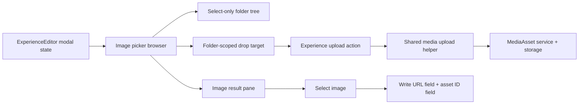

# feat: Add admin image picker media library browser

## Overview

Replace the experience editor's flat image picker list with a compact,
selection-focused media library browser. The picker should adapt the existing
`/dashboard/media` mental model: folders on the left, images on the right,
global search across the full image library, and drag/drop upload into the
selected folder. Folder management stays in `/dashboard/media`.

## Problem Frame

Editors can already open an image picker from exposed experience block image
controls, but it only renders a flat in-memory list and dead-end empty state.
The origin requirements define a richer picker that helps editors find or add
managed images without leaving the experience editor, while keeping full media
management out of the picker (see origin:
`docs/brainstorms/2026-07-07-admin-image-picker-media-library-browser-requirements.md`).

## Requirements Trace

- R1. The picker presents folder/path navigation on the left and image assets on
  the right.
- R2. The picker reuses the media library's folder hierarchy and root `Library`
  concept.
- R3. The picker exposes no folder create, rename, move, reorder, or delete
  actions.
- R4. Picker asset operations are limited to browse, search, upload, preview,
  select, and close.
- R5. Picker results are image-only.
- R6. Search always runs globally across the image library.
- R7. Search results show folder/path context.
- R8. Clearing search restores the selected folder's direct image contents.
- R9. Empty states distinguish empty folder, no search matches, and no ready
  image assets.
- R10. Drag/drop uploads image files into the selected folder.
- R11. Upload feedback names the target folder.
- R12. Newly uploaded ready images become available without leaving the editor.
- R13. Selection writes both preview URL and asset ID fields for the target
  block surface.
- R14. Existing clear/replace behavior remains intact.
- R15. Users without upload permission can browse/select but cannot upload.
- R16. Processing/failed assets do not look like missing ready content.
- R17. Closing the picker preserves unsaved editor state.

## Scope Boundaries

- Do not add folder creation, renaming, moving, reordering, or deletion inside
  the picker.
- Do not show PDFs, videos, or generic files in picker results.
- Do not replace or reduce the full `/dashboard/media` management route.
- Do not require changes in `apps/web`, `apps/mobile`, or `apps/tv`.
- Do not normalize every legacy image URL field in this feature.

### Deferred to Separate Tasks

- Expanding asset-library selection to every nested image-bearing item beyond
  the currently exposed section/container/card controls can follow once the
  extracted picker is stable.
- Legacy URL normalization and bulk asset-reference migration should remain a
  separate media-data task.

## Context & Research

### Relevant Code and Patterns

- `apps/admin/src/app/dashboard/media/page.tsx` already computes selected
  folder, breadcrumb path, search/filter behavior, and folder-scoped upload for
  the full media library route.
- `apps/admin/src/app/dashboard/media/folder-tree.tsx` provides the current
  folder tree, but it includes folder creation, renaming, folder drag/move, and
  asset move behavior. The picker should not reuse it directly unless those
  management concerns are extracted behind a clean read/select-only variant.
- `apps/admin/src/app/dashboard/media/media-asset-drop-target.tsx` provides
  drag/drop upload feedback with selected folder labels and permission-aware
  disabled behavior.
- `apps/admin/src/app/dashboard/media/media-asset-table.tsx` provides a table
  for the management route, including asset renaming and router-driven
  selection. The picker needs a selection-oriented image grid/list rather than
  management-table behavior.
- `apps/admin/src/app/dashboard/experiences/[id]/page.tsx` currently loads a
  flat `mediaLibrary` image array with `kind: "IMAGE"` and `status: "READY"`.
- `apps/admin/src/app/dashboard/experiences/experience-editor.tsx` owns
  `imagePickerTarget`, search state, and the block write that stores both the
  preview URL field and matching `*AssetId` field.
- `apps/admin/src/app/dashboard/ops-data.ts` contains `MediaFolderRow` and
  folder flattening/count logic used by the media route.
- `apps/admin/src/app/dashboard/experiences/experience-editor.test.tsx` uses
  raw React DOM and static markup tests for editor UI behavior.
- `apps/admin/src/app/dashboard/media/folder-tree-dnd.test.ts` covers reusable
  folder drag/drop helpers.

### Institutional Learnings

- `docs/solutions/platform/admin-media-storage-local-development.md`:
  `MediaAsset` is the editorial identity; preview/download URLs must come from
  admin-owned helpers rather than direct storage-path concatenation.
- `docs/solutions/platform/optional-railway-s3-local-fallback.md`: local media
  storage should work without Railway S3 credentials, and S3 mode is selected
  by the existing bucket-env toggle.
- `docs/solutions/best-practices/admin-experience-preview-cards-video-reference-images-20260423.md`:
  experience editor surfaces should avoid duplicating media data when an
  existing reference can hydrate the visual preview.

### External References

- Not used. The codebase already has direct local patterns for Next.js admin UI,
  media assets, folder-scoped uploads, permissions, and editor tests.

## Key Technical Decisions

- **Create picker-specific browser components instead of prop-suppressing the
  management tree/table:** `MediaFolderTree` and `MediaAssetTable` carry
  management responsibilities that are explicitly out of scope for the picker.
  Extract shared pure helpers where useful, but keep picker UI selection-first.
- **Keep ready images as the selectable set:** The current editor data load
  already filters to `status: "READY"`. The picker can separately surface
  counts or empty-state language for unavailable assets, but selection should
  remain ready-image-only unless implementation finds an existing disabled-row
  pattern that is cheap and clear.
- **Share upload behavior at the action/helper boundary:** The current media
  route upload action is page-local. Move reusable upload/register logic into a
  dashboard/media helper or action module so both `/dashboard/media` and the
  experience editor can upload through the same storage/service path.
- **Store browser state in the editor, not the URL:** The picker is modal state
  inside an unsaved editor session. Folder and query state should not navigate
  away from `/dashboard/experiences/[id]` or reset editor state.
- **Revalidate the current experience editor after upload:** Picker uploads need
  fresh image rows in the editor workflow, while `/dashboard/media` should keep
  its existing refresh behavior.
- **Do not preserve the current flat-list limit as search scope:** The existing
  editor loader takes a small recent slice. The picker must either load all
  ready image rows needed for client-side global search or use a server-backed
  search path that truly searches the full image library.

## Open Questions

### Resolved During Planning

- Which existing components should be extracted? Use shared pure data helpers
  and low-level upload/drop behavior, but build picker-specific select-only UI
  instead of directly reusing management-heavy tree/table components.
- Should uploads use the existing server action directly? No. Extract shared
  upload logic and expose an experience-page action that can revalidate the
  editor route and return the same simple `UploadActionResult` shape.
- Should processing images appear as disabled rows? Default to ready-image-only
  selection with clear empty states. Disabled processing rows are optional only
  if implementation can add them without complicating data loading or selection.

### Deferred to Implementation

- Exact component names and split points may change once the implementer touches
  the current media components.
- The final visual density of image cards should be refined against the existing
  editor modal dimensions.
- Whether to return picker-ready rows directly from upload or rely on
  `router.refresh()` depends on the cleanest server-action integration once
  implemented.

## High-Level Technical Design

> _This illustrates the intended approach and is directional guidance for review, not implementation specification. The implementing agent should treat it as context, not code to reproduce._

## Implementation Units

- [x] **Unit 1: Extract picker-ready media data shapes**

**Goal:** Replace the flat editor image list with data that can support folders,
folder paths, global search, ready-image filtering, and upload targets.

**Requirements:** R1, R2, R5, R6, R7, R8, R9, R16

**Dependencies:** None

**Files:**

- Create: `apps/admin/src/app/dashboard/media/media-library-browser-data.ts`
- Test: `apps/admin/src/app/dashboard/media/media-library-browser-data.test.ts`
- Modify: `apps/admin/src/app/dashboard/experiences/[id]/page.tsx`
- Modify: `apps/admin/src/app/dashboard/ops-data.ts`
- Test: `apps/admin/src/app/dashboard/experiences/experience-editor.test.tsx`

**Approach:**

- Introduce an editor-facing media browser payload that includes image assets,
  folders, selected/root folder metadata, and enough folder ancestry data to
  render path labels in search results.
- Keep the selectable asset query constrained to `kind: "IMAGE"` and
  `status: "READY"`.
- Replace the current `take: 80` flat-list behavior for picker search scope.
  The first implementation can use a well-bounded full ready-image load if the
  existing asset volume supports it; if not, implement server-backed picker
  search before claiming global search support.
- Reuse or move folder-flattening/path helper logic from the media route/data
  layer rather than duplicating ad hoc traversal in the editor component.
- Include `folderId`, `displayName`, `altText`, `mimeType`, formatted size,
  preview URL, updated label, and path label data on image rows.
- Avoid adding GraphQL/schema work; this is server-rendered admin dashboard data.

**Patterns to follow:**

- `apps/admin/src/app/dashboard/media/page.tsx` folder path and visible-row
  calculations.
- `apps/admin/src/app/dashboard/ops-data.ts` `MediaFolderRow` flattening.
- `apps/admin/src/services/media-asset.service.ts` `mediaAssetPreviewUrl`.

**Test scenarios:**

- Happy path: given nested folders and ready image rows, editor render data
  includes folder rows and image rows with folder IDs and preview URLs.
- Edge case: root/unfiled images use the root `Library` label/path.
- Edge case: non-image and non-ready assets are excluded from selectable image
  rows.
- Edge case: image rows without localized display names fall back to original
  filename or asset ID.
- Integration: global search data includes ready image rows outside the recent
  slice that the old picker would have omitted.

**Verification:**

- The editor can receive enough media data to render folder navigation and
  global search without additional client-side database access.

- [x] **Unit 2: Build select-only folder navigation for the picker**

**Goal:** Add a compact folder tree/browser component for modal use that lets
editors choose a folder without exposing management controls.

**Requirements:** R1, R2, R3, R8, R17

**Dependencies:** Unit 1

**Files:**

- Create: `apps/admin/src/app/dashboard/experiences/experience-editor/image-picker-folder-browser.tsx`
- Test: `apps/admin/src/app/dashboard/experiences/experience-editor/image-picker-folder-browser.test.tsx`
- Modify: `apps/admin/src/app/dashboard/experiences/experience-editor.tsx`

**Approach:**

- Implement a lightweight client component or extracted subcomponent that
  renders root `Library`, nested folders, direct image counts, and selected
  state.
- Preserve expand/collapse and keyboard navigation where practical, but omit
  create/rename/move/delete actions and DnD folder movement.
- Store selected folder ID in `ExperienceEditor` modal state so closing the
  picker does not navigate away or mutate unsaved block content.
- Reset or initialize selected folder predictably when a new picker target
  opens; do not reset unsaved blocks.

**Patterns to follow:**

- Visual density and folder labels from
  `apps/admin/src/app/dashboard/media/folder-tree.tsx`.
- Existing editor modal state management in
  `apps/admin/src/app/dashboard/experiences/experience-editor.tsx`.

**Test scenarios:**

- Happy path: rendering with nested folders shows `Library`, parent folder, and
  child folder options with selected state.
- Happy path: selecting a folder changes the visible folder selection callback
  without changing browser location.
- Edge case: no folders still shows the root `Library` option.
- Error path: the component exposes no create, rename, move, reorder, or delete
  controls in rendered markup.

**Verification:**

- The picker left pane supports folder selection only and cannot perform folder
  management actions.

- [x] **Unit 3: Add image result pane with global search**

**Goal:** Replace the flat filtered image list with a folder-aware image results
pane whose search always spans the full image library.

**Requirements:** R1, R4, R5, R6, R7, R8, R9, R13, R14, R16, R17

**Dependencies:** Units 1 and 2

**Files:**

- Create: `apps/admin/src/app/dashboard/experiences/experience-editor/image-picker-browser.tsx`
- Modify: `apps/admin/src/app/dashboard/experiences/experience-editor.tsx`
- Test: `apps/admin/src/app/dashboard/experiences/experience-editor.test.tsx`

**Approach:**

- Move image-picker modal body into a focused browser component that receives
  media browser data, selected folder ID, search query, target label, and
  callbacks for close/select/upload.
- When search is empty, show only direct ready images in the selected folder.
- When search is non-empty, ignore selected folder for filtering and search all
  ready images by display name, alt text, MIME type, asset ID, and path label.
- Show folder/path context in search results and omit or de-emphasize it in
  normal folder view.
- Preserve existing selection callback semantics so `ExperienceEditor` still
  writes `[urlField]: previewUrl` and `[assetField]: asset.id`.
- Make empty states specific: selected folder empty, no global search matches,
  and no ready images in the library.

**Patterns to follow:**

- Current `filteredImageLibrary` search fields in
  `apps/admin/src/app/dashboard/experiences/experience-editor.tsx`.
- Existing media route search behavior in
  `apps/admin/src/app/dashboard/media/page.tsx`, with the intentional picker
  difference that search is global.
- Existing editor modal styles and icon usage.

**Test scenarios:**

- Happy path: opening the picker renders folders on the left and images from
  the selected folder on the right.
- Happy path: searching while a nested folder is selected returns a matching
  image from a different folder and shows its folder path.
- Happy path: selecting an image updates the target block URL field and asset ID
  field.
- Edge case: clearing search returns to the selected folder's direct image
  contents.
- Edge case: an empty selected folder shows an upload-oriented empty state when
  uploads are permitted.
- Edge case: a search with no matches shows a no-results state distinct from an
  empty folder.
- Error path: image rows without preview URLs cannot be selected and do not
  corrupt block state.

**Verification:**

- The modal behaves like a compact image-only library browser and preserves the
  existing block image attach/replace flow.

- [x] **Unit 4: Share folder-scoped upload behavior with the picker**

**Goal:** Allow image files dropped into the picker to upload into the currently
selected folder and refresh the picker results without leaving the editor.

**Requirements:** R4, R10, R11, R12, R15, R17

**Dependencies:** Units 1-3

**Files:**

- Create: `apps/admin/src/app/dashboard/media/upload-media-asset-action.ts`
- Modify: `apps/admin/src/app/dashboard/media/page.tsx`
- Modify: `apps/admin/src/app/dashboard/media/media-asset-drop-target.tsx`
- Modify: `apps/admin/src/app/dashboard/experiences/[id]/page.tsx`
- Modify: `apps/admin/src/app/dashboard/experiences/experience-editor.tsx`
- Test: `apps/admin/src/app/dashboard/experiences/experience-editor.test.tsx`

**Approach:**

- Extract the reusable upload/register/storage/enrichment dispatch behavior from
  the media page's local `uploadMediaAssetAction` into a shared server helper or
  action module.
- Keep permission checks in the server path and preserve the existing
  `UploadActionResult` style consumed by `MediaAssetDropTarget`.
- Let `/dashboard/media` continue revalidating `/dashboard/media`.
- Add an experience editor upload action that calls the shared upload helper,
  passes the selected folder ID, and revalidates the current experience editor
  route or otherwise refreshes the server-provided media browser data.
- For picker drops, accept image files as the intended path. If the shared
  helper still supports other MIME kinds for `/dashboard/media`, ensure the
  picker either filters dropped files to images before upload or reports
  non-image drops as unsupported for this picker.
- Reuse `MediaAssetDropTarget` if its copy can be made picker-appropriate via
  props; otherwise extract a generic drop-shell and keep media-route wording
  separate from picker wording.

**Execution note:** Add characterization coverage for the existing
`MediaAssetDropTarget` behavior before changing its public props if the
implementation needs to refactor it.

**Patterns to follow:**

- Existing upload action in `apps/admin/src/app/dashboard/media/page.tsx`.
- Storage boundary in `apps/admin/src/storage/media.ts` and
  `docs/solutions/platform/admin-media-storage-local-development.md`.
- Toast behavior in `apps/admin/src/app/dashboard/media/media-asset-drop-target.tsx`.

**Test scenarios:**

- Happy path: dropping one image with a selected folder submits a form data
  payload containing that `folderId`.
- Happy path: successful upload refreshes picker data and shows the selected
  folder in feedback text.
- Edge case: dropping into root omits `folderId` and labels the destination as
  `Library`.
- Error path: a user without upload permission sees upload disabled/blocked but
  can still browse and select existing images.
- Error path: non-image files dropped into the picker are rejected or ignored
  with clear feedback.
- Integration: the media route still supports its existing upload behavior after
  the shared upload extraction.

**Verification:**

- Drag/drop upload works inside the picker for image files and keeps folder
  destination semantics consistent with `/dashboard/media`.

- [x] **Unit 5: Polish integration, permissions, and regression coverage**

**Goal:** Finish the picker as a coherent editor workflow with focused tests,
clear permission states, and roadmap/doc alignment.

**Requirements:** All requirements, especially R3, R9, R15, R17

**Dependencies:** Units 1-4

**Files:**

- Modify: `apps/admin/src/app/dashboard/experiences/experience-editor.tsx`
- Modify: `apps/admin/src/app/dashboard/experiences/experience-editor.test.tsx`
- Modify: `docs/roadmap/platform/feat-236-admin-image-picker-media-library-browser.md`

**Approach:**

- Ensure modal focus/close behavior remains consistent with the existing picker
  and does not drop unsaved block edits.
- Keep `canUpload` or equivalent permission state explicit in the editor props
  rather than inferring it client-side.
- Confirm no picker UI text or controls imply folder management is available.
- Keep styling aligned with admin dashboard surfaces: compact, work-focused,
  and not card-heavy beyond image result tiles.
- Update the roadmap ticket to `complete` only after implementation and
  validation have passed.

**Patterns to follow:**

- Existing `ExperienceEditor` modal close behavior and toast usage.
- Existing permission checks via `hasPermission` in dashboard pages.
- Roadmap status rules in `CLAUDE.md`.

**Test scenarios:**

- Happy path: replacing an existing image uses the same picker and updates only
  the targeted block image fields.
- Edge case: closing the picker after changing folder/search state leaves
  unsaved editor content intact.
- Edge case: rendered picker markup contains no folder management labels or
  controls such as create, rename, move, reorder, or delete.
- Error path: upload-disabled users still see selectable image results.
- Integration: section, container, and card image controls all open the same
  browser and attach through their correct URL/asset field pair.

**Verification:**

- The full editor workflow satisfies the success criteria from the origin
  requirements and the feature ticket can be marked complete.

## System-Wide Impact

- **Interaction graph:** The main entry point is
  `ExperienceEditor` image controls. The picker uses server-provided media
  browser data, an upload action, storage helpers, and the existing
  `MediaAsset` service.
- **Error propagation:** Upload failures should return typed action results and
  surface as picker toasts/messages; selection failures should be prevented by
  disabling unselectable rows.
- **State lifecycle risks:** The modal must not navigate the page or reset
  unsaved editor state while changing folders/search/upload state.
- **API surface parity:** No public GraphQL or consumer app API changes are
  planned. This is an admin dashboard/server-action change.
- **Integration coverage:** Tests should cover editor selection and upload
  behavior across component/server-action boundaries where practical.
- **Unchanged invariants:** Media preview URLs continue to come from
  `mediaAssetPreviewUrl`; block renderers continue using stored URL fields
  while asset IDs provide managed references.

## Risks & Dependencies

| Risk                                                           | Mitigation                                                                                                                                                                                               |
| -------------------------------------------------------------- | -------------------------------------------------------------------------------------------------------------------------------------------------------------------------------------------------------- |
| Accidentally pulling folder management into the picker         | Use picker-specific select-only folder UI and add regression assertions that management controls are absent.                                                                                             |
| Upload refactor breaks `/dashboard/media`                      | Extract shared upload logic behind the existing result shape and include a media-route regression scenario.                                                                                              |
| Picker search feels scoped because the folder remains selected | Treat non-empty search as global in filtering and show folder/path labels on every search result.                                                                                                        |
| `router.refresh()` loses unsaved editor state                  | Keep folder/search state client-local and verify refresh behavior against the existing editor state model; if risky, return picker-ready upload rows from the action instead of relying only on refresh. |
| Large image libraries make full client-side loading expensive  | Use a server-backed picker search/list path if current asset volume makes full ready-image loading too costly; do not ship a "global" search that only searches a recent slice.                          |

## Documentation / Operational Notes

- No external operator docs are required for the first implementation.
- Keep `docs/roadmap/platform/feat-236-admin-image-picker-media-library-browser.md`
  synchronized with implementation status.
- If implementation discovers that pagination or virtualization is needed for
  large libraries, create a follow-up roadmap ticket rather than expanding this
  PR.

## Sources & References

- **Origin document:** [docs/brainstorms/2026-07-07-admin-image-picker-media-library-browser-requirements.md](../brainstorms/2026-07-07-admin-image-picker-media-library-browser-requirements.md)
- **Roadmap ticket:** [docs/roadmap/platform/feat-236-admin-image-picker-media-library-browser.md](../roadmap/platform/feat-236-admin-image-picker-media-library-browser.md)
- Related code: `apps/admin/src/app/dashboard/media/page.tsx`
- Related code: `apps/admin/src/app/dashboard/media/folder-tree.tsx`
- Related code: `apps/admin/src/app/dashboard/media/media-asset-drop-target.tsx`
- Related code: `apps/admin/src/app/dashboard/experiences/experience-editor.tsx`
- Related code: `apps/admin/src/app/dashboard/experiences/[id]/page.tsx`
- Related learning: `docs/solutions/platform/admin-media-storage-local-development.md`
