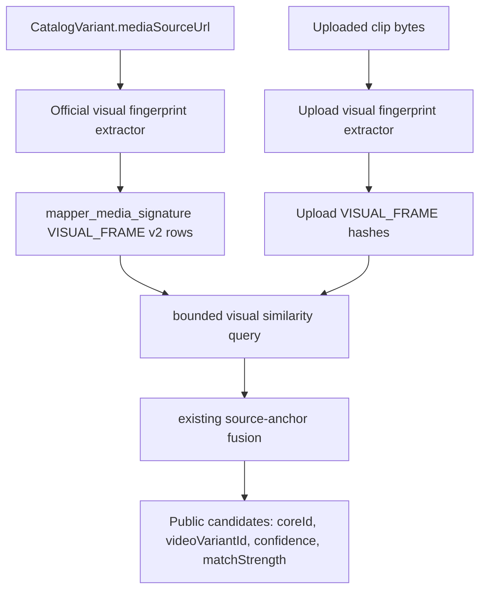
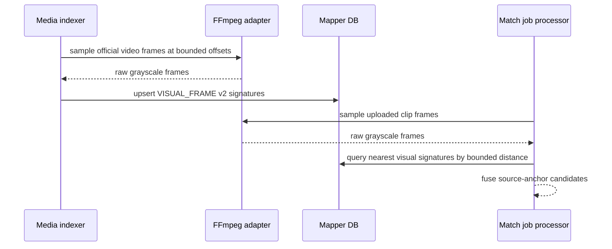

# feat: Add yt-mapper v2 visual fingerprints

## Goal Capsule

| Field             | Value                                                                                                                                                                                                                                            |
| ----------------- | ------------------------------------------------------------------------------------------------------------------------------------------------------------------------------------------------------------------------------------------------ |
| Objective         | Make the yt-video-mapper identify arbitrary raw JFP clips through deterministic v2 visual frame fingerprints, while the existing v1 structural index continues running as a compatibility baseline.                                              |
| Authority         | `docs/roadmap/content-discovery/feat-232-yt-video-mapper-arbitrary-raw-clip-matching.md`, current `apps/yt-video-mapper-backend` matcher/indexer code, and the production finding that catalog sync alone leaves `mapper_media_signature` empty. |
| Execution profile | Deep backend/media feature across extraction, indexing, retrieval, tests, and production reindex operations.                                                                                                                                     |
| Stop conditions   | Stop if the runtime cannot provide FFmpeg in deployed environments, if media URL safety cannot be preserved for FFmpeg inputs, or if the implementation would require direct Admin database access at match time.                                |
| Tail ownership    | `ce-work` implements vertical slices, `ce:review` reviews, `ce:compound` records durable learnings, then production reindex can be rerun with `official-media-signature-v2`.                                                                     |

---

## Product Contract

### Summary

Users will upload arbitrary clips containing JFP footage. The clips may be cut
from the middle of a source film, transcoded, resized, muted, and stripped of
metadata. The mapper must identify the source `coreId` from media content
alone, without requiring subtitles, filenames, timing offsets, or audio.

### Problem Frame

The current production API can accept raw and multipart uploads, and production
catalog sync has populated mapper-owned `CatalogVideo` and `CatalogVariant`
rows. The current v1 media indexer can create deterministic structural
signatures, but those are byte-sample and metadata hints. They do not decode
video frames, so they are not reliable for random middle clips or transformed
clips.

### Requirements

- R1. Define a v2 media fingerprint contract distinct from
  `official-media-signature-v1` structural hints.
- R2. Extract deterministic visual frame fingerprints from uploaded video
  bytes without requiring audio, subtitles, filenames, or user timing metadata.
- R3. Extract deterministic visual frame fingerprints from official catalog
  media and store them as `VISUAL_FRAME` `MediaSignature` rows.
- R4. Preserve v1 indexing and matching behavior so the currently running v1
  production index remains useful while v2 is built.
- R5. Retrieve v2 visual candidates by similarity-ranked bounded candidate
  generation, not by taking arbitrary first rows.
- R6. Keep source-video confidence separate from variant confidence:
  visual-only evidence may strongly identify `coreId` without overclaiming a
  `videoVariantId`.
- R7. Keep zero-candidate jobs terminal: no-match uploads still complete with
  `candidates: []`.
- R8. Tests prove the v2 contract, visual hash distance scoring, no-audio
  upload behavior, v1/v2 version isolation, and raw middle-clip candidate
  retrieval from seeded v2 signatures.
- R9. Production rollout can run v1 indexing now and rerun full indexing with
  `MEDIA_SIGNATURE_ALGORITHM_VERSION=official-media-signature-v2` after v2
  lands.

### Acceptance Examples

- AE1. Given an uploaded clip with no audio and no metadata, when its sampled
  visual fingerprints match seeded official v2 frame signatures for a source
  video, then the matcher returns that `coreId`.
- AE2. Given an uploaded clip whose visual fingerprints have no close official
  matches, when the job is processed, then polling returns `status: "complete"`
  with `candidates: []`.
- AE3. Given v1 structural signatures and v2 visual signatures in the same
  database, when the matcher runs with the v2 algorithm version, then only v2
  signatures participate in v2 candidate retrieval.
- AE4. Given multiple official variants under the same `coreId`, when only
  visual evidence is present, then the source is favored while variant
  confidence remains lower than audio/text-supported variant attribution.

### Deferred to Follow-Up Work

- Audio landmark extraction is deferred until the visual pipeline is proven
  end to end.
- Full labeled evaluation corpus work remains tied to YTM-006, but this plan
  adds the hooks and seed-style tests needed for it.
- Public evidence expansion is out of scope; the API still returns public
  candidates only.

---

## Planning Contract

### Key Technical Decisions

- KTD1. Keep `official-media-signature-v1` running and introduce
  `official-media-signature-v2` alongside it. Version coexistence keeps the
  current production indexing work valuable and avoids destructive replacement.
- KTD2. Use FFmpeg as the video decode boundary, but hide it behind an
  injectable adapter. The local Codex environment may not have FFmpeg, while
  production Nixpacks includes it; tests should exercise command construction,
  raw-frame parsing, and hash math without requiring the binary.
- KTD3. Start with visual average/perceptual-style frame hashes stored as
  `VISUAL_FRAME` signatures. The precise algorithm can evolve under the v2
  contract, but stored payloads must include `kind`, hash value, frame
  dimensions, and extraction offset.
- KTD4. Use bounded similarity candidate generation before fusion. The current
  matcher loads all signatures for v1; v2 retrieval should query visual
  signatures and rank by Hamming distance or hash-token overlap before Node
  fusion sees candidates.
- KTD5. Keep Admin as source of truth only for catalog sync. Matching and
  indexing operate on mapper-owned projection rows and media URLs already
  synced into the mapper database.

### Existing Patterns

- `apps/yt-video-mapper-backend/src/services/media-signature-extraction.ts`
  owns official signature payload creation.
- `apps/yt-video-mapper-backend/src/services/upload-signal-extraction.ts`
  owns upload-side signal extraction and version tagging.
- `apps/yt-video-mapper-backend/src/services/media-indexing.ts` owns
  `IndexRun` state, indexable variant selection, safe media fetch failures,
  and signature upserts.
- `apps/yt-video-mapper-backend/src/services/media-signature-matcher.ts`
  owns repository-backed matching and fusion.
- `docs/solutions/architecture-patterns/mapper-arbitrary-raw-clip-fingerprinting-pattern.md`
  captures the source-anchor and bounded-candidate pattern for this work.
- Root media guidance in `CLAUDE.md` says FFmpeg binary smoke matters for media
  features; local unit tests should still avoid requiring the binary.

### Assumptions

- Deployed yt-video-mapper builds have FFmpeg available through
  `nixpacks.toml`.
- The first v2 production rollout can focus on visual source attribution; audio
  landmarks can land after v2 visual indexing is proven.
- Existing `mapper_media_signature.signature` JSONB storage is sufficient for
  v2 payloads; no migration is required for the first slice.

---

## High-Level Technical Design

---

## Implementation Units

### U1. V2 visual fingerprint contract and hash math

- **Goal:** Add the v2 visual signature payload contract and deterministic
  visual hash utilities without touching runtime FFmpeg yet.
- **Requirements:** R1, R4, R8, AE3
- **Dependencies:** None
- **Files:** `apps/yt-video-mapper-backend/src/services/visual-fingerprint.ts`, `apps/yt-video-mapper-backend/src/services/visual-fingerprint.test.ts`, `apps/yt-video-mapper-backend/src/services/media-signature-extraction.ts`, `apps/yt-video-mapper-backend/src/services/media-signature-extraction.test.ts`
- **Approach:** Introduce a small visual fingerprint module that turns a fixed
  grayscale frame grid into a stable hex hash and exposes Hamming distance
  scoring. Add v2 payload parsing helpers near media signature extraction so
  official and upload paths share the same payload shape.
- **Execution note:** Start with focused unit tests for stable hash output,
  Hamming distance ordering, and malformed payload rejection before wiring the
  matcher.
- **Patterns to follow:** Existing structural payload tests in
  `media-signature-extraction.test.ts`; existing retrieval score tests in
  `retrievers.test.ts`.
- **Test scenarios:** Identical grayscale frames produce identical hashes.
  Slightly different frames produce non-zero Hamming distance. Invalid frame
  dimensions or byte counts fail safely. V1 structural extraction remains
  unchanged when the v1 algorithm version is used.
- **Verification:** Unit tests pass without an FFmpeg binary.

### U2. FFmpeg visual frame adapter and upload extraction

- **Goal:** Decode uploaded video bytes into v2 visual fingerprints through an
  injectable FFmpeg boundary.
- **Requirements:** R2, R4, R7, R8, AE1, AE2, AE3
- **Dependencies:** U1
- **Files:** `apps/yt-video-mapper-backend/src/services/ffmpeg-visual-frame-extraction.ts`, `apps/yt-video-mapper-backend/src/services/ffmpeg-visual-frame-extraction.test.ts`, `apps/yt-video-mapper-backend/src/services/upload-signal-extraction.ts`, `apps/yt-video-mapper-backend/src/services/upload-signal-extraction.test.ts`, `apps/yt-video-mapper-backend/src/server.ts`
- **Approach:** Add a frame extractor that writes upload bytes to a temporary
  file, invokes FFmpeg through an injectable command runner, reads bounded raw
  grayscale frame output, and converts those frames to v2 hashes. Wire upload
  extraction to use v2 only when the configured algorithm version is v2; keep
  v1 byte-sample extraction as the default.
- **Execution note:** Unit-test the adapter with a fake runner that returns raw
  frame bytes; do not require local FFmpeg for normal tests.
- **Patterns to follow:** Existing `FileSystemUploadStorage` temporary-file
  safety style; `SafeMatchJobError` handling for safe extraction failures.
- **Test scenarios:** A fake FFmpeg output with two 8x8 grayscale frames emits
  two visual hashes with offsets. Empty or malformed FFmpeg output returns no
  visual hashes without fake audio. V2 upload extraction still preserves the
  complete/no-candidates contract. V1 upload extraction remains byte-sample
  compatible.
- **Verification:** Upload extraction tests pass locally without FFmpeg.

### U3. Official v2 visual indexing

- **Goal:** Make `index:media` write official v2 `VISUAL_FRAME` signatures for
  indexable catalog variants.
- **Requirements:** R3, R4, R8, R9, AE3
- **Dependencies:** U1, U2
- **Files:** `apps/yt-video-mapper-backend/src/services/media-indexing.ts`, `apps/yt-video-mapper-backend/src/services/media-indexing.test.ts`, `apps/yt-video-mapper-backend/src/services/media-signature-extraction.ts`, `apps/yt-video-mapper-backend/src/services/media-signature-extraction.test.ts`, `apps/yt-video-mapper-backend/src/scripts/index-media.ts`
- **Approach:** Pass the source media URL into the official extractor for v2
  and let the FFmpeg adapter sample frames at bounded offsets. Keep v1 using
  the current bounded byte fetcher. Store one `VISUAL_FRAME` signature per
  sampled frame, keyed by `coreId + videoVariantId + signatureType +
algorithmVersion + offsetMilliseconds`.
- **Execution note:** Preserve per-variant safe failure behavior; one bad media
  URL must not fail the whole index run.
- **Patterns to follow:** Existing `MediaIndexingService.indexVariant`
  per-variant failure handling and `upsertMediaSignatures` idempotence.
- **Test scenarios:** V2 indexer stores visual signatures and does not store v1
  structural hints for v2 runs. V1 indexer behavior is unchanged. Failed FFmpeg
  extraction is summarized as a bounded per-variant failure. Re-running the
  same v2 index skips already indexed variants.
- **Verification:** Media indexing tests prove v1/v2 coexistence and resumable
  behavior.

### U4. Bounded visual candidate generation

- **Goal:** Retrieve v2 visual candidates by ranked similarity before fusion.
- **Requirements:** R5, R6, R8, AE1, AE2, AE3, AE4
- **Dependencies:** U1, U3
- **Files:** `apps/yt-video-mapper-backend/src/services/media-signature-matcher.ts`, `apps/yt-video-mapper-backend/src/services/media-signature-matcher.test.ts`, `apps/yt-video-mapper-backend/src/services/retrieval/visual-retriever.ts`, `apps/yt-video-mapper-backend/src/services/retrieval/retrievers.test.ts`
- **Approach:** Add a repository path for v2 visual candidate generation that
  filters `VISUAL_FRAME` signatures by algorithm version and returns a bounded
  similarity-ranked shortlist. Use Hamming distance to score upload hashes
  against official frame hashes, then hand the shortlist to the existing fusion
  scorer as source-anchor evidence.
- **Execution note:** Do not keep the v2 steady-state path as a full
  `findMany` over every signature; tests should prove ordering by similarity.
- **Patterns to follow:** Existing source-anchor fallback behavior in
  `MediaSignatureMatcher`; composite `coreId + videoVariantId` retrieval keys.
- **Test scenarios:** An exact v2 visual hash match ranks first. A near match
  outranks a farther match. Shared `videoVariantId` under different `coreId`
  values does not merge. Visual-only evidence returns the expected source
  candidate while variant confidence remains conservative.
- **Verification:** Matcher and retriever tests pass with seeded v2 signatures.

### U5. Evaluation hooks, docs, and production reindex path

- **Goal:** Add the operator path needed to validate v2 locally and rerun
  production indexing after merge.
- **Requirements:** R7, R8, R9, AE1, AE2
- **Dependencies:** U1, U2, U3, U4
- **Files:** `docs/roadmap/content-discovery/feat-232-yt-video-mapper-arbitrary-raw-clip-matching.md`, `docs/solutions/architecture-patterns/mapper-arbitrary-raw-clip-fingerprinting-pattern.md`, `apps/yt-video-mapper-backend/README.md`
- **Approach:** Update docs with the v1-now/v2-next rollout: current v1 index
  can keep running, v2 requires `MEDIA_SIGNATURE_ALGORITHM_VERSION=official-media-signature-v2`
  and a full reindex, and production smoke must include a muted middle clip
  once fixture media is available.
- **Execution note:** Keep secrets, signed URLs, and raw media out of docs and
  final output.
- **Patterns to follow:** Current yt-mapper README operational notes and the
  existing roadmap verification format.
- **Test scenarios:** Documentation-only updates have no direct unit tests;
  command-level verification and smoke notes are sufficient.
- **Verification:** README and roadmap reflect the completed vertical slice and
  remaining audio/eval follow-ups.

---

## Verification Contract

| Gate                                                                                                                                                                                                                                                                                                                                    | Applies to        | Done signal                                                                                                                           |
| --------------------------------------------------------------------------------------------------------------------------------------------------------------------------------------------------------------------------------------------------------------------------------------------------------------------------------------- | ----------------- | ------------------------------------------------------------------------------------------------------------------------------------- |
| `pnpm --filter @forge/yt-video-mapper-backend test -- src/services/visual-fingerprint.test.ts src/services/ffmpeg-visual-frame-extraction.test.ts src/services/upload-signal-extraction.test.ts src/services/media-signature-extraction.test.ts src/services/media-signature-matcher.test.ts src/services/retrieval/retrievers.test.ts` | U1-U4             | Focused v2 extraction, payload, retrieval, and matcher tests pass.                                                                    |
| `pnpm --filter @forge/yt-video-mapper-backend test`                                                                                                                                                                                                                                                                                     | U1-U5             | Full backend test suite passes.                                                                                                       |
| `pnpm --filter @forge/yt-video-mapper-backend typecheck`                                                                                                                                                                                                                                                                                | U1-U4             | TypeScript accepts the new payload and adapter boundaries.                                                                            |
| `pnpm --filter @forge/yt-video-mapper-backend build`                                                                                                                                                                                                                                                                                    | U1-U4             | Production build succeeds with generated Prisma output.                                                                               |
| Production v1 index poll                                                                                                                                                                                                                                                                                                                | Current operation | `mapper_media_signature` count increases under `official-media-signature-v1`.                                                         |
| Production v2 reindex smoke                                                                                                                                                                                                                                                                                                             | After deploy      | Running the indexer with `official-media-signature-v2` creates `VISUAL_FRAME` rows and a known clip smoke returns a source candidate. |

---

## Definition of Done

- The existing v1 production media indexer is running and producing structural
  signatures.
- U1-U4 are implemented with tests and without requiring local FFmpeg for unit
  tests.
- V1 extraction/indexing/matching behavior remains compatible with the
  currently running index.
- V2 visual fingerprints can be generated from mocked FFmpeg frames, stored as
  official signatures, retrieved by ranked visual similarity, and fused into
  public candidates.
- Docs explain when to rerun full production indexing for v2 and what smoke
  evidence is still needed.
