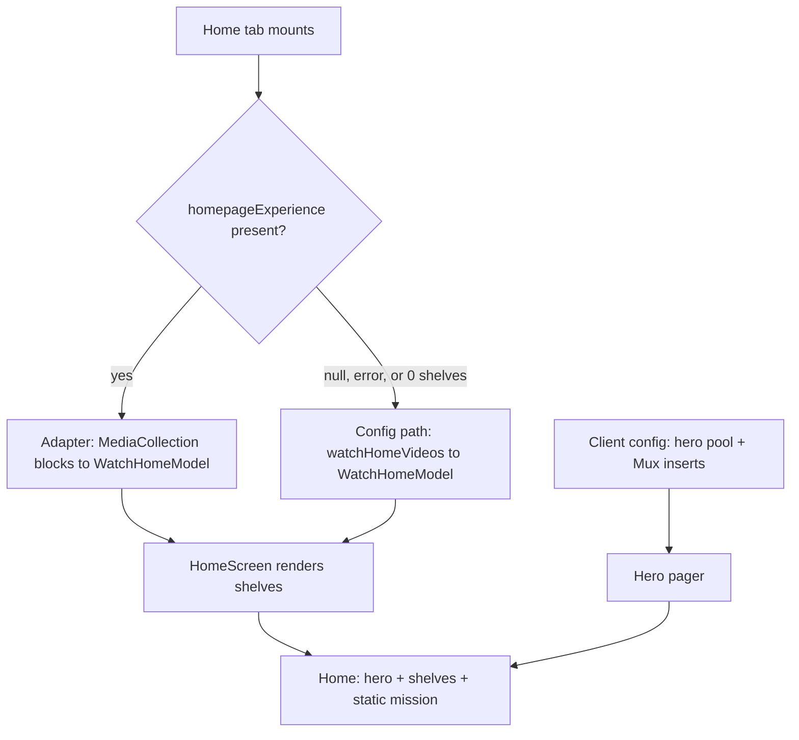
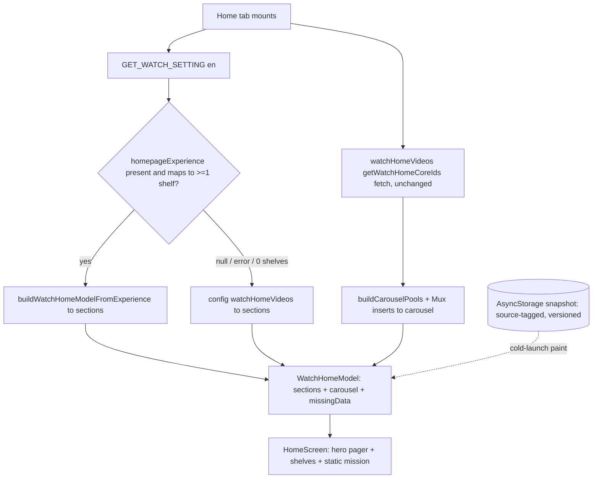

# Mobile Home Content Parity - Plan

## Goal Capsule

- **Objective:** Point the mobile Home tab's body at the single admin homepage Experience (`watch-home`) that web already renders, replacing the hardcoded curation mirror, while preserving the mobile-tuned layout and keeping the hero client-owned.
- **Product authority:** Urim (owns mobile).
- **Open blockers:** None. The canonical `watch-home` homepage Experience is already published in prod (verified 2026-07-08), so there is no rollout dependency. Two stale docs should be corrected as part of the work (U5) but they do not block planning.
- **Execution profile:** Standard depth, mobile-only (`apps/mobile`). Do not edit `apps/admin` or `packages/admin-graphql` — the required fields already exist in prod. Build the adapter test-first.
- **Stop conditions:** Surface a blocker rather than guessing if the live Experience diverges from the R1–R10 assumptions — an unmappable block type, items missing `videoSlug` at scale, or `collectionSize` not usable as a child count.

---

## Product Contract

### Summary

The mobile Home tab's body will render from the same single admin homepage Experience (`watch-home`) web uses, via an adapter that maps its `MediaCollection` blocks into the existing home shelf model — the tuned layout is untouched. The hero stays client-owned and mirrored from config; when the Experience is unavailable, today's config shelves render as a defensive fallback.

### Problem Frame

Mobile's Home tab is the last surface still curating home content in code. Its sections, ordering, hero pool, and inserts live in `apps/mobile/src/lib/watchHome/config.ts` — an adapted copy of web's `apps/web/src/lib/watch-home-config.ts` that must be hand-mirrored on every curation change (feat-172).

Web has since moved its home body onto a single admin homepage Experience, and that Experience is now published in prod. So web content is editor-controlled while mobile still needs a code change and an app-store release for any curation edit. The two homes drift the moment an editor touches admin.

Mobile already has the client machinery to consume admin blocks — it renders Experiences at `/experience/[slug]`. The Home tab simply isn't wired to the homepage Experience.

### Key Decisions

- **MediaCollection-body parity; hero stays client-owned.** Only the body's `MediaCollection` shelves move to the admin Experience. The hero pager keeps its config-owned pool, Mux inserts, and rotation — matching web, which also keeps its hero in code. Web declined to model hero rotation/pools/inserts in admin; matching that avoids new admin schema and a mobile-vs-web divergence. Non-`MediaCollection` blocks web renders (promos, CTAs, the mission `SectionBlock`) are not shown on mobile, so editor edits to those blocks do not reach mobile until the deferred mission/promo follow-up lands (R5).
- **Adapter, not the shared SDUI renderers.** Transform the Experience's `MediaCollection` blocks into the existing home model shape so `HomeScreen` and its shelves render unchanged. Routing the home through the `/experience/[slug]` renderers would impose the experience-page presentation and lose the fine-tuned home layout — the thing to preserve.
- **Config shelves as defensive fallback.** When the homepage Experience is null or the fetch errors, render today's config shelves. Given mobile's slow release cadence and the feat-172 "empty home in prod" history, safety wins over deletion. Because the Experience is already live in prod, this path is now edge/error-only, not the prod default.
- **Mission stays static; TV out of scope.** The mission section keeps its static content. TV home parity is tracked separately by feat-179.

### Actors

- A1. Content editor — authors and edits the `watch-home` homepage Experience in admin; wants curation changes to reach mobile without a code change or release.
- A2. Mobile viewer — opens the Home tab; should see the same `MediaCollection` shelf content as web, in the mobile layout (non-collection blocks are out of scope — see R5).
- A3. Mobile app — fetches the homepage Experience, adapts its blocks to the home model, renders; falls back to config on absence or error.

### Requirements

**Data source and rendering**

- R1. The mobile Home tab body renders from `watchSetting.homepageExperience` (locale `en`) — the same Experience web renders.
- R2. Each `MediaCollectionBlock` in the Experience renders as a home shelf, preserving the existing shelf presentation and the block order from the Experience. Each shelf's heading is the block's own admin-authored `title` (and `subtitle` where shown), not mobile's positional config title. A `MediaCollectionBlock` that resolves with zero items is skipped like an unsupported block type (R5); a sparsely-populated collection renders as-is (the shelf rail accommodates variable item counts).
- R3. The adapter maps each `MediaCollectionBlock` item to a home card using the item's `videoSlug` (navigation to `/watch/{videoSlug}`), `imageOverrideUrl` when present else `imageUrl` (thumbnail), and title/label overrides (`titleOverride` / `subtitleOverride` / `labelOverride`); when `titleOverride` is empty the card title falls back to `labelOverride` or a slug-derived label, never blank. Because items carry no `duration`, a card's meta line falls back to the video's label text (matching existing `buildMetaLabel` behavior) until admin adds `duration` to `MediaCollection` items — this is the launch behavior, not a fallback-only case.
- R4. The hero pager is unchanged: it sources its pool, Mux inserts, and rotation from the client config, independent of the Experience. The Experience's `WatchHomeHeroBlock` placeholder does not drive hero content.
- R5. Block types the home layout has no slot for (`SectionBlock`, promo/CTA/text blocks) are skipped without error, emitting a dev-mode warning (matching the existing `SectionDispatcher` / `ContentDispatcher` `__DEV__` `console.warn` convention) so a skipped block type is visible during development rather than silently dropped.

**Fallback and resilience**

- R6. When `watchSetting.homepageExperience` is null, the fetch fails, OR the Experience resolves but maps to zero renderable shelves (every block skipped per R5, or all collections empty), the Home body renders today's config-curated shelves; the hero renders in all cases.
- R7. The config path (fetch plus model build) stays fully functional as the fallback. The Experience path is additive, not a replacement. Because the mirror obligation narrows to hero-only, the fallback's body reflects last-release curation and will diverge from the live Experience over time; a test/CI guard exercises the fallback render path so it cannot bitrot silently.
- R11. The fallback is never silent: when the body reverts to config (null, fetch error, or zero renderable shelves), the app emits one structured log event with a reason (e.g. `[WatchHome] fallback reason=…`), so a prolonged prod fallback is observable rather than masked. A real telemetry sink is deferred — mobile has none today — so this is a structured `console.warn` for now.
- R12. The client config splits into a live-hero module and a frozen-body-fallback module: the frozen body slice is marked emergency-fallback-only and the "mirror any web curation change" instruction is removed, so no file presents live and frozen curation as interchangeable.

**Layout preservation**

- R8. The Home tab's structural layout is unchanged from today — the three-layer hero, the shelf presentation, the static mission section, and the macro sequence (hero → shelves → mission). Shelf-to-shelf order within the body comes from the Experience (R2), not from today's fixed config order. No experience-page presentation leaks into the home.

**Rendering states and resilience**

- R9. While the Experience is fetching, the Home paints immediately from the last-good snapshot (or the config shelves when no snapshot exists) and reconciles to the resolved Experience content in place — no blank state or skeleton flash on the landing tab, and no visible reflow on resolve.
- R10. The Experience path preserves the existing snapshot / stale-while-revalidate cold-launch behavior: it persists the adapted `WatchHomeModel` and re-hydrates it on cold launch so the Home paints instantly, and it never paints a full-empty body over a good snapshot.

### Data flow

The body has one source of truth (the admin Experience) with a config fallback; both branches produce the same `WatchHomeModel` shape. The hero always comes from config, never the Experience.

### Key Flows

- F1. Experience-first home render
  - **Trigger:** Home tab mounts.
  - **Steps:** Fetch `watchSetting.homepageExperience` (en); if present, adapt its `MediaCollection` blocks into the home model and render shelves; the hero renders from config in parallel.
  - **Outcome:** Admin-authored body plus client hero, in the mobile layout.
  - **Covered by:** R1, R2, R3, R4, R5, R8, R9, R10.
- F2. Fallback render
  - **Trigger:** `homepageExperience` is null, the fetch errors, or the Experience maps to zero renderable shelves (R6).
  - **Steps:** Build the home model from the config `watchHomeVideos` fetch (today's path) and render shelves; the hero is unchanged.
  - **Outcome:** Today's config-curated home; no empty state.
  - **Covered by:** R6, R7.

### Acceptance Examples

- AE1. **Covers R1, R2, R3, R5.** Given the prod `watch-home` Experience (hero + 8 `MediaCollection` blocks + a `SectionBlock`), When the Home tab loads, Then the body renders 8 shelves in Experience order with cards linking to `/watch/{videoSlug}`, and the `SectionBlock` is skipped.
- AE2. **Covers R6, R7.** Given `homepageExperience` is null or the fetch errors, When the Home tab loads, Then the config-curated shelves render and the hero renders normally.
- AE3. **Covers R4.** Given the Experience contains a `WatchHomeHeroBlock`, When the Home tab loads, Then hero content still comes from the client config and the block drives nothing.
- AE4. **Covers R5.** Given an editor adds a non-collection block (e.g. a promo) to the shared homepage Experience, When the Home tab loads, Then mobile skips it silently and the static mission section is unchanged.
- AE5. **Covers R2, R8.** Given `MediaCollection` blocks with variants `carousel`, `grid`, and `collection`, When rendered on mobile, Then each maps to the home shelf presentation (per the variant-to-orientation mapping resolved in planning), preserving the mobile layout.
- AE6. **Covers R5, R6.** Given a present `homepageExperience` whose blocks all skip (only `SectionBlock`/promo/CTA) or whose collections are all empty, When the Home tab loads, Then the body maps to zero shelves and the config-curated shelves render as the fallback — not an empty body.
- AE7. **Covers R9, R10.** Given a cold launch with a prior snapshot, When the Home tab mounts before `homepageExperience` resolves, Then the Home paints instantly from the snapshot and reconciles in place on resolve — no spinner, blank state, or reflow.

### Scope Boundaries

- Hero curation in admin (the "make the hero admin-driven" option) — out; the hero stays client-owned and mirrored.
- Mission section into admin — out; it stays static. The data already exists as the Experience's `SectionBlock` (`home-global-missions-promo`), which makes this a clean future follow-up.
- TV home parity — out; tracked by feat-179.
- Web changes — out; web already consumes the Experience.
- Full block-type parity / reusing the SDUI dispatcher in the home path — out (the reuse and hybrid approaches were declined).
- Removing the config entirely — out; its shelves half is retained as the fallback and its hero half remains the hero source.
- Non-`en` locales — out; the mobile home is English-only today.

### Dependencies / Assumptions

- The canonical `watch-home` homepage Experience is published in prod. Verified 2026-07-08 against `https://admin.jesusfilm.org/api/graphql`: `watchSetting(locale:"en").homepageExperience` returns slug `watch-home`, 10 blocks, and every `MediaCollection` item carries `videoSlug` and `imageUrl`. No feat-235 wait.
- Admin `MediaCollectionBlock` items are flat and expose `videoId`, `videoSlug`, `titleOverride`, `subtitleOverride`, `labelOverride`, `imageUrl`, `imageOverrideUrl` (plus asset ids), `collectionSize`, and `linkToSectionKey`. There is no nested video join and no `duration` field.
- `watchSetting` and `experienceBySlug` are public admin queries (no bearer), so the home fetch needs no auth token.
- The mobile home stays English-only (`HOME_LOCALE = "en"`).

### Outstanding Questions

Planning resolved the technical deferrals: variant→shelf mapping (KTD4), the hero/body fetch seam (KTD3, U2), the duration-less card meta (KTD5), stale-docs cleanup (U5), and the day-one parity check (Verification Contract). These stay deferred and non-blocking:

- **Collection overflow / see-more.** `MediaCollectionBlock` items carry `collectionSize` and `linkToSectionKey`, implying a collection can hold more than the shelf shows with a path to the rest. v1 truncates to the shown items; a "see all" affordance is a follow-up.
- **Config fallback sunset.** The config fallback is retained indefinitely (R7). A sunset trigger (retire the body config after stable Experience-path telemetry) vs. keeping it as a permanent safety net is a later call; v1 keeps it.
- **Admin `duration` on MediaCollection items.** Optional follow-up so cards show exact durations again; admin-owned, admin-before-mobile if added.

### Sources / Research

- Prod verification (2026-07-08): `watchSetting(locale:"en").homepageExperience` returns slug `watch-home`, 10 blocks — `WatchHomeHeroBlock`, 8 `MediaCollectionBlock` (`carousel` / `grid` / `collection`), `SectionBlock` `home-global-missions-promo`; all `MediaCollection` items carry `videoSlug` + `imageUrl`. The 8 collections map 1:1 to mobile's current `WATCH_HOME_SECTIONS`.
- Web home (prior art): `apps/web/src/app/[locale]/[htmlLang]/page.tsx`, `apps/web/src/lib/content.ts` (`resolveHomepage`, `GET_WATCH_SETTINGS`), `apps/web/src/components/sections/index.tsx` (the `__typename` switch), `apps/web/src/components/home/WatchHomeExperiencePage.tsx`.
- Mobile home (current, to change): `apps/mobile/app/(tabs)/index.tsx`, `apps/mobile/src/components/home/HomeScreen.tsx`, `apps/mobile/src/hooks/useWatchHome.ts`, `apps/mobile/src/lib/watchHome/config.ts` and `model.ts`, `apps/mobile/src/lib/queries.ts` (`GET_WATCH_HOME_VIDEOS`).
- Mobile SDUI (block fragment reused; not the home path): `apps/mobile/src/components/sections/SectionDispatcher.tsx`, `MediaCollectionRenderer.tsx`, `apps/mobile/src/contexts/ExperienceShell.tsx`.
- Shared item fragment: `packages/admin-graphql/src/fragments/blocks/media-collection.ts`.
- Related plans/tickets: `docs/plans/2026-07-06-001-watch-home-builder-authored-plan.md`, `docs/roadmap/topic-experiences/feat-172-mobile-home-watch-parity.md`, `docs/roadmap/platform/feat-160-watch-home-carousel-data-parity.md`, `docs/roadmap/platform/feat-235-watch-home-builder-production-rollout.md`.
- Institutional learnings: `docs/solutions/design-patterns/lean-bulk-lazy-per-item-graphql-fetch-20260604.md` (the dubs-guard / card-lean fetch law + admin-before-mobile ordering), `docs/solutions/design-patterns/asyncstorage-swr-snapshot-slow-admin-resolver.md` (the cold-launch snapshot + version-gate this plan extends), `docs/solutions/conventions/tv-mobile-clients-consume-only-public-admin-queries.md` (TV's identical parity move + the public-query SDL guard to mirror), `docs/solutions/integration-issues/expo-graphql-schema-drift-and-fragment-validation.md` (adapter-absorbs-shape-at-the-parse-site), `docs/solutions/architecture-patterns/mobile-admin-data-layer-cutover-pattern-20260525.md` (flat-video posture, `pickLocalizedName`, injection-safe `videoId`).

---

## Planning Contract

**Product Contract preservation:** unchanged by this enrichment — R1–R10, F1–F2, and AE1–AE7 are preserved. Planning resolves the technical items previously under Outstanding Questions as the Key Technical Decisions below.

### Key Technical Decisions

- KTD1. Adapter into `WatchHomeModel.sections`; reuse existing components. `buildWatchHomeModelFromExperience(blocks)` returns `WatchHomeSection[]` in the exact shape `buildWatchHomeModelFromVideos` produces (`apps/mobile/src/lib/watchHome/model.ts`), so `HomeScreen` and `HomeShelf` render unchanged. This is the "adapter absorbs schema shape at the parse site" posture — not routing the home through the SDUI `/experience/[slug]` renderers, which would impose the experience-page presentation.
- KTD2. Reuse `GET_WATCH_SETTING`; keep the home path card-lean. It already selects `homepageExperience { ...AdminWatchExperience }` and the fragment is imported in mobile (`apps/mobile/src/lib/queries.ts`); the fragment carries block metadata only, no `dubs`. Extend the `watchHomeQueries.test.ts` dubs-guard to assert the home path never selects `dubs` and uses only the public `watchSetting` / `experienceBySlug` queries (never the editor-gated `experiences`). No new query, no bearer.
- KTD3. Hero/body assembly seam. The carousel keeps the existing `watchHomeVideos(getWatchHomeCoreIds)` fetch **unchanged** — `buildCarouselPools` iterates `WATCH_HOME_PLAYLIST_SEQUENCE` and sweeps every fetched video for the short-films pool, so shrinking the id set would change the hero rotation. The split is at _assembly_, not the fetch: the `carousel` is built from that existing fetch while the body's `sections` come from the Experience; the Home assembles `{ sections, carousel, missingData }`. Do not introduce a hero-only id set. `useHeroStream`'s per-slide `GET_VIDEO_BY_SLUG` is unchanged.
- KTD4. Variant → shelf mapping. `mediaCollectionVariant` (aliased from the block's `variant`): `carousel` → `{ layout: "rail", orientation: "horizontal" }`, `grid` → `{ layout: "grid", orientation: "horizontal" }`, `collection` → `{ layout: "grid", orientation: "vertical" }`; an unrecognized or missing variant falls back to `grid` / `horizontal`. Reproduces today's per-section presentation (BibleProject Advent and Scripture-Spoken are the vertical/portrait shelves).
- KTD5. Card meta without `duration`. Items carry no `duration`, and `collectionSize` is a free-text **String** (e.g. `"61 chapters"`, `"25 items"`), not a count — do not map it to the numeric `childCount` (a String→number type error, and `"61 chapters" > 0` is false so "N episodes" would never render). Experience cards set `childCount = 0` and `durationSeconds = null`; `metaLabel` uses `collectionSize` verbatim when present (matching web's badge), else falls to the human `label` via `buildMetaLabel`. Image resolves `imageOverrideUrl ?? imageUrl`; localize `titleOverride` / `subtitleOverride` / `labelOverride` via `pickLocalizedName()`; sanitize `videoId` with the established `/^[a-zA-Z0-9_-]+$/` guard.
- KTD6. Snapshot the body source; bump the version gate. Persist the active body source in a **single** source-tagged snapshot under the existing key (Experience blocks when the last resolve was the Experience, config `videos` when it fell back) and rebuild via the matching builder on cold launch — one entry at a time, so the cold-launch paint matches whatever the live path will resolve to (no config→Experience reflow). Bump `WATCH_HOME_SNAPSHOT_VERSION` (the shape changes); on the first launch after release the old version-1 snapshot is discarded, so set `GET_WATCH_SETTING` `cache-first` on initial and accept a one-time paint-from-network on that launch (optionally migrate the v1 `videos` snapshot into the tagged shape). Keep the never-paint-empty guards at both layers and the `networkLandedRef` / `cancelled` race guards.
- KTD7. Zero renderable shelves → config fallback. An Experience that is present but maps to zero shelves (all blocks skipped, or all collections empty) triggers the config fallback alongside null and fetch-error.

### High-Level Technical Design

The body's `sections` come from the Experience with a config fallback; the hero `carousel` is always built from the existing (unchanged) config fetch; the snapshot paints instantly on cold launch and reconciles in place.

### Assumptions

- The prod `watch-home` Experience keeps its verified shape (hero placeholder + `MediaCollection` blocks + a promo `SectionBlock`); items keep `videoSlug` + `imageUrl` populated.
- The block-level `MediaCollectionBlock` fields the adapter reads exist on the shared fragment: `title`, `subtitle`, `categoryLabel`, `showItemNumbers`, and `mediaCollectionVariant` (aliased from `variant`).
- `collectionSize` is a free-text String badge (e.g. `"61 chapters"`), not a numeric count — rendered verbatim, never coerced to `childCount` (KTD5). Confirm the live values read acceptably as a badge in U1.
- No new admin/backend field this scope; `duration` on `MediaCollection` items is deferred.

### Sequencing

U1 (adapter) and U2 (hero/body seam) are independent and can land in parallel. U3 (Experience wiring + fallback) depends on both. U4 (snapshot) and U5 (guards + docs) depend on U3.

---

## Implementation Units

### U1. Block→Home-Model adapter

- **Goal:** A pure `buildWatchHomeModelFromExperience(blocks, { languageSlug })` mapping the homepage Experience's `MediaCollectionBlock`s into `WatchHomeSection[]` (the shape `HomeShelf` already consumes).
- **Requirements:** R2, R3, R5, R8.
- **Dependencies:** none.
- **Files:** `apps/mobile/src/lib/watchHome/experienceAdapter.ts` (new), `apps/mobile/src/lib/watchHome/__tests__/experienceAdapter.test.ts` (new).
- **Approach:** Iterate `blocks`. For each `MediaCollectionBlock`: build a `WatchHomeSection` with `eyebrow`/`title` from `pickLocalizedName(categoryLabel)` / `pickLocalizedName(title)` (empty title → fall to `categoryLabel`, else omit the heading; subtitle → `description`), `layout`+`orientation` from `mediaCollectionVariant` per KTD4 (unknown/missing → `grid`/`horizontal`), `showSequenceNumbers` from `showItemNumbers`, and `cards` from `items[]`. Per item → `WatchHomeCard`: `slug`=`videoSlug`, `imageUrl`=`imageOverrideUrl ?? imageUrl`, `title`/`label` from localized `titleOverride`/`labelOverride`, `childCount`=0, `durationSeconds`=null, `metaLabel`=`collectionSize` verbatim when present else `buildMetaLabel({ label, durationSeconds: null, childCount: 0 })`. Drop an item whose `videoSlug` is null/empty (it can't navigate). Skip a `MediaCollectionBlock` with zero renderable items. Skip any non-`MediaCollectionBlock`; emit `if (__DEV__) console.warn("[WatchHomeAdapter] skipped block type: …")` for unexpected types, but **not** for the expected `WatchHomeHeroBlock` placeholder (mirrors `SectionDispatcher`'s known-but-unrendered cases). Sanitize `videoId`.
- **Patterns to follow:** `buildWatchHomeModelFromVideos` / `buildMetaLabel` in `apps/mobile/src/lib/watchHome/model.ts`; flat-video posture + `pickLocalizedName()` per `apps/mobile/CLAUDE.md`; the `__DEV__` warn in `apps/mobile/src/components/sections/SectionDispatcher.tsx`.
- **Test scenarios:**
  - Covers R2, R3. A `carousel` block with 3 items → one rail/landscape section with 3 cards; card `slug`=`videoSlug`, `imageUrl`=`imageOverrideUrl` when present else `imageUrl`, `title`=localized `titleOverride`.
  - Covers AE5. `carousel`→rail/landscape, `grid`→grid/landscape, `collection`→grid/portrait; unknown/missing variant → grid/landscape.
  - Covers AE4, R5. A `SectionBlock` (or promo/CTA) → skipped, `__DEV__` warn emitted, absent from output.
  - Covers AE3. A `WatchHomeHeroBlock` → skipped/ignored with **no** `__DEV__` warn (expected placeholder).
  - Empty / sparse collection: a block with 0 items → skipped; a block with 1–2 items → a section with exactly that many cards, no padding.
  - Item missing `videoSlug` → dropped; the collection's remaining valid cards still render.
  - Meta label: `collectionSize`=`"25 items"` → `metaLabel`=`"25 items"` verbatim; `collectionSize` null → `metaLabel` falls to `label`.
  - Image precedence: `imageOverrideUrl` present → used; absent → `imageUrl`.
- **Verification:** Adapter unit tests green; output type-matches `WatchHomeSection[]`.

### U2. Hero/body fetch seam

- **Goal:** Split the model's `carousel` (hero) from the body at _assembly_ so U3 can change the body source without touching the hero.
- **Requirements:** R4, R7.
- **Dependencies:** none (independent of U1).
- **Files:** `apps/mobile/src/hooks/useWatchHome.ts`, `apps/mobile/src/hooks/__tests__/useWatchHome.test.ts`.
- **Approach:** Refactor `useWatchHome` so the `carousel` is built from the existing `watchHomeVideos(getWatchHomeCoreIds)` fetch **unchanged** — do NOT introduce a hero-only id set, because `buildCarouselPools` sweeps every fetched video for the short-films pool, so a narrower fetch would change the hero rotation. The body's `sections` still come from that same fetch this unit (config path) — no user-visible change; U3 swaps only the body source. Preserve the snapshot and race guards.
- **Execution note:** Characterization-first — snapshot the hero queue and shelves and assert they are identical before and after the refactor.
- **Test scenarios:**
  - The carousel builds from the unchanged `getWatchHomeCoreIds` fetch; hero queue and body shelves are identical to pre-refactor (characterization).
- **Verification:** Home renders identically — hero pager + shelves — with no visual change.

### U3. Experience-first wiring + zero-shelf fallback

- **Goal:** The Home body renders from the homepage Experience when present, else the config shelves.
- **Requirements:** R1, R6, R11.
- **Dependencies:** U1, U2.
- **Files:** `apps/mobile/src/hooks/useWatchHome.ts`, `apps/mobile/src/lib/watchHome/logWatchHomeFallback.ts` (new — structured console helper, R11), `apps/mobile/src/hooks/__tests__/useWatchHome.test.ts`.
- **Approach:** In `useWatchHome`, fetch `GET_WATCH_SETTING({ locale: HOME_LOCALE })` and read `watchSetting.homepageExperience`. If present, run the U1 adapter → `sections`; when `sections.length >= 1`, assemble `{ sections, carousel: <U2 hero>, missingData }`. When `homepageExperience` is null, the fetch errors, or `sections.length === 0`, fall back to the config body (existing path) and call `logWatchHomeFallback({ reason })` once (R11). The hero always renders from the U2 fetch. Show loading only when the model is null (no flash).
- **Test scenarios:**
  - Covers AE1. `homepageExperience` with hero + 8 collections + a `SectionBlock` → 8 shelves in Experience order, `SectionBlock` skipped, cards link to `/watch/{videoSlug}`.
  - Covers AE2, AE6, R6. `homepageExperience` null → config shelves; present-but-zero-shelves → config shelves; fetch error → config shelves; hero renders in all cases.
  - Covers R11. Each fallback branch emits exactly one `logWatchHomeFallback` event carrying the reason; the Experience-success path emits none.
  - Present + ≥1 shelf → body from Experience (not config).
- **Verification:** In the forge-watch dev client against prod admin, the Home body renders the admin-authored shelves; forcing null/empty falls back to config.

### U4. Loading state + snapshot for the Experience body

- **Goal:** Cold launch paints instantly and reconciles in place; the Experience body survives across launches.
- **Requirements:** R9, R10.
- **Dependencies:** U3.
- **Files:** `apps/mobile/src/lib/watchHomePersistence.ts`, `apps/mobile/src/hooks/useWatchHome.ts`, `apps/mobile/src/lib/__tests__/watchHomePersistence.test.ts`.
- **Approach:** Persist the active body source in a **single** source-tagged snapshot under the existing key (Experience blocks when the last resolve was the Experience, config `videos` when it fell back), and rebuild via the matching builder on cold launch — one entry at a time, so the paint source matches whatever the live path resolves to. Bump `WATCH_HOME_SNAPSHOT_VERSION`; set `GET_WATCH_SETTING` `cache-first` on initial. On the first launch after release the old version-1 snapshot is discarded — accept a one-time network paint (or migrate the v1 `videos` snapshot into the tagged shape). Preserve the never-paint-empty guard at both layers and the `networkLandedRef` / `snapshot*Ref` / `cancelled` race guards; keep-or-swap compare on the persisted source JSON.
- **Test scenarios:**
  - Covers AE7. Cold launch with a matching-source snapshot → paints instantly, reconciles on resolve, no flash/reflow.
  - Migration day: with only a stale version-1 `videos` snapshot, the first launch discards it and paints from network (or the migrated snapshot) without a permanent blank or crash.
  - Precedence: only one snapshot exists at a time, so the cold-launch paint matches the source the live path resolves to (no config→Experience swap).
  - Never-paint-empty: an empty response over a good snapshot keeps the snapshot (retryable error), does not blank.
  - Version bump: an old-version snapshot is cleared.
- **Verification:** Kill + relaunch the dev client → Home body paints immediately from the last Experience; airplane-mode relaunch shows the snapshot, not empty.

### U5. Fallback guard, public-query guard, config-freeze split, stale-docs cleanup

- **Goal:** Guard the fallback path against silent rot, assert the home path uses only public no-bearer queries, split the config into live-hero vs frozen-body modules, and correct stale docs.
- **Requirements:** R7 (guard), R12; resolves the stale-docs Outstanding item.
- **Dependencies:** U3.
- **Files:** `apps/mobile/src/lib/watchHome/config.ts` (split live-hero vs frozen-body slices), `apps/mobile/src/lib/__tests__/watchHomeQueries.test.ts` (extend), `apps/mobile/src/hooks/__tests__/useWatchHome.test.ts` (fallback-render case), `apps/mobile/CLAUDE.md`, `docs/roadmap/platform/feat-235-watch-home-builder-production-rollout.md`, `docs/roadmap/topic-experiences/feat-172-mobile-home-watch-parity.md`.
- **Approach:** Split `config.ts` (R12): move the frozen body-fallback slice (`WATCH_HOME_SECTIONS`, `getWatchHomeCoreIds`) behind a clearly-named frozen-fallback boundary distinct from the live-hero exports (`WATCH_HOME_HERO_SOURCE_IDS`, `WATCH_HOME_PLAYLIST_SEQUENCE`, `WATCH_HOME_MUX_INSERTS`), and drop the "mirror any web curation change" header instruction (mark the body slice emergency-only). Add a test that renders the config-fallback branch (`homepageExperience` null) and asserts shelves render, so the fallback can't bitrot. Extend the dubs guard to assert the home Experience path selects no `dubs` and uses only `watchSetting` / `experienceBySlug` (mirrors TV's SDL public-query guard). Update `apps/mobile/CLAUDE.md` (`homepageExperience` no longer null in prod; Home is Experience-driven with a config fallback; mirror obligation narrowed to hero-only), flip the `feat-235` roadmap status, and update the `feat-172` mirror note.
- **Test scenarios:**
  - The fallback branch renders config shelves (unchanged after the config split).
  - The guard fails if a `dubs` selection or a gated `experiences` query is added to the home path.
- **Verification:** `pnpm --filter @forge/mobile test` green including the new guards; the config split leaves fallback rendering identical; docs reflect prod reality.

---

## Verification Contract

| Gate           | Command / check                                                                                                                                                                                                                                | Applies to |
| -------------- | ---------------------------------------------------------------------------------------------------------------------------------------------------------------------------------------------------------------------------------------------- | ---------- |
| Unit tests     | `pnpm --filter @forge/mobile test` — adapter, seam, wiring, snapshot, and guard suites green                                                                                                                                                   | U1–U5      |
| Typecheck      | `pnpm --filter @forge/mobile typecheck`                                                                                                                                                                                                        | all        |
| Query guards   | the extended `watchHomeQueries.test.ts` fails on a `dubs` selection or a gated `experiences` query in the home path                                                                                                                            | U5         |
| Device smoke   | forge-watch dev client against prod admin: Home body renders admin-authored shelves; chip tap swaps the hero; kill+relaunch paints from snapshot; forced null → config shelves                                                                 | U3, U4     |
| Day-one parity | confirm the live `watch-home` Experience's 8 `MediaCollection` blocks still map 1:1 to the shelves, the promo `SectionBlock` is skipped, every item carries a non-empty `titleOverride`, and `collectionSize` values read acceptably as badges | U1, U3     |

No GraphQL codegen this scope (no schema change). If admin later adds `duration`, run `schema:print` → admin-graphql `generate` → `typecheck`, admin-first.

---

## Definition of Done

- R1–R12 satisfied; AE1–AE7 exercised by tests.
- The Home body renders from the prod `watch-home` Experience with the config fallback; hero and layout are unchanged — verified in the forge-watch dev client, not just tests (per the sim-verification convention).
- Cold launch paints from the snapshot with no flash; the never-paint-empty guard holds; `WATCH_HOME_SNAPSHOT_VERSION` is bumped.
- The dubs guard and public-query guard are extended and green; the config-fallback render path has a test so it can't bitrot.
- Stale docs corrected: `apps/mobile/CLAUDE.md`, `feat-235`, and `feat-172`.
- The fallback emits a structured log event (never silent, R11); the config is split into live-hero and frozen-body slices with the "mirror curation" instruction removed (R12).
- No `apps/admin` or `packages/admin-graphql` changes; no new EAS env var.
- Abandoned-attempt code removed; the config's shelf path remains only as the fallback, and its hero path remains the primary hero source.
- Deferred, non-blocking: see-more overflow, config-fallback sunset, and the admin `duration` field.
